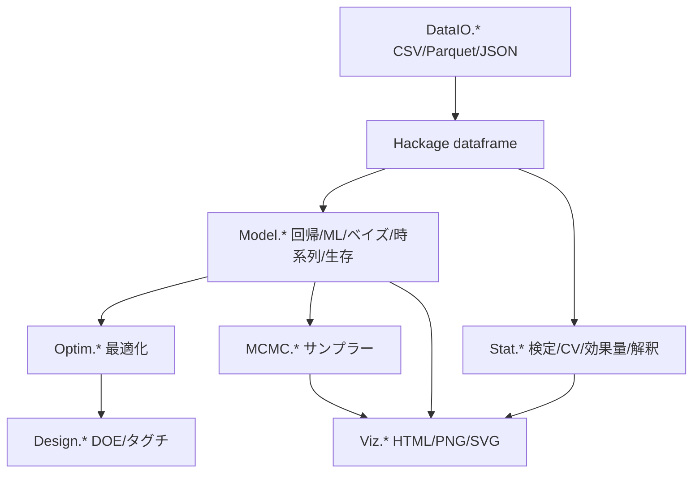

# hanalyze

> 🌐 [English](README.md) | **日本語**

[](LICENSE)
[](https://www.haskell.org/ghc/)

**型安全な汎用統計分析ツールキット (Haskell)** — 古典回帰 / 機械学習 / ベイズ MCMC / 多目的最適化 / 実験計画 / 可視化を一括カバー。
**すべての算法を Haskell で自前実装** (R/Stan/Python ブリッジなし)。
Python / R に対し **算法精度では多数の領域で同等以上**、速度では最適化系で 10-100×、機械学習系で 1.4-5× 程度。

---

## 特徴

- **型安全**: 行列次元・dtype 不一致をコンパイル時に検出。リファクタ容易
- **算法は自前実装**: 全アルゴリズムが Haskell で純実装、ブリッジなし
- **統合レポート**: 1 関数で HTML/PNG/SVG + Mermaid + 対話的 GUI 出力
- **dirty data 防衛**: 8 種類の警告 + 自動推論 (delim/header/encoding) + クリーニング DSL
- **Hackage `dataframe` 一級市民**: Polars-like DF を直接利用、Parquet/JSON ネイティブ

---

## できること

統計・機械学習・ベイズ・最適化・実験計画・可視化・データ I/O の主要機能を網羅。

| ジャンル | 機能 | モジュール | 詳細 docs |
|---|---|---|---|
| **統計推測** | 仮説検定 12 種 (t/χ²/ANOVA/Wilcoxon/KS/Shapiro/Levene/Bartlett/...) | `Stat.Test` | [docs/stat/01-test.ja.md](docs/stat/01-test.ja.md) |
| | 多重比較補正 (Bonferroni/Holm/BH/BY) | `Stat.MultipleTesting` | [06-multipletesting.ja.md](docs/stat/06-multipletesting.ja.md) |
| | Bootstrap CI / 並べ替え検定 | `Stat.Bootstrap` | [07-bootstrap.ja.md](docs/stat/07-bootstrap.ja.md) |
| | 効果量 + Power 解析 (Cohen's d/η²/V/n推定) | `Stat.Effect` | [09-effect.ja.md](docs/stat/09-effect.ja.md) |
| **回帰** | 線形回帰 / GLM (Binomial/Poisson) / GLMM (LME) | `Model.{LM,GLM,GLMM}` | [docs/regression/01-lm.ja.md](docs/regression/01-lm.ja.md) |
| | 正則化 (Ridge/Lasso/ElasticNet) | `Model.Regularized` | [04-spline-kernel-regularized.ja.md](docs/regression/04-spline-kernel-regularized.ja.md) |
| | カーネル法 (KR/NW) + GP (RBF/Matérn/Periodic + ARD) + RFF | `Model.{Kernel,GP,RFF}` | 同上 |
| | スプライン (B-spline/natural) / GAM / 分位点回帰 | `Model.{Spline,GAM,Quantile}` | [06-quantile-gam-rf.ja.md](docs/regression/06-quantile-gam-rf.ja.md) |
| | 多変量回帰 / 多出力 GP | `Model.{Multivariate,MultiGP,MultiOutput}` | [05-multivariate.ja.md](docs/regression/05-multivariate.ja.md) |
| **機械学習** | PCA + 累積寄与率 + 標準化モード | `Model.PCA` | [docs/stat/02-pca.ja.md](docs/stat/02-pca.ja.md) |
| | クラスタリング (K-means + k-means++) + silhouette | `Model.Cluster` | [05-cluster.ja.md](docs/stat/05-cluster.ja.md) |
| | 決定木 (CART 分類) | `Model.DecisionTree` | [docs/regression/08-decisiontree.ja.md](docs/regression/08-decisiontree.ja.md) |
| | ランダムフォレスト (回帰) | `Model.RandomForest` | [06-quantile-gam-rf.ja.md](docs/regression/06-quantile-gam-rf.ja.md) |
| | 時系列 (ARIMA/Holt-Winters/STL/ACF/PACF) | `Model.TimeSeries` | [09-timeseries.ja.md](docs/regression/09-timeseries.ja.md) |
| | 生存解析 (KM/Nelson-Aalen/Log-rank/Cox PH) | `Model.Survival` | [10-survival.ja.md](docs/regression/10-survival.ja.md) |
| | 分類評価 (Confusion/AUC/F1/MCC/log-loss/Brier) | `Stat.ClassMetrics` | [03-classmetrics.ja.md](docs/stat/03-classmetrics.ja.md) |
| | Cross-validation (k-fold/stratified/LOO) + Grid search | `Stat.CV` | [04-cv.ja.md](docs/stat/04-cv.ja.md) |
| | 解釈 (Permutation imp/PDP/ICE) | `Stat.Interpret` | [13-interpret.ja.md](docs/stat/13-interpret.ja.md) |
| **ベイズ** | MCMC (MH/HMC/NUTS/Gibbs/Slice) | `MCMC.*` | [docs/bayesian/](docs/bayesian/) |
| | HBM 多相 DSL (構造検査/log-joint/AD/依存 DAG の 4 解釈) | `Model.HBM` | 同上 |
| | 変分推論 (ADVI 平均場 Adam) | `Stat.VI` | 同上 |
| | モデル比較 (WAIC/PSIS-LOO/Pseudo-BMA) | `Stat.ModelSelect` | 同上 |
| | 27 種の確率分布 + 事後予測チェック | `Stat.{Distribution,PosteriorPredictive}` | [docs/02-pymc-comparison.ja.md](docs/02-pymc-comparison.ja.md) |
| **最適化** | 単目的 (NM/L-BFGS/DE/CMA-ES/SA/PSO/Brent) | `Optim.*` | [docs/optim/01-singleobj.ja.md](docs/optim/01-singleobj.ja.md) |
| | 多目的 (NSGA-II + Pareto + EHVI/ParEGO) | `Optim.{NSGA,Pareto,Acquisition}` | [02-multi-objective.ja.md](docs/optim/02-multi-objective.ja.md) |
| | ベイズ最適化 (BO + GP-Hedge + 解析勾配) | `Optim.BayesOpt` | [theory-bayesopt.ja.md](docs/optim/theory-bayesopt.ja.md) |
| **実験計画** | DOE (Factorial/Block/RSM/Optimal) | `Design.*` | [docs/doe/01-doe.ja.md](docs/doe/01-doe.ja.md) |
| | 直交表 (L4/L8/L9/L12/L16/L18) + タグチ (SN比 + 内/外配置) | `Design.{Orthogonal,Taguchi}` | [02-orthogonal-taguchi.ja.md](docs/doe/02-orthogonal-taguchi.ja.md) |
| **可視化** | 散布図 / Bar / ヒストグラム / MCMC 診断 | `Viz.{Scatter,Bar,Histogram,MCMC}` | [docs/visualization/](docs/visualization/) |
| | 統合 HTML レポート (MathJax + Mermaid + 対話的) | `Viz.ReportBuilder` | 同上 |
| **データ I/O** | CSV/TSV/SSV (cassava) + Parquet/JSON (dataframe) | `DataIO.{CSV,External}` | [docs/io/](docs/io/) |
| | dirty data 防衛 (W001-W008 + 自動 sniff + clean DSL) | `DataIO.{Health,Sniff,Clean}` | 同上 |
| | 整形 (pivot_wider/one-hot/lag-lead/rolling window) | `DataIO.Reshape` | [02-reshape.ja.md](docs/io/02-reshape.ja.md) |
| | 前処理 (impute/groupBy/derived/melt) | `DataIO.Preprocess` | [docs/io/](docs/io/) |

---

## クイックスタート

```bash
# 1. リポジトリ取得 + ビルド
git clone https://github.com/frenzieddoll/hanalyze
cd hanalyze
cabal build all                              # ライブラリ + 全実行ファイル
cabal test                                   # 238 examples を実行

# 2. CLI で使う
hanalyze regress data.csv x y --report report.html
hanalyze info data.csv
hanalyze hist data.csv x --fit Normal
```

ライブラリとして:

```haskell
import qualified Stat.Test as ST
import qualified Numeric.LinearAlgebra as LA

main = do
  let xs = LA.fromList [12, 14, 13, 15, 17, 11]
      ys = LA.fromList [18, 22, 20, 19, 25, 17]
      result = ST.tTestWelch xs ys ST.TwoSided
  print (ST.trPValue result, ST.trEffect result)
  -- (0.012, Just ("Cohen's d", -1.85))
```

詳しい入門は [docs/01-quickstart.ja.md](docs/01-quickstart.ja.md) 参照。

---

## CLI ツール

```
hanalyze help                     subcommand 一覧
hanalyze regress <file> <x> <y>   LM/GLM/GP/HBM 等の回帰 + HTML レポート
hanalyze info <file>              列ごとの型/統計
hanalyze hist <file> <col>        ヒストグラム + 理論 PDF 重ね描き
hanalyze ridge <file> ...         正則化回帰 (Ridge/Lasso/EN)
hanalyze kernel <file> ...        カーネル回帰 (NW/KR/RFF) + 多次元入力
hanalyze spline <file> ...        スプライン回帰
hanalyze multireg <file> ...      多出力回帰 + 対話的 HTML
hanalyze melt <file> ...          long-form 変換
hanalyze regrid <file> ...        time-axis grid 揃え
hanalyze doe ortho <NAME> -f ...  直交表生成
hanalyze taguchi sn / analyze     タグチメソッド
hanalyze clean <file> --rule ...  汚いデータのクリーニング
```

各コマンドの詳細フラグは `hanalyze <cmd> --help`、または [docs/01-quickstart.ja.md](docs/01-quickstart.ja.md) 参照。

---

## サンプル / デモ

`demo/` 配下に 60+ デモ。代表例:

| デモ | 概要 |
|---|---|
| `demo/regression/HBMRegressionDemo.hs` | HBM ベイズ線形回帰 + NUTS + HTML |
| `demo/regression/RFFDemo.hs` | RFF で大規模 GP の高速近似 |
| `demo/regression/RobustGPDemo.hs` | StudentT 観測尤度の頑健 GP |
| `demo/doe-optim/NSGADemo.hs` | ZDT 問題で NSGA-II + Pareto |
| `demo/doe-optim/BayesOptDemo.hs` | Branin/Hartmann6 で BO |
| `demo/bayesian/HBMComparisonDemo.hs` | WAIC/LOO で HBM 比較 |
| `demo/bayesian/SimpsonParadoxDemo.hs` | 階層モデルでパラドックスを解明 |
| `demo/io/DirtyDataDemo.hs` | 19 種の汚い CSV を自動防衛 |

実行: `dist-newstyle/build/x86_64-linux/ghc-9.6.7/hanalyze-0.1.0.0/x/<demo-name>/build/<demo-name>/<demo-name>` で起動。

---

## Python / R との比較

ベンチで比較した結果の要約 (詳細は [docs/comparison/python-r.ja.md](docs/comparison/python-r.ja.md)):

| 領域 | hanalyze の評価 | 速度 | 精度 |
|---|---|---|---|
| **単目的最適化** (DE/CMAES/L-BFGS/NM) | ✅ 圧勝 | scipy の **10-100×** 速い | scipy 4-29 桁越え (Sphere/Ackley/Levy 機械精度) |
| **多目的最適化** (NSGA-II) | ✅ 勝利 | pymoo の **1.1-1.6×** 速い | 4 ZDT/DTLZ 全問題で pymoo 越え |
| **ベイズ最適化** (BO) | ✅ 勝利 (実問題) | skopt の 2.2× 遅い | Hartmann6 で skopt 大幅越え |
| **シミュレーテッドアニーリング** (Tsallis SA) | ✅ 勝利 | 同等 | Rastrigin で 0.0 (機械精度) |
| **古典回帰** (LM/Ridge/Lasso/GLMM) | ◎ 同等以上 | sklearn の 1.04-30× 速い (LME 30×) | 同一精度 |
| **大規模 GLM/Lasso** (n ≥ 10k) | △ 劣後 | sklearn の 3-5× 遅い (Cython native) | 同一精度 |
| **カーネル/GP** | △ 劣後 | sklearn の 2.5-4.7× 遅い | 同一精度 |
| **ベイズ MCMC** (NUTS/HMC) | ✅ 純 Haskell 実装 | (PyMC との bench 未) | (todo) |
| **HBM (確率プログラミング)** | ✅ 多相 DSL | — | PyMC parity (Truncated/Censored/MvNormal/LKJ/...) |
| **仮説検定** | ◎ 統一 API | (scipy.stats と bench 未) | (todo) |
| **データ操作** (DataFrame) | ◎ 必要十分 | (pandas/dplyr と bench 未) | (todo) |
| **可視化** | ◎ Vega-Lite ベース | — | grammar of graphics 同等 |
| **時系列** (ARIMA/Holt-Winters) | 🆕 実装済 | (statsmodels と bench 未) | (todo) |
| **生存解析** (KM/Cox PH) | 🆕 実装済 | (lifelines と bench 未) | (todo) |
| **PCA/クラスタリング** | 🆕 実装済 | (sklearn と bench 未) | (todo) |

詳細・todo 比較項目は [docs/comparison/python-r.ja.md](docs/comparison/python-r.ja.md) 参照。

---

## ベンチマーク

ハイライト (詳細は [bench/results/SUMMARY.md](bench/results/SUMMARY.md)):

- **Sphere_30D/DE**: hanalyze **1.0e-26** vs scipy 2.8e-5 (**21 桁越え**)
- **Sphere_30D/L-BFGS**: hanalyze **8.1e-40** vs scipy 2.6e-11 (**29 桁越え**)
- **Rastrigin_10D/SA**: hanalyze **0.0** ⭐ (scipy 7.8e-14 と parity)
- **Hartmann6/BO**: hanalyze **-3.07** vs skopt -2.77 (越え)
- **DTLZ2_3/NSGA-II**: hanalyze 466 ms vs pymoo 758 ms (1.6× 速)
- **DE Rosenbrock_2D**: hanalyze 1.2 ms vs scipy 164 ms (134× 速)

実行: `OPENBLAS_NUM_THREADS=1 OMP_NUM_THREADS=1 cabal run bench-{regression,kernel,optim,mo,bo}`、続いて Python 側を `bench/python/bench_*.py` で実行 (詳細 [bench/README.md](bench/README.md))。

---

## アーキテクチャ



**全モジュール Hackage `dataframe` を直接やり取り**。独自 DataFrame.Core は廃止済 (Phase 0-7 で完了)。

---

## モジュール構成

```
src/
  DataIO/      — CSV/JSON/Parquet IO + 健全性検査 + sniff + clean DSL + reshape (9 mod)
  Stat/        — 検定/分布/補間/効果量/CV/Bootstrap/解釈 etc. (21 mod)
  Model/       — LM/GLM/GLMM/Spline/Kernel/GP/RFF/HBM/PCA/Cluster/Tree/TS/Survival 等 (23 mod)
  Optim/       — 単目的 (NM/LBFGS/DE/CMAES/SA/PSO) + 多目的 (NSGA/BO/Pareto) (18 mod)
  Design/      — Factorial/Block/RSM/Optimal/Orthogonal/Taguchi 等 (11 mod)
  Viz/         — Vega-Lite ベース可視化 + ReportBuilder (15 mod)
  MCMC/        — MH/HMC/NUTS/Gibbs/Slice (6 mod)
```

合計 **103 モジュール、238 テスト pass**。

---

## ビルド

```bash
cabal build all                  # ライブラリ + 全実行ファイル (60+ demo)
cabal test                       # hspec 238 examples
cabal repl                       # 対話実行
```

主要依存: `hmatrix` (BLAS/LAPACK)、`hvega` (Vega-Lite)、`statistics`、`mwc-random`、`dataframe` (Hackage Polars-like)、`massiv` (並列配列)、`ad` (自動微分)、`async`。

GHC 9.6.7 + cabal 3.14.2 で確認済。

---

## ベンチマーク実行

```bash
# 1. 共通テストデータ生成 (固定 seed、deterministic)
cabal run bench-data-gen

# 2. Haskell 側
OPENBLAS_NUM_THREADS=1 OMP_NUM_THREADS=1 \
  cabal run bench-regression bench-kernel bench-optim bench-mo bench-bo

# 3. Python 側 (venv 必要、bench/requirements.txt)
OPENBLAS_NUM_THREADS=1 OMP_NUM_THREADS=1 \
  bench/venv/bin/python bench/python/bench_regression.py
# (similarly for kernel, optim, mo, bo)

# 4. 集約 (Markdown 表)
bench/venv/bin/python bench/aggregate.py > bench/results/SUMMARY.md
```

---

## 開発・貢献

- **Issue / PR**: [github.com/frenzieddoll/hanalyze](https://github.com/frenzieddoll/hanalyze)
- **テスト追加**: `test/Spec.hs` に hspec 形式で
- **ベンチ追加**: `bench/haskell/Bench*.hs` + 対応 Python 版
- **コーディング規約**: `CONTRIBUTING.md` に詳細 (hot path で list 経由禁止、unsafe 最小限、等)

---

## ライセンス

BSD-3-Clause License — 詳細は [LICENSE](LICENSE) を参照。

## 著者

Toshiaki Honda <frenzieddoll@gmail.com>
