# hanalyze

> 🌐 [English](README.md) | **日本語**

[](LICENSE)
[](https://www.haskell.org/ghc/)

**hanalyze** は Haskell-native な統計解析エンジニアリング基盤です。回帰 / GLMM / ベイズ推論 (HMC/NUTS/Gibbs/ADVI/SMC) / ガウス過程 / 機械学習 (SVM / gradient boosting / ニューラルネット) / 生存解析 (KM / Cox / AFT / 競合リスク) / 時系列 (ARIMA / GARCH / 状態空間) / 因果探索 (LiNGAM) と処置効果推定 / 実験計画 (古典的 + カスタム最適設計) / 多目的最適化 / native plotting / HTML レポートを 1 つの API で統合します。
モデリング・最適化の主要ロジックは Haskell で実装し、線形代数計算は hmatrix/BLAS/LAPACK を利用します。**R/Stan/Python ブリッジは不要**。
ベンチマーク済みの範囲では Python/R 実装と概ね同等の結果を確認しています。性能は領域により異なり、最適化系や中小規模 MCMC では速いケースが多い一方、大規模 ML/GLM では sklearn より遅いケースがあります (詳細は下記)。

---

## 特徴

- **Haskell-native**: 型で dtype/API の取り違えを減らし、必要な形状チェックは実行時に行う
- **算法は Haskell で実装、数値計算は BLAS**: 線形代数は hmatrix/BLAS/LAPACK 経由。R/Stan/Python ブリッジ不要
- **Native plotting**: [hgg](https://github.com/frenzieddoll/hgg) 統合で 90+ の図種を実装 (別パッケージ `hanalyze-plot`、`cabal build --project-file=cabal.project.plot` でビルド) — 純 Haskell SVG 出力、ブラウザ不要 ([Gallery](#gallery) 参照)
- **HTML レポート統合**: MathJax/Mermaid + Vega-Lite 可視化を 1 関数で生成。PNG/SVG 出力は対応プロットで利用可
- **汚いデータ防衛**: 8 種類の警告 + 自動推論 (delim/header/encoding) + クリーニング DSL
- **Hackage `dataframe`**: Polars-like DF を直接利用。CSV ネイティブ、Parquet/JSON は `dataframe` 経由

---

## Gallery

下のすべての図 (および [`docs/`](docs/) に 90+ の図) は解析結果から hgg
統合を通じて直接生成されます — 純 Haskell、SVG 出力。

| | |
|:--:|:--:|
| 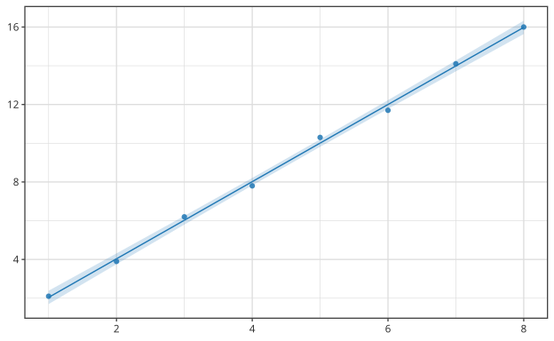<br>線形回帰 — fit + 95% CI ([docs](docs/regression/01-lm.md)) | 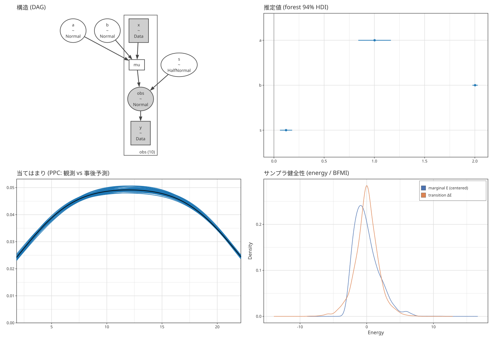<br>ベイズ MCMC dashboard — trace / density / R̂ / ESS ([docs](docs/bayesian/viz-diagnostics.md)) |
| 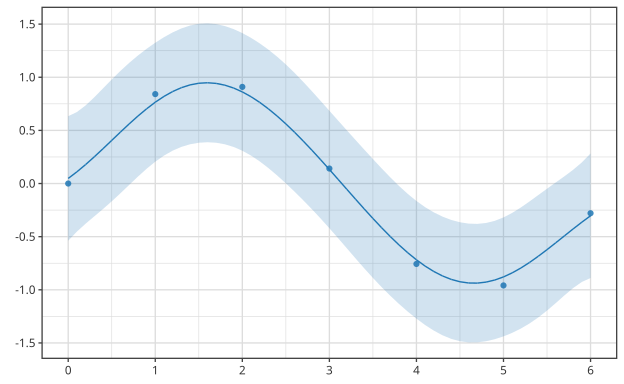<br>ガウス過程 — mean + credible band ([docs](docs/regression/04-gp.md)) | 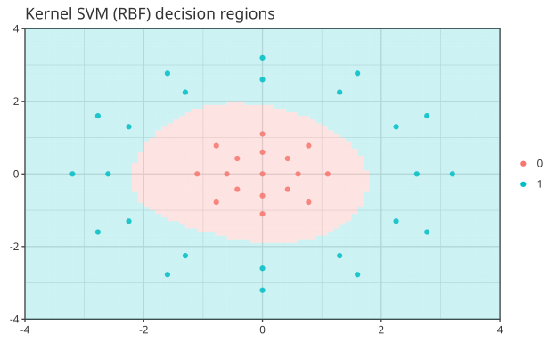<br>Kernel SVM (RBF) — decision boundary + support vectors ([docs](docs/ml/usage-ml-extensions.md)) |
| 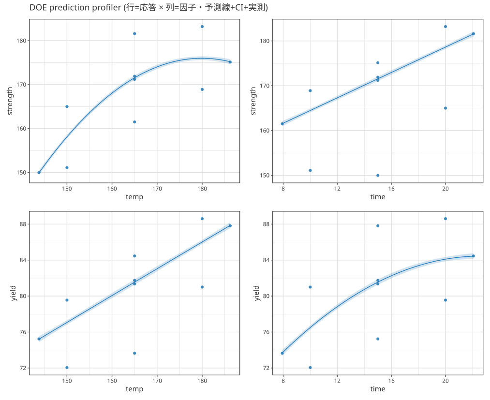<br>DOE prediction profiler — response vs 各因子 + CI ([docs](docs/api-guide/09-doe.md)) | 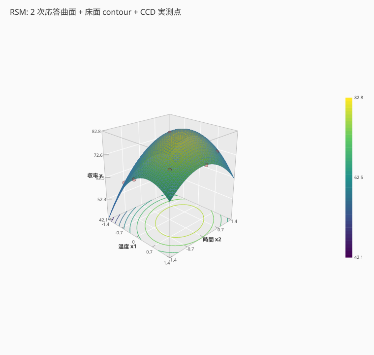<br>RSM response surface (3D) ([docs](docs/doe/01-doe.md)) |
| 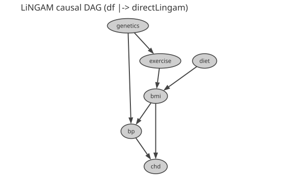<br>DirectLiNGAM 因果探索 — estimated DAG ([docs](docs/api-guide/08-causal.md)) | 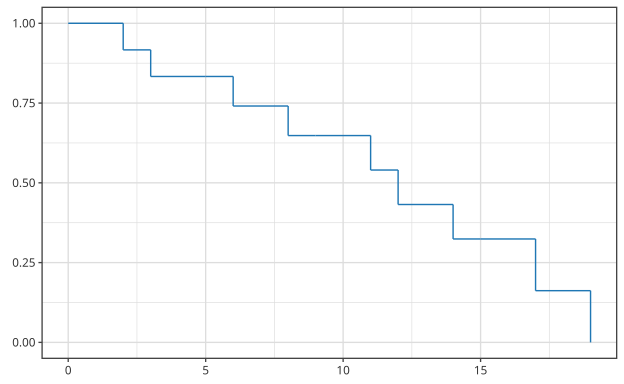<br>Kaplan-Meier 生存曲線 ([docs](docs/regression/10-survival.md)) |
| 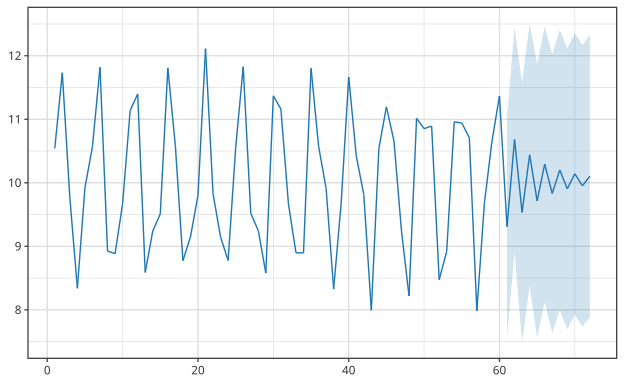<br>時系列 forecast ([docs](docs/regression/09-timeseries.md)) | 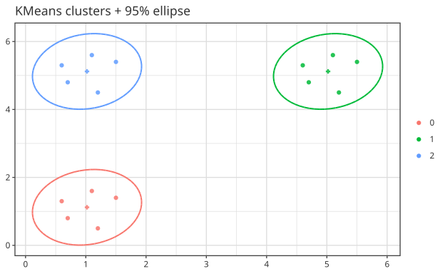<br>k-means clusters + 95% ellipses ([docs](docs/stat/05-cluster.md)) |

---

## できること

機能はジャンル別に整理し、**詳細は各ジャンルの docs と package README へ委譲**している。
全体の目次は [`docs/README.ja.md`](docs/README.ja.md)、API の網羅的な辞書は
[`docs/api-guide/`](docs/api-guide/README.md) (12 章) を参照。

| ジャンル | 主なもの | 使い方 | API |
|---|---|---|---|
| 統計推測 | 仮説検定 12 種・多重比較補正・Bootstrap CI・効果量 + Power・交差検証 | [stat/](docs/stat/) | [10 stat](docs/api-guide/10-stat.md) |
| 回帰 | LM / GLM / GLMM / ロバスト / 分位点 / 罰則付き (Ridge〜SCAD) / スプライン / GAM / GP / RFF | [regression/](docs/regression/) | [02 regression](docs/api-guide/02-regression.md) |
| 機械学習 | RandomForest / GBM / 決定木 / k-NN / Naive Bayes / SVM / MLP / MDS / PDP・ICE | [ml/](docs/ml/) | [05 ml](docs/api-guide/05-ml.md) |
| 多変量 | PCA / PLS / RRR / CCA / 判別分析 / クラスタリング / FDA | [fda/](docs/fda/) | [04 multivariate](docs/api-guide/04-multivariate.md) |
| 因果 | 傾向スコア / IPW / DR / CATE / LiNGAM 全 7 variant | [causal/](docs/causal/) | [08 causal](docs/api-guide/08-causal.md) |
| ベイズ | HBM DSL (plate・階層) / MH・HMC・NUTS・Gibbs・ADVI / 収束診断 / 事後予測 | [bayesian/](docs/bayesian/) | [03 bayesian-hbm](docs/api-guide/03-bayesian-hbm.md) |
| 時系列・生存 | AR / VAR / GARCH / カルマン / Kaplan-Meier / 競合リスク / AFT / Cox | [timeseries/](docs/timeseries/) | [06](docs/api-guide/06-timeseries.md) / [07](docs/api-guide/07-survival.md) |
| 最適化 | Nelder-Mead / L-BFGS / DE / CMA-ES / NSGA-II / ベイズ最適化 / 拡張ラグランジュ | [optim/](docs/optim/) | — |
| 実験計画 | 要因計画 / RSM / D・A・I・G 最適計画 / 直交表 / タグチ / Custom Design / 検出力 | [doe/](docs/doe/) | [09 doe](docs/api-guide/09-doe.md) |
| データ I/O | CSV / Parquet / JSON 読込・クリーニング・整形 (`Data.Transform` / `Data.Wrangle`) | [io/](docs/io/) | [11 data](docs/api-guide/11-data.md) |
| 可視化 | Vega-Lite ベースの図・統合 HTML レポート・HBM の DAG 描画 | [visualization/](docs/visualization/) | [12 plot](docs/api-guide/12-plot.md) |

**統一エントリーポイント**: どのモデルも `df |-> spec` で当てはめ、`toPlot` で描ける。
plot 連携は別 package `hanalyze-plot` にあり
(`cabal build --project-file=cabal.project.plot`)。

## インストール

### 動作環境

| 項目 | 要件 |
|---|---|
| GHC | **9.6.7** (全 package の `tested-with`) |
| cabal | 3.14.2 以上 (3.16.1 で動作確認) |
| BLAS / LAPACK | **必須**。`hmatrix` が要求する (Debian/Ubuntu: `libblas-dev liblapack-dev gfortran` / Arch: `blas lapack gcc-fortran`)。OpenBLAS は `--constraint='hmatrix +openblas'` |
| Graphviz | 任意。`ModelGraphDot` の DOT 出力を画像化する場合のみ |

### ライブラリとして使う

本リポジトリは **10 package の multi-package 構成**で、まだ package として配布して
いない。clone して自分の project の `cabal.project` に並べる。

```bash
git clone https://github.com/frenzieddoll/hanalyze
```

```cabal
-- cabal.project
packages: .
          ./hanalyze/hanalyze
          ./hanalyze/hanalyze-core
          ./hanalyze/hanalyze-frame
          ./hanalyze/hanalyze-bayes
          ./hanalyze/hanalyze-models
          ./hanalyze/hanalyze-design
          ./hanalyze/hanalyze-viz
```

`build-depends` は **迷ったら `hanalyze` 一本**でよい (module 名は層を跨いでも
変わらない)。依存を絞りたいときだけ層を直接指定する。**各 package の README に
module 地図と単体利用の例**がある。

| package | 役割 |
|---|---|
| [`hanalyze`](hanalyze/README.ja.md) | 全層を再輸出する umbrella (通常はこれ) |
| [`-core`](hanalyze-core/README.ja.md) | 記述統計・検定・最適化・数値核 |
| [`-frame`](hanalyze-frame/README.ja.md) | DataFrame 連携・読込・整形・Fit API |
| [`-models`](hanalyze-models/README.ja.md) | 回帰・機械学習・時系列・生存・因果 |
| [`-bayes`](hanalyze-bayes/README.ja.md) | MCMC・HBM |
| [`-design`](hanalyze-design/README.ja.md) | 実験計画 |
| [`-viz`](hanalyze-viz/README.ja.md) | Vega-Lite 可視化・HTML レポート |
| [`-plot`](hanalyze-plot/README.ja.md) | hgg 連携 (`toPlot`)。別 build root |
| [`-cli`](hanalyze-cli/README.ja.md) | `hanalyze` コマンド |
| [`-demos`](hanalyze-demos/README.ja.md) | demo / bench の exe 群 |

### opt-in の build root

既定の `cabal.project` は plot 非依存。用途に応じて root を切り替える。

| build root | 含むもの |
|---|---|
| `cabal.project` (既定) | library + test (plot 非依存) |
| `cabal.project.plot` | 上記 + `hanalyze-plot` (sibling の hgg が必要) |
| `cabal.project.demos` | 上記 + demo / bench の exe 群 |

### CLI だけ使う

```bash
cabal install hanalyze-cli    # hanalyze コマンドが入る
```

## クイックスタート

### 30 秒で動かす CLI

```bash
git clone https://github.com/frenzieddoll/hanalyze
cd hanalyze

# price と promo で sales を回帰し、HTML レポートを出力。
cabal run hanalyze -- regress data/readme/sales.csv "price promo" sales --report sales.html
# β₀=185.05  β(price)=-4.37  β(promo)=+32.29  R²=0.995
```

`data/readme/sales.csv` は本リポジトリ同梱の 20 行デモ CSV (`price`, `promo`,
`sales`)。生成される `sales.html` には係数表・診断・対話的予測ウィジェット
までが入っており、コマンド 1 本でそのまま共有できます。

### 30 秒で動かす Haskell API

```haskell
import qualified Hanalyze.Stat.Test as ST
import qualified Numeric.LinearAlgebra as LA

main = do
  let xs = LA.fromList [12, 14, 13, 15, 17, 11]
      ys = LA.fromList [18, 22, 20, 19, 25, 17]
      result = ST.tTestWelch xs ys ST.TwoSided
  print (ST.trPValue result, ST.trEffect result)
  -- (1.688e-3, Just ("Cohen's d", -2.527))
```

詳しい入門は [docs/01-quickstart.ja.md](docs/01-quickstart.ja.md) 参照。

---

## CLI ツール

```
hanalyze help                     subcommand 一覧
hanalyze regress <file> <x> <y>   LM/GLM/GP/HBM 等の回帰 + HTML レポート
hanalyze info <file>              列ごとの型/統計
hanalyze hist <file> <col>        ヒストグラム + 理論 PDF 重ね描き
hanalyze ridge <file> ...         正則化回帰 (Ridge/Lasso/EN)
hanalyze kernel <file> ...        カーネル回帰 (NW/KR/RFF) + 多次元入力
hanalyze spline <file> ...        スプライン回帰
hanalyze multireg <file> ...      多出力回帰 + 対話的 HTML
hanalyze melt <file> ...          long-form 変換
hanalyze regrid <file> ...        time-axis grid 揃え
hanalyze doe ortho <NAME> -f ...  直交表生成
hanalyze taguchi sn / analyze     タグチメソッド
hanalyze clean <file> --rule ...  汚いデータのクリーニング
```

各コマンドの詳細フラグは `hanalyze <cmd> --help`、または [docs/01-quickstart.ja.md](docs/01-quickstart.ja.md) 参照。

---

## サンプル / デモ

`hanalyze-demos/demo/` 配下に多数のデモ (このリリース時点で 76)。代表例:

| デモ | 概要 |
|---|---|
| `hanalyze-demos/demo/regression/HBMRegressionDemo.hs` | HBM ベイズ線形回帰 + NUTS + HTML |
| `hanalyze-demos/demo/regression/RFFDemo.hs` | RFF で大規模 GP の高速近似 |
| `hanalyze-demos/demo/regression/RobustGPDemo.hs` | StudentT 観測尤度の頑健 GP |
| `hanalyze-demos/demo/doe-optim/NSGADemo.hs` | ZDT 問題で NSGA-II + Pareto |
| `hanalyze-demos/demo/doe-optim/BayesOptDemo.hs` | Branin/Hartmann6 で BO |
| `hanalyze-demos/demo/bayesian/HBMComparisonDemo.hs` | WAIC/LOO で HBM 比較 |
| `hanalyze-demos/demo/bayesian/SimpsonParadoxDemo.hs` | 階層モデルでパラドックスを解明 |
| `hanalyze-demos/demo/io/DirtyDataDemo.hs` | 19 種の汚い CSV を自動防衛 |

実行: `dist-newstyle/build/x86_64-linux/ghc-9.6.7/hanalyze-0.2.0.0/x/<demo-name>/build/<demo-name>/<demo-name>` で起動。

---

## hanalyze が刺さる場所

Python/R を全面置換するのではなく、Haskell 統合・単一バイナリ CLI・レポート
統合が効くワークフローを主戦場に据えています。

**刺さる**

- Haskell ネイティブのパイプラインで、Python を呼ばずに統計/ベイズ/最適化を完結させたい
- 単一バイナリで配布したい (`hanalyze` 1 本で動く、Python venv 不要)
- 汚い CSV の防衛 + クリーニング + 解析を 1 ワークフローで済ませたい
- DoE / タグチ / 直交表で製造業・実験系を回したい
- 解析結果をそのまま HTML レポート化して共有したい
- 型安全な解析パイプラインで dtype/API のミスを早期に潰したい

**正面勝負を避ける**

- 大規模 DataFrame 処理 (pandas / polars / data.table を使う)
- GPU 深層学習 (PyTorch / JAX を使う)
- scikit-learn の成熟したモデル群すべて
- Stan / PyMC の MCMC 診断エコシステム全体
- ggplot2 の表現力すべて

---

## Python との比較

> R は機能対応のみ。数値ベンチは Python に対してのみ実施しています。

下の数値は `bench/results/{haskell,python}/*.csv` の最新ラン。
ベンチ条件 (`OPENBLAS_NUM_THREADS=1 OMP_NUM_THREADS=1`、single-thread、
固定 seed) は [bench/results/SUMMARY.md](bench/results/SUMMARY.md) 参照。

| 領域 | このベンチでの結果 |
|---|---|
| **単目的最適化** (DE/CMAES/L-BFGS/NM) | scipy より速いケースが多い (Rosenbrock_2D/DE 134×、Ackley/CMAES 49×、Griewank/CMAES 54×)。Sphere_30D/L-BFGS の目的関数値はこの実行で 8.1e-40 vs scipy 2.6e-11 |
| **多目的最適化** (NSGA-II) | ZDT/DTLZ 系で同等〜やや有利 (DTLZ2_3 1.43× 速、ZDT1/2/3 は pymoo と ±5%)。HV/IGD は概ね pymoo と同等以上 |
| **ベイズ最適化** (BO) | Branin で同等 (1.15×)、Hartmann6 はこの実行で -3.07 vs skopt -2.77 |
| **シミュレーテッドアニーリング** (Tsallis SA) | 同等。Rastrigin_10D はこの実行で 0.0 (scipy `dual_annealing` 7.8e-14) |
| **古典回帰** (LM/Ridge/Lasso/GLMM) | ベンチケースでは概ね同等。LME はこの実行で statsmodels 比 30× 速 |
| **大規模 GLM/Lasso** (n ≥ 10k) | sklearn より現状遅い (3-5×、Cython inner loop に追従不能) |
| **カーネル/GP** | sklearn より現状遅い (2.5-4.7×) |
| **ベイズ MCMC** (NUTS/HMC) | 8-schools で ESS 839 (blackjax 810 と同等品質)。PyMC 比 7.4× 速、blackjax 比 2.8× 遅 (JAX-JIT 構造差) |
| **HBM (確率プログラミング)** | 多相 DSL で一部の PyMC 風モデリング機能 + 一部の分布 (Truncated/Censored/MvNormal/LKJ/...) を提供 |
| **VI / WAIC / LOO** | ADVI は小規模 logistic で numpyro SVI より 3.0× 速、LOO は arviz より 2.9× 速 (ベンチケースでは) |
| **仮説検定 / Bootstrap / k-fold** | Welch t-test 39×、KS 11×、k-fold 2.2× 速 vs scipy/sklearn (ベンチケースでは) |
| **時系列 / Spline / GAM** | ARIMA 128× 速、Spline PCHIP 互角、GAM はベンチケースで pygam の 1.6× 遅 |
| **生存解析** (KM/Cox PH) | lifelines と概ね同等 |
| **多出力回帰 / Regrid** | MultiLM 2.3× 速、`regridLong` は pandas+scipy 自前合成版より 20× 速 |
| **可視化** | hvega 経由の Vega-Lite (grammar-of-graphics 系)。HTML レポート同梱 |

機能対応表は [docs/comparison/python-r.ja.md](docs/comparison/python-r.ja.md)、数値詳細は [bench/results/SUMMARY.md](bench/results/SUMMARY.md) を参照。

---

## ベンチマークハイライト

代表的な結果。各項目は **1 つのベンチ設定** での値で、絶対値は反復数・seed・
許容誤差に依存します。条件は SUMMARY を参照。
NUTS はさらに posteriordb reference posteriors に対して検証されています
([bench/posteriordb/](bench/posteriordb/) 参照)。

- **NUTS 8-schools** (warmup 500, samples 1000): hanalyze 1492 ms / ESS(mu) 839 vs blackjax 530 ms / ESS 810 (この実行)
- **Holt-Winters seasonal n=500 p=12**: hanalyze 0.19 ms vs statsmodels MLE 96 ms (この実行。なお hanalyze は固定 α=0.3 closed-form、statsmodels は MLE fit)
- **Sphere_30D/DE**: このベンチでは hanalyze 1.0e-26、scipy 2.8e-5
- **Sphere_30D/L-BFGS**: このベンチでは hanalyze 8.1e-40、scipy 2.6e-11
- **Rastrigin_10D/SA**: この実行で hanalyze 0.0、scipy `dual_annealing` 7.8e-14
- **Hartmann6/BO**: この実行で hanalyze -3.07、skopt -2.77
- **DTLZ2_3/NSGA-II**: hanalyze 528 ms vs pymoo 758 ms (この実行で 1.43× 速)
- **DE Rosenbrock_2D**: hanalyze 1.2 ms vs scipy 164 ms (この実行で 134× 速)
- **Constrained Quad2D (eq)**: hanalyze 0.062 ms vs scipy SLSQP 0.69 ms (この実行)
- **regridLong (jagged long-form)**: hanalyze 0.99 ms vs pandas+scipy 合成 19.4 ms (この実行)

再現: `OPENBLAS_NUM_THREADS=1 OMP_NUM_THREADS=1 cabal run bench-{regression,kernel,optim,mo,bo,mcmc-b7,mcmc-extras,ts-extras,optim-plus,stat-util,multi-output,regrid}`、続いて Python 側を `bench/python/bench_*.py` で実行 (詳細 [bench/README.md](bench/README.md))。

---

## アーキテクチャ

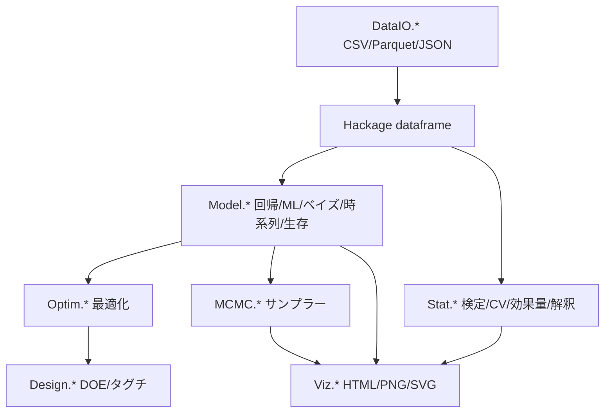
```mermaid
graph TD
  IO[DataIO.* CSV/Parquet/JSON]
  IO --> DF[Hackage dataframe]
  DF --> Models[Model.* 回帰/ML/ベイズ/時系列/生存]
  DF --> Stat[Stat.* 検定/CV/効果量/解釈]
  Models --> Optim[Optim.* 最適化]
  Models --> MCMC[MCMC.* サンプラー]
  Models --> Viz[Viz.* HTML/PNG/SVG]
  Stat --> Viz
  MCMC --> Viz
  Optim --> Design[Design.* DOE/タグチ]
```

**全モジュール Hackage `dataframe` を直接やり取り**。独自 DataFrame.Core は廃止済。

---

## ロードマップと API 安定性

- **Stable** (minor 更新で API 後方互換を維持予定): `Hanalyze.DataIO.*`、`Hanalyze.Stat.{Test, Bootstrap, MultipleTesting, ClassMetrics, CV, Effect, Distribution}`、`Hanalyze.Model.{LM, GLM, Spline, Regularized, RandomForest, DecisionTree, TimeSeries, Survival, GAM}`、`Hanalyze.Optim.{NelderMead, LBFGS, DifferentialEvolution, CMAES, NSGA, BayesOpt, SimulatedAnnealing, ParticleSwarm}`、`Hanalyze.Design.*`、`Hanalyze.Viz.{Scatter, Bar, Histogram}`
- **Experimental** (API は変動の可能性): `Hanalyze.Model.HBM` DSL、`Hanalyze.MCMC.NUTS` (mass-matrix adaptation は opt-in)、`Hanalyze.Stat.VI` (ADVI)、`Hanalyze.Model.{GP, RFF, GPRobust, GLMM}`、`Hanalyze.Model.{SVM, GradientBoosting, NeuralNetwork}`、`Hanalyze.Model.LiNGAM.*`、`Hanalyze.Design.Custom.*`、`df |-> spec` fit 演算子 (`Hanalyze.Fit`)、hgg 統合 (別パッケージ `hanalyze-plot`)、`Hanalyze.Viz.ReportBuilder`。挙動はベンチで検証済ですが型シグネチャが変わる可能性あり
- **将来検討**: hmatrix/Massiv/Accelerate を切替えるバックエンド typeclass。実装スケジュールは未定。(以前計画していたトップレベル統一 API と fit 演算子 API は 0.2.0.0 で `module Hanalyze` と `Hanalyze.Fit` として実現済み。)

---

## モジュール構成

module 名は package を跨いでも `Hanalyze.*` で一貫している (どの層に居るかを
利用者が意識しなくてよい)。どの package に何があるかは
[インストール](#インストール)の package 表と、各 package の README を参照。

212 module / 2417 テスト例。

---

## ビルド

```bash
cabal build all                                    # library + test (plot 非依存)
cabal test all                                     # hspec test suite
cabal build all --project-file=cabal.project.plot  # + plot 連携 (sibling の hgg が必要)
cabal build all --project-file=cabal.project.demos # + demo / bench の exe 群
```

主要依存: `hmatrix` (BLAS/LAPACK)・`hvega` (Vega-Lite)・`statistics`・`mwc-random`・
`dataframe`・`massiv` (並列配列)・`ad` (自動微分)・`async`。

GHC 9.6.7 + cabal 3.14.2 で確認済。

---

## ベンチマーク実行

```bash
# 1. 共通テストデータ生成 (固定 seed、deterministic)
#    bench の exe は demos package にあるので build root を指定する
cabal run --project-file=cabal.project.demos bench-data-gen

# 2. Haskell 側
OPENBLAS_NUM_THREADS=1 OMP_NUM_THREADS=1 \
  cabal run --project-file=cabal.project.demos \
    bench-regression bench-kernel bench-optim bench-mo bench-bo

# 3. Python 側 (venv 必要、bench/requirements.txt)
OPENBLAS_NUM_THREADS=1 OMP_NUM_THREADS=1 \
  bench/venv/bin/python bench/python/bench_regression.py
# (similarly for kernel, optim, mo, bo)

# 4. 集約 (Markdown 表)
bench/venv/bin/python bench/aggregate.py > bench/results/SUMMARY.md
```

---

## 開発・貢献

- **Issue / PR**: [github.com/frenzieddoll/hanalyze](https://github.com/frenzieddoll/hanalyze)
- **テスト追加**: `test/Spec.hs` に hspec 形式で
- **ベンチ追加**: `hanalyze-demos/bench/haskell/Bench*.hs` + 対応 Python 版
- **コーディング規約**: `CONTRIBUTING.md` に詳細 (hot path で list 経由禁止、unsafe 最小限、等)

---

## ライセンス

BSD-3-Clause License — 詳細は [LICENSE](LICENSE) を参照。

## 著者

Toshiaki Honda <frenzieddoll@gmail.com>
