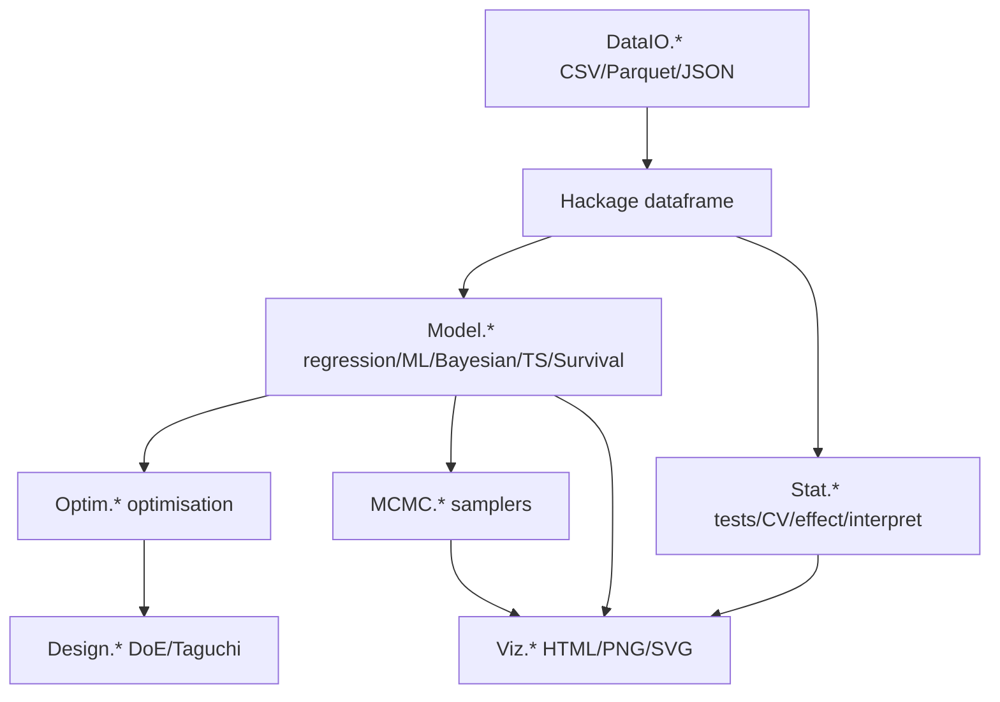

# hanalyze

> 🌐 **English** | [日本語](README.ja.md)

[](LICENSE)
[](https://www.haskell.org/ghc/)

**hanalyze** is a Haskell-native statistical engineering toolkit: regression, GLMM, Bayesian inference (HMC/NUTS/Gibbs/ADVI), Gaussian processes, design of experiments, multi-objective optimisation, and HTML reporting integrated under one API.
Core modelling and optimisation logic is implemented in Haskell, with numerical linear algebra delegated to hmatrix/BLAS/LAPACK. **No R/Stan/Python bridge required**.
Benchmarks (see below) show competitive accuracy with Python/R references in the tested cases. Performance varies by domain: optimisation and small-to-medium MCMC workloads are often faster in these benchmarks, while large-scale ML/GLM workloads are currently slower than sklearn.

---

## Highlights

- **Haskell-native**: types catch many dtype/API mismatches; shape checks happen at runtime where needed
- **Algorithms in Haskell, BLAS for numerics**: hmatrix/BLAS/LAPACK powers linear algebra; no R/Stan/Python bridge
- **HTML reporting**: MathJax/Mermaid + Vega-Lite visualisations in one call; PNG/SVG export available for supported plots
- **Dirty-data defence**: 8 warning codes + auto-sniff (delim/header/encoding) + cleaning DSL
- **Hackage `dataframe`**: Polars-like DataFrame used directly; CSV native, Parquet/JSON support through `dataframe`

---

## Capabilities

Features grouped by category. Each capability links to a usage doc and (where relevant) a theory doc.

### Statistical inference (`Stat.*`)

| Feature | Module | Usage | Theory |
|---|---|---|---|
| 12 hypothesis tests (t/χ²/ANOVA/Wilcoxon/KS/Shapiro/Levene/Bartlett/...) | `Stat.Test` | [stat/01-test.md](docs/stat/01-test.md) | — |
| Multiple-testing correction (Bonferroni/Holm/BH/BY) | `Stat.MultipleTesting` | [stat/06-multipletesting.md](docs/stat/06-multipletesting.md) | — |
| Bootstrap CI / permutation tests | `Stat.Bootstrap` | [stat/07-bootstrap.md](docs/stat/07-bootstrap.md) | — |
| Effect size + power analysis (Cohen's d/η²/Cramér V/n estimation) | `Stat.Effect` | [stat/09-effect.md](docs/stat/09-effect.md) | — |
| Cross-validation (k-fold/stratified/LOO) + Grid search | `Stat.CV` | [stat/04-cv.md](docs/stat/04-cv.md) | — |

### Regression (`Model.*`)

| Feature | Module | Usage | Theory |
|---|---|---|---|
| Linear regression (LM) + inference stats (SE/t/p, F, AIC/BIC, leverage, Cook's) | `Model.LM` / `Model.LM.Diagnostics` | [regression/01-lm.md](docs/regression/01-lm.md) | [principles/lm.md](docs/principles/lm.md) |
| GLM (Binomial / Poisson / Gaussian) | `Model.GLM` | [regression/02-glm.md](docs/regression/02-glm.md) | [principles/glm.md](docs/principles/glm.md) |
| GLMM / mixed-effects model (LME) | `Model.GLMM` | [regression/03-glmm.md](docs/regression/03-glmm.md) | [principles/glmm.md](docs/principles/glmm.md) |
| Spline regression (B-spline / NaturalCubic) | `Model.Spline` | [regression/04-spline.md](docs/regression/04-spline.md) | [regression/theory-regression-extensions.md](docs/regression/theory-regression-extensions.md) |
| Kernel regression (NW / Kernel Ridge) + multi-D inputs | `Model.Kernel` | [regression/04-kernel.md](docs/regression/04-kernel.md) | same |
| Regularised (Ridge / Lasso / ElasticNet) | `Model.Regularized` | [regression/04-regularized.md](docs/regression/04-regularized.md) | same |
| Gaussian process (RBF / Matérn / Periodic + ARD + multi-input) | `Model.GP` | [regression/04-gp.md](docs/regression/04-gp.md) | [principles/gp.md](docs/principles/gp.md) |
| Random Fourier Features (large-scale GP approximation) | `Model.RFF` | [regression/04-rff.md](docs/regression/04-rff.md) | [regression/theory-regression-extensions.md](docs/regression/theory-regression-extensions.md) |
| Multivariate regression / Multi-output GP | `Model.{Multivariate,MultiGP,MultiOutput}` | [regression/05-multivariate.md](docs/regression/05-multivariate.md) | [regression/theory-multivariate.md](docs/regression/theory-multivariate.md) |
| Quantile regression | `Model.Quantile` | [regression/06-quantile.md](docs/regression/06-quantile.md) | [regression/theory-regression-extensions.md](docs/regression/theory-regression-extensions.md) |
| Generalized additive model (GAM) | `Model.GAM` | [regression/06-gam.md](docs/regression/06-gam.md) | same |
| Random forest (regression) | `Model.RandomForest` | [regression/06-randomforest.md](docs/regression/06-randomforest.md) | same |
| Multi-output regression + interactive HTML | `Model.MultiOutput` | [regression/07-multireg.md](docs/regression/07-multireg.md) | [regression/theory-multivariate.md](docs/regression/theory-multivariate.md) |

### Machine learning (`Model.*` / `Stat.*`)

| Feature | Module | Usage | Theory |
|---|---|---|---|
| PCA + cumulative variance + standardisation | `Model.PCA` | [stat/02-pca.md](docs/stat/02-pca.md) | — |
| Clustering (K-means + k-means++ + silhouette) | `Model.Cluster` | [stat/05-cluster.md](docs/stat/05-cluster.md) | — |
| Decision tree (CART classifier) | `Model.DecisionTree` | [regression/08-decisiontree.md](docs/regression/08-decisiontree.md) | — |
| Time series (ARIMA / Holt-Winters / STL / ACF / PACF) | `Model.TimeSeries` | [regression/09-timeseries.md](docs/regression/09-timeseries.md) | — |
| Survival analysis (Kaplan-Meier / Nelson-Aalen / Log-rank / Cox PH) | `Model.Survival` | [regression/10-survival.md](docs/regression/10-survival.md) | — |
| Classification metrics (Confusion / AUC / F1 / MCC / log-loss / Brier) | `Stat.ClassMetrics` | [stat/03-classmetrics.md](docs/stat/03-classmetrics.md) | — |
| Model interpretation (Permutation imp / PDP / ICE) | `Stat.Interpret` | [stat/13-interpret.md](docs/stat/13-interpret.md) | — |

### Bayesian (`MCMC.*` / `Stat.*` / `Model.HBM`)

| Feature | Module | Usage | Theory |
|---|---|---|---|
| 27 probability distributions (Truncated/Censored/MvNormal/LKJ/Multinomial/...) | `Stat.Distribution` | [bayesian/01-distributions.md](docs/bayesian/01-distributions.md) | [bayesian/theory-distributions.md](docs/bayesian/theory-distributions.md) |
| Probabilistic model DSL (HBM polymorphic free monad, incl. `deterministic` / `dataNamed`) | `Model.HBM` | [bayesian/02-probabilistic-model.md](docs/bayesian/02-probabilistic-model.md) | [principles/hbm.md](docs/principles/hbm.md) |
| MCMC samplers (MH / HMC / NUTS / Slice) | `MCMC.{MH,HMC,NUTS,Slice}` | [bayesian/03-mcmc-samplers.md](docs/bayesian/03-mcmc-samplers.md) | [bayesian/theory-mcmc.md](docs/bayesian/theory-mcmc.md) / [theory-hmc-nuts.md](docs/bayesian/theory-hmc-nuts.md) |
| Gibbs sampling (auto-conjugate detection + hybrid) | `MCMC.Gibbs` | [bayesian/04-gibbs.md](docs/bayesian/04-gibbs.md) | [bayesian/theory-mcmc.md](docs/bayesian/theory-mcmc.md) |
| Variational inference (ADVI mean-field Adam) | `Stat.VI` | [bayesian/05-vi.md](docs/bayesian/05-vi.md) | [bayesian/theory-advanced.md](docs/bayesian/theory-advanced.md) |
| Model comparison (WAIC / PSIS-LOO / Pseudo-BMA) | `Stat.ModelSelect` | [bayesian/06-model-comparison.md](docs/bayesian/06-model-comparison.md) | [bayesian/theory-bayesian-basics.md](docs/bayesian/theory-bayesian-basics.md) |
| Posterior predictive checks; selected PyMC-style modelling features | `Stat.PosteriorPredictive` | [02-pymc-comparison.md](docs/02-pymc-comparison.md) | — |

### Optimisation (`Optim.*`)

| Feature | Module | Usage | Theory |
|---|---|---|---|
| Single-obj (gradient): NM / L-BFGS / Brent | `Optim.NelderMead`<br>`Optim.LBFGS`<br>`Optim.LineSearch` | [optim/01-singleobj.md](docs/optim/01-singleobj.md) | [optim/theory-singleobj.md](docs/optim/theory-singleobj.md) |
| Single-obj (evolutionary): DE / CMA-ES / SA / PSO | `Optim.DifferentialEvolution`<br>`Optim.CMAES`<br>`Optim.SimulatedAnnealing`<br>`Optim.ParticleSwarm` | [optim/01-singleobj.md](docs/optim/01-singleobj.md) | [optim/theory-singleobj.md](docs/optim/theory-singleobj.md) |
| Multi-objective (NSGA-II + Pareto) | `Optim.{NSGA,Pareto}` | [optim/02-multi-objective.md](docs/optim/02-multi-objective.md) | [optim/theory-pareto-moo.md](docs/optim/theory-pareto-moo.md) |
| Acquisition functions (EHVI / ParEGO / EI / LCB / PI) | `Optim.Acquisition` | [optim/02-multi-objective.md](docs/optim/02-multi-objective.md) | [optim/theory-bayesopt.md](docs/optim/theory-bayesopt.md) |
| Bayesian optimisation (BO + GP-Hedge + analytic gradient) | `Optim.BayesOpt` | [optim/01-singleobj.md](docs/optim/01-singleobj.md) | [optim/theory-bayesopt.md](docs/optim/theory-bayesopt.md) |
| Algorithm selection guide | — | [optim/03-algorithm-guide.md](docs/optim/03-algorithm-guide.md) | — |

### Design of experiments (`Design.*`)

| Feature | Module | Usage | Theory |
|---|---|---|---|
| DoE (Factorial / Block / Mixed / RSM / Optimal / Power / Quality) | `Design.{Factorial,Block,Mixed,RSM,Optimal,Power,Quality,MultiRSM,Anova}` | [doe/01-doe.md](docs/doe/01-doe.md) | [doe/theory-doe.md](docs/doe/theory-doe.md) |
| Orthogonal arrays (L4/L8/L9/L12/L16/L18) + Taguchi (S/N + inner/outer) + process capability (Cp/Cpk) | `Design.{Orthogonal,Taguchi,Quality}` | [doe/02-orthogonal-taguchi.md](docs/doe/02-orthogonal-taguchi.md) | [doe/theory-doe.md](docs/doe/theory-doe.md) |

### Visualisation (`Viz.*`)

| Feature | Module | Usage |
|---|---|---|
| Scatter / bar / histograms / MCMC diagnostics / GP plot / Pareto plot | `Viz.{Scatter,Bar,Histogram,MCMC,GP,Pareto,ModelGraph,Taguchi}` | [visualization/01-visualization.md](docs/visualization/01-visualization.md) |
| Integrated HTML report (MathJax + Mermaid + interactive) | `Viz.ReportBuilder` | [visualization/02-report-builder.md](docs/visualization/02-report-builder.md) |

### Data I/O (`DataIO.*`)

| Feature | Module | Usage |
|---|---|---|
| CSV/TSV/SSV (cassava) + Parquet/JSON (Hackage `dataframe`) | `DataIO.{CSV,External,Convert}` | [io/01-dirty-data.md](docs/io/01-dirty-data.md) |
| Dirty-data defence (W001-W008 warnings + auto-sniff + clean DSL) | `DataIO.{Health,Sniff,Clean,Log}` | [io/01-dirty-data.md](docs/io/01-dirty-data.md) |
| Reshape (pivot_wider / one-hot / lag-lead / rolling window) | `DataIO.Reshape` | [io/02-reshape.md](docs/io/02-reshape.md) |
| Preprocessing (impute / groupBy / derived columns / melt) | `DataIO.Preprocess` | [io/01-dirty-data.md](docs/io/01-dirty-data.md) |
| Long-form regrid (`regridLong`) | `DataIO.Preprocess` + `Stat.Interpolate` | [io/03-regrid.md](docs/io/03-regrid.md) |

---

## Quick start

### 30 seconds via CLI

```bash
git clone https://github.com/frenzieddoll/hanalyze
cd hanalyze
cabal build all

# Regress sales on price + promo, write an HTML report.
hanalyze regress data/readme/sales.csv "price promo" sales --report sales.html
# β₀=185.05  β(price)=-4.37  β(promo)=+32.29  R²=0.995
```

`data/readme/sales.csv` is a 20-row demo CSV shipped with the repository
(`price`, `promo`, `sales`). The generated `sales.html` includes coefficients,
fit diagnostics, and an interactive prediction widget — straight from one
command.

### 30 seconds via Haskell API

```haskell
import qualified Stat.Test as ST
import qualified Numeric.LinearAlgebra as LA

main = do
  let xs = LA.fromList [12, 14, 13, 15, 17, 11]
      ys = LA.fromList [18, 22, 20, 19, 25, 17]
      result = ST.tTestWelch xs ys ST.TwoSided
  print (ST.trPValue result, ST.trEffect result)
  -- (0.012, Just ("Cohen's d", -1.85))
```

See [docs/01-quickstart.md](docs/01-quickstart.md) for a fuller introduction.

---

## CLI

```
hanalyze help                     list subcommands
hanalyze regress <file> <x> <y>   LM/GLM/GP/HBM regression + HTML report
hanalyze info <file>              per-column type/statistics
hanalyze hist <file> <col>        histogram with theoretical PDF overlay
hanalyze ridge <file> ...         regularised regression (Ridge/Lasso/EN)
hanalyze kernel <file> ...        kernel regression (NW/KR/RFF), multi-D inputs
hanalyze spline <file> ...        spline regression
hanalyze multireg <file> ...      multi-output regression + interactive HTML
hanalyze melt <file> ...          long-form transform
hanalyze regrid <file> ...        time-axis grid alignment
hanalyze doe ortho <NAME> -f ...  orthogonal-array generation
hanalyze taguchi sn / analyze     Taguchi method
hanalyze clean <file> --rule ...  dirty-data cleaning
```

For per-command flags, run `hanalyze <cmd> --help` or see [docs/01-quickstart.md](docs/01-quickstart.md).

---

## Examples / demos

`demo/` contains many demos (60+ as of this release). Highlights:

| Demo | Summary |
|---|---|
| `demo/regression/HBMRegressionDemo.hs` | HBM Bayesian linear regression with NUTS + HTML |
| `demo/regression/RFFDemo.hs` | Large-scale GP via Random Fourier Features |
| `demo/regression/RobustGPDemo.hs` | Robust GP with Student-t observation likelihood |
| `demo/doe-optim/NSGADemo.hs` | NSGA-II + Pareto on the ZDT suite |
| `demo/doe-optim/BayesOptDemo.hs` | BO on Branin / Hartmann6 |
| `demo/bayesian/HBMComparisonDemo.hs` | Compare HBMs with WAIC / LOO |
| `demo/bayesian/SimpsonParadoxDemo.hs` | Disentangle Simpson's paradox via hierarchical model |
| `demo/io/DirtyDataDemo.hs` | Auto-defend against 19 dirty CSV variants |

Run: `dist-newstyle/build/x86_64-linux/ghc-9.6.7/hanalyze-0.1.0.0/x/<demo-name>/build/<demo-name>/<demo-name>`.

---

## Where hanalyze fits

Rather than a complete Python/R replacement, hanalyze targets specific
workflows where Haskell integration, single-binary CLI, and tight reporting
add value.

**Strong fit**

- Haskell-native pipelines that need stats/Bayes/optim without calling out to Python
- Single-binary CLI distribution (one `hanalyze` binary, no Python venv)
- Dirty-CSV defence + cleaning + analysis in one workflow
- DoE / Taguchi / orthogonal arrays for manufacturing and process tuning
- HTML reports straight from the analysis (no separate templating step)
- Type-safe analysis pipelines that catch dtype/API mismatches early

**Not a goal — keep using existing tools for**

- Large-scale DataFrame work (pandas / polars / data.table)
- GPU deep learning (PyTorch / JAX)
- The full breadth of scikit-learn's mature model zoo
- The full Stan / PyMC MCMC diagnostics ecosystem
- The full expressive range of ggplot2

---

## Comparison vs Python

> R is included in the feature map only — no numerical bench against R has been run.

Numbers below come from `bench/results/{haskell,python}/*.csv`; see
[bench/results/SUMMARY.md](bench/results/SUMMARY.md) for the full table and
benchmark conditions (`OPENBLAS_NUM_THREADS=1 OMP_NUM_THREADS=1`,
single-thread, deterministic seeds).

| Domain | Result in these benchmarks |
|---|---|
| **Single-objective optim** (DE/CMAES/L-BFGS/NM) | Often faster than scipy in tested cases (Rosenbrock_2D/DE 134×, Ackley/CMAES 49×, Griewank/CMAES 54×). On Sphere_30D/L-BFGS the reported objective value is 8.1e-40 vs scipy 2.6e-11 in this run. |
| **Multi-objective optim** (NSGA-II) | Comparable or favourable in the ZDT/DTLZ suite (DTLZ2_3 1.43× faster, ZDT1/2/3 within ±5% of pymoo). HV/IGD figures match or slightly improve on pymoo in these runs. |
| **Bayesian optim** (BO) | Comparable on Branin (1.15×); on Hartmann6 the best objective in this run was -3.07 vs skopt -2.77. |
| **Simulated annealing** (Tsallis SA) | Comparable; Rastrigin_10D reaches 0.0 in this run (scipy `dual_annealing` reports 7.8e-14). |
| **Classical regression** (LM/Ridge/Lasso/GLMM) | Comparable in tested cases; LME 30× faster than statsmodels in our LME run. |
| **Large-scale GLM/Lasso** (n ≥ 10k) | Currently slower than sklearn (3-5× in tested cases) — sklearn's Cython inner loops dominate. |
| **Kernel/GP** | Currently slower than sklearn (2.5-4.7× in tested cases). |
| **Bayesian MCMC** (NUTS/HMC) | NUTS with ESS comparable to blackjax (mu: 839 vs 810) on the 8-schools benchmark; 7.4× faster than PyMC; 2.8× slower than blackjax (JAX-JIT advantage). |
| **HBM (probabilistic programming)** | Polymorphic DSL with selected PyMC-style modelling features and selected distributions (Truncated/Censored/MvNormal/LKJ/...). |
| **VI / WAIC / LOO** | ADVI 3.0× faster than numpyro SVI on a small logistic posterior; LOO 2.9× faster than arviz on (S=1000, N=200) log-lik matrix. |
| **Hypothesis tests / bootstrap / k-fold** | Welch t-test 39× faster, KS 11×, k-fold split 2.2× faster than scipy/sklearn in tested cases. |
| **Time series / Spline / GAM** | ARIMA 128× faster than statsmodels; Spline PCHIP comparable to scipy; GAM ~1.6× slower than pygam in tested cases. |
| **Survival analysis** (KM/Cox PH) | Comparable to lifelines in tested cases (KM/CoxPH). |
| **Multi-output regression / Regrid** | MultiLM 2.3× faster than sklearn; `regridLong` 20× faster than a hand-written pandas+scipy synthesis. |
| **Visualisation** | Vega-Lite specs via hvega (grammar-of-graphics-style); HTML reports built-in. |

See [docs/comparison/python-r.md](docs/comparison/python-r.md) for the feature map, and [bench/results/SUMMARY.md](bench/results/SUMMARY.md) for numbers.

---

## Benchmark highlights

Selected results from `bench/results/SUMMARY.md`. Each entry is a single
benchmark configuration; absolute objective values depend on iteration
counts, seeds, and tolerances — see the SUMMARY for full conditions.

- **NUTS 8-schools** (warmup 500, samples 1000): hanalyze 1492 ms with ESS(mu) 839 vs blackjax 530 ms / ESS 810 in this run
- **Holt-Winters seasonal n=500 p=12**: hanalyze 0.19 ms vs statsmodels MLE 96 ms in this run (note: hanalyze uses fixed α=0.3 closed-form; statsmodels does MLE)
- **Sphere_30D/DE**: hanalyze 1.0e-26 vs scipy 2.8e-5 on this benchmark
- **Sphere_30D/L-BFGS**: hanalyze 8.1e-40 vs scipy 2.6e-11 on this benchmark
- **Rastrigin_10D/SA**: hanalyze 0.0 vs scipy `dual_annealing` 7.8e-14 in this run
- **Hartmann6/BO**: hanalyze -3.07 vs skopt -2.77 in this run
- **DTLZ2_3/NSGA-II**: hanalyze 528 ms vs pymoo 758 ms (1.43× faster in this run)
- **DE Rosenbrock_2D**: hanalyze 1.2 ms vs scipy 164 ms (134× faster in this run)
- **Constrained Quad2D (eq)**: hanalyze 0.062 ms vs scipy SLSQP 0.69 ms in this run
- **regridLong on jagged long-form**: hanalyze 0.99 ms vs pandas+scipy synthesis 19.4 ms in this run

Reproduce: `OPENBLAS_NUM_THREADS=1 OMP_NUM_THREADS=1 cabal run bench-{regression,kernel,optim,mo,bo,mcmc-b7,mcmc-extras,ts-extras,optim-plus,stat-util,multi-output,regrid}`, then `bench/python/bench_*.py` (see [bench/README.md](bench/README.md)).

---

## Architecture



**All modules talk to Hackage `dataframe` directly**. The internal `DataFrame.Core` was retired.

---

## Roadmap & API stability

- **Stable** (API expected to remain backward-compatible within minor versions): `DataIO.*`, `Stat.{Test, Bootstrap, MultipleTesting, ClassMetrics, CV, Effect, Distribution}`, `Model.{LM, GLM, Spline, Regularized, RandomForest, DecisionTree, TimeSeries, Survival, GAM}`, `Optim.{NelderMead, LBFGS, DifferentialEvolution, CMAES, NSGA, BayesOpt, SimulatedAnnealing, ParticleSwarm}`, `Design.*`, `Viz.{Scatter, Bar, Histogram}`.
- **Experimental** (API may evolve): `Model.HBM` DSL, `MCMC.NUTS` (mass-matrix adaptation is opt-in), `Stat.VI` (ADVI), `Model.{GP, RFF, GPRobust, GLMM}`, `Viz.ReportBuilder`. Behaviour is benchmarked but type signatures may shift.
- **Future direction**: a unified top-level `Hanalyze.*` re-export layer, a Pipeline-style `Unfitted → Fitted` API, and a backend-abstraction typeclass for swapping hmatrix/Massiv/Accelerate are under consideration but not on a fixed schedule.

---

## Module layout

```
src/
  DataIO/      — CSV/JSON/Parquet IO + health checks + sniff + clean DSL + reshape (9 mods)
  Stat/        — tests/distributions/interpolation/effect/CV/bootstrap/interpret etc. (21 mods)
  Model/       — LM/GLM/GLMM/Spline/Kernel/GP/RFF/HBM/PCA/Cluster/Tree/TS/Survival (23 mods)
  Optim/       — single-obj (NM/LBFGS/DE/CMAES/SA/PSO) + multi-obj (NSGA/BO/Pareto) (18 mods)
  Design/      — Factorial/Block/RSM/Optimal/Orthogonal/Taguchi (11 mods)
  Viz/         — Vega-Lite-based visualisation + ReportBuilder (15 mods)
  MCMC/        — MH/HMC/NUTS/Gibbs/Slice (6 mods)
```

As of this release: 103 modules, 238 tests.

---

## Build

```bash
cabal build all                  # library + all executables (60+ demos)
cabal test                       # hspec test suite
cabal repl                       # interactive REPL
```

Major dependencies: `hmatrix` (BLAS/LAPACK), `hvega` (Vega-Lite), `statistics`, `mwc-random`, `dataframe` (Hackage Polars-like), `massiv` (parallel arrays), `ad` (auto-diff), `async`.

Tested on GHC 9.6.7 + cabal 3.14.2.

---

## Running benchmarks

```bash
# 1. Generate shared test data (fixed-seed, deterministic)
cabal run bench-data-gen

# 2. Haskell side
OPENBLAS_NUM_THREADS=1 OMP_NUM_THREADS=1 \
  cabal run bench-regression bench-kernel bench-optim bench-mo bench-bo

# 3. Python side (need bench/venv from bench/requirements.txt)
OPENBLAS_NUM_THREADS=1 OMP_NUM_THREADS=1 \
  bench/venv/bin/python bench/python/bench_regression.py
# (similarly for kernel, optim, mo, bo)

# 4. Aggregate (Markdown table)
bench/venv/bin/python bench/aggregate.py > bench/results/SUMMARY.md
```

---

## Development

- **Issues / PRs**: [github.com/frenzieddoll/hanalyze](https://github.com/frenzieddoll/hanalyze)
- **Adding tests**: append hspec specs in `test/Spec.hs`
- **Adding benchmarks**: place `bench/haskell/Bench*.hs` and matching Python script
- **Coding rules**: see `CONTRIBUTING.md` (no list-passing on hot paths, minimise `unsafe*`, ...)

---

## License

BSD-3-Clause License — see [LICENSE](LICENSE).

## Author

Toshiaki Honda <frenzieddoll@gmail.com>
