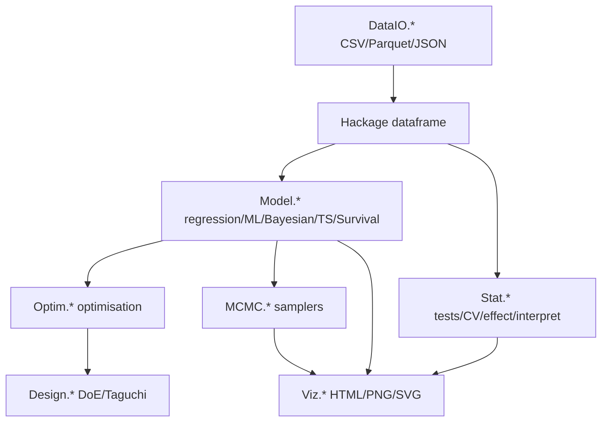

# hanalyze

> 🌐 **English** | [日本語](README.ja.md)

[](https://github.com/frenzieddoll/hanalyze/blob/v0.2.0.1/LICENSE)
[](https://www.haskell.org/ghc/)

**hanalyze** is a Haskell-native statistical engineering toolkit: regression, GLMM, Bayesian inference (HMC/NUTS/Gibbs/ADVI/SMC), Gaussian processes, machine learning (SVM / gradient boosting / neural networks), survival analysis (KM / Cox / AFT / competing risks), time series (ARIMA / GARCH / state space), causal discovery (LiNGAM) and treatment-effect estimation, design of experiments (classical + custom optimal design), multi-objective optimisation, native plotting, and HTML reporting integrated under one API.
Core modelling and optimisation logic is implemented in Haskell, with numerical linear algebra delegated to hmatrix/BLAS/LAPACK. **No R/Stan/Python bridge required**.
Benchmarks (see below) show competitive accuracy with Python/R references in the tested cases. Performance varies by domain: optimisation and small-to-medium MCMC workloads are often faster in these benchmarks, while large-scale ML/GLM workloads are currently slower than sklearn.

---

## Highlights

- **Haskell-native**: types catch many dtype/API mismatches; shape checks happen at runtime where needed
- **Algorithms in Haskell, BLAS for numerics**: hmatrix/BLAS/LAPACK powers linear algebra; no R/Stan/Python bridge
- **Native plotting**: 90+ documented figure types through the [hgg](https://github.com/frenzieddoll/hgg) grammar-of-graphics integration (separate `hanalyze-plot` package, build with `cabal build --project-file=cabal.project.plot`) — pure-Haskell SVG output, no browser required (see [Gallery](#gallery))
- **HTML reporting**: MathJax/Mermaid + Vega-Lite visualisations in one call; PNG/SVG export available for supported plots
- **Dirty-data defence**: 8 warning codes + auto-sniff (delim/header/encoding) + cleaning DSL
- **Hackage `dataframe`**: Polars-like DataFrame used directly; CSV native, Parquet/JSON support through `dataframe`

---

## Gallery

Every figure below (and 90+ more across [`docs/`](https://github.com/frenzieddoll/hanalyze/tree/v0.2.0.1/docs/)) is generated straight
from analysis results via the hgg integration — pure Haskell, SVG out.

| | |
|:--:|:--:|
| <br>Linear regression — fit + 95% CI ([docs](https://github.com/frenzieddoll/hanalyze/blob/v0.2.0.1/docs/regression/01-lm.md)) | <br>Bayesian MCMC dashboard — trace / density / R̂ / ESS ([docs](https://github.com/frenzieddoll/hanalyze/blob/v0.2.0.1/docs/bayesian/viz-diagnostics.md)) |
| <br>Gaussian process — mean + credible band ([docs](https://github.com/frenzieddoll/hanalyze/blob/v0.2.0.1/docs/regression/04-gp.md)) | <br>Kernel SVM (RBF) — decision boundary + support vectors ([docs](https://github.com/frenzieddoll/hanalyze/blob/v0.2.0.1/docs/ml/usage-ml-extensions.md)) |
| <br>DOE prediction profiler — response vs each factor + CI ([docs](https://github.com/frenzieddoll/hanalyze/blob/v0.2.0.1/docs/api-guide/09-doe.md)) | <br>RSM response surface (3D) ([docs](https://github.com/frenzieddoll/hanalyze/blob/v0.2.0.1/docs/doe/01-doe.md)) |
| <br>DirectLiNGAM causal discovery — estimated DAG ([docs](https://github.com/frenzieddoll/hanalyze/blob/v0.2.0.1/docs/api-guide/08-causal.md)) | <br>Kaplan-Meier survival curves ([docs](https://github.com/frenzieddoll/hanalyze/blob/v0.2.0.1/docs/regression/10-survival.md)) |
| <br>Time-series forecast ([docs](https://github.com/frenzieddoll/hanalyze/blob/v0.2.0.1/docs/regression/09-timeseries.md)) | <br>k-means clusters + 95% ellipses ([docs](https://github.com/frenzieddoll/hanalyze/blob/v0.2.0.1/docs/stat/05-cluster.md)) |

---

## Capabilities

Features are organised by topic, with **the details delegated to the per-topic docs and
the package READMEs**. The full index is [`docs/README.md`](https://github.com/frenzieddoll/hanalyze/blob/v0.2.0.1/docs/README.md); the
exhaustive API dictionary is [`docs/api-guide/`](https://github.com/frenzieddoll/hanalyze/blob/v0.2.0.1/docs/api-guide/README.md) (12 chapters).

| Topic | Main items | Guide | API |
|---|---|---|---|
| Statistical inference | 12 hypothesis tests, multiple-comparison correction, bootstrap CI, effect size + power, cross-validation | [stat/](https://github.com/frenzieddoll/hanalyze/tree/v0.2.0.1/docs/stat/) | [10 stat](https://github.com/frenzieddoll/hanalyze/blob/v0.2.0.1/docs/api-guide/10-stat.md) |
| Regression | LM / GLM / GLMM / robust / quantile / penalized (ridge…SCAD) / spline / GAM / GP / RFF | [regression/](https://github.com/frenzieddoll/hanalyze/tree/v0.2.0.1/docs/regression/) | [02 regression](https://github.com/frenzieddoll/hanalyze/blob/v0.2.0.1/docs/api-guide/02-regression.md) |
| Machine learning | Random forest / GBM / decision tree / k-NN / naive Bayes / SVM / MLP / MDS / PDP and ICE | [ml/](https://github.com/frenzieddoll/hanalyze/tree/v0.2.0.1/docs/ml/) | [05 ml](https://github.com/frenzieddoll/hanalyze/blob/v0.2.0.1/docs/api-guide/05-ml.md) |
| Multivariate | PCA / PLS / RRR / CCA / discriminant analysis / clustering / FDA | [fda/](https://github.com/frenzieddoll/hanalyze/tree/v0.2.0.1/docs/fda/) | [04 multivariate](https://github.com/frenzieddoll/hanalyze/blob/v0.2.0.1/docs/api-guide/04-multivariate.md) |
| Causal | Propensity score / IPW / DR / CATE / all 7 LiNGAM variants | [causal/](https://github.com/frenzieddoll/hanalyze/tree/v0.2.0.1/docs/causal/) | [08 causal](https://github.com/frenzieddoll/hanalyze/blob/v0.2.0.1/docs/api-guide/08-causal.md) |
| Bayesian | HBM DSL (plates, hierarchy) / MH, HMC, NUTS, Gibbs, ADVI / convergence diagnostics / posterior predictive | [bayesian/](https://github.com/frenzieddoll/hanalyze/tree/v0.2.0.1/docs/bayesian/) | [03 bayesian-hbm](https://github.com/frenzieddoll/hanalyze/blob/v0.2.0.1/docs/api-guide/03-bayesian-hbm.md) |
| Time series & survival | AR / VAR / GARCH / Kalman / Kaplan-Meier / competing risks / AFT / Cox | [timeseries/](https://github.com/frenzieddoll/hanalyze/tree/v0.2.0.1/docs/timeseries/) | [06](https://github.com/frenzieddoll/hanalyze/blob/v0.2.0.1/docs/api-guide/06-timeseries.md) / [07](https://github.com/frenzieddoll/hanalyze/blob/v0.2.0.1/docs/api-guide/07-survival.md) |
| Optimization | Nelder-Mead / L-BFGS / DE / CMA-ES / NSGA-II / Bayesian optimization / augmented Lagrangian | [optim/](https://github.com/frenzieddoll/hanalyze/tree/v0.2.0.1/docs/optim/) | — |
| Design of experiments | Factorial / RSM / D-, A-, I-, G-optimal / orthogonal arrays / Taguchi / custom design / power | [doe/](https://github.com/frenzieddoll/hanalyze/tree/v0.2.0.1/docs/doe/) | [09 doe](https://github.com/frenzieddoll/hanalyze/blob/v0.2.0.1/docs/api-guide/09-doe.md) |
| Data I/O | CSV / Parquet / JSON loading, cleaning, reshaping (`Data.Transform` / `Data.Wrangle`) | [io/](https://github.com/frenzieddoll/hanalyze/tree/v0.2.0.1/docs/io/) | [11 data](https://github.com/frenzieddoll/hanalyze/blob/v0.2.0.1/docs/api-guide/11-data.md) |
| Visualization | Vega-Lite based charts, integrated HTML reports, HBM DAG rendering | [visualization/](https://github.com/frenzieddoll/hanalyze/tree/v0.2.0.1/docs/visualization/) | [12 plot](https://github.com/frenzieddoll/hanalyze/blob/v0.2.0.1/docs/api-guide/12-plot.md) |

**One entry point**: every model is fitted with `df |-> spec` and drawn with `toPlot`.
The plotting integration lives in a separate package, `hanalyze-plot`
(`cabal build --project-file=cabal.project.plot`).

Version compatibility with the plotting ecosystem:

| hgg | hanalyze | integration packages |
|---|---|---|
| 0.2.x | 0.2.0.1+ | `hanalyze-plot` 0.2.0.1 (analyze → plot) / `hgg-analyze-bridge` 0.2 (plot → analyze) |

## Installation

### Requirements

| Item | Requirement |
|---|---|
| GHC | **9.6.7** (the `tested-with` of every package) |
| cabal | 3.14.2 or newer (verified with 3.16.1) |
| BLAS / LAPACK | **Required** by `hmatrix` (Debian/Ubuntu: `libblas-dev liblapack-dev gfortran` / Arch: `blas lapack gcc-fortran`). For OpenBLAS use `--constraint='hmatrix +openblas'` |
| Graphviz | Optional; only to rasterize the DOT output of `ModelGraphDot` |

### Using it as a library

This repository is a **10-package multi-package project** and is not published as a
package yet. Clone it and list the packages in your own `cabal.project`.

```bash
git clone https://github.com/frenzieddoll/hanalyze
```

```cabal
-- cabal.project
packages: .
          ./hanalyze/hanalyze
          ./hanalyze/hanalyze-core
          ./hanalyze/hanalyze-frame
          ./hanalyze/hanalyze-bayes
          ./hanalyze/hanalyze-models
          ./hanalyze/hanalyze-design
          ./hanalyze/hanalyze-viz
```

For `build-depends`, **`hanalyze` alone is the default answer** (module names do
not change across layers). Name a layer directly only when you want to narrow the
dependency. **Each package has a README** with a module map and a standalone example.

| Package | Role |
|---|---|
| [`hanalyze`](hanalyze/ARCHITECTURE.md) | Umbrella re-exporting every layer (use this unless you have a reason not to) |
| [`-core`](hanalyze-core/README.md) | Descriptive statistics, tests, optimization, numerical core |
| [`-frame`](hanalyze-frame/README.md) | DataFrame integration, loading, reshaping, the fit API |
| [`-models`](hanalyze-models/README.md) | Regression, machine learning, time series, survival, causal |
| [`-bayes`](hanalyze-bayes/README.md) | MCMC and HBM |
| [`-design`](hanalyze-design/README.md) | Design of experiments |
| [`-viz`](hanalyze-viz/README.md) | Vega-Lite visualization and HTML reports |
| [`-plot`](hanalyze-plot/README.md) | hgg integration (`toPlot`); separate build root |
| [`-cli`](hanalyze-cli/README.md) | The `hanalyze` command |
| [`-demos`](hanalyze-demos/README.md) | Demo and benchmark executables |

### Opt-in build roots

The default `cabal.project` is plot-independent; switch roots as needed.

| Build root | Contents |
|---|---|
| `cabal.project` (default) | Library + tests (no plot dependency) |
| `cabal.project.plot` | The above + `hanalyze-plot` (requires the sibling hgg) |
| `cabal.project.demos` | The above + the demo / benchmark executables |

### Just the CLI

```bash
cabal install hanalyze-cli    # installs the hanalyze command
```

## Quick start

### 30 seconds via CLI

```bash
git clone https://github.com/frenzieddoll/hanalyze
cd hanalyze

# Regress sales on price + promo, write an HTML report.
cabal run hanalyze -- regress data/readme/sales.csv "price promo" sales --report sales.html
# β₀=185.05  β(price)=-4.37  β(promo)=+32.29  R²=0.995
```

`data/readme/sales.csv` is a 20-row demo CSV shipped with the repository
(`price`, `promo`, `sales`). The generated `sales.html` includes coefficients,
fit diagnostics, and an interactive prediction widget — straight from one
command.

### 30 seconds via Haskell API

```haskell
import qualified Hanalyze.Stat.Test as ST
import qualified Numeric.LinearAlgebra as LA

main = do
  let xs = LA.fromList [12, 14, 13, 15, 17, 11]
      ys = LA.fromList [18, 22, 20, 19, 25, 17]
      result = ST.tTestWelch xs ys ST.TwoSided
  print (ST.trPValue result, ST.trEffect result)
  -- (1.688e-3, Just ("Cohen's d", -2.527))
```

A single `import Hanalyze` re-exports the core entry points (linear / GLM models,
descriptive stats, tests, effect sizes, distributions, plotting helpers and CSV
I/O) for quick exploration; reach for the individual `Hanalyze.Model.*` /
`Hanalyze.Stat.*` modules when you need their full surface.

See [docs/01-quickstart.md](https://github.com/frenzieddoll/hanalyze/blob/v0.2.0.1/docs/01-quickstart.md) for a fuller introduction.

---

## CLI

```
hanalyze help                     list subcommands
hanalyze regress <file> <x> <y>   LM/GLM/GP/HBM regression + HTML report
hanalyze info <file>              per-column type/statistics
hanalyze hist <file> <col>        histogram with theoretical PDF overlay
hanalyze ridge <file> ...         regularised regression (Ridge/Lasso/EN)
hanalyze kernel <file> ...        kernel regression (NW/KR/RFF), multi-D inputs
hanalyze spline <file> ...        spline regression
hanalyze multireg <file> ...      multi-output regression + interactive HTML
hanalyze melt <file> ...          long-form transform
hanalyze regrid <file> ...        time-axis grid alignment
hanalyze doe ortho <NAME> -f ...  orthogonal-array generation
hanalyze taguchi sn / analyze     Taguchi method
hanalyze clean <file> --rule ...  dirty-data cleaning
```

For per-command flags, run `hanalyze <cmd> --help` or see [docs/01-quickstart.md](https://github.com/frenzieddoll/hanalyze/blob/v0.2.0.1/docs/01-quickstart.md).

---

## Examples / demos

`hanalyze-demos/demo/` contains many demos (76 as of this release). Highlights:

| Demo | Summary |
|---|---|
| `hanalyze-demos/demo/regression/HBMRegressionDemo.hs` | HBM Bayesian linear regression with NUTS + HTML |
| `hanalyze-demos/demo/regression/RFFDemo.hs` | Large-scale GP via Random Fourier Features |
| `hanalyze-demos/demo/regression/RobustGPDemo.hs` | Robust GP with Student-t observation likelihood |
| `hanalyze-demos/demo/doe-optim/NSGADemo.hs` | NSGA-II + Pareto on the ZDT suite |
| `hanalyze-demos/demo/doe-optim/BayesOptDemo.hs` | BO on Branin / Hartmann6 |
| `hanalyze-demos/demo/bayesian/HBMComparisonDemo.hs` | Compare HBMs with WAIC / LOO |
| `hanalyze-demos/demo/bayesian/SimpsonParadoxDemo.hs` | Disentangle Simpson's paradox via hierarchical model |
| `hanalyze-demos/demo/io/DirtyDataDemo.hs` | Auto-defend against 19 dirty CSV variants |

Run: `dist-newstyle/build/x86_64-linux/ghc-9.6.7/hanalyze-demos-0.2.0.1/x/<demo-name>/build/<demo-name>/<demo-name>`.

---

## Where hanalyze fits

Rather than a complete Python/R replacement, hanalyze targets specific
workflows where Haskell integration, single-binary CLI, and tight reporting
add value.

**Strong fit**

- Haskell-native pipelines that need stats/Bayes/optim without calling out to Python
- Single-binary CLI distribution (one `hanalyze` binary, no Python venv)
- Dirty-CSV defence + cleaning + analysis in one workflow
- DoE / Taguchi / orthogonal arrays for manufacturing and process tuning
- HTML reports straight from the analysis (no separate templating step)
- Type-safe analysis pipelines that catch dtype/API mismatches early

**Not a goal — keep using existing tools for**

- Large-scale DataFrame work (pandas / polars / data.table)
- GPU deep learning (PyTorch / JAX)
- The full breadth of scikit-learn's mature model zoo
- The full Stan / PyMC MCMC diagnostics ecosystem
- The full expressive range of ggplot2

---

## Comparison vs Python

> R is included in the feature map only — no numerical bench against R has been run.

Numbers below come from `bench/results/{haskell,python}/*.csv`; see
[bench/results/SUMMARY.md](https://github.com/frenzieddoll/hanalyze/blob/v0.2.0.1/bench/results/SUMMARY.md) for the full table and
benchmark conditions (`OPENBLAS_NUM_THREADS=1 OMP_NUM_THREADS=1`,
single-thread, deterministic seeds).

| Domain | Result in these benchmarks |
|---|---|
| **Single-objective optim** (DE/CMAES/L-BFGS/NM) | Often faster than scipy in tested cases (Rosenbrock_2D/DE 134×, Ackley/CMAES 49×, Griewank/CMAES 54×). On Sphere_30D/L-BFGS the reported objective value is 8.1e-40 vs scipy 2.6e-11 in this run. |
| **Multi-objective optim** (NSGA-II) | Comparable or favourable in the ZDT/DTLZ suite (DTLZ2_3 1.43× faster, ZDT1/2/3 within ±5% of pymoo). HV/IGD figures match or slightly improve on pymoo in these runs. |
| **Bayesian optim** (BO) | Comparable on Branin (1.15×); on Hartmann6 the best objective in this run was -3.07 vs skopt -2.77. |
| **Simulated annealing** (Tsallis SA) | Comparable; Rastrigin_10D reaches 0.0 in this run (scipy `dual_annealing` reports 7.8e-14). |
| **Classical regression** (LM/Ridge/Lasso/GLMM) | Comparable in tested cases; LME 30× faster than statsmodels in our LME run. |
| **Large-scale GLM/Lasso** (n ≥ 10k) | Currently slower than sklearn (3-5× in tested cases) — sklearn's Cython inner loops dominate. |
| **Kernel/GP** | Currently slower than sklearn (2.5-4.7× in tested cases). |
| **Bayesian MCMC** (NUTS/HMC) | NUTS with ESS comparable to blackjax (mu: 839 vs 810) on the 8-schools benchmark; 7.4× faster than PyMC; 2.8× slower than blackjax (JAX-JIT advantage). |
| **HBM (probabilistic programming)** | Polymorphic DSL with selected PyMC-style modelling features and selected distributions (Truncated/Censored/MvNormal/LKJ/...). |
| **VI / WAIC / LOO** | ADVI 3.0× faster than numpyro SVI on a small logistic posterior; LOO 2.9× faster than arviz on (S=1000, N=200) log-lik matrix. |
| **Hypothesis tests / bootstrap / k-fold** | Welch t-test 39× faster, KS 11×, k-fold split 2.2× faster than scipy/sklearn in tested cases. |
| **Time series / Spline / GAM** | ARIMA 128× faster than statsmodels; Spline PCHIP comparable to scipy; GAM ~1.6× slower than pygam in tested cases. |
| **Survival analysis** (KM/Cox PH) | Comparable to lifelines in tested cases (KM/CoxPH). |
| **Multi-output regression / Regrid** | MultiLM 2.3× faster than sklearn; `regridLong` 20× faster than a hand-written pandas+scipy synthesis. |
| **Visualisation** | Vega-Lite specs via hvega (grammar-of-graphics-style); HTML reports built-in. |

See [docs/comparison/python-r.md](https://github.com/frenzieddoll/hanalyze/blob/v0.2.0.1/docs/comparison/python-r.md) for the feature map, and [bench/results/SUMMARY.md](https://github.com/frenzieddoll/hanalyze/blob/v0.2.0.1/bench/results/SUMMARY.md) for numbers.

---

## Benchmark highlights

Selected results from `bench/results/SUMMARY.md`. Each entry is a single
benchmark configuration; absolute objective values depend on iteration
counts, seeds, and tolerances — see the SUMMARY for full conditions.
NUTS is additionally validated against posteriordb reference posteriors
(see [bench/posteriordb/](https://github.com/frenzieddoll/hanalyze/tree/v0.2.0.1/bench/posteriordb/)).

- **NUTS 8-schools** (warmup 500, samples 1000): hanalyze 1492 ms with ESS(mu) 839 vs blackjax 530 ms / ESS 810 in this run
- **Holt-Winters seasonal n=500 p=12**: hanalyze 0.19 ms vs statsmodels MLE 96 ms in this run (note: hanalyze uses fixed α=0.3 closed-form; statsmodels does MLE)
- **Sphere_30D/DE**: hanalyze 1.0e-26 vs scipy 2.8e-5 on this benchmark
- **Sphere_30D/L-BFGS**: hanalyze 8.1e-40 vs scipy 2.6e-11 on this benchmark
- **Rastrigin_10D/SA**: hanalyze 0.0 vs scipy `dual_annealing` 7.8e-14 in this run
- **Hartmann6/BO**: hanalyze -3.07 vs skopt -2.77 in this run
- **DTLZ2_3/NSGA-II**: hanalyze 528 ms vs pymoo 758 ms (1.43× faster in this run)
- **DE Rosenbrock_2D**: hanalyze 1.2 ms vs scipy 164 ms (134× faster in this run)
- **Constrained Quad2D (eq)**: hanalyze 0.062 ms vs scipy SLSQP 0.69 ms in this run
- **regridLong on jagged long-form**: hanalyze 0.99 ms vs pandas+scipy synthesis 19.4 ms in this run

Reproduce: `OPENBLAS_NUM_THREADS=1 OMP_NUM_THREADS=1 cabal run bench-{regression,kernel,optim,mo,bo,mcmc-b7,mcmc-extras,ts-extras,optim-plus,stat-util,multi-output,regrid}`, then `bench/python/bench_*.py` (see [bench/README.md](https://github.com/frenzieddoll/hanalyze/blob/v0.2.0.1/bench/README.md)).

---

## Architecture


```mermaid
graph TD
  IO[DataIO.* CSV/Parquet/JSON]
  IO --> DF[Hackage dataframe]
  DF --> Models[Model.* regression/ML/Bayesian/TS/Survival]
  DF --> Stat[Stat.* tests/CV/effect/interpret]
  Models --> Optim[Optim.* optimisation]
  Models --> MCMC[MCMC.* samplers]
  Models --> Viz[Viz.* HTML/PNG/SVG]
  Stat --> Viz
  MCMC --> Viz
  Optim --> Design[Design.* DoE/Taguchi]
```

**All modules talk to Hackage `dataframe` directly**. The internal `DataFrame.Core` was retired.

---

## Roadmap & API stability

- **Stable** (API expected to remain backward-compatible within minor versions): `Hanalyze.DataIO.*`, `Hanalyze.Stat.{Test, Bootstrap, MultipleTesting, ClassMetrics, CV, Effect, Distribution}`, `Hanalyze.Model.{LM, GLM, Spline, Regularized, RandomForest, DecisionTree, TimeSeries, Survival, GAM}`, `Hanalyze.Optim.{NelderMead, LBFGS, DifferentialEvolution, CMAES, NSGA, BayesOpt, SimulatedAnnealing, ParticleSwarm}`, `Hanalyze.Design.*`, `Hanalyze.Viz.{Scatter, Bar, Histogram}`.
- **Experimental** (API may evolve): `Hanalyze.Model.HBM` DSL, `Hanalyze.MCMC.NUTS` (mass-matrix adaptation is opt-in), `Hanalyze.Stat.VI` (ADVI), `Hanalyze.Model.{GP, RFF, GPRobust, GLMM}`, `Hanalyze.Model.{SVM, GradientBoosting, NeuralNetwork}`, `Hanalyze.Model.LiNGAM.*`, `Hanalyze.Design.Custom.*`, the `df |-> spec` fit operator (`Hanalyze.Fit`), the hgg integration (`cabal.project.plot` build root), `Hanalyze.Viz.ReportBuilder`. Behaviour is benchmarked but type signatures may shift.
- **Future direction**: a backend-abstraction typeclass for swapping hmatrix/Massiv/Accelerate is under consideration but not on a fixed schedule. (The unified top-level re-export layer and the fit-operator API planned earlier landed in 0.2.0.0 as `module Hanalyze` and `Hanalyze.Fit`.)

---

## Module layout

Multi-package since Phase 106 (2026-07-19). The umbrella package `hanalyze`
re-exports every module under its original name, so downstream imports are unchanged.
Packages sit flat at the repo root and the root itself is a pure workspace
(`cabal.project` only, no root package) — the conventional layout for Haskell
library monorepos (cabal, plutus).

```
hanalyze/         — umbrella: Fit/Wrappers/Diagnostics/Analyze + re-exports, test suite
hanalyze-core/    — Math kernels, low-level Stat, Optim, MCMC.Core, Model.Core (44 mods)
hanalyze-frame/   — Data/ + DataIO/ (CSV/JSON/Parquet IO, clean DSL, reshape) (14 mods)
hanalyze-bayes/   — HBM DSL/IR + MCMC samplers (MH/HMC/NUTS/Gibbs/Slice/SMC) + VI (26 mods)
hanalyze-models/  — LM/GLM/GLMM/GP/SVM/GBM/NN/Cluster/TS/Survival/LiNGAM/FDA etc. (67 mods)
hanalyze-design/  — Factorial/Block/RSM/Orthogonal/Taguchi + Custom optimal design (30 mods)
hanalyze-viz/     — Vega-Lite-based visualisation + ReportBuilder (19 mods)
hanalyze-plot/    — hgg integration (cabal.project.plot root only) (8 mods)
hanalyze-cli/     — the `hanalyze` CLI executable
hanalyze-demos/   — hanalyze-demos/demo/posteriordb executables (cabal.project.demos root only)
```

As of this release: 212 modules, ~1,390 test examples.

---

## Build

```bash
cabal build all                  # umbrella library + CLI + test suite
cabal test all                   # hspec test suite
cabal repl hanalyze       # interactive REPL (umbrella)
```

Build roots: default `cabal.project` (standalone, no plot), `cabal.project.plot`
(+ hgg integration), `cabal.project.demos` (+ hanalyze-demos/demo/posteriordb executables).
See CONTRIBUTING for the full table.

Major dependencies: `hmatrix` (BLAS/LAPACK), `hvega` (Vega-Lite), `statistics`, `mwc-random`, `dataframe` (Hackage Polars-like), `massiv` (parallel arrays), `ad` (auto-diff), `async`.

Tested on GHC 9.6.7 + cabal 3.14.2.

---

## Running benchmarks

```bash
# 1. Generate shared test data (fixed-seed, deterministic)
#    The benchmark executables live in the demos package, so pass that build root
cabal run --project-file=cabal.project.demos bench-data-gen

# 2. Haskell side
OPENBLAS_NUM_THREADS=1 OMP_NUM_THREADS=1 \
  cabal run --project-file=cabal.project.demos \\
    bench-regression bench-kernel bench-optim bench-mo bench-bo

# 3. Python side (need bench/venv from bench/requirements.txt)
OPENBLAS_NUM_THREADS=1 OMP_NUM_THREADS=1 \
  bench/venv/bin/python bench/python/bench_regression.py
# (similarly for kernel, optim, mo, bo)

# 4. Aggregate (Markdown table)
bench/venv/bin/python bench/aggregate.py > bench/results/SUMMARY.md
```

---

## Development

- **Issues / PRs**: [github.com/frenzieddoll/hanalyze](https://github.com/frenzieddoll/hanalyze)
- **Adding tests**: append hspec specs in `test/Spec.hs`
- **Adding benchmarks**: place `hanalyze-demos/bench/haskell/Bench*.hs` and matching Python script
- **Coding rules**: see `CONTRIBUTING.md` (no list-passing on hot paths, minimise `unsafe*`, ...)

---

## License

BSD-3-Clause License — see [LICENSE](https://github.com/frenzieddoll/hanalyze/blob/v0.2.0.1/LICENSE).

## Author

Toshiaki Honda <frenzieddoll@gmail.com>
