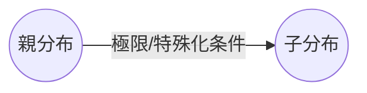
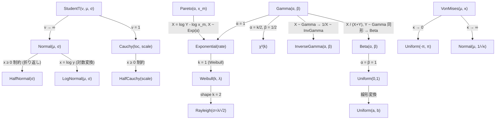
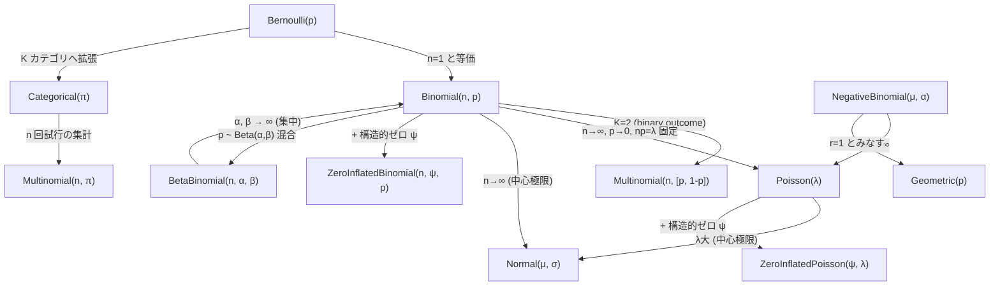
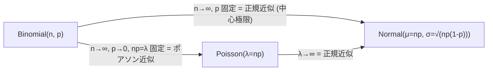
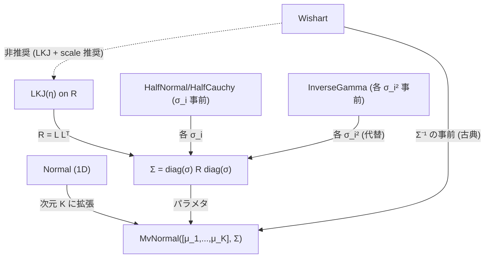
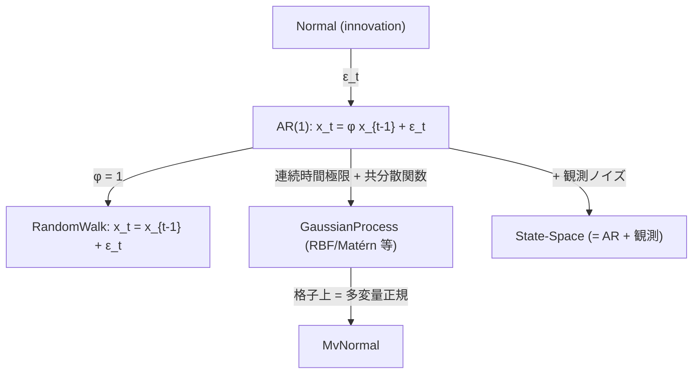
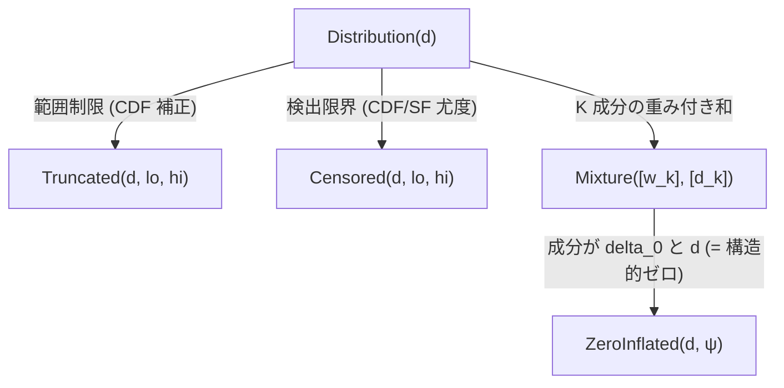
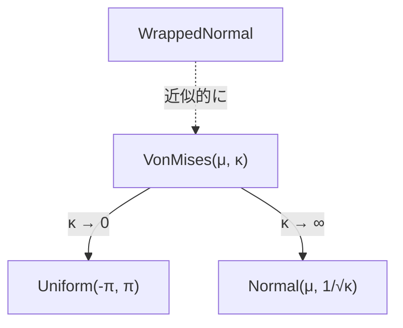

# 確率分布の関係図

> hanalyze で実装している分布同士の極限・特殊化・共役関係をまとめた図。
> 学習資料の補助として、何が何の特殊ケースかを把握する用。

## 凡例

- **極限**: パラメタを ∞ や 0 などに飛ばすと別分布に収束
- **特殊化**: パラメタを特定値に固定すると別分布と一致
- **混合**: 2 つの分布の階層から導かれる
- **共役**: ベイズ事後計算で閉形式が得られる対

## 1. 連続分布の家系図

### よく使う変換

| 変換 | 関係 | 備考 |
|---|---|---|
| `LogNormal(μ, σ)` | log y ~ Normal(μ, σ) | 正の値、対数変換で正規 |
| `HalfNormal(σ)` | abs(z), z ~ Normal(0, σ) | sd 事前で頻用 |
| `Chi²(k)` | sum of k 個の Normal(0,1)² | Gamma の特殊形 |
| `Rayleigh(σ)` | √(X² + Y²), X,Y ~ N(0, σ) | Weibull(k=2, λ=σ√2) と等価 |

## 2. 離散分布の家系図

### 重要な極限・近似

これは「**De Moivre-Laplace の定理** (二項 → 正規)」「**ポアソン近似**」
「**中心極限定理**」の典型例。

## 3. 共役関係 (ベイズ事後が閉形式)

```mermaid
graph TD
  subgraph "Beta-Binomial"
    Bp["Beta(α, β)"] --"事前 p"--> Bb["Binomial(n, p)"]
    Bb --"事後"--> Bp2["Beta(α+k, β+n-k)"]
  end
  subgraph "Gamma-Poisson"
    Gl["Gamma(α, β)"] --"事前 λ"--> Pp["Poisson(λ)"]
    Pp --"事後"--> Gl2["Gamma(α+Σy, β+n)"]
  end
  subgraph "Dirichlet-Multinomial"
    D["Dirichlet(α₁,…,α_K)"] --"事前 π"--> M["Multinomial(n, π)"]
    M --"事後"--> D2["Dirichlet(α_k + count_k)"]
  end
  subgraph "Normal-InverseGamma"
    IG["InverseGamma(α, β)"] --"事前 σ²"--> Nl["Normal(μ, σ)"]
    Nl --"事後"--> IG2["InverseGamma(α+n/2, β+SS/2)"]
  end
  subgraph "Normal-Normal"
    Np["Normal(μ₀, σ₀)"] --"事前 μ"--> Nl2["Normal(μ, σ)"]
    Nl2 --"事後"--> Np2["Normal(updated)"]
  end
```

これらは Gibbs サンプラーで個別パラメタを直接 sample するときに使う。
hanalyze の `MCMC.Gibbs.gibbsMH` は事前/尤度の組み合わせから自動で
共役構造を検出して使う。

## 4. 多変量と相関

PyMC や Stan では **LKJ + scale** 分解が **Wishart** より好まれる。
hanalyze では `lkjCorrCholesky` で R の Cholesky factor を sample。

## 5. 時系列・状態空間

`ar1Latent` (J2) と `Model.GP` (master) で実装済み。

## 6. 切り詰め・打ち切り・混合

`Truncated` / `Censored` / `Mixture` / `ZeroInflated*` は
任意の base 分布に対して定義可能 (CDF が必要なものは限定的)。

## 7. 角度データ

`VonMises` は角度上の "Normal-like" 分布。

## まとめ表 — どの分布をいつ使う?

| データの性質 | 第一選択 | 過分散時 | 角度なら |
|---|---|---|---|
| 0/1 二値 | `Bernoulli` | — | — |
| n 試行のうち成功数 | `Binomial(n, p)` | `BetaBinomial(n, α, β)` | — |
| カウント | `Poisson(λ)` | `NegativeBinomial(μ, α)` | — |
| カウント (ゼロ過剰) | `ZeroInflatedPoisson` | — | — |
| 連続 (実数) | `Normal(μ, σ)` | `StudentT(ν, μ, σ)` | — |
| 連続 (正値) | `LogNormal` / `Gamma` / `Weibull` | — | — |
| 比率 (0-1) | `Beta(α, β)` | — | — |
| 多項 (K カテゴリの集計) | `Multinomial(n, π)` | — | — |
| 単位ベクトル / シンプレックス | `Dirichlet` | — | — |
| 多変量実数 | `MvNormal(μ, Σ)` | — | — |
| 角度 | — | — | `VonMises(μ, κ)` |

| 推定対象 | 共役事前 | 弱情報事前 |
|---|---|---|
| Bernoulli/Binomial の `p` | `Beta(α, β)` | `Beta(2, 2)` 等 |
| Poisson の `λ` | `Gamma(α, β)` | `HalfNormal` |
| Multinomial の `π` | `Dirichlet(α₁,…)` | `Dirichlet(1,…)` |
| Normal の `μ` | `Normal(μ₀, σ₀)` | `Normal(0, 大)` |
| Normal の `σ²` | `InverseGamma(α, β)` | `HalfNormal` / `HalfCauchy` |
| 相関行列 `R` | `LKJ(η)` | `LKJ(1)` (uniform) |

## 参考

- 各分布の数式と意味は [docs/learn/01-probability-distributions.ja.md](learn/01-probability-distributions.ja.md) を参照 (Phase M1 で追加)
- 共役関係を活用した Gibbs サンプリングは [docs/04-gibbs.ja.md](04-gibbs.ja.md) を参照
