# 回帰モデル

> 🌐 [English](02-regression.md) | **日本語**

> [📚 索引](README.ja.md) ｜ [01 quickstart](01-quickstart.ja.md) ｜ **02 regression** ｜ [03 bayesian-hbm](03-bayesian-hbm.ja.md) ｜ [04 multivariate](04-multivariate.ja.md) ｜ [05 ml](05-ml.ja.md) ｜ [06 timeseries](06-timeseries.ja.md) ｜ [07 survival](07-survival.ja.md) ｜ [08 causal](08-causal.ja.md) ｜ [09 doe](09-doe.ja.md) ｜ [10 stat](10-stat.ja.md) ｜ [11 data](11-data.ja.md) ｜ [12 plot](12-plot.ja.md)

回帰系モデルのシグネチャ + 最小例 + 図。 二変量の当てはめは **高レベル `df |-> spec`**
が主役 (`spec` = `lm`/`glm`/`spline`/`rlm`/`rq`)、 描画は `toPlot`。
理論・診断・罠は各 [`docs/regression/`](../regression/) のガイドが一次根拠。
(formula 入力 `lmF`/`glmF`/`glmmF` 等の式構文は別ページ [11-formula-dsl](../regression/11-formula-dsl.ja.md)。)

| モデル | 高レベル | 結果型 (Plottable) | 図 | ガイド |
|---|---|---|---|---|
| 線形回帰 (単回帰 OLS) | `df \|-> lm "x" "y"` | `LMModel` | scatter + 線 + CI | [01-lm](../regression/01-lm.ja.md) |
| 重回帰 (multiple) | `df \|-> lmMulti ["x1","x2","x3"] "y"` | `MultiLMModel` | 部分効果 plot | 本ページ ↓ |
| 一般化線形 (GLM) | `df \|-> glm fam link "x" "y"` | `GLMModel` | scatter + 平均 + CI | [02-glm](../regression/02-glm.ja.md) |
| 重み付き最小二乗 (WLS) | `df \|-> weighted "w" (lm "x" "y")` | `WeightedLMModel` | scatter + 線 + CI | 本ページ ↓ |
| ロバスト回帰 | `df \|-> rlm est "x" "y"` | `RobustModel` | OLS との対比 | [usage-regularized-advanced](../regression/usage-regularized-advanced.ja.md) |
| 分位点回帰 | `df \|-> rq taus "x" "y"` | `QuantileModel` | τ 別の線群 | [06-quantile](../regression/06-quantile.ja.md) |
| スプライン | `df \|-> spline kind knots "x" "y"` | `SplineModel` | 平滑曲線 + CI | [04-spline](../regression/04-spline.ja.md) |
| GAM | `df \|-> gam cfg "x" "y"` (`gamMulti` で多予測子) | `GAMModelN` | 平滑曲線 (基底選択・GCV) | 本ページ ↓ |
| カーネル法 (GP / KRR / RFF) | `df \|-> gp cfg "x" "y"` (`gpMulti` で多予測子) | `GPRegModel` / `GPRegModelN` | 平滑曲線 + 帯 (Gp/GpRff) | 本ページ ↓ |
| 罰則付き (Ridge/Lasso/EN/MCP/SCAD/Adaptive/Group) | `df \|-> ridge \|lasso \|regularized cfg ["x1","x2"] "y"` | `RegModel` | 係数 bar (CV 選択 λ) | 本ページ ↓ |

---

## 描画の約束: `toPlot fit` と `toPlot (statModel fit)` の違い

当てはめ結果は **2 通り**で描ける。 **本章は `statModel` 経路で統一**する:

| 書き方 | 経路 | 使えるもの |
|---|---|---|
| `toPlot fit` | **訓練点経路** — 訓練 x をソートして線+帯を引く簡便版 | 既定 CI のみ |
| `toPlot (statModel fit)` | **grid 経路** — 一様 grid で評価 | `grid N` (密度) / `bandMode` (CI/PI/両方/なし) / `piMethod` (閉形式 or bootstrap) |

直線 (LM) では両者の見た目は一致するが、 **帯の種類切替・予測区間・grid 密度は
`statModel` 経路でしか効かない**。 迷ったら `statModel` でくるむ。 散布図と重ねるときは
`df |>> (layer (scatter "x" "y") <> toPlot (statModel fit))` の形。

---

## 帯の選択 (`bandMode`: CI / PI / 両方 / なし)

回帰線まわりの帯は `bandMode` 1 つで選ぶ。 既定は **CI (信頼区間)** で、 回帰線=条件付き平均
E[y|x] の不確実性を表す。 これを **PI (予測区間)** — 新規の個別観測 y が入る区間 (残差分散 σ²
を含むぶん CI より広い) — に切替えたり、 両方を入れ子で重ねられる:

```haskell
data BandMode = BandOff | BandCI | BandPI | BandCIPI   -- 既定 BandCI
bandMode :: BandMode -> ModelSpec

statModel m                       -- 既定 = CI
statModel m <> bandMode BandPI    -- 予測区間のみ
statModel m <> bandMode BandCIPI  -- CI + PI 入れ子 (ファンチャート)
statModel m <> bandMode BandOff   -- 帯なし
```

`BandCIPI` は外側に PI (薄)・内側に CI (濃)・中央に回帰線を重ねる:

```haskell
saveSVGBound "fan.svg" $ df |>> layer (scatter "x" "y")
  <> toPlot (statModel (df |-> lm "x" "y") <> grid 200 <> bandMode BandCIPI)
```

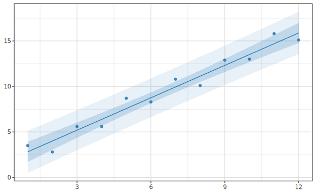

> PI (外) は CI (内) を必ず包含する (PI ⊃ CI を各点で実測)。 CI と PI は statsmodels OLS の
> `get_prediction().summary_frame()` の `mean_ci` / `obs_ci` と一致 (突合済)。
>
> **PI を出せるモデル** (closed-form): `LMModel` / `WeightedLMModel` / Gaussian-identity `GLMModel` /
> `SplineModel` (基底空間 OLS) / 重回帰 effect plot (`lmMulti` の `MultiLMModel`)。
> 閉形式 PI を持たないモデル (非 Gaussian GLM / `RobustModel` 等) は既定 (closed-form) では CI へ
> フォールバックするが、 下記の**ブートストラップ**で PI を出せる。

## ブートストラップ CI/PI (`piMethod`)

帯の**算出法**は `piMethod` で選ぶ。 `bandMode` が「どの帯を出すか (CI/PI/両方/なし)」を選ぶのに対し、
`piMethod` は「どう計算するか」を選ぶ**直交軸**。 既定は `PIClosedForm` (Wald / 基底空間 OLS)。
`PIBootstrap seed draws` を指定すると、 **case-resampling ブートストラップ**で帯を出す: 訓練 (x,y)
を seed 付きで再標本化 → refit → grid で予測、 を draws 回。 その分位点を帯にする。 これで閉形式
PI を持たないモデル (非 Gaussian GLM・ロバスト) でも PI を出せる。

```haskell
data PIMethod = PIClosedForm | PIBootstrap Word32 Int   -- 既定 PIClosedForm
piMethod :: PIMethod -> ModelSpec

-- 非 Gaussian GLM (Poisson) の CI+PI を bootstrap で (seed 42・1000 draws):
df |>> layer (scatter "x" "y")
  <> toPlot (statModel (df |-> glm Poisson Log "x" "y")
              <> bandMode BandCIPI <> piMethod (PIBootstrap 42 1000))
```

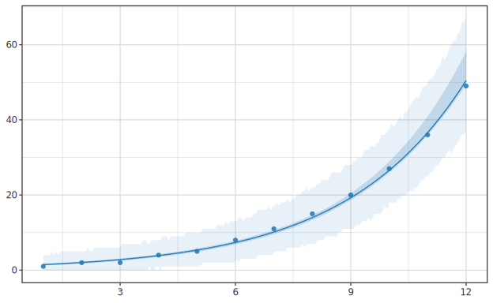

- **CI** = 再標本化した μ̂ の分位点(係数の不確実性を反映)。
- **PI** = 新規観測 y* の分位点。 加法誤差モデル (LM/spline/rlm) は μ + 再標本化残差、
  **GLM は `Family(μ)` からの parametric ドロー**(Poisson の離散・非対称な裾を正しく反映)。
- `PIBootstrap seed _` で **seed 純粋・決定的**(同 seed → ビット同一の帯)。 対応モデル =
  `LMModel` / `GLMModel` / `SplineModel` / `RobustModel` (= `svBootKit` 実装)。 draws 回
  refit するぶん closed-form より重い。

> ⚠ **小標本の CI は過小評価しがち**: 非パラメトリック case-resampling は小 n でブートストラップ
> CI を狭く出す傾向がある(実測で Poisson n=12 のとき closed-form Wald CI の 1/2.5〜1/4)。
> **closed-form CI を持つモデル**(LM / Gaussian GLM / spline)では既定の Wald CI の方が
> 小標本で信頼できる。 `PIBootstrap` の主用途は **closed-form が無いモデル(非 Gaussian GLM /
> ロバスト)の PI**。 CI を bootstrap で使うなら n を十分大きく。

---

## 線形回帰 (LM)

```haskell
lm :: Text -> Text -> LMSpec           -- lm <xcol> <ycol>
```

```haskell
let fit = df |-> lm "x" "y"            -- LMModel: β, ŷ, residuals, R²
saveSVGBound "lm.svg" $ df |>> layer (scatter "x" "y") <> toPlot (statModel fit)
```


**低レベル** (行列 API): `fitLMVec (designMatrix xs) ys :: FitResult` ([01 quickstart](01-quickstart.ja.md#low-level))。

---

## 重回帰 (multiple regression)

**重回帰**は説明変数が複数の回帰 (設計行列 X が多列)。 **LM の多変量拡張**で、
**列名リストを直接取る統一 API** で当てる。 GLM・ロバスト・分位点・GAM・GP・罰則など
**以下のモデルも基本的に同じ多変量拡張** (`*Multi`) を持つ (本節末にまとめ):

```haskell
lmMulti     :: [Text] -> Text -> LMMultiSpec                       -- 多変量 LM
glmMulti    :: Family -> LinkFn -> [Text] -> Text -> GLMMultiSpec  -- 多変量 GLM
rlmMulti :: RobustEstimator -> [Text] -> Text -> RobustMultiSpec -- 多変量ロバスト
```

```haskell
let m = df |-> lmMulti ["x1", "x2", "x3"] "y"   -- MultiLMModel (重回帰)
```

設計行列は `[1, x1, x2, x3]`。 GLM・ロバストも同じ列名リスト記法で重回帰化できる
(`glmMulti Poisson Log [...] "y"` 等)。

**低レベル** (行列 API): `fitMultiLM (X :: Matrix) (y :: Vector) :: MultiFit` (→ [04 multivariate](04-multivariate.ja.md))。

### 係数サマリ (`coefSummary`)

`coefSummary` で statsmodels `.summary()` 同等の係数表 (推定値・標準誤差・検定統計量・p 値・
95% CI) を得る。 OLS 系は **t** (df = n−p)、 GLM/ロバストは **z** (正規) で推論する:

```haskell
coefSummary :: HasCoefSummary m => m -> [CoefRow]

data CoefRow = CoefRow
  { crTerm     :: Text             -- "(Intercept)" / 変数名
  , crEstimate :: Double           -- 点推定 β̂
  , crStdErr   :: Double           -- 標準誤差
  , crStat     :: Double           -- 検定統計量 (OLS=t, GLM/ロバスト=z)
  , crPValue   :: Double           -- 両側 p 値
  , crCI95     :: (Double, Double)  -- 95% 信頼区間
  }

mapM_ print (coefSummary m)       -- 係数を 1 行ずつ表示
```

`HasCoefSummary` の instance は `LMModel`/`MultiLMModel`/`WeightedLMModel`/`GLMModel`/
`MultiGLMModel`/`RobustModel`/`MultiRobustModel` (単回帰・重回帰の両方)。 これらは全て
**解析的 Wald** で統計的に妥当。 残る回帰は係数診断の方法が異なるので別 API を使う (次節)。

### 解析 Wald が使えないモデルの係数診断

分位点回帰・罰則回帰・平滑化モデルは `coefSummary` の解析 Wald が成り立たないため、
理由ごとに別の診断 API を用意している:

| モデル | `coefSummary` 非対応の理由 | 使う API |
|---|---|---|
| rq / rqMulti | 係数は解釈的だが**解析 SE が無い** | `coefSummaryBoot` (bootstrap SE/CI) |
| 罰則 (`RegModel`) | 係数は解釈的だが**Wald SE が無効** (post-selection) | `coefSummaryBoot` (区間のみ・有意性は不可) |
| GAM / spline | 係数も SE もあるが**基底係数で非解釈的** | `termSummary` (項単位の近似有意性) |
| GP | そもそも**線形係数が無い** (ハイパラのみ) | 非該当 |

```haskell
-- bootstrap 係数サマリ (返り値は coefSummary と同じ [CoefRow])。
-- seed を固定するので純粋・再現可能。 crStat/crPValue/crCI95 の意味は
-- 「経験分布」 由来 (= percentile CI が 0 を跨ぐか) になる。
coefSummaryBoot :: HasCoefBoot m => Word32 -> Int -> m -> [CoefRow]
mapM_ print (coefSummaryBoot 42 2000 qm)   -- 分位点回帰の bootstrap 係数表

-- 平滑項単位の近似有意性 (mgcv 流 edf + 近似 F)。 基底係数でなく「項」 で評価する。
termSummary :: HasTermSummary m => m -> [TermRow]
mapM_ print (termSummary gamFit)           -- 各平滑項の edf / F / p

data TermRow = TermRow
  { teTerm :: Text, teEdf :: Double, teStat :: Double, tePValue :: Double }
```

> `coefSummaryBoot` は `coefSummary` と**別関数名**にして bootstrap 由来を明示する
> (返り値型は同じ `[CoefRow]`)。 罰則回帰では区間は出せるが、 post-selection ゆえ
> **「有意性」 とは解釈しない**こと。

### 統一玄関 (`.summary()` 風)

どのモデルでも `modelReport` を呼べば、 上の使い分けを意識せず適切な診断を返す。
出力の「形」が違うのでタグ付き直和 `ModelReport` で包み、 `showReport` で整形表示する:

```haskell
modelReport :: HasReport m => m -> ModelReport
showReport  :: ModelReport -> Text

data ModelReport
  = CoefReport [CoefRow]   -- LM 系=Wald / rq・罰則=bootstrap
  | TermReport [TermRow]   -- GAM / spline の項有意性
  | NoReport   Text        -- GP 等「係数診断は非該当」 を理由付きで

TIO.putStr (showReport (modelReport m))    -- statsmodels .summary() 風の表
```

### 係数 forest plot (`coefForest`)

`coefSummary` の係数表をそのまま図にする。 各係数の点推定を点、 95% CI を水平バー、
0 (= 効果なし) に縦の参照線を引く (メタ解析の forest plot と同形):

```haskell
coefForest :: HasCoefSummary m => m -> VisualSpec

saveSVGBound "coef-forest.svg" $ noDf |>> coefForest m   -- m = y ~ x1 + x2 の重回帰
```

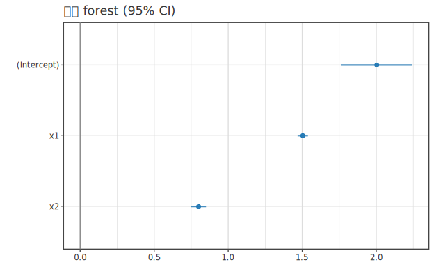

### 実測 vs 予測 plot (`obsVsPred`)

当てはまりの良さを一目で見る診断図。 x=実測値・y=予測値の散布に `y = x` 参照線
(灰の破線) を重ねる。 点が線に近いほど残差が小さい:

```haskell
obsVsPred :: HasObsPred m => m -> VisualSpec

saveSVGBound "obs-vs-pred.svg" $ noDf |>> obsVsPred m
```

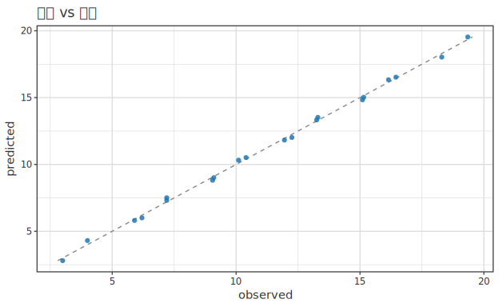

`HasObsPred` の instance は予測を持つ回帰全般 (LM/重回帰/GLM/WLS/ロバスト/分位点(中央値)/
spline/GAM/罰則)。 実測値は `fitted + residual` で復元する。 `(observed, predicted)` の
生ペアが欲しいときは `obsPredPairs` を直接呼ぶ。

### 部分効果 plot (effect plot)

`MultiLMModel` は `Plottable` で**無い**ので、 効果は `statModelMulti` 経路で描く
(Phase 68 の罠)。 `along` で動かす変数を選び、 他は `holdAt` で固定する:

```haskell
-- x1 を動かし x2/x3 を中央値固定した部分効果 + 95% CI 帯 (holdAt Median):
-- 帯は既定 CI。 前述の bandMode で切替 (BandOff/BandCI/BandPI/BandCIPI)。
saveSVGBound "effect.svg" $ df |>> layer (scatter "x1" "y")
  <> toPlot (statModelMulti m (along "x1") <> holdAt Median)
```

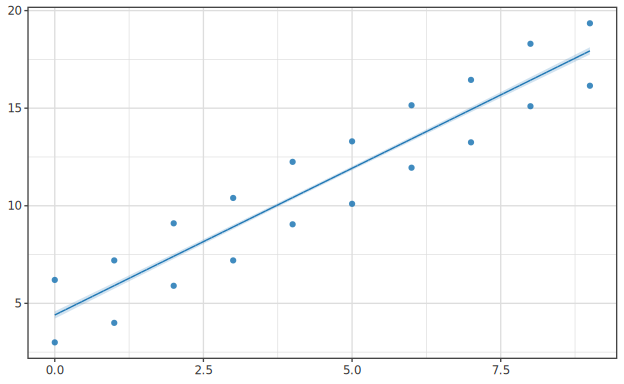

`byVar` で第 2 変数の各水準ごとに曲線を色分け重畳できる (交互作用の可視化に相当):

```haskell
saveSVGBound "effect-byvar.svg" $ df |>> layer (scatter "x1" "y")
  <> toPlot (statModelMulti m (along "x1") <> byVar "x2" [1, 5])
```

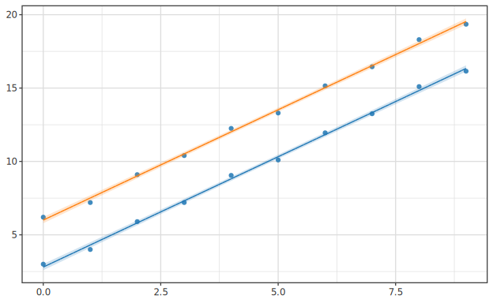

### 他モデルの重回帰版 (Multi)

`lmMulti` 以外にも、 以下のモデルが**列名リストを取る重回帰版**を持つ:

- `glm` / `rlm` → `glmMulti` / `rlmMulti` (本節と同じ列名リスト記法)
- `rq` → `rqMulti` (多変量分位点回帰・各 τ を設計行列 `[1,x₁..xₚ]` に当てる)
- `gam` / `gp` → `gamMulti` / `gpMulti` (多予測子の偏依存曲線)
- 罰則回帰 (`ridge`/`lasso`/…) は**本質的に多予測子** (bare が `[Text]` を取る)
- **`spline` のみ高レベルは単一予測子**。 多予測子の平滑化は加法モデル `gamMulti`
  (複数 1D smooth の和)、 交互作用はテンソル積スプライン (未実装) の領域。

---

## 一般化線形モデル (GLM)

```haskell
glm :: Family -> LinkFn -> Text -> Text -> GLMSpec
-- Family = Gaussian | Binomial | Poisson
-- LinkFn = Identity | Log | Logit | Sqrt
```

```haskell
let fit = df |-> glm Poisson Log "x" "y"   -- GLMModel (canonical link = Log)
saveSVGBound "poisson.svg" $ df |>> layer (scatter "x" "y") <> toPlot (statModel fit)
```


ロジスティック回帰は `df |-> glm Binomial Logit "x" "y"`。 重回帰は `glmMulti`。

**低レベル** (行列 API): `fitGLMFull fam link (designMatrix xs) ys :: FitResult` (→ [02-glm](../regression/02-glm.ja.md))。

---

## 重み付き最小二乗 (WLS)

```haskell
weighted :: Text -> LMSpec -> WeightedLMSpec   -- 重み列名 wCol を LM に与える
```

```haskell
let fit = df |-> weighted "w" (lm "x" "y")   -- WeightedLMModel (√wᵢ で壊れない専用ラッパ)
saveSVGBound "wls.svg" $ df |>> layer (scatter "x" "y") <> toPlot (statModel fit)
```


重み `wᵢ` は **df 内の列**を列名で渡す (`x` / `y` と同一データ源・行順は自動で揃う)。
分散の逆数等を重み列に入れておく (statsmodels `wls(…, weights=col)` / R `weights=` と同型)。
通常 LM の `toPlot (statModel …)` 同様に描ける (重みの大きい観測側で CI 帯が締まる)。

**低レベル**: √w スケール設計行列 `diag(√w)·X` を組み `fitLMVec` に渡す (このラッパが内部で行う処理)。

---

## ロバスト回帰

```haskell
rlm :: RobustEstimator -> Text -> Text -> RobustSpec
-- RobustEstimator = Huber Double | Tukey Double   (k=1.345 / c=4.685 で 95% 効率)
```

`RobustModel` も **CI 帯を持つ** (Phase 70.C)。 M 推定量 β̂ の漸近共分散 (サンドイッチ・
statsmodels `RLM` cov="H1" と一致) から Wald 信頼区間を出す。 帯は既定で出る。 下図は外れ値の
影響を OLS と対比 (`statColor`/`statFill` で色分け・`statLabel` で凡例。 色は `Hgg.Plot.Color.Named`
の名前付き色 `red` / `blue` 等が使える):

```haskell
let mH = df |-> rlm (Huber defaultHuberK) "x" "y"   -- RobustModel (CI 帯あり)
    ols = df |-> lm "x" "y"                            -- LMModel (OLS)
saveSVGBound "robust.svg" $ df |>> layer (scatter "x" "y")
  <> toPlot (statModel ols <> statColor blue <> statFill blue <> statLabel "OLS")
  <> toPlot (statModel mH  <> statColor red  <> statFill red  <> statLabel "Robust (Huber)")
```


> 末尾の外れ値に OLS (青) は引かれ **CI 帯も広がる**が、 ロバスト (赤) は傾き ≈ 2 を保ち
> **CI 帯も締まる** (外れ値をダウンウェイトするぶん推定が確信的)。 SE は statsmodels
> `RLM` と一致 (全点 inlier の極限で OLS の SE に厳密一致するのを回帰テストで実測)。

**低レベル** (行列 API): `fitRobustLM est (designMatrix xs) ys maxIter tol :: RobustFit` — IRLS フィット。
`Rob.rfCoef` / `rfScale` / `rfConverged` / `rfWeights` で係数・ロバストスケール・収束・最終重みを取る
(`rfWeights` は外れ値特定にも使える)。 IRLS の手順・Huber/Tukey 重み関数・初期値依存の罠は
[usage-regularized-advanced](../regression/usage-regularized-advanced.ja.md) が一次根拠。 重回帰は `rlmMulti`。

---

## 分位点回帰

```haskell
rq :: [Double] -> Text -> Text -> QuantileSpec   -- 複数 τ を一度に
```

```haskell
let m = df |-> rq [0.1, 0.5, 0.9] "x" "y"   -- QuantileModel
saveSVGBound "quantile.svg" $ df |>> layer (scatter "x" "y") <> toPlot (statModel m)
```


多変量版 `rqMulti` は[重回帰](#重回帰-multiple-regression)節にまとめている。

**低レベル** (行列 API): `fitQuantile τ (X :: Matrix) (y :: Vector) :: QRFit` (→ [06-quantile](../regression/06-quantile.ja.md))。
分位点回帰は SE を持たないため `coefSummary` は非対応。

---

## スプライン

```haskell
spline :: SplineKind -> [Double] -> Text -> Text -> SplineSpec
-- SplineKind = BSpline Int | NaturalCubic    第 2 引数 = 内部 knot 列
```

```haskell
let m = df |-> spline (BSpline 3) [3,5,7] "x" "y"   -- SplineModel (cubic B-spline)
saveSVGBound "spline.svg" $ df |>> layer (scatter "x" "y") <> toPlot (statModel m)
```

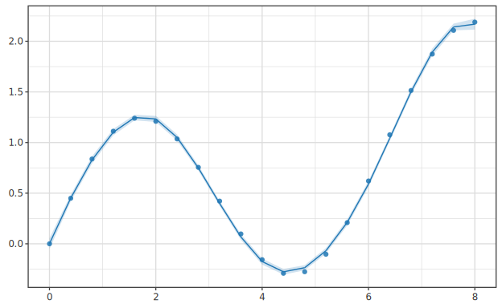

**低レベル** (行列 API): `fitSpline kind knots (xs :: Vector) (ys :: Vector) :: SplineFit` (→ [04-spline](../regression/04-spline.ja.md))。
スプラインは**単一予測子の基底展開**が本質 (複数予測子の平滑化は加法モデル `gamMulti` を使う)。

---

## GAM (一般化加法モデル)

`gam` / `gamMulti` は**基底を選べ**、 **λ を GCV で自動選択**でき、 `lm` / `lmMulti` と
対称な命名で受ける:

```haskell
gam      :: GAMConfig -> Text   -> Text -> GAMSpec   -- 単一予測子 (lm "x" "y"        と対)
gamMulti :: GAMConfig -> [Text] -> Text -> GAMSpec   -- 多予測子   (lmMulti […] "y"   と対)
-- いずれも df|-> で当てはめ → GAMModelN (Plottable)。多予測子は第1予測子を描画軸に、
-- 他は訓練平均に固定した偏依存曲線を描く。

data GAMConfig = GAMConfig { gcBasis :: GAMBasis, gcLambda :: GAMLambda }
defaultGAMConfig = GAMConfig (BSplineB 3 6) GCV    -- 3次B-spline・内部6ノット・GCV
```

選べる基底 `GAMBasis`:

| 構成子 | 基底 | 引数 |
|---|---|---|
| `BSplineB deg nKnots` | B-spline | 次数・内部ノット数 |
| `NaturalCubicB nKnots` | 自然3次回帰スプライン | 内部ノット数 |
| `PolyB deg` | 多項式 (`[-1,1]` にスケール) | 次数 |
| `FourierB nHarm` | Fourier (sin/cos) | 倍音数 (周期=データレンジ) |
| `RBFB nCenters bwRel` | ガウス RBF | 中心数・帯域 (中心間隔×bwRel) |

λ の方略 `GAMLambda`: `FixedL λ` (固定) / `GCV` (一般化交差検証 `λ* = argmin n·RSS/(n−edf)²`)。

GAM は **mgcv 流の Bayesian 信頼帯**を持つ (`Vβ = (XᵀX+λP)⁻¹·φ̂`、`φ̂ = RSS/(n−edf)`、
半幅 `t_{n−edf}·√(b Vβ bᵀ)`)。 `toPlot (statModel m)` で平滑曲線 + CI 帯が出る:

```haskell
let m = df |-> gam defaultGAMConfig "x" "y"   -- 3 次 B-spline・GCV 自動λ
saveSVGBound "gam.svg" $ df |>> layer (scatter "x" "y") <> toPlot (statModel m)
```


複数基底の**曲線形状**を比べたいときは `bandMode BandOff` で帯を抑えて重畳する:

```haskell
-- 同じデータを 3 基底で平滑化し色分け重畳 (λ は各々 GCV・帯は比較のため OFF):
let bs  = df |-> gam (GAMConfig (BSplineB 3 8)    GCV) "x" "y"
    nc  = df |-> gam (GAMConfig (NaturalCubicB 8) GCV) "x" "y"
    rbf = df |-> gam (GAMConfig (RBFB 10 1.0)     GCV) "x" "y"
saveSVGBound "gam-basis.svg" $ df |>> layer (scatter "x" "y")
  <> toPlot (statModel bs  <> statColor blue  <> statLabel "B-spline"     <> bandMode BandOff)
  <> toPlot (statModel nc  <> statColor green <> statLabel "Natural cubic" <> bandMode BandOff)
  <> toPlot (statModel rbf <> statColor red   <> statLabel "RBF"           <> bandMode BandOff)
```

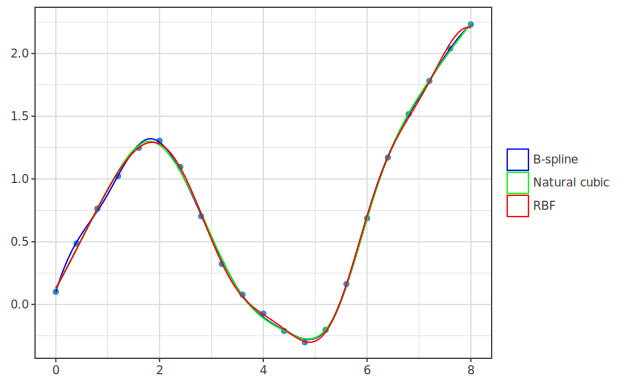

多予測子では第1予測子を描画軸に、 他を訓練平均に固定した偏依存曲線 + その点の CI 帯を描く。
PI (予測区間) は未提供ゆえ `bandMode BandPI` は CI へフォールバックする。

**低レベル** (行列 API): `fitGAM deg nKnots λ [x₁,x₂,…] y :: GAMFit` (多特徴・`Plottable` 非対象)。
単変量の素の描画は `gamModel` で `GAMModel` を組む (CI 帯あり)。

---

## カーネル法 (GP / KRR / RFF) — `gp` / `gpMulti`

GP・カーネルリッジ回帰 (KRR)・Random Fourier Features (RFF) は **2 軸で尽くされる
1 つの族**。本体は GP で、KRR の予測 ≡ GP 事後平均 (帯なし)、RFF は両者の低ランク近似。
よって `lm` / `lmMulti` と対称な 1 つの spec `gp` / `gpMulti` に統合し、象限・カーネル・
ハイパラ方略を `GPConfig` で選ぶ:

|  | 分布あり (`Gp`) | 分布なし (`Krr` 点) |
|---|---|---|
| **厳密** | GP = 平均 + 帯 | KRR = 点 |
| **近似 (RFF)** | RFF-GP = 平均 + 帯 | RFF-KRR = 点 |

```haskell
data Kernel       = RBF | Matern52 | Periodic                            -- カーネル種 (GP.hs 由来)
data GPMethod     = Gp | Krr | GpRff Int Word32 | KrrRff Int Word32  -- 象限 (D, seed は RFF のみ)
data HyperStrategy = FixedHyper GPParams | AutoMarginalLik | AutoCV       -- ハイパラの決め方
data GPConfig      = GPConfig { gpcKernel :: Kernel, gpcMethod :: GPMethod, gpcHyper :: HyperStrategy }
defaultGP = GPConfig RBF Gp AutoMarginalLik     -- 厳密 GP・RBF・周辺尤度自動

gp      :: GPConfig -> Text   -> Text -> GPSpec        -- 単変量 (GPRegModel)
gpMulti :: GPConfig -> [Text] -> Text -> GPMultiSpec   -- 多変量 (GPRegModelN・偏依存曲線)
```

ハイパラの実体 `GPParams` (`FixedHyper` で手動指定、`Auto*` は自動推定される値):

```haskell
data GPParams = GPParams
  { gpLengthScale  :: Double                  -- ℓ  : 長さスケール (大きいほど滑らか)
  , gpSignalVar    :: Double                  -- σ_f²: 信号分散 (関数値の振れ幅)
  , gpNoiseVar     :: Double                  -- σ_n²: 観測ノイズ分散 (= KRR の罰則 λ・0 で内挿)
  , gpPeriod       :: Double                  -- p  : 周期 (Periodic カーネルのみ使用)
  , gpLengthScales :: Maybe (Vector Double)   -- ARD: 次元別 ℓ (Just で入力次元の重要度を学習)
  }

defaultGPParams :: GPParams                                -- ℓ=σ_f²=p=1, σ_n²=0.1
initParamsFromData :: [Double] -> [Double] -> GPParams     -- データ統計から初期値 (Auto* の出発点)
```

```haskell
-- 厳密 GP (既定): 散布に事後平均曲線 + credible 帯を重ねる
let m = df |-> gp defaultGP "x" "y"
saveSVGBound "gp.svg" $ df |>> layer (scatter "x" "y") <> toPlot (statModel m)
```


`Krr` 象限は KRR の点予測ゆえ帯なし、`GpRff D seed` は RFF 近似 (同 seed で完全再現・
厳密 GP とほぼ一致):

```haskell
df |-> gp (GPConfig RBF Krr      AutoMarginalLik) "x" "y"   -- KRR (点・帯なし)
df |-> gp (GPConfig RBF (GpRff 500 42) AutoMarginalLik) "x" "y"   -- RFF 近似 GP (帯)
df |-> gp (GPConfig RBF Gp AutoCV)                  "x" "y"   -- LOOCV でハイパラ選択
```

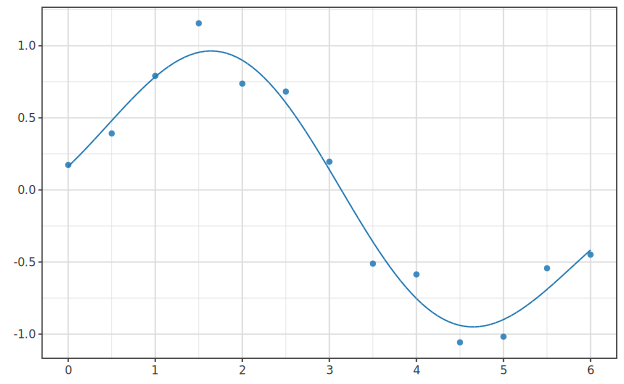

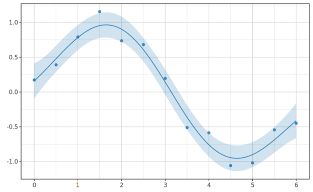

ハイパラ最適化は `gpcHyper` で露出: `AutoMarginalLik` (周辺尤度)・`AutoCV` (LOOCV/PRESS)・
`FixedHyper` (手動)。RFF は定常カーネルのみ可ゆえ `Periodic` + RFF 象限は厳密へ自動
フォールバックする。低レベル API (`fitGP` / `optimizeGP` / `fitGPMV` / `kernelRidge` /
`rffRidge` 等) は温存。詳細・4 象限の使い分けは
[04-gp](../regression/04-gp.ja.md) / [04-kernel](../regression/04-kernel.ja.md) /
[04-rff](../regression/04-rff.ja.md)。

> ⚠ **カーネルと `GPParams` フィールドの対応**: カーネルは自分が使うフィールドだけ読み、
> 無関係なフィールドは**黙って無視**する (検証・警告なし)。RBF/Matern52 は `gpPeriod` と
> `gpLengthScales` (ARD) を無視、Periodic は ARD を無視、ARD は MV 経路のみ (1D 非適用)。
> **特に注意**: `Auto*` (周辺尤度/CV) が最適化するのは `gpLengthScale` / `gpSignalVar` /
> `gpNoiseVar` の 3 つだけ。**`Periodic` の `gpPeriod` は学習されない**ので、真の周期を
> 使うには `FixedHyper (defaultGPParams { gpPeriod = 実周期 })` で明示指定する。

---

## 罰則付き回帰 (Ridge / Lasso / Elastic Net / MCP / SCAD / Adaptive / Group)

実装済み **7 種**の罰則回帰を 1 spec `regularized` (+近道 `ridge`/`lasso`/`elasticNet`) に統合。
`lmMulti` と対称な**多予測子のみ** (罰則回帰は本質的に多特徴ゆえ単回帰版は作らない・
bare が `[Text]` を取り `*Multi` は同名別名)。`GPConfig` と同型に**手法 × λ 方略**を
`RegConfig` 1 つで選ぶ。X は内部で標準化し**係数は元スケール**で返す:

```haskell
data RegMethod
  = Ridge | Lasso | ElasticNet Double      -- L2 / L1 / EN(α=L1 比)
  | MCP Double | SCAD Double               -- 非凸 (γ / a)
  | AdaptiveLasso Double | GroupLasso [Int] -- OLS pilot 重み(γ) / 各列の群 ID

data LambdaStrat                           -- λ の決め方
  = FixedLambda Double                     -- 手動
  | LambdaLOOCV                            -- 閉形式 LOOCV (★Ridge 等の線形平滑器専用)
  | LambdaCV Int Word32 | LambdaCV1SE Int Word32  -- k-fold CV (k, seed)・best / 1-SE rule

data RegConfig = RegConfig { rcMethod :: RegMethod, rcLambda :: LambdaStrat }

regularized :: RegConfig -> [Text] -> Text -> RegSpec        -- 一般形
ridge, lasso :: [Text] -> Text -> RegSpec                    -- 近道 (λ 既定 CV)
elasticNet   :: Double -> [Text] -> Text -> RegSpec
```

罰則手法 `RegMethod`:

| 構成子 | 罰則 | 引数 |
|---|---|---|
| `Ridge` | L2 `Σβ²` (分散縮約・0 にしない) | — |
| `Lasso` | L1 `Σ|β|` (**変数選択**・0 に縮約) | — |
| `ElasticNet α` | L1+L2 混合 | α = L1 比 (0–1) |
| `MCP γ` | 非凸 (minimax concave) | γ (緩和パラメタ) |
| `SCAD a` | 非凸 (smoothly clipped) | a |
| `AdaptiveLasso γ` | 重み付き L1 (OLS pilot 重み) | γ (重みの指数) |
| `GroupLasso gids` | 群単位 L1 | 各列の群 ID リスト |

λ の方略 `LambdaStrat`:

| 構成子 | λ の決め方 | 備考 |
|---|---|---|
| `FixedLambda λ` | 手動固定 | — |
| `LambdaLOOCV` | 閉形式 LOOCV | Ridge 等の線形平滑器のみ (L1/非凸は `Left`) |
| `LambdaCV k seed` | k-fold CV (best) | seed 純粋・決定的 |
| `LambdaCV1SE k seed` | k-fold CV (1-SE rule) | R glmnet `lambda.1se` 相当・保守側 |

`df |-> ridge/lasso/…` で当てはめ、`RegModel` は `Plottable` (係数 bar・特徴名ラベル)。

```haskell
-- λ は 5-fold CV で自動選択 (既定)。 係数 bar を描く
let m = df |-> lasso ["x1", "x2", "x3", "x4", "x5"] "y"
saveSVGBound "coef.svg" $ noDf |>> toPlot m
```

**Lasso は変数選択** (無関係・冗長な係数を 0 に)・**Ridge は分散縮約** (相関特徴へ重みを分け
0 にはしない) の違いが係数 bar に出る (真の信号 = x1, x2、x3 は x1 と相関する冗長特徴、
x4/x5 は純ノイズ):

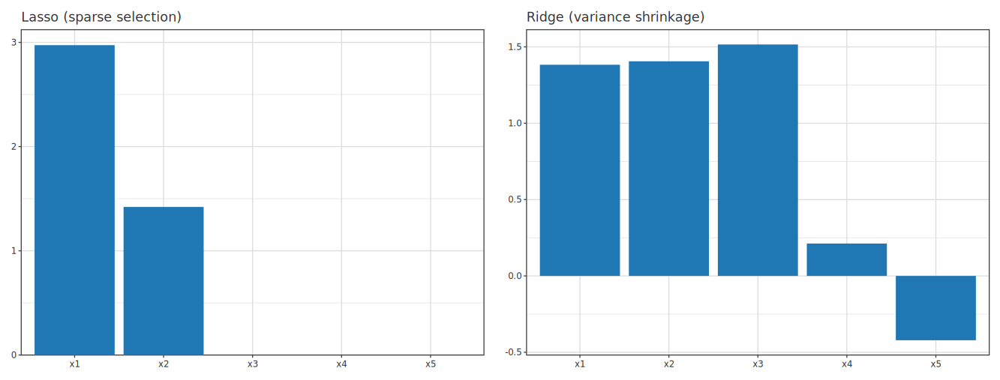

> 真の信号は x1, x2。 x3 は x1 と相関する冗長特徴、 x4/x5 は純ノイズ。 **Lasso (左)** は
> x3-x5 を 0 にし x1,x2 を選択 (スパース)、 **Ridge (右)** は冗長な x3 にも重みを分散して残す。

**λ 方略**: `LambdaLOOCV` は閉形式 LOOCV (Ridge 等の線形平滑器のみ・L1/非凸は `Left`)、
`LambdaCV`/`LambdaCV1SE` は k-fold CV (seed 純粋・後者は R glmnet `lambda.1se` 相当の保守側)。
非凸 (MCP/SCAD) や Group/Adaptive も同じ CV 経路で λ を選べる:

```haskell
df |-> regularized (RegConfig Ridge LambdaLOOCV)            cols "y"   -- 閉形式 LOOCV
df |-> regularized (RegConfig (ElasticNet 0.5) (LambdaCV1SE 10 1)) cols "y"
df |-> regularized (RegConfig (GroupLasso [0,0,1,1,2]) (FixedLambda 0.1)) cols "y"
```

**低レベル** 行列 API (`fitRegularized` / `fitRidge` / `fitLasso` / `selectLambdaCV` 等) も
温存 ([04-regularized](../regression/04-regularized.ja.md))。 advanced 罰則 (MCP/SCAD/Adaptive/Group)
は `Hanalyze.Model.RegularizedAdvanced` に行列直叩きの個別 fit を持つ — いずれも
`RegFit` (`Plottable`・係数 bar) を返す:

```haskell
adaptiveWeightsFromOLS :: Double -> Matrix -> Vector -> Vector            -- γ, X, y → OLS pilot 重み
fitAdaptiveLasso :: Double -> Vector -> Matrix -> Vector -> Int -> Double -> RegFit  -- λ, w, X, y, maxIter, tol
fitMCP           :: Double -> Double -> Matrix -> Vector -> Int -> Double -> RegFit  -- λ, γ(=3-5)
fitSCAD          :: Double -> Double -> Matrix -> Vector -> Int -> Double -> RegFit  -- λ, a(=3.7)
fitGroupLasso    :: Double -> [[Int]] -> Matrix -> Vector -> Int -> Double -> RegFit -- λ, 列 index 群
```

罰則の数式 (MCP/SCAD piecewise・oracle property)・凸性条件の罠は
[usage-regularized-advanced](../regression/usage-regularized-advanced.ja.md) が一次根拠。

### 正則化パス (coefficient path)

**正則化パス**は、 各係数の値を **λ (罰則強度) の関数として描いた線図**。 λ を上げると係数が縮み、
**Lasso は係数を 1 本ずつ厳密に 0 へ**落とす — その**脱落の順序**が変数の重要度の目安になる。
横軸は **log₁₀λ** (左=小 λ=full model、 右=大 λ=sparse・R glmnet の係数パス図と同じ慣例)。
低レベル `regularizationPath` (λ グリッドで係数を計算) + `regPathPlot` (描画) で出す:

```haskell
import Hanalyze.Model.Regularized (regularizationPath, Penalty (L1))
import Hanalyze.Plot              (regPathPlot)

let lams = [ 0.001 * 1.6 ** k | k <- [0 .. 18] ]              -- λ グリッド (昇順・log₁₀≈ -3..1)
    path = regularizationPath (\l -> L1 l) lams xMatrix yVec  -- [(λ, [β_j])] = 各 λ での係数
saveSVGBound "lasso-path.svg" $ noDf |>> regPathPlot path <> title "LASSO coefficient path"
```


