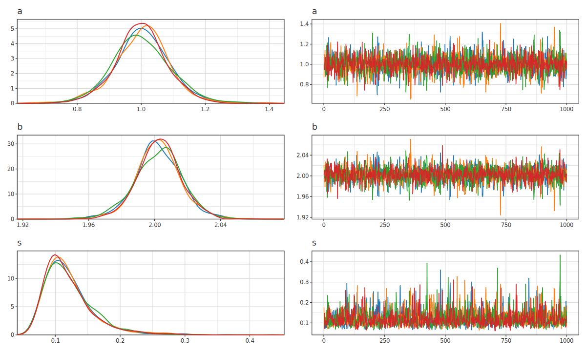
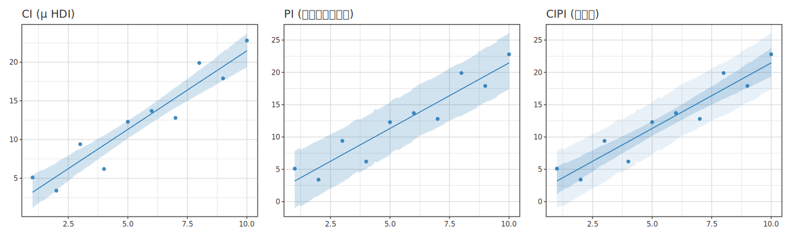

# Bayesian Hierarchical Models (HBM)

> 🌐 **English** | [日本語](03-bayesian-hbm.ja.md)

> [📚 Index](README.md) | [01 quickstart](01-quickstart.md) | [02 regression](02-regression.md) | **03 bayesian-hbm** | [04 multivariate](04-multivariate.md) | [05 ml](05-ml.md) | [06 timeseries](06-timeseries.md) | [07 survival](07-survival.md) | [08 causal](08-causal.md) | [09 doe](09-doe.md) | [10 stat](10-stat.md) | [11 data](11-data.md) | [12 plot](12-plot.md)

Fit hand-written HBM programs with `df |-> hbm`, and extract posterior plots using specialized accessors. The theory of distributions, plates, NUTS, and convergence is documented in [`docs/bayesian/`](../bayesian/).

| Stage | API |
|---|---|
| Model specification | `ModelP` monad (`sample` / `observe` / `dataNamed*` / `plate`) |
| Fitting | `df \|-> hbm defaultHBM model` (pure, deterministic) / `df \|->! …` (IO, progress bar) |
| Sampler (low-level) | `nutsPure` / `nutsChainsPure` (pure, deterministic via seed) |
| Posterior summary | `printHBMSummary` / `hbmSummary` / `hbmSummaryDf` / `hbmDrawsDf` |
| Diagnostic plots | `dagOf` / `tracesOf` / `forestOf` / `ppcOf` / `epred` |

---

## Writing models (`ModelP`)

```haskell
sample      :: Text -> Distribution a -> Model a a        -- draw latent variable
observe     :: Text -> Distribution a -> [Double] -> Model a ()  -- likelihood observation
dataNamedObs :: Text -> [Double] -> Model a [Double]      -- bundle df column as observation slot
dataNamedX  :: Text -> [Double] -> Model a [a]            -- bundle df column as predictor slot
dataNamedIx :: Text -> [Int]    -> Model a [Ix]           -- bundle group index column (slot-tagged)
plate       :: Text -> Int -> Model a r -> Model a r      -- repetition (Pyro/NumPyro style)
```

**All plate variants** (Phase 40; all are syntactic sugar for `plate`, affecting DAG rendering only, sampler unchanged):

```haskell
plate      :: Text -> Int -> Model a r -> Model a r             -- bare plate bracket
plateI     :: Text -> Int -> (Int -> Model a r) -> Model a [r]  -- plate + forM  [0..n-1] (index iteration, results collected)
plateI_    :: Text -> Int -> (Int -> Model a r) -> Model a ()   -- plate + forM_ [0..n-1] (index iteration, discarded)
plateForM  :: Text -> [b]  -> (b -> Model a r) -> Model a [r]   -- plate + forM  rows (row list iteration, results collected)
plateForM_ :: Text -> [b]  -> (b -> Model a r) -> Model a ()    -- plate + forM_ rows (row list iteration, discarded)
withPlate  :: Text -> Int -> Model a r -> Model a r             -- low-level primitive (for custom nested plates; = plate)
```

**Indexing and slot operators** (indexed RV / group effect gathering):

```haskell
indexed :: Text -> Int -> Text                 -- "theta" 0  → "theta_0" (name generation)
(.#)    :: Text -> Int -> Text                 -- infix: "theta" .# 0 == "theta_0"  (infixl 9)
(!!!)   :: TrackTag b => [b] -> Ix -> b         -- bs !!! g = bs !! ixVal g + Track interpretation injects slot→outcome edge (infixl 9)
at      :: REffect a -> [Int] -> REff           -- gather group effects by [Int] gids (PyMC b0[gid] style)
atIx    :: REffect a -> [Ix]  -> REff           -- Ix version (slot-tagged; injects slot→outcome edge in DAG)
data Ix = Ix { ixVal :: Int, ixSlot :: Maybe Text }   -- slot-tagged discrete index (returned by dataNamedIx)
```

`Distribution a` is one of 40+ distributions like `Normal μ σ` / `HalfNormal σ` / … 
([01-distributions](../bayesian/01-distributions.md)).

```haskell
{-# LANGUAGE OverloadedStrings #-}
import Hanalyze.Model.HBM (ModelP, sample, observe, dataNamedObs, Distribution (..))

model :: ModelP ()
model = do
  mu <- sample      "mu" (Normal 0 10)
  ys <- dataNamedObs "y" []          -- df's "y" column is bundled
  observe "y" (Normal mu 2) ys
```

> Model DAG and plate membership rules: [02-probabilistic-model](../bayesian/02-probabilistic-model.md);
> plate notation: [plate-notation](../bayesian/plate-notation.md).

### Plates and hierarchical models

Repetitions of the same distribution (groups, individuals) are wrapped with `plate "name" n` (Pyro/NumPyro style). In the DAG, they appear as rounded plate frames with counts; the sampler is unaffected (= declaration of structure). The canonical 8-schools example of hierarchical modeling uses **non-centered parameterization** (`eta ~ Normal(0,1)`, `theta = mu + tau·eta`) to avoid funnels:

**Highest-level idiom** — iteration via `plateI` / `plateI_` (index versions; results collected/discarded), indexed names generated with `.#` (folding `plate` + `forM` + `"eta_" <> T.pack (show j)`):

```haskell
import qualified Hanalyze.Model.HBM as HBM
import           Hanalyze.Model.HBM ((.#))   -- unqualified import of operator is more readable

eightSchools :: [Double] -> HBM.ModelP ()
eightSchools ys = do
  mu  <- HBM.sample "mu"  (HBM.Normal 0 5)
  tau <- HBM.sample "tau" (HBM.HalfCauchy 5)
  etas <- HBM.plateI "school" 8 $ \j ->
            HBM.sample ("eta" .# j) (HBM.Normal 0 1)               -- non-centered
  HBM.plateI_ "school" 8 $ \j ->
    HBM.observe ("y" .# j) (HBM.Normal (mu + tau * etas !! j) 1) [ys !! j]
```

When groups are **data-driven** (each observation's group is specified in a column), use `dataNamedIx` + `!!!` to gather like PyMC's `b0[gid]` (the `!!!` operator, via Track interpretation, injects slot→outcome edges in the DAG):

```haskell
groupModel :: Int -> [Int] -> [Double] -> HBM.ModelP ()
groupModel nG gids ys = do
  bs    <- HBM.plateI "group" nG $ \g -> HBM.sample ("b" .# g) (HBM.Normal 0 1)
  gixs  <- HBM.dataNamedIx "g" gids                  -- [Ix] (with origin slot tag)
  HBM.plateForM_ "obs" (zip gixs ys) $ \(g, yi) -> do
    mu <- HBM.deterministic "mu" (bs !!! g)          -- b[g]
    HBM.observe "y" (HBM.Normal mu 1) [yi]
```

> Sugar correspondence (results collected/discarded × index/row list, 2×2 matrix): `plateI`/`plateI_` = `plate name n (forM/forM_ [0..n-1] f)`,
> `plateForM`/`plateForM_` = `plate name (length rows) (forM/forM_ rows f)`.
> `withPlate` is the low-level primitive for custom nested plates (= `plate`). Name generation `.#` (= `indexed`) and gathering `!!!` are `infixl 9` (same precedence as `!!`), so `mu + tau * etas !! j` needs no parentheses.
> For random-effect paths, use `atIx`.
> For choosing between centered and non-centered group parameters, see [02-probabilistic-model pattern 4](../bayesian/02-probabilistic-model.md); for funnel diagnostics, see `pairOf` / `energyOf` below.

---

## Fitting (`df |-> hbm`)

```haskell
hbm        :: HBMConfig -> ModelP () -> HBMSpec
defaultHBM :: HBMConfig
```

```haskell
import Hanalyze.Plot (hbm, defaultHBM, (|->), toPlot, forestOf)

let df = [ ("y", NumData (V.fromList [1.2,2.3,3.1,2.8,1.9])) ]
    m  = df |-> hbm defaultHBM model   -- HBMModel (pure NUTS, deterministic via cfg seed)
saveSVGBound "forest.svg" $ noDf |>> toPlot (forestOf m)
```

### Sampler configuration (`HBMConfig`)

The first argument to `hbm` configures chain count, draws, warmup, seed, and mass matrix adaptation. The default `defaultHBM` matches brms (4 chains × 1000 draws + 1000 warmup, mass adaptation ON):

```haskell
data HBMConfig = HBMConfig
  { hbmChains    :: Int          -- chain count (default 4)
  , hbmSamples   :: Int          -- post-warmup draws (default 1000)
  , hbmWarmup    :: Int          -- warmup / burn-in (default 1000)
  , hbmSeed      :: Maybe Word32 -- random seed (Nothing = varies per run)
  , hbmAdaptMass :: Bool         -- diagonal mass matrix adaptation (default True)
  }

-- Fix seed for perfect reproducibility; extend warmup:
let m = df |-> hbm defaultHBM { hbmSeed = Just 42, hbmWarmup = 2000 } model
```

> **Keep `hbmAdaptMass` ON (default)**. In models where posterior scales differ greatly (like parameters `a`/`b` and scale `s`), disabling mass adaptation causes scale parameters to fail to converge (poor R̂).
> With adaptation ON, `s` converges as empirically verified.
> If convergence fails, first increase `hbmWarmup`; if due to funnels, use non-centered parameterization.

### IO version `|->!` (with progress bar)

`(|->)` is pure and silent. For a sampling progress bar, use the IO version `|->!`
(**results are bit-identical**; chains run in parallel. For true OS thread parallelism, use `-threaded +RTS -N`):

```haskell
(|->!) :: (ColumnSource d, Fit spec) => d -> spec -> IO (Fitted spec)

main = do
  m <- df |->! hbm defaultHBM model      -- progress bar during fitting
  saveSVGBound "forest.svg" (noDf |>> toPlot (forestOf m))
```

→ [11 data](11-data.md) / [`docs/io/04-fit-api.md`](../io/04-fit-api.md)

**Low-level** (explicit sampler): Call NUTS directly to obtain chains.

```haskell
nutsPure       :: ModelP r -> NUTSConfig -> Params -> Word32 -> Chain      -- 1 chain
nutsChainsPure :: ModelP r -> NUTSConfig -> Int -> Params -> Word32 -> [Chain]  -- multiple chains
```

```haskell
import qualified Data.Map.Strict as Map
import Hanalyze.MCMC.NUTS (nutsPure, defaultNUTSConfig)

let chain = nutsPure model defaultNUTSConfig (Map.fromList [("mu", 0.0)]) 42
```

---

## Posterior summary (`hbmSummary` / DataFrame conversion)

From a trained `HBMModel`, reach summary tables and posterior draws in one step (ArviZ `az.summary` / `idata.posterior` equivalent). `deterministic`-derived quantities are included in summaries by default.

### Summarizing (→ `[SummaryRow]` / `IO ()`)

| Function | Type | Role |
|---|---|---|
| `hbmSummary` | `HBMModel -> [SummaryRow]` | mean / sd / 94% HDI / ess_bulk (+ r_hat in multi-chain) summary rows (pure) |
| `printHBMSummary` | `HBMModel -> IO ()` | displays above as stdout table |
| `hbmSummaryNames` | `HBMModel -> [Text]` | summary parameter names (latent declaration order → deterministic declaration order) |

### Converting to DataFrame (→ `DataFrame`)

| Function | Type | Role |
|---|---|---|
| `hbmSummaryDf` | `HBMModel -> DataFrame` | summary table as df (columns = param / mean / sd / hdi_lo / hdi_hi / ess_bulk; + r_hat in multi-chain) |
| `hbmDrawsDf` | `HBMModel -> DataFrame` | posterior draws as df (1 parameter = 1 column; all chains concatenated in chain order) |

```haskell
import Hanalyze (printHBMSummary, hbmSummaryDf, hbmDrawsDf)
import qualified Hanalyze.Data.Wrangle as W

let m = df |-> hbm defaultHBM model
printHBMSummary m          -- az.summary style table
-- Columns: Parameter / mean / sd / hdi_3% / hdi_97% / ess_bulk (+ r_hat in multi-chain).
-- Rows: latent (declaration order) → deterministic quantities (declaration order).

let drs = hbmDrawsDf m     -- draws as df → aggregate freely with Wrangle verbs
W.summarise [ "mu_mean" W.=: W.meanOf "mu"
            , "mu_q95"  W.=: W.quantileOf 0.95 "mu" ] drs
```

For `SummaryRow` internals (direct low-level use) and manual naming routes
(`posteriorSummary` / `printPosteriorSummary`), see [viz-diagnostics](../bayesian/viz-diagnostics.md). Wrangle verbs for draw aggregation are in [11 data](11-data.md) Wrangle section.

---

## Diagnostic plots (extractors)

Extractors that consume `HBMModel` directly. Since the model carries its own posterior, data source is unnecessary for all but `epred` (use `noDf`).
Ordered by frequency of use in PyMC / ArviZ workflows (structure → convergence → estimation → fit → deep-dive → prediction).

| Extractor | Type | Plot | ArviZ equivalent |
|---|---|---|---|
| `dagOf` | `HBMModel -> DagSpec` | model structure DAG (plates folded) | `model_to_graphviz` |
| `dagOfModel` / `dagOfModelWith` | `ModelP () -> DagSpec` / `[(Text,[Double])] -> ModelP () -> DagSpec` | **pre-fit** structure DAG (no fit needed) | `model_to_graphviz` |
| `tracesOf` | `HBMModel -> [VisualSpec]` | trace (per param; divergence rug ON by default) | `plot_trace` |
| `forestOf` | `HBMModel -> ForestSpec` | 94% HDI forest | `plot_forest` |
| `marginalsOf` | `HBMModel -> [VisualSpec]` | marginal posterior density (per param; KDE) | `plot_posterior` |
| `ppcOf` | `HBMModel -> Text -> PPCSpec` | posterior predictive check (arg = observe name) | `plot_ppc` |
| `rankOf` | `HBMModel -> [VisualSpec]` | rank plot (chain uniformity; **requires ≥2 chains**) | `plot_rank` |
| `autocorrOf` | `HBMModel -> [VisualSpec]` | autocorrelation (per param; lag 0..30) | `plot_autocorr` |
| `energyOf` | `HBMModel -> VisualSpec` | energy (marginal vs ΔE; BFMI diagnostic) | `plot_energy` |
| `pairOf` | `HBMModel -> [(Text,Text)] -> [VisualSpec]` | 2-param joint scatter + divergence highlight | `plot_pair` |
| `divergencesOf` | `HBMModel -> [Int]` | divergence draw indices (NUTS) | — |
| `epred` | `HBMModel -> Text -> Text -> ModelSpec` | expected value prediction curve (predictor name, mean node name) | — |
| `dashboardOf` / `dashboardFullOf` | `HBMModel -> Text -> VisualSpec` | diagnostic dashboard bundling extractors | — |
| `traceDensityOf` | `HBMModel -> VisualSpec` | trace + posterior distribution only dashboard | `plot_trace` |

> Convergence diagnostic usage: **Poor R̂** → `tracesOf` / `rankOf` (chain separation, rank skew);
> **high autocorrelation (low ESS)** → `autocorrOf`; **funnel / divergences** → `pairOf` / `energyOf`.

Common imports and setup:

```haskell
import Hanalyze.Plot (hbm, defaultHBM, (|->), toPlot,
                             dagOf, tracesOf, forestOf, marginalsOf, ppcOf,
                             rankOf, autocorrOf, energyOf, pairOf, epred,
                             dashboardOf, dashboardFullOf)
import Hgg.Plot.Spec    (layer, scatter, vconcat)

let m    = df |-> hbm defaultHBM model
    noDf = [] :: [(Text, ColData)]
```

`tracesOf` / `marginalsOf` / `rankOf` / `autocorrOf` / `pairOf` each return **one panel per parameter**, so use `vconcat` (= `subplots ss <> subplotCols 1`) to stack vertically. For chains separated by color, use `tracesOfWith defaultTraceOpts { toByChain = True }`; to hide divergence rugs, use `{ toShowDivergences = False }`.
For HTML (VegaLite) equivalents, see [viz-diagnostics](../bayesian/viz-diagnostics.md).

### Diagnostic dashboard — overview at a glance

Before examining individual plots, use `dashboardOf` to see key elements at once. **Structure** (`dagOf`, top-left) · **estimates**
(`forestOf`) · **fit** (`ppcOf`, observed vs posterior predictive density) · **sampler health**
(`energyOf`, BFMI) in a 2×2 grid. Each panel is a single view, so readability does not degrade with parameter count (the `ppc` observe node name is the only argument; as coefficients grow, the forest just becomes vertically denser):

```haskell
noDf |>> dashboardOf m "obs"
```


For thorough convergence checking (including R̂), use `dashboardFullOf`. The top row is the same 2×2; below, each parameter is shown as **[posterior density (left) | trace (right)]** in 2 columns (ArviZ `plot_trace` style; chains overlaid in different colors).
The entire view is one 2-column grid, so **as parameters grow, rows simply extend downward**:

```haskell
noDf |>> dashboardFullOf m "obs"
```


To see only trace and posterior, use `traceDensityOf` (= ArviZ `plot_trace` equivalent; per-param **[posterior density | trace]** in 2 columns; chains overlaid).
Check both stationarity (chain coincidence) and posterior shape at once:

```haskell
noDf |>> traceDensityOf m
```



### Individual diagnostic plots

One-by-one in workflow order (plot and interpretation as a unit).

**Model structure (`dagOf`)** — confirm probabilistic variable dependencies before sampling (PyMC `model_to_graphviz`).

```haskell
noDf |>> toPlot (dagOf m)
```


> **View model structure before fitting** (`dagOfModel` / `dagOfModelWith`): `dagOf` takes a trained `HBMModel`, but the DAG does not depend on the posterior, so **you can draw it directly from the raw `ModelP` without fitting (sampling)** (PyMC `pm.model_to_graphviz(model)` equivalent).
> Models where plate size **is determined from data** (`plateForM_` / `observeColumns`) won't show loop bodies (mu / obs) without data bound; use `dagOfModelWith` to bundle data first (but **NUTS still won't run**). Models with explicit plates (`plate name N` / `plateI`) render completely with just `dagOfModel`.
>
> ```haskell
> noDf |>> toPlot (dagOfModelWith [("x", xs), ("y", ys)] model)  -- pre-fit, no sampling
> noDf |>> toPlot (dagOfModel model)                              -- explicit plate models need no data
> ```
>
> 

**Trace (`tracesOf`)** — first convergence check. Chains should visit the same band in a caterpillar-like manner; if stationary, OK. Divergences appear as red rugs at the lower end (ON by default).

```haskell
noDf |>> vconcat (tracesOf m)
```


**HDI forest (`forestOf`)** — all parameter point estimates + 94% HDI in one plot for easy comparison.

```haskell
noDf |>> toPlot (forestOf m)
```


**Marginal posterior density (`marginalsOf`)** — posterior shape per parameter (PyMC `plot_posterior`).

```haskell
noDf |>> vconcat (marginalsOf m)
```


**Posterior predictive check (`ppcOf`)** — check **fit** by seeing if observed data (black) falls within the distribution of replicate data y_rep (blue) generated by the model (PyMC `plot_ppc`). Argument is the observe node name.

```haskell
noDf |>> toPlot (ppcOf m "obs")
```


**Rank plot (`rankOf`)** — convergence aid. If all bins have roughly equal chain heights, ranks are uniform = converged (requires ≥2 chains).

```haskell
noDf |>> vconcat (rankOf m)
```


**Autocorrelation (`autocorrOf`)** — if it decays to 0 quickly from lag 0=1, mixing is good (high ESS).

```haskell
noDf |>> vconcat (autocorrOf m)
```


**Energy (`energyOf`)** — HMC / NUTS sampler health. If ΔE (orange) is much narrower than marginal E (blue), low BFMI = insufficient exploration (diagram below shows funnel from centered 8-schools fit).

```haskell
noDf |>> energyOf m
```


**Pair plot (`pairOf`)** — deep dive into funnels / divergences. 2-param joint scatter with divergences (red) overlaid; see how they concentrate at the funnel neck (PyMC `plot_pair(divergences=True)`; diagram below shows τ–θ funnel in 8-schools).

```haskell
noDf |>> head (pairOf m [("tau", "theta_1")])
```


### Expected value prediction (`epred`) — posterior predictive along predictors

`epred` **grids a deterministic mean node over predictors** and overlays posterior predictive curves + bands on scatter data (frequency-world regression effect plots). Default is 94% HDI band and 100 grid points; compose with `<>` to adjust `grid` / `statLevel` etc:

```haskell
df |>> layer (scatter "x" "y") <> toPlot (epred m "x" "mu")            -- scatter + posterior predictive curve
df |>> layer (scatter "x" "y") <> toPlot (epred m "x" "mu" <> grid 200 <> statLevel 0.9)
```


**Multi-predictor models** (`mu = a + b*x1 + c*x2` etc): hold non-axis predictors fixed using the **same vocabulary** as frequency-world effect plots (`holdAt` / `byVar`; [02-regression](02-regression.md); default is Mean for non-axis predictors):

```haskell
import Hanalyze.Plot (holdAt, byVar, HoldAgg (..))   -- Mean / Median / Fixed [(name, val)]

noDf |>> toPlot (epred m "x1" "mu" <> holdAt Median)                  -- x2 fixed at median
noDf |>> toPlot (epred m "x1" "mu" <> holdAt (Fixed [("x2", 5)]))     -- x2 fixed at 5
noDf |>> toPlot (epred m "x1" "mu" <> byVar "x2" [0, 1] <> grid 200)  -- color-separate by x2 levels
```

**CI / PI / fan chart** — the default band is the posterior HDI of μ (frequency-world **CI** equivalent), but use the **same vocabulary** as frequency-world models, `bandMode` ([02-regression](02-regression.md)), to switch to observation-noise-inclusive **prediction intervals (PI)** or their nesting into fan charts. PI auto-detects and samples the observation node from the model, so the observe node name is unnecessary (frequency-world perfectly symmetric) and works for any observation distribution (Normal/Poisson/NegBinom…):

```haskell
import Hanalyze.Plot (bandMode, BandMode (..))   -- BandCI / BandPI / BandCIPI / BandOff

noDf |>> toPlot (epred m "x" "mu")                     -- default = CI (posterior HDI of μ)
noDf |>> toPlot (epred m "x" "mu" <> bandMode BandPI)   -- PI (observation noise; wider than CI)
noDf |>> toPlot (epred m "x" "mu" <> bandMode BandCIPI) -- nested = outer PI faint, inner CI dark (fan chart)
```

`statModel m <> bandMode BandPI` (frequency-world) has **identical spelling**. PI sampling is fixed-seed pure and deterministic (`epred`'s pure `ModelSpec` nature is preserved).



---

## See also

- Distribution map: [01-distributions](../bayesian/01-distributions.md)
- Model specification, DAG, plates: [02-probabilistic-model](../bayesian/02-probabilistic-model.md) / [plate-notation](../bayesian/plate-notation.md)
- Samplers (MH/HMC/NUTS/Gibbs/Slice): [03-mcmc-samplers](../bayesian/03-mcmc-samplers.md)
- Model comparison (WAIC/LOO): [06-model-comparison](../bayesian/06-model-comparison.md)
- Diagnostic plot construction: [viz-diagnostics](../bayesian/viz-diagnostics.md)
