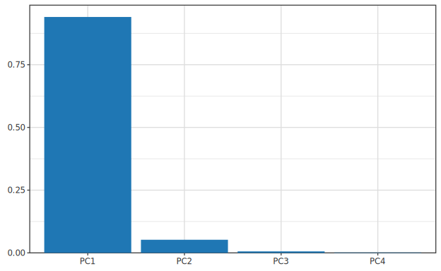
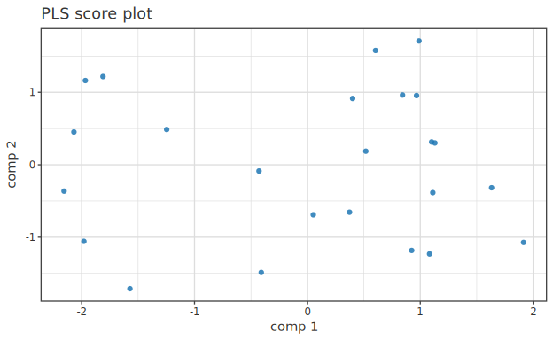
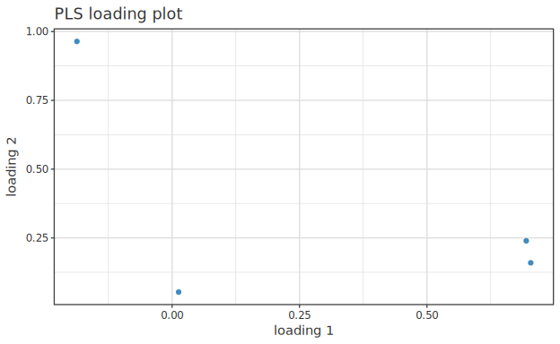
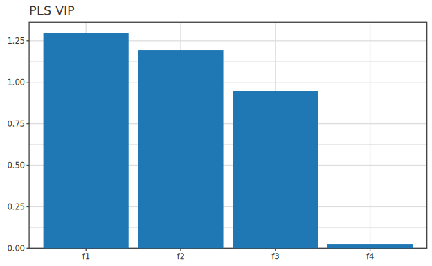
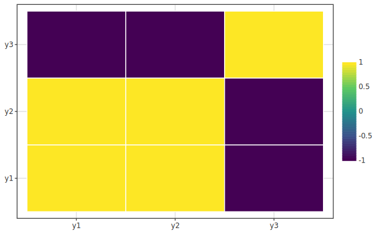
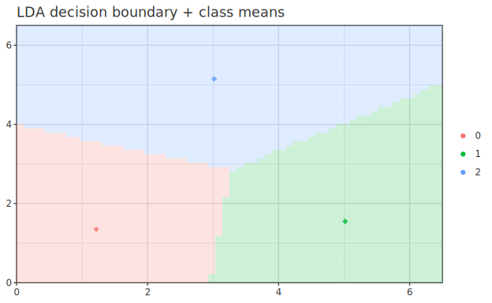
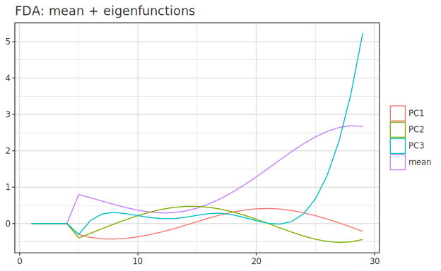

# 多変量解析

> [📚 索引](README.md) ｜ [01 quickstart](01-quickstart.md) ｜ [02 regression](02-regression.md) ｜ [03 bayesian-hbm](03-bayesian-hbm.md) ｜ **04 multivariate** ｜ [05 ml](05-ml.md) ｜ [06 timeseries](06-timeseries.md) ｜ [07 survival](07-survival.md) ｜ [08 causal](08-causal.md) ｜ [09 doe](09-doe.md) ｜ [10 stat](10-stat.md) ｜ [11 data](11-data.md) ｜ [12 plot](12-plot.md)

次元圧縮・多変量回帰・クラスタリングのシグネチャ + 最小例 + 図。 これらは `df |-> spec` 動詞を
持たないので、 行列で fit して結果を `toPlot` (または専用 plot 関数) で描く。 理論は
[`docs/regression/`](../regression/) ・ [`docs/stat/`](../stat/) のガイドが一次根拠。

| 手法 | 高レベル (`df \|->`) | 結果型 | 図 |
|---|---|---|---|
| PCA | `df \|-> pcaOf std mK cols` | `PCAResult` (Plottable) | scree |
| PLS | `df \|-> plsOf cfg xcols ycols` | `PLSFit` (Plottable=score) | score / loading / VIP |
| CCA | `df \|-> ccaOf xcols ycols` | `CCAFit` (toPlot 非対象) | — |
| 多変量回帰 (RRR 等) | `MultiFit` 系 | `MultiFit` (Plottable) | 残差相関 heatmap |
| 判別分析 (LDA) | `df \|-> ldaOf cols clsCol` | `DiscriminantFit` (Plottable) | 決定境界 |
| k-means | `df \|-> kmeansOf cfg seed cols` | `KMeansResult` (Plottable) | クラスタ散布 |
| 階層クラスタ | `Hanalyze.Model.HierarchicalCluster` | `HClusterFit` (Plottable) | dendrogram |
| 関数データ解析 (FDA) | `Hanalyze.Model.FDA` | `FunctionalPCA` / `FLMResult` (Plottable) | 固有関数 / β(t) |

---

## PCA

**高レベル** (列名で `df |->`・Phase 70.A):

```haskell
pcaOf :: PCAStandardize -> Maybe Int -> [Text] -> PCASpec
--       標準化方針        保持成分数 k    変数列名
```

```haskell
let res = df |-> pcaOf CenterScale (Just 3) ["x1","x2","x3"]   -- PCAResult
saveSVG "scree.svg" $ toPlot res                                -- 寄与率 scree (データ無し図)
```



> **標準化方針** (`PCAStandardize`) = SVD 前の列前処理: `NoStandardize` (何もしない) /
> `Center` (列平均を引く・PCA 既定) / `CenterScale` (平均を引き SD で割る = 相関行列 PCA)。
> 変数の単位がバラバラなら `CenterScale`。
>
> **`saveSVG` を使う理由**: PCA scree のようにデータ列を重ねない図は `saveSVG (toPlot res)` で
> 直接保存する (`noDf |>>` は不要)。 `df |>> (layer (scatter …) <> toPlot …)` は散布図に
> 重畳する時だけ。

**低レベル** (行列 API): `pca :: PCAStandardize -> Maybe Int -> LA.Matrix Double -> PCAResult`。
`pcaTransform` / `pcaInverse` / `pcaCumExplained` で射影・復元・累積寄与。

---

## PLS (部分最小二乗)

**PLS は回帰**(X p 次元 → Y q 次元)。 fit 結果 `PLSFit` は回帰係数 `plsCoef :: Matrix (p×q)` を
持ち、 `predictPLS :: PLSFit -> Matrix -> Matrix` で ŷ を出せる。

**高レベル** (列名で `df |->`・Phase 70.A):

```haskell
plsOf :: PLSConfig -> [Text] -> [Text] -> PLSSpec     -- X 列・Y 列を分けて指定
```

```haskell
let m = df |-> plsOf defaultPLSConfig ["x1","x2"] ["y1","y2"]   -- PLSFit
saveSVG "pls.svg" $ toPlot m                                     -- 代表図 = score plot
```

`defaultPLSConfig` は k=2・NIPALS・**scale=True** (X,Y を列ごと標準化)。

**診断図**: `PLSFit` は `Plottable` で `toPlot = scoreView` (代表図 = score)。 score/loading/VIP は
中間 Plottable Spec `PLSView` に揃え (Phase 70.B)、 `toPlot` で図にする:

```haskell
scoreView, loadingView, vipView :: PLSFit -> PLSView   -- PLSView は Plottable

saveSVG "score.svg" $ toPlot (scoreView   m)   -- = toPlot m (代表図)
saveSVG "loading.svg" $ toPlot (loadingView m)
saveSVG "vip.svg" $ toPlot (vipView     m)
```







> score/loading/VIP は**潜在空間の診断図**で回帰直線そのものではない (PLS は通常多入力多出力)。

**効果プロット** (Phase 70.B): 回帰として「ある入力を動かしたときの予測 ŷ の動き」を見るには、
frame 保持ラッパ `plsModel` を組み `statModelMulti` に載せる (LM/GLM と同じ along/holdAt/byVar)。
多出力は `selectOutput "y2"` で描く Y を選ぶ:

```haskell
plsModel     :: PLSConfig -> [Text] -> [Text] -> d -> Either String PLSModel  -- ColumnSource d
selectOutput :: Text -> PLSModel -> PLSModel                                   -- 描く Y 出力を選択

let Right pm = plsModel defaultPLSConfig ["x1","x2"] ["y1","y2"] df
-- x1 を動かし他を中央値固定・第2出力 y2 の効果曲線:
saveSVG "pls-effect.svg"
  $ toPlot (statModelMulti (selectOutput "y2" pm) (along "x1") <> holdAt Median)
```

> PLS は閉形式 CI を持たないので効果曲線は **band 非提供** (μ̂ 線のみ・GAM と同じ)。
> **低レベル**: 行列版 `fitPLS :: PLSConfig -> X -> Y -> Either Text PLSFit` /
> `pls :: Int -> X -> Y -> PLSFit` / `predictPLS :: PLSFit -> Matrix -> Matrix`。

---

## CCA / 多変量回帰

**高レベル** (列名で `df |->`・Phase 70.A):

```haskell
ccaOf :: [Text] -> [Text] -> CCASpec     -- df |-> ccaOf ["x1","x2"] ["y1","y2"]
```

```haskell
let m = df |-> ccaOf ["x1","x2"] ["y1","y2"]   -- CCAFit (ccaCorr = 正準相関)
```

`CCAFit` は現状 `toPlot` 非対象 (`ccaCorr`/`ccaScoresX` 等を数値で取得)。 **低レベル**:
`cca :: LA.Matrix Double -> LA.Matrix Double -> CCAFit`。

真の多出力回帰 (`MultiFit`) は `Plottable` で、 残差相関 heatmap を描ける。



→ [05-multivariate](../regression/05-multivariate.md) / [07-multireg](../regression/07-multireg.md)

---

## 判別分析 (LDA)

**高レベル** (列名で `df |->`・Phase 70.A・クラス列は `round` で整数化):

```haskell
ldaOf :: [Text] -> Text -> LDASpec       -- df |-> ldaOf ["x1","x2"] "class"
```

```haskell
let m = df |-> ldaOf ["x1","x2"] "class"   -- DiscriminantFit
```

`DiscriminantFit` は `Plottable`。 決定境界は分類器共通の `decisionBoundaryOf`(⚠ 領域塗りは
現状未実装で「未実装」 注記のみ・[05-ml](05-ml.md#k-nn) 参照)。
**低レベル**: `fitLDA :: LA.Matrix Double -> V.Vector Int -> Either Text DiscriminantFit`。

```haskell
case fitLDA xMat yInt of
  Right fit -> saveSVGBound "lda.svg"
    $ noDf |>> decisionBoundaryOf fit (xlo, xhi) (ylo, yhi) 80 <> toPlot fit
  Left err  -> putStrLn (T.unpack err)
```



---

## k-means クラスタリング

**高レベル** (`df |->`・Phase 70.A): `kmeansOf :: KMeansConfig -> Word32 -> [Text] -> KMeansSpec`
(第 2 引数 = 乱数 seed)。

```haskell
defaultKMeansConfig :: Int -> KMeansConfig    -- 引数 = クラスタ数 k
```

```haskell
let res = df |-> kmeansOf (defaultKMeansConfig 3) 42 ["x1","x2"]  -- KMeansResult
-- データ点をクラスタ色で散布 (clusterScatterOf) + centroid を ✚ (centroidsOf) で重ねる:
saveSVGBound "kmeans.svg" $ df |>> clusterScatterOf df res "x1" "x2" <> centroidsOf res 0 1
```

> k-means は内部で乱数を使う。 `df |->` (純粋) に載せるため、 seed 純粋化した
> `kMeansPure :: KMeansConfig -> LA.Matrix Double -> Word32 -> KMeansResult` を呼ぶ
> (同 seed → ビット同一・HBM の `nutsPure` と同方針)。 IO 版 `kMeans` も従来通り。


→ [05-cluster](../stat/05-cluster.md)

---

## 階層クラスタリング

`Hanalyze.Model.HierarchicalCluster` で凝集型クラスタリング。 `HClusterFit` は
`Plottable` (`toPlot` = dendrogram)。 樹形図は plot の custom mark (Phase 48・
`hgg-custom` の `dendrogramMark`) で U 字リンクを描く。
→ [05-cluster](../stat/05-cluster.md)

---

## 関数データ解析 (FDA・`Hanalyze.Model.FDA`)

センサ / プロセス時系列を **1 観測 = 1 関数** として扱う Ramsay-Silverman 流の FDA。
B-spline + P-spline penalty で平滑化し、 関数主成分 (FPCA) や関数線形回帰 (fLM) を
当てる。 平滑化解・mass matrix・knot 規約の罠は
[fda/usage-fda](../fda/usage-fda.ja.md) が一次根拠。

```haskell
data Basis = BSpline Int [Double]    -- degree・knots (★境界も含む全 knot 列)
smoothBasis    :: Basis -> Double -> LA.Vector Double -> LA.Matrix Double -> [FunctionalDatum]
--                basis    λ(penalty)  t grid             サンプル (n×n_grid)   → 平滑化関数列
evalFunctional :: FunctionalDatum -> LA.Vector Double -> LA.Vector Double      -- 任意 grid で評価
```

**FPCA** (`functionalPCA`) — 関数空間の SVD。 `FunctionalPCA` は `Plottable`
(`toPlot` = 平均関数 + 上位固有関数):

```haskell
functionalPCA :: Int -> [FunctionalDatum] -> FunctionalPCA   -- 上位 K 成分
-- fpcaEigenvalues (降順) / fpcaEigenfn (K×n_grid) / fpcaScores (n×K) / fpcaMeanFn
saveSVGBound "fda-fpca.svg" $ noDf |>> toPlot (functionalPCA 3 fits)
```



**fLM** (`fLM`) — 関数線形回帰 `y_i = α + ∫ x_i(t) β(t) dt + ε`。 `FLMResult` は
`Plottable` (`toPlot` = 係数曲線 β(t)):

```haskell
fLM :: [FunctionalDatum] -> LA.Vector Double -> Double -> FLMResult   -- fits, y, λβ
-- flmAlpha (α̂) / flmBetaFn (β̂(t) grid) / flmFitted (ŷ) / flmR2
```
