# 機械学習

> 🌐 [English](05-ml.md) | **日本語**

> [📚 索引](README.ja.md) ｜ [01 quickstart](01-quickstart.ja.md) ｜ [02 regression](02-regression.ja.md) ｜ [03 bayesian-hbm](03-bayesian-hbm.ja.md) ｜ [04 multivariate](04-multivariate.ja.md) ｜ **05 ml** ｜ [06 timeseries](06-timeseries.ja.md) ｜ [07 survival](07-survival.ja.md) ｜ [08 causal](08-causal.ja.md) ｜ [09 doe](09-doe.ja.md) ｜ [10 stat](10-stat.ja.md) ｜ [11 data](11-data.ja.md) ｜ [12 plot](12-plot.ja.md)

木・ブースティング・近傍法などの教師あり学習。 行列で fit して結果を `toPlot` で描く
(分類器の決定境界・混同行列は共通の `decisionBoundaryOf` / `confusionOf`)。 理論は
[ml/usage-ml-extensions](../ml/usage-ml-extensions.ja.md) ・ [08-decisiontree](../regression/08-decisiontree.ja.md) が一次根拠。

高レベルは **`df |-> spec`**。 各 spec は **特徴列リスト `[Text]`** と **クラス列 / 応答列 `Text`**
を取る。 命名は scikit-learn 流に **分類 `Cls`・回帰 `Reg` を接尾**して両方明示し(`randomForestReg` /
`randomForestCls`、 `gbmReg` / `gbmCls`、 `knnReg` / `knnCls` …)、 **無印は作らない**。 分類か回帰の
一方しか無いものだけ無印(`decisionTree` / `naiveBayes` は分類のみ)。 純粋 fit のもの
(GBM/決定木/k-NN/NB)はそのまま `df |->`、 RNG を使う Random Forest / NN は seed を取る
spec で純粋化(後述)。

| 手法 | 高レベル (`df \|->`) | 結果型 | 図 |
|---|---|---|---|
| 勾配ブースティング (回帰) | `df \|-> gbmReg cfg featCols yCol` | `GBRegressor` (Plottable) | 重要度 bar |
| 勾配ブースティング (分類) | `df \|-> gbmCls cfg featCols clsCol` | `GBClassifier` (Plottable) | 重要度 bar |
| 決定木 | `df \|-> decisionTree cfg featCols clsCol` | `DTFit` (Plottable) | 木構造 (rpart.plot 流) |
| k-NN (分類) | `df \|-> knnCls k featCols clsCol` | `KNNClassifier` (Plottable) | 決定境界 / 混同行列 |
| k-NN (回帰) | `df \|-> knnReg k featCols yCol` | `KNNRegressor` | — |
| Naive Bayes | `df \|-> naiveBayes featCols clsCol` | `NBModel` (Plottable) | 決定境界 |
| Random Forest (回帰) | `df \|-> randomForestReg cfg seed featCols yCol` | `RandomForest` (Plottable) | 重要度 2 パネル (impurity/permutation) |
| Random Forest (分類) | `df \|-> randomForestCls cfg seed featCols clsCol` | `RFClassifierFit` (Plottable) | 重要度 2 パネル (permutation/gini)・OOB 誤り率 |
| ニューラルネット (古典 MLP・分類) | `df \|-> mlpCls cfg seed featCols clsCol` | `MLPFit` | 損失曲線 / 決定境界 |
| ニューラルネット (古典 MLP・回帰) | `df \|-> mlpReg cfg seed featCols yCol` | `MLPFit` | 損失曲線 |
| SVM (分類・カーネル選択・CV 調律) | `df \|-> svmCls cfg featCols clsCol` | `SVMMulti` | 決定境界 (非線形) / 混同行列 |
| MDS (教師なし次元圧縮) | `df \|-> mds cfg featCols` | `MDSResult` (Plottable) | 埋め込み散布 |

> - **`featCols :: [Text]`** = 特徴量(予測子)の列名リスト。 **`clsCol` / `yCol :: Text`** =
>   分類のクラス列 / 回帰の応答列(単一)。 クラス列は内部で `round` され整数クラスに、
>   応答列は実数のまま。
> - 低レベル行列 API (`fitGBRegressor` / `fitDTV` / `fitKNNC` / `fitGNB` 等) は各節に併記。

---

## Random Forest

回帰は `randomForestReg`、 分類は `randomForestCls`。 **応答列が実数なら回帰・クラス列なら分類**。
どちらも `df |->` に乗り、 seed を取り(木ごとのブートストラップ・特徴サンプリングに乱数を使う)、
図は R `varImpPlot` 流の**特徴量重要度 2 パネル**(降順・実列名・横棒)。 `gbmReg` / `gbmCls` と
同様、 回帰・分類は `Reg` / `Cls` の対称な命名で受ける(無印は作らない):

```haskell
randomForestReg :: RFConfig  -> Word32 -> [Text] -> Text -> RFSpec    -- 回帰 → RandomForest    (Plottable)
randomForestCls :: RFCConfig -> Word32 -> [Text] -> Text -> RFCSpec   -- 分類 → RFClassifierFit (Plottable)
-- 引数: 設定 / 乱数 seed / 特徴列 / 応答列 (回帰=実数の yCol・分類=クラスの clsCol)
```

設定は回帰・分類で別型(フィールド名も別):

```haskell
data RFConfig = RFConfig          -- defaultRandomForest (回帰)
  { rfTrees      :: Int           -- 木の本数              (既定 100)
  , rfMaxDepth   :: Int           -- 木の深さ上限          (既定 12)
  , rfMinSamples :: Int           -- 分割に要する最小標本数 (既定 3)
  , rfMtry       :: Maybe Int     -- 分割候補の特徴数 (Nothing で √p・既定 Nothing)
  , rfBootstrap  :: Bool          -- ブートストラップ標本を取るか (既定 True)
  }

data RFCConfig = RFCConfig        -- defaultRFCConfig (分類)
  { rfcNTrees   :: Int            -- 木の本数              (既定 100)
  , rfcMaxDepth :: Maybe Int      -- 深さ上限 (Nothing で無制限・既定 Just 10)
  , rfcMinSplit :: Int            -- 分割に要する最小標本数 (既定 2)
  }
```

回帰・分類を並べて当てはめ、 それぞれ重要度図を出す:

```haskell
let randomForestRegModel = df |-> randomForestReg defaultRandomForest 42 ["area","age","noise"] "price"    -- RandomForest
    randomForestClsModel = df |-> randomForestCls defaultRFCConfig    42 ["x1","x2","x3"]       "species"  -- RFClassifierFit
saveSVG "rf-importance.svg"  $ toPlot randomForestRegModel
saveSVG "rfc-importance.svg" $ toPlot randomForestClsModel
```

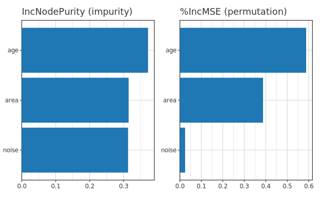

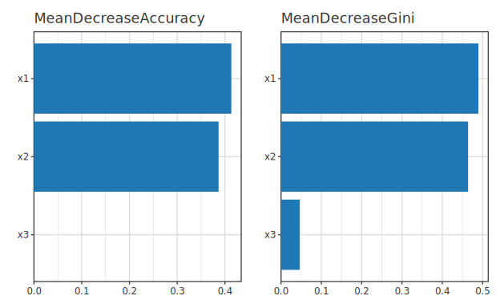

**回帰**の 2 パネルは **impurity(IncNodePurity)** と **permutation(%IncMSE)**。 impurity は
高カーディナリティ特徴を過大評価しがちなので permutation を併記する。 予測・アクセサ =
`predictRF` / `featureImportance`(impurity)/ `rfPermutationImportance`。

**分類**の 2 パネルは **permutation(MeanDecreaseAccuracy)** と **gini 減少(MDI)**。 予測・アクセサ =
`predictRFClassifier` / `rfcOOBError`(OOB 誤り率)/ `rfcClasses`。

---

## 勾配ブースティング (GBM)

回帰は `gbmReg`、 分類は `gbmCls`。 どちらも `df |->` に乗り、 図は特徴量重要度 bar:

```haskell
gbmReg :: GBConfig -> [Text] -> Text -> GBRSpec   -- 回帰 → GBRegressor  (Plottable)
gbmCls :: GBConfig -> [Text] -> Text -> GBCSpec   -- 分類 → GBClassifier (Plottable)
```

設定 `GBConfig`(回帰・分類で共通):

```haskell
data GBConfig = GBConfig          -- defaultGBM
  { gbNRounds    :: Int           -- ブースティング回数 M       (既定 100)
  , gbMaxDepth   :: Int           -- 各弱学習器の深さ (典型 3-5・既定 3)
  , gbMinSamples :: Int           -- 葉の最小サンプル数          (既定 2)
  , gbLearnRate  :: Double        -- 学習率 η (典型 0.1・既定 0.1)
  }
```

```haskell
let gbmRegModel = df |-> gbmReg defaultGBM ["x1","x2"] "y"   -- GBRegressor
saveSVG "gbm-importance.svg" $ toPlot gbmRegModel
```


**低レベル**: `fitGBRegressor :: GBConfig -> Matrix Double -> VU.Vector Double -> GBRegressor` /
`fitGBClassifier :: … -> VU.Vector Int -> GBClassifier`。 予測は `predictGBR` / `predictGBC` /
`predictGBCProbs`(分類ラベル / 確率)。

---

## 部分従属図 (PDP / ICE)

注目特徴を grid で振り、 他特徴は訓練分布のまま各行を予測して**平均**した曲線(R `pdp::partial` /
sklearn `PartialDependenceDisplay` 相当・モデル種に依らない)。 木系アンサンブル (`RandomForest` /
`GBRegressor`) の学習済モデルに当てる。

PDP は HBM 抽出子 (`forestOf` 等) と同じく **Plottable 中間型** (`pdp`) を `toPlot` で描き、
`<>` で装飾を合成する。 `featCols` = fit に使った特徴列、 最後の引数 = 部分従属を見る列:

```haskell
-- randomForestRegModel = df |-> randomForestReg … ["area","age","noise"] "price" で学習済
saveSVGBound "pdp-area.svg" $
  noDf |>> toPlot (pdp randomForestRegModel trainDf ["area","age","noise"] "area")
           <> title "Partial dependence: price ~ area"
```

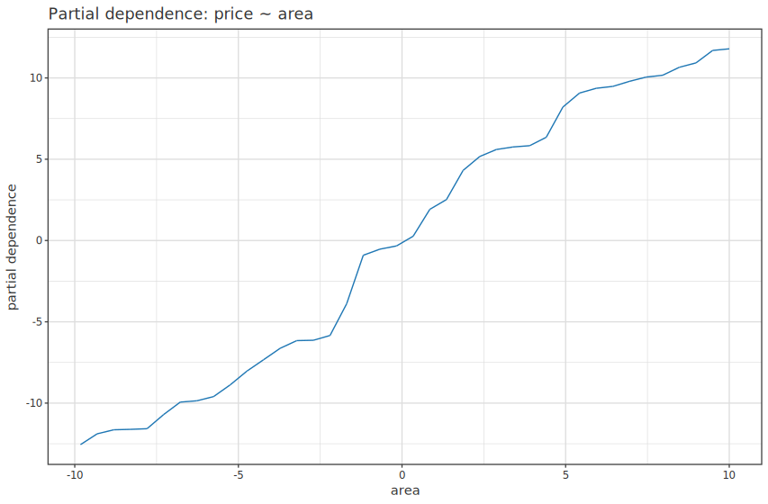

`pdpIce` は個体ごとの曲線 (ICE) を薄灰で重ね、 平均 (PDP) を上描きする (sklearn `kind='both'`)。
曲線が平行なら特徴間の交互作用が弱いと読める:

```haskell
saveSVGBound "pdp-ice-area.svg" $
  noDf |>> toPlot (pdpIce randomForestRegModel trainDf ["area","age","noise"] "area")
           <> title "ICE + PDP: price ~ area"
```

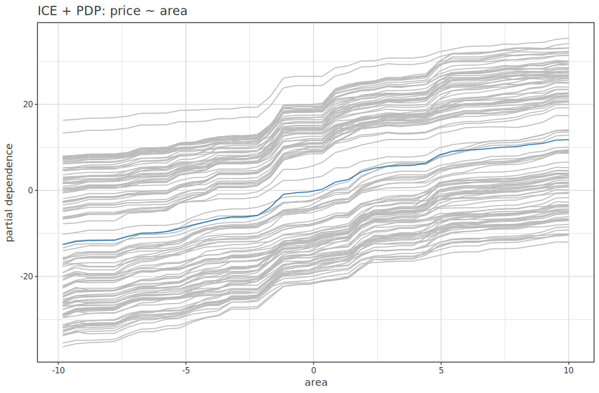

> HBM の fit は事後分布を内包し自己完結だが、 RF/GBM は訓練データを保持しないため PDP は
> 訓練 df を受け取る (周辺化に訓練分布が要る)。 'VisualSpec' を直に返す旧
> `pdpOf model df featCols target` / `pdpIceOf` も後方互換で残る。

**低レベル**: 行列 + 列 index を直接取る `pdpPlot` / `pdpIcePlot`、 純粋核 `partialDependence`
(`Hanalyze.Model.PartialDependence` → `PDPResult`)。

---

## 決定木

分類のみ:

```haskell
decisionTree :: DTConfig -> [Text] -> Text -> DTSpec   -- 分類 → DTFit (Plottable)
```

設定 `DTConfig`(既定は sklearn 互換):

```haskell
data DTConfig = DTConfig          -- defaultDecisionTree
  { dtMaxDepth        :: Maybe Int  -- 深さ上限 (Nothing で無制限・既定 Nothing)
  , dtMinSamplesSplit :: Int        -- 分割に要する最小標本数        (既定 2)
  , dtMinSamplesLeaf  :: Int        -- 葉の最小標本数                (既定 1)
  , dtMinImpurity     :: Double     -- 分割を許す最小不純度減少      (既定 0)
  }
```

`df |-> decisionTree` は `DTFit`(木 + 特徴量名 + クラス名 levels)を返す。 クラス列は **factor(text)
列でも数値列でもよく**、 text なら levels 名がそのまま図のクラス名になる(数値は `0`/`1`/… )。 図は
`toPlot`(R `rpart.plot` 流)で、 各ノードに予測クラス・全クラス確率・サンプル割合を出し、 クラス別
ColorBrewer を確率で濃淡付け・分割条件・`yes`/`no`・凡例まで R 同体裁で描く。 **名前は `DTFit` に
載っているので手渡し不要**:

```haskell
let decisionTreeCls = df |-> decisionTree defaultDecisionTree { dtMaxDepth = Just 3 } ["Petal.Length","Petal.Width"] "species"
saveSVG "decisiontree-rpart.svg" $ toPlot decisionTreeCls
```

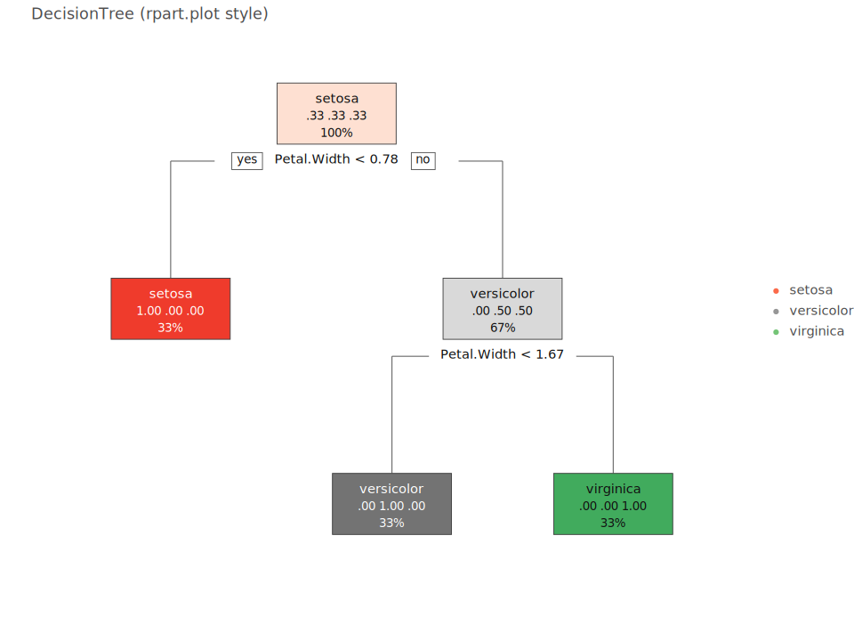

分岐規則を**テキスト**で出すなら `printRpart decisionTreeCls`(R `print.rpart` 形式・
`node) split n loss yval (yprob) *`)。 行列 + 名前を直接渡す低レベルは `treePlotRaw` /
`printRpartRaw`(`[Text] 特徴量名 -> [Text] クラス名 -> DTree`)。

---

## k-NN

分類は `knnCls`、 回帰は `knnReg`(第 1 引数 = 近傍数 k):

```haskell
knnCls :: Int -> [Text] -> Text -> KNNCSpec   -- 分類 → KNNClassifier (Plottable + ClassPredict)
knnReg :: Int -> [Text] -> Text -> KNNRSpec   -- 回帰 → KNNRegressor
```

分類器共通(以降も同じ): `confusionOf clf xTest yTest`(混同行列)。 `decisionBoundaryOf`(2 特徴平面の
決定領域)は `res×res` グリッドを予測しクラス色で**領域塗り**(sklearn `DecisionBoundaryDisplay` 相当・
annotation ベース)。 訓練点は `<> toPlot clf` で上に重ねられ、 塗り色は凡例と一致する。

```haskell
import Hanalyze.Plot (toPlot, decisionBoundaryOf, confusionOf, knnCls, (|->))

let knnClsModel = df |-> knnCls 5 ["x1","x2"] "species"     -- KNNClassifier (k=5)
saveSVG "knn.svg"           $ decisionBoundaryOf knnClsModel (0, 8) (0, 4) 80 <> toPlot knnClsModel
saveSVG "knn-confusion.svg" $ confusionOf knnClsModel xTest yTest
```


**低レベル**: `fitKNNC :: Int -> Matrix Double -> VU.Vector Int -> KNNClassifier` /
`fitKNNR :: … -> VU.Vector Double -> KNNRegressor`。 予測は `predictKNNC` / `predictKNNCProbs` /
`predictKNNR`(brute-force ユークリッド距離)。 `confusionOf` は `ClassPredict` を持つ分類器なら種に依らず動く。

### 透過標準化ラッパ (`standardized` / `standardizedY`)

k-NN のような距離ベースモデルは特徴量スケールを揃えないと桁の大きい列に距離が支配される。
`standardized` は spec を透過的にラップし、 学習は標準化空間で行いつつ**図・予測を元スケールへ
自動逆変換**する(tidymodels `step_normalize` / sklearn `Pipeline` 相当・列名は spec 自身が持つ):

```haskell
import Hanalyze.Plot (toPlot, standardized, standardizedY, knnReg, lm, (|->))

let knnRegModel = df |-> standardized (knnReg 3 ["temp", "conc"] "rate")   -- X のみ標準化・図は元スケール
    lmModel     = df |-> standardizedY (lm "temp" "rate")                  -- 応答 y も標準化 (opt-in)
```

`standardizedY`(X + 応答 y)は予測・CI の逆変換を伴うため明示的 opt-in。 無意味・有害な spec は
コンパイルは通るが `fitEither` が `Left` を返して弾く:

| spec | `standardized` | `standardizedY` |
|---|---|---|
| `knnReg` / `knnCls` (距離ベース・**本命**) | ✅ | 回帰のみ ✅ / 分類は `Left` |
| `lm` / `glm` / `spline` / `rlm` / `rq` / `lmMulti` / … (線形・整形目的) | ✅ | 連続応答回帰のみ ✅ |
| `gp` / `regularized` / `pca` / `pls` (**内部で標準化済**) | `Left` (二重標準化回避) | `Left` |
| `decisionTree` / `randomForestReg` / `gbmReg` (木系・**スケール不変**) | `Left` (無意味) | `Left` |

- `glm` / `glmMulti` は応答が family/link でスケール拘束される (count / binary / 正値) ため
  `standardizedY` は `Left` (X 標準化 `standardized` のみ可)。
- 単変量 (予測子 1 列) では `toPlot` が**元スケールの散布 + 予測曲線**を自前で出す
  (内側 `toPlot` の標準化軸には依存しない)。

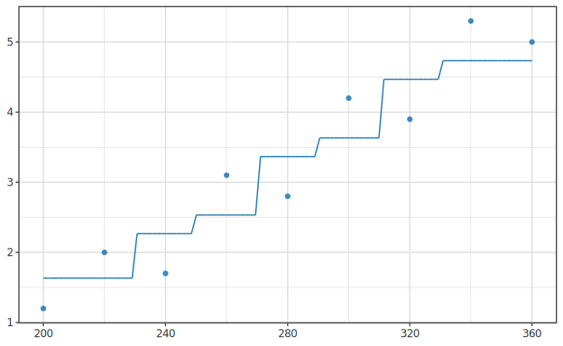

線形モデルでも透過標準化が使え、 回帰線と CI 帯がそのまま元スケールで出る (帯も逆変換):

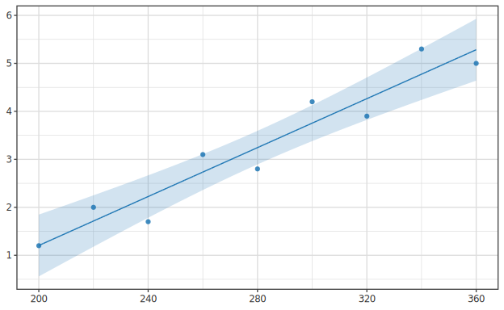

汎用の標準化ユーティリティ (`Standardizer` を直接組む) は
[10 stat の前処理節](10-stat.ja.md#前処理-標準化-statstandardize) を参照。

---

## Naive Bayes

分類のみ(連続特徴 = Gaussian NB)。 `NBModel` は `Plottable`(クラス平均散布)+ `ClassPredict`
なので k-NN と同じ `decisionBoundaryOf` / `confusionOf` が使える:

```haskell
naiveBayes :: [Text] -> Text -> NBSpec   -- 分類 → NBModel (Plottable + ClassPredict)
```

```haskell
let naiveBayesCls = df |-> naiveBayes ["x1","x2"] "species"   -- NBModel (= NBGaussian)
saveSVG "nb.svg" $ decisionBoundaryOf naiveBayesCls (0, 8) (0, 4) 60 <> toPlot naiveBayesCls
```

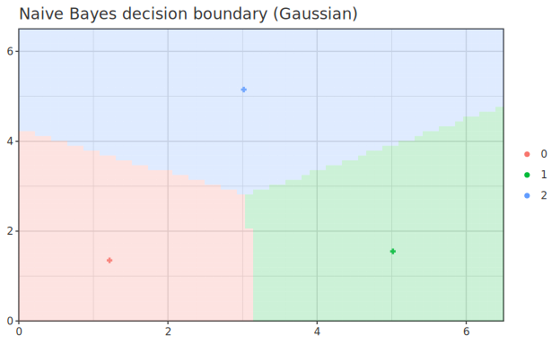

**低レベル**: `fitGNB :: Matrix Double -> VU.Vector Int -> GaussianNB`(連続)/
`fitMNB :: Double -> Matrix Double -> VU.Vector Int -> MultinomialNB`(Laplace α・非負カウント行列)。
`NBModel = NBGaussian GaussianNB | NBMultinomial MultinomialNB`。 予測は `predictNB`(ラベル)・
`predictNBLogProbs`(正規化済 log 事後)。

---

## SVM (サポートベクタマシン)

双対 C-SVC 一本。 カーネルを config で選ぶ(GP / KRR と共有の `Hanalyze.Model.Kernel`:
`Linear` / `Poly d` / `RBF` / `Matern52` / `Periodic`・既定 `Linear`)。 SMO は乱数不使用ゆえ純粋・決定的。

分類のみ(多クラス one-vs-rest・`SVMMulti`。 回帰 SVR は未提供・足すときは `svmReg`)。
`ClassPredict` を持つので `confusionOf` が使える:

```haskell
svmCls :: SVMConfig -> [Text] -> Text -> SVMSpec   -- 分類 → SVMMulti (ClassPredict)
```

設定 `SVMConfig`:

```haskell
data SVMConfig = SVMConfig        -- defaultSVM
  { svmC         :: Double        -- 正則化 C (0 ≤ α ≤ C・大きいほど違反に厳しい・既定 1)
  , svmKernel    :: Kernel        -- カーネル (既定 Linear)
  , svmParams    :: KernelParams  -- ハイパラ (RBF/Poly の γ = 1/(2ℓ²)・Linear 倍率 = σ_f²)
  , svmTol       :: Double        -- KKT 許容              (既定 1e-3)
  , svmMaxPasses :: Int           -- 無変化パスの連続上限   (既定 5)
  , svmMaxIter   :: Int           -- 総パス上限 (安全弁)    (既定 1000)
  , svmHyper     :: SVMHyper      -- ハイパラの決め方 (既定 SVMFixed・下記 CV 調律)
  }
```

```haskell
import Hanalyze.Plot (svmCls, defaultSVM, SVMConfig (..), confusionOf, (|->))
import Hanalyze.Model.Kernel (Kernel (..), KernelParams (..), defaultKernelParams)

let rbfCfg = defaultSVM { svmKernel = RBF, svmParams = defaultKernelParams { kpLengthScale = 1.0 }, svmC = 10 }
    svmClsModel = df |-> svmCls rbfCfg ["x1","x2"] "species"   -- SVMMulti
```

カーネル SVM も他の分類器 (k-NN / Naive Bayes / MLP) と同じく `decisionBoundaryOf` で
**非線形の決定領域**をクラス色で塗り分けられる (RBF なら曲がった境界)。 訓練点を上に重ねる。


**CV 自動調律**: GP/KRR と同じく調律は **config に畳む**(別動詞は作らない)。 `svmHyper` に
`SVMTuneCV grid` を入れると、 `svmCls` が k-fold CV accuracy 最大でハイパラを選び再学習する
(sklearn `GridSearchCV` / R `e1071::tune.svm` 相当・固定 seed で決定的):

```haskell
import Hanalyze.Plot (svmCls, defaultSVM, SVMHyper (..), SVMTuneGrid (..), defaultSVMTuneGrid, (|->))

let grid = defaultSVMTuneGrid { svmtCs = [0.1, 1, 10], svmtLengths = [0.5, 1, 2], svmtFolds = 5 }
    svmClsModel = df |-> svmCls defaultSVM { svmHyper = SVMTuneCV grid } ["x1","x2"] "species"  -- CV で再学習
```

`SVMHyper = SVMFixed`(既定・config の値で固定)`| SVMTuneCV SVMTuneGrid`(CV 探索)。 `SVMTuneGrid`:
`svmtCs`(C 候補)・`svmtKernels`(カーネル候補)・`svmtLengths`(ℓ 候補)・`svmtFolds`(fold 数)。
行列直接は `tuneSVM cfg grid xMat y :: (SVMConfig, Double)`(最良 config, 平均 CV accuracy)。

**低レベル** (`Hanalyze.Model.SVM`): 2 クラス `fitSVM cfg xMat yLab`(`yLab ∈ {0,1}`)/
多クラス `fitSVMMulti`。 予測は `predictSVM`(ラベル)・`predictSVMScore`(決定スコア)・`predictSVMMulti`。
`numSupportVectors` で SV 数、 `svmSupportVectorsOf` で SV マーカー重畳(境界線 `decisionLineOf` と併せ backlog)。

---

## MDS (多次元尺度構成法)

サンプル間の距離を保ったまま 2D へ配置する次元圧縮。 手法は `MDSClassical`(Torgerson・
ユークリッド距離なら PCA と等価)と `MDSSammon`(小距離重視の非線形版)。 `df |->` に乗り
**モデル型 `MDSResult`** を返す:

```haskell
import Hanalyze.Plot (mds, defaultMDS, MDSConfig (..), MDSMethod (..)
                            , toPlot, mdsView, mdsGroupBy, (|->))

let mdsModel = df |-> mds defaultMDS ["x1","x2","x3"]   -- MDSResult
saveSVG "mds.svg"   $ noDf |>> toPlot mdsModel                                   -- 単色の埋め込み散布
saveSVG "mds-g.svg" $ noDf |>> toPlot (mdsView mdsModel <> mdsGroupBy "species") -- species で群色

let mdsSammonModel = df |-> mds defaultMDS { mdsMethod = MDSSammon } ["x1","x2","x3"]  -- Sammon
```

群色は `mdsGroupBy "列名"` で指定(`statColor` は `Color` 専用ゆえ列名指定は別オプション)。
低レベルの行列カーネル(`mdsClassical` / `mdsSammon` / `euclideanDist`・`Hanalyze.Stat.MDS`)も残る。

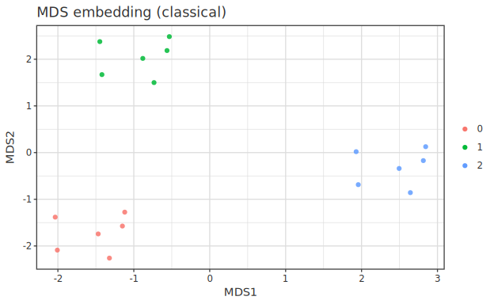

---

## ニューラルネット (古典 MLP)

分類は `mlpCls`、 回帰は `mlpReg`。 seed を取る純粋版を内部で呼ぶので `df |->` に載る。 分類 NN は
`ClassPredict` なので `decisionBoundaryOf` で**非線形の決定領域**を塗り分けられる。 損失曲線
`nnLossOf` で収束を確認する:

```haskell
mlpCls :: MLPConfig -> Word32 -> [Text] -> Text -> MLPClsSpec   -- 分類 → MLPFit (ClassPredict)
mlpReg :: MLPConfig -> Word32 -> [Text] -> Text -> MLPRegSpec   -- 回帰 → MLPFit
```

設定 `MLPConfig`(回帰・分類で共通):

```haskell
data MLPConfig = MLPConfig        -- defaultMLP
  { mlpHidden      :: [Int]       -- 各隠れ層のユニット数          (既定 [16])
  , mlpActHidden   :: Activation  -- ReLU/Sigmoid/Tanh/Identity/Softmax (既定 ReLU)
  , mlpLR          :: Double      -- 学習率                       (既定 0.01)
  , mlpEpochs      :: Int         -- エポック数                   (既定 200)
  , mlpBatch       :: Int         -- ミニバッチサイズ             (既定 16)
  , mlpL2          :: Double      -- L2 正則化                    (既定 0)
  , mlpStandardize :: Bool        -- X を z-score 標準化するか     (既定 True)
  }
```

```haskell
import Hanalyze.Plot (mlpCls, mlpReg, nnLossOf, decisionBoundaryOf, toPlot, (|->))

let mlpClsModel = df |-> mlpCls defaultMLP 42 ["x1","x2"] "species"   -- 42 = seed・MLPFit
saveSVG "nn-decision-boundary.svg" $ decisionBoundaryOf mlpClsModel (-4, 4) (-4, 4) 80
                                       <> layer (scatter "x1" "x2" <> colorBy "cls")
saveSVG "nn-loss.svg"              $ nnLossOf mlpClsModel
```

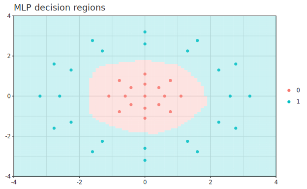

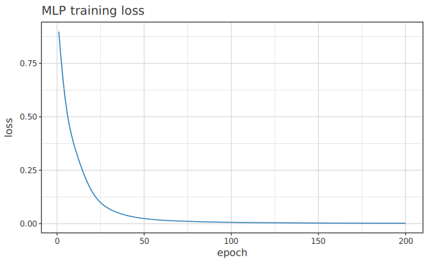

> ⚠ **古典 MLP のみ**(全結合フィードフォワード + 誤差逆伝播・mini-batch Adam + L2)。
> CNN / RNN / Transformer・GPU・自動微分フレームワークは対象外。 表形式データの非線形回帰/分類向け。

**低レベル**: 純粋版 `fitMLPClassifierPure cfg xMat yLab seed` / `fitMLPRegressorPure`(同 seed →
ビット同一)。 IO 版 `fitMLPClassifier … gen`(進捗 callback 用)も残る。

MDS の B 行列導出・Sammon stress・NB の理論は
[ml/usage-ml-extensions](../ml/usage-ml-extensions.ja.md) が一次根拠。
