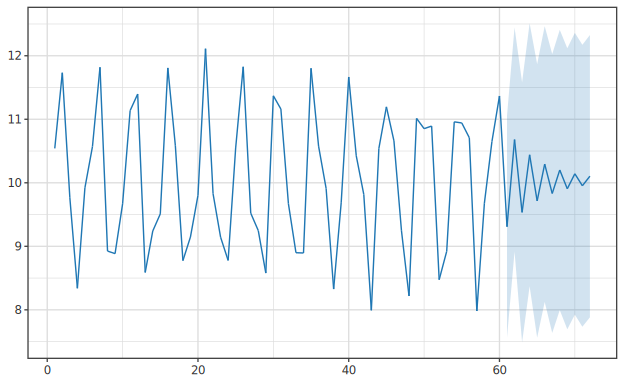

# Time Series

> 🌐 **English** | [日本語](06-timeseries.ja.md)

> [📚 Index](README.md) | [01 quickstart](01-quickstart.md) | [02 regression](02-regression.md) | [03 bayesian-hbm](03-bayesian-hbm.md) | [04 multivariate](04-multivariate.md) | [05 ml](05-ml.md) | **06 timeseries** | [07 survival](07-survival.md) | [08 causal](08-causal.md) | [09 doe](09-doe.md) | [10 stat](10-stat.md) | [11 data](11-data.md) | [12 plot](12-plot.md)

Autoregressive models, multivariate autoregression, volatility, and forecasting. Theory references: [09-timeseries](../regression/09-timeseries.md) and [usage-ts-surv-advanced](../timeseries/usage-ts-surv-advanced.md).

| Model | fit | Result Type | Plot |
|---|---|---|---|
| AR(p) + Forecast | `forecastModel p h ys` | `ForecastModel` (Plottable) | Forecast interval |
| VAR(p) | `fitVAR p yMat` | `VARFit` | (point forecast via `forecastVAR`) |
| GARCH(1,1) | `fitGARCH ys` | `GARCHFit` (Plottable) | Volatility |

---

## AR(p) + Forecast

```haskell
fitAR         :: Int -> LA.Vector Double -> ARFit          -- Fitting only
forecastModel :: Int -> Int -> LA.Vector Double -> ForecastModel   -- p, horizon h, series
```

`ForecastModel` is `Plottable` (history + forecast + interval).

```haskell
let fm = forecastModel 2 10 ys           -- AR(2), 10-step forecast
saveSVGBound "forecast.svg" $ noDf |>> toPlot fm
```



---

## VAR(p)

```haskell
fitVAR :: Int -> LA.Matrix Double -> VARFit       -- columns = variables, rows = time points
```

```haskell
let fit = fitVAR 1 yMat              -- VAR(1)
    fc  = forecastVAR fit yMat 12    -- 12-step point forecast
```

`VARFit` has no `Plottable` instance (point forecast via `forecastVAR`). Can extract residuals `varResiduals` ((n−p)×K) and residual covariance `varSigma`. The reason equation-by-equation OLS becomes MLE is covered in [usage-ts-surv-advanced](../timeseries/usage-ts-surv-advanced.md).

---

## GARCH(1,1)

```haskell
fitGARCH :: LA.Vector Double -> GARCHFit          -- Return series
```

`GARCHFit` is `Plottable` (`toPlot` = returns + conditional volatility).

```haskell
let fit = fitGARCH ys                -- De-mean capable return series
    fc  = forecastGARCH fit 10       -- 10-step σ² forecast (converges to ω/(1-α-β))
saveSVGBound "garch-volatility.svg" $ noDf |>> toPlot fit
```


GARCH model equation `σ²_t = ω + α ε²_{t-1} + β σ²_{t-1}` and re-parameterization of stationarity constraint (softplus + stick-breaking) are detailed in [usage-ts-surv-advanced](../timeseries/usage-ts-surv-advanced.md).

---

## State Space / Kalman Filter (Phase 15)

`Hanalyze.Model.StateSpace` provides linear Gaussian state space models and Kalman
filtering / smoothing (`toPlot` not supported; numerical results only).

```haskell
data StateSpaceModel = StateSpaceModel { ssmF, ssmH, ssmQ, ssmR :: LA.Matrix Double }
kalmanFilter   :: StateSpaceModel -> LA.Matrix Double -> FilterResult     -- Forward filter
kalmanSmoother :: StateSpaceModel -> LA.Matrix Double -> SmootherResult    -- RTS smoothing
```
