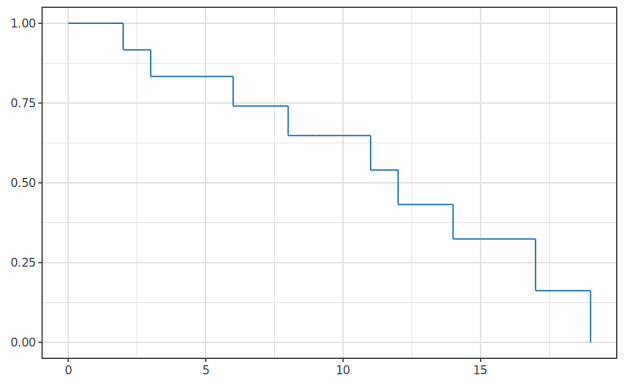
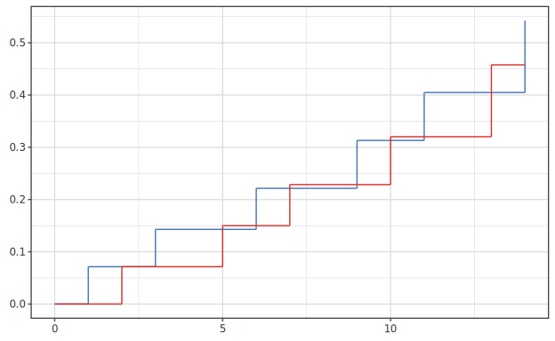
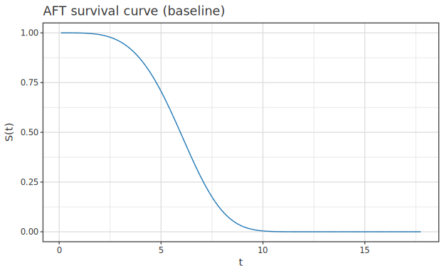

# 生存解析

> 🌐 [English](07-survival.md) | **日本語**

> [📚 索引](README.ja.md) ｜ [01 quickstart](01-quickstart.ja.md) ｜ [02 regression](02-regression.ja.md) ｜ [03 bayesian-hbm](03-bayesian-hbm.ja.md) ｜ [04 multivariate](04-multivariate.ja.md) ｜ [05 ml](05-ml.ja.md) ｜ [06 timeseries](06-timeseries.ja.md) ｜ **07 survival** ｜ [08 causal](08-causal.ja.md) ｜ [09 doe](09-doe.ja.md) ｜ [10 stat](10-stat.ja.md) ｜ [11 data](11-data.ja.md) ｜ [12 plot](12-plot.ja.md)

生存時間解析。 理論は [10-survival](../regression/10-survival.ja.md) ・
[usage-ts-surv-advanced](../timeseries/usage-ts-surv-advanced.ja.md) が一次根拠。

| 手法 | fit | 結果型 | 図 |
|---|---|---|---|
| Kaplan-Meier | `kaplanMeier samples` | `KMResult` (Plottable) | 生存曲線 |
| 競合リスク (CIF) | `Hanalyze.Model.CompetingRisks` | `CRFit` (Plottable) | 累積発生 |
| AFT (加速故障時間) | `fitAFT dist x t δ` | `IO (Either Text AFTFit)` (Plottable) | 生存曲線 |
| Cox 比例ハザード | `Hanalyze.Model.Survival` | (`toPlot` 非対象) | — |

---

## Kaplan-Meier

```haskell
kaplanMeier :: [SurvSample] -> KMResult
-- data SurvSample = SurvSample { 観測時間, イベント有無, … }
```

`KMResult` は `Plottable` (生存曲線 + 打ち切り点)。

```haskell
saveSVGBound "km.svg" $ noDf |>> toPlot (kaplanMeier samples)
```



---

## 競合リスク (累積発生関数 CIF)

`CRFit` は `Plottable` (`toPlot` = 各イベントの累積発生曲線)。

```haskell
fitCompetingRisks :: [CRSample] -> CRFit
-- data CRSample = CRSample { crTime :: Double, crCause :: Int }  -- crCause 0=打ち切り / ≥1=cause
```

```haskell
let samples = [ CR.CRSample 1.2 1, CR.CRSample 2.5 2, CR.CRSample 3.0 0 ]
saveSVGBound "cif.svg" $ noDf |>> toPlot (CR.fitCompetingRisks samples)
```



> Kalbfleisch-Prentice 推定量。 「cause 別データに 1−KM」 の素朴手法は上方バイアスを
> 持つので、 この CIF が古典的補正。 導出は [usage-ts-surv-advanced](../timeseries/usage-ts-surv-advanced.ja.md)。

---

## AFT (加速故障時間モデル)

```haskell
fitAFT :: AFTDistribution -> LA.Matrix Double -> LA.Vector Double -> V.Vector Bool -> IO (Either Text AFTFit)
--        分布                  x = 共変量行列        t = 時間            δ = イベント有無
```

`AFTFit` は `Plottable` (`toPlot` = baseline 共変量の生存曲線)。 任意の x での曲線は
`aftSurvivalAt`。

```haskell
import Hanalyze.Plot (toPlot, aftSurvivalAt)

Right fit <- fitAFT AFTWeibull xMat tVec deltaVec
-- 下図 = baseline の生存曲線 (toPlot)。 任意の共変量 x での曲線は aftSurvivalAt fit [1, 0.5]。
saveSVGBound "aft-survival.svg" $ noDf |>> toPlot fit <> title "AFT survival curve (baseline)"
```



---

## Cox 比例ハザード

`Hanalyze.Model.Survival` に Cox 比例ハザード。 現状 `toPlot` 非対象 (係数 / ハザード比は
数値で取得)。 → [10-survival](../regression/10-survival.ja.md)

---

## 信頼性ブロック図 (RBD)

`Hanalyze.Model.ReliabilityBlockDiagram` — 直列 / 並列 / k-of-n 構造の
システム信頼度をブロック構造から計算 (`toPlot` 非対象・スカラ結果)。

```haskell
data RBD = Leaf Double | Series [RBD] | Parallel [RBD] | KofN Int [RBD]
reliabilityOf :: RBD -> Double
-- Series = ∏ Rᵢ / Parallel = 1−∏(1−Rᵢ) / KofN k = n 個中 k 個以上動作 (Poisson-binomial DP)
```

```haskell
let sys = RBD.KofN 2 [ RBD.Series [RBD.Leaf 0.95, RBD.Leaf 0.99]
                     , RBD.Series [RBD.Leaf 0.95, RBD.Leaf 0.99]
                     , RBD.Series [RBD.Leaf 0.95, RBD.Leaf 0.99] ]
    r   = RBD.reliabilityOf sys
```

block 間の故障独立性が前提 (textbook RBD)。 → [usage-ts-surv-advanced](../timeseries/usage-ts-surv-advanced.ja.md)
