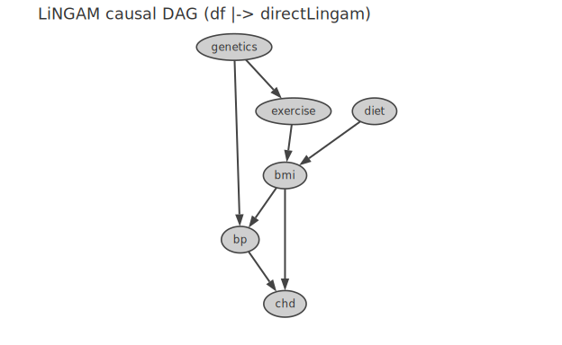
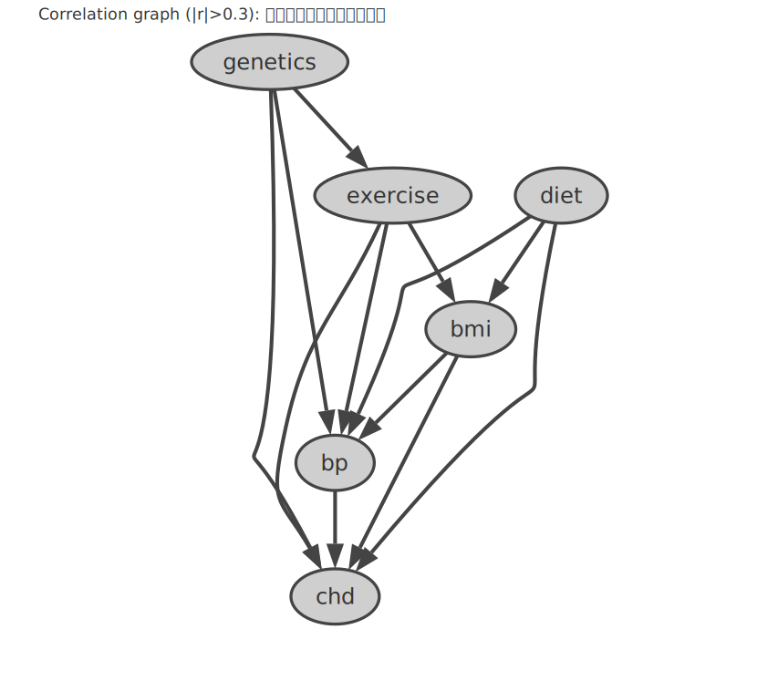
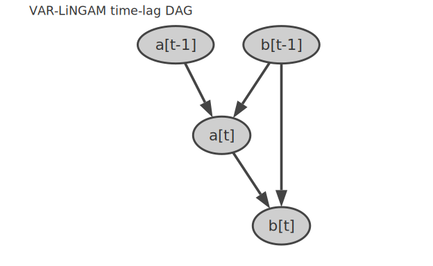
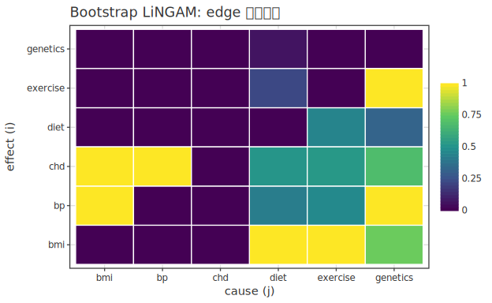

# Causal Inference

> 🌐 **English** | [日本語](08-causal.ja.md)

> [📚 Index](README.md) | [01 quickstart](01-quickstart.md) | [02 regression](02-regression.md) | [03 bayesian-hbm](03-bayesian-hbm.md) | [04 multivariate](04-multivariate.md) | [05 ml](05-ml.md) | [06 timeseries](06-timeseries.md) | [07 survival](07-survival.md) | **08 causal** | [09 doe](09-doe.md) | [10 stat](10-stat.md) | [11 data](11-data.md) | [12 plot](12-plot.md)

Propensity scores, IPW, doubly robust, CATE, and causal discovery (LiNGAM). Estimators return numerical results (`toPlot` not supported); only LiNGAM DAGs are plottable. Theory reference: [usage-causal](../causal/usage-causal.md).

| Method | Function (`Hanalyze.Stat.Causal.*`) | Result Type |
|---|---|---|
| Propensity Score | `propensityScore x t` | `PropensityScore` |
| IPW (Hajek) | `ipw x t y` | `IPWResult` |
| Doubly Robust (AIPW) | `doublyRobust x t y` | (ATE estimate) |
| CATE (meta-learner) | `fitCATE learner base …` | (CATE estimate) |
| Causal Discovery LiNGAM (7 variants) | `df \|-> directLingam cfg cols` etc. (below) | `LiNGAMFitted _` (Plottable; DAG with variable names) |

---

## Propensity Score / IPW / Doubly Robust

```haskell
propensityScore :: LA.Matrix Double -> LA.Vector Double -> PropensityScore
--                 Covariates X             Treatment T (0/1)
ipw             :: LA.Matrix Double -> LA.Vector Double -> LA.Vector Double -> IPWResult
--                 X                        T                   Outcome Y
doublyRobust    :: LA.Matrix Double -> LA.Vector Double -> LA.Vector Double -> DoublyRobustResult
```

```haskell
import qualified Hanalyze.Stat.Causal.PropensityScore as PS
import qualified Hanalyze.Stat.Causal.IPW             as IPW
import qualified Hanalyze.Stat.Causal.DoublyRobust    as DR

let ps = PS.propensityScore x t        -- Logistic GLM: p(X)=P(T=1|X)
    r  = IPW.ipw x t y                  -- Hajek normalized ATE/ATT
print (IPW.ipwATE r, IPW.ipwATT r)
let rDR = DR.doublyRobust x t y         -- Outcome model + PS (consistent if either correct)
print (DR.drATE rDR)
```

Result fields and helper functions:

| Function / Field | Role |
|---|---|
| `PS.psBeta ps` / `PS.psScores ps` | Logistic coefficients / length-`n` estimated probabilities `p̂(X)` |
| `PS.trimPropensity 0.01 0.99 ps` | Clip scores to `[0.01, 0.99]` (prevent weight inflation; **recommended**) |
| `PS.ipwWeights ps' t` | IPW weights vector for ATE |
| `IPW.ipwATE r` / `IPW.ipwATT r` | ATE / ATT estimates |
| `DR.drATE rDR` | AIPW ATE estimate |

`ipw` and `doublyRobust` automatically apply PS estimation internally with `defaultPSTrim = (0.01, 0.99)`. To reuse an existing PS, use `IPW.ipwWith ps' t y` / `DR.doublyRobustWith …`.

> IPW uses Hajek normalization by default (lower variance than Horvitz-Thompson). Estimator equations and positivity assumption breakdown are detailed in [usage-causal](../causal/usage-causal.md).

---

## CATE (Conditional Average Treatment Effect)

```haskell
fitCATE  :: CATELearner -> CATEBaseLearner
         -> LA.Matrix Double -> LA.Vector Double -> LA.Vector Double   -- X, T, Y
         -> MWC.GenIO -> IO CATEResult                                 -- RNG → IO
-- CATELearner     = SLearner | TLearner | XLearner   (meta-learner)
-- CATEBaseLearner = CATELM | CATERF RFConfig          (base learner)
```

```haskell
import qualified Hanalyze.Stat.Causal.CATE as CATE
import qualified Hanalyze.Model.RandomForest as RF
import qualified System.Random.MWC as MWC

gen <- MWC.create
r  <- CATE.fitCATE CATE.TLearner CATE.CATELM x t y gen          -- LM base
let rfCfg = RF.defaultRFConfig { RF.rfTrees = 100 }
r' <- CATE.fitCATE CATE.XLearner (CATE.CATERF rfCfg) x t y gen  -- RF base (nonlinear)
print (CATE.cateATE r)               -- Global average
LA.toList (CATE.cateEstimates r)     -- Per-unit τ̂_i
```

Combine S/T/X-learners with base learners (`CATELM` | `CATERF`). Trade-offs between the 3 learners (sample efficiency vs. heterogeneity recovery) and S-learner+LM constant-CATE pitfall are detailed in [usage-causal](../causal/usage-causal.md).

---

## Causal Discovery (LiNGAM)

LiNGAM assumes a linear SEM with **independent non-Gaussian errors** and identifies **causal direction** (DAG) from observational data. Fits with the same high-level `df |-> *Lingam cfg cols` API as other models; result `LiNGAMFitted _` is `Plottable`, so `toPlot` renders **DAG with actual variable names** (derived from `cols`).

```haskell
import Hanalyze.Plot (directLingam, toPlot, (|->), (|>>))
import Hanalyze.Model.LiNGAM.Direct (defaultDirectLiNGAMConfig)

let fit = df |-> directLingam defaultDirectLiNGAMConfig ["smoking","tar","cancer"]
saveSVGBound "lingam.svg" $ noDf |>> toPlot fit
```



**Correlation ≠ Causation**: Pairplot shows many correlated pairs, but LiNGAM DAG contains only **direct causal edges** (indirect correlations via mediators and confounding do not appear as edges).


A correlation-based graph with rule "`|r| > threshold` = edge" is possible (`df |-> correlationOf thr cols`), but this is **overly dense** with indirect and confounding correlations (example: 12 edges). LiNGAM uses non-Gaussianity to **reduce to direct causal edges and identify direction** (above DAG: 7 edges).

```haskell
import Hanalyze.Plot (correlationOf, toPlot, (|->), (|>>))

noDf |>> toPlot (df |-> correlationOf 0.3 ["genetics","diet","exercise","bmi","bp","chd"])
```



### 7 Variants

All 7 variants available via high-level API (all return `LiNGAMFitted` for DAG plotting).

| Variant | High-level API | Feature / Plot |
|---|---|---|
| Direct | `directLingam cfg cols` | Basic (causal order search; Shimizu 2011) |
| Parce | `parceLingam cfg cols` | Bottom-up sink search; robust to latent confounders |
| ICA | `icaLingam cfg cols` | ICA-based (Shimizu 2006; older, less accurate than Direct) |
| VAR | `varLingam cfg cols` | Time series (**time-lag DAG** `x_j[t-l]→x_i[t]`) |
| MultiGroup | `multiGroupLingam cfg cols groupCol` | **Common** DAG across groups (numeric group code column) |
| Pairwise | `pairwiseLingam thr xcol ycol` | **Direction only** for 2 variables (effective with strong unidirectionality) |
| Bootstrap | `bootstrapLingam cfg cols` | Edge **confidence** (appearance probability over B resamples) |

```haskell
-- VAR: time series causality (time-lag DAG)
noDf |>> toPlot (df |-> varLingam defaultVARLiNGAMConfig ["a","b"])
-- Bootstrap: confidence DAG (prob>=0.5) + edge probability heatmap
let bs = df |-> bootstrapLingam defaultBootstrapConfig cols
noDf |>> toPlot bs                     -- Confidence DAG
noDf |>> bootstrapEdgeProbOf bs        -- Edge appearance probability heatmap
```





> **Complexity**: DirectLiNGAM is O(p³·n) (variable count p is limiting; sample size n is linear). Empirically p≤40 is interactive (~15s), p≤80 is batch (~2 min), p>100 is impractical. Bootstrap is B×. For large p, consider ICA-LiNGAM or dimensionality reduction.
>
> IO versions (`fitBootstrapLiNGAM`/`fitICALiNGAM`) use randomness but are deterministic with fixed seed. The `df |->` path calls pure seed versions (`*Pure`), so **same seed yields bit-exact results**. Low-level `fit*LiNGAM cfg xMat` (matrix direct) remains in each `Model.LiNGAM.*`.
