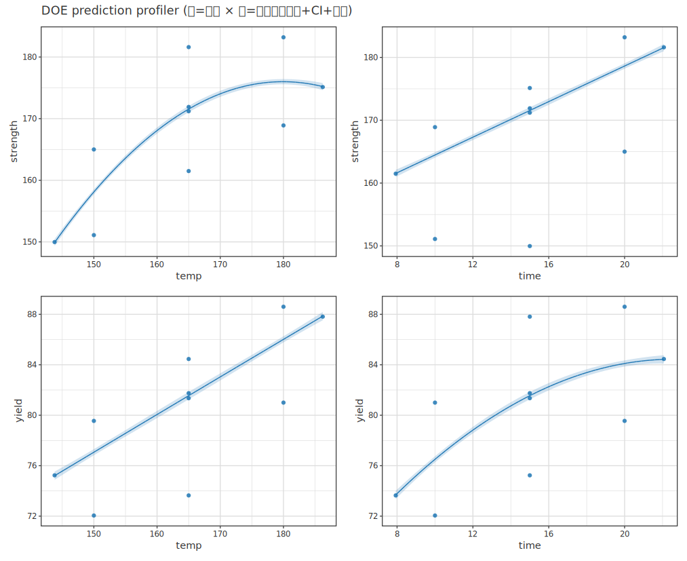
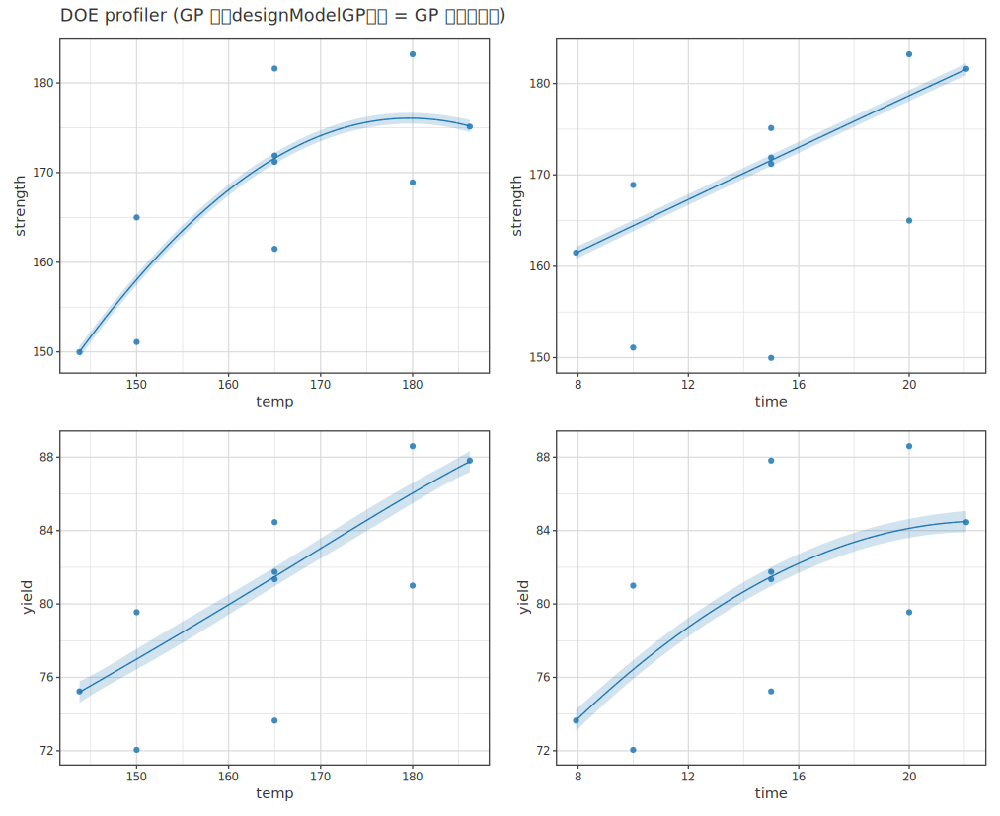
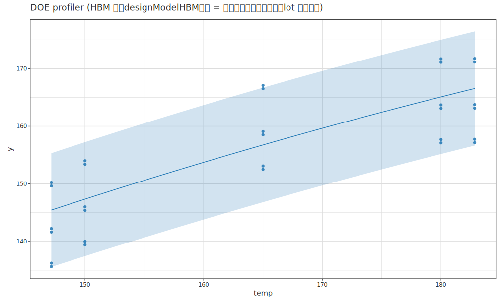
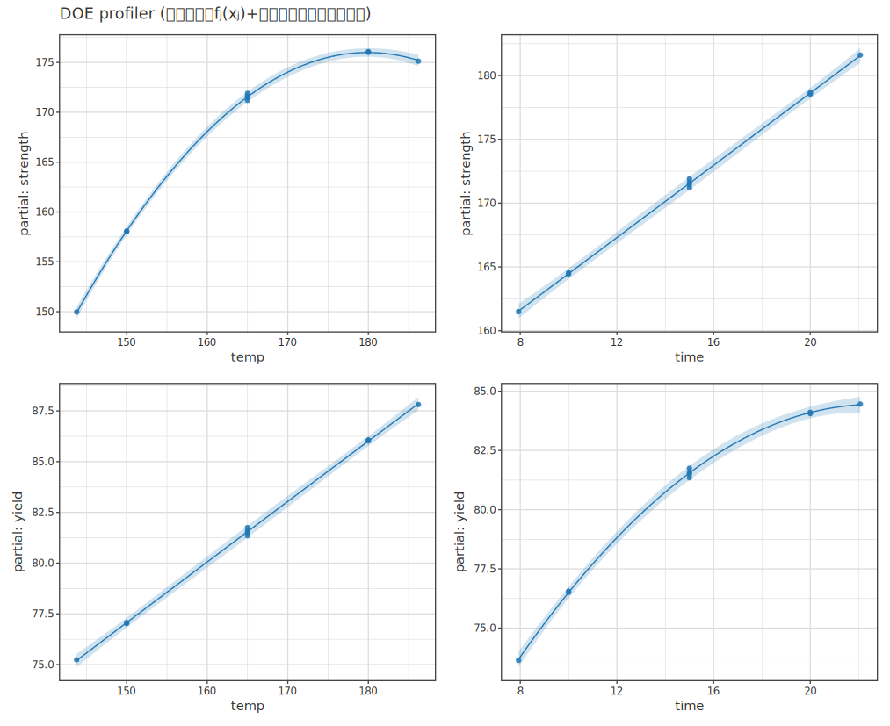

# 実験計画 (DOE)

> 🌐 [English](09-doe.md) | **日本語**

> [📚 索引](README.ja.md) ｜ [01 quickstart](01-quickstart.ja.md) ｜ [02 regression](02-regression.ja.md) ｜ [03 bayesian-hbm](03-bayesian-hbm.ja.md) ｜ [04 multivariate](04-multivariate.ja.md) ｜ [05 ml](05-ml.ja.md) ｜ [06 timeseries](06-timeseries.ja.md) ｜ [07 survival](07-survival.ja.md) ｜ [08 causal](08-causal.ja.md) ｜ **09 doe** ｜ [10 stat](10-stat.ja.md) ｜ [11 data](11-data.ja.md) ｜ [12 plot](12-plot.ja.md)

`Hanalyze.Design.*` の実験計画。 設計行列・直交表・ANOVA 表・検出力を返す
(多くは数値結果)。 理論は [01-doe](../doe/01-doe.ja.md) ・ [02-orthogonal-taguchi](../doe/02-orthogonal-taguchi.ja.md) が一次根拠。

## API 一覧 (返り値で分類)

高レベル DOE API を**返り値の型**で分類する (用法は下の各節)。 返り値の型が同じ関数が
少数 (1〜2 個) しかないものは **その他**にまとめた。

### 因子を作る (→ `DesignFactor`)

| 関数 | 型 | 役割 |
|---|---|---|
| `contFactor` | `Text -> (Double,Double) -> DesignFactor` | 連続因子 (名前 + 実値 下限/上限・2 水準) |
| `numFactor` | `Text -> [Double] -> DesignFactor` | 数値順序因子 (順序付き実水準値・3 水準以上・formula は `opoly`) |
| `catFactor` | `Text -> [Text] -> DesignFactor` | カテゴリ因子 (名前 + 水準名リスト) |

因子は純粋に因子であり、 どの因子がどの階層 (whole-plot / block) に属するかは因子ではなく
**`CustomSpec` の `Structure`** が名前で持つ (→ 後述「階層構造の計画」)。

### 計画を立てる (→ `Design`)

| 関数 | 型 | 役割 |
|---|---|---|
| `factorialDesign` | `[DesignFactor] -> Design` | 完全要因 (連続 2 水準 × カテゴリ m 水準の総当り・全交互作用モデル `y ~ x1 * x2`) |
| `centralCompositeDesign` | `[DesignFactor] -> Design` | 回転可能 CCD (2 次モデル `y ~ …+x1:x2+I(x1^2)+I(x2^2)`・連続専用) |
| `boxBehnkenDesign` | `[DesignFactor] -> Design` | Box-Behnken RSM (**k=3,4,5**・±α なし・2 次モデル・連続専用) |
| `fractionalDesign` | `[DesignFactor] -> Resolution -> Design` | 一部実施 (解像度自動・最小交絡・**k=3〜11,15**・主効果モデル・カテゴリは binary のみ) |
| `fractionalDesignGen` | `[DesignFactor] -> [[Int]] -> Design` | 一部実施 (generator 明示・例 `[[1,2,3]]`=D=ABC・カテゴリは binary のみ) |
| `fractionalDesignInter` | `[DesignFactor] -> Resolution -> Design` | 一部実施 (交互作用込み・解像度自動・主効果 + 主効果非交絡 2FI の代表) |
| `fractionalDesignGenInter` | `[DesignFactor] -> [[Int]] -> Design` | 一部実施 (交互作用込み・generator 明示) |
| `taguchiDesign` | `[DesignFactor] -> Design` | Taguchi 直交表 (最小 OA 自動・2 水準 L4/L8/L12/L16 + 3 水準 L9/L27 + 混合 L18・主効果モデル・連続/数値順序/カテゴリ) |
| `taguchiDesignOA` | `OATable -> [DesignFactor] -> Design` | Taguchi 直交表 (表を列挙型 `OATable` で明示 = `L4`/`L8`/`L9`/`L12`/`L16`/`L18`/`L27`・打ち間違いはコンパイル時に弾く) |
| `optimalDesign` | `[DesignFactor] -> Formula -> Int -> Design` | D-最適計画 (モデル + run 数 `n`・seed 42・候補水準自動・カテゴリ可) |
| `optimalDesignLevels` | `Int -> [DesignFactor] -> Formula -> Int -> Design` | 最適計画 (候補格子の水準数を明示・他は `optimalDesign` と同) |
| `optimalDesignWith` | `OptCriterion -> Maybe Int -> Int -> [DesignFactor] -> Formula -> Int -> Design` | 最適計画 (基準 / 水準数 / seed をフル指定) |
| `customDesign` | `CustomSpec -> Design` | **完全カスタムデザイン** (座標交換・**pure/seed 決定的**・制約 + 基準 + 階層構造 `Structure` を `CustomSpec` 1 本で指定・唯一の生成入口) |

### 当てはめ spec を作る (→ `…Spec`・`filledDf \|-> …` で fit)

モデルは **LM (`designModel`) / GP (`designModelGP`) / HBM (`designModelHBM`) の 3 系統**。

| 関数 | 型 | 役割 |
|---|---|---|
| `designModel` | `Design -> Text -> DesignModelSpec` | LM (一般線型)。 `filledDf \|-> designModel plan "y"` → `MultiLMModel` |
| `designModelGP` | `GPConfig -> Design -> Text -> DesignModelGPSpec` | GP (非線形非パラメトリック・連続因子専用)。 → `GPRegModelN` |
| `designModelHBM` | `HBMConfig -> Design -> [RandomSpec] -> Text -> DesignModelHBMSpec` | 階層ベイズ (mixed-effects・群を RE に)。 → `DesignHBMFit` |
| `multiOutput` | `[Text] -> (Text -> spec) -> MultiOutputSpec spec` | 複数応答を一括 fit → `[(応答名, Fitted spec)]` |

### 可視化する (→ `ProfilerSpec` / `VisualSpec`)

| 関数 | 型 | 役割 |
|---|---|---|
| `profiler` | `[(Text,m)] -> [Text] -> ProfilerSpec m` | profiler グリッド (行=応答 × 列=因子) |
| `profilerResidual` | `ResidualMode -> ProfilerSpec m` | 打点モード合成 (`Raw` 実測 / `Partial` 偏残差) |
| `contourOf` | `MultiVarModel m => m -> Text -> Text -> VisualSpec` | 2 因子 RSM 等高線 / 応答曲面 (平面) |
| `surfaceOf` | `MultiVarModel m => m -> Text -> Text -> VisualSpec3D` | 2 因子 3D 応答曲面 (SVG は `saveSVG3D` / WebGL は `saveHTML3D`) |

### モデル項 (効果 DSL・→ `Formula`)

最適計画 (`optimalDesign` 系) のモデル指定に渡す。

| 関数 | 型 | 役割 |
|---|---|---|
| `mainEffects` | `[Text] -> Formula` | 主効果 `y ~ x1 + x2 + …` |
| `twoWay` | `[Text] -> Formula` | 主効果 + 全 2 因子交互作用 |
| `quadratic` | `[Text] -> Formula` | 主効果 + 交互作用 + 2 次項 (RSM 相当) |

### その他 (返り値が単発のもの)

| 関数 | 型 | 役割 |
|---|---|---|
| `designTable` | `Design -> [(Text,[Double])]` | runsheet の中身 (uncoded 実値・run 番号列・`ColumnSource`・連続/数値順序のみ・カテゴリ含むと error) |
| `designFrame` | `Design -> DataFrame` | runsheet を整形表に (連続/数値順序=Double 列 / カテゴリ=Text 列・`print` で ASCII テーブル) |
| `designFrameRound` | `Int -> Design -> DataFrame` | `designFrame` の桁数調整版 (連続/数値順序の実値を小数第 `n` 位に丸める・CCD 軸点等の長い小数対策) |
| `saveDesign` | `FilePath -> Design -> IO ()` | runsheet (`designFrame`) を CSV に保存 (実験者へ渡す) |
| `planFromFrame` | `[DesignFactor] -> Formula -> DataFrame -> Design` | DataFrame から `Design` を復元 (因子 + formula 明示・CSV 読み戻し用) |
| `customSpec` | `[DesignFactor] -> Formula -> Int -> Int -> CustomSpec` | `CustomSpec` の smart ctor (因子/formula/run数/seed・既定 = DOpt・制約なし・CRD)。 レコード更新で `csCriterion`/`csConstraints`/`csStructure` を足す |
| `splitPlot` | `[Text] -> Int -> Structure` | split-plot 構造 (whole-plot 因子名 + whole-plot 数・η=1.0/群列名 `"wholePlot"` 既定) |
| `stripPlot` | `[Text] -> Int -> [Text] -> Int -> Structure` | strip-plot 構造 (whole-plot × strip の交差 2 階層・群列名 `"wholePlot"`/`"strip"` 既定) |
| `blocked` | `Int -> Structure` | ランダムブロック構造 (ブロック数・η=1.0/群列名 `"block"` 既定) |
| `formulaToCustomModel` | `[Text] -> Formula -> Either Text Model` | 効果 DSL / `Formula` を Custom Design 層の `Model` (`[ModelTerm]`) に変換 (`customDesign` が内部で使う橋渡し) |
| `modelFor` | `Text -> [(Text,m)] -> m` | `multiOutput` 結果から応答名でモデルを 1 つ取り出す (`contourOf`/`surfaceOf` へ) |
| `designFactorNames` | `Design -> [Text]` | 因子名リスト |
| `designFormula` | `Design -> Text -> Text` | 含意モデル formula 文字列 |
| `aliasStructure` | `Design -> [(Text,[Text])]` | 交絡構造 (効果 → 交絡する他効果ラベル・`fractionalDesignInter` 系のみ非空) |
| `ranIntercept` | `Text -> RandomSpec` | HBM 変量切片 `(1\|g)` (→ `designModelHBM`) |
| `ranSlope` | `[Text] -> Text -> RandomSpec` | HBM 相関変量傾き `(1+s\|g)` (→ `designModelHBM`) |
| `rsmAnalysis` | `Design -> [Double] -> RSMReport` | RSM 停留点・性質・canonical・R² (自然単位で報告) |
| `steepestAscentNatural` | `Bool -> Design -> [Double] -> Double -> Int -> [[(Text,Double)]]` | steepest ascent 経路 (自然単位・coded 勾配で方向) |

## ワークフロー

DOE は **① 設計を組む → ② 実験 (sim / 試作) を回す → ③ 得たデータでモデルを当て精度を見る**
の反復。 ライブラリは ①設計 runsheet・②再利用可能な当てはめ・③可視化 (profiler) を提供し、
sim/試作の実行とループ判断は利用者側 (IHaskell で対話的に回す)。

```haskell
import Hanalyze.Plot   -- contFactor/catFactor/factorialDesign/centralCompositeDesign/designTable/designModel/designModelGP/designModelHBM/ranIntercept/multiOutput/profiler 等

-- ① 計画を立てる (pure・df 不要)。 因子は contFactor (連続) / catFactor (カテゴリ) で作る。
--    設計はモデル formula を含意する。
let plan = centralCompositeDesign [contFactor "temp" (150,180), contFactor "time" (10,20)]   -- 応答曲面 (2 次モデル)
    runsheet = designTable plan   -- 実行用 runsheet (uncoded 実値・run 番号列)。 ColumnSource

-- 設計が実際に組む run を表で確認する (print で型付き ASCII テーブル)。
print (designFrame plan)

-- ② runsheet を回して応答を得る (sim / 試作・外部)。 埋めた df を戻す。

-- ③ 得たデータで LM を当てる。 複数応答 (strength/yield…) は multiOutput で一括当てはめ。
--    同じ plan を各応答・sim/実物に使い回せる。
let model = filledDf |-> multiOutput ["strength","yield"] (designModel plan)
--  model :: [(Text, MultiLMModel)]  -- (応答名, モデル)。単一応答は ["y"] の 1 要素でよい。

-- 可視化: 応答 × 各因子 (予測線 + 95% CI + 打点) = JMP Prediction Profiler 相当。
-- toPlot で描画し <> でオプション合成 (打点はモデル観測値から算出するので noDf で束ねる)。
noDf |>> toPlot (profiler model ["temp","time"])
```



以降は 3 段を章に分けて説明する — **① 計画を立てる** (設計種別)・**② モデルを当てる**
(LM / GP / HBM)・**③ 可視化する** (profiler / 応答面)。

## 計画を立てる

DOE の起点は「どの因子をどの水準で組むか」= **設計 (`Design`)**。 因子を `contFactor` /
`numFactor` / `catFactor` で作り、 目的に応じた設計コンストラクタに渡すと `Design` が得られる。
設計は当てはめる**モデル formula を含意**し (要因計画=交互作用・RSM=2 次)、 同じ `Design` を
sim/実物・複数応答に使い回せる。 以下、 設計種別を **教科書の複雑さ順** (完全要因 → 一部実施 →
スクリーニング → 応答曲面 → 最適計画) に並べる。

### 因子 (Factors and Levels)

因子には 3 種ある —

- **連続** `contFactor "temp" (150,180)` (下限/上限・coded ±1 の 2 水準)
  - **対数スケール連続** `contFactorLog "conc" (0.01,10)` (下限/上限は**正**・coded↔実値を
    幾何的 `10^…` に写す)。 桁が大きく違う因子 (濃度・時間など) で中心点・水準が**幾何的に
    等間隔**になり、 モデルは `log(x)` に線形。 既定は線形スケール (`contFactor`)、 log はオプトイン。
- **数値順序** `numFactor "temp" [150,165,180]` (順序付き実水準値リスト・3 水準以上)。 formula は直交多項式
  `opoly` で載り、 実測間隔で linear+quadratic 分解する (Taguchi 3 水準表で使う)。
- **カテゴリ** `catFactor "cat" ["A","B","C"]` (順序なし水準名リスト)。 水準名の DataFrame 列になり、
  当てはめで treatment contrast に展開される (R の character→factor と同型)。

各設計コンストラクタが受ける因子型は次のとおり —

- **`factorialDesign`** … 連続 (2 水準) とカテゴリ (m 水準) を各水準総当り。
- **`optimalDesign`** … 連続・カテゴリ (候補格子に水準を展開し contrast で設計行列に載せる)。
- **`fractionalDesign` / `fractionalDesignGen`** … 連続・**2 水準 (binary) カテゴリのみ** (3 水準以上のカテゴリは error)。
- **`centralCompositeDesign` / `boxBehnkenDesign`** … 連続専用 (±α 軸点 / 3 水準数値ゆえ・カテゴリは error)。
- **`taguchiDesign` / `taguchiDesignOA`** … 連続 (2 水準)・数値順序 / カテゴリ (2/3 水準) を直交表の列に割り当てる。

### 設計を確認する (共通)

どの設計種別でも、 組んだ `Design` の中身は同じ手順で確認できる (以降の各節はこれを前提にする)。
`designTable plan :: [(Text,[Double])]` は runsheet の**中身** (列指向・`ColumnSource`)。
`designFrame plan :: DataFrame` (= `toFrame . designTable`) にすると `print` で**型付きの整形表**が出る。
`designFactorNames plan :: [Text]` で因子名、 `designFormula plan "y" :: Text` で含意モデル formula を引ける。
`print (designFrame (factorialDesign [contFactor "temp" (150,180), contFactor "time" (10,20)]))`:

```
------------------------
 run   |  temp  |  time
-------|--------|-------
Double | Double | Double
-------|--------|-------
1.0    | 150.0  | 10.0
2.0    | 150.0  | 20.0
3.0    | 180.0  | 10.0
4.0    | 180.0  | 20.0
```

カテゴリを含む設計は runsheet に文字列列を持つので **`designFrame`** で確認・当てはめる
(数値専用の `designTable` はカテゴリを含むと error。 連続・数値順序因子のみなら `designTable` も可)。

応答曲面 (CCD) の軸点 (±α) など**無理数由来の長い小数**は runsheet を読みにくくする。
**`designFrameRound n plan`** で連続 / 数値順序因子の実値を**小数第 `n` 位に丸めた** runsheet を得る
(`designFrame` と同じ列・行数、 run 番号 / カテゴリ / 群列はそのまま)。 丸めた値がそのまま runsheet の
値になり (実験は丸めた水準で行う想定)、 `designFrame` 同様に当てはめにも載る。
`print (designFrameRound 2 (centralCompositeDesign [contFactor "temp" (150,180), contFactor "time" (10,20)]))`:

```
------------------------
 run   |  temp  |  time
-------|--------|-------
Double | Double | Double
-------|--------|-------
1.0    | 150.0  | 10.0
2.0    | 150.0  | 20.0
3.0    | 180.0  | 10.0
4.0    | 180.0  | 20.0
5.0    | 143.79 | 15.0
6.0    | 186.21 | 15.0
7.0    | 165.0  | 7.93
8.0    | 165.0  | 22.07
9.0    | 165.0  | 15.0
10.0   | 165.0  | 15.0
```

### 設計を保存する / DataFrame から復元する

DOE は「①設計を組む → ②外部で実験 → ③得たデータで当てる」の反復なので、 設計を**保存して実験者に
渡し**、 返ってきたデータを**読み戻して plan に復元**する経路がある。

- **`saveDesign path plan`** … runsheet (`designFrame`) を **CSV に書き出す**。 実験者はこの CSV の
  各 run を実施し、 応答列を埋めて返す。
- **`planFromFrame factors formula df`** … 読み戻した DataFrame (runsheet + 応答) から `Design` を
  **復元**する。 因子 (範囲/水準) とモデル formula (効果 DSL `mainEffects` / `quadratic` 等) を明示し、
  各因子列を coded 化して `KCustom` 設計に包む。

```haskell
-- ① 設計を保存 (実験者へ渡す runsheet)。
saveDesign "runsheet.csv" plan

-- ② 実験者が応答を埋めて返す → CSV を読み戻す (loadCSV は DataIO.CSV・→ 11-data)。
filledDf <- loadCSV "runsheet-filled.csv"

-- ③ DataFrame から plan を復元して当てはめ・RSM 解析に載せる。
let plan2 = planFromFrame [contFactor "temp" (150,180), contFactor "time" (10,20)]
                          (quadratic ["temp","time"]) filledDf
filledDf |-> designModel plan2 "y"
```

`designModel` の fit は **formula + df だけ**で動くが、 `rsmAnalysis` / `steepestAscentNatural` は
coded 幾何を使うので、 復元時の**因子の範囲/水準は元の設計と揃える**こと (でないと停留点・方向が
ずれる)。 因子列が df に無い / 型が合わないと error。

### 完全要因計画 (Full Factorial Design)

**`factorialDesign`** は各因子の全水準を総当りする最も基本的な設計。 先の `designFrame` 例
(2 因子連続) が示すとおり **4 隅の 4 run**、 含意モデルは全交互作用 `y ~ temp * time`。 カテゴリ因子も
混ぜられる —

```haskell
-- 連続 (temp) × カテゴリ 3 水準 (catalyst) の完全要因 = 2×3 = 6 run。
let plan = factorialDesign [ contFactor "temp"     (150,180)
                           , catFactor  "catalyst" ["A","B","C"] ]
print (designFrame plan)                 -- ↓の整形表・6 run
filledDf |-> designModel plan "y"        -- y ~ temp * catalyst (catalyst は contrast 展開)
```

```
--------------------------
 run   |  temp  | catalyst
-------|--------|---------
Double | Double |   Text
-------|--------|---------
1.0    | 150.0  | A
2.0    | 150.0  | B
3.0    | 150.0  | C
4.0    | 180.0  | A
5.0    | 180.0  | B
6.0    | 180.0  | C
```

カテゴリ列は `Text` として保持される (当てはめ時に contrast 展開)。

### 一部実施要因計画 (Fractional Factorial Design)

因子が多いと完全要因 2^k は run が爆発する (7 因子で 128)。 **一部実施要因** `fractionalDesign`
は交互作用の一部を主効果と交絡させて **2^(k-p)** に減らす。 交絡の重さは **解像度 (resolution)** で
測り、 望む解像度以上を満たす最小 run の**最小交絡 (minimum aberration)** 設計を自動で選ぶ
(generator は Montgomery Table 8-14 / NIST の標準表・k=3〜11 と 15。 8 run=k≤7・16 run=k≤11,15・32 run=k≤11)。

```haskell
-- 7 因子を解像度 III で: 完全要因 128 → 8 run に削減 (主効果を推定)。
let plan = fractionalDesign [contFactor "a" (0,1), …, contFactor "g" (0,1)] ResIII
print (designFrame plan)         -- ↓の 8 run runsheet
filledDf |-> designModel plan "y"  -- formula は主効果のみ y ~ a + b + … + g
```

```
---------------------------------------------------------------------
 run   |   a    |   b    |   c    |   d    |   e    |   f    |   g
-------|--------|--------|--------|--------|--------|--------|-------
Double | Double | Double | Double | Double | Double | Double | Double
-------|--------|--------|--------|--------|--------|--------|-------
1.0    | 0.0    | 0.0    | 0.0    | 1.0    | 1.0    | 1.0    | 0.0
2.0    | 0.0    | 0.0    | 1.0    | 1.0    | 0.0    | 0.0    | 1.0
3.0    | 0.0    | 1.0    | 0.0    | 0.0    | 1.0    | 0.0    | 1.0
4.0    | 0.0    | 1.0    | 1.0    | 0.0    | 0.0    | 1.0    | 0.0
5.0    | 1.0    | 0.0    | 0.0    | 0.0    | 0.0    | 1.0    | 1.0
6.0    | 1.0    | 0.0    | 1.0    | 0.0    | 1.0    | 0.0    | 0.0
7.0    | 1.0    | 1.0    | 0.0    | 1.0    | 0.0    | 0.0    | 0.0
8.0    | 1.0    | 1.0    | 1.0    | 1.0    | 1.0    | 1.0    | 1.0
```

- `Res III` … 主効果と 2 因子交互作用が交絡 (最も攻めた削減)。
- `Res IV`  … 主効果は 2 因子交互作用と交絡しないが、 交互作用同士は交絡。
- `Res V+`  … 主効果・2 因子交互作用がほぼ独立。

generator を自分で指定したい玄人は `fractionalDesignGen specs [[1,2,3]]` (= D=ABC の 2^(4-1))。
`fractionalDesign` / `fractionalDesignGen` の formula は**主効果のみ** (交互作用は交絡ゆえ含めない)。

#### 交互作用を含める (`fractionalDesignInter` / `aliasStructure`)

主効果と交絡しない 2 因子交互作用 (2FI) までモデルに入れたいときは **`fractionalDesignInter`** /
**`fractionalDesignGenInter`** を使う (設計点は `fractionalDesign` と同一で、 formula だけが違う)。
alias 剰余類を計算し、 **主効果と交絡しない 2FI の代表** (交絡群ごと 1 個) を主効果に加える。

```haskell
-- Res IV (D=ABC・8 run)。 主効果 4 + 主効果非交絡の 2FI 代表 3 = 満ランク。
let plan = fractionalDesignGenInter [contFactor "a" (0,1), …, contFactor "d" (0,1)] [[1,2,3]]
designFormula plan "y"       -- y ~ a + b + c + d + a:b + a:c + a:d
aliasStructure plan          -- [("a:b",["c:d"]), ("a:c",["b:d"]), …] — a:b は c:d と交絡
```

- 解像度で入る 2FI が決まる — **Res V+** は全 2FI が独立に載る、 **Res IV** は交絡群ごと 1 個
  (推定値は「交絡した 2FI の和」・主効果は不バイアス)、 **Res III** は主効果と交絡しない 2FI のみ。
- **`aliasStructure plan :: [(Text,[Text])]`** で各効果 (主効果 / 2FI) が何と交絡するかを引ける
  (`lookup "a:b" (aliasStructure plan)`)。 Res IV の代表 2FI は交絡相手を持つので、 解釈時に確認する。

### スクリーニング / 直交表 (Screening: Plackett-Burman・Taguchi)

因子が非常に多く「まずどの因子が効くか」だけ見たいときは **Taguchi 直交表** `taguchiDesign` が
使える。 各因子の**要求水準数**に一致する列を持つ**最小 run の標準直交表**を自動選択し、
因子を列に割り当てる。 `fractionalDesign` と同じく formula は**主効果のみ**。

- 2 水準表: L4 (≤3 因子) → L8 (≤7) → L12 (≤11・Plackett-Burman) → L16 (≤15)
- 3 水準表: L9 (≤4 因子・3⁴) → L27 (≤13・3¹³)
- 混合水準表: L18 (2¹×3⁷・2 水準 1 因子 + 3 水準 7 因子)

要求水準数は因子の種類で決まる — 連続 `contFactor` = 2、数値順序 `numFactor` / カテゴリ `catFactor` = 水準数。

```haskell
-- ① 11 連続因子を 12 run で主効果スクリーニング (Plackett-Burman L12)。
let plan = taguchiDesign [contFactor "a" (0,1), …, contFactor "k" (0,1)]  -- 11 因子 → L12 を自動選択
print (designFrame plan)             -- 12 run の runsheet
filledDf |-> designModel plan "y"    -- y ~ a + b + … + k (主効果のみ)

-- ② 3 水準因子は numFactor (数値順序) / catFactor (カテゴリ) で。 4 因子 → L9 (9 run)。
let planL9 = taguchiDesign [ numFactor "temp" [150,165,180]   -- 数値順序 3 水準
                           , numFactor "time" [10,20,30]
                           , catFactor "cat"  ["A","B","C"]    -- カテゴリ 3 水準
                           , catFactor "mat"  ["X","Y","Z"] ]
designFormula planL9 "y"   -- y ~ opoly(temp,2) + opoly(time,2) + cat + mat
filledDf |-> designModel planL9 "y"

-- ③ 混合水準 — 連続 1 + 3 水準 2 → L18 を自動選択 (18 run)。
let planMix = taguchiDesign [ contFactor "p" (0,1)
                            , catFactor  "q" ["a","b","c"]
                            , catFactor  "r" ["x","y","z"] ]
```

②の `planL9` (`print (designFrame planL9)`) は 4 因子を 9 run に割り付ける — 数値順序 2 列 +
カテゴリ 2 列 (`Text`):

```
--------------------------------------
 run   |  temp  |  time  | cat  | mat
-------|--------|--------|------|-----
Double | Double | Double | Text | Text
-------|--------|--------|------|-----
1.0    | 150.0  | 10.0   | A    | X
2.0    | 150.0  | 20.0   | B    | Y
3.0    | 150.0  | 30.0   | C    | Z
4.0    | 165.0  | 10.0   | B    | Z
5.0    | 165.0  | 20.0   | C    | X
6.0    | 165.0  | 30.0   | A    | Y
7.0    | 180.0  | 10.0   | C    | Y
8.0    | 180.0  | 20.0   | A    | Z
9.0    | 180.0  | 30.0   | B    | X
```

- **★L12 (Plackett-Burman)** が目玉 — 11 因子を 12 run で捌く。 交互作用は全列に薄く分散する
  ので**主効果スクリーニング専用** (どの因子を残すか絞ってから精緻な計画へ進む)。
- **数値順序因子 `numFactor`** は実水準値をそのまま渡す (等間隔でなくてよい)。 formula は
  **直交多項式** `opoly(name, 水準数−1)` (linear + quadratic …) になり、 **実測間隔で直交分解**する
  (raw べきと違い linear ⊥ quadratic ゆえ効果検定が独立)。 曲率 (最適点が中間水準にあるか) を推定できる。
- **カテゴリ因子 `catFactor`** は水準名の DataFrame 列になり、 当てはめで contrast 展開される
  (順序のない水準に。 formula は主効果名)。
- L8/L16 は一部実施要因と数学的に等価だが、「直交表の列に因子を割り当てる」Taguchi の枠組みで
  透過的に扱える。 run 数を意図的に固定したい場合は `taguchiDesignOA L9 specs` と表を列挙型 `OATable` で明示できる
  (一部実施の `fractionalDesignGen` に対応する escape hatch)。
- カテゴリを含む設計は runsheet に文字列列を持つので **`designFrame`** で確認・当てはめる
  (数値専用の `designTable` はカテゴリを含むと error。 連続・数値順序因子のみなら `designTable` も可)。

### 応答曲面計画 (Response Surface Methodology)

最適化 (最大 / 最小の探索) には曲率を推定できる 2 次モデルが要る。 **`centralCompositeDesign`** は回転可能な
**中心複合計画 (CCD)** を組む — cube (4 隅・完全要因) + 軸点 (±α・2k) + 中心点 (k)。 含意モデルは
2 次 `y ~ …+x1:x2+I(x1^2)+I(x2^2)`。

```haskell
-- 2 因子の応答曲面 (CCD)。 cube 4 隅 + 軸点 (±α) + 中心点 = 10 run で 2 次モデルを当てる。
let plan = centralCompositeDesign [contFactor "temp" (150,180), contFactor "time" (10,20)]
print (designFrame plan)                        -- ↓の 10 run runsheet (uncoded 実値)
let model = filledDf |-> designModel plan "y"   -- model :: MultiLMModel (y ~ temp*time + I(temp^2) + I(time^2))
noDf |>> toPlot (profiler [("y", model)] ["temp","time"])   -- 予測線 + CI つき profiler
```

`print (designFrame plan)`:

```
------------------------------------------------
 run   |        temp        |        time
-------|--------------------|-------------------
Double |       Double       |       Double
-------|--------------------|-------------------
1.0    | 150.0              | 10.0                ┐
2.0    | 150.0              | 20.0                │ cube (4 隅・完全要因)
3.0    | 180.0              | 10.0                │
4.0    | 180.0              | 20.0                ┘
5.0    | 143.78679656440357 | 15.0                ┐ 軸点 (temp = 165 ± 15√2)
6.0    | 186.21320343559643 | 15.0                ┘
7.0    | 165.0              | 7.9289321881345245  ┐ 軸点 (time = 15 ± 5√2)
8.0    | 165.0              | 22.071067811865476  ┘
9.0    | 165.0              | 15.0                ┐ 中心点 ×2
10.0   | 165.0              | 15.0                ┘
```

RSM は CCD の代わりに **Box-Behnken** (`boxBehnkenDesign`・k=3,4,5) も選べる。 CCD の cube 4 隅 +
極端な軸点 (±α) を持たず、 全点が立方体の辺の中点 (因子は −1/0/+1 の 3 水準) に収まるので、 因子域外の
組合せを避けたいときに有効。 例 (3 因子) は 12 corner + 中心点 = 15 run で 2 次モデルを推定できる。

#### 停留点・canonical・steepest ascent (自然単位で報告)

応答曲面を数値で解くと停留点・その性質・次の探索方向が出る。 ここで **coded/uncoded の要点**:
fit を coded 空間でやるか自然単位でやるかは**予測に影響しない** (同一項の LM は再パラメータ化ゆえ
予測・R²・profiler は同値)。 実質的に coding が効くのは**スケール依存な幾何** — 停留点の方向・
canonical 軸・steepest ascent 方向 — だけ。 各因子の実験範囲を単位 (coded `[-1,1]`) に取らないと、
範囲の狭い因子に方向が支配される。 そこでライブラリは幾何を内部で coded で解き、 **結果を自然単位で
報告**する。 実験者は runsheet も解析結果も一貫して実単位で扱える。

`rsmAnalysis plan ys` は応答 `ys` (run 順) から二次モデルを当て、 停留点 (自然単位)・性質
(`RMaximum` / `RMinimum` / `RSaddle`)・canonical (固有値と coded 方向)・R² を返す
(R `rsm::canonical` 相当)。

```haskell
let rep = rsmAnalysis plan ys
rsmStationary rep   -- [("temp", 168.3), ("time", 14.1)]  停留点 (自然単位)
rsmNature     rep   -- RMaximum / RMinimum / RSaddle
rsmInRegion   rep   -- True なら停留点は実験領域の内側 (False は外挿)
rsmCanonical  rep   -- [(固有値, coded 方向)] 昇順。 固有値符号で曲率の向き
rsmR2         rep
```

停留点が領域外 (`rsmInRegion = False`) や鞍点なら、 まだ最適から遠い。 一次のうちは **steepest
ascent** で次の中心へ寄せる。 `steepestAscentNatural maximize plan ys step nSteps` は coded 勾配で
方向を取り (scale 不変)、 経路の各点を**自然単位へ decode** して返す。 `step` は coded スケールの
歩幅 (例 `0.5`)、 先頭は設計中心。

```haskell
steepestAscentNatural True plan ys 0.5 5
-- [ [("temp",165.0),("time",15.0)]     -- 中心
-- , [("temp",172.5),("time",13.2)]     -- +1 歩 (実単位で次に回す条件)
-- , ... ]                              -- 上昇方向へ nSteps 点
```

いずれも**連続因子専用** (カテゴリを含む設計は error)。 `ys` は `designTable` / `designFrame` と
同じ run 順の応答値を渡す。

### 最適計画 (Optimal / Computer-generated Design)

標準の格子計画 (factorial / RSM) は「モデルと run 数が計画の形で決まる」。 これに対し
**最適計画** `optimalDesign` は逆で、 **当てたいモデル (formula) と run 数 `n` を先に決め**、
候補点集合から情報行列 XᵀX の基準 (既定 = **D-最適** = `det(XᵀX)` 最大) を最適化する `n` 点を
選ぶ (Fedorov 交換)。 run 数が予算で縛られている・非標準のモデル項を当てたい、 等で使う。

```haskell
-- 2 因子の 2 次モデル (p=6) を 10 run で当てる D-最適計画。
let plan = optimalDesign [contFactor "temp" (150,180), contFactor "time" (10,20)]
                         (quadratic ["temp","time"])   -- モデル = 効果 DSL
                         10                             -- run 数 n (必須)
print (designFrame plan)             -- ↓の 10 run runsheet (uncoded 実値)
filledDf |-> designModel plan "y"    -- 焼き込んだ formula で LM を当てる
```

```
------------------------
 run   |  temp  |  time
-------|--------|-------
Double | Double | Double
-------|--------|-------
1.0    | 150.0  | 10.0
2.0    | 180.0  | 10.0
3.0    | 165.0  | 15.0
4.0    | 150.0  | 20.0
5.0    | 150.0  | 15.0
6.0    | 150.0  | 10.0
7.0    | 180.0  | 20.0
8.0    | 165.0  | 10.0
9.0    | 180.0  | 15.0
10.0   | 165.0  | 20.0
```

候補格子 (3 水準 × 2 因子 = 9 点) から情報量最大の点を選ぶ。 **点の反復を許す exact D-最適**なので、
`n` が候補点数を超えても頭打ちにならず、 D を上げる点を反復する (上表は run 1 と run 6 が同一 `(150,10)` =
1 点の反復で 10 run を満たす)。 候補を細かくしたいときは因子/水準を増やすか `optimalDesignLevels` で
候補格子の水準数を上げる。

モデル指定は **`Formula` に一本化**。 入口は 2 つ:

- **効果 DSL** (対話向け・型付き): `mainEffects names` (`y ~ x1 + x2 + …`)、
  `twoWay names` (主効果 + 全 2 因子交互作用)、 `quadratic names` (主効果 + 交互作用 + 2 次項・RSM 相当)。
- **文字列 formula**: `parseRFormula "y ~ a + b + a:b"` の結果 (`Formula`) をそのまま渡す
  (アプリ / 外部からモデルを組み立てる場合)。

```haskell
let Right fml = parseRFormula "y ~ temp + time + temp:time"
    plan      = optimalDesign specs fml 8
```

- **候補集合** = 因子 specs から自動グリッド (各因子 coded `[-1,1]` の等間隔水準)。 既定水準数は
  モデルが 2 次項を含めば **3**、 他は **2**。 明示したいときは `optimalDesignLevels 3 specs fml n`。
- **基準の変更**・**seed 変更**は `optimalDesignWith crit (Just levels) seed specs fml n`
  (`crit` = `DOpt` / `AOpt` / `IOpt` / `EOpt` / `GOpt` / `Compound …` / `BayesianD …`)。 既定 seed = 42。
- **`n` は必須** (DOE は run 数がコスト)。 `n < p` (formula の列数) は情報行列が特異なので **error**。
- **カテゴリ因子**は `catFactor` で混ぜられる (候補格子に水準を展開し contrast で当てる)。 例:
  `optimalDesign [contFactor "x" (-1,1), catFactor "cat" ["A","B","C"]] (mainEffects ["x","cat"]) n`。

### カスタム計画 (Custom Design・座標交換・pure)

`optimalDesign` が候補格子から点を選ぶ (Fedorov 交換) のに対し、 **`customDesign`** は各因子を
**細かい grid 上で 1 座標ずつ動かす座標交換** (coordinate exchange) で D-最適解を探す。 run が候補格子の
粗い水準に縛られず、 **中間水準** (下表の `163.5` / `15.5` 等) も取り得るのが特徴。 **seed を引数に取る
純粋関数** (同 seed → 常に同結果・`IO` 不要) で、 再現可能な計画をそのまま値として得られる。

計画は **`CustomSpec` 1 本**にまとめる。 `customSpec factors formula nRuns seed` が既定
(DOpt・制約なし・CRD) の spec を作り、 レコード更新で基準 (`csCriterion`)・制約 (`csConstraints`)・
階層構造 (`csStructure`) を足す。 生成の入口は **`customDesign :: CustomSpec -> Design`** ただ 1 本。

```haskell
-- 2 因子 2 次モデルを 10 run で。 customSpec の第 3/4 引数 = run 数 / seed (決定的)。
let plan = customDesign (customSpec [contFactor "temp" (150,180), contFactor "time" (10,20)]
                                    (quadratic ["temp","time"]) 10 42)
print (designFrame plan)
filledDf |-> designModel plan "y"    -- 焼き込んだ formula で LM (optimalDesign と同じ後段)
```

```
------------------------
 run   |  temp  |  time
-------|--------|-------
Double | Double | Double
-------|--------|-------
1.0    | 150.0  | 10.0
2.0    | 180.0  | 20.0
3.0    | 150.0  | 20.0
4.0    | 165.0  | 20.0
5.0    | 180.0  | 15.5
6.0    | 150.0  | 15.0
7.0    | 180.0  | 10.0
8.0    | 165.0  | 15.0
9.0    | 180.0  | 10.0
10.0   | 163.5  | 10.0
```

- **因子型**は連続 (`contFactor`) / カテゴリ (`catFactor`) / 数値順序 (`numFactor`) を全て扱える。
  数値順序は水準 index 尺度 (等間隔) で最適化し、 runsheet では実水準値に戻る。
- **モデル**は最適計画と同じ効果 DSL (`mainEffects`/`twoWay`/`quadratic`) / `parseRFormula`。
  返す `Design` は formula を焼き込む (`optimalDesign` と同様・`designModel` でそのまま当たる)。
- `optimalDesign` (格子 Fedorov・制約なし) と `customDesign` (連続座標交換) は**別実装**。 粗い候補水準で
  十分なら `optimalDesign`、 細かい探索・制約・後述の階層構造が要るなら `customDesign` を使う。

**制約・基準を課す**。 基準 (D 以外) や**実行可能領域の制約**は `CustomSpec` のフィールドで指定する
(レコード更新)。 制約は座標交換の初期化と各座標探索の両方で満たされ、 実行不能な run が出ない。
制約は**実単位で書く `csNatConstraints` が推奨** (下記)。 coded 単位の低レベル `csConstraints`
も併用でき、 両者は加算的に効く。

```haskell
-- 実温度 <= 160 の制約下で D-最適 8 run (実単位で書ける)。 違反点は選ばれない。
let plan = customDesign (customSpec [contFactor "temp" (150,180), contFactor "time" (10,20)]
                                    (twoWay ["temp","time"]) 8 42)
             { csNatConstraints = [ natLeq [("temp",1)] 160 ] }
             -- 基準を変えるなら { csCriterion = AOpt } 等も同様
```

基準 (`csCriterion :: OptCriterion`) は `DOpt` / `AOpt` / `IOpt` / `EOpt` / `GOpt` / `Compound …` /
`BayesianD …` (既定 `DOpt`)。 `customSpec` の既定は制約なし・CRD なので、 素の
`customDesign (customSpec fs fml n seed)` が制約なし D-最適の CRD になる。

#### 制約の書き方 — 自然単位 (推奨・`csNatConstraints`)

実務では制約は**実験の言葉** (実温度・実流量) で書きたい。 `csNatConstraints :: [NatConstraint]`
は因子を**実単位**で参照する制約で、 `customDesign` 入口で因子の範囲/スケールを使い内部の coded
制約へ自動正規化される (coded `[-1,1]` や水準 index を意識しなくてよい)。 **これが推奨 API**。

- **`natLeq [(因子,係数)] rhs`** / **`natGeq …`** / **`natEq …`** — 線形不等式/等式
  `Σ 係数ᵢ·x_natᵢ  rel  rhs` (実単位係数)。
  - **連続因子**は自然単位の半空間そのまま (`temp <= 160` が書ける)。 複数因子の和も可。
  - **数値順序 (`numFactor`)** は**単一項**なら参照可 — 閾値を満たさない水準を除外する
    フィルタに展開される (半空間でなく水準の絞り込み)。 例 `natLeq [("temp",1)] 160`・
    水準 {150,165,180} → **150 のみ残る**。 他因子との線形結合に混ぜるとエラー。
  - **対数因子** (`contFactorLog`) は**単一因子の境界** (`natLeq [("conc",1)] 0.1`) のみ。
    線形結合に混ぜると非線形ゆえエラー。
  - **カテゴリ**は順序を持たないため参照不可 (エラー)。 代わりに `natForbid` を使う。
- **`natForbid [(因子, 値)]`** — 禁止組合せ。 カテゴリは水準名 (`FVText "A"`)、
  数値順序/連続は**実値** (`FVDouble 180`) で指定 (内部で index / coded へ変換)。

```haskell
-- 実温度 <= 160 と 実流量 >= 12 の下で D-最適 8 run (連続因子・実単位)。
customDesign (customSpec [contFactor "temp" (150,180), contFactor "time" (10,20)]
                         (quadratic ["temp","time"]) 8 42)
  { csNatConstraints = [ natLeq [("temp",1)] 160, natGeq [("time",1)] 12 ] }

-- 数値順序因子の実値閾値: temp<=160 → 水準 {150,165,180} から 150 のみ残す。
customDesign (customSpec [numFactor "temp" [150,165,180], contFactor "time" (10,20)]
                         (mainEffects ["temp","time"]) 8 42)
  { csNatConstraints = [ natLeq [("temp",1)] 160 ] }

-- 対数因子の単一境界 + カテゴリの禁止組合せ。
customDesign (customSpec [contFactorLog "conc" (0.01,10), catFactor "cat" ["A","B"]]
                         (mainEffects ["conc","cat"]) 8 7)
  { csNatConstraints = [ natLeq [("conc",1)] 0.1, natForbid [("cat", FVText "A")] ] }
```

**実行不能なとき**は、 エラーに**有効な制約と因子範囲を実単位で**添える (例
`1.0·temp ≤ 100.0` / `temp ∈ [150.0, 180.0]`) ので原因を追いやすい。

> **JMP との対応**: JMP Custom Design も線形制約は連続因子のみ・実単位入力、 カテゴリ/離散は
> Disallowed Combinations (= `natForbid`) で扱う。 log 因子を第一級で持つ点は本ライブラリが上。

#### 制約の書き方 — coded 低レベル (`csConstraints`)

`csConstraints :: [Constraint]` は coded 単位の**低レベルエスケープハッチ**。 自然単位で書けない
込み入った制約 (条件付き・範囲上書き等) や既存コード互換のために残す。 通常は上記
`csNatConstraints` を使う。 **因子参照は coded 単位** — 連続因子は coded `[-1,1]` (`FVDouble`)、
カテゴリは水準名 (`FVText "A"`)、 数値順序は水準 index (`FVDouble`)。 制約は座標交換の**初期化 (棄却
サンプリング) と各座標探索の両方**で満たされ、 実行不能な run が出ない。 `Constraint` は 4 種:

**① `LinearIneq [(因子,係数)] rel rhs`** — 線形不等式/等式 `Σ 係数ᵢ·xᵢ  rel  rhs`。
`rel` = `CLeq` (≤) / `CEq` (=) / `CGeq` (≥)。 **連続因子のみ参照可** (許容誤差 1e-9)。

```haskell
LinearIneq [("x1",1),("x2",1)]  CLeq 0.5    -- x1 + x2 <= 0.5
LinearIneq [("x1",1),("x2",-1)] CEq  0      -- x1 = x2  (対角線上に限定)
LinearIneq [("x1",2),("x2",1)]  CGeq (-1)   -- 2·x1 + x2 >= -1
```

**② `RangeBound 因子 lo hi`** — 連続因子を coded `[lo,hi]` に制限 (既定の因子範囲を**上書き**して狭める)。

```haskell
RangeBound "temp" (-0.5) 1     -- temp の coded 範囲を [-0.5, 1] に (上側だけ使う等)
```

**③ `Forbidden [(因子, 値)]`** — 列挙した `(因子,値)` が**全て一致する行を禁止** (AND)。
値は `FVText "水準名"` (カテゴリ) / `FVDouble coded値` (連続・数値順序 index)。 **カテゴリの禁止組合せ**に主に使う
(連続の `FVDouble` は grid 点との厳密一致が要るため脆い)。

```haskell
Forbidden [("catalyst", FVText "A"), ("temp", FVText "high")]  -- 触媒A × 高温 の組合せを禁止
Forbidden [("mode", FVText "off"), ("x1", FVDouble 1)]         -- mode=off かつ x1=+1(coded) を禁止
```

**④ `Conditional guard [制約]`** — `guard` が成立する行にのみ inner 制約を課す (条件付き活性化)。
`guard` = `GuardEq 因子 値` / `GuardLeq 因子 c` / `GuardGeq 因子 c` / `GuardAnd [guards]` / `GuardOr [guards]`。

```haskell
-- 触媒が A のときだけ temp を coded [0,1] (高温側) に限定する。
Conditional (GuardEq "catalyst" (FVText "A")) [ RangeBound "temp" 0 1 ]

-- x1 >= 0 かつ x2 >= 0 の象限では x1 + x2 <= 1 を課す。
Conditional (GuardAnd [GuardGeq "x1" 0, GuardGeq "x2" 0])
            [ LinearIneq [("x1",1),("x2",1)] CLeq 1 ]
```

**注意**:

- **因子参照は coded 単位** (この低レベル節のみ)。座標交換は coded 空間で解くので、 実値 (150〜180℃ 等)
  でなく coded (`-1`〜`+1`) で書く。 **実値で書きたいときは上の `csNatConstraints` (`natLeq` 等) を使う**
  (実値 → coded 換算を入口で自動化)。 手動なら `coded = (実値 − 中心) / 半幅`。
- **`LinearIneq` / `RangeBound` は連続 (数値) 因子専用**。 参照因子が見つからない・カテゴリ (型不一致) の行は
  「違反」= 棄却される。 カテゴリを条件にしたいときは `Forbidden` / `Conditional` の `GuardEq … FVText` を使う。
- **厳しすぎる制約**は座標を見つけられず **error** になり得る (実行可能領域を広げるか run 数/水準を見直す)。

### 階層構造の計画 (Split-Plot・Strip-Plot・Block)

「変えにくい因子」 (プロセス温度など) が絡む実験は、 その因子を **whole-plot** 単位でまとめて変える
**split-plot** 構造になる (完全ランダム化できない)。 Phase 79 では階層を**因子の役割ではなく**、
`CustomSpec` の **`csStructure :: Structure`** で宣言する — 因子は純粋に因子のまま、 どの因子がどの層に
属するかは `Structure` が**名前で**持つ。 `Structure` は 4 種:

- **`splitPlot ["temp"] 4`** — `temp` を whole-plot 因子、 whole-plot 数 4。 whole-plot 因子は群内で一定。
- **`stripPlot ["A"] 3 ["B"] 4`** — `A` が whole-plot (3 群) × `B` が strip (4 群) の**交差 2 階層**。
- **`blocked 3`** — 3 ランダムブロック。 全因子はブロック内で自由、 ブロックは run 割付のみ (共分散に効く)。
- 既定は **`CRD`** (完全ランダム化・`customSpec` の既定)。

内部では観測共分散 `M = I + Σ η_g Z_g Z_gᵀ` (η = 分散比・既定 1.0) を織り込んだ D-最適
(`det(Xᵀ M⁻¹ X)` 最大化) を **群単位ムーブ**の座標交換で解く (Goos-Vandebroek 2003・**pure**)。
制約 (`csConstraints`) とも両立する。

```haskell
let plan = customDesign (customSpec [contFactor "temp" (150,180), contFactor "rate" (10,20)]
                                    (twoWay ["temp","rate"]) 8 50)
             { csStructure = splitPlot ["temp"] 4 }   -- temp を whole-plot・4 群
print (designFrame plan)
```

```
-------------------------------------
 run   |  temp  |  rate  | wholePlot
-------|--------|--------|-----------
Double | Double | Double |    Text
-------|--------|--------|-----------
1.0    | 150.0  | 20.0   | wholePlot0
2.0    | 150.0  | 10.0   | wholePlot0
3.0    | 180.0  | 10.0   | wholePlot1
4.0    | 180.0  | 20.0   | wholePlot1
5.0    | 150.0  | 20.0   | wholePlot2
6.0    | 150.0  | 10.0   | wholePlot2
7.0    | 180.0  | 20.0   | wholePlot3
8.0    | 180.0  | 10.0   | wholePlot3
```

**whole-plot 因子 `temp` は群 (`wholePlot`) 内で一定**、 sub-plot 因子 `rate` だけが群内で変わる (split-plot
構造)。 `designFrame` は各群を **Text ラベル列** (`splitPlot` なら `wholePlot` 列・`wholePlot0…`) で出す。
`stripPlot` なら `wholePlot` + `strip` の 2 群列、 `blocked` なら `block` 列が出る。 この群列はそのまま
**HBM の変量切片**に載る — 生成した計画から**階層効果を織り込んだ解析まで 1 本**で繋がる:

```haskell
-- whole-plot 群を変量切片に。 群間のばらつきを RE として分離して固定効果を推定。
filledDf |-> designModelHBM defaultHBM plan [ranIntercept "wholePlot"] "y"

-- 制約 (rate<=0.5 coded) と split-plot を両立させたいときは csConstraints を足すだけ:
--   customDesign (customSpec fs fml n seed)
--     { csStructure = splitPlot ["temp"] 4, csConstraints = [LinearIneq [("rate",1)] CLeq 0.5] }

-- strip-plot は 2 群列を 2 つの変量切片に (複数群列 → 複数 ranIntercept へ地続き):
--   let plan = customDesign (customSpec fs fml 12 7) { csStructure = stripPlot ["A"] 4 ["B"] 3 }
--   df |-> designModelHBM defaultHBM plan [ranIntercept "wholePlot", ranIntercept "strip"] "y"
```

(変量効果の宣言 `ranIntercept` / `ranSlope` は下の「モデルを当てる → 階層モデルで当てる」節を参照。)

## モデルを当てる

得た `Design` + データにモデルを当てる。 **LM (`designModel`) / GP (`designModelGP`) / HBM
(`designModelHBM`)** の 3 系統があり、 いずれも同じ plan・同じデータに spec を差し替えるだけで使え、
`multiOutput` / `profiler` もそのまま載る。 LM が基本 (`designModel` は含意 formula の一般線型)。

### LM で当てる (基本・含意 formula の一般線型)

**`designModel`** は設計が**含意する formula を自動展開**して一般線型モデル (LM) を当てる基本形。
モデルは固定でなく**設計種別が決める** — 完全要因 → 主効果 + 交互作用 (`y ~ temp * time`)、
応答曲面 → 2 次 (`+ I(temp^2) + I(time^2)`)、 一部実施 / 直交表 → 主効果のみ。 `designFormula plan "y"`
で実際に当たる formula を確認できる。 profiler の帯は LM の正規 CI。 複数応答は `multiOutput` で一括。

```haskell
-- 含意 formula の LM。 複数応答は multiOutput で (単一なら ["y"] の 1 要素)。
let model = filledDf |-> multiOutput ["strength","yield"] (designModel plan)
--  model :: [(Text, MultiLMModel)]

noDf |>> toPlot (profiler model ["temp","time"])   -- 予測線 + 95% CI + 実測 (ワークフロー節の図)
```

### GP で当てる (非線形・非パラメトリック profiler)

`designModel` は含意 formula の LM (一般線型) を当てる。 小 n の DOE で **応答が 2 次 formula
では捉えきれない曲率**を持つときは、 **`designModelGP`** で同じ plan・同じデータを
**GP (ガウス過程回帰)** で当てられる。 formula 不要 — kernel が非線形を直接学習し、 profiler の帯が
LM の正規 CI から **GP 事後予測帯**に置き換わる (小 n の非パラメトリック不確実性)。 `multiOutput` /
`profiler` はそのまま使える (spec を `designModel` から差し替えるだけ)。

```haskell
-- designModel を designModelGP defaultGP に差し替えるだけ。 defaultGP は RBF kernel・
-- 厳密 GP・ハイパラは周辺尤度で自動 (= GPConfig RBF Gp AutoMarginalLik)。
let gpModel = filledDf |-> multiOutput ["strength","yield"] (designModelGP defaultGP plan)
--  gpModel :: [(Text, GPRegModelN)]

noDf |>> toPlot (profiler gpModel ["temp","time"])
```



kernel・象限 (厳密 GP / KRR / RFF 近似)・ハイパラ方略 (`AutoMarginalLik` / `AutoCV` / `FixedHyper`)
は `GPConfig` で選ぶ (→ [02-regression](02-regression.ja.md) のカーネル法節)。 **連続因子専用**
(カテゴリを含む設計は error)。

帯を出すのは分布あり象限 **`Gp` / `GpRff`** (事後予測帯)。 **`Krr` / `KrrRff` (mean-only 象限)
は帯なし・線のみ** (KRR 事後平均は GP と同一だが分散を持たない)。 DOE は小 n で帯こそ profiler の
主眼ゆえ、 既定の `Gp` が妥当。 大 n で帯付き近似を速く出したいときは `GpRff` (RFF 近似)。

### 階層モデルで当てる (mixed-effects・群間差を変量効果に)

`designModel` / `designModelGP` は 1 本の固定効果でデータ全体を貫く。 だが小 n の DOE では
**lot / day / operator / batch** といった群ごとに応答水準がずれることが多く、 それを無視した LM は
群間差を残差に押し込んで係数・帯を誤る。 **`designModelHBM`** は同じ plan・同じデータを
**階層ベイズ (mixed-effects)** で当て、 固定効果 (含意 formula) に **群のランダム効果** (部分プーリング)
を加える。 profiler の帯は **HBM 事後予測帯** (固定効果 β の draw 分散 + 観測 noise σ²・群平均で
marginalize) になる。

群は **型付きランダム効果**で指定する。 `ranIntercept "lot"` が lme4 の `(1|lot)` に相当する。

```haskell
-- designModel を designModelHBM defaultHBM に差し替え、 lot をランダム切片に指定する。
-- defaultHBM は NUTS。 filledDf は temp と群列 lot を持つデータ。
let hbmModel = filledDf |-> designModelHBM defaultHBM plan [ranIntercept "lot"] "strength"
--  hbmModel :: DesignHBMFit

noDf |>> toPlot (profiler [("strength", hbmModel)] ["temp"])
```



型付き RE は `ranIntercept :: Text -> RandomSpec` (変量切片 `(1|g)`) と
`ranSlope :: [Text] -> Text -> RandomSpec` (相関変量傾き `(1+s|g)`)。 **両方に対応**する
(lme4 の文字列 formula ではなく、 この smart constructor で渡す)。 `ranSlope` は切片込みで、
群ごとに傾きがずれる設計を部分プーリングで捉える:

```haskell
-- lot ごとに temp への傾きがずれる (交互作用が群依存) 設計。
-- 群別の傾き差を変量効果に吸わせ、 残差 σ を縮める。
let hbmSlope = filledDf |-> designModelHBM defaultHBM plan [ranSlope ["temp"] "lot"] "strength"
--  hbmSlope :: DesignHBMFit
```

固定効果の傾きは各群の傾きの部分プーリング平均を回復し、 群差を残差に押し込まないぶん
σ が小さくなる (切片のみで当てるより縮む)。 実装は非中心化パラメタ化
(`b_g = diag(τ)·Lcorr·z_g`) で funnel を避け、 compiled 勾配経路に載る (小 n・NUTS でも収束)。

**固定効果は LM/GP と同じく設計が含意**する。 `designModelHBM` はモデルを固定せず、 固定効果部分に
`designFormula plan y` を自動展開 (完全要因→主効果+交互作用・応答曲面→2 次) し、 そこに**指定した
階層 (変量) 効果を加える**。 つまり「主効果 / 交互作用 / 2 次効果の自動展開 + `[RandomSpec]` で
指定する階層効果」の組み合わせで、 固定部分は設計種別任せ・階層部分だけを明示する。

**GP 版との象限:** `designModelGP` は連続因子専用 (カテゴリを含む設計は error)。 対して
`designModelHBM` は **カテゴリ / 群の列をランダム効果ブロックに活用**する — これが階層モデルの
主眼で、 GP とは逆向きの守備範囲になる。 `multiOutput` / `profiler` はそのまま使える
(spec を `designModel` から差し替えるだけ・応答は最後の引数ゆえ `multiOutput` にカリー化して渡せる)。

#### HBM 診断 (DAG・trace 等)

`DesignHBMFit` は学習済 HBM を `dhfModel` で保持するので、 [03-bayesian-hbm](03-bayesian-hbm.ja.md) の
**診断抽出子**をそのまま使える — `dagOf` (モデル構造 DAG)・`tracesOf` (収束 trace)・`ppcOf` (事後予測
チェック)・`energyOf` / `pairOf` (funnel 診断)・`forestOf` (HDI) など。 NUTS が収束しているか、
群効果が効いているかを DOE でも確認できる。

```haskell
let hbmModel = filledDf |-> designModelHBM defaultHBM plan [ranIntercept "lot"] "strength"
    m        = dhfModel hbmModel      -- 学習済 HBMModel を取り出す

noDf |>> vconcat (tracesOf m)         -- param ごとの trace (発散 rug 既定 ON) を縦に束ねる
noDf |>> toPlot (dagOf m)             -- モデル構造 DAG (plate 折り畳み)
```

## 可視化する

当てはめたモデルを **profiler グリッド** (`profiler` + `profilerResidual`) と **応答面**
(`contourOf`) で見る。 いずれも打点はモデルの観測値から算出するので `noDf` で束ねられる。

打点は既定 `Raw` (実測 y) で、 他因子が動くぶん予測線から縦に散る (多変量ゆえ正しい挙動)。
各因子の当てはまりを見たいときは **偏残差** を `<> profilerResidual Partial` で選ぶ。 点を偏残差
@fⱼ(xⱼ) + (全モデル残差)@ に置き換え、 他因子の寄与を差し引くので点が予測線に乗る
(R `termplot(partial.resid=TRUE)` / `car::crPlots` 相当)。

```haskell
noDf |>> toPlot (profiler model ["temp","time"] <> profilerResidual Partial)
```



2 因子の応答面を平面で俯瞰したいときは `contourOf` (**単一モデル**)。 2 因子を grid で動かし他因子を
中央値固定して応答 μ̂ を評価し、 **塗り等値帯 + 等高線**で描く (R `rsm::contour` / matplotlib
`contourf+contour` 相当)。 `contourOf` は 1 モデルを取るので、 `multiOutput` の結果 `[(Text,m)]` からは
**`modelFor` で応答名で 1 つ取り出して**渡す (`snd (head model)` の代わり)。

```haskell
noDf |>> contourOf (modelFor "strength" model) "temp" "time"   -- strength の応答面
```


### 3D 応答曲面 (`surfaceOf`・静的 SVG / WebGL)

平面の等高線でなく**立体で応答面を見たい**ときは `surfaceOf`。 2 因子を grid で評価した
`VisualSpec3D` を返し、 3D レンダラで書き出す。 `modelFor` で応答を選ぶのは `contourOf` と同じ。

```haskell
import Hgg.Plot.ThreeD.Easy    (saveSVG3D)      -- 静的 (SVG / PDF / PNG)
import Hgg.Plot.ThreeD.Browser (saveHTML3D, showBrowser)  -- WebGL (対話 3D)

let surf = surfaceOf (modelFor "strength" model) "temp" "time"

saveSVG3D  "rsm-surface.svg"  surf   -- 静的 SVG (doc 埋込・印刷向け)
saveHTML3D "rsm-surface.html" surf   -- WebGL 版を HTML に書き出し (orbit カメラで回せる)
showBrowser surf                     -- WebGL 版をその場でブラウザ表示
```


- **静的**: `saveSVG3D` (ベクタ・doc 埋込)・`savePDF3D`・`savePNG3D` (`Hgg.Plot.ThreeD.Easy`)。
- **WebGL**: `saveHTML3D` (自己完結 HTML に書き出し)・`showBrowser` (その場で開く) は
  `Hgg.Plot.ThreeD.Browser`。 orbit カメラで回転・拡大できる対話 3D。

## 低レベル API (素の設計生成関数)

高レベル `Design` ワークフローの下には、 設計を行列 (`[[Double]]`) として直接扱う低レベル関数
(`Design.Factorial` / `Design.RSM` / `Design.Optimal` / `Design.Orthogonal` / `Design.Anova` /
`Design.Power` / `Design.Quality` / `Design.Custom.*`) がある。 既に候補集合や水準行列を手元に
持つ・非標準の設計を自前で組む、 等でのみ使う (通常は上記の高レベル API が既定)。

→ **低レベル DOE API リファレンス** (内部文書・非公開) に全体を集約
(要因計画 / RSM / 最適計画 / 直交表・タグチ / ANOVA・検出力 / 制約付き最適計画 / 工程能力 /
Custom Design〔coordinate exchange・split-plot・Bayesian D〕)。
