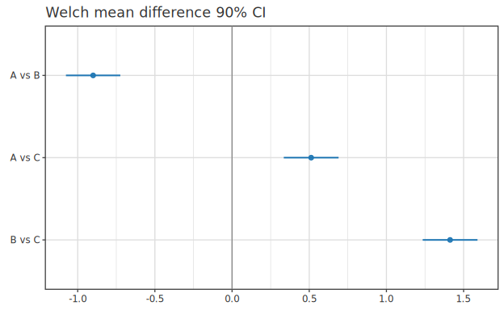

# 記述統計・検定

> 🌐 [English](10-stat.md) | **日本語**

> [📚 索引](README.ja.md) ｜ [01 quickstart](01-quickstart.ja.md) ｜ [02 regression](02-regression.ja.md) ｜ [03 bayesian-hbm](03-bayesian-hbm.ja.md) ｜ [04 multivariate](04-multivariate.ja.md) ｜ [05 ml](05-ml.ja.md) ｜ [06 timeseries](06-timeseries.ja.md) ｜ [07 survival](07-survival.ja.md) ｜ [08 causal](08-causal.ja.md) ｜ [09 doe](09-doe.ja.md) ｜ **10 stat** ｜ [11 data](11-data.ja.md) ｜ [12 plot](12-plot.ja.md)

記述統計・仮説検定・効果量。 理論は [`docs/stat/`](../stat/) のガイドが一次根拠。

| 領域 | モジュール | 主な関数 |
|---|---|---|
| 記述統計 | `Stat.Descriptive` | `mean` / `median` / `quantile` / `variance` / `sd` / `iqr` / `range'` |
| 仮説検定 | `Stat.Test` | `tTest1Sample` / `tTestWelch` / `anovaOneWay` / `chiSquareGOF` / `shapiroWilk` … |
| 効果量 | `Stat.Effect` | `cohenD` / `hedgesG` |
| 前処理 (標準化) | `Stat.Standardize` | `fitStandardizer` / `applyStandardizer` / `unapplyStandardizer` |
| PCA / クラスタ | → [04 multivariate](04-multivariate.ja.md) | |
| ブートストラップ | `Stat.Bootstrap` | → [07-bootstrap](../stat/07-bootstrap.ja.md) |

---

## 記述統計 (`Stat.Descriptive`)

全て `G.Vector v Double`(`[Double]` を `V.fromList` 等で渡す)に対する単一正準シグネチャ。

```haskell
mean     :: G.Vector v Double => v Double -> Double
median   :: G.Vector v Double => v Double -> Double
quantile :: G.Vector v Double => Double -> v Double -> Double   -- 確率 (R type-7 線形補間)
variance :: G.Vector v Double => v Double -> Double             -- n-1
sd       :: G.Vector v Double => v Double -> Double
iqr      :: G.Vector v Double => v Double -> Double
range'   :: G.Vector v Double => v Double -> Double
```

> NA は呼び手責任 (`mapMaybe id` 等で除く)。 → [io/04-fit-api](../io/04-fit-api.ja.md) と対称に [11 data](11-data.ja.md) の集約子からも使える。

生データ列の分布は `describeBox` で box plot に。

```haskell
import Hanalyze.Plot (describeBox)
saveSVGBound "box.svg" $ noDf |>> describeBox xs <> title "distribution"
```


---

## 仮説検定 (`Stat.Test`)

多くの検定は `TestResult` を返し、 これは `Plottable` (効果量 + 95% CI の forest・0 基準線)。

```haskell
tTest1Sample :: LA.Vector Double -> Double -> Alternative -> TestResult   -- 標本, μ₀, 対立仮説
tTestWelch   :: LA.Vector Double -> LA.Vector Double -> Alternative -> TestResult   -- 2 標本 Welch
anovaOneWay  :: [LA.Vector Double] -> TestResult
kruskalWallis :: [LA.Vector Double] -> TestResult
chiSquareGOF :: LA.Vector Double -> LA.Vector Double -> TestResult
shapiroWilk  :: LA.Vector Double -> TestResult     -- 正規性
leveneTest   :: [LA.Vector Double] -> TestResult   -- 等分散性
```

複数検定を並べた forest は `testForestLabeled`。

```haskell
import Hanalyze.Plot (toPlot, testForestLabeled)
saveSVGBound "forest.svg"
  $ noDf |>> testForestLabeled [("A vs B", tAB), ("A vs C", tAC), ("B vs C", tBC)]
```



> ★大半の検定は CI を持たず forest 非対象 (CI を持つのは `tTest1Sample` / `tostWelch` 等)。
> 0 基準線は平均差・効果量 (null=0) 向けで、 生の平均と混ぜると軸が歪む ([01-test](../stat/01-test.ja.md))。

---

## 効果量 (`Stat.Effect`)

```haskell
cohenD      :: LA.Vector Double -> LA.Vector Double -> Double
hedgesG     :: LA.Vector Double -> LA.Vector Double -> Double
cohenDCI    :: LA.Vector Double -> LA.Vector Double -> Double -> (Double, Double)  -- α → 信頼区間
cohenDPaired :: LA.Vector Double -> LA.Vector Double -> Double                     -- 対応ありの d
```

`cohenDCI xs ys 0.05` は非中心 t 分布で **正確な** 95% CI を返す (漸近近似ではない)。
導出は [stat/usage-misc-stat](../stat/usage-misc-stat.ja.md)。

---

## 高度な解析 (Fit Y by X / Friedman+Dunn / LCA / Graphical Lasso)

Phase 13 / 32 の集約モジュール。 定式化・label switching 等の罠は
[stat/usage-misc-stat](../stat/usage-misc-stat.ja.md) が一次根拠。

**Fit Y by X** (`Model.FitYByX`) — X / Y の型で解析を自動 dispatch (JMP "Fit Y by X" 相当):

```haskell
fitYByX :: LA.Vector Double -> VarType -> LA.Vector Double -> VarType -> FitYByXResult
-- VarType = Continuous | Categorical
-- Cont×Cont→単回帰 / Cont×Cat→logistic / Cat×Cont→one-way ANOVA / Cat×Cat→χ² 独立性
```

**Friedman + Dunn** (`Stat.Test`) — paired multi-group ノンパラ + 事後全ペア比較:

```haskell
friedmanTest :: LA.Matrix Double -> TestResult              -- n subjects × k treatments・Plottable
dunnTest     :: [LA.Vector Double] -> MultiCompareResult    -- Kruskal-Wallis 後の全ペア (p_adj, BH 既定)
```

**LCA** (`Model.LatentClassAnalysis`) — カテゴリ潜在クラスクラスタリング (EM):

```haskell
fitLCA :: Int -> Int -> [[Int]] -> Int -> Double -> MWC.GenIO -> IO LCAFit
--        K     L      行 (n×J)   maxIter tol      RNG
-- lcaPi (mixing π) / lcaRho (K×L 条件付確率) / lcaResponsibilities (posterior γ)
```

**Graphical Lasso** (`Stat.CorrelationNetwork`) — sparse precision matrix (条件付独立ネットワーク):

```haskell
graphicalLasso        :: LA.Matrix Double -> Double -> Int -> Double -> GLassoFit   -- X, λ, maxOuter, tol
graphicalLassoFromCov :: LA.Matrix Double -> Double -> Int -> Double -> GLassoFit   -- 既存 S から
-- glPrecision (Θ=Σ⁻¹ sparse) / glCovariance (Σ) / glConverged / nonZeroPrecision thr Θ
empiricalCov :: LA.Matrix Double -> LA.Matrix Double
```

---

## 前処理: 標準化 (Stat.Standardize)

特徴量の z-score 標準化 `(x − μ) / σ` を学習・適用・逆変換する低レベルユーティリティ。
列ごとに `(μ, σ)` を `Standardizer` に保持する (`σ ≈ 0` の定数列は `σ = 1` に丸めて 0 割回避)。

```haskell
import Hanalyze.Stat.Standardize
  ( Standardizer (..), fitStandardizer, applyStandardizer
  , unapplyStandardizer, applyStandardizerCol, identityStandardizer )

fitStandardizer     :: LA.Matrix Double -> Standardizer            -- n×p 行列から列ごとの (μ,σ) を学習
applyStandardizer   :: Standardizer -> LA.Matrix Double -> LA.Matrix Double   -- (x−μ)/σ
unapplyStandardizer :: Standardizer -> LA.Matrix Double -> LA.Matrix Double   -- x·σ+μ (元スケールへ復元)
applyStandardizerCol :: Standardizer -> Int -> Double -> Double    -- 1 列・1 値だけ標準化 (JS スライダ等)
-- Standardizer { stMu :: [Double], stSd :: [Double] }  -- 列ごとの μ / σ (JSON フレンドリ)
```

```haskell
let s   = fitStandardizer xTrain          -- 学習データで (μ, σ) を固定
    xz  = applyStandardizer s xTrain      -- 標準化空間へ
    xz' = applyStandardizer s xTest       -- ★テストにも同じ (μ, σ) を適用 (リーク防止)
    x   = unapplyStandardizer s xz        -- 元スケールへ戻す
```

`y` は標準化しない規約 (回帰の出力スケールを保つ)。 **モデル学習で透過的に標準化したい**
場合は、 この低レベル API を直に触らず [05 ml の透過標準化ラッパ
`standardized` / `standardizedY`](05-ml.ja.md#透過標準化ラッパ-standardized--standardizedy) を使う
(図・予測の元スケール逆変換まで自動)。

→ [09-effect](../stat/09-effect.ja.md) / [PCA・クラスタは 04 multivariate](04-multivariate.ja.md) / [ブートストラップ 07-bootstrap](../stat/07-bootstrap.ja.md)
