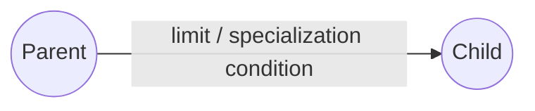
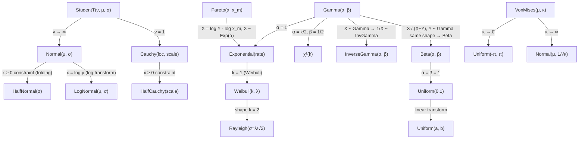
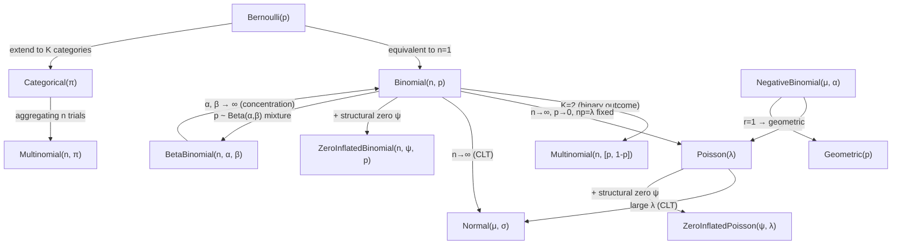
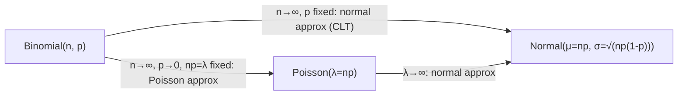
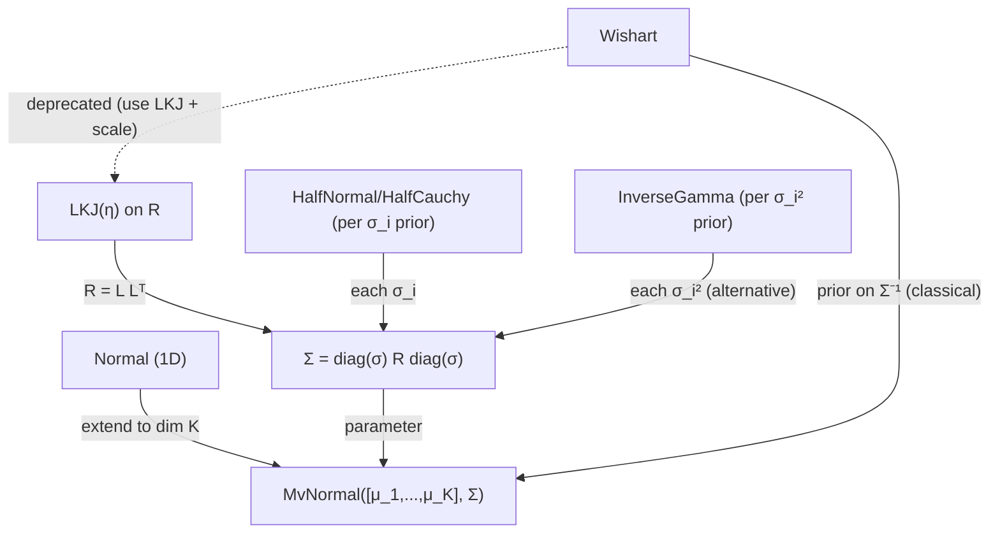
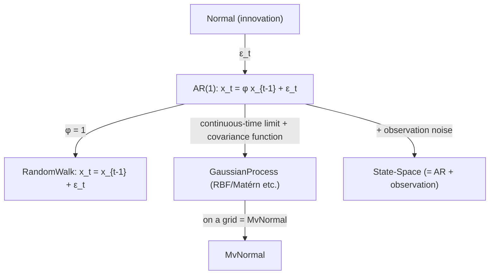
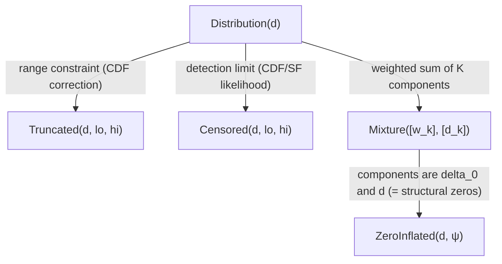
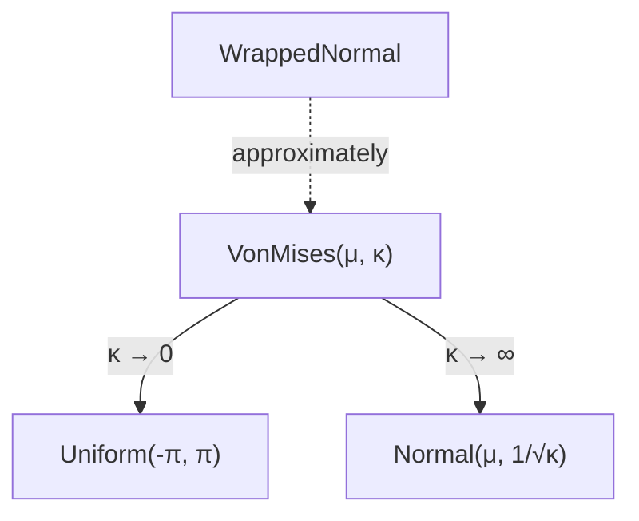

# Probability distribution relationship map

> 🌐 **English** | [日本語](01-distributions.ja.md)

> A map of the limits, specializations, and conjugacy relations among the
> distributions implemented in hanalyze. Useful as a supplement to the study
> materials for understanding which distribution is a special case of which.

## Legend

- **Limit**: pushing a parameter to ∞ or 0 yields a different distribution.
- **Specialization**: fixing a parameter at a specific value matches another distribution.
- **Mixture**: derived from a hierarchy of two distributions.
- **Conjugate**: a pair that gives a closed-form Bayesian posterior.

## 1. Continuous-distribution family tree

### Common transformations

| Transform | Relation | Note |
|---|---|---|
| `LogNormal(μ, σ)` | log y ~ Normal(μ, σ) | positive values, normal under log |
| `HalfNormal(σ)` | abs(z), z ~ Normal(0, σ) | popular SD prior |
| `Chi²(k)` | sum of k Normal(0,1)² | Gamma special case |
| `Rayleigh(σ)` | √(X² + Y²), X,Y ~ N(0, σ) | equivalent to Weibull(k=2, λ=σ√2) |

## 2. Discrete-distribution family tree

### Important limits / approximations

These are textbook examples of the **De Moivre–Laplace theorem** (binomial → normal),
the **Poisson approximation**, and the **Central Limit Theorem**.

## 3. Conjugate pairs (closed-form Bayesian posterior)

```mermaid
graph TD
  subgraph "Beta-Binomial"
    Bp["Beta(α, β)"] --"prior on p"--> Bb["Binomial(n, p)"]
    Bb --"posterior"--> Bp2["Beta(α+k, β+n-k)"]
  end
  subgraph "Gamma-Poisson"
    Gl["Gamma(α, β)"] --"prior on λ"--> Pp["Poisson(λ)"]
    Pp --"posterior"--> Gl2["Gamma(α+Σy, β+n)"]
  end
  subgraph "Dirichlet-Multinomial"
    D["Dirichlet(α₁,…,α_K)"] --"prior on π"--> M["Multinomial(n, π)"]
    M --"posterior"--> D2["Dirichlet(α_k + count_k)"]
  end
  subgraph "Normal-InverseGamma"
    IG["InverseGamma(α, β)"] --"prior on σ²"--> Nl["Normal(μ, σ)"]
    Nl --"posterior"--> IG2["InverseGamma(α+n/2, β+SS/2)"]
  end
  subgraph "Normal-Normal"
    Np["Normal(μ₀, σ₀)"] --"prior on μ"--> Nl2["Normal(μ, σ)"]
    Nl2 --"posterior"--> Np2["Normal(updated)"]
  end
```

These are used for direct Gibbs sampling of individual parameters.
hanalyze's `Hanalyze.MCMC.Gibbs.gibbsMH` automatically detects and exploits the conjugacy
structure of the prior/likelihood combination.

## 4. Multivariate and correlation

PyMC and Stan prefer the **LKJ + scale** decomposition over **Wishart**.
hanalyze samples the Cholesky factor of R via `lkjCorrCholesky`.

## 5. Time series / state-space

`ar1Latent` (J2) and `Hanalyze.Model.GP` (master) are implemented.

## 6. Truncation / censoring / mixtures

`Truncated` / `Censored` / `Mixture` / `ZeroInflated*` can be defined for any base
distribution (those requiring a CDF are limited).

## 7. Angular data

`VonMises` is the "normal-like" distribution on angles.

## Summary table — when to use which?

| Data property | First choice | Overdispersed | Angular |
|---|---|---|---|
| 0/1 binary | `Bernoulli` | — | — |
| successes out of n | `Binomial(n, p)` | `BetaBinomial(n, α, β)` | — |
| counts | `Poisson(λ)` | `NegativeBinomial(μ, α)` | — |
| zero-inflated counts | `ZeroInflatedPoisson` | — | — |
| continuous (real) | `Normal(μ, σ)` | `StudentT(ν, μ, σ)` | — |
| continuous (positive) | `LogNormal` / `Gamma` / `Weibull` | — | — |
| proportion (0-1) | `Beta(α, β)` | — | — |
| multinomial (K-category counts) | `Multinomial(n, π)` | — | — |
| unit vector / simplex | `Dirichlet` | — | — |
| multivariate real | `MvNormal(μ, Σ)` | — | — |
| angle | — | — | `VonMises(μ, κ)` |

| Estimand | Conjugate prior | Weakly informative |
|---|---|---|
| `p` of Bernoulli/Binomial | `Beta(α, β)` | `Beta(2, 2)` etc. |
| `λ` of Poisson | `Gamma(α, β)` | `HalfNormal` |
| `π` of Multinomial | `Dirichlet(α₁,…)` | `Dirichlet(1,…)` |
| `μ` of Normal | `Normal(μ₀, σ₀)` | `Normal(0, large)` |
| `σ²` of Normal | `InverseGamma(α, β)` | `HalfNormal` / `HalfCauchy` |
| correlation matrix `R` | `LKJ(η)` | `LKJ(1)` (uniform) |

## References

- Equations and meaning of each distribution: [docs/bayesian/theory-distributions.md](theory-distributions.md).
- Gibbs sampling exploiting conjugate structure: [docs/bayesian/04-gibbs.md](04-gibbs.md).
