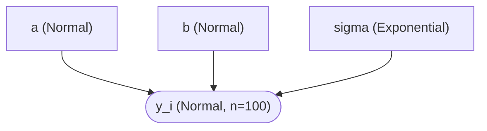
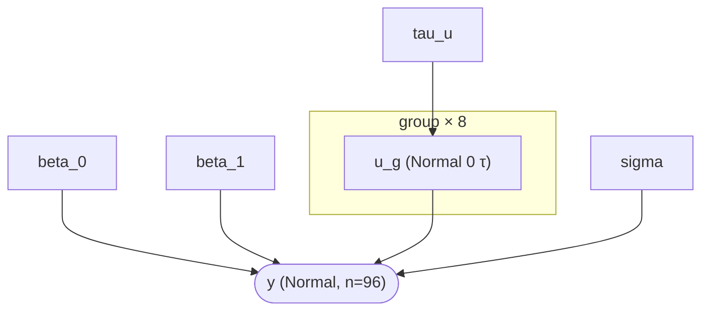
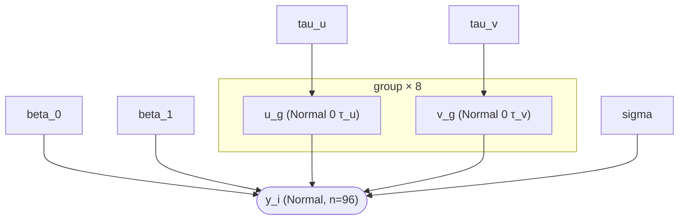
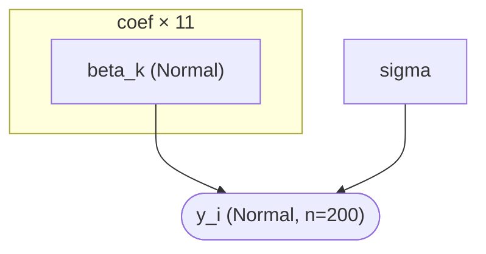
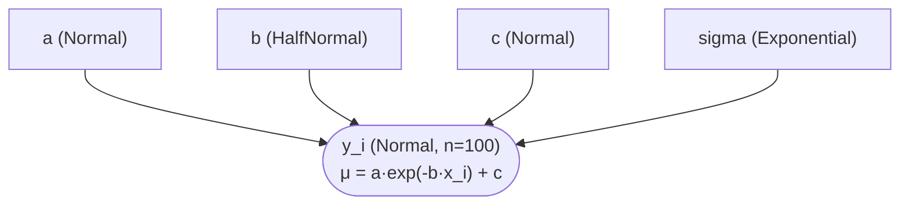
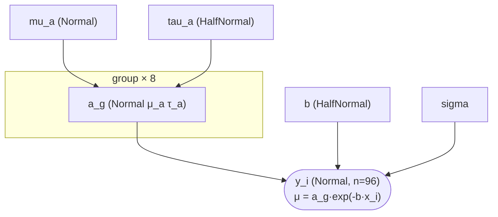

# 確率的プログラミング DSL (Hanalyze.Model.HBM)

> 🌐 [English](02-probabilistic-model.md) | **日本語**

> 関連デモ:
> - [`hbm-example`](../../demo/bayesian/HBMExample.hs) — 階層正規モデル + 4 チェーン NUTS
> - [`hbm-regression`](../../demo/bayesian/HBMRegressionDemo.hs) — ベイズ単回帰 (HTML レポート付き; legacy `Hanalyze.Viz.AnalysisReport` 経由)
> - [`clinical-trial`](../../demo/bayesian/ClinicalTrial.hs) — Beta-Binomial A/B テスト
> - [`simpson-paradox`](../../demo/bayesian/SimpsonParadoxDemo.hs) — シンプソン例で LM/GLMM/HBM 比較
> - [`hbm-random-slope`](../../demo/bayesian/HBMRandomSlopeDemo.hs) — ランダム傾き拡張

## 概要

`Hanalyze.Model.HBM` は Free Monad で実装した多相な確率的プログラミング DSL です。
Stan や PyMC のように宣言的にモデルを書けます。

継続を `forall a. (Floating a, Ord a, TrackTag a) => Model a r` として多相化してあるため、
同一のモデル定義から **4 通りの解釈** を取り出せます:

| 解釈 | 特殊化 | 用途 |
|---|---|---|
| 構造検査 | `a = Double` | `collectNodes`, `describeModel` |
| log joint 評価 | `a = Double` | `logJoint`, `logPrior`, `logLikelihood` |
| AD 勾配 | `a = ReverseDouble s` (reverse-mode) | `gradAD`, `gradADU` (machine epsilon 精度) |
| 依存追跡 | `a = Track` | `extractDeps`, `buildModelGraph` (DAG 自動抽出) |

サンプラー (`Hanalyze.MCMC.HMC`/`NUTS`/`Gibbs`) は AD 勾配と自動制約変換を活用します。

---

## 基本 API

```haskell
import Hanalyze.Model.HBM     -- Distribution(..), sample, observe を提供

-- 多相モデルの型エイリアス
type ModelP r = forall a. (Floating a, Ord a, TrackTag a) => Model a r

-- 潜在変数の宣言 (返り値は a で後続の sample/observe に流れる)
sample  :: Text -> Distribution a -> Model a a

-- 観測データへの条件付け (i.i.d. 仮定)
observe :: Text -> Distribution a -> [Double] -> Model a ()

-- 名前付き派生量 (PyMC `pm.Deterministic`・log-joint には寄与しない)。
-- モデル DAG では白い四角で描かれる。
deterministic :: Text -> a -> Model a a

-- 名前付きデータプレースホルダ (PyMC `pm.Data`)。 後で `withData` で差し替え可能。
-- 役割 suffix の三点セットで使い分ける:
--   dataNamedX   = 説明変数。 モデルの数値型 [a] で返りそのまま式に入る (realToFrac 不要)
--   dataNamedObs = 目的変数。 `observe` が要求する生 [Double] で返る
--                  (DAG では observe の ys との値一致で obs→slot エッジが出る
--                   = PyMC の obs→y 同型。 罠は dag-extraction.ja.md 罠 11)
--   dataNamedIx  = 群 index 等の離散値。 slot 名タグ付き Ix で運ぶ (round 不要、
--                  bs !!! g で索引すると DAG に slot→利用先エッジが出る)
-- (`dataNamed` は `dataNamedX` の同義・既存コード用に残置)
dataNamedX   :: Text -> [Double] -> Model a [a]
dataNamedObs :: Text -> [Double] -> Model a [Double]
dataNamedIx  :: Text -> [Int]    -> Model a [Ix]

-- Ix の索引は専用演算子で (Phase 60.7。 数値解釈は !! と同コスト、
-- Track (DAG) 解釈でのみ slot 名が依存タグとして注入される = PyMC の b0[gid] 同型)
(!!!) :: TrackTag b => [b] -> Ix -> b

-- 繰り返しブロックを大きさ n の plate "名前" で囲む。 DAG では繰り返しノードが
-- 「名前 (n)」 (= 個数) のラベル付き角丸枠の中に集約描画される (PyMC の plate 記法相当)。
-- `plateI` は `plate name n (forM [0..n-1] f)` の糖衣。
plate  :: Text -> Int -> Model a r -> Model a r
plateI :: Text -> Int -> (Int -> Model a r) -> Model a [r]

-- データ行リストを plate で囲んで反復 (plate 版の forM / forM_・引数順も forM 形)。 plate サイズは
-- リスト長から自動。 plateForM_ は定番の観測ループ `plate name (length rows) $ forM_ f rows` を畳む:
--   plateForM_ "obs" (zip x y) $ \(xi, yi) -> do
--     mu <- deterministic "mu" (a + b * realToFrac xi)
--     observe "obs" (Normal mu s) [yi]
plateForM  :: Text -> [b] -> (b -> Model a r) -> Model a [r]   -- 返り値を保持
plateForM_ :: Text -> [b] -> (b -> Model a r) -> Model a ()    -- 破棄 (観測のみ)

-- インデックス付きノード名 (アンダースコアは自動付与):
--   indexed "theta" 1  ==  "theta_1"   (中置形: "theta" .# 1)
indexed :: Text -> Int -> Text
(.#)    :: Text -> Int -> Text   -- infixl 9、 indexed の別名
```

plate の意味論と DAG 描画の詳細は [plate-notation.ja.md](plate-notation.ja.md) を参照。

`indexed` / `.#` は、 群別ノードをループで命名するときに頻出する
`T.pack ("theta_" ++ show j)` ボイラープレートを畳みます (後述の階層パターン参照)。

`sample` の返り値は `a` 型 (多相) で、後続の `sample`/`observe` の分布パラメータに
そのまま流せます (Stan の `~` 構文に相当)。

> **注**: `ModelP` は rank-2 型のため `let m = schoolModel dat` のような
> ローカル束縛では monomorphisation 問題が起きます。トップレベル束縛
> (`m :: ModelP () ; m = schoolModel dat`) を使うか、関数呼び出しで
> 毎回インライン展開してください。

---

## 使用できる分布

```haskell
data Distribution a
  = Normal      a a       -- Normal(μ, σ)    — 連続、実数全体
  | Binomial    Int a     -- Binomial(n, p)  — 離散、[0,n]
  | Poisson     a         -- Poisson(λ)      — 離散、非負整数
  | Exponential a         -- Exponential(λ)  — 連続、正値のみ
  | Gamma       a a       -- Gamma(α, β)     — 連続、正値のみ (rate=β)
  | Beta        a a       -- Beta(α, β)      — 連続、(0,1)
```

分布パラメータは多相 `a` なので、別の `sample` から得た値をそのまま渡せます
(例: `Normal mu sigma` で `mu, sigma :: a`)。

HMC/NUTS は制約付き分布 (Exponential/Gamma → 正値、Beta → 単位区間) を
自動的に unconstrained 空間に変換してサンプリングします。

---

## パターン 1: 単純な正規モデル

```haskell
-- μ ~ Normal(0, 10)
-- y_i ~ Normal(μ, σ=2)  (σ 既知)
normalMean :: [Double] -> ModelP ()
normalMean ys = do
  mu <- sample "mu" (Normal 0 10)
  observe "y" (Normal mu 2) ys
```

`mu` の事後分布 (`marginalsOf`):


---

## パターン 2: 制約付きパラメータ (σ 未知)

```haskell
-- μ ~ Normal(0, 10)
-- σ ~ Exponential(1)   ← HMC/NUTS が対数変換で正値を保証
-- y_i ~ Normal(μ, σ)
normalUnknownSigma :: [Double] -> ModelP ()
normalUnknownSigma ys = do
  mu    <- sample "mu"    (Normal 0 10)
  sigma <- sample "sigma" (Exponential 1)
  observe "y" (Normal mu sigma) ys
```

`mu`, `sigma` の事後分布 (`marginalsOf`):


---

## パターン 3: A/B テスト (Beta-Binomial)

```haskell
-- p_ctrl ~ Beta(1,1),  y_ctrl ~ Binomial(50, p_ctrl), k_ctrl=18 回復
-- p_trt  ~ Beta(1,1),  y_trt  ~ Binomial(50, p_trt),  k_trt =31 回復
clinicalModel :: ModelP ()
clinicalModel = do
  pCtrl <- sample "p_ctrl" (Beta 1 1)
  pTrt  <- sample "p_trt"  (Beta 1 1)
  observe "y_ctrl" (Binomial 50 pCtrl) [18]
  observe "y_trt"  (Binomial 50 pTrt)  [31]
```

2 群の事後区間 (`forestOf`) — 処置効果が明瞭 (`p_trt` ≈ 0.61 vs `p_ctrl` ≈ 0.37、
区間はほぼ重ならない):


---

## パターン 4: 単純線形回帰 (観測ごとに平均が違う)

平均が **観測ごとに異なる** 場合 (`μ_i = α + β·x_i`)、 スカラの `Distribution`
にベクトルは渡せません。 `forM_` でデータをループし、 点ごとに `observe` を
発行します。 点ごとの平均は `deterministic` で束縛しておくと DAG
(`α, β → μ → y`) に現れ、 事後ツール (`epred` 等) からも再利用できます。

```haskell
-- α ~ Normal(0, 10),  β ~ Normal(0, 10),  σ ~ Exponential(1)
-- y_i ~ Normal(α + β·x_i, σ)
regModel :: [Double] -> [Double] -> ModelP ()
regModel xs ys = do
  alpha <- sample "alpha" (Normal 0 10)
  beta  <- sample "beta"  (Normal 0 10)
  sigma <- sample "sigma" (Exponential 1)
  let f x = alpha + beta * realToFrac x       -- do ブロック内の `let` は使える
  forM_ (zip xs ys) $ \(x, y) -> do
    mu <- deterministic "mu" (f x)
    observe "y" (Normal mu sigma) [y]
```

`realToFrac` が要るのはモデルが **多相** (`ModelP`) だからです。 パラメータは
抽象数値型 `a` (勾配インタプリタは dual number、 log 密度インタプリタは
`Double` に具体化) を持つ一方、 データは具体 `Double`。 各データ点を `alpha` /
`beta` と組み合わせる前に `a` へ持ち上げる必要があります。 (素の `Double` だった
旧 monomorphic DSL では不要でした。 DAG 自動導出を可能にした多相化が
`realToFrac` を課しています。)

ロジスティック / ポアソン回帰も同じ形のまま尤度だけ差し替えます
(例 `Bernoulli (invLogit mu)` / `Poisson (exp mu)`)。

事後フィット (データ散布図 + 事後平均線 + 94% HDI 帯) は plot 統合の `epred`
で可視化できます (`scatter "x" "y" <> toPlot (epred fit "x" "mu")`):


> `plot-integration-demo` executable で生成
> ([`PlotIntegrationDemo.hs`](../../demo-plot/PlotIntegrationDemo.hs))。

---

## パターン 5: 階層モデル (グループ別) の書き方

階層モデルでは **全体プライア** から **群別パラメータ** を引き、 観測を群別
パラメータに条件付ける形になります。 データの持ち方とパラメタ化の選び方で
3 形式の書き方があります。

> **動作確認**: 本節 (および後続のパターン 6-8) の sample コードは
> `phase37-a0-verify` executable で全てビルド + 実行確認済みです
> (`cabal run phase37-a0-verify`、 ソース:
> [`Phase37A0VerifyDemo.hs`](../../demo/bayesian/Phase37A0VerifyDemo.hs))。

モデル構造 (`dagOf`) と群平均の事後 (縮約が見える・`forestOf`):


### 形式 A: 群ごとにデータが分かれている (`[[Double]]`)

データが既に群ごとのリストとして手元にある場合は、 `forM_` でループを回し
各 iteration 内で `sample` (群別 θ_j) と `observe` (群 j の観測) を並べます。

```haskell
import Control.Monad (forM_)
import qualified Data.Text as T

-- μ ~ Normal(0, 10)
-- τ ~ HalfNormal(5)        ← Gelman 2006 weakly-informative 推奨 (後述)
-- θ_j ~ Normal(μ, τ)       (群別平均)
-- y_ij ~ Normal(θ_j, 1)
schoolModelA :: [[Double]] -> ModelP ()
schoolModelA groupData = do
  mu  <- sample "mu"  (Normal 0 10)
  tau <- sample "tau" (HalfNormal 5)
  forM_ (zip [1::Int ..] groupData) $ \(j, ys) -> do
    theta <- sample (indexed "theta" j) (Normal mu tau)
    observe (indexed "y" j) (Normal theta 1) ys

groupDataA :: [[Double]]
groupDataA =
  [ [1.1, 0.8, 1.3, 1.0]    -- 群 1: 真の平均 ≈ 1
  , [4.9, 5.2, 4.7, 5.1]    -- 群 2: 真の平均 ≈ 5
  , [9.0, 8.7, 9.3, 8.9]    -- 群 3: 真の平均 ≈ 9
  ]
```

潜在変数名は `"theta_1" / "theta_2" / "theta_3"` のように動的に生成されます。
`sampleNames` で取り出して NUTS の初期値や事後分布表に使えます。

### 形式 B: long-format (各観測が `gid :: Int` を持つ)

DataFrame 由来 / SQL 由来の縦持ちデータ (`gids :: [Int]` + `ys :: [Double]`)
を直接受けたい場合の書き方。 **per-group θ_j を先に `forM` で全て展開** し、
観測時に index で参照します。

```haskell
schoolModelB :: [Int] -> [Double] -> ModelP ()
schoolModelB gids ys = do
  let nG = maximum gids + 1
  mu  <- sample "mu"  (Normal 0 10)
  tau <- sample "tau" (HalfNormal 5)
  thetas <- forM [0 .. nG - 1] $ \j ->
    sample (indexed "theta" j) (Normal mu tau)
  forM_ [0 .. nG - 1] $ \j -> do
    let ysG = [y | (g, y) <- zip gids ys, g == j]
    observe (indexed "y" j)
            (Normal (thetas !! j) 1) ysG

-- 例: 同じ data を縦持ちで表現
gidsB :: [Int]
gidsB = [0,0,0,0, 1,1,1,1, 2,2,2,2]

ysB :: [Double]
ysB = [1.1, 0.8, 1.3, 1.0,  4.9, 5.2, 4.7, 5.1,  9.0, 8.7, 9.3, 8.9]
```

`thetas :: [a]` をリストで持ち、 後で `thetas !! j` で参照する点がポイント。
`!!` はリストの O(j) アクセスですが、 群数が小さければ問題ありません
(群数 ≫ 100 になる場合は形式 A か Vector に切り替えるのが無難)。

### 形式 C: non-centered パラメタ化 (funnel 回避)

群数が多い / 群内サンプルが少なくて τ の不確実性が大きい場合、
`θ_j ~ Normal(μ, τ)` を直接 sample すると **Neal's funnel** が発生して
NUTS が divergence を出します。 `nonCenteredNormal` を使うと
`θ_j_raw ~ Normal(0, 1)` をサンプルし `θ_j = μ + τ · θ_j_raw` を派生量
として返すので、 funnel を回避できます。

```haskell
import Hanalyze.Model.HBM (nonCenteredNormal)

schoolModelC :: [[Double]] -> ModelP ()
schoolModelC groupData = do
  mu  <- sample "mu"  (Normal 0 10)
  tau <- sample "tau" (HalfNormal 5)
  forM_ (zip [1::Int ..] groupData) $ \(j, ys) -> do
    theta <- nonCenteredNormal (indexed "theta" j) mu tau
    observe (indexed "y" j) (Normal theta 1) ys
```

`sample` が `nonCenteredNormal` に変わっただけで残りは形式 A と同じです。
chain 上の潜在変数名は `"theta_1_raw"` 等になり、 `θ_j` の実値は
`augmentChainWithDeterministic` で復元できます (派生量扱い)。

詳しい原理と BFMI 改善の実測は [`noncentered-demo`](../../demo/bayesian/NonCenteredDemo.hs)
を参照。

### 3 形式の使い分け

| 状況 | 推奨 |
|---|---|
| 群数 ≤ 数十、 群ごとデータが手元にある | **形式 A** (素直で読みやすい) |
| DataFrame 由来の縦持ち data、 群数が動的 | **形式 B** |
| 群数大 / 群内 N 小 / NUTS が divergence を出す | **形式 C** (non-centered) |

### 群列が文字列 (categorical) の場合 (Phase 41)

上の形式 B の `gid :: Int` は整数コード前提ですが、 **DataFrame / ∀LIC∃Code DSL
経由の HBM** (canvas backend → streaming bridge worker) では、 群列・観測列に
**文字列 (categorical) 列**をそのまま使えます。 `DataMap` の値型が
`data Column = Numeric [Double] | Factor {facLevels, facCodes}` の sum 型で、
backend が文字列列を **factor encode** (level を出現順に 0,1,2,… の code 化) して
渡すためです。

- 群化: `forEachGroup "species"` のように文字列列を群列にでき、 群別 node 名に
  **level ラベル**が付きます (例 `alpha_setosa`)。 level が安全な識別子でない場合
  (空白・記号・数値先頭) は数値 code suffix にフォールバック。
- 観測: 観測列が categorical なら **code (0..K-1)** が観測値として渡り、 2 値応答は
  `Bernoulli` で直接観測できます。 3 水準以上の多値応答は `Categorical [probs]` /
  `OrderedLogistic eta [cuts]` で観測できます (Phase 42、 list 引数は interpreter が
  `VList` として評価)。
- 多値応答の拡充 (Phase 43): 確率ベクトル / cut 点を固定値ではなく **latent 推定**
  できます。 `Model a [a]` を返す combinator を **list 値 bind** で束ねます:
  - `cuts <- orderedCuts "cut" 2 (-2) 1` → `OrderedLogistic eta cuts` (cut 点推定、
    `orderedCuts` が increasing 列を保証)
  - `probs <- dirichlet "pi" [1,1,1]` → `Categorical probs` (Dirichlet prior、
    stick-breaking で simplex)
  - `softmax` builtin (VList→VList) で `Categorical (softmax [0, b1*x, b2*x])` の
    多項ロジット (基準クラス η=0 固定)
  WAIC/PPC は内部 latent (`cut_d_*` / `pi_b*`) から cuts/π を再構築して評価します。

詳細はフロントエンド app 側の HBM モデリング言語仕様を参照。
raw hanalyze monad API (本ページの `sample` / `observe`) 自体は従来どおり
`[Double]` / `Int` を扱い、 factor encode は data 投入層 (DSL/backend) の責務です。

---

## パターン 6: ランダム傾き (random slope)

切片 α だけでなく **傾き β も群別に階層化** する形。 各群で説明変数 x の効き方
が違うことが示せます (e.g. シンプソンのパラドックス回避)。

```haskell
-- y_ij ~ Normal(α_j + β_j · x_ij, σ)
-- α_j ~ Normal(μ_α, τ_α)
-- β_j ~ Normal(μ_β, τ_β)
randomSlope :: [[(Double, Double)]] -> ModelP ()
randomSlope groupData = do
  muA  <- sample "mu_alpha"  (Normal 0 10)
  tauA <- sample "tau_alpha" (HalfNormal 5)
  muB  <- sample "mu_beta"   (Normal 0 5)
  tauB <- sample "tau_beta"  (HalfNormal 5)
  sig  <- sample "sigma"     (Exponential 1)
  forM_ (zip [1::Int ..] groupData) $ \(j, pts) -> do
    alpha <- sample (indexed "alpha" j) (Normal muA tauA)
    beta  <- sample (T.pack ("beta_"  ++ show j)) (Normal muB tauB)
    forM_ pts $ \(x, y) ->
      observe (indexed "y" j)
              (Normal (alpha + beta * realToFrac x) sig) [y]
```

群別の切片だけにする (α_j 階層 + β 共通) と **形式 A の random intercept**、
傾きも階層化すると **random intercept + random slope** になります。
WAIC / LOO で両者を比較した実例: [`hbm-random-slope`](../../demo/bayesian/HBMRandomSlopeDemo.hs)。

---

## パターン 7: 3 階層 nested (district → school → students)

地区の中に学校、 学校の中に生徒、 のように **入れ子の階層** がある場合。
中間レベル (学校) のプライアの平均が上位レベル (地区) からくる構造です。

```haskell
-- μ        ~ Normal(0, 10)
-- τ_d, τ_s ~ HalfNormal(5)
-- δ_d ~ Normal(μ, τ_d)        (地区効果)
-- θ_{d,s} ~ Normal(δ_d, τ_s) (学校効果、 地区共通の τ_s)
-- y_{d,s,i} ~ Normal(θ_{d,s}, 1)
multiLevel :: [[[Double]]] -> ModelP ()
multiLevel byDistrict = do
  mu  <- sample "mu"    (Normal 0 10)
  tD  <- sample "tau_d" (HalfNormal 5)
  tS  <- sample "tau_s" (HalfNormal 5)
  forM_ (zip [1::Int ..] byDistrict) $ \(d, schools) -> do
    delta <- sample (indexed "delta" d) (Normal mu tD)
    forM_ (zip [1::Int ..] schools) $ \(s, ys) -> do
      theta <- sample (T.pack (concat ["theta_", show d, "_", show s]))
                      (Normal delta tS)
      observe (T.pack (concat ["y_", show d, "_", show s]))
              (Normal theta 1) ys
```

3 階層 nested の構造 (`dagOf`) — `μ → δ_d → θ_{d,s} → y`、 `τ_s` は district 間で共有:


入力は地区 → 学校 → 観測の 3 重リストになります。 縦持ち版が必要なら
`[(districtId, schoolId, y)]` を受けて、 形式 B のように
`forM` で `(d, s)` 全組合せの latent を先に展開する形に書き換えます。

---

## パターン 8: 交差 (crossed) ランダム効果

学校 s と年度 t が **交差** (どの (s, t) ペアでも観測される) する設計。
nested と違って学校効果と年度効果が独立にプライアを持ちます。

```haskell
-- α_s ~ Normal(μ_α, τ_α)   (学校効果)
-- γ_t ~ Normal(0,    τ_γ)  (年度効果、 全体平均は α_s 側に吸収させる)
-- y_{s,t,i} ~ Normal(α_s + γ_t, σ)
crossed :: Int -> Int -> [(Int, Int, Double)] -> ModelP ()
crossed nS nT obs = do
  muA <- sample "mu_alpha" (Normal 0 10)
  tA  <- sample "tau_a"    (HalfNormal 5)
  tG  <- sample "tau_g"    (HalfNormal 5)
  sig <- sample "sigma"    (Exponential 1)
  alphas <- forM [0 .. nS - 1] $ \s ->
    sample (indexed "alpha" s) (Normal muA tA)
  gammas <- forM [0 .. nT - 1] $ \t ->
    sample (indexed "gamma" t) (Normal 0 tG)
  forM_ obs $ \(s, t, y) ->
    observe (T.pack (concat ["y_", show s, "_", show t]))
            (Normal (alphas !! s + gammas !! t) sig) [y]
```

交差 (crossed) 構造 (`dagOf`) — 各 `y_{s,t}` が `α_s` と `γ_t` の 2 親を持つ (nest しない):


`α_s` の平均は `μ_α`、 `γ_t` の平均は 0 にしておくのが慣例 (全体平均の
identifiability を確保)。 lme4 風に書くと `y ~ 1 + (1 | school) + (1 | year)`
に相当します。

---

## パターン 9: 群レベル τ の事前選び (prior choice)

階層モデルで最も影響が大きい設計判断が **群レベル SD (τ) の事前** です。
Gelman 2006 の weakly-informative 推奨に従い、 通常は次の順で選びます:

| 事前 | 特性 | 使い所 |
|---|---|---|
| `HalfNormal(s)` | 軽い裾、 0 付近に質量集中 | **第一選択**。 τ の事前 SD = s で群間ばらつきの大きさを表現 |
| `HalfCauchy(s)` | 重い裾、 大きな τ も許容 | 群数小 (J ≤ 5) で τ を強く抑えたくない時 |
| `Exponential(λ)` | rate λ で平均 1/λ | 簡素、 ただし HalfNormal より裾が重め |
| `InverseGamma(α, β)` | 旧来の "non-informative" 慣例 | **非推奨**。 IG(0.001, 0.001) は事前平均/分散が病的、 群数小で事後を強く歪める (Gelman 2006) |

実装上の使い分け例:

```haskell
-- 推奨: HalfNormal(5) — 群間 SD が大体 0-10 の範囲を想定
tau <- sample "tau" (HalfNormal 5)

-- 群数小で τ を強く抑えたくない場合: HalfCauchy(2.5)
tau <- sample "tau" (HalfCauchy 2.5)

-- 簡素優先: Exponential
tau <- sample "tau" (Exponential 0.2)   -- 平均 5
```

`μ` のような群平均レベルにも `Normal(0, 大きめの SD)` が無難です
(`Normal 0 10` 〜 `Normal 0 100` をスケールに応じて)。 観測尺度より極端に
大きい SD を置くと NUTS の step size 適応で困ることがあります。

> 参考: Gelman A. (2006) "Prior distributions for variance parameters in
> hierarchical models", Bayesian Analysis 1.

---

## パターン 10: 多変量正規応答 (multi-column observe, Phase 44)

複数の連続応答列を **1 つの k 次元ベクトル**として相関ごと観測するには、 scalar
`observe` でなく `observeMV` を使い、 観測値を `[[Double]]` (各行が k-vector) で
渡します。 `MvNormal μ Σ` は full 共分散、 `MvNormalChol μ σ L` は scale vector +
相関 Cholesky を取り、 内部で `Σ = (diag σ · L)(diag σ · L)ᵀ` を構成します
(scaled Cholesky を直接使い再分解を避ける = Stan `multi_normal_cholesky` idiom)。

```haskell
-- (1) 既知 Σ の下で平均ベクトルを推定 (リテラル full cov)
corrMean :: [[Double]] -> Model Double ()
corrMean ys = do                                    -- ys = [[y1,y2], …]
  mu1 <- sample "mu1" (Normal 0 10)
  mu2 <- sample "mu2" (Normal 0 10)
  observeMV "y" (MvNormal [mu1, mu2] [[1, 0.5], [0.5, 1]]) ys

-- (2) 相関行列を LKJ prior から推定 (latent Σ、 王道ベイズ)
lkjCov :: [[Double]] -> Model Double ()
lkjCov ys = do
  mu1 <- sample "mu1" (Normal 0 10)
  mu2 <- sample "mu2" (Normal 0 10)
  s1  <- sample "s1"  (HalfNormal 1)
  s2  <- sample "s2"  (HalfNormal 1)
  l   <- lkjCorrCholesky "L" 2 2.0       -- 相関 Cholesky 因子 (LKJ(η=2) 事前)
  observeMV "y" (MvNormalChol [mu1, mu2] [s1, s2] l) ys
```

`MvNormal` / `MvNormalChol` は **観測専用** (`logDensity = 0`、 `sample` 不可)。
k-vector 観測は `observeMV` が `concat` で flatten し、 `obsLogSum` が分布次元 k で
`chunksOf` 再分割して密度を計算します。 共分散は SPD 前提 (`MvNormal` の Σ が
非正定値なら密度 -∞、 `lkjCorrCholesky` 経路は構成上 SPD 保証)。 σ を相関と分離する
ことで分散と相関に独立な事前分布を置けます (BDA3 / Stan manual の標準パラメタ化)。

> ∀LIC∃Code (HBM dialog) では観測列リストを `observeMV "y" dist [col "y1", col "y2"]`
> と書きます (bind 変数は小文字必須)。

---

## 構造化 observe と自動高速化 (Phase 54-56)

NUTS の per-draw 単価を支配するのは観測尤度とその勾配です。 Phase 54 で
**観測ブロックを構造のまま受け取る observe** と、 **per-obs 手書きモデルを自動で
高速経路に乗せるコンパイル**が入り、 Phase 55 で対象が **非 Gaussian GLM
(Poisson/Bernoulli)・σ 式 (heteroscedastic 含む)・式形混在**へ、 Phase 56 で
**観測分布 計 16 family** (下の対応表) へ広がりました。
どれも**数値の意味は不変** (従来 walk と 1e-9 一致を test で担保) で、
速度だけが変わります。

要点を先に: パターン 4-6 のような **per-obs 手書きはそのままで速くなります**。
`gradADU` のコンパイル時にモデルを 1 度静的解析し、 検出した構造を解析閉形式 /
ベクトル化カーネルに乗せ、 検出できない構造だけ従来 AD walk に fallback します。
下の「M1-M8 で見る」 が乗る側の実例、 「高速経路から外れる書き方」 が乗らない側です。

### 構造化線形予測子 observe (`observeLM` / `observeLMR`)

線形予測子 η = Xβ (+ 群効果) の観測 n 行を、 設計行列ごと **1 ノード**で宣言します
(PyMC/Stan で `y ~ N(Xβ + u[gid], σ)` をベクトルで一発書きするのと同じ idiom):

```haskell
observeLM  :: Text -> [Text] -> [[Double]] -> LMFamily -> [Double] -> ModelP ()
observeLMR :: Text -> [Text] -> [[Double]] -> [REff] -> LMFamily -> [Double] -> ModelP ()

-- ランダム効果項 (gather): u名リスト / 各行の群 id / prior スケール名 / per-row 重み
data REff = REff [Text] [Int] (Maybe Text) (Maybe [Double])
```

- `LMFamily = LMGaussian σ名 | LMPoisson | LMBernoulli`。 β / u / σ は別途 `sample`
  した latent を**名前参照**します (DAG 上は観測 1 ノード・親 = β + u + σ)。
- `REff` のスケール名が `Just τ名` (= prior が `Normal(0, τ)`) のとき u-prior の勾配は
  解析式で計算されます。 重み `Just ws` は random slope (η_i += w_i·u_{g_i}) 用
  (Phase 54.10)。 `Nothing` = 全行 1 (random intercept)。
- 群効果を文字列添字なしで書く第一級ヘルパもあります (`u_0` 等の文字列・`!!` 不要):

  ```haskell
  u <- reNormal "u" nG "tau_u" tau            -- u_j ~ Normal(0, tau) を nG 本宣言
  observeNormalLM "y" designX ["a", "b"] [u `at` gids] "sigma" ys
  ```

- `glmmRandomIntercept` は内部でこの経路を使います (公開 API 不変)。
- ⚠`observeLM` ブロックの解析閉形式カーネルの対象は **Gaussian-恒等リンク**です
  (`LMPoisson`/`LMBernoulli` の `observeLM` は構造としては書けるが、 尤度評価は
  従来経路)。 一方 **per-obs scalar の `observe (Poisson λ)` / `observe (Bernoulli p)`
  は Phase 55.4 のベクトル式 IR が吸収**します (下の M7/M8)。

### M1-M8 で見る: どの書き方がどの経路に乗るか

性能ベンチ (`bench/haskell/BenchHBMScaling.hs` ↔ PyMC 同一モデル・同一データ) の
M1-M8 を題材に、 書き方 → 検出される構造 → 経路を示します。 **M2 以外は全部
per-obs 手書き**ですが、 全モデルが自動で高速経路に乗ります。 per-draw 実測は
`bench/results/HBM_SCALING.md` 参照 (HS/PyMC 比: M1 0.08× / M2 0.23× / M3 0.30× /
M4 0.33× / M5 0.52× / M6 0.50× / M7 0.60× — ここまで **PyMC より速い**。
M8 1.04× はほぼ同水準・M9_negbin 1.48× は per-draw で PyMC 優位 (total は固定費で
HS 有利)・M6 のみ短 grid の下限目安)。

> 以下の DAG は plate 折り畳みの概念図です。 per-obs 手書きの `buildModelGraph`
> 生出力は `y_i` が n 個並びます (`plate` ヘルパ + `collapseIndexedPlateNodes` で
> 同型の折り畳み表示になる)。 `observeLMR` 系は実際に観測 1 ノードです。

#### M1: pooled 単回帰 (n=100) — affine 自動合成

```haskell
m1Model xs ys = do
  a <- sample "a"     (Normal 0 10)
  b <- sample "b"     (Normal 0 10)
  s <- sample "sigma" (Exponential 1)
  forM_ (zip3 [0..] xs ys) $ \(i, x, y) ->
    observe (indexed "y" i) (Normal (a + b * realToFrac x) s) [y]
```



μ = a + b·x は **a, b に affine** → Phase 54.8 の affine 追跡 (`AffV`) が全 100 個の
`Observe` を 1 つの Gaussian LM ブロック (β=[a,b]・X=[[1,x_i]]) に自動合成し、
勾配は解析閉形式 (∂β = Xᵀr/σ²)。 a/b/σ の prior は定数パラメタ prior として解析勾配
→ **AD walk が丸ごと消える** (per-draw 0.017ms・×75)。

#### M2: 階層 random intercept (n=96, nG=8) — helper = observeLMR 1 ノード

```haskell
m2Model xRows gids ys = glmmRandomIntercept GlmmGaussian xRows gids ys
-- 内部: u <- reNormal "u" nG "tau_u" tau
--        observeNormalLM "y" xRows ["beta_0","beta_1"] [u `at` gids] "sigma" ys
```



観測は最初から **1 ノード** (`observeLMR`)。 `REff` のスケール名 `Just "tau_u"` で
u-prior 勾配も解析式 (∂u_j = -u_j/τ²)。 手書きで `us !! g` と書いた場合 (下の M3 と
同型) も 54.8 の **one-hot 族検出** (係数 1 + prior `Normal(0,τ)` 共有 + 各行に
ちょうど 1 つ) が同じ REff gather へ昇格させます。

#### M3: random intercept + slope (per-obs 手書き) — 係数付き gather (54.10)

```haskell
m3Model xs gids ys = do
  b0 <- sample "beta_0" (Normal 0 5)
  b1 <- sample "beta_1" (Normal 0 5)
  tu <- sample "tau_u"  (HalfNormal 5)
  tv <- sample "tau_v"  (HalfNormal 5)
  us <- mapM (\j -> sample (indexed "u" j) (Normal 0 tu)) [0 .. nG-1]
  vs <- mapM (\j -> sample (indexed "v" j) (Normal 0 tv)) [0 .. nG-1]
  s  <- sample "sigma" (Exponential 1)
  forM_ (zip3 [0..] (zip xs gids) ys) $ \(i, (x, g), y) ->
    observe (indexed "y" i)
      (Normal (b0 + b1 * realToFrac x + us !! g + (vs !! g) * realToFrac x) s) [y]
```



`us !! g` (係数 1) は M2 と同じ one-hot 族。 `(vs !! g) * x` は**係数が x_i** なので
旧来は dense 列 + prior が AD walk に残る中間ケースでしたが、 Phase 54.10 の
**係数付き gather** (族条件を「prior `Normal(0,τ)` 共有 + 各行ちょうど 1 つ・係数任意」
に一般化・係数は `REff` の per-row 重みへ) で u 族 / v 族とも gather 昇格 →
residual が完全に消えます (per-draw 2.52→0.258ms)。

#### M4: 多変量 X pooled (n=200, p=10+切片) — dense β 列

```haskell
m4Model xRows ys = do
  bs <- mapM (\k -> sample (indexed "beta" k) (Normal 0 5)) [0 .. 10]
  s  <- sample "sigma" (Exponential 1)
  let (b0 : bks) = bs
  forM_ (zip3 [0..] xRows ys) $ \(i, xr, y) ->
    observe (indexed "y" i)
      (Normal (b0 + sum (zipWith (\b x -> b * realToFrac x) bks xr)) s) [y]
```



全 affine → β 11 本が LM ブロックの **dense 設計列**に並ぶだけ (族条件は不要)。
M1 と同じ完全解析経路です。 「affine でありさえすれば手書きの `sum (zipWith …)` も
読み取れる」 例。

#### M5: パラメタ非線形 (n=100) — ベクトル式 IR (54.11)

```haskell
m5Model xs ys = do
  a <- sample "a" (Normal 0 10)
  b <- sample "b" (HalfNormal 2)
  c <- sample "c" (Normal 0 10)
  s <- sample "sigma" (Exponential 1)
  forM_ (zip3 [0..] xs ys) $ \(i, x, y) ->
    observe (indexed "y" i)
      (Normal (a * exp (negate b * realToFrac x) + c) s) [y]
```



μ = a·exp(-b·x)+c は **非 affine** なので 54.8 では検出不可。 Phase 54.11 の
**ベクトル式 IR** が乗ります: スカラ式 IR を給餌して walk し、 100 行の μ 式が
**同じ形** (違うのはデータ x_i だけ) であることを照合 → x_i 列をベクトル leaf に
束ねて μ⃗ = a·exp(-b·x⃗)+c の列演算へ持ち上げ、 勾配は vector-op tape
(`Hanalyze.Model.HBM.VecAD`) で評価します。 per-draw 3.59→0.296ms。 PyMC 比は
iter 延長 (25600) の同一セッション突合で **0.52×** を確定 (短 grid では PyMC 側
per-draw が固定費に埋もれ R²=0.13 で比較不能だった)。

#### M6: 階層 × 非線形 (n=96, nG=8) — IR + 族 prior の同梱

```haskell
m6Model xs gids ys = do
  muA  <- sample "mu_a"  (Normal 0 10)
  tauA <- sample "tau_a" (HalfNormal 2)
  as   <- mapM (\j -> sample (indexed "a" j) (Normal muA tauA)) [0 .. nG-1]
  b    <- sample "b" (HalfNormal 2)
  s    <- sample "sigma" (Exponential 1)
  forM_ (zip3 [0..] (zip xs gids) ys) $ \(i, (x, g), y) ->
    observe (indexed "y" i)
      (Normal ((as !! g) * exp (negate b * realToFrac x)) s) [y]
```



非線形 μ の中に **群別 latent `as !! g`** が混ざる最難ケース。 IR の形状照合は
「行ごとに違う latent 名」 の位置を **族 gather** (a⃗[g_i]) として持ち上げ、 さらに
a_g の階層 prior (全 member が構造同一の `Normal(mu_a, tau_a)`) を **ベクトル化
prior 密度** (-nG·log τ - Σ(a_j-μ_a)²/(2τ²)) として同じ IR に乗せます (これが
ないと a_g の prior nG 本が AD walk に残って頭打ちになる)。 per-draw
2.46→0.274ms・PyMC 比 0.50×。

#### M7/M8: GLM (Poisson / logistic 回帰) — 分布別密度ノード (55.4)

```haskell
m7Model xs ys = do                               -- y_i ~ Poisson(exp(a + b·x_i))
  a <- sample "a" (Normal 0 5)
  b <- sample "b" (Normal 0 5)
  forM_ (zip3 [0..] xs ys) $ \(i, x, y) ->
    observe (indexed "y" i) (Poisson (exp (a + b * realToFrac x))) [y]

m8Model xs ys = do                               -- y_i ~ Bernoulli(invLogit(a + b·x_i))
  ...observe (indexed "y" i)
       (Bernoulli (1 / (1 + exp (negate (a + b * realToFrac x))))) [y]
```

非 Gaussian の scalar observe も Phase 55.4 からベクトル式 IR に乗ります。 λ⃗ や p⃗
は **link 込みの式全体** (exp / invLogit も IR の演算) として列演算化され、 観測密度
だけ分布別の手組みノード (Poisson: Σ(y·logλ - λ) - Σlog y! 前計算 / Bernoulli:
0/1 を定数係数化した Σ(y·log p + (1-y)·log(1-p)))。 階層 GLM (λ = exp(b0 + u_g)) も
M6 と同じ族 gather + 族 prior 同梱で乗ります。 per-draw M7 0.842→0.094ms (×9.0・
PyMC 比 0.60×) / M8 0.761→0.152ms (×5.0・1.04× = ほぼ同水準)。 σ 側の拡張 (55.3)
も同じ枠組みで、 **σ がスカラ式 (`2*s`) や行依存 (`exp(g0+g1·z_i)` =
heteroscedastic) でも吸収**されます (後者はベクトル版密度 -Σlogσ_i - Σr_i²/(2σ_i²))。

#### 対応分布の拡張 (Phase 56) — 計 16 family + 記号微分化

Phase 56 で観測密度が **IR 式 (`densityIR`)** になり、 導関数は compile 時の
**記号 reverse-mode** (SSA + 構造 CSE の静的命令列・per-call は unboxed arena の
forward/backward のみ) で自動生成されます。 分布追加に勾配コードは不要になり、
対応分布は計 **16 family** に広がりました:

| 系統 | 分布 (吸収条件) |
|---|---|
| 位置-尺度 | Normal・**StudentT (ν は定数のみ・latent は fallback)**・Cauchy・Logistic・Gumbel — μ/σ とも任意式・σ 行依存可 |
| 正値 | Exponential (rate 任意式)・Weibull (k latent 可)・LogNormal・Gamma (α latent 可) |
| (0,1) | Beta (α=μφ, β=(1-μ)φ の回帰形など両パラメタ任意式) |
| 離散 | Poisson・Bernoulli・Binomial (n は定数)・Geometric・NegativeBinomial (α latent 可) |

- lgamma 持ち (Gamma/Beta/NegBin の latent パラメタ) も `lgamma` を IR の単項 op
  として吸収します (導関数は評価関数 `lgammaApprox` の項別微分 = walk と 1e-9 一致)。
- per-call 勾配の改善は walk 比 **×7.6 (Bernoulli) 〜 ×68 (Gamma)**
  (`bench-hbm-dist`・n=100 canonical 回帰形・per-draw への波及は M9 以外未計測)。
- 代表 bench **M9_negbin** (y ~ NegBin(exp(a+b·x), α)・α latent): per-draw 確定
  (long grid) で HS 0.366ms vs PyMC 0.247ms = **1.48× (HS が遅い)**・posterior は
  一致。 実用域の total は PyMC の compile+tune 固定費 ~2.5s が支配的で HS 有利
  (iter1600: 0.69s vs 2.80s)。 詳細 = `bench/results/HBM_SCALING.md` の 56 節。

### 高速経路から外れる書き方 (遅いが、 正しく動く)

自動検出の条件は「**scalar `Observe`・分布は上の対応表の 16 family (パラメタは
任意式・表の括弧の条件つき)・同じグループ (分布 + σ 式 + 式形) の行は式の形が
同型**」 です (Phase 55.2-55.4 で σ 単一 latent 限定・形混在 drop・Gaussian 限定は
解消済・Phase 56 で 16 family へ)。
外れても **fallback で正しく動きます** (遅いだけ)。 代表的な外れ方と直し方:

```haskell
-- (1) 値依存分岐: latent の値で式が変わると検出を断念 (poison 安全網)
let mu = if a > 0 then exp a else negate a       -- ✗ 全体 fallback
observe "y" (Normal mu s) [y0]
-- → 分岐なしの式 (abs/tanh 等は IR 対応) に書けるなら書き換える。
--   書けない構造はそのままで OK (正しさは不変)

-- (2) Potential / 対応外分布の observe は吸収対象外
potential "penalty" (negate (a * a))             -- residual walk が残る
observe "t" (AsymmetricLaplace s 0.5 mu) [0.3]   -- 同上 (対応表 16 family 以外)
nu <- sample "nu" (Exponential 0.1)
observe "r" (StudentT nu mu s) [0.3]             -- ν が latent の StudentT も対象外
-- → 観測尤度の対応分布の部分は吸収されるが、 AD walk の固定費は残る (部分吸収)

-- (3) 観測値が定義域外 (Poisson y < 0 / Bernoulli y ∉ {0,1} / Gamma・Weibull
--     y ≤ 0 / Beta y ∉ (0,1) 等) の行を含むグループは吸収しない
--     (walk の -∞ をそのまま残す・データ異常の検出を優先)
```

族 prior (M6 型) の条件も同様です: 全 member の prior が**構造同一**の
`Normal(m, τ)` で、 m/τ が member 自身を参照しないこと (AR(1) のような
`a_j ~ Normal(a_{j-1}·ρ, τ)` 連鎖は族にならず fallback)。

### 安全網 (なぜ「自動」 でも安心か)

- **poison**: 検出 walk 中に latent 値の比較 (値依存分岐) を踏んだら即座に検出全体を
  破棄して fallback。
- **probe 2 点**: 合成した高速経路の log-density 値を、 元モデルの walk 評価と
  2 つのパラメタ点で突合し、 1e-9 で一致しなければ fallback。
- 検出結果が使われる場合も、 値/勾配が従来 AD・中心差分と一致することを test で担保
  (`test/Spec.hs` の Phase 54.8/54.10/54.11 ブロック)。

---

## 派生量の保存 (`deterministic`) — PyMC `pm.Deterministic` 相当

`sample` した潜在変数から計算される **派生量** (precision、log 変換、信号対雑音比など)
をモデル中で名前付きで宣言し、posterior chain に注入できます。
log-joint には寄与しないので、モデルの密度には影響しません。

```haskell
import Hanalyze.Model.HBM (deterministic, augmentChainWithDeterministic)

modelWithDerived :: ModelP ()
modelWithDerived = do
  mu  <- sample "mu"    (Normal 0 5)
  sig <- sample "sigma" (HalfNormal 2)
  -- 派生量 (sample ではなく値の計算)
  _ <- deterministic "tau"       (1 / (sig * sig))   -- 精度
  _ <- deterministic "log_sigma" (log sig)
  _ <- deterministic "snr"       (mu / sig)          -- 信号対雑音比
  observe "y" (Normal mu sig) ys
```

サンプリング後に `augmentChainWithDeterministic` を 1 回適用すると、
各サンプルで派生量が評価されて `Chain` に **latent と同じ扱い** で追加されます:

```haskell
let rawCh = nutsPure modelWithDerived cfg initParams 42   -- 純粋・再現可能
    ch    = augmentChainWithDeterministic modelWithDerived rawCh
printPosteriorSummary ["mu", "sigma", "tau", "log_sigma", "snr"] [ch]
```

派生量は `posteriorSummaryFile` / `tracePlotHDIFile` / `secMCMCDiagnostics` 等に
そのまま流せます (latent と区別なくテーブル/トレースに並びます)。
デモ: [`deterministic-demo`](../../demo/bayesian/DeterministicDemo.hs)。

> **PyMC との対応**: `tau = pm.Deterministic("tau", 1/sig**2)` ↔
> `_ <- deterministic "tau" (1/(sig*sig))`。返り値は捨てても (`_ <-`)、
> 後続の式に流しても良いです。

---

## データプレースホルダ (`dataNamedX` / `withData`) — PyMC `pm.Data` 相当

train/test データの切替や、同じ構造のモデルで観測データを差し替えたいときに使います。
モデル定義中に「名前付きの `[Double]`」を埋め込み、
後で `withData` により別の値で置換できます。

```haskell
import Hanalyze.Model.HBM (dataNamedX, dataNamedObs, withData)

m :: ModelP ()
m = do
  ys  <- dataNamedObs "y" trainY     -- 既定値は train データ
  mu  <- sample "mu"    (Normal 0 5)
  sig <- sample "sigma" (HalfNormal 2)
  observe "y" (Normal mu sig) ys
```

`dataNamedObs` は slot の **観測値 (目的変数) view** で、 `observe` が要求する
生の `[Double]` を返します。 説明変数側は `dataNamedX` を使うと値がモデルの
数値型 `[a]` で返り、 `mu` の式へ直接入ります (`realToFrac` 不要。 `dataNamed`
は `dataNamedX` の同義で既存コード用に残置)。 同じ slot 名を
両 view で読んでも構いません (`withData` の差し替えは slot 名単位で、
全 view に一貫して効きます)。

```haskell
-- 学習: train データで NUTS (純粋)
let chTrain = nutsPure m cfg initParams 42
-- 予測時の事後予測検査: test データに差し替えて log-likelihood 評価
    mTest   = withData "y" testY m
    lp      = logLikelihood mTest psPosterior
```

> **高レベルの近道**: `df |-> hbm defaultHBM m` はデータフレームの列をモデルの
> `dataNamed*` スロット (ここでは `"y"`) に束縛し、純粋サンプラを 1 動詞で実行して
> `HBMModel` を返す。これは抽出子 (`forestOf` / `tracesOf` / `ppcOf` / …) にそのまま
> 渡せる。上の明示的な `nutsPure` は低レベルの経路。
> [../io/04-fit-api.ja.md](../io/04-fit-api.ja.md) と
> [viz-diagnostics.ja.md](viz-diagnostics.ja.md) を参照。

`withData` は **rank-2 型を保ったまま** モデルを再構築します
(`forall a. ...` の各 `a` で個別に走査するため、AD/Track/Double どの解釈でも
差替後のデータで動作します)。同名のプレースホルダが複数箇所あれば全箇所で差替わります。

> **PyMC との対応**: `pm.Data("y", train_y)` + `pm.set_data({"y": test_y})` ↔
> `dataNamedObs "y" trainY` + `withData "y" testY model`。
> 違いは hanalyze 側は **モデル全体を再構築する純粋関数** で、
> グローバル状態を持たない点です。

---

## モデル構造の確認

```haskell
-- 潜在変数名リストの取得
sampleNames :: ModelP r -> [Text]
sampleNames (schoolModel schoolData)
-- ["mu","tau","theta_1","theta_2","theta_3"]

-- 対数密度の評価 (サンプラーのデバッグ用)
logJoint      :: ModelP r -> Params -> Double  -- log p(θ, y)
logPrior      :: ModelP r -> Params -> Double  -- log p(θ)
logLikelihood :: ModelP r -> Params -> Double  -- log p(y | θ)
```

```haskell
import qualified Data.Map.Strict as Map
let ps = Map.fromList [("mu",73),("tau",10),
                       ("theta_1",71.5),("theta_2",86.25),("theta_3",61.75)]
logJoint (schoolModel schoolData) ps  -- ≈ -52.4
```

---

## モデルグラフの生成 (依存自動抽出)

Mermaid.js の DAG を HTML で可視化します。
依存関係は `Track` 型による自動微分風の伝播で **自動抽出** されるため、
エッジを手動で書く必要はありません。

```haskell
import Hanalyze.Model.HBM      (buildModelGraph, extractDeps)
import Hanalyze.Viz.ModelGraph (renderModelGraph)

-- 依存グラフを自動構築 (DSL の Track 型で各ノードの parent を伝播)
let graph = buildModelGraph (schoolModel schoolData)
renderModelGraph "model.html" "School Model" graph
-- ブラウザで開くと DAG が表示される

-- ノード単位の依存抽出も可能
extractDeps (schoolModel schoolData)
-- [Node "mu"      LatentN "Normal"      {}
-- ,Node "tau"     LatentN "Exponential" {}
-- ,Node "theta_1" LatentN "Normal"      {"mu","tau"}    -- mu, tau に依存
-- ,Node "y_1"     (ObservedN 4) "Normal" {"theta_1"}    -- theta_1 に依存
-- ,...]
```

`Hanalyze.Viz.Report.MCMCReport` の `reportGraph` フィールドにこの `ModelGraph` を渡すと、
MCMC レポート HTML 内に DAG が埋め込まれます。

---

## 観測値ごとの対数尤度

WAIC / LOO 計算 (`Hanalyze.Stat.ModelSelect`) の内部で使われますが、
直接呼び出してデバッグにも使えます。

```haskell
perObsLogLiks :: ModelP r -> Params -> [Double]
-- 各 observe ノードの各観測値の logDensity を平坦リストで返す
```

```haskell
perObsLogLiks (schoolModel schoolData) ps
-- [-2.1, -2.3, -1.8, -2.0, ...]  (全観測値分)
```

---

## AD 勾配 (machine epsilon 精度)

`Numeric.AD.Mode.Reverse.Double` (reverse-mode) を使った正確な勾配を計算できます
(Phase 53 で forward から切替 — 勾配 1 本がパラメタ数に依らず ~1 sweep)。
HMC/NUTS は内部でこれを使うため、通常はユーザーが直接呼ぶ必要はありません。

```haskell
gradAD  :: ModelP r -> [Text] -> [Double] -> [Double]
gradADU :: ModelP r -> [Text] -> [Transform] -> [Double] -> [Double]  -- 制約変換込み

-- ∂log p(θ,y) / ∂θ を θ=(1.5, 1.2) で評価
let g = gradAD (normalUnknownSigma obs) ["mu", "sigma"] [1.5, 1.2]
-- 数値微分 (中心差分 h=1e-5) と比較すると相対誤差は ~10⁻¹⁰ に収まる
```

`gradADU` は事前分布から検出した制約変換 (`PositiveT`/`UnitIntervalT`) を適用した
unconstrained 空間での勾配を返します (HMC/NUTS の内部で使用)。

なお `gradADU` は素朴な AD 一発ではなく、 モデルを 1 度静的解析して
**解析閉形式カーネル / ベクトル化経路にコンパイル**したクロージャです
(Phase 54)。 検出できない構造は従来の AD walk に自動 fallback するため、
ユーザから見える意味は常に「logJoint の勾配」 で変わりません
(後述「[構造化 observe と自動高速化](#構造化-observe-と自動高速化-phase-54-56)」)。

---

## 多相解釈の仕組み

`type ModelP r = forall a. (Floating a, Ord a, TrackTag a) => Model a r` という rank-2 型のおかげで、
同じモデル定義を異なる `a` に特殊化することで複数の解釈が得られます:

```haskell
-- a = Double           → log joint の数値評価
logJoint myModel ps :: Double

-- a = Forward s Double → AD 勾配
gradAD myModel names xs :: [Double]

-- a = Track            → 依存グラフ自動抽出
extractDeps myModel :: [Node]

-- a = Double (placeholder)
collectNodes myModel  :: [Node]    -- 構造のみ (依存情報なし)
```

`Track` 型は `Floating` インスタンスを持ち、各算術演算で依存集合 `Set Text` を伝播します。
`Normal mu sigma` を構築すると自動的に「この分布は `mu` と `sigma` に依存する」と記録されるため、
`buildModelGraph` がエッジを自動構築できます。
