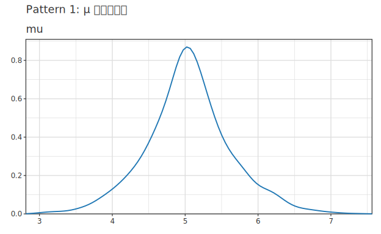
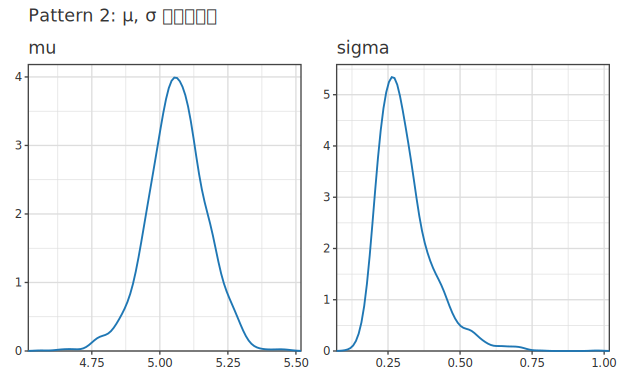
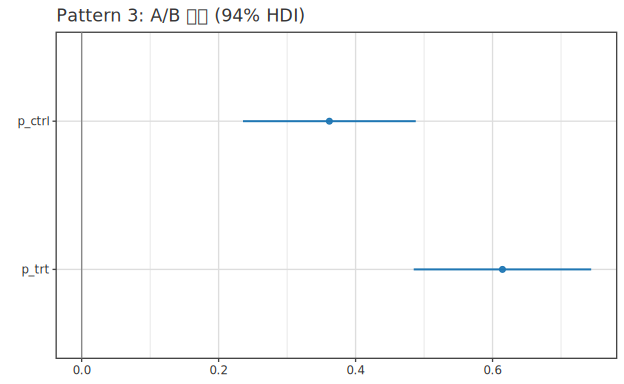
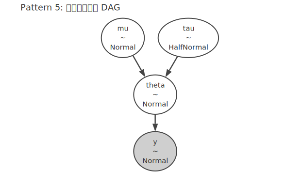
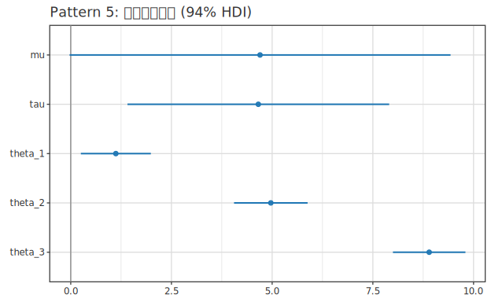
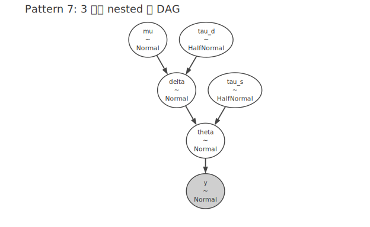
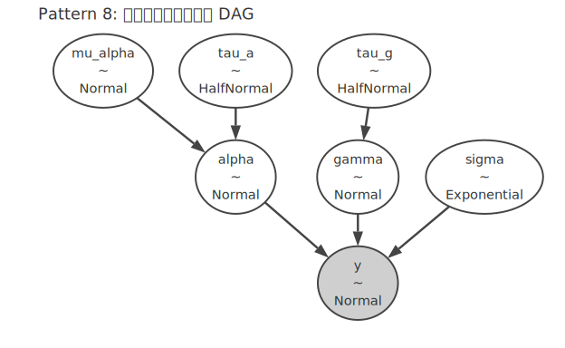
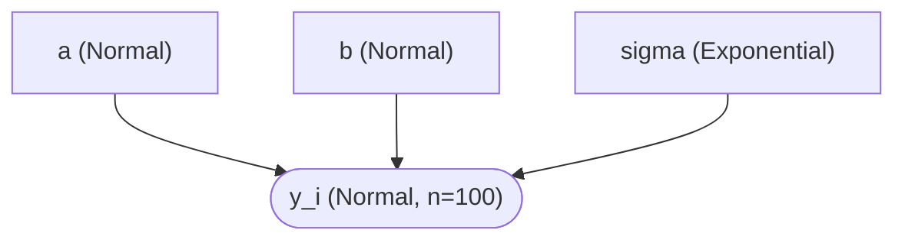
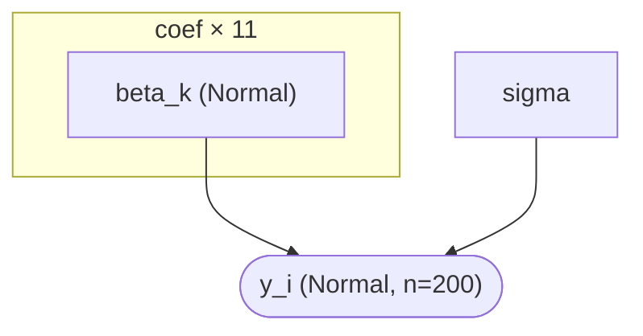
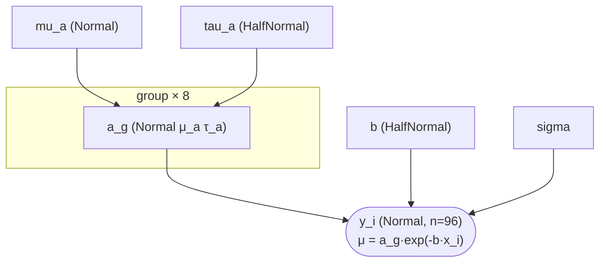

# Probabilistic programming DSL (Hanalyze.Model.HBM)

> 🌐 **English** | [日本語](02-probabilistic-model.ja.md)

> Related demos:
> - [`hbm-example`](../../demo/bayesian/HBMExample.hs) — hierarchical normal model + 4-chain NUTS
> - [`hbm-regression`](../../demo/bayesian/HBMRegressionDemo.hs) — Bayesian simple regression (HTML report via legacy `Hanalyze.Viz.AnalysisReport`)
> - [`clinical-trial`](../../demo/bayesian/ClinicalTrial.hs) — Beta-Binomial A/B test
> - [`simpson-paradox`](../../demo/bayesian/SimpsonParadoxDemo.hs) — LM/GLMM/HBM compared on Simpson's example
> - [`hbm-random-slope`](../../demo/bayesian/HBMRandomSlopeDemo.hs) — random-slope extension

## Overview

`Hanalyze.Model.HBM` is a polymorphic probabilistic programming DSL implemented as a
free monad. Models can be written declaratively, similar to Stan or PyMC.

The continuation is polymorphic as `forall a. (Floating a, Ord a, TrackTag a) => Model a r`,
so a single model definition supports **four interpretations**:

| Interpretation | Specialization | Use |
|---|---|---|
| Structural inspection | `a = Double` | `collectNodes`, `describeModel` |
| log joint evaluation | `a = Double` | `logJoint`, `logPrior`, `logLikelihood` |
| AD gradient | `a = ReverseDouble s` (reverse-mode) | `gradAD`, `gradADU` (machine-epsilon precision) |
| Dependency tracking | `a = Track` | `extractDeps`, `buildModelGraph` (auto DAG) |

The samplers (`Hanalyze.MCMC.HMC` / `NUTS` / `Gibbs`) leverage AD gradients and
automatic constraint transforms.

---

## Basic API

```haskell
import Hanalyze.Model.HBM     -- exports Distribution(..), sample, observe

-- Type alias for the polymorphic model
type ModelP r = forall a. (Floating a, Ord a, TrackTag a) => Model a r

-- Declare a latent variable (return value is `a`, used in subsequent sample/observe)
sample  :: Text -> Distribution a -> Model a a

-- Condition on observed data (assumed i.i.d.)
observe :: Text -> Distribution a -> [Double] -> Model a ()

-- Named derived quantity (PyMC `pm.Deterministic`; not part of the log-joint).
-- Rendered as a white rectangle in the model DAG.
deterministic :: Text -> a -> Model a a

-- Named data placeholder (PyMC `pm.Data`); replaceable later via `withData`.
-- A role-suffixed trio:
--   dataNamedX   = predictors. Returned in the model's numeric type `[a]`,
--                  so they go straight into expressions (no `realToFrac`)
--   dataNamedObs = the response. Raw `[Double]` as `observe` expects
--                  (in the DAG, an obs→slot edge is drawn by value-matching
--                   the observe ys = same shape as PyMC's obs→y; see the
--                   caveat in dag-extraction.ja.md, trap 11)
--   dataNamedIx  = discrete group indices as slot-tagged `Ix` (no `round`;
--                  indexing with bs !!! g emits a slot→consumer DAG edge)
-- (`dataNamed` is a synonym of `dataNamedX`, kept for existing code.)
dataNamedX   :: Text -> [Double] -> Model a [a]
dataNamedObs :: Text -> [Double] -> Model a [Double]
dataNamedIx  :: Text -> [Int]    -> Model a [Ix]

-- Index Ix values with the dedicated operator (Phase 60.7). Numeric
-- interpreters cost the same as !!; only the Track (DAG) interpretation
-- injects the slot name as a dependency tag (= PyMC's b0[gid]).
(!!!) :: TrackTag b => [b] -> Ix -> b

-- Wrap a repeated block in a plate "name" of size n. In the DAG the repeated
-- nodes are drawn collapsed inside a rounded box labelled "name (n)" (the count),
-- mirroring PyMC plate notation. `plateI` is sugar for `plate name n (forM [0..n-1] f)`.
plate  :: Text -> Int -> Model a r -> Model a r
plateI :: Text -> Int -> (Int -> Model a r) -> Model a [r]

-- Iterate a data-row list inside a plate (forM / forM_ over a plate; same arg
-- order as forM). The plate size is taken from the list length. `plateForM_ name
-- rows f` folds the common observation loop `plate name (length rows) $ forM_ f rows`:
--   plateForM_ "obs" (zip x y) $ \(xi, yi) -> do
--     mu <- deterministic "mu" (a + b * realToFrac xi)
--     observe "obs" (Normal mu s) [yi]
plateForM  :: Text -> [b] -> (b -> Model a r) -> Model a [r]   -- keeps results
plateForM_ :: Text -> [b] -> (b -> Model a r) -> Model a ()    -- discards (obs-only)

-- Indexed node name (underscore inserted automatically):
--   indexed "theta" 1  ==  "theta_1"   (infix form: "theta" .# 1)
indexed :: Text -> Int -> Text
(.#)    :: Text -> Int -> Text   -- infixl 9, alias of `indexed`
```

See [plate-notation.ja.md](plate-notation.ja.md) for plate semantics and DAG rendering details.

`indexed` / `.#` fold the `T.pack ("theta_" ++ show j)` boilerplate that recurs
when naming per-group nodes in a loop (see the hierarchical patterns below).

The return value of `sample` has type `a` (polymorphic) and can flow into
the distribution parameters of subsequent `sample`/`observe` calls
(equivalent to Stan's `~` syntax).

> **Note**: `ModelP` is a rank-2 type, so a local binding like
> `let m = schoolModel dat` runs into monomorphization issues. Use a
> top-level binding (`m :: ModelP () ; m = schoolModel dat`) or inline the
> call site.

---

## Available distributions

```haskell
data Distribution a
  = Normal      a a       -- Normal(μ, σ)    — continuous, ℝ
  | Binomial    Int a     -- Binomial(n, p)  — discrete, [0, n]
  | Poisson     a         -- Poisson(λ)      — discrete, non-negative integers
  | Exponential a         -- Exponential(λ)  — continuous, positive
  | Gamma       a a       -- Gamma(α, β)     — continuous, positive (rate=β)
  | Beta        a a       -- Beta(α, β)      — continuous, (0,1)
```

Distribution parameters are polymorphic in `a`, so values from another
`sample` can be passed in directly (e.g., `Normal mu sigma` with
`mu, sigma :: a`).

HMC/NUTS automatically map constrained distributions
(Exponential/Gamma → positive, Beta → unit interval) into the unconstrained
space for sampling.

---

## Pattern 1: simple normal model

```haskell
-- μ ~ Normal(0, 10)
-- y_i ~ Normal(μ, σ=2)  (σ known)
normalMean :: [Double] -> ModelP ()
normalMean ys = do
  mu <- sample "mu" (Normal 0 10)
  observe "y" (Normal mu 2) ys
```

Posterior of `mu` (`marginalsOf`):



---

## Pattern 2: constrained parameter (σ unknown)

```haskell
-- μ ~ Normal(0, 10)
-- σ ~ Exponential(1)   ← HMC/NUTS uses log transform to enforce positivity
-- y_i ~ Normal(μ, σ)
normalUnknownSigma :: [Double] -> ModelP ()
normalUnknownSigma ys = do
  mu    <- sample "mu"    (Normal 0 10)
  sigma <- sample "sigma" (Exponential 1)
  observe "y" (Normal mu sigma) ys
```

Posteriors of `mu` and `sigma` (`marginalsOf`):



---

## Pattern 3: A/B test (Beta-Binomial)

```haskell
-- p_ctrl ~ Beta(1,1),  y_ctrl ~ Binomial(50, p_ctrl), recover k_ctrl=18
-- p_trt  ~ Beta(1,1),  y_trt  ~ Binomial(50, p_trt),  recover k_trt =31
clinicalModel :: ModelP ()
clinicalModel = do
  pCtrl <- sample "p_ctrl" (Beta 1 1)
  pTrt  <- sample "p_trt"  (Beta 1 1)
  observe "y_ctrl" (Binomial 50 pCtrl) [18]
  observe "y_trt"  (Binomial 50 pTrt)  [31]
```

Posterior intervals of the two rates (`forestOf`) — the treatment effect is clear
(`p_trt` ≈ 0.61 vs `p_ctrl` ≈ 0.37, intervals barely overlap):



---

## Pattern 4: simple linear regression (per-observation mean)

When the mean differs **per observation** (`μ_i = α + β·x_i`), you cannot pass a
vector to a scalar `Distribution`. Loop over the data with `forM_` and emit one
`observe` per point. Bind the per-point mean with `deterministic` so it appears
in the DAG (`α, β → μ → y`) and is reusable by posterior tooling (`epred` etc.).

```haskell
-- α ~ Normal(0, 10),  β ~ Normal(0, 10),  σ ~ Exponential(1)
-- y_i ~ Normal(α + β·x_i, σ)
regModel :: [Double] -> [Double] -> ModelP ()
regModel xs ys = do
  alpha <- sample "alpha" (Normal 0 10)
  beta  <- sample "beta"  (Normal 0 10)
  sigma <- sample "sigma" (Exponential 1)
  let f x = alpha + beta * realToFrac x       -- `let` is fine inside a do-block
  forM_ (zip xs ys) $ \(x, y) -> do
    mu <- deterministic "mu" (f x)
    observe "y" (Normal mu sigma) [y]
```

`realToFrac` is required because the model is **polymorphic** (`ModelP`):
parameters have the abstract numeric type `a` (the AD/grad interpreter
instantiates it to a dual number, the log-density interpreter to `Double`),
while data are concrete `Double`. Each datum must be lifted into `a` before
combining with `alpha`/`beta`. (The original monomorphic-`Double` DSL did not
need this; the polymorphism that enabled automatic DAG derivation is what
imposes the `realToFrac`.)

For logistic / Poisson regression keep the same shape and swap the likelihood,
e.g. `Bernoulli (invLogit mu)` or `Poisson (exp mu)`.

The posterior fit — data scatter, posterior-mean line and 94% HDI band — can be
visualized through the plot integration via `epred`
(`scatter "x" "y" <> toPlot (epred fit "x" "mu")`):


> Generated by the `plot-integration-demo` executable
> ([`PlotIntegrationDemo.hs`](../../demo-plot/PlotIntegrationDemo.hs)).

---

## Pattern 5: how to write a hierarchical model (per-group)

In a hierarchical model you draw **per-group parameters** from a **global prior**
and condition observations on the per-group parameters. Depending on how the
data is laid out and how you parameterize, there are three idiomatic ways to
write this.

> **Verified**: the sample code in this section (and in patterns 6-8 below)
> has all been built and run via the `phase37-a0-verify` executable

> (`cabal run phase37-a0-verify`, source:
> [`Phase37A0VerifyDemo.hs`](../../demo/bayesian/Phase37A0VerifyDemo.hs)).

The model structure (`dagOf`) and the per-group posteriors with shrinkage
(`forestOf`):





### Form A: data already split per group (`[[Double]]`)

When the data is already a per-group list, loop with `forM_` and place
`sample` (per-group θ_j) and `observe` (observations of group j) inside each
iteration.

```haskell
import Control.Monad (forM_)
import qualified Data.Text as T

-- μ ~ Normal(0, 10)
-- τ ~ HalfNormal(5)        ← Gelman 2006 weakly-informative recommendation (see below)
-- θ_j ~ Normal(μ, τ)       (per-group means)
-- y_ij ~ Normal(θ_j, 1)
schoolModelA :: [[Double]] -> ModelP ()
schoolModelA groupData = do
  mu  <- sample "mu"  (Normal 0 10)
  tau <- sample "tau" (HalfNormal 5)
  forM_ (zip [1::Int ..] groupData) $ \(j, ys) -> do
    theta <- sample (indexed "theta" j) (Normal mu tau)
    observe (indexed "y" j) (Normal theta 1) ys

groupDataA :: [[Double]]
groupDataA =
  [ [1.1, 0.8, 1.3, 1.0]    -- group 1: true mean ≈ 1
  , [4.9, 5.2, 4.7, 5.1]    -- group 2: true mean ≈ 5
  , [9.0, 8.7, 9.3, 8.9]    -- group 3: true mean ≈ 9
  ]
```

The latent names are generated dynamically as `"theta_1" / "theta_2" / "theta_3"`.
Use `sampleNames` to retrieve them for NUTS initial values or posterior tables.

### Form B: long-format (each observation carries `gid :: Int`)

When you receive long-format data straight out of a DataFrame / SQL
(`gids :: [Int]` + `ys :: [Double]`). **Expand all per-group θ_j up front
with `forM`** and reference them by index at observation time.

```haskell
schoolModelB :: [Int] -> [Double] -> ModelP ()
schoolModelB gids ys = do
  let nG = maximum gids + 1
  mu  <- sample "mu"  (Normal 0 10)
  tau <- sample "tau" (HalfNormal 5)
  thetas <- forM [0 .. nG - 1] $ \j ->
    sample (indexed "theta" j) (Normal mu tau)
  forM_ [0 .. nG - 1] $ \j -> do
    let ysG = [y | (g, y) <- zip gids ys, g == j]
    observe (indexed "y" j)
            (Normal (thetas !! j) 1) ysG

-- Example: same data in long format
gidsB :: [Int]
gidsB = [0,0,0,0, 1,1,1,1, 2,2,2,2]

ysB :: [Double]
ysB = [1.1, 0.8, 1.3, 1.0,  4.9, 5.2, 4.7, 5.1,  9.0, 8.7, 9.3, 8.9]
```

The key point is that `thetas :: [a]` is held as a list and referenced
later via `thetas !! j`. `!!` is O(j) list access but is fine for a small
number of groups (switch to form A or a `Vector` when groups ≫ 100).

### Form C: non-centered parameterization (funnel avoidance)

When there are many groups, or each group has few samples and τ is highly
uncertain, sampling `θ_j ~ Normal(μ, τ)` directly causes **Neal's funnel**
and NUTS will report divergences. Using `nonCenteredNormal` samples
`θ_j_raw ~ Normal(0, 1)` and returns `θ_j = μ + τ · θ_j_raw` as a derived
quantity, avoiding the funnel.

```haskell
import Hanalyze.Model.HBM (nonCenteredNormal)

schoolModelC :: [[Double]] -> ModelP ()
schoolModelC groupData = do
  mu  <- sample "mu"  (Normal 0 10)
  tau <- sample "tau" (HalfNormal 5)
  forM_ (zip [1::Int ..] groupData) $ \(j, ys) -> do
    theta <- nonCenteredNormal (indexed "theta" j) mu tau
    observe (indexed "y" j) (Normal theta 1) ys
```

Only `sample` is replaced by `nonCenteredNormal`; the rest is identical to
form A. Latent names in the chain become `"theta_1_raw"` etc., and the actual
`θ_j` values are recovered (as derived quantities) by
`augmentChainWithDeterministic`.

For details on the principle and measured BFMI improvement, see
[`noncentered-demo`](../../demo/bayesian/NonCenteredDemo.hs).

### Choosing among the three forms

| Situation | Recommended |
|---|---|
| Up to a few dozen groups, data already per-group | **Form A** (straightforward, readable) |
| Long-format DataFrame data, dynamic group count | **Form B** |
| Many groups / small per-group N / NUTS diverges | **Form C** (non-centered) |

---

## Pattern 6: random slope

In addition to the intercept α, **also hierarchize the slope β per group**.
This expresses that the effect of the predictor x differs between groups
(e.g. avoiding Simpson's paradox).

```haskell
-- y_ij ~ Normal(α_j + β_j · x_ij, σ)
-- α_j ~ Normal(μ_α, τ_α)
-- β_j ~ Normal(μ_β, τ_β)
randomSlope :: [[(Double, Double)]] -> ModelP ()
randomSlope groupData = do
  muA  <- sample "mu_alpha"  (Normal 0 10)
  tauA <- sample "tau_alpha" (HalfNormal 5)
  muB  <- sample "mu_beta"   (Normal 0 5)
  tauB <- sample "tau_beta"  (HalfNormal 5)
  sig  <- sample "sigma"     (Exponential 1)
  forM_ (zip [1::Int ..] groupData) $ \(j, pts) -> do
    alpha <- sample (indexed "alpha" j) (Normal muA tauA)
    beta  <- sample (T.pack ("beta_"  ++ show j)) (Normal muB tauB)
    forM_ pts $ \(x, y) ->
      observe (indexed "y" j)
              (Normal (alpha + beta * realToFrac x) sig) [y]
```

Hierarchizing only the intercept (α_j hierarchical + shared β) gives a
**random intercept model in form A**; hierarchizing the slope too gives a
**random intercept + random slope** model. For a WAIC / LOO comparison of
the two, see [`hbm-random-slope`](../../demo/bayesian/HBMRandomSlopeDemo.hs).

---

## Pattern 7: 3-level nested model (district → school → students)

When the hierarchy is **nested**, like schools inside districts and
students inside schools. The intermediate level (school) prior mean comes
from the upper level (district).

```haskell
-- μ        ~ Normal(0, 10)
-- τ_d, τ_s ~ HalfNormal(5)
-- δ_d ~ Normal(μ, τ_d)        (district effect)
-- θ_{d,s} ~ Normal(δ_d, τ_s) (school effect, τ_s shared across districts)
-- y_{d,s,i} ~ Normal(θ_{d,s}, 1)
multiLevel :: [[[Double]]] -> ModelP ()
multiLevel byDistrict = do
  mu  <- sample "mu"    (Normal 0 10)
  tD  <- sample "tau_d" (HalfNormal 5)
  tS  <- sample "tau_s" (HalfNormal 5)
  forM_ (zip [1::Int ..] byDistrict) $ \(d, schools) -> do
    delta <- sample (indexed "delta" d) (Normal mu tD)
    forM_ (zip [1::Int ..] schools) $ \(s, ys) -> do
      theta <- sample (T.pack (concat ["theta_", show d, "_", show s]))
                      (Normal delta tS)
      observe (T.pack (concat ["y_", show d, "_", show s]))
              (Normal theta 1) ys
```

Three-level nested structure (`dagOf`) — `μ → δ_d → θ_{d,s} → y`, with `τ_s`
shared across districts:



Input is a 3-deep list of district → school → observations. For a
long-format version, take `[(districtId, schoolId, y)]` and, as in form B,
pre-expand the latents for all `(d, s)` combinations with `forM`.

---

## Pattern 8: crossed random effects

A design where school s and year t are **crossed** (every (s, t) pair is
observed). Unlike the nested case, the school effect and the year effect
each have their own independent prior.

```haskell
-- α_s ~ Normal(μ_α, τ_α)   (school effect)
-- γ_t ~ Normal(0,    τ_γ)  (year effect; absorb global mean into α_s)
-- y_{s,t,i} ~ Normal(α_s + γ_t, σ)
crossed :: Int -> Int -> [(Int, Int, Double)] -> ModelP ()
crossed nS nT obs = do
  muA <- sample "mu_alpha" (Normal 0 10)
  tA  <- sample "tau_a"    (HalfNormal 5)
  tG  <- sample "tau_g"    (HalfNormal 5)
  sig <- sample "sigma"    (Exponential 1)
  alphas <- forM [0 .. nS - 1] $ \s ->
    sample (indexed "alpha" s) (Normal muA tA)
  gammas <- forM [0 .. nT - 1] $ \t ->
    sample (indexed "gamma" t) (Normal 0 tG)
  forM_ obs $ \(s, t, y) ->
    observe (T.pack (concat ["y_", show s, "_", show t]))
            (Normal (alphas !! s + gammas !! t) sig) [y]
```

Crossed-effects structure (`dagOf`) — every `y_{s,t}` has two parents
`α_s` and `γ_t` (no nesting):



By convention `α_s` has mean `μ_α` and `γ_t` has mean 0 (to keep the
identifiability of the global mean). In lme4 notation this corresponds to
`y ~ 1 + (1 | school) + (1 | year)`.

---

## Pattern 9: choosing the prior for the group-level τ (prior choice)

The single design decision with the largest impact in a hierarchical model
is the **prior on the group-level SD (τ)**. Following Gelman 2006's
weakly-informative recommendation, the usual order is:

| Prior | Characteristics | When to use |
|---|---|---|
| `HalfNormal(s)` | Light tails, mass concentrated near 0 | **First choice**. Prior SD = s for τ expresses the size of between-group variation |
| `HalfCauchy(s)` | Heavy tails, allows large τ | When the number of groups is small (J ≤ 5) and you don't want to over-shrink τ |
| `Exponential(λ)` | Mean 1/λ via rate λ | Simple; tails are heavier than HalfNormal though |
| `InverseGamma(α, β)` | Legacy "non-informative" convention | **Discouraged**. IG(0.001, 0.001) has pathological prior mean/variance and strongly distorts the posterior with small J (Gelman 2006) |

Examples of how to choose in practice:

```haskell
-- Recommended: HalfNormal(5) — between-group SD assumed roughly in 0-10
tau <- sample "tau" (HalfNormal 5)

-- Few groups and want to allow large τ: HalfCauchy(2.5)
tau <- sample "tau" (HalfCauchy 2.5)

-- Prefer simplicity: Exponential
tau <- sample "tau" (Exponential 0.2)   -- mean 5
```

For the group-mean level `μ`, `Normal(0, large SD)` is a safe default
(`Normal 0 10` ~ `Normal 0 100` scaled to the data). An SD much larger
than the observation scale can cause trouble for NUTS step-size adaptation.

> Reference: Gelman A. (2006) "Prior distributions for variance parameters in
> hierarchical models", Bayesian Analysis 1.

---

## Structured observes and automatic fast paths (Phase 54-56)

The per-draw cost of NUTS is dominated by the observation likelihood and its
gradient. Phase 54 added **observe primitives that keep the linear-predictor
structure** and a **compile step that puts hand-written per-observation models
on a fast path automatically**; Phase 55 extended the coverage to **non-Gaussian
GLMs (Poisson/Bernoulli), σ expressions (including heteroscedastic), and mixed
expression shapes**; Phase 56 extended the observation families to **16 in
total** (table below). None of this changes the numerical meaning (agreement
with the plain walk to 1e-9 is covered by tests) — only the speed.

The headline first: **hand-written per-obs models like Patterns 4-6 get fast
as-is**. When `gradADU` is compiled, the model is statically analyzed once;
detected structures ride closed-form / vectorized kernels, and only undetected
structures fall back to the plain AD walk. "Seen through M1-M8" below shows
what rides; "Writing styles that fall off the fast path" shows what doesn't.

### Structured linear-predictor observe (`observeLM` / `observeLMR`)

Declare all n rows of a linear predictor η = Xβ (+ group effects) as **one
node**, design matrix included (the same idiom as writing
`y ~ N(Xβ + u[gid], σ)` vectorized in PyMC/Stan):

```haskell
observeLM  :: Text -> [Text] -> [[Double]] -> LMFamily -> [Double] -> ModelP ()
observeLMR :: Text -> [Text] -> [[Double]] -> [REff] -> LMFamily -> [Double] -> ModelP ()

-- Random-effect term (gather): u names / per-row group id / prior scale name / per-row weights
data REff = REff [Text] [Int] (Maybe Text) (Maybe [Double])
```

- `LMFamily = LMGaussian σname | LMPoisson | LMBernoulli`. β / u / σ refer **by
  name** to latents declared with `sample` (one observation node in the DAG;
  parents = β + u + σ).
- When the `REff` scale name is `Just τname` (i.e. the prior is `Normal(0, τ)`),
  the u-prior gradient is computed analytically. Weights `Just ws` are for
  random slopes (η_i += w_i·u_{g_i}, Phase 54.10); `Nothing` means all-ones
  (random intercept).
- First-class helpers avoid string indices and `!!` for group effects:

  ```haskell
  u <- reNormal "u" nG "tau_u" tau            -- declares u_j ~ Normal(0, tau), nG of them
  observeNormalLM "y" designX ["a", "b"] [u `at` gids] "sigma" ys
  ```

- `glmmRandomIntercept` uses this path internally (public API unchanged).
- ⚠The closed-form kernels for `observeLM` blocks target the **Gaussian
  identity link** (`LMPoisson`/`LMBernoulli` `observeLM` can be written
  structurally, but their likelihood is evaluated on the plain path). However,
  **per-obs scalar `observe (Poisson λ)` / `observe (Bernoulli p)` are absorbed
  by the Phase 55.4 vector-expression IR** (M7/M8 below).

### Seen through M1-M8: which writing style rides which path

The performance benchmark (`bench/haskell/BenchHBMScaling.hs`, same models and
data as PyMC) uses M1-M8 as worked examples of writing style → detected
structure → path. **Everything except M2 is hand-written per-obs**, and all
models ride a fast path automatically. Per-draw measurements live in
`bench/results/HBM_SCALING.md` (HS/PyMC ratios: M1 0.08× / M2 0.23× / M3 0.30× /
M4 0.33× / M5 0.52× / M6 0.50× / M7 0.60× — **faster than PyMC up to here**;
M8 1.04× is roughly on par, M9_negbin 1.48× favors PyMC per-draw (the total
favors HS via fixed costs), and only M6 is a short-grid lower-bound estimate).

> The DAGs below are plate-collapsed conceptual views. The raw
> `buildModelGraph` output of a per-obs model enumerates n separate `y_i`
> nodes (the `plate` helper + `collapseIndexedPlateNodes` produce the same
> collapsed rendering). The `observeLMR` family really is one observation node.

#### M1: pooled simple regression (n=100) — affine auto-synthesis

```haskell
m1Model xs ys = do
  a <- sample "a"     (Normal 0 10)
  b <- sample "b"     (Normal 0 10)
  s <- sample "sigma" (Exponential 1)
  forM_ (zip3 [0..] xs ys) $ \(i, x, y) ->
    observe (indexed "y" i) (Normal (a + b * realToFrac x) s) [y]
```



μ = a + b·x is **affine in a, b** → the Phase 54.8 affine tracker (`AffV`)
auto-synthesizes all 100 `Observe`s into one Gaussian LM block (β=[a,b],
X=[[1,x_i]]) with closed-form gradients (∂β = Xᵀr/σ²). The a/b/σ priors are
constant-parameter priors with analytic gradients → **the AD walk disappears
entirely** (per-draw 0.017ms, ×75).

#### M2: hierarchical random intercept (n=96, nG=8) — helper = one observeLMR node

```haskell
m2Model xRows gids ys = glmmRandomIntercept GlmmGaussian xRows gids ys
-- internally: u <- reNormal "u" nG "tau_u" tau
--             observeNormalLM "y" xRows ["beta_0","beta_1"] [u `at` gids] "sigma" ys
```


The observation is **one node** from the start (`observeLMR`). The `REff` scale
name `Just "tau_u"` puts the u-prior gradient on the analytic path
(∂u_j = -u_j/τ²). A hand-written `us !! g` version (same shape as M3 below) is
promoted to the same REff gather by the 54.8 **one-hot family detection**
(coefficient 1 + shared `Normal(0,τ)` prior + exactly one per row).

#### M3: random intercept + slope (hand-written per-obs) — weighted gather (54.10)

```haskell
m3Model xs gids ys = do
  b0 <- sample "beta_0" (Normal 0 5)
  b1 <- sample "beta_1" (Normal 0 5)
  tu <- sample "tau_u"  (HalfNormal 5)
  tv <- sample "tau_v"  (HalfNormal 5)
  us <- mapM (\j -> sample (indexed "u" j) (Normal 0 tu)) [0 .. nG-1]
  vs <- mapM (\j -> sample (indexed "v" j) (Normal 0 tv)) [0 .. nG-1]
  s  <- sample "sigma" (Exponential 1)
  forM_ (zip3 [0..] (zip xs gids) ys) $ \(i, (x, g), y) ->
    observe (indexed "y" i)
      (Normal (b0 + b1 * realToFrac x + us !! g + (vs !! g) * realToFrac x) s) [y]
```


`us !! g` (coefficient 1) is the same one-hot family as M2. `(vs !! g) * x` has
**coefficient x_i**, which used to leave a dense column plus priors in the AD
walk; the Phase 54.10 **weighted gather** (family condition generalized to
"shared `Normal(0,τ)` prior + exactly one per row, any coefficient"; the
coefficient becomes the per-row `REff` weight) promotes both the u and v
families to gathers → the residual disappears entirely (per-draw
2.52→0.258ms).

#### M4: multi-X pooled (n=200, p=10+intercept) — dense β columns

```haskell
m4Model xRows ys = do
  bs <- mapM (\k -> sample (indexed "beta" k) (Normal 0 5)) [0 .. 10]
  s  <- sample "sigma" (Exponential 1)
  let (b0 : bks) = bs
  forM_ (zip3 [0..] xRows ys) $ \(i, xr, y) ->
    observe (indexed "y" i)
      (Normal (b0 + sum (zipWith (\b x -> b * realToFrac x) bks xr)) s) [y]
```



Everything is affine → the 11 β's simply become **dense design columns** of the
LM block (no family condition needed). Same fully-analytic path as M1 — an
example that hand-written `sum (zipWith …)` is still readable as long as it is
affine.

#### M5: parameter-nonlinear (n=100) — vector-expression IR (54.11)

```haskell
m5Model xs ys = do
  a <- sample "a" (Normal 0 10)
  b <- sample "b" (HalfNormal 2)
  c <- sample "c" (Normal 0 10)
  s <- sample "sigma" (Exponential 1)
  forM_ (zip3 [0..] xs ys) $ \(i, x, y) ->
    observe (indexed "y" i)
      (Normal (a * exp (negate b * realToFrac x) + c) s) [y]
```


μ = a·exp(-b·x)+c is **non-affine**, so 54.8 cannot detect it. The Phase 54.11
**vector-expression IR** rides instead: a symbolic scalar expression is fed
through the walk, the 100 per-row μ expressions are checked to have **the same
shape** (only the data x_i differs), the x_i's are bundled into a vector leaf,
and μ⃗ = a·exp(-b·x⃗)+c is lifted to column operations whose gradient is
evaluated on the vector-op tape (`Hanalyze.Model.HBM.VecAD`). Per-draw
3.59→0.296ms. The PyMC ratio was settled at **0.52×** with an
extended-iteration (25600) same-session comparison (on the short grid PyMC's
per-draw was buried in fixed cost, R²=0.13, and could not be compared).

#### M6: hierarchical × nonlinear (n=96, nG=8) — IR with the family prior on board

```haskell
m6Model xs gids ys = do
  muA  <- sample "mu_a"  (Normal 0 10)
  tauA <- sample "tau_a" (HalfNormal 2)
  as   <- mapM (\j -> sample (indexed "a" j) (Normal muA tauA)) [0 .. nG-1]
  b    <- sample "b" (HalfNormal 2)
  s    <- sample "sigma" (Exponential 1)
  forM_ (zip3 [0..] (zip xs gids) ys) $ \(i, (x, g), y) ->
    observe (indexed "y" i)
      (Normal ((as !! g) * exp (negate b * realToFrac x)) s) [y]
```



The hardest case: a **per-group latent `as !! g`** inside a nonlinear μ. The
IR's shape unification lifts the position whose latent name differs per row
into a **family gather** (a⃗[g_i]), and additionally puts the hierarchical
prior of a_g (all members sharing a structurally identical
`Normal(mu_a, tau_a)`) on the same IR as a **vectorized prior density**
(-nG·log τ - Σ(a_j-μ_a)²/(2τ²)) — without this, the nG prior terms of a_g
would stay in the AD walk and cap the speedup. Per-draw 2.46→0.274ms, PyMC
ratio 0.50×.

#### M7/M8: GLMs (Poisson / logistic regression) — per-family density nodes (55.4)

```haskell
m7Model xs ys = do                               -- y_i ~ Poisson(exp(a + b·x_i))
  a <- sample "a" (Normal 0 5)
  b <- sample "b" (Normal 0 5)
  forM_ (zip3 [0..] xs ys) $ \(i, x, y) ->
    observe (indexed "y" i) (Poisson (exp (a + b * realToFrac x))) [y]

m8Model xs ys = do                               -- y_i ~ Bernoulli(invLogit(a + b·x_i))
  ...observe (indexed "y" i)
       (Bernoulli (1 / (1 + exp (negate (a + b * realToFrac x))))) [y]
```

Non-Gaussian scalar observes ride the vector-expression IR since Phase 55.4.
λ⃗ and p⃗ are lifted to column operations as the **whole expression including
the link** (exp / invLogit are IR ops), and only the observation density is a
hand-built per-family node (Poisson: Σ(y·logλ - λ) with Σlog y! precomputed at
compile time / Bernoulli: Σ(y·log p + (1-y)·log(1-p)) with the 0/1 outcomes
folded into constant coefficients). Hierarchical GLMs (λ = exp(b0 + u_g)) ride
with the same family gather + family prior as M6. Per-draw M7 0.842→0.094ms
(×9.0, PyMC ratio 0.60×) / M8 0.761→0.152ms (×5.0, 1.04× ≈ on par). The σ-side
extension (55.3) is part of the same framework: **σ as a scalar expression
(`2*s`) or row-dependent (`exp(g0+g1·z_i)`, heteroscedastic) is also absorbed**
(the latter with the vectorized density -Σlogσ_i - Σr_i²/(2σ_i²)).

#### Extended observation families (Phase 56) — 16 in total + symbolic differentiation

In Phase 56 the observation densities became **IR expressions (`densityIR`)**,
and their derivatives are generated at compile time by **symbolic reverse-mode**
(a static instruction list with SSA + structural CSE; per-call work is just a
forward/backward pass over an unboxed arena). Adding a distribution no longer
requires any gradient code, and the supported families grew to **16**:

| Group | Families (absorption conditions) |
|---|---|
| Location-scale | Normal, **StudentT (constant ν only — latent ν falls back)**, Cauchy, Logistic, Gumbel — μ/σ arbitrary expressions, row-dependent σ allowed |
| Positive | Exponential (arbitrary rate expression), Weibull (latent k allowed), LogNormal, Gamma (latent α allowed) |
| (0,1) | Beta (both parameters arbitrary expressions, e.g. the α=μφ, β=(1-μ)φ regression form) |
| Discrete | Poisson, Bernoulli, Binomial (constant n), Geometric, NegativeBinomial (latent α allowed) |

- Families with lgamma terms (latent parameters of Gamma/Beta/NegBin) absorb
  `lgamma` as a unary IR op (its derivative is the term-wise derivative of the
  evaluation function `lgammaApprox`, matching the walk to 1e-9).
- Per-call gradient improvement vs the walk: **×7.6 (Bernoulli) to ×68 (Gamma)**
  (`bench-hbm-dist`, n=100 canonical regression forms; propagation to per-draw
  is unmeasured except for M9).
- Representative bench **M9_negbin** (y ~ NegBin(exp(a+b·x), α), latent α):
  confirmed per-draw (long grid) HS 0.366ms vs PyMC 0.247ms = **1.48× (HS
  slower)**, posteriors agree. At practical lengths the total favors HS because
  PyMC's compile+tune fixed cost is ~2.5s (iter1600: 0.69s vs 2.80s). Details
  in the Phase 56 section of `bench/results/HBM_SCALING.md`.

### Writing styles that fall off the fast path (slow, but still correct)

The automatic detection requires: **a scalar `Observe` whose distribution is
one of the 16 families in the table above (parameters are arbitrary
expressions, subject to the parenthesized conditions), and all rows in the same
group (family + σ expression + shape) having expressions of the same shape**
(the former restrictions — σ as a single latent only, whole-group drop on mixed
shapes, Gaussian only — were lifted in Phase 55.2-55.4; Phase 56 widened the
families to 16). Falling off **still works correctly via the fallback** (it is
just slower). Typical ways to fall off, and fixes:

```haskell
-- (1) Value-dependent branch: an expression that changes with a latent's value
--     aborts detection (poison safety net)
let mu = if a > 0 then exp a else negate a       -- ✗ whole model falls back
observe "y" (Normal mu s) [y0]
-- → rewrite branch-free if possible (abs/tanh etc. are supported IR ops);
--   if not, leave it — correctness is unaffected

-- (2) Potential / observes of unsupported distributions are not absorbed
potential "penalty" (negate (a * a))             -- residual walk remains
observe "t" (AsymmetricLaplace s 0.5 mu) [0.3]   -- likewise (outside the 16 families)
nu <- sample "nu" (Exponential 0.1)
observe "r" (StudentT nu mu s) [0.3]             -- StudentT with latent ν, likewise
-- → the supported part of the likelihood is still absorbed, but the AD-walk
--   overhead remains (partial absorption)

-- (3) Groups containing out-of-domain observations (Poisson y < 0 /
--     Bernoulli y ∉ {0,1} / Gamma, Weibull y ≤ 0 / Beta y ∉ (0,1), etc.)
--     are not absorbed (the walk's -∞ is kept as-is, prioritizing detection
--     of bad data)
```

The family-prior condition (the M6 case) is analogous: all members must share a
**structurally identical** `Normal(m, τ)` whose m/τ do not reference the
members themselves (an AR(1)-style chain `a_j ~ Normal(a_{j-1}·ρ, τ)` is not a
family and falls back).

### Safety nets (why "automatic" is safe)

- **Poison**: if the detection walk hits a comparison on a latent value (a
  value-dependent branch), the whole detection is discarded and the model falls
  back.
- **2-point probe**: the log-density of the synthesized fast path is checked
  against the original walk evaluation at two parameter points; any mismatch
  beyond 1e-9 falls back.
- When a detection is used, value/gradient agreement with the plain AD and
  central differences is covered by tests (the Phase 54.8/54.10/54.11 blocks in
  `test/Spec.hs`).

---

## Saving derived quantities (`deterministic`) — PyMC `pm.Deterministic` equivalent

You can declare named **derived quantities** (precision, log-transform,
signal-to-noise ratio, etc.) computed from sampled latents, and inject them
into the posterior chain. They do not contribute to the log-joint, so the
model density is unaffected.

```haskell
import Hanalyze.Model.HBM (deterministic, augmentChainWithDeterministic)

modelWithDerived :: ModelP ()
modelWithDerived = do
  mu  <- sample "mu"    (Normal 0 5)
  sig <- sample "sigma" (HalfNormal 2)
  -- Derived quantities (computed values, not samples)
  _ <- deterministic "tau"       (1 / (sig * sig))   -- precision
  _ <- deterministic "log_sigma" (log sig)
  _ <- deterministic "snr"       (mu / sig)          -- signal-to-noise
  observe "y" (Normal mu sig) ys
```

After sampling, applying `augmentChainWithDeterministic` once evaluates the
derived quantities at every posterior draw and adds them to the `Chain`
**indistinguishably from latents**:

```haskell
let rawCh = nutsPure modelWithDerived cfg initParams 42   -- pure & reproducible
    ch    = augmentChainWithDeterministic modelWithDerived rawCh
printPosteriorSummary ["mu", "sigma", "tau", "log_sigma", "snr"] [ch]
```

Derived quantities flow through `posteriorSummaryFile` /
`tracePlotHDIFile` / `secMCMCDiagnostics` etc. with no special handling
(they appear in tables/traces alongside latents).
Demo: [`deterministic-demo`](../../demo/bayesian/DeterministicDemo.hs).

> **PyMC mapping**: `tau = pm.Deterministic("tau", 1/sig**2)` ↔
> `_ <- deterministic "tau" (1/(sig*sig))`. The return value can be
> discarded (`_ <-`) or used in subsequent expressions.

---

## Data placeholders (`dataNamedX` / `withData`) — PyMC `pm.Data` equivalent

Used when switching between train/test data, or reusing the same model
structure with different observations. A named `[Double]` is embedded in
the model definition and can be replaced later with `withData`.

```haskell
import Hanalyze.Model.HBM (dataNamedX, dataNamedObs, withData)

m :: ModelP ()
m = do
  ys  <- dataNamedObs "y" trainY     -- default value is the training data
  mu  <- sample "mu"    (Normal 0 5)
  sig <- sample "sigma" (HalfNormal 2)
  observe "y" (Normal mu sig) ys
```

`dataNamedObs` is the **observation (response) view** of the slot: it returns
the raw `[Double]` that `observe` expects. Predictors use `dataNamedX`, whose
values come back in the model's numeric type `[a]` and can enter `mu`
expressions directly (no `realToFrac`; `dataNamed` is a synonym kept for
existing code). Both views may read the same slot name; `withData`
swaps the slot contents for every view at once.

```haskell
-- Training: NUTS on the training data (pure)
let chTrain = nutsPure m cfg initParams 42
-- Posterior predictive check: swap to test data and evaluate log-likelihood
    mTest   = withData "y" testY m
    lp      = logLikelihood mTest psPosterior
```

> **High-level shortcut**: `df |-> hbm defaultHBM m` binds the data-frame columns
> to the model's `dataNamed*` slots (here `"y"`) and runs the pure sampler in one
> verb, returning an `HBMModel` ready for the extractors
> (`forestOf` / `tracesOf` / `ppcOf` / …). The explicit `nutsPure` above is the
> lower-level path. See [../io/04-fit-api.md](../io/04-fit-api.md) and
> [viz-diagnostics.md](viz-diagnostics.md).

`withData` rebuilds the model **while preserving the rank-2 type**
(it traverses each `a` individually under `forall a. ...`, so AD / Track /
Double interpretations all work after substitution). When the same
placeholder appears in multiple places, all occurrences are replaced.

> **PyMC mapping**: `pm.Data("y", train_y)` + `pm.set_data({"y": test_y})`
> ↔ `dataNamedObs "y" trainY` + `withData "y" testY model`. The difference
> is that the hanalyze side is a **pure function that rebuilds the whole
> model** with no global state.

---

## Inspecting model structure

```haskell
-- Get the list of latent variable names
sampleNames :: ModelP r -> [Text]
sampleNames (schoolModel schoolData)
-- ["mu","tau","theta_1","theta_2","theta_3"]

-- Evaluate log densities (for sampler debugging)
logJoint      :: ModelP r -> Params -> Double  -- log p(θ, y)
logPrior      :: ModelP r -> Params -> Double  -- log p(θ)
logLikelihood :: ModelP r -> Params -> Double  -- log p(y | θ)
```

```haskell
import qualified Data.Map.Strict as Map
let ps = Map.fromList [("mu",73),("tau",10),
                       ("theta_1",71.5),("theta_2",86.25),("theta_3",61.75)]
logJoint (schoolModel schoolData) ps  -- ≈ -52.4
```

---

## Auto-extracted model graph

Renders a Mermaid.js DAG into HTML.
Dependencies are **auto-extracted** by AD-style propagation through the
`Track` type, so no edges need to be written by hand.

```haskell
import Hanalyze.Model.HBM      (buildModelGraph, extractDeps)
import Hanalyze.Viz.ModelGraph (renderModelGraph)

-- Auto-build the dependency graph (the DSL's Track type propagates parents per node)
let graph = buildModelGraph (schoolModel schoolData)
renderModelGraph "model.html" "School Model" graph
-- Open in a browser to see the DAG

-- Node-level dependency extraction is also available
extractDeps (schoolModel schoolData)
-- [Node "mu"      LatentN "Normal"      {}
-- ,Node "tau"     LatentN "Exponential" {}
-- ,Node "theta_1" LatentN "Normal"      {"mu","tau"}    -- depends on mu, tau
-- ,Node "y_1"     (ObservedN 4) "Normal" {"theta_1"}    -- depends on theta_1
-- ,...]
```

Passing this `ModelGraph` to `reportGraph` of `Hanalyze.Viz.Report.MCMCReport`
embeds the DAG inside the MCMC report HTML.

---

## Per-observation log-likelihood

Used internally by WAIC / LOO computation (`Hanalyze.Stat.ModelSelect`), but also
callable directly for debugging.

```haskell
perObsLogLiks :: ModelP r -> Params -> [Double]
-- Returns logDensity for each observation of each observe node, flattened
```

```haskell
perObsLogLiks (schoolModel schoolData) ps
-- [-2.1, -2.3, -1.8, -2.0, ...]  (one entry per observation)
```

---

## AD gradients (machine-epsilon precision)

Exact gradients via `Numeric.AD.Mode.Reverse.Double` (reverse-mode; switched
from forward in Phase 53 — one gradient costs ~1 sweep regardless of the
number of parameters).
HMC/NUTS use this internally, so end-users typically don't call it directly.

```haskell
gradAD  :: ModelP r -> [Text] -> [Double] -> [Double]
gradADU :: ModelP r -> [Text] -> [Transform] -> [Double] -> [Double]  -- with constraint transforms

-- Evaluate ∂log p(θ,y) / ∂θ at θ=(1.5, 1.2)
let g = gradAD (normalUnknownSigma obs) ["mu", "sigma"] [1.5, 1.2]
-- Compared to numeric differentiation (central diff h=1e-5), the relative error is ~10⁻¹⁰
```

`gradADU` returns the gradient in the unconstrained space using constraint
transforms (`PositiveT`/`UnitIntervalT`) detected from the priors (used
internally by HMC/NUTS).

Note that `gradADU` is not a naive one-shot AD: it is a closure that statically
analyzes the model once and **compiles it onto closed-form / vectorized
kernels** (Phase 54). Structures it cannot detect automatically fall back to
the plain AD walk, so the user-visible meaning is always "the gradient of
logJoint" (see
[Structured observes and automatic fast paths](#structured-observes-and-automatic-fast-paths-phase-54-56)).

---

## How polymorphic interpretation works

Thanks to the rank-2 type `type ModelP r = forall a. (Floating a, Ord a, TrackTag a) => Model a r`,
specializing the same model definition at different `a` produces multiple
interpretations:

```haskell
-- a = Double           → numeric log joint evaluation
logJoint myModel ps :: Double

-- a = Forward s Double → AD gradient
gradAD myModel names xs :: [Double]

-- a = Track            → automatic dependency graph extraction
extractDeps myModel :: [Node]

-- a = Double (placeholder)
collectNodes myModel  :: [Node]    -- structure only (no dependency info)
```

The `Track` type has a `Floating` instance that propagates a dependency
set `Set Text` through every arithmetic operation. Building
`Normal mu sigma` automatically records "this distribution depends on
`mu` and `sigma`", so `buildModelGraph` can construct the edges
automatically.
