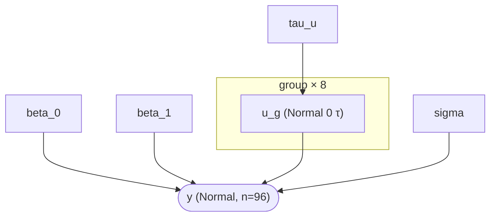
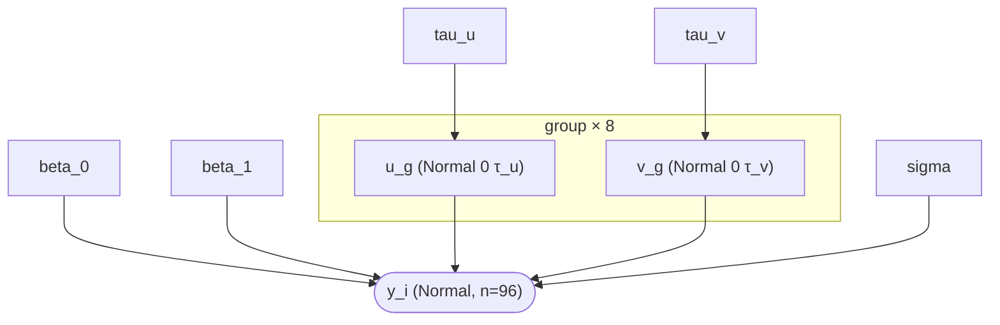
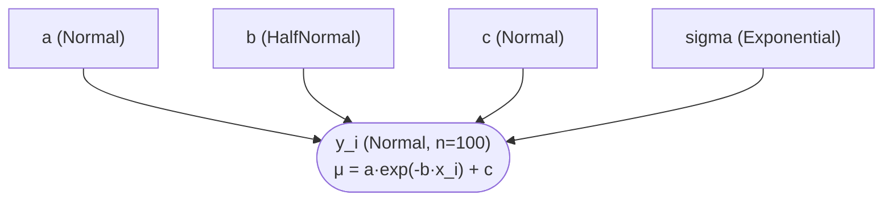

# Probabilistic Programming DSL (Hanalyze.Model.HBM)

> 🌐 **English** | [日本語](02-probabilistic-model.ja.md)

> Related demos:
> - [`hbm-example`](../../demo/bayesian/HBMExample.hs) — hierarchical normal model + 4-chain NUTS
> - [`hbm-regression`](../../demo/bayesian/HBMRegressionDemo.hs) — Bayesian simple regression (with HTML report; via legacy `Hanalyze.Viz.AnalysisReport`)
> - [`clinical-trial`](../../demo/bayesian/ClinicalTrial.hs) — Beta-Binomial A/B test
> - [`simpson-paradox`](../../demo/bayesian/SimpsonParadoxDemo.hs) — Simpson's paradox: LM/GLMM/HBM comparison
> - [`hbm-random-slope`](../../demo/bayesian/HBMRandomSlopeDemo.hs) — random slope extension

## Overview

`Hanalyze.Model.HBM` is a polymorphic probabilistic programming DSL implemented as a Free Monad.
Like Stan or PyMC, you can write models declaratively.

The continuation is polymorphized as `forall a. (Floating a, Ord a, TrackTag a) => Model a r`,
allowing you to extract **4 different interpretations** from a single model definition:

| Interpretation | Specialization | Use |
|---|---|---|
| Structure inspection | `a = Double` | `collectNodes`, `describeModel` |
| log joint evaluation | `a = Double` | `logJoint`, `logPrior`, `logLikelihood` |
| AD gradient | `a = ReverseDouble s` (reverse-mode) | `gradAD`, `gradADU` (machine epsilon precision) |
| Dependency tracking | `a = Track` | `extractDeps`, `buildModelGraph` (automatic DAG extraction) |

Samplers (`Hanalyze.MCMC.HMC`/`NUTS`/`Gibbs`) leverage AD gradients and automatic constraint transformation.

---

## Basic API

```haskell
import Hanalyze.Model.HBM     -- Provides Distribution(..), sample, observe

-- Polymorphic model type alias
type ModelP r = forall a. (Floating a, Ord a, TrackTag a) => Model a r

-- Declare latent variable (return value flows to subsequent sample/observe)
sample  :: Text -> Distribution a -> Model a a

-- Condition on observed data (i.i.d. assumption)
observe :: Text -> Distribution a -> [Double] -> Model a ()

-- Named derived quantity (PyMC `pm.Deterministic`·does not contribute to log-joint).
-- Shown as white rectangles in model DAG.
deterministic :: Text -> a -> Model a a

-- Named data placeholder (PyMC `pm.Data`). Can be replaced later with `withData`.
-- Distinguished by role suffix trio:
--   dataNamedX   = explanatory variable. Returns [a] in model numeric type, flows directly to expression (no realToFrac needed)
--   dataNamedObs = target variable. Returns raw [Double] as required by `observe`
--                  (In DAG, obs→slot edge appears by value match with observe's ys
--                   = PyMC's obs→y isomorphic. Caveat in dag-extraction.md caveat 11)
--   dataNamedIx  = group index etc. discrete values. Carried as slot-named Ix (no rounding needed,
--                  bs !!! g for indexing generates slot→usage edge in DAG)
-- (`dataNamed` is synonym for `dataNamedX`, retained for legacy code)
dataNamedX   :: Text -> [Double] -> Model a [a]
dataNamedObs :: Text -> [Double] -> Model a [Double]
dataNamedIx  :: Text -> [Int]    -> Model a [Ix]

-- Ix indexing uses dedicated operator (Phase 60.7. Numeric interpretation costs same as !!,
-- Track (DAG) interpretation only injects slot name as dependency tag = PyMC's b0[gid] isomorphic)
(!!!) :: TrackTag b => [b] -> Ix -> b

-- Wrap repetition block in plate "name" of size n. In DAG, repeated node is
-- rendered as rounded-corner box labeled "name (n)" (= count) (PyMC plate notation equivalent).
-- `plateI` is syntactic sugar for `plate name n (forM [0..n-1] f)`.
plate  :: Text -> Int -> Model a r -> Model a r
plateI :: Text -> Int -> (Int -> Model a r) -> Model a [r]

-- Iterate over data row list wrapped in plate (plate version of forM / forM_; argument order also matches forM). Plate size is
-- inferred from list length. plateForM_ folds the common observation loop `plate name (length rows) $ forM_ f rows`:
--   plateForM_ "obs" (zip x y) $ \(xi, yi) -> do
--     mu <- deterministic "mu" (a + b * realToFrac xi)
--     observe "obs" (Normal mu s) [yi]
plateForM  :: Text -> [b] -> (b -> Model a r) -> Model a [r]   -- preserve return value
plateForM_ :: Text -> [b] -> (b -> Model a r) -> Model a ()    -- discard (observations only)

-- Indexed node name (underscore is auto-added):
--   indexed "theta" 1  ==  "theta_1"   (infix form: "theta" .# 1)
indexed :: Text -> Int -> Text
(.#)    :: Text -> Int -> Text   -- infixl 9, alternate name for indexed
```

See [plate-notation.md](plate-notation.md) for details on plate semantics and DAG rendering.

`indexed` / `.#` fold the `T.pack ("theta_" ++ show j)` boilerplate that appears frequently
when naming group-specific nodes in loops (see hierarchical pattern below).

The return value of `sample` is of type `a` (polymorphic), flowing directly to the distribution parameters
of subsequent `sample`/`observe` (equivalent to Stan's `~` syntax).

> **Note**: `ModelP` is rank-2 type, so local bindings like `let m = schoolModel dat` can cause
> monomorphism issues. Use top-level bindings (`m :: ModelP () ; m = schoolModel dat`) or
> inline expansion in function calls.

---

## Available Distributions

```haskell
data Distribution a
  = Normal      a a       -- Normal(μ, σ)    — continuous, all reals
  | Binomial    Int a     -- Binomial(n, p)  — discrete, [0,n]
  | Poisson     a         -- Poisson(λ)      — discrete, non-negative integers
  | Exponential a         -- Exponential(λ)  — continuous, positive only
  | Gamma       a a       -- Gamma(α, β)     — continuous, positive only (rate=β)
  | Beta        a a       -- Beta(α, β)      — continuous, (0,1)
```

Distribution parameters are polymorphic `a`, so values from other `sample` can pass through directly
(e.g., `Normal mu sigma` where `mu, sigma :: a`).

HMC/NUTS automatically transform constrained distributions (Exponential/Gamma → positive, Beta → unit interval)
to unconstrained space for sampling.

---

## Pattern 1: Simple Normal Model

```haskell
-- μ ~ Normal(0, 10)
-- y_i ~ Normal(μ, σ=2)  (σ known)
normalMean :: [Double] -> ModelP ()
normalMean ys = do
  mu <- sample "mu" (Normal 0 10)
  observe "y" (Normal mu 2) ys
```

Posterior distribution of `mu` (`marginalsOf`):


---

## Pattern 2: Constrained Parameter (σ Unknown)

```haskell
-- μ ~ Normal(0, 10)
-- σ ~ Exponential(1)   ← HMC/NUTS guarantees positive via log-transform
-- y_i ~ Normal(μ, σ)
normalUnknownSigma :: [Double] -> ModelP ()
normalUnknownSigma ys = do
  mu    <- sample "mu"    (Normal 0 10)
  sigma <- sample "sigma" (Exponential 1)
  observe "y" (Normal mu sigma) ys
```

Posterior distributions of `mu`, `sigma` (`marginalsOf`):


---

## Pattern 3: A/B Test (Beta-Binomial)

```haskell
-- p_ctrl ~ Beta(1,1),  y_ctrl ~ Binomial(50, p_ctrl), k_ctrl=18 recoveries
-- p_trt  ~ Beta(1,1),  y_trt  ~ Binomial(50, p_trt),  k_trt =31 recoveries
clinicalModel :: ModelP ()
clinicalModel = do
  pCtrl <- sample "p_ctrl" (Beta 1 1)
  pTrt  <- sample "p_trt"  (Beta 1 1)
  observe "y_ctrl" (Binomial 50 pCtrl) [18]
  observe "y_trt"  (Binomial 50 pTrt)  [31]
```

Posterior intervals for two groups (`forestOf`) — treatment effect is clear (`p_trt` ≈ 0.61 vs `p_ctrl` ≈ 0.37,
intervals barely overlap):


---

## Pattern 4: Simple Linear Regression (Mean Differs per Observation)

When the mean **differs per observation** (`μ_i = α + β·x_i`), you cannot pass a vector
to scalar `Distribution`. Loop through data with `forM_` and issue `observe` per point. Bind per-point
means with `deterministic` so they appear in the DAG (`α, β → μ → y`) and are reusable from
posterior tools (`epred` etc.).

```haskell
-- α ~ Normal(0, 10),  β ~ Normal(0, 10),  σ ~ Exponential(1)
-- y_i ~ Normal(α + β·x_i, σ)
regModel :: [Double] -> [Double] -> ModelP ()
regModel xs ys = do
  alpha <- sample "alpha" (Normal 0 10)
  beta  <- sample "beta"  (Normal 0 10)
  sigma <- sample "sigma" (Exponential 1)
  let f x = alpha + beta * realToFrac x       -- let inside do block is fine
  forM_ (zip xs ys) $ \(x, y) -> do
    mu <- deterministic "mu" (f x)
    observe "y" (Normal mu sigma) [y]
```

`realToFrac` is required because the model is **polymorphic** (`ModelP`). Parameters have
abstract numeric type `a` (the gradient interpreter uses dual numbers; the log-density interpreter
specializes to `Double`), while data is concrete `Double`. Each data point must be lifted to `a`
before combining with `alpha` / `beta`. (The old monomorphic DSL did not require it.
The polymorphization enabling automatic DAG derivation imposes `realToFrac`.)

Logistic / Poisson regression use the same shape with only the likelihood swapped
(e.g., `Bernoulli (invLogit mu)` / `Poisson (exp mu)`).

Posterior fit (data scatter + posterior mean + 94% HDI band) can be visualized via plot integration's `epred`
(`scatter "x" "y" <> toPlot (epred fit "x" "mu")`):


> Generated by `plot-integration-demo` executable (`PlotIntegrationDemo.hs`, not published).

---

## Pattern 5: Hierarchical Model (by Group) — Writing Style

Hierarchical models draw group-specific parameters from **population-level prior**,
then condition observations on group-specific parameters. How to hold data and choose parameterization yields
3 writing styles.

> **Verification**: All sample code in this section (and following Patterns 6-8) is built + verified
> by `phase37-a0-verify` executable (`cabal run phase37-a0-verify`, source:
> [`Phase37A0VerifyDemo.hs`](../../demo/bayesian/Phase37A0VerifyDemo.hs)).

Model structure (`dagOf`) and posterior of group means with shrinkage visible (`forestOf`):


### Style A: Data is Already Grouped (`[[Double]]`)

When data is at hand as a list of groups, loop with `forM_` and place `sample` (group-specific θ_j)
and `observe` (group j observations) in parallel in each iteration.

```haskell
import Control.Monad (forM_)
import qualified Data.Text as T

-- μ ~ Normal(0, 10)
-- τ ~ HalfNormal(5)        ← Gelman 2006 weakly-informative recommendation (see below)
-- θ_j ~ Normal(μ, τ)       (group-specific mean)
-- y_ij ~ Normal(θ_j, 1)
schoolModelA :: [[Double]] -> ModelP ()
schoolModelA groupData = do
  mu  <- sample "mu"  (Normal 0 10)
  tau <- sample "tau" (HalfNormal 5)
  forM_ (zip [1::Int ..] groupData) $ \(j, ys) -> do
    theta <- sample (indexed "theta" j) (Normal mu tau)
    observe (indexed "y" j) (Normal theta 1) ys

groupDataA :: [[Double]]
groupDataA =
  [ [1.1, 0.8, 1.3, 1.0]    -- group 1: true mean ≈ 1
  , [4.9, 5.2, 4.7, 5.1]    -- group 2: true mean ≈ 5
  , [9.0, 8.7, 9.3, 8.9]    -- group 3: true mean ≈ 9
  ]
```

Latent variable names are dynamically generated as `"theta_1" / "theta_2" / "theta_3"`.
Extract with `sampleNames` for NUTS initialization or posterior summary tables.

### Style B: Long-format (Each Observation Has `gid :: Int`)

When you receive DataFrame / SQL long-format data (`gids :: [Int]` + `ys :: [Double]`),
you want to consume directly. **Expand per-group θ_j first with `forM`**, then reference by index at observation time.

```haskell
schoolModelB :: [Int] -> [Double] -> ModelP ()
schoolModelB gids ys = do
  let nG = maximum gids + 1
  mu  <- sample "mu"  (Normal 0 10)
  tau <- sample "tau" (HalfNormal 5)
  thetas <- forM [0 .. nG - 1] $ \j ->
    sample (indexed "theta" j) (Normal mu tau)
  forM_ [0 .. nG - 1] $ \j -> do
    let ysG = [y | (g, y) <- zip gids ys, g == j]
    observe (indexed "y" j)
            (Normal (thetas !! j) 1) ysG

-- Example: same data as long-format
gidsB :: [Int]
gidsB = [0,0,0,0, 1,1,1,1, 2,2,2,2]

ysB :: [Double]
ysB = [1.1, 0.8, 1.3, 1.0,  4.9, 5.2, 4.7, 5.1,  9.0, 8.7, 9.3, 8.9]
```

The key point is holding `thetas :: [a]` as a list, then referencing `thetas !! j` later.
`!!` is O(j) list access, but fine for small group counts
(switch to Style A or Vector for group count ≫ 100).

### Style C: Non-centered Parameterization (Avoid Funnel)

When groups are many / within-group samples are few and τ uncertainty is large,
directly sampling `θ_j ~ Normal(μ, τ)` triggers **Neal's funnel**, causing NUTS divergence.
Using `nonCenteredNormal` samples `θ_j_raw ~ Normal(0, 1)` and returns `θ_j = μ + τ · θ_j_raw`
as a derived quantity, avoiding the funnel.

```haskell
import Hanalyze.Model.HBM (nonCenteredNormal)

schoolModelC :: [[Double]] -> ModelP ()
schoolModelC groupData = do
  mu  <- sample "mu"  (Normal 0 10)
  tau <- sample "tau" (HalfNormal 5)
  forM_ (zip [1::Int ..] groupData) $ \(j, ys) -> do
    theta <- nonCenteredNormal (indexed "theta" j) mu tau
    observe (indexed "y" j) (Normal theta 1) ys
```

Only `sample` changes to `nonCenteredNormal`; the rest mirrors Style A.
Latent variable names on chain become `"theta_1_raw"` etc., and actual values of `θ_j` are
recovered via `augmentChainWithDeterministic` (treated as derived quantity).

See [`noncentered-demo`](../../demo/bayesian/NonCenteredDemo.hs) for detailed principles
and BFMI improvement measurements.

### Choosing Among 3 Styles

| Situation | Recommended |
|---|---|
| Groups ≤ dozens, data is grouped | **Style A** (straightforward, readable) |
| Long-format from DataFrame, dynamic group count | **Style B** |
| Large group count / small within-group N / NUTS outputs divergence | **Style C** (non-centered) |

### Group Column is String (Categorical) (Phase 41)

The `gid :: Int` in Style B above assumes integer codes, but **DataFrame / ∀LIC∃Code DSL
via HBM** (canvas backend → streaming bridge worker) works directly with **string (categorical)
columns**. The value type of `DataMap` is `data Column = Numeric [Double] | Factor {facLevels, facCodes}` as a sum,
and backend **factor-encodes** string columns (levels are code 0,1,2,… in appearance order) before passing.

- Grouping: `forEachGroup "species"` treats string column as grouping column, with group-specific node names
  receiving **level labels** (e.g., `alpha_setosa`). If level is not a safe identifier
  (whitespace, symbols, numeric prefix), falls back to numeric code suffix.
- Observation: if observation column is categorical, **code (0..K-1)** passes as observation value, binary response
  can observe directly with `Bernoulli`. Multi-level ≥ 3 can observe with `Categorical [probs]` /
  `OrderedLogistic eta [cuts]` (Phase 42, list arguments evaluated as `VList` by interpreter).
- Multi-level response extension (Phase 43): probability vector / cut points can now be **latent-estimated**
  instead of fixed values. Combinator returning `Model a [a]` is bound via **list-value bind**:
  - `cuts <- orderedCuts "cut" 2 (-2) 1` → `OrderedLogistic eta cuts` (cut point estimation,
    `orderedCuts` guarantees increasing)
  - `probs <- dirichlet "pi" [1,1,1]` → `Categorical probs` (Dirichlet prior, simplex via stick-breaking)
  - `softmax` builtin (VList→VList) for `Categorical (softmax [0, b1*x, b2*x])` multinomial logit
    (baseline class η=0 fixed)
  WAIC/PPC internally reconstruct cuts/π from internal latents (`cut_d_*` / `pi_b*`) for evaluation.

See frontend app's HBM modeling language spec for details.
Raw hanalyze monad API (this page's `sample` / `observe`) handles `[Double]` / `Int` as before;
factor encoding is data injection layer responsibility (DSL/backend).

---

## Pattern 6: Random Slope

A form where **not only intercept α, but also slope β is hierarchical per group**. Shows how explanatory variable x
has different effects in each group (e.g., avoiding Simpson's Paradox).

```haskell
-- y_ij ~ Normal(α_j + β_j · x_ij, σ)
-- α_j ~ Normal(μ_α, τ_α)
-- β_j ~ Normal(μ_β, τ_β)
randomSlope :: [[(Double, Double)]] -> ModelP ()
randomSlope groupData = do
  muA  <- sample "mu_alpha"  (Normal 0 10)
  tauA <- sample "tau_alpha" (HalfNormal 5)
  muB  <- sample "mu_beta"   (Normal 0 5)
  tauB <- sample "tau_beta"  (HalfNormal 5)
  sig  <- sample "sigma"     (Exponential 1)
  forM_ (zip [1::Int ..] groupData) $ \(j, pts) -> do
    alpha <- sample (indexed "alpha" j) (Normal muA tauA)
    beta  <- sample (T.pack ("beta_"  ++ show j)) (Normal muB tauB)
    forM_ pts $ \(x, y) ->
      observe (indexed "y" j)
              (Normal (alpha + beta * realToFrac x) sig) [y]
```

With only group-specific intercepts (α_j hierarchy + β shared), this is **random intercept from Style A**.
With slope also hierarchical, it becomes **random intercept + random slope**.
Comparing both with WAIC / LOO: see [`hbm-random-slope`](../../demo/bayesian/HBMRandomSlopeDemo.hs).

---

## Pattern 7: 3-Level Nested (district → school → students)

When hierarchy is nested: schools within districts, students within schools.
The prior mean for an intermediate level (school) comes from the higher level (district).

```haskell
-- μ        ~ Normal(0, 10)
-- τ_d, τ_s ~ HalfNormal(5)
-- δ_d ~ Normal(μ, τ_d)        (district effect)
-- θ_{d,s} ~ Normal(δ_d, τ_s) (school effect, τ_s shared across districts)
-- y_{d,s,i} ~ Normal(θ_{d,s}, 1)
multiLevel :: [[[Double]]] -> ModelP ()
multiLevel byDistrict = do
  mu  <- sample "mu"    (Normal 0 10)
  tD  <- sample "tau_d" (HalfNormal 5)
  tS  <- sample "tau_s" (HalfNormal 5)
  forM_ (zip [1::Int ..] byDistrict) $ \(d, schools) -> do
    delta <- sample (indexed "delta" d) (Normal mu tD)
    forM_ (zip [1::Int ..] schools) $ \(s, ys) -> do
      theta <- sample (T.pack (concat ["theta_", show d, "_", show s]))
                      (Normal delta tS)
      observe (T.pack (concat ["y_", show d, "_", show s]))
              (Normal theta 1) ys
```

3-level nested structure (`dagOf`) — `μ → δ_d → θ_{d,s} → y`, `τ_s` is shared across districts:


Input is a 3-deep list: districts → schools → observations. For long-format, take `[(districtId, schoolId, y)]`,
rewrite like Style B to expand all latents `(d, s)` first, then reference by indexing.

---

## Pattern 8: Crossed Random Effects

Schools s and years t **cross** (every (s, t) pair is observed). Unlike nested, school and year effects
have independent priors.

```haskell
-- α_s ~ Normal(μ_α, τ_α)   (school effect)
-- γ_t ~ Normal(0,    τ_γ)  (year effect, overall mean absorbed into α_s)
-- y_{s,t,i} ~ Normal(α_s + γ_t, σ)
crossed :: Int -> Int -> [(Int, Int, Double)] -> ModelP ()
crossed nS nT obs = do
  muA <- sample "mu_alpha" (Normal 0 10)
  tA  <- sample "tau_a"    (HalfNormal 5)
  tG  <- sample "tau_g"    (HalfNormal 5)
  sig <- sample "sigma"    (Exponential 1)
  alphas <- forM [0 .. nS - 1] $ \s ->
    sample (indexed "alpha" s) (Normal muA tA)
  gammas <- forM [0 .. nT - 1] $ \t ->
    sample (indexed "gamma" t) (Normal 0 tG)
  forM_ obs $ \(s, t, y) ->
    observe (T.pack (concat ["y_", show s, "_", show t]))
            (Normal (alphas !! s + gammas !! t) sig) [y]
```

Crossed (crossed) structure (`dagOf`) — each `y_{s,t}` has 2 parents: `α_s` and `γ_t` (not nested):


The mean of `α_s` is `μ_α` and of `γ_t` is 0 by convention (ensures identifiability of overall mean).
In lme4 notation, this corresponds to `y ~ 1 + (1 | school) + (1 | year)`.

---

## Pattern 9: Choosing Prior for Group-Level τ (Prior Choice)

The most impactful design decision in hierarchical models is the **prior for group-level SD (τ)**.
Following Gelman 2006's weakly-informative recommendation, typically choose in this order:

| Prior | Characteristic | Use |
|---|---|---|
| `HalfNormal(s)` | Light tail, mass concentrated near 0 | **First choice**. τ prior SD = s expresses magnitude of between-group variability |
| `HalfCauchy(s)` | Heavy tail, permits large τ | Small group count (J ≤ 5) when you don't want to strongly suppress τ |
| `Exponential(λ)` | Mean 1/λ via rate λ | Simple, but heavier tail than HalfNormal |
| `InverseGamma(α, β)` | Legacy "non-informative" convention | **Not recommended**. IG(0.001, 0.001) has pathological prior mean/variance, distorts posterior strongly with small group count (Gelman 2006) |

Practical usage example:

```haskell
-- Recommended: HalfNormal(5) — assume between-group SD roughly 0-10 range
tau <- sample "tau" (HalfNormal 5)

-- Small group count, don't want to suppress τ: HalfCauchy(2.5)
tau <- sample "tau" (HalfCauchy 2.5)

-- Simplicity-first: Exponential
tau <- sample "tau" (Exponential 0.2)   -- mean 5
```

For group means like `μ`, a larger-SD `Normal(0, large)` is safe
(`Normal 0 10` ~ `Normal 0 100` depending on scale). Placing SD much larger than observation scale
can cause NUTS step size adaptation trouble.

> Reference: Gelman A. (2006) "Prior distributions for variance parameters in
> hierarchical models", Bayesian Analysis 1.

---

## Pattern 10: Multivariate Normal Response (multi-column observe, Phase 44)

To observe multiple continuous response columns as **a single k-dimensional vector** with correlations,
use `observeMV` instead of scalar `observe`, passing observations as `[[Double]]` (each row is k-vector).
`MvNormal μ Σ` takes full covariance; `MvNormalChol μ σ L` takes scale vector + correlation Cholesky,
internally constructing `Σ = (diag σ · L)(diag σ · L)ᵀ`
(direct scaled Cholesky avoids redecomposition = Stan `multi_normal_cholesky` idiom).

```haskell
-- (1) Estimate mean vector under known Σ (literal full cov)
corrMean :: [[Double]] -> Model Double ()
corrMean ys = do                                    -- ys = [[y1,y2], …]
  mu1 <- sample "mu1" (Normal 0 10)
  mu2 <- sample "mu2" (Normal 0 10)
  observeMV "y" (MvNormal [mu1, mu2] [[1, 0.5], [0.5, 1]]) ys

-- (2) Estimate correlation matrix from LKJ prior (latent Σ, standard Bayesian)
lkjCov :: [[Double]] -> Model Double ()
lkjCov ys = do
  mu1 <- sample "mu1" (Normal 0 10)
  mu2 <- sample "mu2" (Normal 0 10)
  s1  <- sample "s1"  (HalfNormal 1)
  s2  <- sample "s2"  (HalfNormal 1)
  l   <- lkjCorrCholesky "L" 2 2.0       -- correlation Cholesky factor (LKJ(η=2) prior)
  observeMV "y" (MvNormalChol [mu1, mu2] [s1, s2] l) ys
```

`MvNormal` / `MvNormalChol` are **observation-only** (`logDensity = 0`, `sample` not possible).
k-vector observation is `observeMV` flattening via `concat`, and `obsLogSum` re-partitions
by distribution dimension k to compute density. Covariance assumes SPD (non-positive-definite Σ in `MvNormal` yields -∞ density;
`lkjCorrCholesky` path guarantees SPD by construction). Separating σ from correlation allows
independent priors on variance and correlation (BDA3 / Stan manual standard parameterization).

> In ∀LIC∃Code (HBM dialog), write multi-column observation as `observeMV "y" dist [col "y1", col "y2"]`
> (bind variables must be lowercase).

---

## Structured Observe and Automatic Speedup (Phase 54-56)

Per-draw cost in NUTS is dominated by observation likelihood and its gradient. Phase 54 introduced
**observe blocks receiving structure as-is** and **automatic compilation of hand-written per-obs models to fast paths**;
Phase 55 expanded targets to **non-Gaussian GLM (Poisson/Bernoulli)·σ expressions (including heteroscedastic)·mixed expression forms**;
Phase 56 broadened to **16 observation distribution families** (correspondence table below). All maintain
**numerical meaning unchanged** (traditional walk vs. 1e-9 match guaranteed by tests), changing only speed.

Key point first: hand-written models like Patterns 4-6 **speed up automatically**.
At compile time, `gradADU` statically analyzes the model once, maps detected structure to analytic closed forms /
vectorized kernels, falling back to traditional AD walk only for undetected structure.
"M1-M8 view" below shows which examples ride the fast path; "falling off the fast path" shows which don't.

### Structured Linear Predictor Observe (`observeLM` / `observeLMR`)

Declare n-row observation with linear predictor η = Xβ (+ group effects) as **a single node**
(same idiom as `y ~ N(Xβ + u[gid], σ)` in one line in PyMC/Stan):

```haskell
observeLM  :: Text -> [Text] -> [[Double]] -> LMFamily -> [Double] -> ModelP ()
observeLMR :: Text -> [Text] -> [[Double]] -> [REff] -> LMFamily -> [Double] -> ModelP ()

-- Random effects term (gather): latent names / group id per row / prior scale name / per-row weight (optional)
data REff = REff [Text] [Int] (Maybe Text) (Maybe [Double])
```

- `LMFamily = LMGaussian σ-name | LMPoisson | LMBernoulli`. β / u / σ are **name-referenced** latents sampled elsewhere
  (in DAG: single observation node, parents = β + u + σ).
- `REff` scale name `Just τ-name` (= prior `Normal(0, τ)`) means u-prior gradient is computed analytically.
  Weight `Just ws` is for random slope (η_i += w_i·u_{g_i}, Phase 54.10). `Nothing` = all rows 1 (random intercept).
- First-class helpers also exist for group effects without string indexing (no `!! `, strings `u_0` etc.):

  ```haskell
  u <- reNormal "u" nG "tau_u" tau            -- declare nG copies of u_j ~ Normal(0, tau)
  observeNormalLM "y" designX ["a", "b"] [u `at` gids] "sigma" ys
  ```

- `glmmRandomIntercept` internally uses this path (public API unchanged).
- ⚠ Analytic-closed-form kernel from `observeLM` block targets **Gaussian identity-link** only
  (`LMPoisson`/`LMBernoulli` as structure are writable but evaluate via traditional path).
  By contrast **per-obs scalar** `observe (Poisson λ)` / `observe (Bernoulli p)` is absorbed by
  Phase 55.4's vector-form IR (see M7/M8 below).

### M1-M8 View: Which Writing Style Rides Which Path

Performance bench (`bench/haskell/BenchHBMScaling.hs` ↔ PyMC same model, same data) shows
M1-M8 writing style → detected structure → path. **Except M2, all are hand-written per-obs**,
yet all automatically ride fast paths. Per-draw actual: `bench/results/HBM_SCALING.md` (HS/PyMC ratio:
M1 0.08× / M2 0.23× / M3 0.30× / M4 0.33× / M5 0.52× / M6 0.50× / M7 0.60× — all **faster than PyMC**.
M8 1.04× nearly equal; M9_negbin 1.48× is per-draw PyMC advantage (total favors HS by compile+tune overhead);
M6 is short-grid floor baseline).

> The DAGs below are conceptual of plate folding. Actual `buildModelGraph` output of per-obs hand-written
> shows n individual `y_i` nodes (`plate` helper + `collapseIndexedPlateNodes` makes same folded view).
> `observeLMR` family produces single observation node actually.

#### M1: pooled simple regression (n=100) — automatic affine synthesis

```haskell
m1Model xs ys = do
  a <- sample "a"     (Normal 0 10)
  b <- sample "b"     (Normal 0 10)
  s <- sample "sigma" (Exponential 1)
  forM_ (zip3 [0..] xs ys) $ \(i, x, y) ->
    observe (indexed "y" i) (Normal (a + b * realToFrac x) s) [y]
```


μ = a + b·x is **affine in a, b** → Phase 54.8's affine tracking (`AffV`) automatically synthesizes
all 100 `Observe` into single Gaussian LM block (β=[a,b]·X=[[1,x_i]]), gradient analytic (∂β = Xᵀr/σ²).
Prior over a/b/σ treated as constant-parameter priors with analytic gradient
→ **AD walk vanishes entirely** (per-draw 0.017ms·×75).

#### M2: hierarchical random intercept (n=96, nG=8) — helper = single observeLMR node

```haskell
m2Model xRows gids ys = glmmRandomIntercept GlmmGaussian xRows gids ys
-- internally: u <- reNormal "u" nG "tau_u" tau
--             observeNormalLM "y" xRows ["beta_0","beta_1"] [u `at` gids] "sigma" ys
```



Observation is **single node** from start (`observeLMR`). With scale name `Just "tau_u"` in `REff`,
u-prior gradient is also analytic (∂u_j = -u_j/τ²). Hand-writing `us !! g` style (isomorphic to M3 below)
is also detected by 54.8 **one-hot family** (coefficient 1 + shared prior `Normal(0,τ)` + exactly 1 per row)
and promoted to same `REff` gather.

#### M3: random intercept + slope (hand-written per-obs) — weighted gather (54.10)

```haskell
m3Model xs gids ys = do
  b0 <- sample "beta_0" (Normal 0 5)
  b1 <- sample "beta_1" (Normal 0 5)
  tu <- sample "tau_u"  (HalfNormal 5)
  tv <- sample "tau_v"  (HalfNormal 5)
  us <- mapM (\j -> sample (indexed "u" j) (Normal 0 tu)) [0 .. nG-1]
  vs <- mapM (\j -> sample (indexed "v" j) (Normal 0 tv)) [0 .. nG-1]
  s  <- sample "sigma" (Exponential 1)
  forM_ (zip3 [0..] (zip xs gids) ys) $ \(i, (x, g), y) ->
    observe (indexed "y" i)
      (Normal (b0 + b1 * realToFrac x + us !! g + (vs !! g) * realToFrac x) s) [y]
```



`us !! g` (coefficient 1) is same one-hot family as M2. `(vs !! g) * x` is **coefficient = x_i**,
previously was dense column + prior staying in AD walk as intermediate case. Phase 54.10's
**weighted gather** (generalize family condition to "shared prior `Normal(0,τ)` + exactly 1 per row, coefficient arbitrary",
per-row weight added to `REff`) promotes both u and v families to gather
→ residual completely eliminated (per-draw 2.52→0.258ms).

#### M4: multivariate X pooled (n=200, p=10+intercept) — dense β column

```haskell
m4Model xRows ys = do
  bs <- mapM (\k -> sample (indexed "beta" k) (Normal 0 5)) [0 .. 10]
  s  <- sample "sigma" (Exponential 1)
  let (b0 : bks) = bs
  forM_ (zip3 [0..] xRows ys) $ \(i, xr, y) ->
    observe (indexed "y" i)
      (Normal (b0 + sum (zipWith (\b x -> b * realToFrac x) bks xr)) s) [y]
```


All affine → 11 β's just lineup as **dense design column** in LM block (no family condition needed).
Same complete analytic path as M1. Example of "if affine, hand-written `sum (zipWith …)` is also readable".

#### M5: parameter nonlinear (n=100) — vector-form IR (54.11)

```haskell
m5Model xs ys = do
  a <- sample "a" (Normal 0 10)
  b <- sample "b" (HalfNormal 2)
  c <- sample "c" (Normal 0 10)
  s <- sample "sigma" (Exponential 1)
  forM_ (zip3 [0..] xs ys) $ \(i, x, y) ->
    observe (indexed "y" i)
      (Normal (a * exp (negate b * realToFrac x) + c) s) [y]
```



μ = a·exp(-b·x)+c is **non-affine**, so undetected by 54.8. Phase 54.11's
**vector-form IR** kicks in: feed scalar-form IR and walk; detect that all 100 rows of μ expression
have **same shape** (only x_i differs) → gather x_i into vector leaf, lift μ⃗ = a·exp(-b·x⃗)+c to column arithmetic,
gradient via vector-op tape (`Hanalyze.Model.HBM.VecAD`). Per-draw 3.59→0.296ms. PyMC ratio
confirmed **0.52×** in same session with extended iter (25600) (short grid made PyMC per-draw fixed-cost dominated,
R²=0.13, incomparable).

#### M6: hierarchical × nonlinear (n=96, nG=8) — IR + family prior bundled

```haskell
m6Model xs gids ys = do
  muA  <- sample "mu_a"  (Normal 0 10)
  tauA <- sample "tau_a" (HalfNormal 2)
  as   <- mapM (\j -> sample (indexed "a" j) (Normal muA tauA)) [0 .. nG-1]
  b    <- sample "b" (HalfNormal 2)
  s    <- sample "sigma" (Exponential 1)
  forM_ (zip3 [0..] (zip xs gids) ys) $ \(i, (x, g), y) ->
    observe (indexed "y" i)
      (Normal ((as !! g) * exp (negate b * realToFrac x)) s) [y]
```


Hardest case: nonlinear μ with **group-specific latent `as !! g`** mixed in. IR's shape-matching
lifts "per-row different latent name" positions to **family gather** (a⃗[g_i]), further packs hierarchical prior
(all members structurally identical `Normal(mu_a, tau_a)`) as **vectorized prior density**
(-nG·log τ - Σ(a_j-μ_a)²/(2τ²)) into same IR (without this, nG prior terms stay in AD walk, hitting ceiling).
Per-draw 2.46→0.274ms·PyMC ratio 0.50×.

#### M7/M8: GLM (Poisson / logistic regression) — distribution-specific density node (55.4)

```haskell
m7Model xs ys = do                               -- y_i ~ Poisson(exp(a + b·x_i))
  a <- sample "a" (Normal 0 5)
  b <- sample "b" (Normal 0 5)
  forM_ (zip3 [0..] xs ys) $ \(i, x, y) ->
    observe (indexed "y" i) (Poisson (exp (a + b * realToFrac x))) [y]

m8Model xs ys = do                               -- y_i ~ Bernoulli(invLogit(a + b·x_i))
  ...observe (indexed "y" i)
       (Bernoulli (1 / (1 + exp (negate (a + b * realToFrac x))))) [y]
```

Non-Gaussian scalar observe also rides vector-form IR from Phase 55.4. λ⃗ or p⃗
becomes **full expression including link** (exp / invLogit are IR ops too), lifted to column arithmetic,
observation density handled per-distribution custom node (Poisson: Σ(y·logλ - λ) - Σlog y! precomputed / Bernoulli:
0/1 constant-coefficient `Σ(y·log p + (1-y)·log(1-p))`). Hierarchical GLM (λ = exp(b0 + u_g)) uses
same family gather + family prior bundling as M6. Per-draw M7 0.842→0.094ms (×9.0·PyMC ratio 0.60×) /
M8 0.761→0.152ms (×5.0·1.04× = nearly equal). σ extension (55.3) also fits: **σ as scalar expression** (`2*s`)
or row-dependent (`exp(g0+g1·z_i)` = heteroscedastic) is also absorbed (latter: vectorized density
-Σlogσ_i - Σr_i²/(2σ_i²)).

#### Distribution Family Expansion (Phase 56) — 16 families total + symbolic differentiation

Phase 56 made observation density **IR expression** (`densityIR`), gradient via compile-time
**symbolic reverse-mode** (SSA + structural CSE static instruction sequence; per-call: unboxed arena forward/backward only).
New distributions need no gradient code, target distribution count grows to **16 families**:

| Family | Distributions (absorption condition) |
|---|---|
| Location-scale | Normal·**StudentT (ν constant-only·latent falls back)**·Cauchy·Logistic·Gumbel — both μ/σ arbitrary expressions·σ row-dependent possible |
| Positive | Exponential (rate arbitrary expression)·Weibull (k latent possible)·LogNormal·Gamma (α latent possible) |
| (0,1) | Beta (α=μφ, β=(1-μ)φ regression form, both parameters arbitrary expression) |
| Discrete | Poisson·Bernoulli·Binomial (n constant)·Geometric·NegativeBinomial (α latent possible) |

- lgamma support (Gamma/Beta/NegBin latent parameters) is absorbed as unary IR op (gradient via per-term
  derivative of `lgammaApprox` = 1e-9 match to walk).
- Per-call gradient improvement: **×7.6 (Bernoulli) ~ ×68 (Gamma)** over walk
  (`bench-hbm-dist`·n=100 canonical regression form; wave to per-draw unmeasured except M9).
- Representative bench **M9_negbin** (y ~ NegBin(exp(a+b·x), α)·α latent): per-draw confirmed (long grid)
  HS 0.366ms vs PyMC 0.247ms = **1.48× (HS slower)**·posterior matches. Practical total dominated by PyMC compile+tune ~2.5s overhead,
  HS wins (iter1600: 0.69s vs 2.80s). Detail = `bench/results/HBM_SCALING.md` section 56.

### Writing Styles That Fall Off Fast Path (Correct but Slow)

Automatic detection targets "**scalar `Observe`·distribution in above 16-family table (parameters arbitrary expressions,
bracketed conditions apply)·same group (distribution + σ expression + expression form) rows have isomorphic expression shape**"
(Phase 55.2-55.4 dropped σ single-latent limit·dropped shape mix·dropped Gaussian limit; Phase 56 → 16 families).
Falling off still **works correctly** (just slower). Common falloff styles and fixes:

```haskell
-- (1) Value-dependent branch: detection gives up if latent value changes expression form (poison failsafe)
let mu = if a > 0 then exp a else negate a       -- ✗ whole stack falls back
observe "y" (Normal mu s) [y0]
-- → Rewrite to branch-free expressions (abs/tanh etc. are IR-supported if possible).
--   Unrewritable structure stays as-is fine (correctness unchanged).

-- (2) Potential / unsupported distribution observe falls outside absorption target
potential "penalty" (negate (a * a))             -- residual walk remains
observe "t" (AsymmetricLaplace s 0.5 mu) [0.3]   -- same (outside 16-family table)
nu <- sample "nu" (Exponential 0.1)
observe "r" (StudentT nu mu s) [0.3]             -- StudentT with latent ν also unsupported
-- → Supported observation distribution parts are absorbed, AD walk fixed-cost remains (partial absorption)

-- (3) Observation value outside domain (Poisson y < 0 / Bernoulli y ∉ {0,1} / Gamma, Weibull
--     y ≤ 0 / Beta y ∉ (0,1) etc.) in group prevents absorption
--     (retains walk -∞ as-is; data anomaly detection prioritized)
```

Family-prior condition: all members' priors must be **structurally identical** `Normal(m, τ)`,
m/τ not referencing member itself (AR(1) chains like `a_j ~ Normal(a_{j-1}·ρ, τ)` are not families, fallback).

### Safety Net (Why "Automatic" is Still Safe)

- **poison**: If detection walk hits latent value comparison (value-dependent branch), immediately discard
  detection entirely and fallback.
- **probe 2 points**: Synthesized fast-path log-density is spot-checked against raw model walk at
  2 parameter points; if 1e-9 mismatch, fallback.
- When detection result is used, values/gradients match traditional AD and central-difference in tests
  (`test/Spec.hs` Phase 54.8/54.10/54.11 blocks).

---

## Storing Derived Quantities (`deterministic`) — PyMC `pm.Deterministic` Equivalent

**Derived quantities** (precision, log-transforms, signal-to-noise ratio, etc.) computed from sampled
latent variables can be declared name-bound in the model and injected into posterior chain.
Since they don't contribute to log-joint, model density is unaffected.

```haskell
import Hanalyze.Model.HBM (deterministic, augmentChainWithDeterministic)

modelWithDerived :: ModelP ()
modelWithDerived = do
  mu  <- sample "mu"    (Normal 0 5)
  sig <- sample "sigma" (HalfNormal 2)
  -- Derived quantities (computation, not sample)
  _ <- deterministic "tau"       (1 / (sig * sig))   -- precision
  _ <- deterministic "log_sigma" (log sig)
  _ <- deterministic "snr"       (mu / sig)          -- signal-to-noise ratio
  observe "y" (Normal mu sig) ys
```

After sampling, applying `augmentChainWithDeterministic` once evaluates the derived quantities
at each sample and adds them to the `Chain` **treated identically to latents**:

```haskell
let rawCh = nutsPure modelWithDerived cfg initParams 42   -- pure, reproducible
    ch    = augmentChainWithDeterministic modelWithDerived rawCh
printPosteriorSummary ["mu", "sigma", "tau", "log_sigma", "snr"] [ch]
```

Derived quantities flow directly to `posteriorSummaryFile` / `tracePlotHDIFile` / `secMCMCDiagnostics` etc.
(appear alongside latents in tables/traces without distinction).
Demo: [`deterministic-demo`](../../demo/bayesian/DeterministicDemo.hs).

> **PyMC correspondence**: `tau = pm.Deterministic("tau", 1/sig**2)` ↔
> `_ <- deterministic "tau" (1/(sig*sig))`. Return value can be discarded (`_ <-`) or
> threaded to subsequent expressions.

---

## Data Placeholders (`dataNamedX` / `withData`) — PyMC `pm.Data` Equivalent

Use when you want to swap train/test data or re-run the same model structure with different observations.
Embed **named `[Double]`** in model definition, then substitute different values via `withData` later.

```haskell
import Hanalyze.Model.HBM (dataNamedX, dataNamedObs, withData)

m :: ModelP ()
m = do
  ys  <- dataNamedObs "y" trainY     -- default: train data
  mu  <- sample "mu"    (Normal 0 5)
  sig <- sample "sigma" (HalfNormal 2)
  observe "y" (Normal mu sig) ys
```

`dataNamedObs` is the **observation-value (target variable) view** of the slot, returning raw `[Double]`
as required by `observe`. Explanatory-variable side uses `dataNamedX`, returning value in model's
numeric type `[a]`, flowing directly to `mu` expression (no `realToFrac` needed; `dataNamed`
is synonym for `dataNamedX`, kept for legacy code). Reading same slot name in both views is fine;
`withData` substitution is per-slot, so affects all views consistently.

```haskell
-- Train: NUTS on train data (pure)
let chTrain = nutsPure m cfg initParams 42
-- Prediction-time posterior-predictive check: swap to test data, evaluate log-likelihood
    mTest   = withData "y" testY m
    lp      = logLikelihood mTest psPosterior
```

> **High-level shortcut**: `df |-> hbm defaultHBM m` binds DataFrame columns to model
> `dataNamed*` slots (here `"y"`), runs pure sampler in one verb, returning `HBMModel`
> directly passable to extractors (`forestOf` / `tracesOf` / `ppcOf` / …).
> Explicit `nutsPure` path above is lower-level.
> See [../io/04-fit-api.md](../io/04-fit-api.md) and [viz-diagnostics.md](viz-diagnostics.md).

`withData` **preserves rank-2 type** while reconstructing the model (walks each `a` in `forall a. ...` separately,
so AD/Track/Double interpretations all work with substituted data). Multiple placeholders with same name
substitute everywhere if present.

> **PyMC correspondence**: `pm.Data("y", train_y)` + `pm.set_data({"y": test_y})` ↔
> `dataNamedObs "y" trainY` + `withData "y" testY model`.
> Difference: hanalyze side is **pure function rebuilding entire model**,
> holds no global state.

---

## Inspecting Model Structure

```haskell
-- Extract list of latent variable names
sampleNames :: ModelP r -> [Text]
sampleNames (schoolModel schoolData)
-- ["mu","tau","theta_1","theta_2","theta_3"]

-- Evaluate log-density (sampler debugging)
logJoint      :: ModelP r -> Params -> Double  -- log p(θ, y)
logPrior      :: ModelP r -> Params -> Double  -- log p(θ)
logLikelihood :: ModelP r -> Params -> Double  -- log p(y | θ)
```

```haskell
import qualified Data.Map.Strict as Map
let ps = Map.fromList [("mu",73),("tau",10),
                       ("theta_1",71.5),("theta_2",86.25),("theta_3",61.75)]
logJoint (schoolModel schoolData) ps  -- ≈ -52.4
```

---

## Generating Model Graph (Automatic Dependency Extraction)

Visualizes Mermaid.js DAG in HTML.
Dependencies are **automatically extracted** via `Track`-type automatic-differentiation-style propagation,
so no need to write edges manually.

```haskell
import Hanalyze.Model.HBM      (buildModelGraph, extractDeps)
import Hanalyze.Viz.ModelGraph (renderModelGraph)

-- Automatically build dependency graph (DSL's Track type propagates parent per node)
let graph = buildModelGraph (schoolModel schoolData)
renderModelGraph "model.html" "School Model" graph
-- Open in browser to see DAG

-- Per-node dependency extraction also available
extractDeps (schoolModel schoolData)
-- [Node "mu"      LatentN "Normal"      {}
-- ,Node "tau"     LatentN "Exponential" {}
-- ,Node "theta_1" LatentN "Normal"      {"mu","tau"}    -- depends on mu, tau
-- ,Node "y_1"     (ObservedN 4) "Normal" {"theta_1"}    -- depends on theta_1
-- ,...]
```

Pass this `ModelGraph` to `Hanalyze.Viz.Report.MCMCReport`'s `reportGraph` field to embed
the DAG inside MCMC report HTML.

---

## Per-Observation Log-Likelihood

Used internally in WAIC / LOO calculation (`Hanalyze.Stat.ModelSelect`), but callable directly
for debugging.

```haskell
perObsLogLiks :: ModelP r -> Params -> [Double]
-- Returns logDensity per observation value per observe node as flat list
```

```haskell
perObsLogLiks (schoolModel schoolData) ps
-- [-2.1, -2.3, -1.8, -2.0, ...]  (for all observations)
```

---

## AD Gradient (Machine Epsilon Precision)

Compute accurate gradient using `Numeric.AD.Mode.Reverse.Double` (reverse-mode),
switched in Phase 53 from forward — single gradient costs ~1 sweep regardless of parameter count.
HMC/NUTS uses this internally, so typically users need not call directly.

```haskell
gradAD  :: ModelP r -> [Text] -> [Double] -> [Double]
gradADU :: ModelP r -> [Text] -> [Transform] -> [Double] -> [Double]  -- with constraint transform

-- Evaluate ∂log p(θ,y) / ∂θ at θ=(1.5, 1.2)
let g = gradAD (normalUnknownSigma obs) ["mu", "sigma"] [1.5, 1.2]
-- Relative error vs. numeric differentiation (central-difference h=1e-5) stays ~10⁻¹⁰
```

`gradADU` applies constraint transforms detected from priors (`PositiveT`/`UnitIntervalT`)
to return gradient in unconstrained space (used inside HMC/NUTS).

Note that `gradADU` is not naive one-shot AD, but **statically analyzes model once** and
**compiles to analytic closed-form kernels / vectorized paths** (Phase 54). Undetected structures
automatically fallback to traditional AD walk, so from the user's perspective the meaning
always remains "logJoint gradient" (see later "[Structured Observe and Automatic Speedup](#structured-observe-and-automatic-speedup-phase-54-56)").

---

## Polymorphic Interpretation Mechanism

The rank-2 type `type ModelP r = forall a. (Floating a, Ord a, TrackTag a) => Model a r` enables
extracting multiple interpretations by specializing the same model definition to different `a`:

```haskell
-- a = Double           → numeric evaluation of log joint
logJoint myModel ps :: Double

-- a = Forward s Double → AD gradient
gradAD myModel names xs :: [Double]

-- a = Track            → automatic dependency graph extraction
extractDeps myModel :: [Node]

-- a = Double (placeholder)
collectNodes myModel  :: [Node]    -- structure only (no dependency info)
```

`Track` type implements `Floating`, propagating dependency set `Set Text` through arithmetic.
Constructing `Normal mu sigma` automatically records "this distribution depends on `mu` and `sigma`",
allowing `buildModelGraph` to auto-construct edges.
