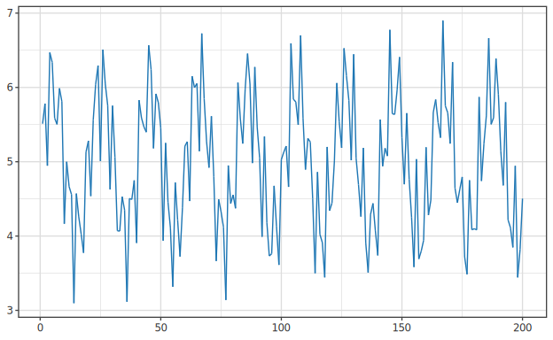
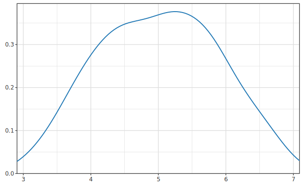

# MCMC サンプラー選択ガイド

> 🌐 [English](03-mcmc-samplers.md) | **日本語**

> 関連デモ:
> - [`bench-mcmc`](../../demo/bayesian/BenchMCMC.hs) — MH/HMC/NUTS パフォーマンス比較 (易/難 2 ケース)
> - [`test-hmc-nuts`](../../demo/bayesian/TestHMCNUTS.hs) — 1D ガウスで HMC/NUTS 動作検証
> - [`hbm-example`](../../demo/bayesian/HBMExample.hs) — 4 チェーン NUTS + R-hat 診断

## サンプラー比較

| サンプラー | モジュール | 向いているケース | 主な調整パラメータ |
|---|---|---|---|
| Metropolis-Hastings | `Hanalyze.MCMC.MH` (`metropolis`) | 動作確認・シンプルモデル | `mcmcStepSizes` (受容率 20-50%) |
| HMC | `Hanalyze.MCMC.HMC` (`hmc`) | 連続パラメータ・中規模 | `hmcStepSize`, `hmcLeapfrogSteps` |
| **NUTS** | `Hanalyze.MCMC.NUTS` (`nuts`) | **ほぼ全ケースで推奨** | `nutsStepSize` (他は dual averaging で自動調整) |
| Gibbs / ハイブリッド | `Hanalyze.MCMC.Gibbs` (`gibbsMH`) | 共役モデル (超高速) | 不要 (直接サンプリング) |

HMC/NUTS は `Numeric.AD.Mode.Forward` による正確な勾配を使うため、
数値微分版に比べて精度・速度ともに優れます。
全サンプラーは多相モデル `ModelP r` を受け取り、制約変換 (PositiveT/UnitIntervalT) を自動適用します。

どのサンプラーを選んでも、出力は事後サンプルの `Chain` です。下の trace plot は
あるパラメータのサンプル列を示します。定常で良く混合した「毛虫」状になっていれば
収束のサインです。



同じサンプル列をヒストグラム/KDE に集約すると、サンプラーが近似している周辺事後密度が
得られます。



### 純粋版 (`*Pure`) と IO 版 — 純粋版を推奨

各サンプラーには 2 つの入口があります (Phase 50):

| 種別 | シグネチャの形 | 備考 |
|---|---|---|
| **純粋版 (推奨)** | `… -> Word32 -> Chain` (`nutsPure` / `nutsChainsPure` 等) | **seed** を受け取り素の値を返す。 決定的: 同 seed → ビット同一の `Chain`。 `IO` でないので `let` 束縛・ノートブックに乗り、 テストも容易。 `*ChainsPure` は `parList rdeepseq` で chain を並列化 (`+RTS -N`)。 |
| IO 版 (legacy) | `… -> GenIO -> IO Chain` (`nuts` / `nutsChains` 等) | 可変 `GenIO`・async 並列 (`mapConcurrently`)。 後方互換で残置・**将来 deprecate 予定**。 per-sample コスト・並列壁時計は純粋版と同等。 |

本ガイドは一貫して**純粋版**を使います。 seed は任意の `Word32` で、 同じ seed を渡せば実行を完全再現できます
(両者は同一アルゴリズム — 純粋版は RNG を `IO` でなく `ST`/`runST` で通すだけ)。

---

## 制約付きパラメータについて

HMC / NUTS は制約付き分布を **自動的に unconstrained 空間に変換** します。

| 分布 | 制約 | 変換 |
|---|---|---|
| `Exponential(λ)`, `Gamma(α,β)` | 正値 (>0) | 対数変換 u = log(θ) |
| `Beta(α,β)` | 単位区間 (0,1) | ロジット変換 u = log(θ/(1-θ)) |
| `Normal(μ,σ)` | 実数全体 | 変換なし |

初期値は通常の constrained 空間の値で渡してください。
Jacobian 補正が自動適用されるため、ユーザーは意識する必要はありません。

---

## MCMC.MH — Random Walk Metropolis-Hastings

### いつ使うか
- 動作確認・プロトタイピング
- パラメータが 1〜3 個程度のシンプルモデル
- 離散パラメータを含む (HMC/NUTS は勾配が必要なため離散非対応)

### API

```haskell
import Hanalyze.MCMC.MH

data MCMCConfig = MCMCConfig
  { mcmcIterations :: Int
  , mcmcBurnIn     :: Int
  , mcmcStepSizes  :: Map Text Double  -- パラメータごとの提案分布 SD
  }

defaultMCMCConfig :: [Text] -> MCMCConfig
-- iterations=2000, burnIn=500, stepSize=1.0 (全パラメータ)

-- 純粋版 (推奨): seed → 決定的 Chain
metropolisPure       :: Model a -> MCMCConfig -> Params -> Word32 -> Chain
metropolisChainsPure :: Model a -> MCMCConfig -> Int -> Params -> Word32 -> [Chain]

-- IO 版 (legacy・deprecate 予定)
metropolis       :: Model a -> MCMCConfig -> Params -> GenIO -> IO Chain
metropolisChains :: Model a -> MCMCConfig -> Int    -> Params -> GenIO -> IO [Chain]
```

### 例

```haskell
import Hanalyze.MCMC.MH
import qualified Data.Map.Strict as Map

let m   = normalMean [1.2, 2.3, 3.1]
    cfg = (defaultMCMCConfig (sampleNames m))
            { mcmcIterations = 5000
            , mcmcBurnIn     = 1000
            , mcmcStepSizes  = Map.fromList [("mu", 0.5)]  -- 受容率 20-50% を目指す
            }
    -- 純粋: IO 不要・seed 42 で再現可能
    chain = metropolisPure m cfg (Map.fromList [("mu", 0.0)]) 42
```

---

## MCMC.HMC — Hamiltonian Monte Carlo

### いつ使うか
- 連続パラメータ、10〜数十次元
- NUTS より細かい軌道制御が必要な研究用途

### API

```haskell
import Hanalyze.MCMC.HMC

data HMCConfig = HMCConfig
  { hmcIterations    :: Int
  , hmcBurnIn        :: Int
  , hmcStepSize      :: Double  -- リープフロッグのステップ幅 ε
  , hmcLeapfrogSteps :: Int     -- リープフロッグのステップ数 L
  }

defaultHMCConfig :: HMCConfig
-- iterations=2000, burnIn=500, stepSize=0.1, leapfrogSteps=10

-- 純粋版 (推奨)
hmcPure       :: Model a -> HMCConfig -> Params -> Word32 -> Chain
hmcChainsPure :: Model a -> HMCConfig -> Int -> Params -> Word32 -> [Chain]

-- IO 版 (legacy)
hmc       :: Model a -> HMCConfig -> Params -> GenIO -> IO Chain
hmcChains :: Model a -> HMCConfig -> Int    -> Params -> GenIO -> IO [Chain]
```

### 例

```haskell
import Hanalyze.MCMC.HMC

let cfg = defaultHMCConfig
            { hmcIterations    = 3000
            , hmcStepSize      = 0.1    -- 受容率 60-80% を目指す
            , hmcLeapfrogSteps = 15     -- 強相関なら増やす (20-50)
            }
    chain = hmcPure m cfg initP 42
```

### チューニングの目安
- 受容率 < 60%: `hmcStepSize` を小さくする
- 受容率 > 90%: `hmcStepSize` を大きくする (効率が出ていない)
- ESS が低い: `hmcLeapfrogSteps` を増やす

---

## MCMC.NUTS — No-U-Turn Sampler (推奨)

Hoffman & Gelman (2014) Algorithm 3 の実装。
軌道長を U-Turn 判定で自動決定するため `leapfrogSteps` のチューニングが不要。
バーンイン中に Dual Averaging でステップ幅を自動調整します。

### API

```haskell
import Hanalyze.MCMC.NUTS

data NUTSConfig = NUTSConfig
  { nutsIterations    :: Int
  , nutsBurnIn        :: Int
  , nutsStepSize      :: Double  -- 初期 ε (自動調整のシード)
  , nutsMaxDepth      :: Int     -- ツリー最大深さ (default 10)
  , nutsAdaptStepSize :: Bool    -- Dual Averaging 自動調整 (default True)
  , nutsTargetAccept  :: Double  -- 目標受容率 δ (default 0.8)
  }

defaultNUTSConfig :: NUTSConfig

-- 純粋版 (推奨)
nutsPure       :: Model a -> NUTSConfig -> Params -> Word32 -> Chain
nutsChainsPure :: Model a -> NUTSConfig -> Int -> Params -> Word32 -> [Chain]

-- IO 版 (legacy)
nuts       :: Model a -> NUTSConfig -> Params -> GenIO -> IO Chain
nutsChains :: Model a -> NUTSConfig -> Int    -> Params -> GenIO -> IO [Chain]
```

### 例: 基本的な使い方

```haskell
import Hanalyze.MCMC.NUTS

-- 初期 stepSize だけ渡せばよい (バーンイン中に自動調整される)
let cfg   = defaultNUTSConfig { nutsIterations = 2000, nutsStepSize = 0.1 }
    chain = nutsPure m cfg initP 42   -- 純粋・再現可能
```

### 例: 4チェーン並列 + R-hat 収束確認

```haskell
import Hanalyze.MCMC.NUTS
import Hanalyze.MCMC.Core  (chainVals)
import Hanalyze.Stat.MCMC  (rhat, ess)

-- 純粋並列: chain を parList rdeepseq で評価。 +RTS -N4 でマルチコア。
-- 子 seed は親 seed から導出されるので結果はコア数に依らず再現可能。
let chains = nutsChainsPure m cfg 4 initP 42
    params = sampleNames m

-- R-hat < 1.01 で収束
forM_ params $ \p -> do
  let r = rhat (map (chainVals p) chains)
  printf "%s: R-hat = %s, ESS = %.0f\n"
    (T.unpack p) (show r) (ess (chainVals p (head chains)))
```

### ステップサイズの初期値の目安

| モデル | 推奨初期 stepSize |
|---|---|
| 単純正規モデル | 0.3〜1.0 |
| 階層モデル (2〜3レベル) | 0.05〜0.3 |
| Beta-Binomial | 0.1〜0.5 |

`nutsAdaptStepSize = True` (デフォルト) の場合、バーンイン後半には
自動調整された ε が使われるため、初期値は大まかで問題ありません。

---

## 多チェーン実行の共通パターン

MH / HMC / NUTS / Gibbs はすべて `<sampler>ChainsPure` 関数で並列チェーン実行できます
(IO 版 `<sampler>Chains` も別途あり)。 純粋版は各 chain を子 seed で別 `runST` に走らせ
結果リストを `parList rdeepseq` で評価するので、 `+RTS -N` でマルチコアを使いつつ決定的です。

```haskell
-- 純粋 4チェーン。 +RTS -N4 でマルチコア (結果は -N に依らず同一)
let chains    = nutsChainsPure m cfg 4 initP 42
    allParams = sampleNames m
    converged = all (\p -> maybe False (< 1.01) (rhat (map (chainVals p) chains))) allParams
putStrLn (if converged then "収束確認" else "警告: 収束していない可能性があります")
```

> IO 版 `nutsChains m cfg 4 initP gen` (async 並列) も壁時計は同等ですが、 純粋版が推奨で
> IO 版は将来 deprecate 予定です。

---

## MCMC.Core — Chain 型と統計量

全サンプラーが返す `Chain` 型の共通インタフェース。

```haskell
import Hanalyze.MCMC.Core

data Chain = Chain
  { chainSamples  :: [Map Text Double]  -- バーンイン後サンプル
  , chainAccepted :: Int
  , chainTotal    :: Int
  }

acceptanceRate    :: Chain -> Double
posteriorMean     :: Text -> Chain -> Maybe Double
posteriorSD       :: Text -> Chain -> Maybe Double
posteriorQuantile :: Double -> Text -> Chain -> Maybe Double

chainVals :: Text -> Chain -> [Double]  -- サンプル列 (Stat.MCMC.ess 等に渡す)
```

---

## Stat.MCMC — 診断統計量

```haskell
import Hanalyze.Stat.MCMC

ess     :: [Double] -> Double          -- 実効サンプルサイズ (Geyer 推定量)
rhat    :: [[Double]] -> Maybe Double  -- Split R-hat (Vehtari et al. 2021)
hdi     :: Double -> [Double] -> (Double, Double)   -- 最短区間 HDI
autocorr :: Int -> [Double] -> [(Int, Double)]       -- 自己相関
kde     :: Int -> [Double] -> [(Double, Double)]     -- KDE 密度
```

**R-hat の解釈:**
- `Just 1.00`: 完全収束
- `< Just 1.01`: 収束とみなしてよい (Vehtari et al. 推奨閾値)
- `>= Just 1.01`: 収束不足 — バーンイン増加または stepSize 調整が必要
