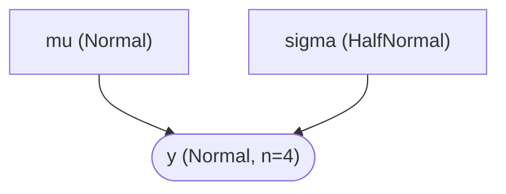
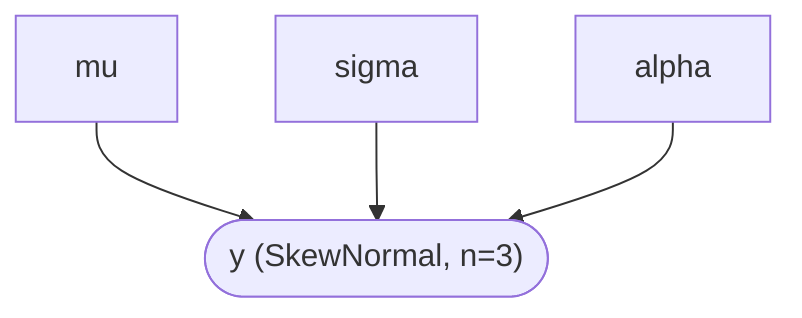
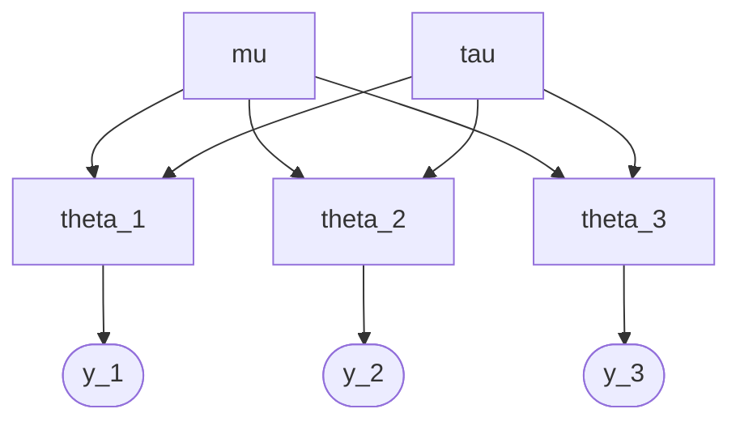
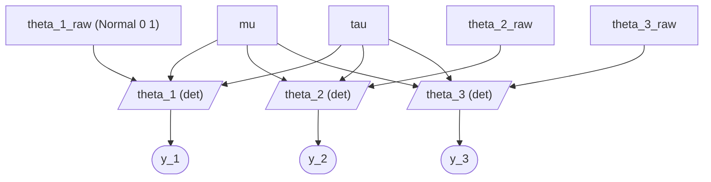
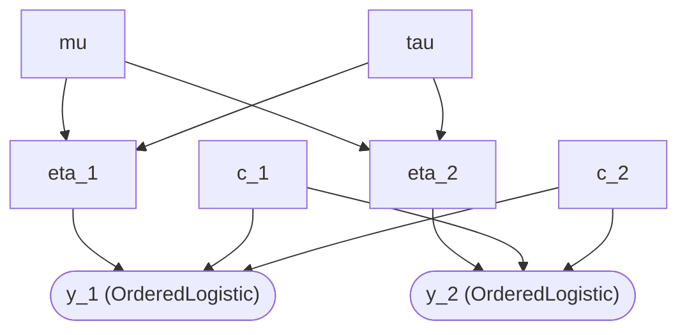
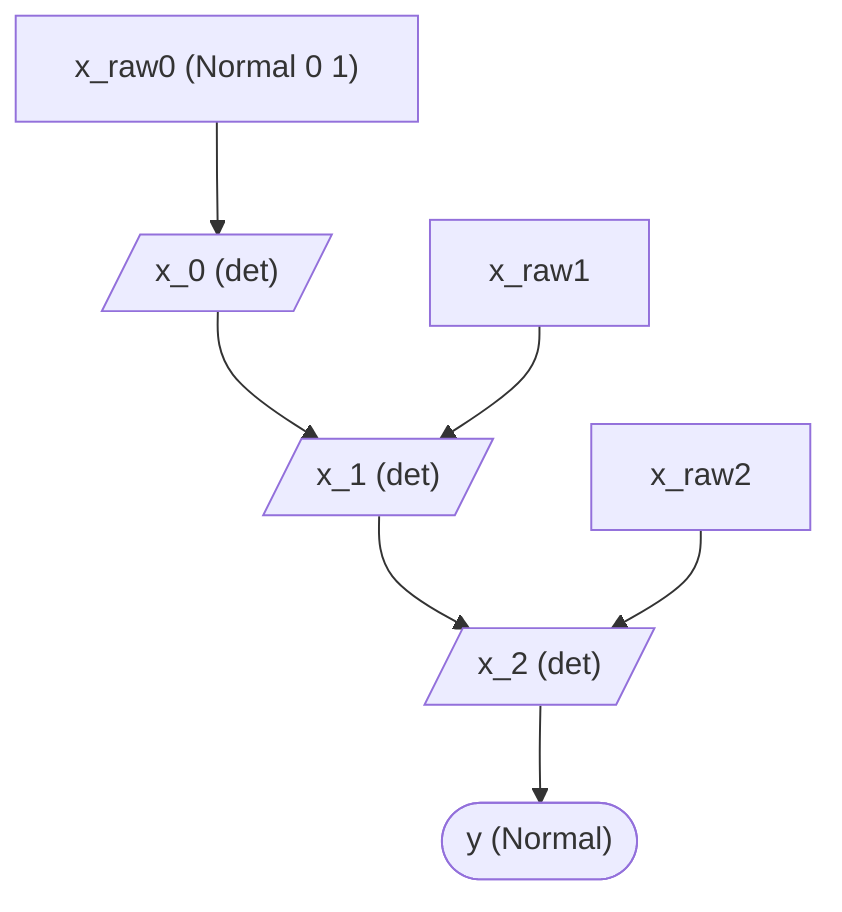
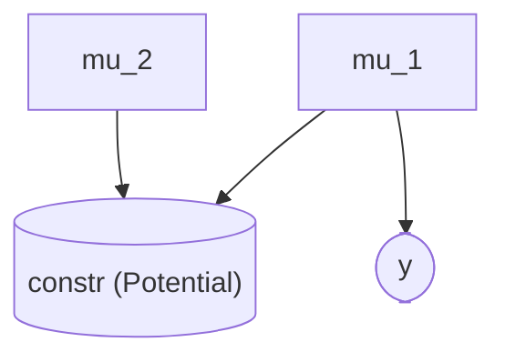
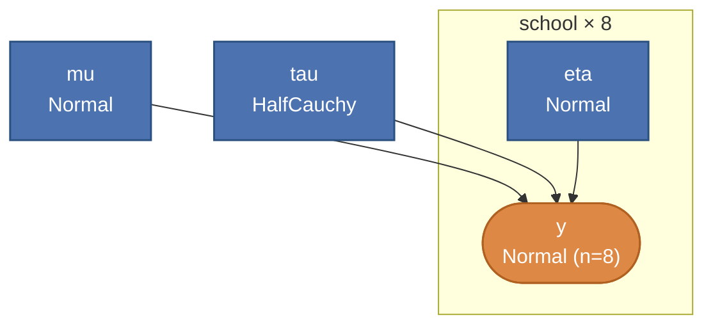
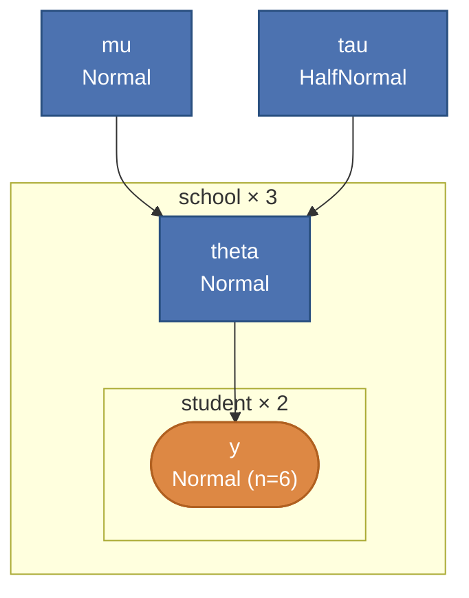
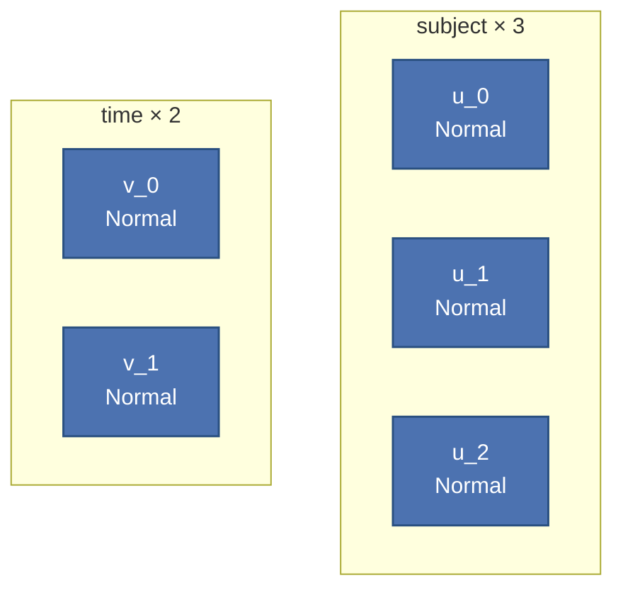

# DAG ギャラリー (Phase 38)

`Hanalyze.Model.HBM.buildModelGraph` で抽出した DAG の代表例を、
mermaid 図で可視化する。 各階層 1-2 例を載せる。 詳細な検証 test は
`test/Spec.hs` の `describe "Hanalyze.Model.HBM.buildModelGraph (Phase 38: …)"`
ブロックを参照 (24 例)。

API:

```haskell
import qualified Hanalyze.Model.HBM as HBM

let g = HBM.buildModelGraph myModel
in  ( HBM.mgNodes g    -- [Node]   ノード一覧
    , HBM.mgEdges g    -- [(Text, Text)] (parent, child) のエッジ
    )
```

`Node` は `nodeName / nodeKind (LatentN | ObservedN Int) / nodeDist / nodeDeps`
を持つ。 `nodeDist` には `"Normal"`, `"Deterministic"`, `"Potential"` 等の
分布名 / 種別が入る。

mermaid HTML 出力は `Hanalyze.Viz.ModelGraph.renderModelGraph` を使う
(既存の `hbm-example` / `HBMRandomSlopeDemo` 等の参考例あり)。

---

## 階層 1: 簡単モデル

### 例 1-1: Normal(μ, σ) with 両方 latent

```haskell
m = do
  mu    <- sample "mu"    (Normal 0 10)
  sigma <- sample "sigma" (HalfNormal 1)
  observe "y" (Normal mu sigma) [0, 1, 2, 3]
```



### 例 1-2: SkewNormal (Phase 37-A2 + Phase 38 補修で DAG 抽出対応)

```haskell
m = do
  mu    <- sample "mu"    (Normal 0 1)
  sigma <- sample "sigma" (HalfNormal 1)
  alpha <- sample "alpha" (Normal 0 1)
  observe "y" (SkewNormal mu sigma alpha) [0, 1, 2]
```



---

## 階層 2: 代表モデル (階層構造)

### 例 2-1: 形式 A (per-group θ_j)

```haskell
m = do
  mu  <- sample "mu"  (Normal 0 10)
  tau <- sample "tau" (HalfNormal 5)
  t1  <- sample "theta_1" (Normal mu tau)
  t2  <- sample "theta_2" (Normal mu tau)
  t3  <- sample "theta_3" (Normal mu tau)
  observe "y_1" (Normal t1 1) [1.0, 1.2]
  observe "y_2" (Normal t2 1) [5.0, 5.3]
  observe "y_3" (Normal t3 1) [9.0, 9.2]
```



### 例 2-2: 形式 C (non-centered)

`nonCenteredNormal` ヘルパで raw + det の 2 段に展開される。

```haskell
m = do
  mu  <- sample "mu"  (Normal 0 10)
  tau <- sample "tau" (HalfNormal 5)
  thetas <- forM [1, 2, 3] $ \j ->
    nonCenteredNormal (T.pack ("theta_" ++ show j)) mu tau
  forM_ (zip [1, 2, 3] thetas) $ \(j, th) ->
    observe (T.pack ("y_" ++ show j)) (Normal th 1) [1.0]
```



ポイント: raw (rectangle) は親なし `Normal(0,1)`、 det (parallelogram) が
`mu + tau * raw` の親集合を保持。 下流 `y_j` は det `theta_j` を親に
取り、 raw を直接の親にはしない (Phase 38 で plate-style 修正)。

---

## 階層 3: 複雑モデル

### 例 3-1: 階層 OrderedLogistic (cuts 共通、 η 群別)

```haskell
m = do
  mu  <- sample "mu"  (Normal 0 1)
  tau <- sample "tau" (HalfNormal 1)
  c1  <- sample "c_1" (Normal (-1) 1)
  c2  <- sample "c_2" (Normal 1 1)
  e1  <- sample "eta_1" (Normal mu tau)
  e2  <- sample "eta_2" (Normal mu tau)
  observe "y_1" (OrderedLogistic e1 [c1, c2]) [0, 1, 2]
  observe "y_2" (OrderedLogistic e2 [c1, c2]) [0, 1, 2]
```



### 例 3-2: AR(1) latent 時系列 (Phase 38 で plate-style に修正)

```haskell
m = do
  xs <- ar1Latent "x" 3 0.8 0.3
  observe "y" (Normal (xs !! 2) 1) [1.0]
```



Phase 38 修正前は `x_t` の親が `{x_raw0, …, x_raw_t}` (遠い親) で
チェーン構造が見えなかった。 monadic recursion + 各 step の deterministic
relabel で plate-style chain が出るようになった。

### 例 3-3: Gaussian + potential 制約

`potential` も LatentN として親集合付きで DAG に現れる
(`nodeDist = "Potential"`)。

```haskell
m = do
  m1 <- sample "mu_1" (Normal 0 5)
  m2 <- sample "mu_2" (Normal 0 5)
  potential "constr" (negate ((m1 - m2) ** 2))   -- mu_1 ≈ mu_2 ペナルティ
  observe "y" (Normal m1 1) [1, 2, 3]
```



---

## DAG の凡例

mermaid 形状の使い分け (本ドキュメント内):

- `[name]` 通常の latent (Sample)
- `[/name/]` deterministic (Deterministic、 親から導出)
- `[(name)]` potential (制約項)
- `([name])` observed (Observe)

---

## Phase 40: plate 記法ギャラリー

GitHub の mermaid ネイティブ描画 + ローカル `cabal run plate-notation-demo`
で生成した DOT (PyMC `pm.model_to_graphviz` 同等) の 2 経路で確認できる。

### 重要: 展開 (expanded) vs 集約 (collapsed)

hanalyze は 2 モードの描画をサポート:

- **expanded** (`buildModelGraph` 結果をそのまま): plate 内に N 個全部
  列挙される。 個別ノード名 (eta_0, eta_1, …) が確認できる
- **collapsed** (`collapseIndexedPlateNodes` 適用後): plate 内の indexed
  RV を **代表 1 ノードに集約** (eta_0..eta_7 → `eta`、 y_0..y_7 → `y (n=8)`)。
  **PyMC `pm.model_to_graphviz` と同等**

40.1 と 40.2 の mermaid 図は **collapsed** を示す (PyMC 流の真の plate 記法)。

### 40.1 8-schools (1 plate)

```haskell
mu  <- sample "mu"  (Normal 0 5)
tau <- sample "tau" (HalfCauchy 5)
_ <- plate "school" 8 $ forM [0..7] $ \j -> do
  eta <- sample ("eta_" <> show j) (Normal 0 1)
  observe ("y_" <> show j) (Normal (mu + tau * eta) 1) [ys !! j]
```

**collapsed (PyMC 同等)**:



ノード数 4 / edges 3 本 (PyMC の `pm.model_to_graphviz` と同等)。 元の
`eta_0..eta_7` は `eta` 1 個に、 `y_0..y_7` は `y (n=8)` に集約。

### 40.2 nested multi-level (school × student)

```haskell
mu  <- sample "mu" (Normal 0 5)
tau <- sample "tau" (HalfNormal 1)
_ <- plate "school" 3 $ forM_ [0..2] $ \j -> do
  theta <- sample ("theta_" <> show j) (Normal mu tau)
  _ <- plate "student" 2 $ forM_ [0..1] $ \i ->
         observe ("y_" <> show j <> "_" <> show i) (Normal theta 1) [...]
  return ()
```

**collapsed (PyMC 同等、 不動点で 2 段集約)**:



`y_0_0..y_2_1` (6 個) は 2 段の集約 (内側 student → 外側 school) で `y (n=6)`
に。 `plate_school` の中に `plate_student` が **入れ子**。 PyMC では
`pm.Normal("y", ..., dims=("school", "student"))` の出力と同等。

### 40.3 crossed plate (subject × time)

完全交差は PyMC でも 2 plate 並列で表示する慣習に従う:



### graphviz DOT 経路 (PyMC `model_to_graphviz` 同等)

`cabal run plate-notation-demo` で `demo-output/` に 8 ファイル生成
(各モデル × {expanded, collapsed} × {.html, .dot}):

```bash
# PyMC 同等 (collapsed)
dot -Tpng demo-output/8schools-collapsed.dot    -o 8schools.png
dot -Tpng demo-output/multilevel-collapsed.dot  -o multilevel.png

# 展開 (全 N 個列挙、 デバッグ用)
dot -Tpng demo-output/8schools-expanded.dot     -o 8schools-expanded.png
dot -Tpng demo-output/multilevel-expanded.dot   -o multilevel-expanded.png
```

collapsed DOT は `cluster_school { label="school × 8"; labelloc="b"; ... }`
で **PyMC 同等の下にラベル付き角丸長方形** (右下にサイズ数字) になる。
観測ノードは `style=filled, fillcolor=lightgray` で灰色塗り。

### PyMC リファレンス比較

`bench/python/pymc_plate_reference.py` で **同じモデルを PyMC で実走**
できる (venv 環境推奨):

```bash
pip install pymc graphviz
python3 bench/python/pymc_plate_reference.py
# → bench/python/pymc-output/{8schools,multilevel}.gv + .png
```

hanalyze collapsed と PyMC 出力を並べると同じ構造になる (ノード集約 +
plate 矩形 + ラベル位置)。

---

## 検証ステータス

| 階層 | 例数 | test | 状態 |
|---|---|---|---|
| 簡単 | 6 | `describe "(Phase 38: 簡単 6 例)"` | ✅ 6/6 |
| 代表 | 9 | `describe "(Phase 38: 代表 9 例)"` | ✅ 9/9 |
| 複雑 | 9 | `describe "(Phase 38: 複雑 9 例)"` | ✅ 9/9 |

全 24 例の DAG 構造が `mgNodes` / `mgEdges` レベルで期待通りであることを
test/Spec.hs で網羅検証済 (Phase 38 起点で 738 → 762 tests)。
