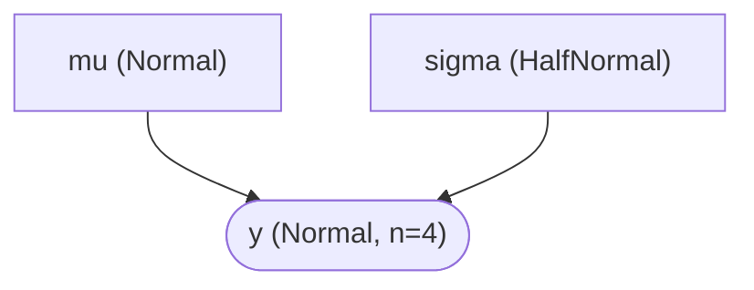
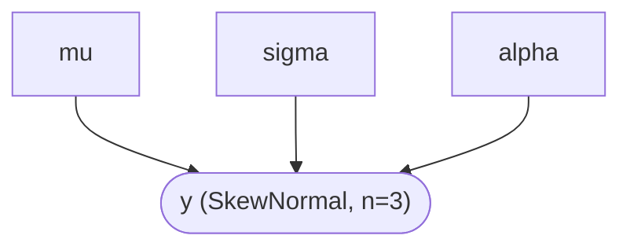
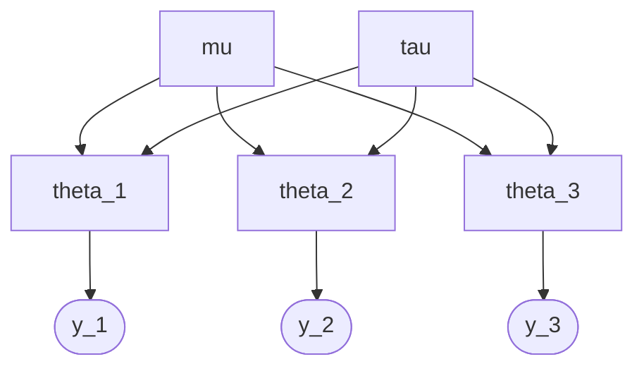
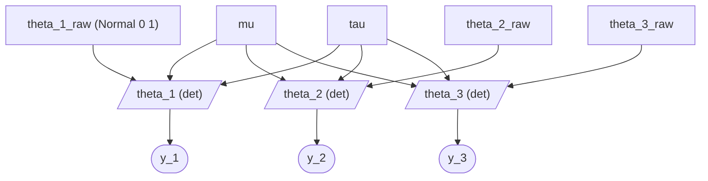
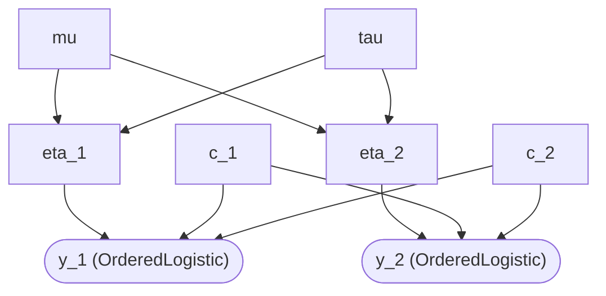
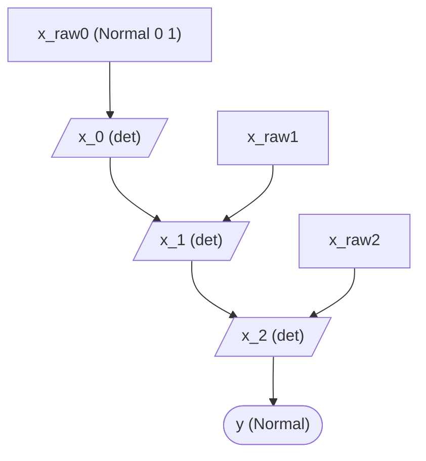
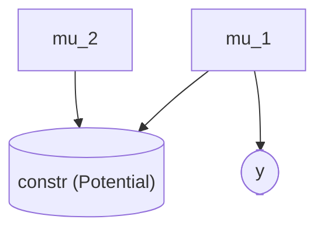
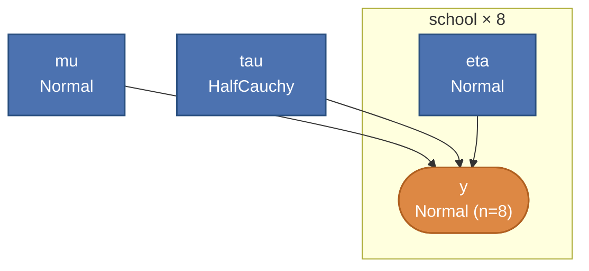
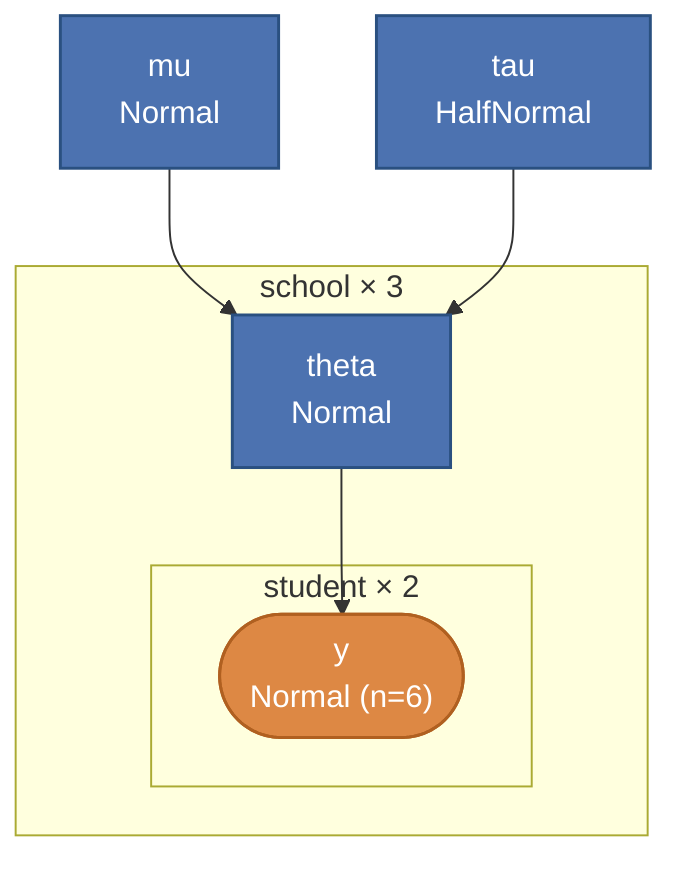
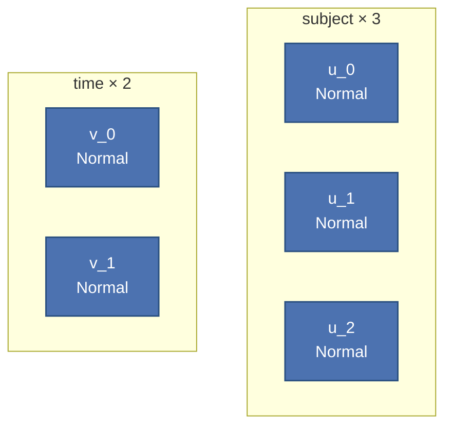

# DAG Gallery (Phase 38)

> 🌐 **English** | [日本語](dag-gallery.ja.md)

Representative DAG examples extracted by `Hanalyze.Model.HBM.buildModelGraph`,
visualized with mermaid diagrams. One-two examples per hierarchy level;
detailed validation tests in `test/Spec.hs` 's `describe "Hanalyze.Model.HBM.buildModelGraph (Phase 38: …)"`
block (24 examples).

API:

```haskell
import qualified Hanalyze.Model.HBM as HBM

let g = HBM.buildModelGraph myModel
in  ( HBM.mgNodes g    -- [Node]   node list
    , HBM.mgEdges g    -- [(Text, Text)] (parent, child) edges
    )
```

`Node` carries `nodeName / nodeKind (LatentN | ObservedN Int) / nodeDist / nodeDeps`.
`nodeDist` holds distribution name or kind like `"Normal"`, `"Deterministic"`, `"Potential"`.

mermaid HTML output via `Hanalyze.Viz.ModelGraph.renderModelGraph` (reference demos:
`hbm-example` / `HBMRandomSlopeDemo` etc.).

---

## Hierarchy 1: Simple Models

### Example 1-1: Normal(μ, σ) with both latent

```haskell
m = do
  mu    <- sample "mu"    (Normal 0 10)
  sigma <- sample "sigma" (HalfNormal 1)
  observe "y" (Normal mu sigma) [0, 1, 2, 3]
```



### Example 1-2: SkewNormal (Phase 37-A2 + Phase 38 DAG extraction support)

```haskell
m = do
  mu    <- sample "mu"    (Normal 0 1)
  sigma <- sample "sigma" (HalfNormal 1)
  alpha <- sample "alpha" (Normal 0 1)
  observe "y" (SkewNormal mu sigma alpha) [0, 1, 2]
```



---

## Hierarchy 2: Representative Models (hierarchical structure)

### Example 2-1: Form A (per-group θ_j)

```haskell
m = do
  mu  <- sample "mu"  (Normal 0 10)
  tau <- sample "tau" (HalfNormal 5)
  t1  <- sample "theta_1" (Normal mu tau)
  t2  <- sample "theta_2" (Normal mu tau)
  t3  <- sample "theta_3" (Normal mu tau)
  observe "y_1" (Normal t1 1) [1.0, 1.2]
  observe "y_2" (Normal t2 1) [5.0, 5.3]
  observe "y_3" (Normal t3 1) [9.0, 9.2]
```



### Example 2-2: Form C (non-centered)

`nonCenteredNormal` helper expands to 2 layers: raw + deterministic.

```haskell
m = do
  mu  <- sample "mu"  (Normal 0 10)
  tau <- sample "tau" (HalfNormal 5)
  thetas <- forM [1, 2, 3] $ \j ->
    nonCenteredNormal (T.pack ("theta_" ++ show j)) mu tau
  forM_ (zip [1, 2, 3] thetas) $ \(j, th) ->
    observe (T.pack ("y_" ++ show j)) (Normal th 1) [1.0]
```



Key point: raw (rectangle) has no parents, `Normal(0,1)`;
deterministic (parallelogram) holds parent set for `mu + tau * raw`.
Downstream `y_j` takes deterministic `theta_j` as parent, not raw directly
(Phase 38 plate-style fix).

---

## Hierarchy 3: Complex Models

### Example 3-1: Hierarchical OrderedLogistic (shared cuts, per-group η)

```haskell
m = do
  mu  <- sample "mu"  (Normal 0 1)
  tau <- sample "tau" (HalfNormal 1)
  c1  <- sample "c_1" (Normal (-1) 1)
  c2  <- sample "c_2" (Normal 1 1)
  e1  <- sample "eta_1" (Normal mu tau)
  e2  <- sample "eta_2" (Normal mu tau)
  observe "y_1" (OrderedLogistic e1 [c1, c2]) [0, 1, 2]
  observe "y_2" (OrderedLogistic e2 [c1, c2]) [0, 1, 2]
```



### Example 3-2: AR(1) Latent Time Series (Phase 38 plate-style fix)

```haskell
m = do
  xs <- ar1Latent "x" 3 0.8 0.3
  observe "y" (Normal (xs !! 2) 1) [1.0]
```



Pre-Phase-38 fix: `x_t` parents were `{x_raw0, …, x_raw_t}` (distant ancestors),
chain structure hidden. Monadic recursion + each step's deterministic relabel
now produces plate-style chain.

### Example 3-3: Gaussian with potential constraint

`potential` also appears in DAG as LatentN with parent set
(`nodeDist = "Potential"`).

```haskell
m = do
  m1 <- sample "mu_1" (Normal 0 5)
  m2 <- sample "mu_2" (Normal 0 5)
  potential "constr" (negate ((m1 - m2) ** 2))   -- μ_1 ≈ μ_2 penalty
  observe "y" (Normal m1 1) [1, 2, 3]
```



---

## DAG Legend

mermaid shape conventions (this document):

- `[name]` ordinary latent (Sample)
- `[/name/]` deterministic (Deterministic, derived from parents)
- `[(name)]` potential (constraint term)
- `([name])` observed (Observe)

---

## Phase 40: Plate Notation Gallery

GitHub's native mermaid rendering + local `cabal run plate-notation-demo`
generating DOT (PyMC `pm.model_to_graphviz` equivalent) — two paths for verification.

### Critical: Expanded vs Collapsed

hanalyze supports 2 draw modes:

- **expanded** (`buildModelGraph` result as-is): All N nodes listed inside plate.
  Individual names (eta_0, eta_1, …) visible (debug use).
- **collapsed** (after `collapseIndexedPlateNodes`): Indexed RV inside plate **aggregated
  to representative 1 node** (eta_0..eta_7 → `eta`, y_0..y_7 → `y (n=8)`).
  **PyMC `pm.model_to_graphviz` equivalent.**

Mermaid diagrams in 40.1 and 40.2 show **collapsed** (PyMC-style true plate notation).

### 40.1 Eight schools (1 plate)

```haskell
mu  <- sample "mu"  (Normal 0 5)
tau <- sample "tau" (HalfCauchy 5)
_ <- plate "school" 8 $ forM [0..7] $ \j -> do
  eta <- sample ("eta_" <> show j) (Normal 0 1)
  observe ("y_" <> show j) (Normal (mu + tau * eta) 1) [ys !! j]
```

**Collapsed (PyMC equivalent)**:



Node count: 4 / edges: 3 (PyMC's `pm.model_to_graphviz` equivalent).
Original `eta_0..eta_7` collapse to `eta` (1), `y_0..y_7` to `y (n=8)`.

### 40.2 Nested multi-level (school × student)

```haskell
mu  <- sample "mu" (Normal 0 5)
tau <- sample "tau" (HalfNormal 1)
_ <- plate "school" 3 $ forM_ [0..2] $ \j -> do
  theta <- sample ("theta_" <> show j) (Normal mu tau)
  _ <- plate "student" 2 $ forM_ [0..1] $ \i ->
         observe ("y_" <> show j <> "_" <> show i) (Normal theta 1) [...]
  return ()
```

**Collapsed (PyMC equivalent, fixed-point 2-level collapse)**:



`y_0_0..y_2_1` (6 total) collapses via nested levels (inner student → outer school) to `y (n=6)`.
`plate_school` contains **nested** `plate_student`. PyMC equivalent: `pm.Normal("y", ..., dims=("school", "student"))` output.

### 40.3 Crossed plate (subject × time)

Complete crossing → PyMC convention: 2 plates side-by-side.



### graphviz DOT path (PyMC `model_to_graphviz` equivalent)

`cabal run plate-notation-demo` generates 8 files in `demo-output/`
(each model × {expanded, collapsed} × {.html, .dot}):

```bash
# PyMC equivalent (collapsed)
dot -Tpng demo-output/8schools-collapsed.dot    -o 8schools.png
dot -Tpng demo-output/multilevel-collapsed.dot  -o multilevel.png

# Expanded (all N listed; debug use)
dot -Tpng demo-output/8schools-expanded.dot     -o 8schools-expanded.png
dot -Tpng demo-output/multilevel-expanded.dot   -o multilevel-expanded.png
```

Collapsed DOT uses `cluster_school { label="school × 8"; labelloc="b"; ... }`
for **PyMC-style rounded rect with size label bottom-right**.
Observation nodes are `style=filled, fillcolor=lightgray` (gray).

### PyMC Reference Comparison

`bench/python/pymc_plate_reference.py` **runs the same model in PyMC** (venv recommended):

```bash
pip install pymc graphviz
python3 bench/python/pymc_plate_reference.py
# → bench/python/pymc-output/{8schools,multilevel}.gv + .png
```

Side-by-side comparison of hanalyze collapsed and PyMC output shows identical structure
(node aggregation + plate rectangles + label placement).

---

## Validation Status

| Hierarchy | Count | Test | Status |
|---|---|---|---|
| Simple | 6 | `describe "(Phase 38: 6 simple examples)"` | ✅ 6/6 |
| Representative | 9 | `describe "(Phase 38: 9 representative examples)"` | ✅ 9/9 |
| Complex | 9 | `describe "(Phase 38: 9 complex examples)"` | ✅ 9/9 |

All 24 examples validated in test/Spec.hs at `mgNodes` / `mgEdges` level
(Phase 38 onwards: 738 → 762 tests).
