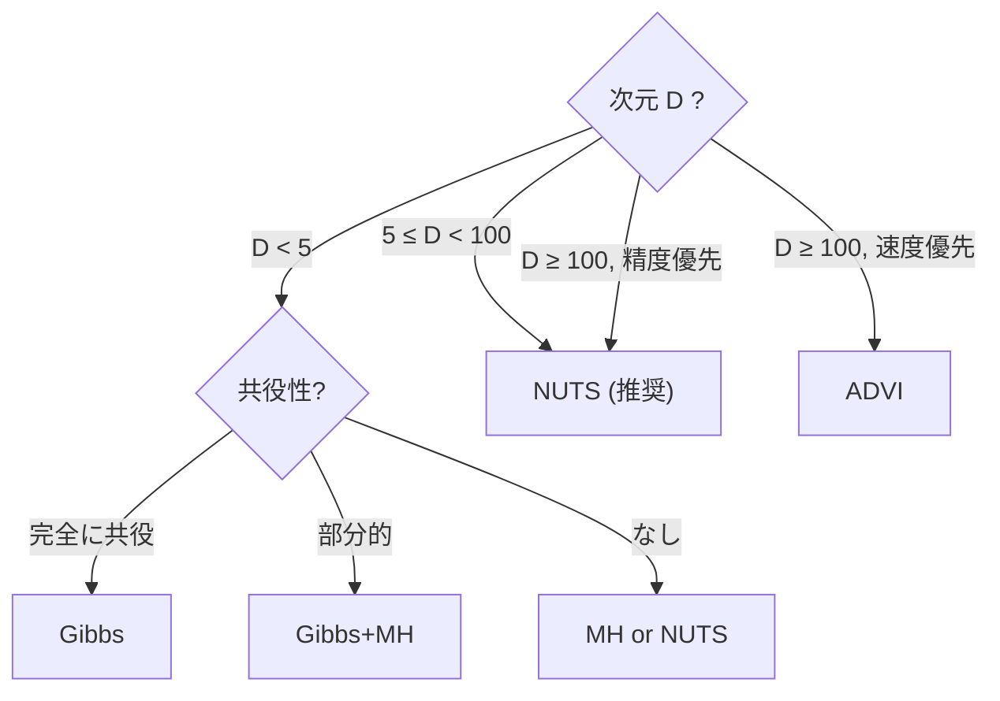
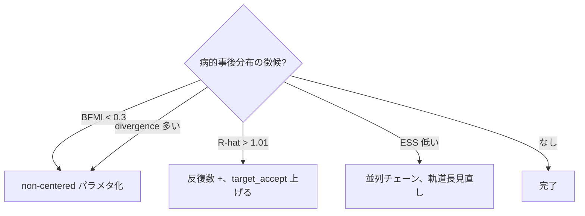

# 学習資料 5 — VI / モデル選択 / 高度なトピック

> Variational Inference、WAIC / LOO-CV、そして hanalyze に実装した
> 応用機能 (Mixture / LKJ / AR / Censored / non-centered など) の理論と
> 使い方をまとめる。

## 1. Variational Inference (VI)

### 1.1 動機

MCMC は正確だが遅い。**VI** は事後を近似する別アプローチ:

- 簡単な分布族 $\mathcal{Q}$ を選ぶ
- $\mathcal{Q}$ の中で事後 $p(\theta \mid y)$ に最も近い $q^*$ を探す
- 最適化問題に帰着 → 速い

### 1.2 ELBO (Evidence Lower BOund)

「近さ」の指標として KL divergence:

$$ \text{KL}(q \,\|\, p) = E_q\!\left[\log\frac{q(\theta)}{p(\theta \mid y)}\right] $$

を最小化したい。$p(\theta \mid y) = p(\theta, y) / p(y)$ なので:

$$ \log p(y) = \underbrace{E_q[\log p(\theta, y) - \log q(\theta)]}_{\text{ELBO}} + \text{KL}(q \,\|\, p) $$

$\log p(y)$ は定数なので、KL 最小化 = ELBO 最大化。

### 1.3 平均場近似 (Mean Field)

最も簡単な選択:

$$ q(\theta) = \prod_i q_i(\theta_i) $$

各 $\theta_i$ を独立にした単純な分布の積。各 $q_i$ は典型的に
Normal$(\mu_i, \sigma_i)$ などのパラメトリック家族。

### 1.4 ADVI (Automatic Differentiation VI)

Kucukelbir et al. 2017。任意のモデルに自動適用:

1. 全パラメタを **unconstrained 空間** に変換 ($u = T(\theta)$)
2. 各成分に Normal $q_i = \text{Normal}(\mu_i, \sigma_i)$ を仮定
3. ELBO を AD で勾配計算、Adam 等で最適化

### 1.5 hanalyze の `Stat.VI`

```haskell
import Stat.VI (advi, defaultVIConfig)

result <- advi model
            defaultVIConfig
              { viIterations = 5000
              , viLearningRate = 0.05
              }
            init0 gen

-- result :: VIResult, fields:
--   viParams :: Map Text (Double, Double)  -- (μ, σ) per param
--   viELBO   :: [Double]                   -- 反復ごとの ELBO 履歴
```

### 1.6 VI vs MCMC

| | MCMC (NUTS) | VI (ADVI) |
|---|---|---|
| 精度 | 漸近的に正確 | 近似 (KL 最小化のバイアス) |
| 速度 | 遅い | 速い (10〜100x) |
| 不確実性 | 正確 | 過小評価しがち (mean-field) |
| 多峰 | 苦手だが原理的に可能 | 単峰しか捕えない |
| 用途 | 最終推論 | 探索、初期検討 |

---

## 2. モデル選択

### 2.1 観点: 予測精度 (out-of-sample)

新しいデータ $\tilde{y}$ への予測が良いモデルを選ぶ:

$$ \text{elpd} = E_{p(\tilde y)}[\log p(\tilde y \mid y)] $$

これを近似する手法が **WAIC** と **LOO-CV**。

### 2.2 WAIC (Widely Applicable Information Criterion)

Watanabe 2010。事後サンプルから:

$$ \widehat{\text{elpd}}_{\text{WAIC}} = \sum_i \log\!\left(\frac{1}{S}\sum_s p(y_i \mid \theta^{(s)})\right) - \sum_i \text{Var}_s(\log p(y_i \mid \theta^{(s)})) $$

第二項が **有効パラメタ数 $p_{\text{WAIC}}$** (= 過適合ペナルティ)。

`Stat.ModelSelect.waic` で実装。

### 2.3 LOO-CV (Leave-One-Out Cross-Validation)

各データ点を順に除いて予測精度を評価。Vehtari 2017 の **PSIS-LOO**:

- 重要度サンプリングで通常の posterior から $p(y_i \mid y_{-i})$ を推定
- $\hat k$ 診断: 各観測の重み分布を Pareto 分布で fit、$\hat k$ で
  「重要度サンプリングが信頼できるか」を判定
  - $\hat k < 0.5$: OK
  - $0.5 \le \hat k < 0.7$: 注意
  - $\hat k \ge 0.7$: 信頼性低い (該当点を除外して MCMC 再実行を推奨)

`Stat.ModelSelect.loo` で実装。

### 2.4 モデル比較

```haskell
import Stat.ModelSelect (compareModels, ModelInfo (..))

-- 各モデルから loglik 行列を取得し
loglik1 <- ...   -- shape: [S × N]
loglik2 <- ...

let comparisons = compareModels
      [ ModelInfo "M1" loglik1
      , ModelInfo "M2" loglik2
      , ModelInfo "M3" loglik3
      ]
-- 出力: 各モデルの elpd_loo, se, weight (Pseudo-BMA)
```

**Pseudo-BMA**: $w_k = \exp(\text{elpd}_k) / \sum_l \exp(\text{elpd}_l)$。
不確実性付きの予測平均化に使う。

### 2.5 hanalyze での実演

```bash
cabal run forest-compare    # 3 モデルの forest plot + WAIC/LOO 比較
```

---

## 3. 高度なモデリングテクニック

### 3.1 Mixture モデル

```haskell
mix <- sample "x" (Mixture [w1, w2, w3] [comp1, comp2, comp3])
```

潜在クラスタの自動検出。**ラベルスイッチング** (どの成分が
"成分 1" かは不定) に注意 — `forestPlot` で順序を強制するなどで対処。

実装の核心: log-density 計算で **log-sum-exp** を使う:

$$ \log p(x) = \log\!\sum_k w_k p_k(x) = \text{logsumexp}(\log w_k + \log p_k(x)) $$

`logSumExpA` ヘルパで数値安定。

### 3.2 Truncated / Censored

- **Truncated**: 観測が範囲内のみ。CDF で正規化定数補正

  $$ p_T(y) = p(y) \big/ [F(\text{hi}) - F(\text{lo})] $$

- **Censored** (Tobit):
  - $y_i$ が範囲内: 通常の密度 $p(y_i)$
  - $y_i = \text{lo}$: 左打ち切り尤度 $F(\text{lo})$
  - $y_i = \text{hi}$: 右打ち切り尤度 $1 - F(\text{hi})$

`distCDF` (CDF) と `logCDFInterval` を使って実装。

### 3.3 Dirichlet と stick-breaking

シンプレックス制約 $\sum \pi_k = 1$ を K-1 個の Beta 変数に分解:

```text
β_k ~ Beta(α_k, Σ_{j>k} α_j),  k = 1..K-1
π_1 = β_1
π_k = β_k Π_{j<k} (1 - β_j)
π_K = Π_{j<K} (1 - β_j)
```

各 $\beta_k$ は独立に $(0, 1)$ なので HMC が安定。

### 3.4 LKJ 相関事前

相関行列 $R$ ($K \times K$) の事前 $p(R) \propto |R|^{\eta - 1}$。
$\eta = 1$ で uniform、$\eta > 1$ で I に集中。

**Canonical Partial Correlations (CPC)** 法で latent 化:

```text
z_ij ~ scaled Beta on (-1, 1),  α_i = η + (K-i-1)/2  (1 ≤ j < i ≤ K-1)

L[i][i] = √(1 - Σ_{k<i} z_{i,k}²)
L[i][j] = z_ij × √(Π_{k<j}(1 - z_{i,k}²))   (j < i)
```

R = L Lᵀ で相関行列が再構築される。共分散事前は **diag(σ) R diag(σ)**:

```haskell
l <- lkjCorrCholesky "R" K eta
sigmas <- mapM (\i -> sample ... HalfNormal) [1..K]
let cov = ... -- diag(σ) L Lᵀ diag(σ)
mvNormalLatent "x" mu cov
```

### 3.5 AR(1) 状態空間

```haskell
xs <- ar1Latent "x" T phi sigma
-- 内部:
--   raw_t ~ Normal(0, 1) for t = 0..T-1
--   x_0 = (σ/√(1-φ²)) × raw_0    (定常分布)
--   x_t = φ x_{t-1} + σ × raw_t   (t > 0)
```

時系列の latent 状態を非中心化で表現。観測モデルは:

```haskell
y_t ~ Normal(x_t, σ_obs)
```

を per-step の `observe` で記述 (Phase J2)。

### 3.6 ZeroInflated

```text
P(0)   = ψ + (1-ψ) P_d(0)
P(k>0) = (1-ψ) P_d(k)
```

`logSumExpA [log ψ, log(1-ψ) + log P_d(0)]` で 0 の log-density、
それ以外は通常 + `log(1-ψ)`。

---

## 4. 推論の選び方フローチャート





---

## 5. 全機能の使い分け早見表

| やりたいこと | hanalyze API |
|---|---|
| シンプルな線形モデル + Bayesian 事後 | `nuts` + `Model.HBM.sample/observe` |
| 階層モデル | 上記 + `nonCenteredNormal` |
| カテゴリ確率 (Categorical の事前) | `dirichlet` |
| 多変量観測 | `MvNormal` + `observeMV` |
| 多変量 latent | `mvNormalLatent` + `lkjCorrCholesky` |
| 過分散カウント | `NegativeBinomial` |
| ゼロ過剰カウント | `ZeroInflatedPoisson` |
| 切り詰めデータ | `Truncated` |
| Tobit / 検出限界 | `Censored` |
| 混合モデル (クラスタ自動検出) | `Mixture` |
| 派生量 (`τ = 1/σ²` など) | `deterministic` |
| カスタム正則化 | `potential` |
| 角度データ | `VonMises` |
| 生存解析 | `Weibull` |
| 重い裾 | `Pareto`, `StudentT(ν=3)` |
| 時系列 | `ar1Latent`, `Model.GP` |
| データ差し替え | `dataNamed` + `withData` |
| 高速近似推論 | `Stat.VI.advi` |
| モデル比較 | `compareModels` (Pseudo-BMA) |
| 収束診断 | `rhat`, `ess`, `bfmi`, `chainDivergences` |
| 統合 HTML レポート | `Viz.Report.renderReport` |

---

## 6. 学習の進め方

| ステップ | やること |
|---|---|
| 1. 基礎理論 | M1 (分布) → M2 (ベイズ) → M3 (MCMC) |
| 2. 高度推論 | M4 (HMC/NUTS) → M5 (VI/モデル選択) |
| 3. 既存 demo を読む | `simpleModel`, `forest-compare`, `integrated-demo` |
| 4. 自分のデータで適用 | `Model.HBM` で書く → `nuts` → `Viz.Report` |
| 5. 診断 | `summary-demo`, `noncentered-demo` を真似する |
| 6. 拡張 | DSL に新分布を加えるなど (CONTRIBUTING な雰囲気で) |

---

## 7. 主要な参考文献

| トピック | 文献 |
|---|---|
| ベイズ統計全般 | Gelman et al. "Bayesian Data Analysis" 3rd ed. (2013) |
| MCMC | Robert & Casella "Monte Carlo Statistical Methods" (2004) |
| HMC | Neal "MCMC using Hamiltonian dynamics" (2011) |
| NUTS | Hoffman & Gelman (2014) |
| BFMI | Betancourt (2016) |
| ADVI | Kucukelbir et al. (2017) |
| WAIC | Watanabe (2010) |
| PSIS-LOO | Vehtari, Gelman, Gabry (2017) |
| Pseudo-BMA | Yao et al. (2018) |
| LKJ | Lewandowski et al. (2009) |
| split R-hat | Vehtari et al. (2021) |
| Slice sampling | Neal (2003) |

---

## 次のステップ

学習資料 M1〜M5 はこれで完了。あとは実装を読み、自分のデータに適用するだけ。

```bash
# 各 demo を順番に実行して理解を深める
cabal run hbm-example       # 最も簡単な HBM
cabal run new-distrib-demo  # 連続分布の使い方
cabal run forest-compare    # WAIC/LOO/Forest plot
cabal run noncentered-demo  # 非中心化、divergence
cabal run integrated-demo   # 階層モデル + 全機能統合
```
