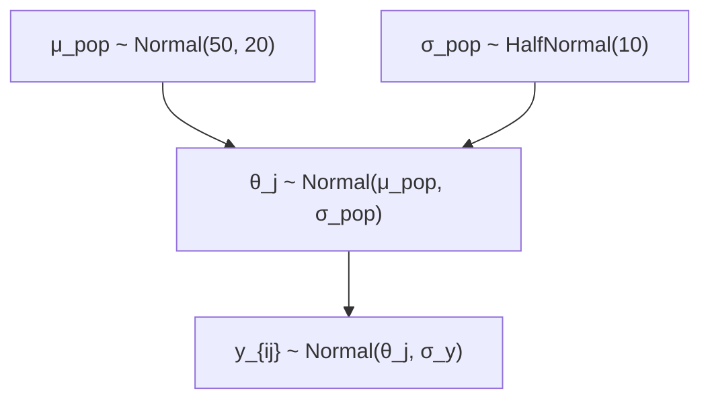
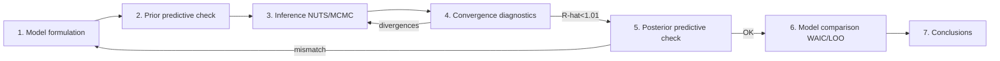

# Study Material 2 — Foundations of Bayesian statistics

> 🌐 **English** | [日本語](theory-bayesian-basics.ja.md)

> A staged walkthrough from the core principles of Bayesian inference to the hierarchical
> models supported by `Hanalyze.Model.HBM`.

## 1. Bayes' theorem

Probability identity:

$$ P(A \cap B) = P(A \mid B) P(B) = P(B \mid A) P(A) $$

Rearrange to obtain **Bayes' theorem**:

$$ \boxed{P(A \mid B) = \frac{P(B \mid A) P(A)}{P(B)}} $$

### In a parameter-estimation context

Replace random variables with "parameter $\theta$" and "data $y$":

$$ p(\theta \mid y) = \frac{p(y \mid \theta) \, p(\theta)}{p(y)} $$

| Name | Symbol | Meaning |
|---|---|---|
| **Prior** | $p(\theta)$ | belief before seeing data |
| **Likelihood** | $p(y \mid \theta)$ | probability of $y$ under $\theta$ |
| **Posterior** | $p(\theta \mid y)$ | belief after seeing data |
| **Marginal likelihood / evidence** | $p(y) = \int p(y\mid\theta) p(\theta) d\theta$ | marginal of $y$ |

Central thesis of Bayesian inference:

> **Prior belief × likelihood of the data → posterior belief**

posterior $\propto$ prior × likelihood (the constant $p(y)$ is just normalisation).

### Example: estimating a coin's bias

- Prior: $\theta \sim \text{Beta}(2, 2)$ (slightly favouring 0.5).
- Likelihood: $y_i \sim \text{Bernoulli}(\theta)$ (10 flips, 7 heads).
- Posterior: $\theta \mid y \sim \text{Beta}(2 + 7, 2 + 3) = \text{Beta}(9, 5)$.

Just add (success count, failure count) = (7, 3) to the prior parameters $(2, 2)$.
That is the power of **conjugacy**.

### Writing it in hanalyze

```haskell
coinModel :: ModelP ()
coinModel = do
  theta <- sample "theta" (Beta 2 2)              -- prior
  observe "y" (Bernoulli theta) coinFlips         -- likelihood
  -- Posterior is approximated by NUTS / Gibbs / …
```

---

## 2. The meaning of likelihood

The likelihood $p(y \mid \theta)$,

- treats **the data as fixed**;
- is a **function of the parameter**;
- expresses "how likely this data is under this parameter".

It is **not** a probability distribution (does not integrate to 1 over the parameter space).

### Log-likelihood

In implementation, multiplying densities causes overflow, so we **work in log-space**:

$$ \log p(y_1, \ldots, y_n \mid \theta) = \sum_{i=1}^n \log p(y_i \mid \theta) $$

hanalyze's `logJoint` computes log posterior ∝ log prior + log likelihood.

```haskell
logJoint :: (Floating a, Ord a) => Model a r -> Map Text a -> a
-- internally accumulates logDensity from sample and logDensityObs from observe
```

---

## 3. Choosing a prior

### 3.1 Conjugate priors

Combinations where **prior and posterior are in the same family** — closed form.

| Likelihood | Conjugate prior | Posterior (parameter update) |
|---|---|---|
| Bernoulli/Binomial$(n, p)$ | Beta$(\alpha, \beta)$ | Beta$(\alpha + k, \beta + n - k)$ |
| Poisson$(\lambda)$ | Gamma$(\alpha, \beta)$ | Gamma$(\alpha + \sum y, \beta + n)$ |
| Multinomial$(n, \boldsymbol\pi)$ | Dirichlet$(\boldsymbol\alpha)$ | Dirichlet$(\alpha_k + \text{count}_k)$ |
| Normal$(\mu, \sigma)$, σ known | Normal$(\mu_0, \sigma_0)$ | weighted-average update |
| Normal$(\mu, \sigma)$, μ known | InverseGamma$(\alpha, \beta)$ | sum-of-squares update |

`Hanalyze.MCMC.Gibbs.gibbsMH` automatically detects conjugate structure in the model and samples
those parameters directly (fast).

### 3.2 Weakly informative priors

"Uninformative" enough not to drive estimates, but informative enough to prevent runaways:

- mean: `Normal 0 (large scale)` (e.g. 10× the data SD).
- standard deviation: `HalfNormal` or `HalfCauchy` (Gelman 2006 recommends).
- probability: `Beta 1 1` or `Beta 2 2`.
- correlation matrix: `LKJ(1)`.

### 3.3 Informative priors

Encode domain knowledge — "expert priors" reflecting prior research or domain constraints.

### 3.4 Improper / flat priors

**Avoid**. A divergent prior may produce an undefined posterior. Use a weakly informative
prior instead.

---

## 4. Hierarchical Bayesian models (HBM)

### 4.1 Motivation

Parameters depend on further parameters (= **hyperparameters**).
Multi-group data can be decomposed into "overall trend" + "per-group deviation".

### 4.2 Example: school-level test scores

- Want each school's mean score $\theta_j$.
- But each school has few samples.
- Assume $\theta_j$ are draws from a **shared population distribution**.



This model:
- **Partially shares** information across schools through the population.
- Sparsely sampled schools **shrink** towards $\mu_{\text{pop}}$.
- Densely sampled schools stay near their own mean.

### 4.3 In hanalyze

```haskell
schoolModel :: ModelP ()
schoolModel = do
  muPop  <- sample "mu_pop"  (Normal 50 20)
  sigPop <- sample "sig_pop" (HalfNormal 10)
  -- effects for J schools
  thetas <- mapM (\j -> sample ("theta_" <> tShow j)
                                (Normal muPop sigPop))
                 [1 .. nSchools]
  -- observations per school
  forM_ (zip thetas dataByschool) $ \(theta, ys) ->
    observe ("y_" <> ...) (Normal theta sigY) ys
```

Or **non-centered** with `nonCenteredNormal`:

```haskell
schoolModelNC :: ModelP ()
schoolModelNC = do
  muPop  <- sample "mu_pop"  (Normal 50 20)
  sigPop <- sample "sig_pop" (HalfNormal 10)
  thetas <- mapM (\j -> nonCenteredNormal ("theta_" <> tShow j)
                                          muPop sigPop)
                 [1 .. nSchools]
  ...
```

Non-centering samples `θ_raw ~ Normal(0,1)` and records `θ = μ + σ × raw` as a derived
quantity — preventing HMC divergences when data are sparse.

### 4.4 The funnel problem

In hierarchical models, when `σ_pop` is small the distribution of $\theta_j$ becomes a
funnel and HMC struggles. Demonstrated by `energy-demo` / `noncentered-demo`
(BFMI 0.65 → 1.02, ESS ×7.6).

---

## 5. Marginal likelihood (evidence) and model selection

The normalising constant $p(y) = \int p(y \mid \theta) p(\theta) d\theta$ is usually
ignored in posterior computation but matters for model comparison:

### Bayes factor

Comparing two models:

$$ \text{BF}_{12} = \frac{p(y \mid M_1)}{p(y \mid M_2)} $$

- BF > 10: strong support for M1.
- BF < 1/10: strong support for M2.

Computing $p(y | M)$ is hard (high-dimensional integral) — not implemented in hanalyze.
Use **WAIC** / **LOO-CV** instead ([06-model-comparison.md](06-model-comparison.md)).

---

## 6. Posterior predictive distribution

For a new observation $\tilde{y}$:

$$ p(\tilde{y} \mid y) = \int p(\tilde{y} \mid \theta) p(\theta \mid y) d\theta $$

"Draw $\tilde{y}$ from each posterior $\theta$, then mix the draws."
Implemented in `Hanalyze.Stat.PosteriorPredictive.posteriorPredictive`.

### Prior predictive

Predicting before seeing data:

$$ p(\tilde{y}) = \int p(\tilde{y} \mid \theta) p(\theta) d\theta $$

Used to sanity-check the prior (= "is it reasonable that this prior produces such an
extreme observation?"). `priorPredictive`.

---

## 7. The standard Bayesian workflow



### hanalyze pieces per step

| Step | Tool |
|---|---|
| 1. Model formulation | `Hanalyze.Model.HBM` (DSL) |
| 2. Prior predictive | `Hanalyze.Stat.PosteriorPredictive.priorPredictive` |
| 3. Inference | `Hanalyze.MCMC.NUTS.nuts`, `Hanalyze.MCMC.HMC.hmc`, `Hanalyze.MCMC.MH.metropolis`, `Hanalyze.MCMC.Gibbs`, `Hanalyze.MCMC.Slice` |
| 4. Convergence | `Hanalyze.Stat.MCMC.rhat`, `ess`, `bfmi`; `Hanalyze.Viz.MCMC.{trace,rank,energy}Plot`; `chainDivergences` |
| 5. Posterior predictive | `Hanalyze.Stat.PosteriorPredictive.posteriorPredictive` + `Hanalyze.Viz.MCMC.ppcPlot` |
| 6. Model comparison | `Hanalyze.Stat.ModelSelect.{waic, loo, compareModels}` |
| 7. Conclusions | `Hanalyze.Viz.MCMC.posteriorSummary*`, `forestPlot`, `Hanalyze.Viz.Report.renderReport` |

---

## Next steps

- Inference algorithms → [theory-mcmc.md](theory-mcmc.md).
- Conjugacy-based Gibbs sampling → [04-gibbs.md](04-gibbs.md).
- Hierarchical-model demos → `cabal run integrated-demo`, `noncentered-demo`,
  `mvnormal-latent-demo`.
