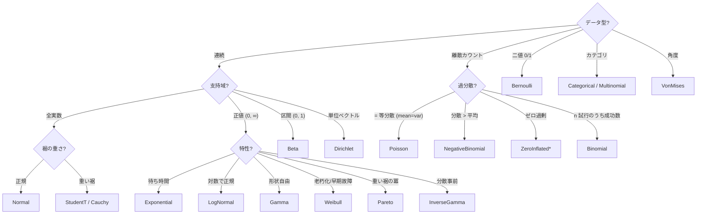

# 学習資料 1 — 確率分布の基礎

> hanalyze の `Hanalyze.Model.HBM.Distribution` で実装している全分布について、
> 数式・直観・典型的な用途を解説。
> 関係図は [01-distributions.ja.md](01-distributions.ja.md) を参照。

## 0. 確率の基礎用語

| 用語 | 意味 |
|---|---|
| **確率変数** $X$ | ランダムにとる値 |
| **PMF** (確率質量関数) | 離散変数の $P(X = k)$ |
| **PDF** (確率密度関数) $p(x)$ | 連続変数の密度。$\int p(x) dx = 1$ |
| **CDF** (累積分布関数) $F(x) = P(X \le x)$ | 単調非減少 |
| **期待値** $E[X]$ | 平均 (= 分布の重心) |
| **分散** $\text{Var}(X) = E[(X - E[X])^2]$ | ばらつき |
| **モード** | 密度が最大の点 |

ベイズの観点では「モデルの**事前**」「データの**尤度**」「結果の**事後**」
全てが確率分布。

---

## 1. 連続分布

### 1.1 Normal (正規分布) — `Normal μ σ`

$$ p(x) = \frac{1}{\sqrt{2\pi}\sigma} \exp\!\left(-\frac{(x-\mu)^2}{2\sigma^2}\right) $$

- **支持域**: 実数全体 $\mathbb{R}$
- **mean**: $\mu$, **var**: $\sigma^2$
- **直観**: 中心極限定理により「多数の独立な微小要因の和」の極限。
  最も重要な分布。デフォルトで使う。
- **用途**: 連続観測の尤度、線形回帰の誤差項、ベイズ事前 (location parameter)。
- **Note**: 標準偏差 $\sigma$ は scale パラメタなので、HMC の transform は
  `UnconstrainedT` (制約なし)。

### 1.2 HalfNormal (半正規分布) — `HalfNormal σ`

$$ p(x) = \sqrt{\frac{2}{\pi}}\frac{1}{\sigma} \exp\!\left(-\frac{x^2}{2\sigma^2}\right), \quad x \ge 0 $$

- **支持域**: $x \ge 0$
- **直観**: $|Z|$ where $Z \sim N(0, \sigma)$。Normal を 0 で折り返したもの。
- **用途**: scale パラメタの事前 (Stan / PyMC ベストプラクティス)。
  「無情報だが positive な値」を表現する弱情報事前。

### 1.3 LogNormal (対数正規) — `LogNormal μ σ`

$$ p(x) = \frac{1}{x\sqrt{2\pi}\sigma}\exp\!\left(-\frac{(\log x - \mu)^2}{2\sigma^2}\right), \quad x > 0 $$

- **支持域**: $x > 0$
- **mean**: $e^{\mu + \sigma^2/2}$
- **直観**: $\log Y \sim \text{Normal}(\mu, \sigma)$ ⇔ $Y \sim \text{LogNormal}$。
  生存時間や所得など「桁が広く正の量」に。
- **用途**: 物価、生物の体重、薬物濃度など右に裾を引いた正値データ。

### 1.4 StudentT (t 分布) — `StudentT ν μ σ`

$$ p(x) = \frac{\Gamma\!\left(\frac{\nu+1}{2}\right)}{\Gamma(\nu/2)\sqrt{\nu\pi}\sigma}
       \left(1 + \frac{(x-\mu)^2}{\nu\sigma^2}\right)^{-(\nu+1)/2} $$

- **直観**: Normal より裾が重い。$\nu \to \infty$ で Normal に収束、
  $\nu = 1$ で Cauchy。
- **用途**:
  - 外れ値ロバストな観測モデル ($\nu = 3 \sim 5$ 付近)
  - 弱情報事前として $\nu = 3, \mu = 0$ など

### 1.5 Cauchy (コーシー分布) — `Cauchy loc scale`

$$ p(x) = \frac{1}{\pi \gamma}\frac{1}{1 + ((x-x_0)/\gamma)^2} $$

- **平均・分散が定義されない** (積分が発散)
- **用途**:
  - 極めて裾の重いロバスト事前
  - 物理現象 (Lorentz 線形)

### 1.6 HalfCauchy — `HalfCauchy γ`

- 0 で折り返した Cauchy
- **scale パラメタの "default" 弱情報事前** として PyMC で頻用 (Gelman 2006)。
  HalfNormal よりさらに裾が重く、大きな値も許容。

### 1.7 Exponential (指数分布) — `Exponential rate`

$$ p(x) = \lambda e^{-\lambda x}, \quad x \ge 0 $$

- **mean**: $1/\lambda$
- **直観**: ポアソン過程の **待ち時間**。「次のイベントまで」の時間。
- **メモリレス性**: $P(X > s+t \mid X > s) = P(X > t)$ (過去によらない)
- **用途**: 故障時刻、到着時間、生存解析の最初の選択肢。

### 1.8 Gamma — `Gamma shape rate`

$$ p(x) = \frac{\beta^\alpha}{\Gamma(\alpha)} x^{\alpha-1} e^{-\beta x}, \quad x > 0 $$

- **mean**: $\alpha/\beta$, **var**: $\alpha/\beta^2$
- **直観**: $\alpha$ 個の独立な Exp の和 = Gamma$(\alpha, \lambda)$。
  $\alpha = 1$ で Exponential、$\alpha = k/2, \beta = 1/2$ で $\chi^2(k)$。
- **用途**: 待ち時間の和、形状パラメタ事前、Poisson の rate 共役事前。

### 1.9 InverseGamma — `InverseGamma α β`

$$ p(x) = \frac{\beta^\alpha}{\Gamma(\alpha)} x^{-\alpha-1} e^{-\beta/x}, \quad x > 0 $$

- $X \sim \text{Gamma}(\alpha, \beta)$ ⇔ $1/X \sim \text{InverseGamma}(\alpha, \beta)$
- **用途**: Normal の **分散 $\sigma^2$ の共役事前**。Normal-InvGamma 共役対は閉形式の事後をもつ。

### 1.10 Beta — `Beta α β`

$$ p(x) = \frac{x^{\alpha-1}(1-x)^{\beta-1}}{B(\alpha, \beta)}, \quad x \in (0, 1) $$

- **mean**: $\alpha / (\alpha + \beta)$
- **直観**: $\alpha, \beta$ は「成功と失敗の擬似カウント」。
  $\text{Beta}(1, 1)$ = uniform、$\text{Beta}(\alpha, \beta)$ で
  $\alpha + \beta$ が大きいと集中。
- **用途**: 確率パラメタ $p$ (二項分布の) の **共役事前**。

### 1.11 Uniform — `Uniform a b`

$$ p(x) = \frac{1}{b-a}, \quad x \in [a, b] $$

- 「真の分布が分からないが、ある区間にある」場合に使う最弱情報事前。
- HMC の transform は `UnconstrainedT` だが、本来は logit-on-(a,b) 変換が望ましい。
  hanalyze では暗黙の制約が `logDensity` 内で扱われる。

### 1.12 Weibull — `Weibull k λ`

$$ p(x) = \frac{k}{\lambda}\!\left(\frac{x}{\lambda}\right)^{k-1} \exp\!\left(-(x/\lambda)^k\right) $$

- **k = 1** で Exponential$(1/\lambda)$
- **k = 2** で Rayleigh
- **直観**: hazard rate が $h(t) = (k/\lambda)(t/\lambda)^{k-1}$ となり、
  - $k < 1$: 早期故障 (浴槽カーブ左)
  - $k = 1$: 一定 (memoryless)
  - $k > 1$: 老朽化 (浴槽カーブ右)
- **用途**: 工学的な信頼性、生存解析の典型分布。

### 1.13 Pareto — `Pareto α x_m`

$$ p(x) = \frac{\alpha x_m^\alpha}{x^{\alpha+1}}, \quad x \ge x_m $$

- **mean**: $\alpha x_m / (\alpha - 1)$ ($\alpha > 1$)
- **直観**: 「80-20 の法則」。富の分布、都市人口、自然災害の規模。
- **用途**: 重い裾現象のモデリング、極値統計。

### 1.14 VonMises — `VonMises μ κ`

$$ p(x) = \frac{e^{\kappa \cos(x - \mu)}}{2\pi I_0(\kappa)}, \quad x \in (-\pi, \pi] $$

- **直観**: 角度上の "Normal"。$\kappa$ は集中度。
  $\kappa \to 0$ で Uniform、$\kappa \to \infty$ で Normal$(\mu, 1/\sqrt{\kappa})$。
- **用途**: 風向、コンパス測定、円形データ。

---

## 2. 離散分布

### 2.1 Bernoulli — `Bernoulli p`

$$ P(X = 1) = p, \quad P(X = 0) = 1-p $$

- 0/1 の二値変数。コイン投げの 1 回。

### 2.2 Binomial — `Binomial n p`

$$ P(X = k) = \binom{n}{k} p^k (1-p)^{n-k}, \quad k = 0, \ldots, n $$

- **mean**: $np$, **var**: $np(1-p)$
- **直観**: $n$ 回の独立な Bernoulli$(p)$ 試行の成功数。
- **極限**:
  - $n \to \infty, p \to 0, np = \lambda$ 固定 → Poisson$(\lambda)$ (**ポアソン近似**)
  - $n \to \infty, p$ 固定 → Normal$(np, \sqrt{np(1-p)})$ (**De Moivre-Laplace**)

### 2.3 Categorical — `Categorical [p_1, ..., p_K]`

- $K$ カテゴリのうち 1 つを選ぶ (`probs` ベクトル)。
- $K = 2$ で Bernoulli。

### 2.4 Multinomial — `Multinomial n [p_1, ..., p_K]`

$$ P(\mathbf{k}) = \frac{n!}{k_1! \cdots k_K!} \prod p_i^{k_i} $$

- **直観**: $n$ 回 Categorical を引いた集計。
- **共役**: Dirichlet 事前。

### 2.5 Poisson — `Poisson λ`

$$ P(X = k) = \frac{\lambda^k e^{-\lambda}}{k!} $$

- **mean = var = λ** (= 等分散の特徴)
- **直観**: 単位時間あたりの **稀なイベント数**。電話着信、放射線崩壊、
  ウェブサイトのアクセス件数。
- **用途**: カウントデータの基本モデル。

### 2.6 NegativeBinomial — `NegativeBinomial μ α`

$$ P(X = k) = \binom{k + \alpha - 1}{k} \!\left(\frac{\alpha}{\alpha + \mu}\right)^\alpha \!\left(\frac{\mu}{\alpha + \mu}\right)^k $$

- **mean**: $\mu$, **var**: $\mu + \mu^2/\alpha$ (**過分散** を表現できる)
- $\alpha \to \infty$ で Poisson に収束。
- **用途**: 「観測平均 < 観測分散」のカウントデータ。Poisson より柔軟。

### 2.7 ZeroInflatedPoisson / ZeroInflatedBinomial

$$ P(0) = \psi + (1-\psi) P_d(0), \quad P(k>0) = (1-\psi) P_d(k) $$

- $\psi$ は **構造的ゼロの確率** (= 「そもそもイベント不可能」)。
- **用途**: 釣果 (魚を釣る人と釣らない人がいる)、保険請求 (事故なし vs ゼロ請求)。

### 2.8 BetaBinomial — `BetaBinomial n α β`

- $p \sim \text{Beta}(\alpha, \beta)$, $X \mid p \sim \text{Binomial}(n, p)$ の周辺化。
- 過分散二項。$\alpha, \beta$ 大で Binomial に収束。

---

## 3. 多変量と機能性分布

### 3.1 MvNormal — `MvNormal μ Σ`

$$ p(\mathbf{x}) = \frac{1}{(2\pi)^{K/2} |\Sigma|^{1/2}} \exp\!\left(-\tfrac{1}{2}(\mathbf{x} - \boldsymbol\mu)^T \Sigma^{-1} (\mathbf{x} - \boldsymbol\mu)\right) $$

- $K$ 次元の正規分布。$\Sigma$ は対称正定値共分散行列。
- **用途**: 相関を持つ多変量観測、階層モデルの latent ベクトル。
- hanalyze: 観測には `MvNormal` + `observeMV`、latent には `mvNormalLatent`
  (Cholesky 経由非中心化)。

### 3.2 Dirichlet — `dirichlet name [α_1, ..., α_K]`

$$ p(\boldsymbol\pi) = \frac{1}{B(\boldsymbol\alpha)} \prod \pi_i^{\alpha_i - 1}, \quad \pi_i \ge 0, \sum \pi_i = 1 $$

- シンプレックス上の分布。Multinomial の **共役事前**。
- $\alpha_i = 1$ for all $i$ で uniform on simplex。
- hanalyze: stick-breaking で K-1 個の Beta latent に展開。

### 3.3 Mixture — `Mixture [w_k] [d_k]`

$$ p(x) = \sum_k w_k \, p_k(x) $$

- **直観**: 隠れたサブグループ。
- **用途**: クラスタリング、外れ値モデル ($w$ 小の wide コンポーネント)。

### 3.4 Truncated / Censored

- `Truncated d lo hi`: 範囲内の観測のみ、CDF 補正で正規化
- `Censored d lo hi`: 範囲外もデータに含むが「しきい値以上/以下」とのみ判明

### 3.5 LKJ — `lkjCorrCholesky name K η`

$$ p(R) \propto |R|^{\eta - 1} $$

- 相関行列 $R$ ($K \times K$, 対角 1, 対称正定値) の事前。
- $\eta = 1$ で uniform on correlation matrices、$\eta > 1$ で I に集中。
- 共分散事前は **diag(σ) R diag(σ)** 分解で `LKJ + scale` を合成。

---

## 4. 分布の選び方フローチャート

---

## 次のステップ

- **共役関係を活かした推論**: [theory-bayesian-basics.ja.md](theory-bayesian-basics.ja.md) (M2)
- **分布のサンプリング・密度評価の実装**: `Hanalyze.Model.HBM` の `logDensity` / `sampleDist` を読む
- **可視化**: `cabal run histogram-demo` (各分布のヒストグラム + 理論密度の重ね描き)
