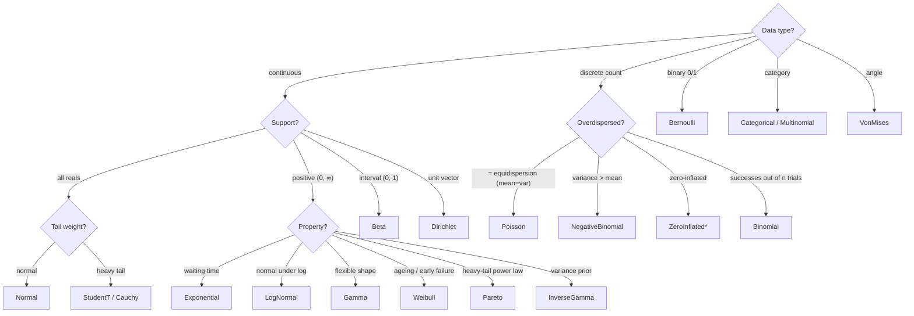

# Study Material 1 — Foundations of probability distributions

> 🌐 **English** | [日本語](theory-distributions.ja.md)

> Formulas, intuition, and typical uses for every distribution implemented in
> hanalyze's `Model.HBM.Distribution`. The relationship map is in
> [01-distributions.md](01-distributions.md).

## 0. Probability vocabulary

| Term | Meaning |
|---|---|
| **Random variable** $X$ | a value with random outcome |
| **PMF** (probability mass function) | $P(X = k)$ for discrete |
| **PDF** (probability density function) $p(x)$ | density for continuous; $\int p(x) dx = 1$ |
| **CDF** (cumulative distribution function) $F(x) = P(X \le x)$ | non-decreasing |
| **Expectation** $E[X]$ | mean (centre of mass) |
| **Variance** $\text{Var}(X) = E[(X - E[X])^2]$ | spread |
| **Mode** | location of maximum density |

In Bayesian terms the **prior** of the model, the **likelihood** of the data, and the
**posterior** of the result are all probability distributions.

---

## 1. Continuous distributions

### 1.1 Normal — `Normal μ σ`

$$ p(x) = \frac{1}{\sqrt{2\pi}\sigma} \exp\!\left(-\frac{(x-\mu)^2}{2\sigma^2}\right) $$

- **Support**: all reals $\mathbb{R}$.
- **Mean**: $\mu$, **Variance**: $\sigma^2$.
- **Intuition**: by the Central Limit Theorem, the limit of "sum of many independent
  small contributions". Most important distribution; default choice.
- **Uses**: continuous-observation likelihoods, error term in linear regression, Bayesian
  priors on location parameters.
- **Note**: $\sigma$ is a scale parameter, so the HMC transform is `UnconstrainedT` (no constraint).

### 1.2 HalfNormal — `HalfNormal σ`

$$ p(x) = \sqrt{\frac{2}{\pi}}\frac{1}{\sigma} \exp\!\left(-\frac{x^2}{2\sigma^2}\right), \quad x \ge 0 $$

- **Support**: $x \ge 0$.
- **Intuition**: $|Z|$ where $Z \sim N(0, \sigma)$. Normal folded at zero.
- **Uses**: priors on scale parameters (Stan / PyMC best practice). A weakly informative
  prior expressing "uninformative but positive".

### 1.3 LogNormal — `LogNormal μ σ`

$$ p(x) = \frac{1}{x\sqrt{2\pi}\sigma}\exp\!\left(-\frac{(\log x - \mu)^2}{2\sigma^2}\right), \quad x > 0 $$

- **Support**: $x > 0$.
- **Mean**: $e^{\mu + \sigma^2/2}$.
- **Intuition**: $\log Y \sim \text{Normal}(\mu, \sigma)$ ⇔ $Y \sim \text{LogNormal}$.
  Suitable for survival times, income, etc. — positive quantities spanning many orders of magnitude.
- **Uses**: prices, biological weights, drug concentrations — positive right-skewed data.

### 1.4 StudentT — `StudentT ν μ σ`

$$ p(x) = \frac{\Gamma\!\left(\frac{\nu+1}{2}\right)}{\Gamma(\nu/2)\sqrt{\nu\pi}\sigma}
       \left(1 + \frac{(x-\mu)^2}{\nu\sigma^2}\right)^{-(\nu+1)/2} $$

- **Intuition**: heavier-tailed than Normal. As $\nu \to \infty$ converges to Normal;
  $\nu = 1$ is Cauchy.
- **Uses**:
  - outlier-robust observation model ($\nu \approx 3$–5);
  - weakly informative priors such as $\nu = 3, \mu = 0$.

### 1.5 Cauchy — `Cauchy loc scale`

$$ p(x) = \frac{1}{\pi \gamma}\frac{1}{1 + ((x-x_0)/\gamma)^2} $$

- **Mean and variance are undefined** (divergent integrals).
- **Uses**:
  - extremely heavy-tailed robust priors;
  - physics (Lorentz line shape).

### 1.6 HalfCauchy — `HalfCauchy γ`

- Cauchy folded at zero.
- A **default weakly informative prior on scale parameters** in PyMC (Gelman 2006).
  Heavier-tailed than HalfNormal, allowing larger values.

### 1.7 Exponential — `Exponential rate`

$$ p(x) = \lambda e^{-\lambda x}, \quad x \ge 0 $$

- **Mean**: $1/\lambda$.
- **Intuition**: **inter-arrival time** of a Poisson process.
- **Memoryless**: $P(X > s+t \mid X > s) = P(X > t)$ (independent of past).
- **Uses**: failure times, arrival times, first choice for survival analysis.

### 1.8 Gamma — `Gamma shape rate`

$$ p(x) = \frac{\beta^\alpha}{\Gamma(\alpha)} x^{\alpha-1} e^{-\beta x}, \quad x > 0 $$

- **Mean**: $\alpha/\beta$, **Variance**: $\alpha/\beta^2$.
- **Intuition**: sum of $\alpha$ independent Exp($\lambda$) → Gamma($\alpha, \lambda$).
  $\alpha = 1$ → Exponential; $\alpha = k/2, \beta = 1/2$ → $\chi^2(k)$.
- **Uses**: sums of waiting times, shape-parameter priors, conjugate prior for the Poisson rate.

### 1.9 InverseGamma — `InverseGamma α β`

$$ p(x) = \frac{\beta^\alpha}{\Gamma(\alpha)} x^{-\alpha-1} e^{-\beta/x}, \quad x > 0 $$

- $X \sim \text{Gamma}(\alpha, \beta)$ ⇔ $1/X \sim \text{InverseGamma}(\alpha, \beta)$.
- **Use**: conjugate prior for Normal **variance $\sigma^2$**. Normal–InvGamma yields a closed-form posterior.

### 1.10 Beta — `Beta α β`

$$ p(x) = \frac{x^{\alpha-1}(1-x)^{\beta-1}}{B(\alpha, \beta)}, \quad x \in (0, 1) $$

- **Mean**: $\alpha / (\alpha + \beta)$.
- **Intuition**: $\alpha, \beta$ are pseudo-counts of successes and failures.
  $\text{Beta}(1, 1)$ is uniform; large $\alpha + \beta$ concentrates the mass.
- **Use**: conjugate prior for the binomial probability $p$.

### 1.11 Uniform — `Uniform a b`

$$ p(x) = \frac{1}{b-a}, \quad x \in [a, b] $$

- The weakest prior to use when "the truth is unknown but lies in some interval".
- HMC transform is `UnconstrainedT`; ideally a logit-on-(a,b) transform would be used.
  hanalyze handles the implicit constraint inside `logDensity`.

### 1.12 Weibull — `Weibull k λ`

$$ p(x) = \frac{k}{\lambda}\!\left(\frac{x}{\lambda}\right)^{k-1} \exp\!\left(-(x/\lambda)^k\right) $$

- **k = 1** is Exponential$(1/\lambda)$.
- **k = 2** is Rayleigh.
- **Intuition**: hazard rate $h(t) = (k/\lambda)(t/\lambda)^{k-1}$:
  - $k < 1$: early failures (left side of bathtub).
  - $k = 1$: constant (memoryless).
  - $k > 1$: ageing (right side of bathtub).
- **Use**: engineering reliability, classic survival analysis distribution.

### 1.13 Pareto — `Pareto α x_m`

$$ p(x) = \frac{\alpha x_m^\alpha}{x^{\alpha+1}}, \quad x \ge x_m $$

- **Mean**: $\alpha x_m / (\alpha - 1)$ for $\alpha > 1$.
- **Intuition**: "80–20 rule" — wealth distribution, city populations, natural-disaster magnitudes.
- **Use**: heavy-tailed phenomena, extreme-value statistics.

### 1.14 VonMises — `VonMises μ κ`

$$ p(x) = \frac{e^{\kappa \cos(x - \mu)}}{2\pi I_0(\kappa)}, \quad x \in (-\pi, \pi] $$

- **Intuition**: "Normal" on the circle. $\kappa$ controls concentration.
  $\kappa \to 0$ → Uniform; $\kappa \to \infty$ → Normal$(\mu, 1/\sqrt{\kappa})$.
- **Use**: wind directions, compass measurements, circular data.

---

## 2. Discrete distributions

### 2.1 Bernoulli — `Bernoulli p`

$$ P(X = 1) = p, \quad P(X = 0) = 1-p $$

- 0/1 binary variable. One coin flip.

### 2.2 Binomial — `Binomial n p`

$$ P(X = k) = \binom{n}{k} p^k (1-p)^{n-k}, \quad k = 0, \ldots, n $$

- **Mean**: $np$, **Variance**: $np(1-p)$.
- **Intuition**: number of successes in $n$ independent Bernoulli$(p)$ trials.
- **Limits**:
  - $n \to \infty, p \to 0, np = \lambda$ fixed → Poisson$(\lambda)$ (**Poisson approximation**).
  - $n \to \infty, p$ fixed → Normal$(np, \sqrt{np(1-p)})$ (**De Moivre–Laplace**).

### 2.3 Categorical — `Categorical [p_1, ..., p_K]`

- Picks one of $K$ categories (probability vector `probs`).
- $K = 2$ reduces to Bernoulli.

### 2.4 Multinomial — `Multinomial n [p_1, ..., p_K]`

$$ P(\mathbf{k}) = \frac{n!}{k_1! \cdots k_K!} \prod p_i^{k_i} $$

- **Intuition**: aggregating $n$ Categorical draws.
- **Conjugate**: Dirichlet prior.

### 2.5 Poisson — `Poisson λ`

$$ P(X = k) = \frac{\lambda^k e^{-\lambda}}{k!} $$

- **Mean = Variance = λ** (an equidispersion signature).
- **Intuition**: number of **rare events per unit time**. Phone arrivals, radioactive decay, web hits.
- **Use**: baseline model for count data.

### 2.6 NegativeBinomial — `NegativeBinomial μ α`

$$ P(X = k) = \binom{k + \alpha - 1}{k} \!\left(\frac{\alpha}{\alpha + \mu}\right)^\alpha \!\left(\frac{\mu}{\alpha + \mu}\right)^k $$

- **Mean**: $\mu$, **Variance**: $\mu + \mu^2/\alpha$ (can express **overdispersion**).
- $\alpha \to \infty$ → Poisson.
- **Use**: count data with observed variance > observed mean. More flexible than Poisson.

### 2.7 ZeroInflatedPoisson / ZeroInflatedBinomial

$$ P(0) = \psi + (1-\psi) P_d(0), \quad P(k>0) = (1-\psi) P_d(k) $$

- $\psi$ is the **probability of a structural zero** ("event impossible by structure").
- **Use**: catch counts (some anglers never fish), insurance claims (no accidents vs. zero claims).

### 2.8 BetaBinomial — `BetaBinomial n α β`

- Marginalisation of $p \sim \text{Beta}(\alpha, \beta)$, $X \mid p \sim \text{Binomial}(n, p)$.
- Overdispersed binomial. Large $\alpha, \beta$ converge to plain Binomial.

---

## 3. Multivariate / functional distributions

### 3.1 MvNormal — `MvNormal μ Σ`

$$ p(\mathbf{x}) = \frac{1}{(2\pi)^{K/2} |\Sigma|^{1/2}} \exp\!\left(-\tfrac{1}{2}(\mathbf{x} - \boldsymbol\mu)^T \Sigma^{-1} (\mathbf{x} - \boldsymbol\mu)\right) $$

- $K$-dimensional normal. $\Sigma$ is a symmetric positive-definite covariance matrix.
- **Use**: correlated multivariate observations, latent vectors in hierarchical models.
- hanalyze: `MvNormal` + `observeMV` for observations; `mvNormalLatent` (non-centered via Cholesky) for latents.

### 3.2 Dirichlet — `dirichlet name [α_1, ..., α_K]`

$$ p(\boldsymbol\pi) = \frac{1}{B(\boldsymbol\alpha)} \prod \pi_i^{\alpha_i - 1}, \quad \pi_i \ge 0, \sum \pi_i = 1 $$

- Distribution on the simplex; **conjugate prior** for the Multinomial.
- $\alpha_i = 1$ for all $i$ is uniform on the simplex.
- hanalyze: stick-breaking expansion to K-1 Beta latents.

### 3.3 Mixture — `Mixture [w_k] [d_k]`

$$ p(x) = \sum_k w_k \, p_k(x) $$

- **Intuition**: hidden subgroups.
- **Use**: clustering, outlier model (a wide component with small weight).

### 3.4 Truncated / Censored

- `Truncated d lo hi`: only in-range observations, normalised by CDF correction.
- `Censored d lo hi`: data outside the range still contribute, observed only as "below/above the threshold".

### 3.5 LKJ — `lkjCorrCholesky name K η`

$$ p(R) \propto |R|^{\eta - 1} $$

- Prior on a correlation matrix $R$ ($K \times K$, diagonal 1, symmetric positive definite).
- $\eta = 1$ is uniform on correlation matrices; $\eta > 1$ concentrates near $I$.
- A covariance prior is composed via the **diag(σ) R diag(σ)** decomposition (`LKJ + scale`).

---

## 4. Choosing a distribution — flowchart

---

## Next steps

- **Inference exploiting conjugacy**: [theory-bayesian-basics.md](theory-bayesian-basics.md).
- **Sampling and density evaluation in code**: read `logDensity` / `sampleDist` in `Model.HBM`.
- **Visualisation**: `cabal run histogram-demo` (theoretical density overlaid on a histogram per distribution).
