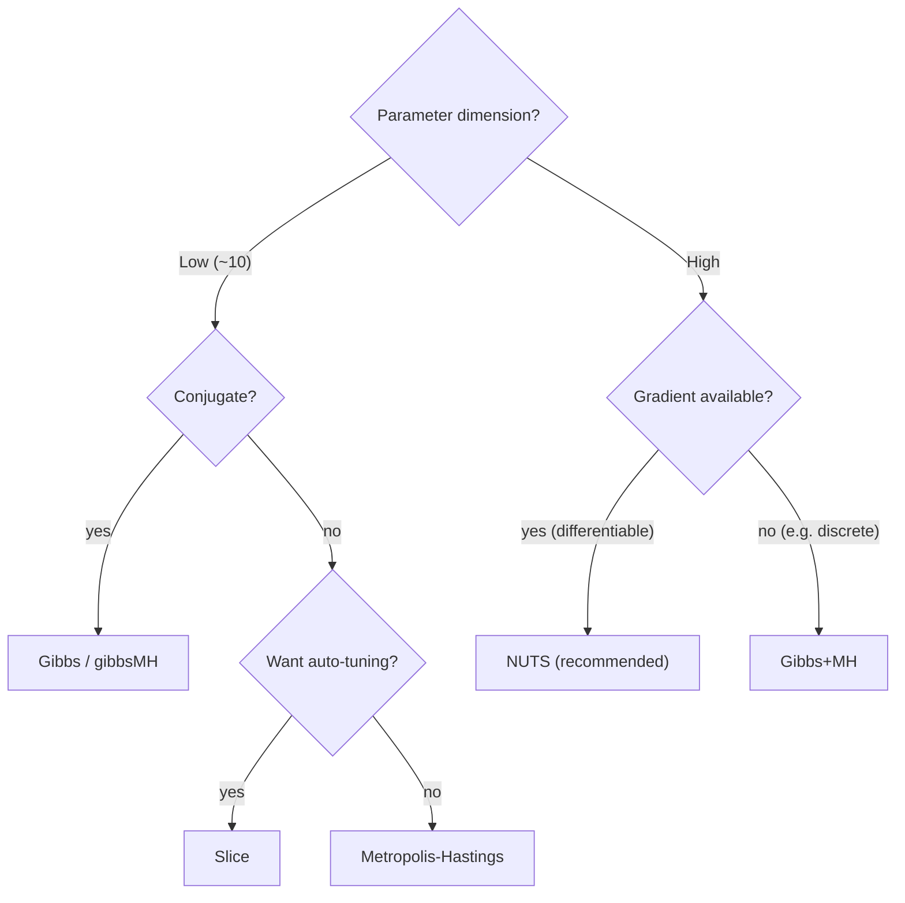

# Study Material 3 — MCMC fundamentals

> 🌐 **English** | [日本語](theory-mcmc.ja.md)

> Why does MCMC produce samples from the posterior? From the mathematical foundations to
> Metropolis-Hastings and Gibbs samplers.

## 1. Why MCMC?

The Bayesian posterior $p(\theta \mid y)$ usually:

- has an **incomputable normalising constant $p(y)$** (high-dimensional integral),
- has a **complex shape** (multimodal, asymmetric, skewed).

So no closed-form solution. Instead we obtain **samples from the posterior**
$\theta^{(1)}, \ldots, \theta^{(N)}$ and approximate expectations and quantiles
empirically:

$$ E_{\theta \sim p(\theta \mid y)}[f(\theta)] \approx \frac{1}{N} \sum_{n=1}^N f(\theta^{(n)}) $$

The question: **how do we get those samples?** → MCMC is the answer.

---

## 2. Markov chains

### 2.1 Definition

A sequence of random variables $\theta^{(0)}, \theta^{(1)}, \theta^{(2)}, \ldots$ has the
**Markov property** if:

$$ p(\theta^{(t+1)} \mid \theta^{(t)}, \theta^{(t-1)}, \ldots, \theta^{(0)}) = p(\theta^{(t+1)} \mid \theta^{(t)}) $$

"The next state depends only on the current state, not the past."

Fully determined by the transition kernel $K(\theta' \mid \theta) = p(\theta^{(t+1)} = \theta' \mid \theta^{(t)} = \theta)$.

### 2.2 Stationary distribution

A distribution $\pi$ is **stationary** if:

$$ \pi(\theta') = \int K(\theta' \mid \theta) \pi(\theta) d\theta $$

"Starting from $\pi$ and stepping forward leaves the distribution unchanged."

### 2.3 Detailed balance

Sufficient condition for stationarity:

$$ \pi(\theta) K(\theta' \mid \theta) = \pi(\theta') K(\theta \mid \theta') $$

(reversibility). MH and Gibbs are designed to satisfy this.

### 2.4 Ergodicity

The chain is **ergodic** if:

1. **Irreducible**: any two states are reachable in finitely many steps.
2. **Aperiodic**: no period-1 return constraint.
3. **Positive recurrent**: finite expected return time.

Ergodic + $\pi$ stationary ⇒

$$ \theta^{(t)} \xrightarrow{d} \pi \quad \text{as } t \to \infty $$

(starting from any initial distribution, the chain converges to $\pi$).

### 2.5 Law of large numbers

Under ergodicity, time averages converge to space averages:

$$ \frac{1}{N} \sum_{n=1}^N f(\theta^{(n)}) \xrightarrow{a.s.} E_{\pi}[f(\theta)] $$

This is **the justification for MCMC**.

---

## 3. Metropolis-Hastings (MH)

### 3.1 Algorithm

Sample from a target $\pi(\theta) \propto \tilde\pi(\theta)$ (no normalising constant needed):

```text
1. Propose θ' ~ q(·|θ) from current θ
2. Acceptance α = min(1, [π̃(θ')/π̃(θ)] × [q(θ|θ')/q(θ'|θ)])
3. u ~ Uniform(0,1); if u < α accept θ ← θ', otherwise stay
```

### 3.2 Why it works

It satisfies detailed balance:

$$ \pi(\theta) K(\theta'|\theta) = \pi(\theta) q(\theta'|\theta) \alpha(\theta, \theta') $$

With $\alpha = \min(1, r)$ and $r = \pi(\theta') q(\theta|\theta') / [\pi(\theta) q(\theta'|\theta)]$,
both sides simplify to the same expression (an easy algebraic check).

### 3.3 Random Walk Metropolis

Use $\theta' = \theta + \epsilon$, $\epsilon \sim \text{Normal}(0, s)$ (symmetric proposal). Then:

$$ \alpha = \min\!\left(1, \frac{\pi(\theta')}{\pi(\theta)}\right) $$

Simple but **inefficient in high dimensions**: maintaining the acceptance rate forces $s$
to scale like $1/\sqrt{D}$ → exploration is slow.

### 3.4 Step-size tuning

| Acceptance | State |
|---|---|
| < 20 % | $s$ too large (mostly rejecting) |
| 20–50 % | good |
| > 50 % | $s$ too small (barely moving) |

In particular, in high dimensions aim for ~23.4 % (Roberts 1997).

### 3.5 In hanalyze

```haskell
import Hanalyze.MCMC.MH (metropolis, defaultMCMCConfig)

ch <- metropolis model
        (defaultMCMCConfig ["mu", "sigma"])
          { mcmcStepSizes = Map.fromList [("mu", 0.1), ("sigma", 0.05)] }
        init0
        gen
```

`Chain.chainAccepted` / `chainTotal` give the acceptance rate.

---

## 4. Gibbs sampling

### 4.1 Idea

If each parameter's **full conditional distribution** $p(\theta_i \mid \theta_{-i}, y)$ can
be sampled analytically, update them in turn:

```text
for t = 1, 2, ...:
  θ_1 ~ p(θ_1 | θ_2, ..., θ_K, y)
  θ_2 ~ p(θ_2 | θ_1, θ_3, ..., θ_K, y)
  ...
  θ_K ~ p(θ_K | θ_1, ..., θ_{K-1}, y)
```

A special case of MH (acceptance rate 100 %).

### 4.2 Power for conjugate models

For Bayesian hierarchical models with conjugate priors, each $\theta_i$'s full conditional
is closed form (Beta, Gamma, Normal, …). No acceptance tuning, very fast.

### 4.3 Hybrid Gibbs+MH

Update non-conjugate parameters with MH; conjugate ones with Gibbs.
`Hanalyze.MCMC.Gibbs.gibbsMH` autodetects this from the prior/likelihood combination.

### 4.4 In hanalyze

```haskell
import Hanalyze.MCMC.Gibbs (gibbsMH, defaultGibbsConfig)

-- Conjugacy is auto-detected from the prior/likelihood pairing
ch <- gibbsMH model defaultGibbsConfig init0 gen
```

`Hanalyze.Stat.Gibbs.detectConjugate` decides whether each latent's full conditional is closed form.

---

## 5. Convergence diagnostics

### 5.1 Burn-in

Initial steps still reflect the starting distribution. Discard the first hundreds-to-thousands
as **burn-in**. Specified via `mcmcBurnIn` / `nutsBurnIn` etc.

### 5.2 Autocorrelation and Effective Sample Size (ESS)

Consecutive $\theta^{(t)}, \theta^{(t+1)}$ are strongly correlated. Even with $N$ samples
the **independent information content is much smaller**:

$$ \text{ESS} = \frac{N}{1 + 2 \sum_{k=1}^\infty \rho_k} $$

with $\rho_k$ the lag-$k$ autocorrelation. `Hanalyze.Stat.MCMC.ess` (Geyer's initial monotone
sequence estimator).

| ESS | State |
|---|---|
| < 100 | Insufficient |
| 100–400 | Bare minimum |
| > 400 | Recommended |

### 5.3 R-hat (Gelman–Rubin)

Run multiple chains in parallel; compute

$$ \hat{R} = \sqrt{\frac{\text{var}_+}{W}} $$

- $W$: within-chain variance.
- $\text{var}_+ = \frac{n-1}{n} W + \frac{B}{n}$, $B$: between-chain variance.

| R-hat | State |
|---|---|
| > 1.01 | Not converged |
| < 1.01 | Converged |

`Hanalyze.Stat.MCMC.rhat` (Vehtari 2021 split-R-hat). Run chains in parallel via
`Hanalyze.MCMC.NUTS.nutsChains`; display via `Hanalyze.Viz.MCMC.posteriorSummary`.

### 5.4 Trace plot / Rank plot

- **Trace plot**: iteration vs. value (white-noise-like is ideal).
- **Rank plot**: rank across pooled chains; uniform per chain is ideal
  (Vehtari 2021, `Hanalyze.Viz.MCMC.rankPlot`).

---

## 6. The high-dimensional wall

MH becomes inefficient in high dimensions:

| Method | Scaling |
|---|---|
| Random Walk Metropolis | $\sim D$ steps to move 1 unit |
| Gibbs (conjugate) | one step per all components |
| HMC | $\sim D^{1/4}$ |
| NUTS | HMC with auto-tuned trajectory length |

→ For high-dim, prefer **HMC / NUTS** ([theory-hmc-nuts.md](theory-hmc-nuts.md)).

---

## 7. Slice sampler

A tuning-free alternative:

1. $y \sim \text{Uniform}(0, p(\theta))$ (= in log space, $\log y = \log p(\theta) - \text{Exp}(1)$).
2. Compute the **horizontal slice** $S = \{\theta' : p(\theta') > y\}$.
3. Draw $\theta' \sim \text{Uniform}(S)$.

In practice, build per-axis intervals $[L, R]$ via **stepping-out**, then **shrinkage** on
the uniform draw until it accepts.

`Hanalyze.MCMC.Slice.slice`. No gradient required; step size auto-adjusts.

---

## 8. Picking a sampler



---

## Next steps

- HMC/NUTS geometry and implementation → [theory-hmc-nuts.md](theory-hmc-nuts.md).
- API-level overview: [03-mcmc-samplers.md](03-mcmc-samplers.md).
- Demo: `cabal run slice-demo` (Slice / MH / NUTS comparison).
