# MCMC 診断 viz ガイド (Hanalyze.Viz.MCMC)

> 🌐 [English](viz-diagnostics.md) | **日本語**
>
> NUTS / HMC / 平均場 ADVI / Full-rank ADVI など主要 sampler に共通の **収束
> 診断 viz / 事後予測 viz / 要約表** をまとめて参照できるガイド。
>
> モデルの書き方は [02-probabilistic-model.ja.md](02-probabilistic-model.ja.md)、
> モデル比較は [06-model-comparison.ja.md](06-model-comparison.ja.md) を参照。
>
> **2 つの出力経路**: ① `Hanalyze.Viz.MCMC` = VegaLite/HTML (対話的・`renderReport`
> で 1 枚にまとめる)、 ② `Hanalyze.Plot` の `*Of` 抽出子 = hgg SVG
> (`df |-> hbm` の本流・`toPlot` 合成)。 下の対応表で 1:1 に対応する。

## 提供される診断 viz / 表

| 関数 | PyMC / ArviZ 相当 | 用途 |
|---|---|---|
| `tracePlot` / `tracePlotFile` | `az.plot_trace` | 各 chain の値推移 |
| `tracePlotHDI` / `tracePlotHDIFile` | `az.plot_trace` + HDI 帯 | HDI を重ねた trace |
| `posteriorPlot` / `posteriorPlotFile` | `az.plot_posterior` | 事後 KDE |
| `pairScatter` / `pairScatterFile` | `az.plot_pair` | 2 パラメータ joint 散布 |
| `pairScatterDiv` / `pairScatterDivFile` | `az.plot_pair(divergences=True)` | NUTS divergent を散布に重ねる |
| `autocorrPlot` / `autocorrPlotFile` | `az.plot_autocorr` | 自己相関 (lag 0..N) |
| `forestPlot` / `forestPlotFile` | `az.plot_forest` | 複数パラメータの一覧 forest |
| `energyPlot` / `energyPlotFile` | `az.plot_energy` | NUTS energy + BFMI |
| `rankPlot` / `rankPlotFile` | `az.plot_rank` | chain 間 rank 一様性で R̂ 補完 |
| `ppcPlot` / `ppcPlotFile` | `az.plot_ppc` | 事後予測 vs 観測 overlay |
| `mcmcDiagnostics` / `mcmcDiagnosticsFile` | — | trace + KDE のセット (1 chain) |
| `mcmcDiagnosticsMulti` / `mcmcDiagnosticsMultiFile` | — | 複数 chain の重ね trace + KDE |
| `posteriorSummary` (`Hanalyze.Stat.Summary`) | `az.summary` | mean / SD / HDI / ESS / R̂ 表 |
| `posteriorSummaryHtml` / `posteriorSummaryFile` | — | 上記を HTML 表で出力 |
| `printPosteriorSummary` | — | 上記の stdout テキスト版 |
| `hbmSummary` / `printHBMSummary` (`Hanalyze.Model.Wrappers`) | `az.summary(idata)` | 学習済 `HBMModel` から一発で要約 (latent + deterministic・手繋ぎ不要) |
| `hbmSummaryDf` | `az.summary(...)` の DataFrame 版 | 上記を `DataFrame` で (param / mean / sd / hdi_lo / hdi_hi / ess_bulk・multi-chain 時 + r_hat) |
| `hbmDrawsDf` | `idata.posterior` → DataFrame | 事後 draw を `DataFrame` で (1 パラメタ 1 列・chain 連結)。`Hanalyze.Data.Wrangle` の `summarise` / `groupBy` 等へ |

## Plot 抽出子経路 (hgg SVG) の診断図

上の表は `Hanalyze.Viz.MCMC` (VegaLite/HTML) 経路。 **`Hanalyze.Plot`
(flag plot-integration・hgg SVG) 経路**は `HBMModel` を直接取る `*Of` 抽出子で、
`df |-> hbm` の流れにそのまま乗る (`toPlot` / `<>` で合成可)。 Phase 73 で `autocorrOf` /
`rankOf` を足し、 **HTML 経路と SVG 経路の診断図カバレッジが対称**になった。

### Viz (HTML) ↔ Plot (SVG) 対応表

| 診断 | Viz.MCMC (HTML) | Plot 抽出子 (SVG) |
|---|---|---|
| trace | `tracePlot` / `multiTracePlot` | `tracesOf` / `tracesOfWith` (`toByChain`) |
| 周辺事後密度 | `posteriorPlot` | `marginalsOf` / `marginalsByChainOf` |
| forest (HDI) | `forestPlot` | `forestOf` |
| 事後予測 (PPC) | `ppcPlot` | `ppcOf` |
| 自己相関 | `autocorrPlot` | `autocorrOf` (Phase 73.1) |
| rank plot | `rankPlot` | `rankOf` (Phase 73.2・要 ≥2 chain) |
| pair (発散) | `pairScatterDiv` | `pairOf` |
| energy | `energyPlot` | `energyOf` (BFMI 数値は `bfmi`) |
| DAG 構造 | — | `dagOf` / `dagOfRaw` (`pm.model_to_graphviz` 相当) |
| 発散 index | — | `divergencesOf` / `tracesOf` (発散 rug 既定 ON) |
| 要約表 | `posteriorSummary` | — (表ゆえ図なし) |

> rank 正規化ヒストグラムの計算は `Stat.MCMC.rankHist` に一元化し、 Viz/Plot 両経路で
> 共有する (二重実装なし)。 `autocorrOf` の素材も低レベル `Stat.MCMC.autocorr`。

```haskell
fit = df |-> hbm (defaultHBM { hbmSeed = Just 42 }) model
saveSVG "trace_div.svg" (subplots (tracesOfWith defaultTraceOpts { toByChain = True } fit)
                           <> selectPanels ["tau_b1", "b1_2"] <> subplotCols 1)
saveSVG "pair.svg"   (head (pairOf fit [("tau_b1", "b1_2")]))
saveSVG "energy.svg" (energyOf fit)
```

`tracesOf` は発散 rug が**既定 ON** なので、 発散のあるモデルでは各パネル下端に発散 draw の
位置が赤い縦棒で出る (ArviZ `plot_trace` 同型)。 下図は中心化 8-schools (funnel ゆえ τ 小領域で
NUTS が発散する典型例) を 4 chain で fit したもの (τ + 2 school を抜粋)。 τ が 0 に近づく首で
発散が集中するのが rug から読める:


同じ funnel fit を `pairOf` (joint 散布 + 発散強調) と `energyOf` (energy 分布) で見ると、
発散が漏斗の首に集中し BFMI が低いことが分かる。 周辺事後密度は `marginalsOf` (param ごと):

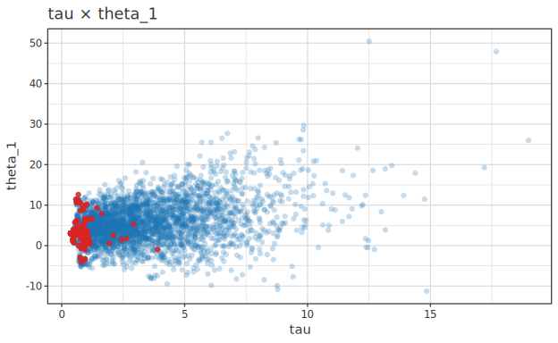

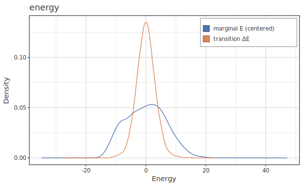

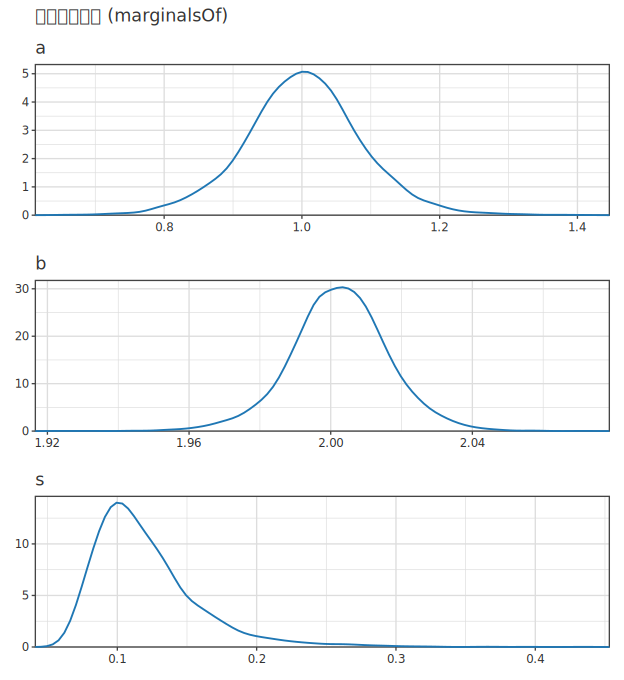

使用例の全体は umbrella `experiments/hbm-damped-saturation/ExampleHighLevel.hs`
(高レベル API の代表実装)。 chain 内の発散 index が必要なら `chainDivergences`
(0-based・post-burn-in、 判定は Stan 流 |ΔH| > 1000) を直接読む。

これらの抽出子が描く代表的な診断図を示す。 まず `dashboardOf m "obs"` で要点を一望できる
コンパクト診断ダッシュボード 2×2 (構造 `dagOf` / 推定値 `forestOf` / 当てはまり `ppcOf` /
サンプラ健全性 `energyOf`):

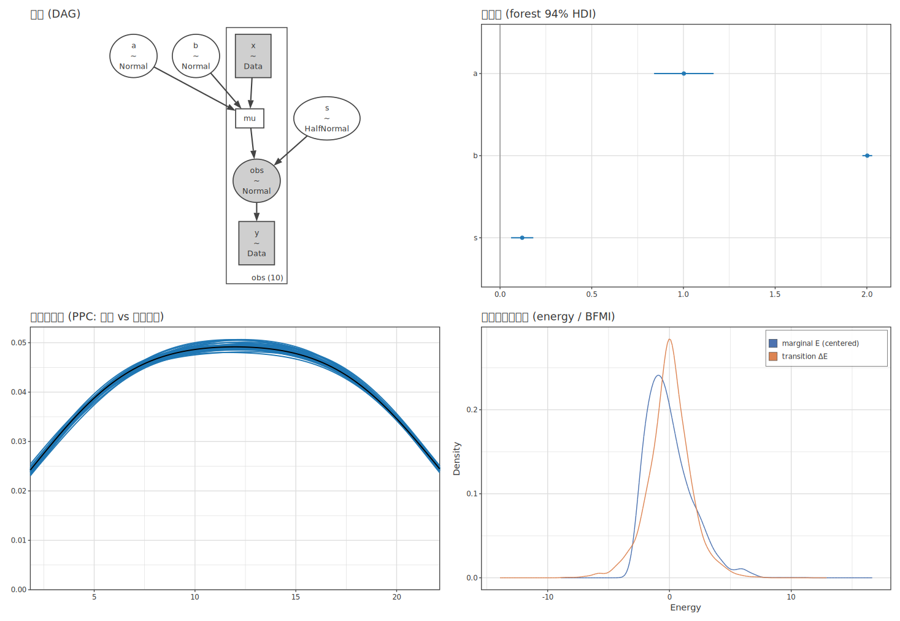

収束まで含め徹底点検する `dashboardFullOf m "obs"` — 上段 2×2 + param ごと [事後分布 | trace]
(係数が増えると下に行が増える):


個別の抽出子図 — モデル構造 (`dagOf`)・trace (`tracesOf`・param ごと 1 パネル)・
HDI forest 94% (`forestOf`)・事後予測チェック (`ppcOf`)・事後予測 (`epred`):

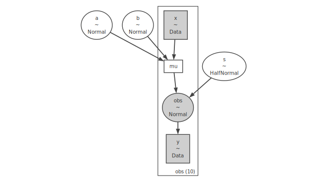

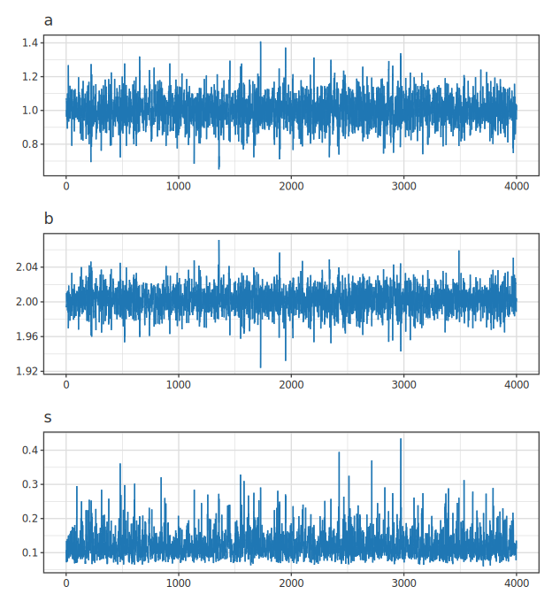

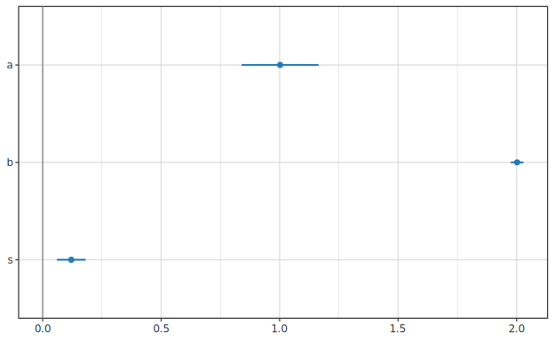

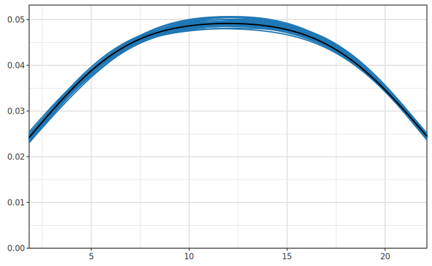

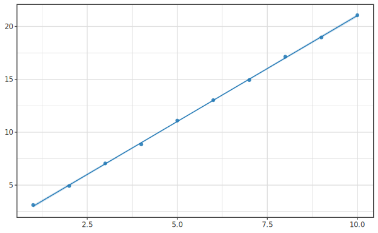

収束診断 — 自己相関 (`autocorrOf`)・rank plot (`rankOf`・chain 一様性):

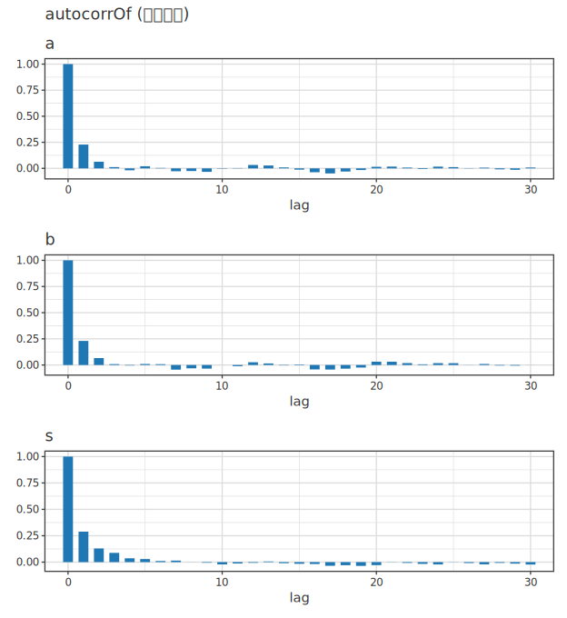

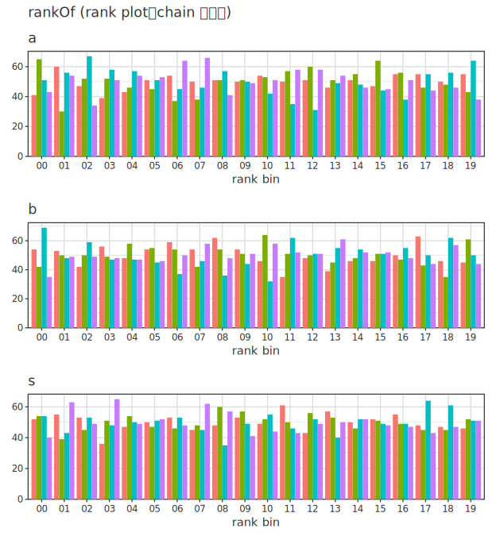

### これらの図の生成 (`df |-> hbm` + 抽出子)

上の各図は、当てはめた `HBMModel` に抽出子を 1 つ適用したもの。モデルは事後を
自身で保持するため、`epred` (観測散布図に事後平均を重畳) 以外の抽出子は
データフレーム不要 (`noDf`):

```haskell
import Hanalyze.Plot     (hbm, defaultHBM, (|->), toPlot, epred, tracesOf, forestOf
                               , dagOf, ppcOf, autocorrOf, rankOf)
import Hgg.Plot.Spec        (ColData (..), layer, scatter, subplots, subplotCols, vconcat)
import Hgg.Plot.Frame       ((|>>))
import Hgg.Plot.Backend.SVG (saveSVGBound)
import Data.Text                (Text)

-- df = [("x", NumData …), ("y", NumData …)]; `model :: ModelP ()` が自分のプログラム
let m    = df |-> hbm defaultHBM model
    noDf = [] :: [(Text, ColData)]
saveSVGBound "hbm-dag.svg"    (noDf |>> toPlot (dagOf m))             -- 構造 DAG
saveSVGBound "hbm-trace.svg"  (noDf |>> vconcat (tracesOf m))  -- param ごと 1 パネル
saveSVGBound "hbm-forest.svg" (noDf |>> toPlot (forestOf m))          -- 94% HDI forest
saveSVGBound "hbm-ppc.svg"    (noDf |>> toPlot (ppcOf m "y"))         -- PPC ("y" = observe 名)
saveSVGBound "hbm-epred.svg"  (df   |>> (layer (scatter "x" "y") <> toPlot (epred m "x" "mu")))
-- 収束診断 (param ごと 1 図ゆえ vconcat で縦に束ねる):
saveSVGBound "hbm-autocorr.svg" (noDf |>> vconcat (autocorrOf m))
saveSVGBound "hbm-rank.svg"     (noDf |>> vconcat (rankOf m))
```

`ppcOf` は純粋 (`ppcOf m "y" :: PPCSpec`・IO 版 `ppcOfIO` もあり)。
`tracesOf m :: [VisualSpec]` (param ごと 1 パネル・`subplots` で束ねる。発散 rug は
既定 ON・chain 別重畳は `tracesOfWith defaultTraceOpts { toByChain = True }`)。
`epred m "x" "mu"` は決定的平均 `"mu"` を `"x"` に沿って評価する。 既定は μ の事後 HDI
(= **CI** 相当) 帯だが、 頻度論と同綴りの `<> bandMode BandPI` で観測ノイズ込みの
**予測区間 (PI)**、 `<> bandMode BandCIPI` で入れ子のファンチャートに切り替えられる
(PI は観測ノードの予測分布をモデルから自動検出してサンプル・固定 seed で決定的)。

## 典型的な使用パターン

### NUTS で chain を 4 本走らせて全部位の HTML レポートを出す

```haskell
import Hanalyze.MCMC.NUTS  (nutsChains, defaultNUTSConfig)
import Hanalyze.Viz.Report (defaultReport, renderReport, reportChains)

main = do
  gen <- createSystemRandom
  chs <- nutsChains model defaultNUTSConfig 4 initParams gen
  let rep = (defaultReport "My Model — 4-chain" (head chs) sampleVarNames)
              { reportChains = chs }
  renderReport "model.html" rep
```

`renderReport` は trace / posterior / pair / autocorr / forest / energy /
rank / posterior summary を 1 HTML にまとめて出します。 individual な viz
だけが欲しい場合は下記のように個別関数を呼びます。

### Rank plot (chain 間収束診断)

```haskell
import Hanalyze.Viz.MCMC (rankPlotFile)
import Hanalyze.Viz.Core (defaultConfig, OutputFormat (..))

let cfg = defaultConfig "Rank plot — Δ mu_alpha"
rankPlotFile HTML "rank_mu.html" cfg 20 ["mu_alpha"] chs
-- nBins = 20 が PyMC のデフォルト
```

chain 数 ≥ 2 が必要 (1 本だと rank が一様になる)。

### Divergence scatter (NUTS のステップ失敗を可視化)

```haskell
import Hanalyze.Viz.MCMC (pairScatterDivFile)

-- mu と tau の joint に divergent 点を重ねる
pairScatterDivFile HTML "div_mu_tau.html" cfg "mu" "tau" chain
```

階層モデルでは funnel の起きる μ-τ 散布に divergent が偏ることが多く、
**non-centered パラメタ化** を使うべきサインになります
([02-probabilistic-model.ja.md パターン 4 形式 C](02-probabilistic-model.ja.md))。

### Posterior predictive check (PPC)

```haskell
import Hanalyze.Stat.PosteriorPredictive (posteriorPredictive)
import Hanalyze.Viz.MCMC (ppcPlotFile)

predDraws <- posteriorPredictive model chain gen
ppcPlotFile HTML "ppc.html" cfg observed predDraws 50
-- nOverlay = 50 個の predictive sample を観測 KDE に重ねる
```

### Posterior summary 表 (az.summary 相当)

```haskell
import Hanalyze.Viz.MCMC (printPosteriorSummary, posteriorSummaryFile)

-- stdout に表
printPosteriorSummary ["mu", "tau", "theta_1"] [chain]

-- HTML 表
posteriorSummaryFile HTML "summary.html" cfg ["mu", "tau"] [chain]
```

mean / SD / 2.5% / 97.5% / ESS / R̂ が並びます (R̂ は chain 数 ≥ 2 のとき有効)。

学習済 `HBMModel` (`hbmModelPure` / `df |-> hbm` の結果) からは、一発ヘルパで
名前列挙や chain の手繋ぎを省けます。`deterministic` 派生量も既定で含まれます
(Phase 103):

```haskell
import Hanalyze.Model.Wrappers (printHBMSummary, hbmSummaryDf, hbmDrawsDf)
import qualified Hanalyze.Data.Wrangle as W

printHBMSummary m                 -- az.summary 風の stdout 表
df  = hbmSummaryDf m              -- 同じ表を DataFrame で
drs = hbmDrawsDf m                -- 事後 draw (1 パラメタ 1 列)
W.summarise ["mu_mean" W.=: W.meanOf "mu"] drs   -- 自由集計
```

## 階層モデル特有の診断指針

| 症状 | 見る viz | 対処 |
|---|---|---|
| chain が分離 (R̂ > 1.05) | `tracePlot` / `rankPlot` | step size を下げる / iter を増やす |
| funnel (μ-τ pair が漏斗形) | `pairScatterDiv` | **non-centered パラメタ化** に切替 |
| BFMI < 0.3 | `energyPlot` | reparameterization 検討、 非中心化など |
| 群別パラメータ間で divergent | `pairScatter` で群別 pair | 群レベル prior を弱情報に / non-centered |
| PPC が観測と乖離 | `ppcPlot` | モデル mis-spec、 family / link / overdispersion 検討 |

詳しい階層モデル例: [demos.ja.md](demos.ja.md)。
