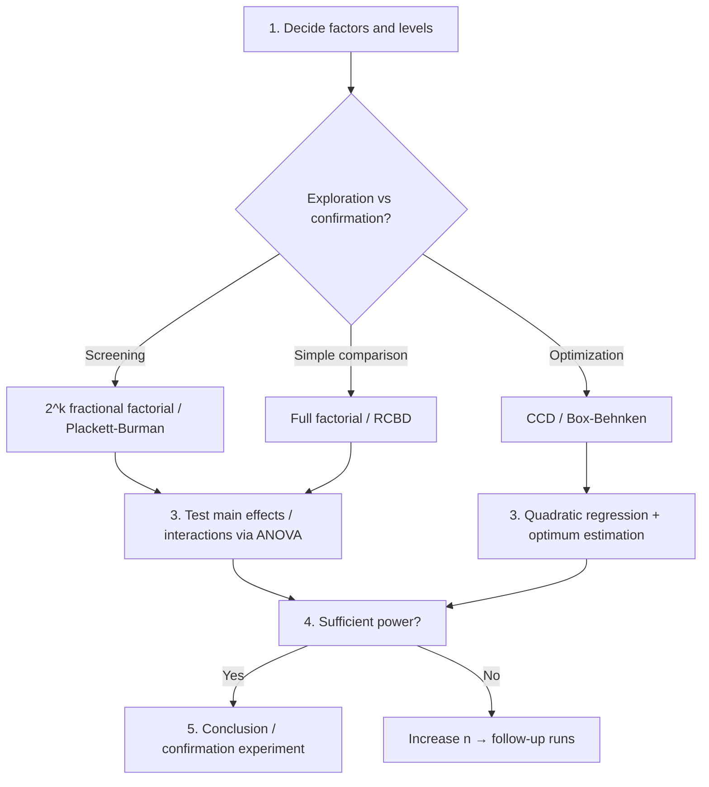

# Design of Experiments (DOE) — usage guide

> Statistical design techniques for collecting data efficiently and
> extracting maximum information.
> For theory, see [docs/doe-optim/theory-doe.md](theory-doe.md).

## Module quick reference

| Module | Contents |
|---|---|
| `Design.Factorial` | Full / fractional factorial (2^k, 3^k, 2^(k-p)), mixed levels |
| `Design.Block`     | Latin squares, Graeco-Latin squares, randomized block design |
| `Design.Mixed`     | Mixed-level design helpers |
| `Design.Anova`     | One-/two-way ANOVA tables (F, p, η²) |
| `Design.Power`     | Power analysis & sample-size determination for t / F / proportion tests |
| `Design.Quality`   | Orthogonality, D/A efficiency, condition number, VIF |
| `Design.RSM`       | CCD (rotatable / face-centered) + Box-Behnken + quadratic regression |
| `Design.Optimal`   | D-optimal / A-optimal (Fedorov exchange) |

---

## 1. Full factorial (`Design.Factorial`)

```haskell
import Design.Factorial

-- 2-level × k factors: each factor takes ±1
twoLevelFactorial :: Int -> [[Double]]
-- twoLevelFactorial 3 → 8 rows × 3 cols

-- 3-level × k factors: -1, 0, +1
threeLevelFactorial :: Int -> [[Double]]

-- Arbitrary levels (per-factor list of level values)
fullFactorial :: [[Double]] -> [[Double]]
-- fullFactorial [[1,2,3], [10,20]] → 6 rows
```

### Fractional factorial (2^(k-p))

```haskell
-- 4-factor fractional factorial with D = ABC (= 2^(4-1) = 8 runs)
fractionalFactorial :: Int -> [[Int]] -> [[Double]]
-- fractionalFactorial 4 [[1,2,3]] →
--   enumerate basic factors A, B, C as 2³, then compute D = A*B*C
```

### Mixed levels (e.g., 2² × 3¹)

```haskell
mixedFactorial :: [Int] -> [[Double]]
-- mixedFactorial [2, 2, 3] → 12 rows (factors 1, 2 have 2 levels; factor 3 has 3)
```

---

## 2. Block designs (`Design.Block`)

```haskell
import Design.Block

-- 4×4 Latin square (1..n appears once per row and column)
latinSquare :: Int -> [[Int]]

-- Graeco-Latin square (orthogonal pair)
graecoLatinSquare :: Int -> Maybe [[(Int, Int)]]
-- Nothing for n=2, 6

-- Randomized block design: b blocks × t treatments, randomized within block
randomizedBlock :: Int -> Int -> Int -> [[Int]]
--                 b      t     seed
```

---

## 3. ANOVA (`Design.Anova`)

```haskell
import Design.Anova

oneWayAnova :: [Text] -> [Double] -> AnovaTable
twoWayAnova :: [Text] -> [Text] -> [Double] -> AnovaTable

printAnovaTable :: AnovaTable -> IO ()
```

### One-way example

```haskell
let labels = ["A", "A", "A", "B", "B", "B", "C", "C", "C"]
    values = [4.1, 4.5, 4.0, 5.0, 5.3, 4.8, 5.5, 5.8, 5.6]
printAnovaTable (oneWayAnova labels values)
```

Output:

```
Source         DF           SS           MS          F    p-value       η²
----------------------------------------------------------------------------
Between         2       3.4956       1.7478   71.5135    0.0000  0.9226
Within          6       0.2440       0.0407        --        --      --
Total           8       3.7396       0.4675        --        --      --
```

---

## 4. Power analysis (`Design.Power`)

### 4.1 Effect sizes

```haskell
cohensD :: Double -> Double -> Double -> Double
-- d = (μ_1 - μ_2) / σ
-- 0.2 = small, 0.5 = medium, 0.8 = large

cohensF :: [Double] -> Double -> Double
-- f = σ_means / σ_within
-- 0.10 = small, 0.25 = medium, 0.40 = large
```

### 4.2 t-test

```haskell
powerTTest      :: Double -> Int -> Int -> Double -> Double
--                 d         n1     n2     α        → power

sampleSizeTTest :: Double -> Double -> Double -> Int
--                 d         power     α        → n per group
```

### 4.3 ANOVA F-test

```haskell
powerOneWayAnova      :: Double -> Int -> Int -> Double -> Double
--                       f         k      n      α
sampleSizeOneWayAnova :: Double -> Int -> Double -> Double -> Int
--                       f         k      power     α
```

### 4.4 Examples

```haskell
-- t-test: required n at d=0.5, α=0.05, power=0.8
let n = sampleSizeTTest 0.5 0.8 0.05  -- → 64
```

---

## 5. Design quality metrics (`Design.Quality`)

```haskell
import Design.Quality

isOrthogonal       :: Double -> [[Double]] -> Bool        -- tolerance ε
orthogonalityScore :: [[Double]] -> Double                -- 0..1
conditionNumber    :: [[Double]] -> Double                -- λ_max / λ_min
dEfficiency        :: [[Double]] -> Double                -- det(XᵀX/n)^(1/p)
aEfficiency        :: [[Double]] -> Double                -- p / trace((XᵀX/n)⁻¹)
vifList            :: [[Double]] -> [Double]              -- VIF per column
```

| Metric | Guideline |
|---|---|
| Orthogonality = 1.0 | fully orthogonal (ideal) |
| Condition number < 10 | good / > 30 warning |
| D-eff = 1.0 | fully orthogonal design |
| VIF < 5 | no multicollinearity / > 10 severe |

---

## 6. Response Surface Methodology (`Design.RSM`)

Designs and analyses to find the optimum of a quadratic response surface.

```haskell
import Design.RSM

-- Central composite design (CCD)
data CCDType = CCC Double | CCF | CCI Double

centralComposite          :: Int -> CCDType -> Int -> [[Double]]
centralCompositeRotatable :: Int -> Int     -> [[Double]]
--                            k      nC                       (α = (2^k)^(1/4))

-- Box-Behnken (k = 3, 4, 5)
boxBehnken :: Int -> Int -> [[Double]]

-- Quadratic model
quadraticDesign  :: [[Double]] -> Matrix Double
fitQuadratic     :: [[Double]] -> [Double] -> QuadFit
optimumPoint     :: QuadFit -> ([Double], Double, [Double])
--                              x*,        y*,    Hessian eigenvalues
```

### Example: 2-factor optimization

```haskell
let design = centralCompositeRotatable 2 3   -- 11 runs
ys <- runExperiment design  -- run the experiment, observe y (mocked here)
let fit = fitQuadratic design ys
    (xStar, yStar, eigs) = optimumPoint fit
-- All eigs < 0 → x* is a local maximum
```

---

## 7. Optimal designs (`Design.Optimal`)

Pick the best-of-size subset from a candidate set via Fedorov exchange.

```haskell
import Design.Optimal

data OptCriterion = DOpt | AOpt

dOptimal :: [[Double]] -> Int -> Int -> ([Int], [[Double]])
--          candidates    n      seed     selected idx, design

aOptimal :: [[Double]] -> Int -> Int -> ([Int], [[Double]])

-- Candidate generation
candidateGrid       :: Int -> Int -> [[Double]]            -- k, levels
quadraticCandidates :: Int -> Int -> [[Double]]            -- quadratic-extended
```

### Example

```haskell
let cands = candidateGrid 3 3   -- 27 candidates (3 factors × 3 levels)
let (_, design) = dOptimal cands 8 42
-- 8 runs achieve full orthogonality (D-eff = 1.0)
```

---

## 8. Practical workflow



### A priori sample-size planning

```haskell
-- For two-group comparison, achieve d=0.5, α=0.05, power=0.8:
let n = sampleSizeTTest 0.5 0.8 0.05   -- 64 (per group)

-- For 3-group ANOVA at f=0.25 (medium), power=0.8:
let nA = sampleSizeOneWayAnova 0.25 3 0.8 0.05
```

---

## See also

- Theory: [docs/doe-optim/theory-doe.md](theory-doe.md)
- Demos: `doe-demo`, `rsm-demo`, `optimaldoe-demo`
- Related regression: fit factor effects with `Model.LM`
