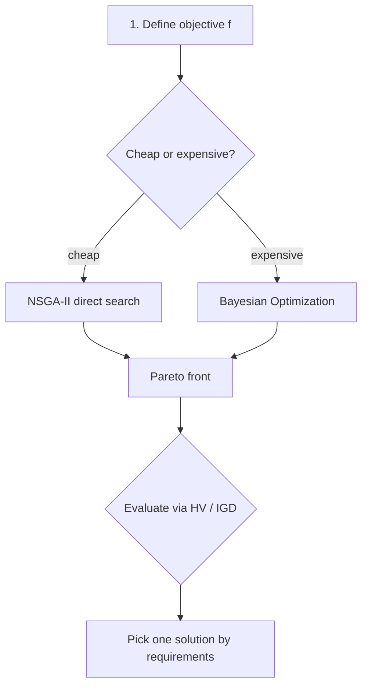

# Multi-objective optimization (MOO) — usage

> 🌐 **English** | [日本語](02-multi-objective.ja.md)

> NSGA-II / Pareto utilities / Bayesian Multi-Objective Optimization.
> Theory: [docs/doe-optim/theory-pareto-moo.md](theory-pareto-moo.md) and
> [docs/doe-optim/theory-bayesopt.md](theory-bayesopt.md).

## Module quick reference

| Module | Purpose |
|---|---|
| `Optim.NSGA`         | NSGA-II + non-dominated sort + genetic operators |
| `Optim.Pareto`       | Pareto front utilities (HV / IGD / GD) |
| `Optim.Acquisition`  | EI / UCB / PI / ParEGO / EHVI |
| `Optim.BayesOpt`     | Bayesian Optimization loop (single / multi-objective) |
| `Optim.Desirability` | Derringer-Suich desirability function |
| `Viz.Pareto`         | Pareto front visualisations (5 styles) |

---

## 1. NSGA-II

```haskell
import Optim.NSGA

-- Example: minimize two objectives simultaneously
let f xs = [x_1^2, (x_1 - 2)^2]
        where x_1 = head xs

let cfg = defaultNSGAConfig { nsgaPopSize = 100, nsgaGenerations = 200 }
front <- nsga2 cfg f [(0, 2)] gen
-- front :: [Solution] = Pareto approximation
```

With constraints:
```haskell
let constr xs = max 0 (sum xs - 1)   -- Σ x ≤ 1
front <- nsga2WithConstraints cfg f constr bounds gen
```

---

## 2. Pareto utilities

```haskell
import Optim.Pareto

let pf = paretoFront points       -- non-dominated points only
let hv = hypervolume refPt points -- hypervolume
let igdV = igd trueFront estFront
```

---

## 3. Bayesian Optimization

```haskell
import Optim.BayesOpt

-- Single-objective BO (1D)
(history, best) <- bayesOpt cfg f (lo, hi) gen

-- Multi-objective BO (NSGA-II inner loop)
hist <- bayesOptMOWithNSGA nIter nInit RBF f bounds gen
```

---

## 4. Desirability

```haskell
import Optim.Desirability

let dts = [Maximize 0 1, Minimize 1 0, Target 0.5 0 1]
let d = overallDesirability dts ys   -- ys is the response vector
```

---

## 5. Visualisation

```haskell
import Viz.Pareto

paretoCompareFile HTML "out.html" cfg trueFront estFront
parallelCoordinatesFile HTML "out.html" cfg labels front
paretoPairFile HTML "out.html" cfg labels front
```

---

## 6. Demos

```bash
cabal run nsga-demo            # ZDT1, Schaffer
cabal run multirsm-demo        # multi-objective RSM + Desirability
cabal run bayesopt-demo        # single- / multi-objective BO
cabal run materials-moo-demo   # integrated demo (3 objectives, alloy composition)
```

---

## 7. Integrated workflow


