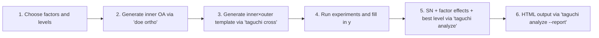

# Orthogonal arrays and the Taguchi method

> 🌐 **English** | [日本語](03-orthogonal-taguchi.ja.md)

> Related: [01-doe.md](01-doe.md) (DOE in general), [theory-doe.md](theory-doe.md)

## Contents

1. [Introduction — what they are for](#1-introduction--what-they-are-for)
2. [Orthogonal arrays vs. the Taguchi method](#2-orthogonal-arrays-vs-the-taguchi-method)
3. [Theory of orthogonal arrays Lₙ](#3-theory-of-orthogonal-arrays-lₙ)
4. [Using `Design.Orthogonal`](#4-using-designorthogonal)
5. [Theory of the Taguchi method](#5-theory-of-the-taguchi-method)
6. [Using `Design.Taguchi`](#6-using-designtaguchi)
7. [End-to-end CLI workflow](#7-end-to-end-cli-workflow)
8. [HTML reports (`Viz.Taguchi`)](#8-html-reports-viztaguchi)
9. [Worked example: chemical-process optimisation](#9-worked-example-chemical-process-optimisation)
10. [Common pitfalls](#10-common-pitfalls)
11. [References](#11-references)

---

## 1. Introduction — what they are for

**Orthogonal arrays (Lₙ)** are a mathematical structure for evaluating $k$ control factors
**orthogonally with the smallest possible number of trials**. For example, L9(3⁴)
evaluates 4 factors at 3 levels in 9 trials (= 1/9 of the full 3⁴=81).

The **Taguchi method** uses orthogonal arrays for **quality-variation minimisation**.
It uses **SN ratios** (signal-to-noise) as the primary metric to find designs that
operate stably under noise (temperature, humidity, part variability, ageing).

### Use cases

| Scenario | Tool |
|---|---|
| Evaluate factor main effects in the fewest trials (exploration) | OA + ANOVA |
| Find a **robust design** that is stable under noise | Taguchi method |
| Continuous-parameter optimisation (response surface) | use [RSM](01-doe.md#6-response-surface-method-designrsm) instead |
| Reduce factory prototype runs to 1/10 or less | OA + fractional factorial |

---

## 2. Orthogonal arrays vs. the Taguchi method

| | Orthogonal array | Taguchi method |
|---|---|---|
| **What** | Mathematical structure (combinatorial design) | Engineering methodology (a way of thinking) |
| **Goal** | Orthogonal evaluation of main effects in fewest trials | Minimise quality variation (robust design) |
| **Tools** | L₄, L₈, L₉, L₁₆, L₁₈, L₂₇, … | OAs + **SN ratio** + **loss function** + inner/outer arrays |
| **Factors** | Control factors only (typical) | Control factors (inner) + **noise factors** (outer) |
| **Metric** | Main effects, ANOVA | Maximise the **SN ratio** η = -10 log₁₀(MSD) |
| **Output** | Effect sizes per factor | Noise-robust "best level" + predicted mean SN |

So **OAs are the tool, Taguchi is the disciplined way of using it for variation minimisation**.

Taguchi adopted OAs because:
1. The trial count is dramatically smaller (L18 covers 8 factors in 18 trials).
2. Main effects are orthogonal → independently estimated per factor.
3. Mixed levels (2 + 3) are handled naturally (L18), unlike fractional factorials.

---

## 3. Theory of orthogonal arrays Lₙ

### 3.1 Notation

`Lₙ(s^k)`:
- **n** = number of trials
- **s** = number of levels
- **k** = maximum number of factors (columns)

Examples:
- **L₈(2⁷)** = 8 trials, up to 7 factors at 2 levels each
- **L₉(3⁴)** = 9 trials, up to 4 factors at 3 levels each
- **L₁₈(2¹×3⁷)** = 18 trials, 1 factor × 2 levels + 7 factors × 3 levels (mixed)

### 3.2 Definition of orthogonality

A table is orthogonal when **every pair of columns contains each level pair the same number
of times**.

L9(3⁴) example (each pair of 3 levels appears exactly once across the 9 combinations):

```
Pair frequencies for columns 1, 2:
  (1,1): 1   (1,2): 1   (1,3): 1
  (2,1): 1   (2,2): 1   (2,3): 1
  (3,1): 1   (3,2): 1   (3,3): 1
```

This makes per-column main effects estimable **orthogonally**.

### 3.3 Standard arrays and Taguchi's preferred order

| Array | Trials | Max factors | Levels | Typical use |
|---|---|---|---|---|
| L₄(2³)        | 4   | 3   | 2-level     | tiny-screening |
| L₈(2⁷)        | 8   | 7   | 2-level     | screening 7 factors at 2 levels |
| L₉(3⁴)        | 9   | 4   | 3-level     | **Taguchi recommended**: 4 × 3 levels, no interactions |
| L₁₂(2¹¹)      | 12  | 11  | 2-level (Plackett–Burman) | main effects only (interactions confounded) |
| L₁₆(2¹⁵)      | 16  | 15  | 2-level     | larger 2-level screening |
| L₁₈(2¹×3⁷)    | 18  | 8   | 1×2 + 7×3 | **Taguchi most-recommended**: mixed levels, robust to interactions |
| L₂₇(3¹³)      | 27  | 13  | 3-level     | 13 factors at 3 levels |

### 3.4 Generation formula for 2-level arrays

L₈/L₁₆ etc. (2^k trials) can be generated for row r (0-indexed) and column j (1-indexed) by:

$$ \text{level}_{r,j} = 1 + \big(\text{popcount}(j \,\wedge\, \text{rev}_k(r)) \bmod 2\big) $$

where:
- `popcount(x)` = number of 1-bits in x.
- `rev_k(r)` = k-bit reversal of r (to align with Taguchi's standard column order).

`Design.Orthogonal.mkL2k k` performs this. First four rows of L8 (k=3):

```
Run  F1 F2 F3 F4 F5 F6 F7
1    1  1  1  1  1  1  1
2    1  1  1  2  2  2  2
3    1  2  2  1  1  2  2
4    1  2  2  2  2  1  1
```

### 3.5 Mixed-level / Plackett-Burman are hard-coded

L9, L12, L18 cannot be generated by simple subsets, so `Design.Orthogonal` hard-codes the
Taguchi standard tables.

---

## 4. Using `Design.Orthogonal`

### 4.1 Main API

```haskell
import qualified Design.Orthogonal as OA

-- Standard tables (constants)
OA.l4    :: OA.OA   -- L4(2^3)
OA.l8    :: OA.OA   -- L8(2^7)
OA.l9    :: OA.OA   -- L9(3^4)
OA.l12   :: OA.OA   -- L12(2^11)
OA.l16   :: OA.OA   -- L16(2^15)
OA.l18   :: OA.OA   -- L18(2^1*3^7)

-- Lookup by name
OA.lookupOA "L9"  :: Maybe OA.OA   -- case-insensitive
OA.standardArrays :: [OA.OA]       -- list of all standard tables

-- Structure
data OA = OA
  { oaName    :: Text       -- "L9(3^4)"
  , oaRuns    :: Int        -- trials
  , oaFactors :: Int        -- max columns
  , oaLevels  :: [Int]      -- levels per column
  , oaTable   :: [[Int]]    -- rows × columns of 1-based level codes
  }
```

### 4.2 Factor assignment — `assignFactors`

Replace the OA's cells (1, 2, 3, …) with **meaningful values**:

```haskell
data LevelValue = LText Text | LNumeric Double

data FactorSpec = FactorSpec
  { fsName   :: Text
  , fsLevels :: [LevelValue]
  }

assignFactors :: OA -> [FactorSpec] -> Either Text AssignedDesign
```

Example: assign three factors to L9:

```haskell
let specs =
      [ OA.FactorSpec "temp"
          [OA.LNumeric 150, OA.LNumeric 180, OA.LNumeric 210]
      , OA.FactorSpec "time"
          [OA.LNumeric 10,  OA.LNumeric 20,  OA.LNumeric 30]
      , OA.FactorSpec "catalyst"
          [OA.LText "A",    OA.LText "B",    OA.LText "C"]
      ]

case OA.assignFactors OA.l9 specs of
  Right ad -> putStrLn (T.unpack (OA.renderPretty ad))
  Left err -> putStrLn (T.unpack err)
```

Output (pretty):

```
L9(3^4)  (9 runs, 3 of 4 columns assigned)
Run        temp        time   catalyst
  1         150          10          A
  2         150          20          B
  3         150          30          C
  4         180          10          B
  5         180          20          C
  6         180          30          A
  7         210          10          C
  8         210          20          A
  9         210          30          B
```

### 4.3 Error cases

```haskell
-- Too many factors (L4 has only 3 columns)
OA.assignFactors OA.l4 (replicate 5 someSpec)
-- → Left "Too many factors: L4(2^3) has only 3 columns; got 5"

-- Level count mismatch (L9 columns are 3-level but only 2 given)
OA.assignFactors OA.l9 [OA.FactorSpec "X" [LNumeric 1, LNumeric 2]]
-- → Left "Factor level mismatch: X expected 3 levels, got 2"
```

### 4.4 Output formats

```haskell
OA.renderRawCSV    :: OA -> Text             -- raw with column names F1, F2, …
OA.renderRawTSV    :: OA -> Text
OA.renderRawPretty :: OA -> Text             -- formatted plain text
OA.renderCSV       :: AssignedDesign -> Text
OA.renderTSV       :: AssignedDesign -> Text
OA.renderPretty    :: AssignedDesign -> Text
```

---

## 5. Theory of the Taguchi method

### 5.1 SN (signal-to-noise) ratio

The usual variability measure is the variance σ². Taguchi simultaneously evaluates
"variance" and "deviation from the mean" via a **loss function**:

$$ L(y) = k(y - m)^2 $$

with $m$ the target value and $k$ a loss constant. Long-run mean loss = mean² + variance.

Expressed in **decibels** this becomes the **SN ratio** η (maximise):

| Type | Use | Formula |
|---|---|---|
| `SmallerBetter`     | smaller-is-better: y → 0 (defect rate, error, noise) | η = -10 log₁₀(Σ y²/n) |
| `LargerBetter`      | larger-is-better: y → ∞ (strength, life, efficiency) | η = -10 log₁₀(Σ (1/y²)/n) |
| `NominalBest`       | hit-target: constant mean + minimum variance | η = 10 log₁₀(μ²/σ²) |
| `NominalBestTarget m` | hit a specific target m | η = -10 log₁₀(Σ(y-m)²/n) |

### 5.2 Inner/outer arrays

| Array | Factor type | Examples |
|---|---|---|
| **Inner (control)** | Designer-controlled | temperature, time, catalyst amount |
| **Outer (noise)** | Variation seen on the factory floor | humidity, part-to-part variation, ageing |

Experimental design:
- Inner OA with **r trials** (e.g. L9 → 9).
- For each inner trial, run the entire outer OA's **m trials** (e.g. L4 → 4).
- Total **r × m** observations (e.g. 9 × 4 = 36).
- Compute the **SN ratio** from m y-values per inner trial.

This finds "the inner combination that stays stable as noise conditions change".

### 5.3 Factor effects

For each inner trial i compute SN η_i → take the **mean η per level** of each factor in the inner OA:

$$ \bar\eta_{j, k} = \frac{1}{|\{i : \text{level}_{i,j} = k\}|} \sum_{i : \text{level}_{i,j} = k} \eta_i $$

The **best level** per factor is the level with the maximum mean η.

### 5.4 Additive-model prediction

Predicted SN at the all-best-levels combination:

$$ \hat\eta_{\text{opt}} = \bar\eta_{\text{all}} + \sum_j (\bar\eta_{j, k^*_j} - \bar\eta_{\text{all}}) $$

with $k^*_j$ the best level of factor j. Assumes per-factor effects are **additive** — interactions ignorable.

---

## 6. Using `Design.Taguchi`

### 6.1 SN ratios

```haskell
import qualified Design.Taguchi as TG

TG.snRatio TG.SmallerBetter         [1.2, 1.5, 0.9, 1.1]
-- → -1.5458 (dB)

TG.snRatio TG.LargerBetter          [100, 95, 105, 102]
-- → 40.0259 (dB)

TG.snRatio TG.NominalBest           [50.1, 49.9, 50.2, 50.0]
-- → 51.7696 (dB)

TG.snRatio (TG.NominalBestTarget 50) [50.1, 49.9, 50.2, 50.0]
-- → 18.2391 (dB)
```

### 6.2 Factor effects and best levels

```haskell
-- 9 trials × 3 observations (inner × outer) data matrix
let yMatrix = [ [2.1, 2.3, 2.0]   -- run 1
              , [2.5, 2.7, 2.4]   -- run 2
              , [3.0, 3.2, 3.1]   -- run 3
              , [1.8, 1.9, 1.7]
              , [2.2, 2.1, 2.3]
              , [2.6, 2.5, 2.7]
              , [1.5, 1.6, 1.4]
              , [1.9, 2.0, 1.8]
              , [2.3, 2.2, 2.4]
              ]
    sns      = TG.snRatioRows TG.SmallerBetter yMatrix
    -- sns = [-6.6, -8.1, -9.8, -5.1, -6.9, -8.3, -3.5, -5.6, -7.2]

let Right ad = OA.assignFactors OA.l9 specs    -- specs as before
    fes  = TG.analyzeSN ad sns                  -- :: [FactorEffect]
    opts = TG.optimalLevels fes                 -- :: [(name, best level, SN)]
    pred = TG.predictSN fes sns                 -- :: Double (predicted SN)

mapM_ print opts
-- ("temp",     LNumeric 210.0, -5.45)
-- ("time",     LNumeric 10.0,  -5.08)
-- ("catalyst", LText "C",      -6.74)

print pred
-- -3.69 (dB) — predicted SN if running with each factor's best level
```

### 6.3 Inner/outer cross design

```haskell
let innerSpecs = [...]   -- control factors
    outerSpecs = [...]   -- noise factors
    Right inner = OA.assignFactors OA.l9 innerSpecs
    Right outer = OA.assignFactors OA.l4 outerSpecs
    io = TG.makeInnerOuter inner outer
    csv = TG.renderInnerOuterCSV io
TIO.writeFile "cross_template.csv" csv
```

`renderInnerOuterCSV` writes an **empty template** of inner 9 trials × outer 4 columns.
The user fills in measured y values and feeds the CSV to `taguchi analyze --csv`.

---

## 7. End-to-end CLI workflow

### Typical flow



### Step-by-step CLI

```bash
# (1) List available orthogonal arrays
hanalyze doe list

# (2) Build the L9 trial table for 3 factors
hanalyze doe ortho L9 \
    -f temp=150,180,210 \
    -f time=10,20,30 \
    -f catalyst=A,B,C \
    --csv --out runs_template.csv

# (3) (optional) inner L9 × outer L4 cross template
hanalyze taguchi cross L9 L4 \
    -f temp=150,180,210 \
    -f time=10,20,30 \
    -f catalyst=A,B,C \
    --noise humidity=low,high \
    --noise vibration=on,off \
    --out cross.csv

# (4) Run the experiments and fill the y values
#     CSV format: Run,temp,time,catalyst,y1,y2,y3

# (5) SN analysis
hanalyze taguchi analyze L9 \
    -f temp=150,180,210 \
    -f time=10,20,30 \
    -f catalyst=A,B,C \
    --csv runs_filled.csv \
    --sntype smaller

# (6) HTML report
hanalyze taguchi analyze L9 \
    -f temp=150,180,210 \
    -f time=10,20,30 \
    -f catalyst=A,B,C \
    --csv runs_filled.csv \
    --sntype smaller \
    --report taguchi_report.html
```

### Sample text output

```
Array:      L9(3^4)
SN type:    smaller-the-better
Inner runs: 9
Repetitions per run: 3 (columns y1, y2, y3)

--- Per-run SN ratios ---
  Run  1:  SN =   -6.596 dB
  Run  2:  SN =   -8.084 dB
  ...

--- Factor effects (mean SN per level) ---
  temp:
    150          :   -8.170 dB
    180          :   -6.758 dB
    210          :   -5.453 dB
  time:
    10           :   -5.082 dB
    20           :   -6.841 dB
    30           :   -8.458 dB
  catalyst:
    A            :   -6.828 dB
    B            :   -6.813 dB
    C            :   -6.740 dB

--- Optimal levels (max SN per factor) ---
  temp         = 210           (SN =   -5.453 dB)
  time         = 10            (SN =   -5.082 dB)
  catalyst     = C             (SN =   -6.740 dB)

Predicted SN at optimum (additive model): -3.687 dB
```

---

## 8. HTML reports (`Viz.Taguchi`)

`taguchi analyze --report FILE` produces an **interactive HTML report**. Sections:

| Section | Contents |
|---|---|
| **Summary** | Array name / SN type / trial count / predicted SN (stat-grid) |
| **SN ratio per run** | Bar chart of per-trial SN |
| **Factor effects** | Per-factor "level vs. mean SN" mini-charts in a grid |
| **Optimal levels** | Best-level table + predicted SN |

### Library API

```haskell
import qualified Viz.Taguchi as VTG

let tr = VTG.TaguchiReport
           { VTG.trTitle     = "My experiment"
           , VTG.trArrayName = OA.oaName (OA.adArray ad)
           , VTG.trSNType    = TG.SmallerBetter
           , VTG.trPerRunSN  = sns
           , VTG.trEffects   = fes
           , VTG.trOptimal   = opts
           , VTG.trPredicted = TG.predictSN fes sns
           }
VTG.renderTaguchiReport "report.html" tr
```

### Building the report through `Viz.ReportBuilder`

The general `ReportBuilder` can produce a similar report (more flexible):

```haskell
import qualified Viz.ReportBuilder as RB

let cfg = RB.defaultReportConfig "Taguchi (custom)"
    sections =
      [ RB.secKeyValue "Summary"
          [ ("Array",  OA.oaName (OA.adArray ad))
          , ("SN type", TG.snTypeName TG.SmallerBetter)
          , ("Predicted SN", T.pack (printf "%.3f dB" predEta))
          ]
      , RB.secBarChart "SN ratio per run"
          [ (T.pack ("Run " ++ show i), eta)
          | (i, eta) <- zip [1::Int ..] sns ]
      ]
      ++ [ RB.secBarChart ("Factor: " <> TG.feFactor fe)
             (zip (map levelToText (TG.feLevels fe))
                  (TG.feSNByLevel fe))
         | fe <- fes ]
      ++ [ RB.secTable "Optimal levels"
             ["Factor", "Best level", "Mean SN (dB)"]
             [ [f, levelToText lvl, T.pack (printf "%.3f" eta)]
             | (f, lvl, eta) <- opts ]
         ]
RB.renderReport "out.html" cfg sections
  where
    levelToText (OA.LText t) = t
    levelToText (OA.LNumeric d) = T.pack (printf "%g" d)
```

Use `Viz.Taguchi` for convenience and `Viz.ReportBuilder` for flexibility.

---

## 9. Worked example: chemical-process optimisation

**Goal**: minimise the impurity rate (y, %) of a reaction product by choosing the best
combination of **temperature, time, and catalyst**. The result should also be robust to
**noise** in humidity and vibration.

### Design

- **Inner (control)**:
  - Temperature (3 levels): 150, 180, 210 °C
  - Time (3 levels): 10, 20, 30 min
  - Catalyst (3 levels): A, B, C
  - → **L9(3⁴)** in 9 trials (4th column unused)

- **Outer (noise)**:
  - Humidity (2 levels): low, high
  - Vibration (2 levels): on, off
  - → **L4(2³)** in 4 trials (3rd column unused)

- **Total trials**: 9 × 4 = 36 observations.
- **SN type**: SmallerBetter (impurity should be small).

### CLI

```bash
# (1) Cross-design template
hanalyze taguchi cross L9 L4 \
    -f temp=150,180,210 \
    -f time=10,20,30 \
    -f catalyst=A,B,C \
    --noise humidity=low,high \
    --noise vibration=on,off \
    --out chem_template.csv
```

`chem_template.csv` example:
```
InnerRun,temp,time,catalyst,y_outer1,y_outer2,y_outer3,y_outer4
1,150,10,A,,,,
2,150,20,B,,,,
...
9,210,30,B,,,,

# Outer array (noise factors): humidity, vibration
# OuterRun 1: humidity=low,  vibration=on
# OuterRun 2: humidity=low,  vibration=off
# OuterRun 3: humidity=high, vibration=on
# OuterRun 4: humidity=high, vibration=off
```

### Run the experiments and fill the CSV

For each of the 9 inner trials, run all 4 noise conditions and measure the impurity:

```
InnerRun,temp,time,catalyst,y_outer1,y_outer2,y_outer3,y_outer4
1,150,10,A,2.1,2.3,2.0,2.2
2,150,20,B,2.5,2.7,2.4,2.6
3,150,30,C,3.0,3.2,3.1,3.3
4,180,10,B,1.8,1.9,1.7,1.8
5,180,20,C,2.2,2.1,2.3,2.0
6,180,30,A,2.6,2.5,2.7,2.6
7,210,10,C,1.5,1.6,1.4,1.5
8,210,20,A,1.9,2.0,1.8,1.9
9,210,30,B,2.3,2.2,2.4,2.3
```

### Analyse

```bash
hanalyze taguchi analyze L9 \
    -f temp=150,180,210 \
    -f time=10,20,30 \
    -f catalyst=A,B,C \
    --csv chem_filled.csv \
    --sntype smaller \
    --report chem_taguchi.html
```

### Interpretation

```
--- Optimal levels (max SN per factor) ---
  temp         = 210           (SN = -5.45 dB)
  time         = 10            (SN = -5.08 dB)
  catalyst     = C             (SN = -6.74 dB)

Predicted SN at optimum: -3.69 dB
```

→ Best combination: **temperature 210 °C, time 10 min, catalyst C**. Most robust to
humidity / vibration variation. Expected SN -3.7 dB (= MSD of impurity ≈ 2.34, i.e.
y ≈ 1.5 %).

Sanity check: the additive-model assumption (no factor-factor interactions). Run a
**confirmation experiment (~3 replicates)**; if the prediction error is within SE, accept;
otherwise consider interactions (switch to RSM).

### HTML report (`chem_taguchi.html`)

In a browser:
- Summary: L9, SmallerBetter, 9 runs, predicted SN -3.69 dB.
- SN ratio per run: bar chart (Run 7 highest, -3.5 dB).
- Factor effects: 3-factor "level vs mean SN" grid.
- Optimal levels: table with temp=210, time=10, catalyst=C.

---

## 10. Common pitfalls

### 10.1 Additive-model assumption — missing interactions

The Taguchi predicted SN uses an **additive main-effects model**. Real-world interactions
shift the prediction. **Always validate with a confirmation experiment.**

If interactions are suspected:
- Use L18 (more robust to interactions than L9).
- Reserve some columns for interactions (in L8, columns 4–7 are interaction columns).
- Switch to RSM (response surface methodology).

### 10.2 Wrong SN type

| Meaning of y | Correct SN type |
|---|---|
| Defect / error / noise (smaller-better) | `SmallerBetter` |
| Strength / life / efficiency (larger-better) | `LargerBetter` |
| Approach a target m (e.g. dimension 5.00 mm) | `NominalBestTarget m` |
| Target moves but maximise mean²/variance | `NominalBest` |

E.g. using `SmallerBetter` to maximise product life flips the result.

### 10.3 Choosing noise factors

Noise factors should be **things that actually vary on the factory floor**:
- Part-to-part variation.
- Environment (temperature, humidity, vibration).
- Ageing.
- Operator differences.

"Variables you can control in the lab" do not make sensible noise factors.

### 10.4 Trials vs. number of factors

| # of factors | Recommended OA |
|---|---|
| ≤ 3 (2-level) | L4(2³) |
| ≤ 7 (2-level) | L8(2⁷) |
| ≤ 4 (3-level) | L9(3⁴) |
| ≤ 11 (2-level, main effects only) | L12(2¹¹) (Plackett-Burman) |
| ≤ 15 (2-level) | L16(2¹⁵) |
| 1 × 2-level + 7 × 3-level | L18(2¹×3⁷) |
| ≤ 13 (3-level) | L27(3¹³) (not implemented in `Design.Orthogonal`) |

It is fine to pick a table with more columns than factors (some columns become unused).
The opposite (too few columns) is not.

### 10.5 Integer-level display

`LNumeric 150` renders as `150` (integer); `LNumeric 0.5` renders as `0.5` (decimal).
Auto-switching by `%g`-equivalent formatting.

### 10.6 Is the inner OA really orthogonal?

The standard tables are validated in `Design.Orthogonal`'s tests for **column balance**
and **pairwise orthogonality** (test/Spec.hs). The hand-coded L9/L12/L18 match the
Taguchi standards.

---

## 11. References

- **Taguchi, G.** (1986). *Introduction to Quality Engineering*. Asian Productivity Organization.
  → Origin of the Taguchi method. Philosophy of SN ratios and the loss function.
- **Phadke, M. S.** (1989). *Quality Engineering Using Robust Design*. Prentice Hall.
  → Implementation-oriented; rich circuit-design examples.
- **Wu, C. F. J., Hamada, M.** (2009). *Experiments: Planning, Analysis, and Optimization* (2nd ed.). Wiley.
  → Statistician's view of OAs and Taguchi; detailed treatment of interactions.
- **NIST/SEMATECH** (online). *e-Handbook of Statistical Methods, Chapter 5.5.7 Taguchi designs*. [URL](https://www.itl.nist.gov/div898/handbook/pri/section5/pri56.htm)

### Related hanalyze docs

- [01-doe.md](01-doe.md) — DOE in general (factorial / RSM / D-optimal)
- [theory-doe.md](theory-doe.md) — DOE theory (orthogonality, efficiency)
- [../visualization/02-report-builder.md](../visualization/02-report-builder.md) — custom reports via `Viz.ReportBuilder`
