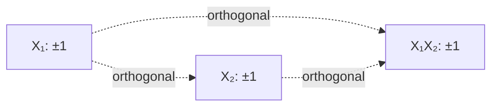
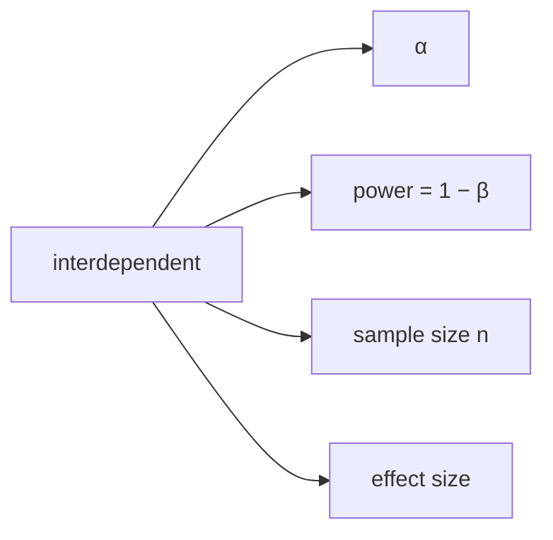
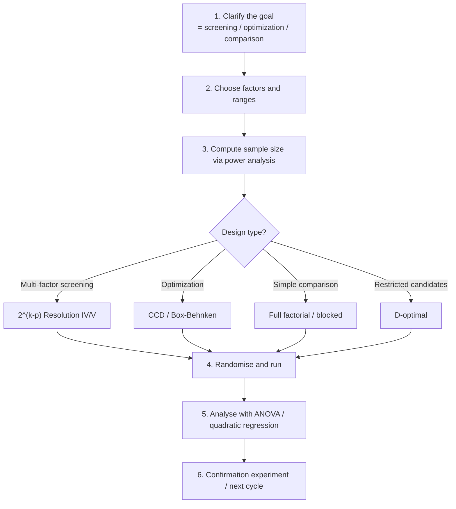

# Study Material 7 — Theory of Design of Experiments

> 🌐 **English** | [日本語](theory-doe.ja.md)

> Mathematical foundations for efficient data-collection design.
> Practical usage: [docs/doe-optim/01-doe.md](01-doe.md).

## 1. What is statistical experimental design?

### 1.1 Motivation

"Collect data first, analyse later" tends to suffer from:

- **Confounding** (factor effects cannot be separated).
- **Bias** (uncontrolled time, location, …).
- **Underpowered** studies (n insufficient to detect differences).

Designing **first** lets you:

- **Orthogonally separate** each factor's effect.
- **Block** known nuisance variables.
- Pre-determine the necessary n via **power analysis**.
- Reduce trials with **fractional factorial / optimal designs**.

### 1.2 Fisher's three principles

1. **Replication** — estimates the error variance.
2. **Randomization** — eliminates unknown biases.
3. **Local control (blocking)** — removes known biases.

---

## 2. Full factorial design

### 2.1 Structure

For $k$ factors at $L$ levels each, $L^k$ trials.
Estimates all main effects and all interactions.

### 2.2 Effect estimation

Two-level design ($\pm 1$):

$$ \hat\beta_j = \frac{1}{n} \sum_i x_{ij} y_i $$

(Mean of $y$ when factor $j$ is $+1$ minus mean when $-1$, divided by 2.)

**Orthogonality** ($X^T X = nI$) makes each factor independently estimable.

### 2.3 Geometry of orthogonal designs



All columns orthogonal → independent estimation, minimum variance.

---

## 3. Fractional factorial design

### 3.1 Motivation

For large $k$, $2^k$ trials explode. Often high-order interactions can be ignored.
→ A **subset** suffices.

### 3.2 Defining relation

A $2^{k-p}$ design picks **$p$ generators**.
For $k=4, p=1$ with $D = ABC$:

$$ I = ABCD \quad (\text{defining relation}) $$

This produces an **alias structure**:
- $A$ is aliased with $BCD$.
- $B$ is aliased with $ACD$.

### 3.3 Resolution

| Resolution | Meaning |
|---|---|
| III | main effects aliased with 2-factor interactions |
| IV | main effects clear, 2-factor interactions aliased among themselves |
| V | main and 2-factor interactions both clear |

In practice **Resolution V** is preferred (separates main and 2-factor interactions).

### 3.4 hanalyze example

```haskell
-- 2^(4-1) with D = ABC (Resolution IV)
let d = fractionalFactorial 4 [[1, 2, 3]]
-- 8 trials estimating 4 main effects + some interactions
```

---

## 4. Latin Square

### 4.1 Use

Three factors: 1 treatment + 2 **block factors** ($n^2$ trials estimate one main effect).

### 4.2 Structure

$n \times n$ grid with each of $1, \ldots, n$ appearing once per row and column:

```text
1 2 3
2 3 1
3 1 2
```

### 4.3 ANOVA model

$$ y_{ijk} = \mu + \alpha_i + \beta_j + \gamma_k + \varepsilon_{ijk} $$

- $\alpha_i$: row (block 1).
- $\beta_j$: column (block 2).
- $\gamma_k$: treatment.

All three factors orthogonal (each treatment appears once per row / column).

### 4.4 Graeco-Latin Square

Overlay two orthogonal Latin squares → 4 factors. Does not exist for $n=2, 6$
(Bose et al. disproved Euler's conjecture in 1959).

---

## 5. ANOVA

### 5.1 One-way decomposition

Total sum of squares = between-group + within-group:

$$ \underbrace{\sum_i (y_i - \bar y)^2}_{\text{SS}_T}
   = \underbrace{\sum_g n_g (\bar y_g - \bar y)^2}_{\text{SS}_B}
   + \underbrace{\sum_g \sum_{i \in g} (y_i - \bar y_g)^2}_{\text{SS}_W} $$

### 5.2 F-test

Null $H_0$: all groups have equal means. Under $H_0$:

$$ F = \frac{\text{MS}_B}{\text{MS}_W} \sim F(k-1, n-k) $$

### 5.3 Effect size $\eta^2$

$$ \eta^2 = \frac{\text{SS}_B}{\text{SS}_T} $$

| $\eta^2$ | Effect |
|---|---|
| 0.01 | small |
| 0.06 | medium |
| 0.14 | large |

---

## 6. Power analysis

### 6.1 The four quantities

**Core**: of the four quantities, fix three to determine the fourth.

$$ \alpha, \quad \text{power}, \quad n, \quad \text{effect size} $$



### 6.2 t-test power

$H_0: \mu_1 = \mu_2$, $H_1: \mu_1 \ne \mu_2$.

Non-centrality of the non-central t:

$$ \delta = d \sqrt{\frac{n_1 n_2}{n_1 + n_2}} $$

Power $= P(|T| > t_{\alpha/2, df} \mid \delta)$.

### 6.3 Effect size

| Index | Definition | Use |
|---|---|---|
| Cohen's d | $(\mu_1 - \mu_2) / \sigma$ | two-group difference |
| Cohen's f | $\sigma_\text{means} / \sigma_\text{within}$ | ANOVA |
| Cohen's h | $\arcsin\sqrt{p_1} - \arcsin\sqrt{p_2}$ | proportions |

| Value | Interpretation (d / f / h) |
|---|---|
| small | 0.2 / 0.10 / 0.2 |
| medium | 0.5 / 0.25 / 0.5 |
| large | 0.8 / 0.40 / 0.8 |

### 6.4 Sample-size calculation

```haskell
-- d=0.5, power=0.8, α=0.05 → n=64 per group
sampleSizeTTest 0.5 0.8 0.05
```

---

## 7. Design-quality metrics

### 7.1 Orthogonality

$X^T X / n$ close to identity is best — coefficients estimated independently.

### 7.2 D-efficiency

$$ D\text{-eff} = \det(X^T X / n)^{1/p} $$

Fully orthogonal → 1.0. Maximise (volume of the information matrix).

### 7.3 A-efficiency

$$ A\text{-eff} = \frac{p}{\text{trace}((X^T X / n)^{-1})} $$

Minimise the average estimation variance.

### 7.4 VIF (Variance Inflation Factor)

For each column:

$$ \text{VIF}_j = \frac{1}{1 - R_j^2} $$

with $R_j^2$ the coefficient of determination of regressing column $j$ on the others.

| VIF | Assessment |
|---|---|
| < 5 | no multicollinearity |
| 5–10 | moderate |
| > 10 | serious |

### 7.5 Condition number

$$ \kappa = \lambda_\text{max} / \lambda_\text{min} \quad (\text{eigenvalues}) $$

| $\kappa$ | Assessment |
|---|---|
| < 10 | good |
| 10–30 | moderate |
| > 30 | unstable |

---

## 8. Response Surface Methodology (RSM)

### 8.1 Goal

Find $\mathbf x$ that maximises/minimises a response $y$.
Locally approximate by a **quadratic model**:

$$ y = \beta_0 + \mathbf b^T \mathbf x + \mathbf x^T B \mathbf x + \varepsilon $$

### 8.2 Central Composite Design (CCD)

Three components:
1. **Factorial part**: corner points of $2^k$ (or fractional).
2. **Axial points**: $(\pm \alpha, 0, \ldots, 0)$ etc. per factor.
3. **Centre points**: $(0, \ldots, 0)$ replicated $n_C$ times (pure-error estimate).

Choices for $\alpha$:

| Variant | $\alpha$ | Property |
|---|---|---|
| Rotatable (CCC) | $(2^k)^{1/4}$ | predictive variance depends only on distance from origin |
| Face-centered (CCF) | 1 | axial points lie on the cube faces |
| Inscribed (CCI) | 1 (factorial scaled by 1/α) | the whole design fits within the cube |

### 8.3 Box-Behnken design

No axial points; centred on faces. Available for $k=3, 4, 5$. Useful when extreme values
cannot be reached (e.g. physical limits).

### 8.4 Analytical estimation of the optimum

From $\partial \hat y / \partial \mathbf x = 0$:

$$ \mathbf x^* = -\frac{1}{2} B^{-1} \mathbf b $$

Eigenvalues of the Hessian $B$ classify the type:

| Eigenvalues | Type |
|---|---|
| all < 0 | maximum |
| all > 0 | minimum |
| mixed | saddle |

```haskell
let (xStar, yStar, eigs) = optimumPoint fit
-- all eigenvalues negative → maximum
```

---

## 9. Optimal designs

### 9.1 Motivation

- Continuous candidate space, exhaustive enumeration impossible.
- Constraints (some combinations physically impossible).
- Want to **augment** existing data (extensible).

### 9.2 D-optimal

Maximise $\det(X^T X)$ — the **information-matrix volume**.
Equivalently maximise $\log\det(X^T X)$ (numerical stability).

### 9.3 A-optimal

Minimise $\text{trace}((X^T X)^{-1})$ — the **average estimation variance**.

### 9.4 Fedorov exchange algorithm

```text
1. Pick n rows from candidate set C = {x_1, ..., x_M} → design D
2. For each pair (i, j): try replacing D[i] with C[j] → D'
3. If D' improves the criterion, adopt; repeat.
4. Stop when no improvement (local optimum).
```

`hanalyze`'s `optimalDesign` cycles through every pair. Converges quickly but does not
guarantee a global optimum.

### 9.5 D vs A

| | D-optimal | A-optimal |
|---|---|---|
| Focus | joint estimation of all parameters | average estimation precision |
| Computation | maximise det | minimise trace |
| Robustness | standard | per-parameter focused |

---

## 10. Practical DOE workflow



---

## 11. Common pitfalls

| Pitfall | Mitigation |
|---|---|
| Inter-factor confounding | orthogonal design + check the alias structure |
| Order effects (time drift) | full randomisation |
| Known bias (lot variation) | blocking (randomised block design) |
| Insufficient sample | confirm power ≥ 0.8 in advance |
| Too many factors | screen with fractional factorial, narrow to significant ones, then RSM |
| Extrapolation | optimum on the design boundary → widen the range and rerun |

---

## 12. References

- Box, Hunter, Hunter: *Statistics for Experimenters* (2005, 2nd ed.) — the DOE bible.
- Montgomery: *Design and Analysis of Experiments* (8th ed., 2012).
- Cohen: *Statistical Power Analysis for the Behavioral Sciences* (1988) — effect sizes.
- Atkinson, Donev: *Optimum Experimental Designs* (1992) — D/A optimal designs.
- Myers, Montgomery, Anderson-Cook: *Response Surface Methodology* (4th ed., 2016).
