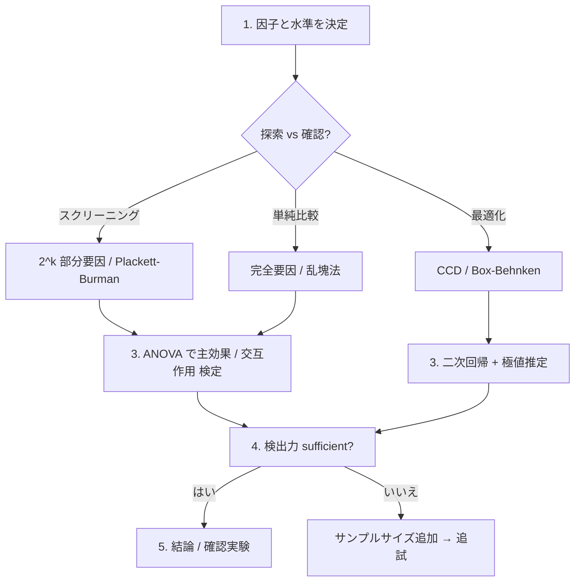

# 実験計画法 (DOE) の使い方

> 効率的にデータを集めて、最大の情報を引き出すための統計的設計手法。
> 理論は [docs/doe/theory-doe.ja.md](theory-doe.ja.md) を参照。

## モジュール早見表

| モジュール | 内容 |
|---|---|
| `Hanalyze.Design.Factorial` | 完全/部分要因 (2^k, 3^k, 2^(k-p)), 混合水準 |
| `Hanalyze.Design.Block`     | ラテン方格、Graeco-Latin、乱塊法 |
| `Hanalyze.Design.Mixed`     | 混合水準計画ヘルパ |
| `Hanalyze.Design.Anova`     | 一元/二元 ANOVA テーブル (F, p, η²) |
| `Hanalyze.Design.Power`     | t 検定、F 検定、比率検定の検出力解析・サンプルサイズ決定 |
| `Hanalyze.Design.Quality`   | 直交度、D/A 効率、条件数、VIF |
| `Hanalyze.Design.RSM`       | CCD (rotatable/face-centered) + Box-Behnken + 二次回帰 |
| `Hanalyze.Design.Optimal`   | D-optimal / A-optimal (Fedorov 交換) |
| `Hanalyze.Design.Orthogonal` | 直交表 Lₙ (L4/L8/L9/L12/L16/L18) |
| `Hanalyze.Design.Taguchi`    | タグチメソッド (SN 比 + 要因効果 + 内/外配置) |

---

## 1. 完全要因計画 (`Hanalyze.Design.Factorial`)

```haskell
import Design.Factorial

-- 2 水準 × k 因子: 各因子は ±1
twoLevelFactorial :: Int -> [[Double]]
-- twoLevelFactorial 3 → 8 行 × 3 列

-- 3 水準 × k 因子: -1, 0, +1
threeLevelFactorial :: Int -> [[Double]]

-- 任意水準 (各因子で異なる水準値リスト)
fullFactorial :: [[Double]] -> [[Double]]
-- fullFactorial [[1,2,3], [10,20]] → 6 行
```

### 部分要因 (2^(k-p))

```haskell
-- 4 因子で D = ABC とする部分要因 (= 2^(4-1) = 8 試行)
fractionalFactorial :: Int -> [[Int]] -> [[Double]]
-- fractionalFactorial 4 [[1,2,3]] →
--   基本因子 A, B, C を 2³ で並べ、D = A*B*C で計算
```

### 混合水準 (2² × 3¹ など)

```haskell
mixedFactorial :: [Int] -> [[Double]]
-- mixedFactorial [2, 2, 3] → 12 行 (因子 1, 2 は 2 水準、因子 3 は 3 水準)
```

---

## 2. ブロック計画 (`Hanalyze.Design.Block`)

```haskell
import Design.Block

-- ラテン方格 4×4 (1..n を各行各列で 1 回ずつ)
latinSquare :: Int -> [[Int]]

-- 直交ラテン方格ペア (Graeco-Latin)
graecoLatinSquare :: Int -> Maybe [[(Int, Int)]]
-- n=2, 6 では Nothing

-- 乱塊法: b ブロック × t 処理、ブロック内ランダム順
randomizedBlock :: Int -> Int -> Int -> [[Int]]
--                 b      t     seed
```

---

## 3. ANOVA (`Hanalyze.Design.Anova`)

```haskell
import Design.Anova

oneWayAnova :: [Text] -> [Double] -> AnovaTable
twoWayAnova :: [Text] -> [Text] -> [Double] -> AnovaTable

printAnovaTable :: AnovaTable -> IO ()
```

### 一元配置の例

```haskell
let labels = ["A", "A", "A", "B", "B", "B", "C", "C", "C"]
    values = [4.1, 4.5, 4.0, 5.0, 5.3, 4.8, 5.5, 5.8, 5.6]
printAnovaTable (oneWayAnova labels values)
```

出力:

```
Source         DF           SS           MS          F    p-value       η²
----------------------------------------------------------------------------
Between         2       3.4956       1.7478   71.5135    0.0000  0.9226
Within          6       0.2440       0.0407        --        --      --
Total           8       3.7396       0.4675        --        --      --
```

---

## 4. 検出力解析 (`Hanalyze.Design.Power`)

### 4.1 効果量

```haskell
cohensD :: Double -> Double -> Double -> Double
-- d = (μ_1 - μ_2) / σ
-- 0.2 = small, 0.5 = medium, 0.8 = large

cohensF :: [Double] -> Double -> Double
-- f = σ_means / σ_within
-- 0.10 = small, 0.25 = medium, 0.40 = large
```

### 4.2 t 検定

```haskell
powerTTest      :: Double -> Int -> Int -> Double -> Double
--                 d         n1     n2     α        → power

sampleSizeTTest :: Double -> Double -> Double -> Int
--                 d         power     α        → 各群の n
```

### 4.3 ANOVA F 検定

```haskell
powerOneWayAnova      :: Double -> Int -> Int -> Double -> Double
--                       f         k      n      α
sampleSizeOneWayAnova :: Double -> Int -> Double -> Double -> Int
--                       f         k      power     α
```

### 4.4 例

```haskell
-- t 検定: d=0.5、α=0.05、power=0.8 のときの必要 n
let n = sampleSizeTTest 0.5 0.8 0.05  -- → 64
```

---

## 5. 設計の質指標 (`Hanalyze.Design.Quality`)

```haskell
import Design.Quality

isOrthogonal       :: Double -> [[Double]] -> Bool        -- 許容誤差 ε
orthogonalityScore :: [[Double]] -> Double                -- 0..1
conditionNumber    :: [[Double]] -> Double                -- λ_max/λ_min
dEfficiency        :: [[Double]] -> Double                -- det(XᵀX/n)^(1/p)
aEfficiency        :: [[Double]] -> Double                -- p/trace((XᵀX/n)⁻¹)
vifList            :: [[Double]] -> [Double]              -- 各列の VIF
```

| 指標 | 目安 |
|---|---|
| 直交度 = 1.0 | 完全直交 (理想) |
| 条件数 < 10 | 良好 / > 30 警告 |
| D-eff = 1.0 | 完全直交設計 |
| VIF < 5 | 多重共線性なし / > 10 深刻 |

---

## 6. 応答曲面法 (`Hanalyze.Design.RSM`)

二次関数の極値 (最適条件) を見つけるための設計と解析。

```haskell
import Design.RSM

-- 中心複合計画 (CCD)
data CCDType = CCC Double | CCF | CCI Double

centralComposite          :: Int -> CCDType -> Int -> [[Double]]
centralCompositeRotatable :: Int -> Int     -> [[Double]]
--                            k      nC                       (α = (2^k)^(1/4))

-- Box-Behnken (k = 3, 4, 5)
boxBehnken :: Int -> Int -> [[Double]]

-- 二次モデル
quadraticDesign  :: [[Double]] -> Matrix Double
fitQuadratic     :: [[Double]] -> [Double] -> QuadFit
optimumPoint     :: QuadFit -> ([Double], Double, [Double])
--                              x*,        y*,    Hessian 固有値
```

### 例: 2 因子の最適化

```haskell
let design = centralCompositeRotatable 2 3   -- 11 試行
ys <- runExperiment design  -- 実験して y を測定 (擬似)
let fit = fitQuadratic design ys
    (xStar, yStar, eigs) = optimumPoint fit
-- eigs 全部 < 0 → x* は極大点
```

---

## 6.5 直交表 Lₙ (`Hanalyze.Design.Orthogonal`)

タグチ流の標準直交表を定数として実装。Lₙ の **n** は試行数、**括弧内** が
水準構成 (例: L18(2¹×3⁷) は 1 因子 × 2 水準 + 7 因子 × 3 水準)。

```haskell
import qualified Design.Orthogonal as OA

-- 標準表
OA.l4    -- L4(2^3)        4 試行 × 3 列 (2 水準)
OA.l8    -- L8(2^7)        8 試行 × 7 列
OA.l9    -- L9(3^4)        9 試行 × 4 列 (3 水準)
OA.l12   -- L12(2^11)      12 試行 × 11 列 (Plackett-Burman)
OA.l16   -- L16(2^15)      16 試行 × 15 列
OA.l18   -- L18(2^1*3^7)   18 試行 × 8 列 (混合水準、タグチ推奨)

-- 名前で取得
OA.lookupOA "L9" :: Maybe OA.OA
```

### 因子割当

```haskell
let specs =
      [ OA.FactorSpec "temp"     [OA.LNumeric 150, OA.LNumeric 180, OA.LNumeric 210]
      , OA.FactorSpec "time"     [OA.LNumeric 10, OA.LNumeric 20, OA.LNumeric 30]
      , OA.FactorSpec "catalyst" [OA.LText "A", OA.LText "B", OA.LText "C"]
      ]
case OA.assignFactors OA.l9 specs of
  Right ad -> putStrLn (T.unpack (OA.renderPretty ad))
  Left err -> putStrLn (T.unpack err)
```

### CLI から (`hanalyze doe`)

```bash
# 一覧
hanalyze doe list

# 生表 (列名 F1, F2, ...)
hanalyze doe ortho L9 --pretty

# 因子割当 + CSV ファイル出力
hanalyze doe ortho L9 \
  -f temp=150,180,210 \
  -f time=10,20,30 \
  -f catalyst=A,B,C \
  --csv --out design.csv
```

### 直交表とタグチメソッドの違い

| | 直交表 | タグチメソッド |
|---|---|---|
| 何か | 数学的構造 | 工学的方法論 |
| 目的 | 主効果を最小試行で直交評価 | 品質ばらつきの最小化 (ロバスト設計) |
| 道具 | Lₙ 表 | Lₙ 表 + **SN 比** + 損失関数 + 内側/外側配置 |
| 因子 | 制御因子のみ | 制御因子 (内側) + **誤差/雑音因子** (外側) |
| 評価 | 主効果の分散分析 | **SN 比** η = -10 log MSD を最大化 |

直交表は道具、タグチメソッドはその道具を「ばらつき最小化」のために体系化した使い方。

---

## 6.6 タグチメソッド (`Hanalyze.Design.Taguchi`)

`Hanalyze.Design.Orthogonal` 上にロバスト設計の解析層を追加するモジュール。

### SN 比 4 種

```haskell
import qualified Design.Taguchi as TG

TG.snRatio TG.SmallerBetter        ys   -- η = -10 log10(Σ y²/n)
TG.snRatio TG.LargerBetter         ys   -- η = -10 log10(Σ (1/y²)/n)
TG.snRatio TG.NominalBest          ys   -- η = 10 log10(μ²/σ²)
TG.snRatio (TG.NominalBestTarget m) ys  -- η = -10 log10(Σ (y-m)²/n)
```

### 要因効果と最良水準

```haskell
let sns      = TG.snRatioRows TG.SmallerBetter yMatrix
    effects  = TG.analyzeSN ad sns           -- [FactorEffect] (因子×水準別 SN)
    bestLvls = TG.optimalLevels effects      -- [(因子名, 最良水準, SN)]
    predEta  = TG.predictSN effects sns      -- 主効果加法モデル予測 SN
```

### 内側 × 外側のクロス設計

```haskell
let inner = ... -- AssignedDesign (制御因子)
    outer = ... -- AssignedDesign (雑音因子)
    io    = TG.makeInnerOuter inner outer
csv = TG.renderInnerOuterCSV io
TIO.writeFile "cross.csv" csv
```

### CLI から (`hanalyze taguchi`)

```bash
# SN 比 1 件
hanalyze taguchi sn smaller 1.2 1.5 0.9 1.1

# 観測 CSV を解析 (要因効果 + 最良水準 + 予測 SN を表示)
hanalyze taguchi analyze L9 \
    -f temp=150,180,210 -f time=10,20,30 -f catalyst=A,B,C \
    --csv runs.csv --sntype smaller

# 内側 L9 × 外側 L4 のクロス設計テンプレ生成
hanalyze taguchi cross L9 L4 \
    -f temp=150,180,210 -f time=10,20,30 -f catalyst=A,B,C \
    --noise humidity=low,high --noise vibration=on,off \
    --out cross.csv
```

---

## 7. 最適計画 (`Hanalyze.Design.Optimal`)

候補集合から指定試行数の部分集合を Fedorov 交換で最適化。

```haskell
import Design.Optimal

data OptCriterion = DOpt | AOpt

dOptimal :: [[Double]] -> Int -> Int -> ([Int], [[Double]])
--          候補集合       n      seed     選定 idx, 設計

aOptimal :: [[Double]] -> Int -> Int -> ([Int], [[Double]])

-- 候補生成
candidateGrid       :: Int -> Int -> [[Double]]            -- k, levels
quadraticCandidates :: Int -> Int -> [[Double]]            -- 二次拡張済
```

### 例

```haskell
let cands = candidateGrid 3 3   -- 27 候補 (3 因子 × 3 水準)
let (_, design) = dOptimal cands 8 42
-- 8 試行で完全直交 (D-eff = 1.0) を達成
```

---

## 8. 実務的なワークフロー



### サンプルサイズ事前計画

```haskell
-- 2 群比較で d=0.5、α=0.05、power=0.8 を達成するには:
let n = sampleSizeTTest 0.5 0.8 0.05   -- 64 (各群)

-- 3 群 ANOVA で f=0.25 (medium)、power=0.8:
let nA = sampleSizeOneWayAnova 0.25 3 0.8 0.05
```

---

## 関連リンク

- 理論: [docs/doe/theory-doe.ja.md](theory-doe.ja.md)
- demo: `doe-demo`, `rsm-demo`, `optimaldoe-demo`
- 既存の回帰: `Hanalyze.Model.LM` で因子効果を fit
