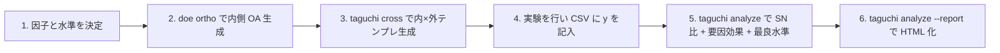

# 直交表とタグチメソッド

> 🌐 [English](03-orthogonal-taguchi.md) | **日本語**

> 関連: [01-doe.ja.md](01-doe.ja.md) (DOE 全般), [theory-doe.ja.md](theory-doe.ja.md)

## 目次

1. [はじめに — 何のために使うか](#1-はじめに--何のために使うか)
2. [直交表とタグチメソッドの違い](#2-直交表とタグチメソッドの違い)
3. [直交表 Lₙ の理論](#3-直交表-lₙ-の理論)
4. [`Hanalyze.Design.Orthogonal` の使い方](#4-designorthogonal-の使い方)
5. [タグチメソッドの理論](#5-タグチメソッドの理論)
6. [`Hanalyze.Design.Taguchi` の使い方](#6-designtaguchi-の使い方)
7. [CLI からの一連のワークフロー](#7-cli-からの一連のワークフロー)
8. [HTML レポート (`Hanalyze.Viz.Taguchi`)](#8-html-レポート-viztaguchi)
9. [実例: 化学プロセス最適化](#9-実例-化学プロセス最適化)
10. [よくある落とし穴](#10-よくある落とし穴)
11. [参考文献](#11-参考文献)

---

## 1. はじめに — 何のために使うか

**直交表 (Orthogonal Array, Lₙ)** は、k 個の制御因子を最少試行数で
**直交評価** するための数学的構造。例: L9(3⁴) なら 4 因子 × 3 水準 を
9 試行 (= 3⁴=81 の全要因の 1/9) で評価できる。

**タグチメソッド (Taguchi method)** はこの直交表を **品質ばらつきの
最小化** に使う方法論。**SN 比** (signal-to-noise) を主指標として、
雑音 (温度・湿度・部品ばらつき・経年劣化) があっても安定動作する設計を見つける。

### 想定ユースケース

| シナリオ | 適用ツール |
|---|---|
| 因子の主効果を最少試行で評価したい (探索) | 直交表 + ANOVA |
| 雑音条件下でも安定する **ロバスト設計** を見つけたい | タグチメソッド |
| 連続パラメータの最適化 (応答曲面) | 直交表ではなく [RSM](01-doe.ja.md#6-応答曲面法-designrsm) を使う |
| 工場での試作回数を 1/10 以下に削減したい | 直交表 + 部分要因 |

---

## 2. 直交表とタグチメソッドの違い

| | 直交表 | タグチメソッド |
|---|---|---|
| **何か** | 数学的構造 (組合せデザイン) | 工学的方法論 (考え方の体系) |
| **目的** | 主効果を最小試行で直交評価 | 品質ばらつきの最小化 (ロバスト設計) |
| **使う道具** | L₄, L₈, L₉, L₁₆, L₁₈, L₂₇ ... | 直交表 + **SN 比** + **損失関数** + 内側/外側配置 |
| **対象因子** | 制御因子のみ (典型) | 制御因子 (内側) + **誤差/雑音因子** (外側) |
| **評価指標** | 主効果・分散分析 | **SN 比** η = -10 log₁₀(MSD) を最大化 |
| **結果の解釈** | 各因子の効果量 | 雑音に頑健な「ベスト水準」 + 平均水準の予測 |

つまり **直交表は道具、タグチメソッドはその道具を「ばらつき最小化」のために
体系化した使い方**。

タグチが直交表を採用したのは:
1. 試行数が桁違いに少ない (L18 で 8 因子を 18 試行)
2. 主効果が直交 → 各因子の効果を独立に評価可能
3. 部分要因計画と異なり、混合水準 (2 水準 + 3 水準) も自然に扱える (L18)

---

## 3. 直交表 Lₙ の理論

### 3.1 表記

`Lₙ(s^k)`:
- **n** = 試行数
- **s** = 水準数
- **k** = 最大因子数 (列数)

例:
- **L₈(2⁷)** = 8 試行、最大 7 因子、各因子 2 水準
- **L₉(3⁴)** = 9 試行、最大 4 因子、各因子 3 水準
- **L₁₈(2¹×3⁷)** = 18 試行、1 因子 × 2 水準 + 7 因子 × 3 水準 (混合)

### 3.2 直交性の定義

直交表とは **任意の 2 列の組合せが各水準ペアを均等に含む** 表。

L9(3⁴) の例 (各 3 水準同士、9 通りの組合せが 1 回ずつ):

```
列 1, 2 のペア出現:
  (1,1): 1回   (1,2): 1回   (1,3): 1回
  (2,1): 1回   (2,2): 1回   (2,3): 1回
  (3,1): 1回   (3,2): 1回   (3,3): 1回
```

これにより各列の主効果が **直交** に推定可能。

### 3.3 標準的な直交表とタグチ流の優先順位

| 表 | 試行数 | 最大因子数 | 水準構成 | 主な用途 |
|---|---|---|---|---|
| L₄(2³)        | 4   | 3   | 2 水準     | スクリーニング (極小規模) |
| L₈(2⁷)        | 8   | 7   | 2 水準     | 7 因子 2 水準のスクリーニング |
| L₉(3⁴)        | 9   | 4   | 3 水準     | **タグチ推奨**: 4 因子 3 水準で交互作用なし |
| L₁₂(2¹¹)      | 12  | 11  | 2 水準 (Plackett-Burman) | 主効果のみ (交互作用は混合) |
| L₁₆(2¹⁵)      | 16  | 15  | 2 水準     | 大規模 2 水準スクリーニング |
| L₁₈(2¹×3⁷)    | 18  | 8   | 1×2 + 7×3 | **タグチ最推奨**: 混合水準、交互作用に強い |
| L₂₇(3¹³)      | 27  | 13  | 3 水準     | 13 因子 3 水準 |

### 3.4 2 水準系の生成式

L₈/L₁₆ など 2^k 試行の表は、行 r (0-indexed) と列 j (1-indexed) について
次式で生成可能 (Hadamard 行列の標準形):

$$ \text{level}_{r,j} = 1 + \big(\text{popcount}(j \,\wedge\, \text{rev}_k(r)) \bmod 2\big) $$

ここで:
- `popcount(x)` = x の 1-bit 数
- `rev_k(r)` = r の k-bit 反転 (Taguchi 標準の列順に揃えるため)

`Hanalyze.Design.Orthogonal.mkL2k k` がこの生成を行う。L8 (k=3) の最初の 4 行:

```
Run  F1 F2 F3 F4 F5 F6 F7
1    1  1  1  1  1  1  1
2    1  1  1  2  2  2  2
3    1  2  2  1  1  2  2
4    1  2  2  2  2  1  1
```

### 3.5 混合水準・Plackett-Burman は手動定義

L9, L12, L18 は単純な部分集合積で生成できないため、`Hanalyze.Design.Orthogonal` では
タグチ標準表をハードコード。

---

## 4. `Hanalyze.Design.Orthogonal` の使い方

### 4.1 主要 API

```haskell
import qualified Design.Orthogonal as OA

-- 標準表 (定数)
OA.l4    :: OA.OA   -- L4(2^3)
OA.l8    :: OA.OA   -- L8(2^7)
OA.l9    :: OA.OA   -- L9(3^4)
OA.l12   :: OA.OA   -- L12(2^11)
OA.l16   :: OA.OA   -- L16(2^15)
OA.l18   :: OA.OA   -- L18(2^1*3^7)

-- 名前で取得
OA.lookupOA "L9"  :: Maybe OA.OA   -- 大文字小文字無視
OA.standardArrays :: [OA.OA]       -- 全標準表のリスト

-- 構造
data OA = OA
  { oaName    :: Text       -- "L9(3^4)"
  , oaRuns    :: Int        -- 試行数
  , oaFactors :: Int        -- 最大列数
  , oaLevels  :: [Int]      -- 各列の水準数
  , oaTable   :: [[Int]]    -- 行 × 列の 1-based 水準コード
  }
```

### 4.2 因子割当 — `assignFactors`

直交表のセル (1, 2, 3 等) をユーザー定義の **意味のある値** に置き換える:

```haskell
data LevelValue = LText Text | LNumeric Double

data FactorSpec = FactorSpec
  { fsName   :: Text
  , fsLevels :: [LevelValue]
  }

assignFactors :: OA -> [FactorSpec] -> Either Text AssignedDesign
```

例: L9 に 3 因子を割り当てる:

```haskell
let specs =
      [ OA.FactorSpec "temp"
          [OA.LNumeric 150, OA.LNumeric 180, OA.LNumeric 210]
      , OA.FactorSpec "time"
          [OA.LNumeric 10,  OA.LNumeric 20,  OA.LNumeric 30]
      , OA.FactorSpec "catalyst"
          [OA.LText "A",    OA.LText "B",    OA.LText "C"]
      ]

case OA.assignFactors OA.l9 specs of
  Right ad -> putStrLn (T.unpack (OA.renderPretty ad))
  Left err -> putStrLn (T.unpack err)
```

出力 (pretty):

```
L9(3^4)  (9 runs, 3 of 4 columns assigned)
Run        temp        time   catalyst
  1         150          10          A
  2         150          20          B
  3         150          30          C
  4         180          10          B
  5         180          20          C
  6         180          30          A
  7         210          10          C
  8         210          20          A
  9         210          30          B
```

### 4.3 異常系

```haskell
-- 因子数超過 (L4 は 3 列まで)
OA.assignFactors OA.l4 (replicate 5 someSpec)
-- → Left "Too many factors: L4(2^3) has only 3 columns; got 5"

-- 水準数不一致 (L9 列は 3 水準だが 2 つしか渡してない)
OA.assignFactors OA.l9 [OA.FactorSpec "X" [LNumeric 1, LNumeric 2]]
-- → Left "Factor level mismatch: X expected 3 levels, got 2"
```

### 4.4 出力形式

```haskell
OA.renderRawCSV    :: OA -> Text             -- 列名 F1, F2, ... の生表
OA.renderRawTSV    :: OA -> Text
OA.renderRawPretty :: OA -> Text             -- 整形プレーンテキスト
OA.renderCSV       :: AssignedDesign -> Text
OA.renderTSV       :: AssignedDesign -> Text
OA.renderPretty    :: AssignedDesign -> Text
```

---

## 5. タグチメソッドの理論

### 5.1 SN 比 (Signal-to-Noise ratio)

通常、観測 y のばらつきを評価する指標は分散 σ²。タグチは「分散」と
「平均からのずれ」を **損失関数** で同時に評価:

$$ L(y) = k(y - m)^2 $$

ここで m は目標値、k は損失定数。長期的な平均損失 = 平均 + 分散の二乗和。

これを **デシベル** で表現したものが **SN 比** η (max が良い):

| タイプ | 用途 | 式 |
|---|---|---|
| `SmallerBetter`     | 望小: y → 0 が良い (不良率、誤差、騒音) | η = -10 log₁₀(Σ y²/n) |
| `LargerBetter`      | 望大: y → ∞ が良い (強度、寿命、効率)  | η = -10 log₁₀(Σ (1/y²)/n) |
| `NominalBest`       | 望目: 平均一定 + 分散最小            | η = 10 log₁₀(μ²/σ²) |
| `NominalBestTarget m` | 望目 (目標値 m 指定)                | η = -10 log₁₀(Σ(y-m)²/n) |

### 5.2 内側/外側配置 (Inner/Outer Arrays)

| 配置 | 因子の種類 | 例 |
|---|---|---|
| **内側 (制御因子)** | 設計者が決められる | 温度・時間・触媒の量 |
| **外側 (雑音因子)** | 製造現場で発生する変動 | 湿度・部品個体差・経年劣化 |

実験デザイン:
- 内側 OA で **r 試行** (例: L9 → 9 試行)
- 各内側試行で外側 OA を全 **m 試行** 走らせる (例: L4 → 4 試行)
- 合計 **r × m** 観測 (例: 9 × 4 = 36)
- 内側試行ごとに **m 個の y から SN 比** を計算

これにより「雑音条件が変わっても安定する内側の組合せ」が見つかる。

### 5.3 要因効果 (Factor Effects)

各内側試行 i で SN 比 η_i を計算 → 内側 OA の **各因子の各水準** で
平均 η を取る:

$$ \bar\eta_{j, k} = \frac{1}{|\{i : \text{level}_{i,j} = k\}|} \sum_{i : \text{level}_{i,j} = k} \eta_i $$

各因子の **最良水準** = 平均 η が最大の水準。

### 5.4 加法モデルによる予測

最良水準すべてで実験した時の予測 SN:

$$ \hat\eta_{\text{opt}} = \bar\eta_{\text{all}} + \sum_j (\bar\eta_{j, k^*_j} - \bar\eta_{\text{all}}) $$

ここで $k^*_j$ は因子 j の最良水準。各因子効果が **加法的** で交互作用が
無視できる前提。

---

## 6. `Hanalyze.Design.Taguchi` の使い方

### 6.1 SN 比

```haskell
import qualified Design.Taguchi as TG

TG.snRatio TG.SmallerBetter         [1.2, 1.5, 0.9, 1.1]
-- → -1.5458 (dB)

TG.snRatio TG.LargerBetter          [100, 95, 105, 102]
-- → 40.0259 (dB)

TG.snRatio TG.NominalBest           [50.1, 49.9, 50.2, 50.0]
-- → 51.7696 (dB)

TG.snRatio (TG.NominalBestTarget 50) [50.1, 49.9, 50.2, 50.0]
-- → 18.2391 (dB)
```

### 6.2 要因効果と最良水準

```haskell
-- 9 試行 × 3 観測 (内側 × 外側) の観測行列
let yMatrix = [ [2.1, 2.3, 2.0]   -- run 1
              , [2.5, 2.7, 2.4]   -- run 2
              , [3.0, 3.2, 3.1]   -- run 3
              , [1.8, 1.9, 1.7]
              , [2.2, 2.1, 2.3]
              , [2.6, 2.5, 2.7]
              , [1.5, 1.6, 1.4]
              , [1.9, 2.0, 1.8]
              , [2.3, 2.2, 2.4]
              ]
    sns      = TG.snRatioRows TG.SmallerBetter yMatrix
    -- sns = [-6.6, -8.1, -9.8, -5.1, -6.9, -8.3, -3.5, -5.6, -7.2]

let Right ad = OA.assignFactors OA.l9 specs    -- specs は前述
    fes  = TG.analyzeSN ad sns                  -- :: [FactorEffect]
    opts = TG.optimalLevels fes                 -- :: [(因子名, 最良水準, SN)]
    pred = TG.predictSN fes sns                 -- :: Double (予測 SN)

mapM_ print opts
-- ("temp",     LNumeric 210.0, -5.45)
-- ("time",     LNumeric 10.0,  -5.08)
-- ("catalyst", LText "C",      -6.74)

print pred
-- -3.69 (dB) — 各因子の最良水準で実験した時の予測 SN
```

### 6.3 内側/外側配置のクロス設計

```haskell
let innerSpecs = [...]   -- 制御因子
    outerSpecs = [...]   -- 雑音因子
    Right inner = OA.assignFactors OA.l9 innerSpecs
    Right outer = OA.assignFactors OA.l4 outerSpecs
    io = TG.makeInnerOuter inner outer
    csv = TG.renderInnerOuterCSV io
TIO.writeFile "cross_template.csv" csv
```

`renderInnerOuterCSV` は内側 9 試行 × 外側 4 列の **空テンプレ** を出力。
ユーザーは実際の y を測定して埋め、CSV を `taguchi analyze --csv` に渡す。

### 6.4 詳細解析ヘルパ

UI / レポート向けに「平均・分散込みの SN」「range と寄与率込みの要因効果」
「Cp / Cpk」を 1 構造で取れるヘルパ。

```haskell
import qualified Design.Taguchi as TG
import qualified Design.Quality as Quality

-- 平均 / 分散 / N 込みの SN
let det = TG.snRatioWithDetails TG.NominalBest [12.1, 12.3, 11.9, 12.0]
-- TG.sdSN, TG.sdMean, TG.sdVariance, TG.sdN

-- range + 寄与率込みの要因効果
let ext = TG.factorEffectsTable assigned snValues
-- ext :: [TG.FactorEffectExt]
-- TG.feeRange     -- max - min
-- TG.feeContribution  -- range_j / Σ range_k (要因の重要度ランキング)

-- 工程能力 Cp / Cpk
let cap = Quality.processCapability lsl usl observations
-- Quality.capCp, Quality.capCpk, Quality.capMean, Quality.capSd
-- 片側公差: processCapabilityUpper / processCapabilityLower
```

`OAMetadata` (`Hanalyze.Design.Orthogonal.listArraysWithSize`) は標準直交表のメタ情報を
構造化して返す (`omName / omRuns / omFactors / omLevels / omDescr`)。

---

## 7. CLI からの一連のワークフロー

### 典型的な使用フロー



### Step-by-step CLI 例

```bash
# (1) 利用可能な直交表を確認
hanalyze doe list

# (2) L9 で 3 因子の試行表を作成
hanalyze doe ortho L9 \
    -f temp=150,180,210 \
    -f time=10,20,30 \
    -f catalyst=A,B,C \
    --csv --out runs_template.csv

# (3) (オプション) 内側 L9 × 外側 L4 のクロステンプレ
hanalyze taguchi cross L9 L4 \
    -f temp=150,180,210 \
    -f time=10,20,30 \
    -f catalyst=A,B,C \
    --noise humidity=low,high \
    --noise vibration=on,off \
    --out cross.csv

# (4) 実験 → 結果の y を CSV に記入 (各内側試行で複数 y 観測)
#     CSV 形式: Run,temp,time,catalyst,y1,y2,y3

# (5) SN 比解析
hanalyze taguchi analyze L9 \
    -f temp=150,180,210 \
    -f time=10,20,30 \
    -f catalyst=A,B,C \
    --csv runs_filled.csv \
    --sntype smaller

# (6) HTML レポート出力
hanalyze taguchi analyze L9 \
    -f temp=150,180,210 \
    -f time=10,20,30 \
    -f catalyst=A,B,C \
    --csv runs_filled.csv \
    --sntype smaller \
    --report taguchi_report.html
```

### `taguchi analyze` の出力 (テキスト)

```
Array:      L9(3^4)
SN type:    smaller-the-better
Inner runs: 9
Repetitions per run: 3 (columns y1, y2, y3)

--- Per-run SN ratios ---
  Run  1:  SN =   -6.596 dB
  Run  2:  SN =   -8.084 dB
  ...

--- Factor effects (mean SN per level) ---
  temp:
    150          :   -8.170 dB
    180          :   -6.758 dB
    210          :   -5.453 dB
  time:
    10           :   -5.082 dB
    20           :   -6.841 dB
    30           :   -8.458 dB
  catalyst:
    A            :   -6.828 dB
    B            :   -6.813 dB
    C            :   -6.740 dB

--- Optimal levels (max SN per factor) ---
  temp         = 210           (SN =   -5.453 dB)
  time         = 10            (SN =   -5.082 dB)
  catalyst     = C             (SN =   -6.740 dB)

Predicted SN at optimum (additive model): -3.687 dB
```

---

## 8. HTML レポート (`Hanalyze.Viz.Taguchi`)

`taguchi analyze --report FILE` で **インタラクティブな HTML レポート** が生成される。
セクション構成:

| セクション | 内容 |
|---|---|
| **Summary** | 直交表名 / SN タイプ / 試行数 / 予測 SN (stat-grid) |
| **SN ratio per run** | 試行ごとの SN 比のバーチャート |
| **Factor effects** | 因子ごとの「水準 vs 平均 SN」をミニチャートで並べる (グリッド表示) |
| **Optimal levels** | 最良水準テーブル + 予測 SN |

### ライブラリ API

```haskell
import qualified Viz.Taguchi as VTG

let tr = VTG.TaguchiReport
           { VTG.trTitle     = "My experiment"
           , VTG.trArrayName = OA.oaName (OA.adArray ad)
           , VTG.trSNType    = TG.SmallerBetter
           , VTG.trPerRunSN  = sns
           , VTG.trEffects   = fes
           , VTG.trOptimal   = opts
           , VTG.trPredicted = TG.predictSN fes sns
           }
VTG.renderTaguchiReport "report.html" tr
```

### `Hanalyze.Viz.ReportBuilder` 経由で構築する場合

汎用 `ReportBuilder` でも同様のレポートを作れる (より柔軟):

```haskell
import qualified Viz.ReportBuilder as RB

let cfg = RB.defaultReportConfig "Taguchi (custom)"
    sections =
      [ RB.secKeyValue "Summary"
          [ ("Array",  OA.oaName (OA.adArray ad))
          , ("SN type", TG.snTypeName TG.SmallerBetter)
          , ("Predicted SN", T.pack (printf "%.3f dB" predEta))
          ]
      , RB.secBarChart "SN ratio per run"
          [ (T.pack ("Run " ++ show i), eta)
          | (i, eta) <- zip [1::Int ..] sns ]
      ]
      ++ [ RB.secBarChart ("Factor: " <> TG.feFactor fe)
             (zip (map levelToText (TG.feLevels fe))
                  (TG.feSNByLevel fe))
         | fe <- fes ]
      ++ [ RB.secTable "Optimal levels"
             ["Factor", "Best level", "Mean SN (dB)"]
             [ [f, levelToText lvl, T.pack (printf "%.3f" eta)]
             | (f, lvl, eta) <- opts ]
         ]
RB.renderReport "out.html" cfg sections
  where
    levelToText (OA.LText t) = t
    levelToText (OA.LNumeric d) = T.pack (printf "%g" d)
```

`Hanalyze.Viz.Taguchi` の方が手軽、`Hanalyze.Viz.ReportBuilder` の方が柔軟。

---

## 9. 実例: 化学プロセス最適化

**ゴール**: 反応生成物の不純物 (y、% 単位) を最小化する **温度・時間・触媒** の
組合せを見つける。湿度と振動の **雑音** にも頑健であってほしい。

### 設計

- **内側 (制御因子)**:
  - 温度 (3 水準): 150, 180, 210 °C
  - 時間 (3 水準): 10, 20, 30 分
  - 触媒 (3 水準): A, B, C
  - → **L9(3⁴)** で 9 試行 (4 列目は空き)

- **外側 (雑音因子)**:
  - 湿度 (2 水準): low, high
  - 振動 (2 水準): on, off
  - → **L4(2³)** で 4 試行 (3 列目は空き)

- **総試行**: 9 × 4 = 36 観測
- **SN タイプ**: SmallerBetter (不純率は小さい方が良い)

### CLI 実行

```bash
# (1) クロス設計テンプレ
hanalyze taguchi cross L9 L4 \
    -f temp=150,180,210 \
    -f time=10,20,30 \
    -f catalyst=A,B,C \
    --noise humidity=low,high \
    --noise vibration=on,off \
    --out chem_template.csv
```

`chem_template.csv` 例:
```
InnerRun,temp,time,catalyst,y_outer1,y_outer2,y_outer3,y_outer4
1,150,10,A,,,,
2,150,20,B,,,,
...
9,210,30,B,,,,

# Outer array (noise factors): humidity, vibration
# OuterRun 1: humidity=low,  vibration=on
# OuterRun 2: humidity=low,  vibration=off
# OuterRun 3: humidity=high, vibration=on
# OuterRun 4: humidity=high, vibration=off
```

### 実験 → CSV 編集

各内側 9 試行で 4 つの雑音条件を試し、不純率を測定:

```
InnerRun,temp,time,catalyst,y_outer1,y_outer2,y_outer3,y_outer4
1,150,10,A,2.1,2.3,2.0,2.2
2,150,20,B,2.5,2.7,2.4,2.6
3,150,30,C,3.0,3.2,3.1,3.3
4,180,10,B,1.8,1.9,1.7,1.8
5,180,20,C,2.2,2.1,2.3,2.0
6,180,30,A,2.6,2.5,2.7,2.6
7,210,10,C,1.5,1.6,1.4,1.5
8,210,20,A,1.9,2.0,1.8,1.9
9,210,30,B,2.3,2.2,2.4,2.3
```

### 解析

```bash
hanalyze taguchi analyze L9 \
    -f temp=150,180,210 \
    -f time=10,20,30 \
    -f catalyst=A,B,C \
    --csv chem_filled.csv \
    --sntype smaller \
    --report chem_taguchi.html
```

### 結果の解釈

```
--- Optimal levels (max SN per factor) ---
  temp         = 210           (SN = -5.45 dB)
  time         = 10            (SN = -5.08 dB)
  catalyst     = C             (SN = -6.74 dB)

Predicted SN at optimum: -3.69 dB
```

→ **温度 210 °C、時間 10 分、触媒 C** が最良の組合せ。湿度・振動の変動に対して
最も頑健。期待される SN 比は -3.7 dB (= 不純率の MSD ≈ 2.34、つまり
y ≈ 1.5%)。

実験で確認すべき点: 加法モデル仮定が成り立つか (= 因子間に交互作用がないか)。
**確認実験 (3 回程度)** で予測値との差を測定し、|誤差| < SE なら採用、
さもなければ交互作用を考慮 (RSM 等への切替) を検討。

### HTML レポート (`chem_taguchi.html`)

ブラウザで開くと:
- Summary: L9, SmallerBetter, 9 runs, Predicted SN -3.69 dB
- SN ratio per run: 9 試行のバーチャート (Run 7 が最高 -3.5 dB)
- Factor effects: 3 因子それぞれの「水準 vs 平均 SN」グリッド
- Optimal levels: 表形式で温度=210, 時間=10, 触媒=C

---

## 10. よくある落とし穴

### 10.1 加法モデル仮定 — 交互作用の見逃し

タグチの予測 SN は **主効果のみの加法モデル**。実際は因子間に交互作用が
あれば予測がずれる。**確認実験** で必ず検証する。

交互作用が疑われる場合:
- L18 を使う (L9 より交互作用に頑健)
- 列に交互作用を割り当てない (L8 でなら 4-7 列は交互作用列)
- RSM (応答曲面法) に切り替える

### 10.2 SN タイプの選択ミス

| 観測 y の意味 | 正しい SN タイプ |
|---|---|
| 不良率 / 誤差 / 騒音 (小さいほど良い) | `SmallerBetter` |
| 強度 / 寿命 / 効率 (大きいほど良い)   | `LargerBetter` |
| 目標 m に近づけたい (例: 寸法 5.00 mm) | `NominalBestTarget m` |
| 目標は変動するが平均 / 分散比を最大化 | `NominalBest` |

例: 製品寿命の最大化に `SmallerBetter` を使うと結果が逆転する。

### 10.3 雑音因子の選択

雑音因子は **製造現場で実際に変動する** ものを選ぶ:
- 部品個体差
- 環境 (温度・湿度・振動)
- 経年劣化
- 操作者間差

研究室で「制御できる」変数を雑音にしても意味がない。

### 10.4 試行数 vs 因子数

| 因子数 | 推奨 OA |
|---|---|
| 〜3 (2 水準)    | L4(2³) |
| 〜7 (2 水準)    | L8(2⁷) |
| 〜4 (3 水準)    | L9(3⁴) |
| 〜11 (2 水準, 主効果のみ) | L12(2¹¹) (Plackett-Burman) |
| 〜15 (2 水準)   | L16(2¹⁵) |
| 1 因子 2 水準 + 7 因子 3 水準 | L18(2¹×3⁷) |
| 〜13 (3 水準)   | L27(3¹³) (`Hanalyze.Design.Orthogonal` には未実装) |

因子数より列数が多い表を選ぶのは OK (空き列ができる)。逆 (列不足) は不可。

### 10.5 整数水準の表示

`LNumeric 150` の場合、`renderPretty` / `renderCSV` は `150` (整数表示) と
出力。`LNumeric 0.5` なら `0.5` (小数表示)。`%g` 相当の自動切替。

### 10.6 内側 OA は本当に直交か?

`Hanalyze.Design.Orthogonal` のテストで全標準表の **列バランス** と **ペア直交性** を
検証済み (test/Spec.hs)。手動定義した L9/L12/L18 も Taguchi の標準表と一致。

---

## 11. 参考文献

- **Taguchi, G.** (1986). *Introduction to Quality Engineering*. Asian Productivity Organization.
  → タグチメソッドの原典。SN 比と損失関数の哲学。
- **Phadke, M. S.** (1989). *Quality Engineering Using Robust Design*. Prentice Hall.
  → 実装寄り。回路設計の例題が豊富。
- **Wu, C. F. J., Hamada, M.** (2009). *Experiments: Planning, Analysis, and Optimization* (2nd ed.). Wiley.
  → 統計学者の視点で直交表とタグチを再評価。交互作用の扱いが詳しい。
- **NIST/SEMATECH** (online). *e-Handbook of Statistical Methods, Chapter 5.5.7 Taguchi designs*. [URL](https://www.itl.nist.gov/div898/handbook/pri/section5/pri56.htm)

### 関連 hanalyze ドキュメント

- [01-doe.ja.md](01-doe.ja.md) — 実験計画法全般 (factorial / RSM / D-optimal)
- [theory-doe.ja.md](theory-doe.ja.md) — DOE 理論 (直交性、効率指標)
- [../visualization/02-report-builder.ja.md](../visualization/02-report-builder.ja.md) — `Hanalyze.Viz.ReportBuilder` でカスタムレポート
