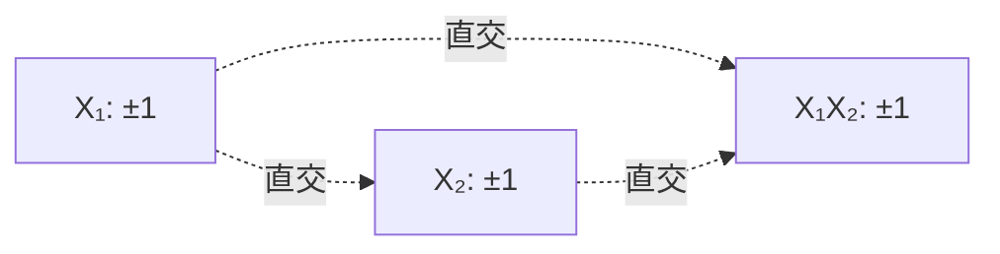
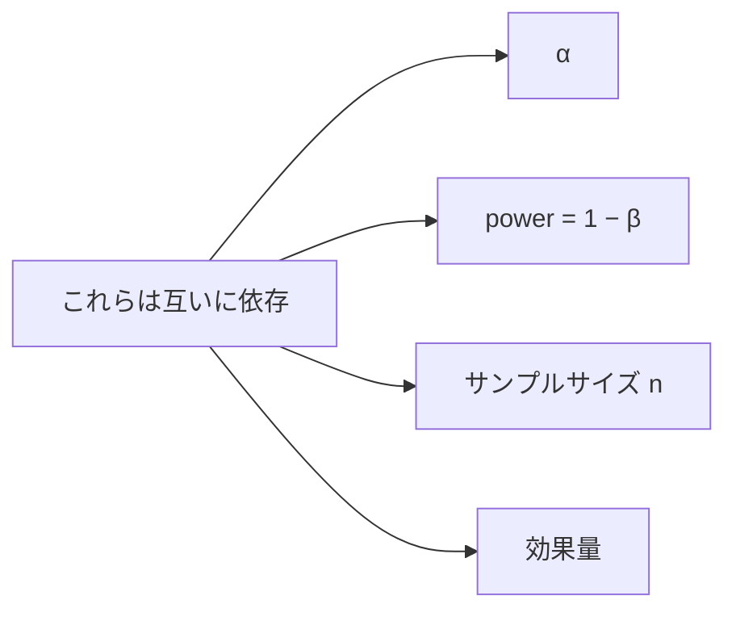

# 学習資料 7 — 実験計画法 (DOE) の理論

> 効率的なデータ収集設計の数学的基礎。
> 使い方は [docs/doe/01-doe.ja.md](01-doe.ja.md)。

## 1. 統計的実験計画法とは

### 1.1 動機

「データを集めてから分析」だけでは、

- **交絡** (因子間の効果が分離できない)
- **偏り** (時刻、場所などの未制御要因)
- **検出力不足** (n が足りず差が見えない)

が起きやすい。**先に設計** することで:

- 各因子の効果を **直交分離**
- 妨害要因を **ブロック化** で吸収
- 必要 n を **検出力解析** で事前に確定
- 試行数を **部分要因 / 最適計画** で削減

### 1.2 Fisher の三原則

1. **反復 (Replication)**: 誤差分散を推定
2. **無作為化 (Randomization)**: 未知のバイアス除去
3. **局所管理 (Blocking)**: 既知のバイアスを取り除く

---

## 2. 完全要因計画 (Full Factorial)

### 2.1 構造

$k$ 因子それぞれが $L$ 水準なら $L^k$ 試行。
全主効果と全次数の交互作用を推定可能。

### 2.2 効果の推定

2 水準計画 ($\pm 1$) の例:

$$ \hat\beta_j = \frac{1}{n} \sum_i x_{ij} y_i $$

(因子 $j$ が $+1$ のときの平均 − $-1$ のときの平均) ÷ 2。

**直交性** ($X^T X = nI$) により、各因子は独立に推定。

### 2.3 直交設計の幾何



すべての列が直交 → 推定が独立、最小分散。

---

## 3. 部分要因計画 (Fractional Factorial)

### 3.1 動機

$k$ が大きいと $2^k$ 試行は爆発。多くの場合、高次交互作用は無視できる。
→ **部分集合**で十分。

### 3.2 Defining relation

$2^{k-p}$ 計画は **$p$ 個の generator** を選ぶ。
例: $k=4, p=1$ で $D = ABC$:

$$ I = ABCD \quad (\text{defining relation}) $$

これから **alias 構造** が導かれる:
- $A$ と $BCD$ が alias (= 区別不可)
- $B$ と $ACD$ が alias

### 3.3 Resolution

| Resolution | 意味 |
|---|---|
| III | 主効果と 2 次交互作用が alias |
| IV | 主効果はクリア、2 次同士が alias |
| V | 主効果と 2 次がクリア |

実用上は **Resolution V** が好ましい (主効果と 2 因子交互作用を分離)。

### 3.4 hanalyze の例

```haskell
-- 2^(4-1) で D = ABC (Resolution IV)
let d = fractionalFactorial 4 [[1, 2, 3]]
-- 8 試行で 4 因子の主効果 + 一部交互作用を推定
```

---

## 4. ラテン方格 (Latin Square)

### 4.1 用途

3 因子のうち 1 つを **応答**、残り 2 つを **ブロック因子** として
扱いたい場合 ($n^2$ 試行で 1 つの主効果を推定)。

### 4.2 構造

$n \times n$ の格子で、各行・各列に $1, \ldots, n$ がそれぞれ 1 回ずつ:

```text
1 2 3
2 3 1
3 1 2
```

### 4.3 ANOVA モデル

$$ y_{ijk} = \mu + \alpha_i + \beta_j + \gamma_k + \varepsilon_{ijk} $$

- $\alpha_i$: 行 (ブロック 1)
- $\beta_j$: 列 (ブロック 2)
- $\gamma_k$: 処理

3 因子がすべて直交 (各行・列に各処理が現れる)。

### 4.4 Graeco-Latin Square

2 つの直交ラテン方格を重ねる → 4 因子。$n=2, 6$ では存在しない (Euler の予想を Bose らが反証 1959)。

---

## 5. ANOVA (分散分析)

### 5.1 一元配置の分解

総平方和 = 群間 + 群内:

$$ \underbrace{\sum_i (y_i - \bar y)^2}_{\text{SS}_T}
   = \underbrace{\sum_g n_g (\bar y_g - \bar y)^2}_{\text{SS}_B}
   + \underbrace{\sum_g \sum_{i \in g} (y_i - \bar y_g)^2}_{\text{SS}_W} $$

### 5.2 F 検定

帰無仮説 $H_0$: 全群の平均が等しい。
$H_0$ の下で:

$$ F = \frac{\text{MS}_B}{\text{MS}_W} \sim F(k-1, n-k) $$

### 5.3 効果量 $\eta^2$

$$ \eta^2 = \frac{\text{SS}_B}{\text{SS}_T} $$

| $\eta^2$ | 効果 |
|---|---|
| 0.01 | small |
| 0.06 | medium |
| 0.14 | large |

---

## 6. 検出力解析

### 6.1 4 つの量の関係

検出力解析の **核心**: 以下の 4 つの量のうち 3 つを指定すると残り 1 つが決まる。

$$ \alpha, \quad \text{power}, \quad n, \quad \text{effect size} $$



### 6.2 t 検定の検出力

$H_0: \mu_1 = \mu_2$, $H_1: \mu_1 \ne \mu_2$。

非心 t 分布の非心パラメタ:

$$ \delta = d \sqrt{\frac{n_1 n_2}{n_1 + n_2}} $$

検出力 $= P(|T| > t_{\alpha/2, df} \mid \delta)$。

### 6.3 効果量

| 指標 | 定義 | 用途 |
|---|---|---|
| Cohen's d | $(\mu_1 - \mu_2) / \sigma$ | 二群差 |
| Cohen's f | $\sigma_\text{means} / \sigma_\text{within}$ | ANOVA |
| Cohen's h | $\arcsin\sqrt{p_1} - \arcsin\sqrt{p_2}$ | 比率 |

| 値 | 解釈 (d / f / h) |
|---|---|
| small | 0.2 / 0.10 / 0.2 |
| medium | 0.5 / 0.25 / 0.5 |
| large | 0.8 / 0.40 / 0.8 |

### 6.4 サンプルサイズ計算

```haskell
-- d=0.5, power=0.8, α=0.05 → n=64 (各群)
sampleSizeTTest 0.5 0.8 0.05
```

---

## 7. 設計の質指標

### 7.1 直交性

$X^T X / n$ が単位行列に近いほど良い。各係数が独立に推定。

### 7.2 D-efficiency

$$ D\text{-eff} = \det(X^T X / n)^{1/p} $$

完全直交 → 1.0。最大化したい (情報行列の体積)。

### 7.3 A-efficiency

$$ A\text{-eff} = \frac{p}{\text{trace}((X^T X / n)^{-1})} $$

平均の推定分散を最小化したい。

### 7.4 VIF (Variance Inflation Factor)

各列について:

$$ \text{VIF}_j = \frac{1}{1 - R_j^2} $$

$R_j^2$ は列 $j$ を他の列で回帰した決定係数。

| VIF | 評価 |
|---|---|
| < 5 | 多重共線性なし |
| 5–10 | 中程度 |
| > 10 | 深刻 |

### 7.5 条件数

$$ \kappa = \lambda_\text{max} / \lambda_\text{min} \quad (\text{固有値}) $$

| $\kappa$ | 評価 |
|---|---|
| < 10 | 良好 |
| 10–30 | 中程度 |
| > 30 | 不安定 |

---

## 8. 応答曲面法 (RSM)

### 8.1 目的

応答 $y$ を最大化/最小化する $\mathbf x$ を見つける。
**二次モデル** で局所近似:

$$ y = \beta_0 + \mathbf b^T \mathbf x + \mathbf x^T B \mathbf x + \varepsilon $$

### 8.2 中心複合計画 (CCD)

3 つの部分:
1. **要因部分**: $2^k$ (or 部分要因) の角点
2. **軸点**: 各因子で $(\pm \alpha, 0, \ldots, 0)$ など
3. **中心点**: $(0, \ldots, 0)$ を $n_C$ 回 (純粋誤差推定)

$\alpha$ の選択:

| 種類 | $\alpha$ | 性質 |
|---|---|---|
| Rotatable (CCC) | $(2^k)^{1/4}$ | 予測分散が原点からの距離のみに依存 |
| Face-centered (CCF) | 1 | 軸点が立方体の面上 |
| Inscribed (CCI) | 1 (factorial を 1/α に縮小) | 全体を立方体に収める |

### 8.3 Box-Behnken 計画

軸点なし、面の中央付近に配置。$k=3, 4, 5$ で構成可能。境界が
極端な値を取れない実験 (e.g. 物理的限界) で有用。

### 8.4 極値の解析的推定

$\partial \hat y / \partial \mathbf x = 0$ から:

$$ \mathbf x^* = -\frac{1}{2} B^{-1} \mathbf b $$

Hessian $B$ の固有値で性質判定:

| 固有値 | 種類 |
|---|---|
| 全部 < 0 | 極大 |
| 全部 > 0 | 極小 |
| 混在 | 鞍点 |

```haskell
let (xStar, yStar, eigs) = optimumPoint fit
-- eigs 全部負 → 極大点
```

---

## 9. 最適計画 (Optimal Design)

### 9.1 動機

- 候補空間が連続で全数可能でない
- 制約 (一部の組み合わせが物理的に不可) がある
- 既存データに **追加** したい (= 拡張可能)

### 9.2 D-optimal

$\det(X^T X)$ を最大化。**情報行列** の体積を最大に。
等価に $\log\det(X^T X)$ を最大化 (数値安定)。

### 9.3 A-optimal

$\text{trace}((X^T X)^{-1})$ を最小化。**平均推定分散** を最小に。

### 9.4 Fedorov 交換アルゴリズム

```text
1. 候補集合 C = {x_1, ..., x_M} から n 行ランダム選択 → 設計 D
2. (i, j) ペア: D の i 番目を C の j 番目で置換した D' を計算
3. D' の方が基準が良ければ採用、繰り返す
4. 改善が止まれば終了 (局所最適)
```

`hanalyze` の `optimalDesign` は cyclic に全ペア試行。
収束は早いが大域最適保証なし。

### 9.5 D vs A の使い分け

| | D-optimal | A-optimal |
|---|---|---|
| 焦点 | 全パラメタの同時推定 | 平均的な推定精度 |
| 計算 | det 最大化 | trace 最小化 |
| ロバスト性 | 標準的 | 個別パラメタ重視 |

---

## 10. 実務的な DOE ワークフロー

```mermaid
graph TD
  S1[1. 目的を明確化<br/>= スクリーニング/最適化/比較] --> S2
  S2[2. 因子と水準範囲を決定] --> S3
  S3[3. 検出力解析でサンプルサイズ算出]
  S3 --> S4{設計タイプ?}
  S4 -->|多因子スクリーニング| S5a[2^(k-p) Resolution IV/V]
  S4 -->|最適化| S5b[CCD / Box-Behnken]
  S4 -->|単純比較| S5c[完全要因 / 乱塊法]
  S4 -->|候補制限あり| S5d[D-optimal]
  S5a --> S6[4. 無作為化して実験実施]
  S5b --> S6
  S5c --> S6
  S5d --> S6
  S6 --> S7[5. ANOVA / 二次回帰で解析]
  S7 --> S8[6. 確認実験 / 次サイクル]
```

---

## 11. よくある落とし穴

| 罠 | 回避策 |
|---|---|
| 因子間の交絡 | 直交設計 + alias 構造を確認 |
| 順序効果 (時刻による drift) | 完全無作為化 |
| 既知バイアス (ロット差) | ブロック化 (乱塊法) |
| サンプル不足 | 検出力 ≥ 0.8 を事前確認 |
| 過大な因子数 | 部分要因でスクリーニング、有意な因子に絞り込んで RSM |
| 外挿 | 最適点が設計範囲の境界 → 範囲を広げて再実験 |

---

## 12. 参考文献

- Box, Hunter, Hunter: *Statistics for Experimenters* (2005, 2nd ed.) — DOE の聖典
- Montgomery: *Design and Analysis of Experiments* (8th ed., 2012)
- Cohen: *Statistical Power Analysis for the Behavioral Sciences* (1988) — 効果量
- Atkinson, Donev: *Optimum Experimental Designs* (1992) — D/A 最適計画
- Myers, Montgomery, Anderson-Cook: *Response Surface Methodology* (4th ed., 2016)
