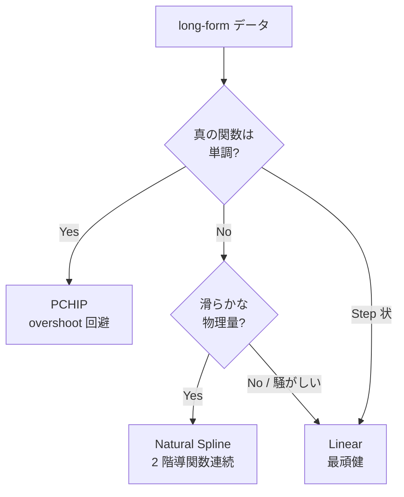

# 歯抜け long-form を共通 grid に揃える (`hanalyze regrid`)

> 🌐 [English](03-regrid.md) | **日本語**

> 関連: [01-dirty-data.ja.md](01-dirty-data.ja.md) (汚いデータ防衛)、
> [DataIO.Preprocess.meltLonger](../../src/hanalyze/Analyze/DataIO/Preprocess.hs) (wide → long)

「半導体プロセスの V-Z プロファイル」のように **id (条件) ごとに z 軸が
微妙にズレ + 部分的に欠損** している long-form データを、**共通 z grid に
揃える** ためのモジュール / CLI。揃ったあとは多出力回帰 (RFF / GP) や
比較プロットにそのまま投入できる。

---

## 補間方式の選び方



| 方式 | API | 特徴 | 向き |
|---|---|---|---|
| `Linear`         | `Hanalyze.Stat.Interpolate.Linear`        | 区間ごと線形 | 騒がしいデータ / sanity check |
| `NaturalSpline`  | `Hanalyze.Stat.Interpolate.NaturalSpline` | 自然 3 次 spline (端点 y''=0) | 滑らかな物理量 |
| `PCHIP`          | `Hanalyze.Stat.Interpolate.PCHIP`         | Fritsch-Carlson 単調保存 | しきい値・累積特性・I-V 曲線等 |

---

## CLI 一発例

```bash
hanalyze regrid data/io/potential_long_jagged.csv \
    --id name --z z --y y \
    --n 30 \
    --interp pchip --grid adaptive --zrange intersect \
    --output regridded.csv \
    --report regrid.html --report-extra
```

| フラグ | 既定 | 意味 |
|---|---|---|
| `--id COL`     | `id`        | id 列名 |
| `--z  COL`     | `z`         | z 列名 |
| `--y  COL`     | `y`         | y 列名 |
| `--n N`        | `30`        | 出力 grid 点数 |
| `--interp`     | `pchip`     | `linear` / `spline` / `pchip` |
| `--grid`       | `adaptive`  | `uniform` / `adaptive` (peak \|dy/dz\| 集中) |
| `--zrange`     | `intersect` | `intersect` (外挿なし) / `union` (和集合) |
| `--output FILE`| (なし)      | 揃った long-form を CSV で出力 |
| `--report FILE`| (なし)      | HTML レポート (R1-R7) |
| `--report-extra` | off       | レポートに R8-R10 追加 |

`--no-header` / `--skip` / `--comment` / `--delim` 等の `LoadOpts` も他
サブコマンド同様に解釈される。

---

## レポート構造

`--report` で出力される HTML には以下が含まれる:

| ID | 必須/Opt | 内容 |
|---|---|---|
| **R1** | 必須 | Parameters: 補間種別 / grid 種別 / N / zrange / 実 zmin・zmax |
| **R2** | 必須 | Interpolation overlay: id ごと facet で原観測点 + 補間曲線 |
| **R3** | 必須 (adaptive 時) | Adaptive density profile: peak \|dy/dz\| + grid 点 vertical rule |
| **R4** | 必須 | Per-id summary: 観測点数 / z レンジ / 外挿距離 / 補間残差 |
| **R5** | 必須 | (R4 に統合) 補間残差最大値 |
| **R6** | 必須 | Extrapolation warning: 外挿が発生する id だけ赤マーカ表示 |
| **R7** | 必須 | Z alignment: id × z の dot plot (z レンジ揃い目視確認) |
| **R8** | Opt | Observation count per id: id ごとの観測点数 bar |
| **R9** | Opt | Monotonicity warning: 元データが単調なのに補間で非単調を検出 |
| **R10**| Opt | Y range comparison: 原データ vs grid の (ymin, ymax) 差表 |

---

## ライブラリ API

```haskell
import qualified Hanalyze.DataIO.Preprocess as Pp
import qualified Hanalyze.Stat.Interpolate  as Interp
import qualified Hanalyze.Stat.AdaptiveGrid as AG

let opts = Pp.defaultRegridOpts
             { Pp.roInterp      = Interp.PCHIP
             , Pp.roGridKind    = AG.Adaptive
             , Pp.roN           = 30
             , Pp.roZBoundsMode = Pp.ZIntersection
             }
    rr   = Pp.regridLong "id" "z" "y" opts df0
    df1  = Pp.rrDataFrame rr     -- 揃った long-form
    grid = Pp.rrZGrid rr         -- N 点 grid
    stats = Pp.rrPerIdStats rr   -- id ごと統計 (レポート用)
```

戻り値の `RegridResult` には DataFrame に加えて、id ごとの観測点数 / z
レンジ / 外挿距離 / 補間残差 / density 列 (adaptive 時) が含まれる。

---

## adaptive grid のしくみ

「変化が激しい z 領域に grid 点を集中させる」を **全 id 共通で**実装するため:


ε はゼロ除算回避と「平坦部にも最低限の点を残す」ため。N < 10 のときは
adaptive 指定でも `uniform` に強制 fallback。

---

## ベンチマーク

`cabal run regrid-bench-demo` で、歯抜けデータの真値復元 RMSE を 6 組合せ
(3 補間 × 2 grid) で比較する HTML レポートを `trash/regrid_bench.html` に
出力する。

サンプル結果 (V(z; D) ポテンシャルダミー):

| 補間 | grid | RMSE |
|---|---|---|
| Linear        | Uniform  | 0.094 |
| Linear        | Adaptive | 0.097 |
| **PCHIP**     | **Uniform** | **0.104** |
| PCHIP         | Adaptive | 0.122 |
| NaturalSpline | Uniform  | 0.513  ← overshoot |
| NaturalSpline | Adaptive | 0.748  ← overshoot |

→ 単調なポテンシャル well では Linear / PCHIP が安定、spline は不向き。

---

## 関連

- ライブラリ: `Hanalyze.Stat.Interpolate` / `Hanalyze.Stat.AdaptiveGrid` / `Hanalyze.DataIO.Preprocess.regridLong`
- レポート: `Hanalyze.Viz.ReportBuilder.secInterpolation` (`InterpReport`)
- demo: `regrid-bench-demo` / `potential-gen --jagged`
- fixture: `data/io/potential_long_jagged.csv` (21 dose × ~80 z 点 = 1709 行)
