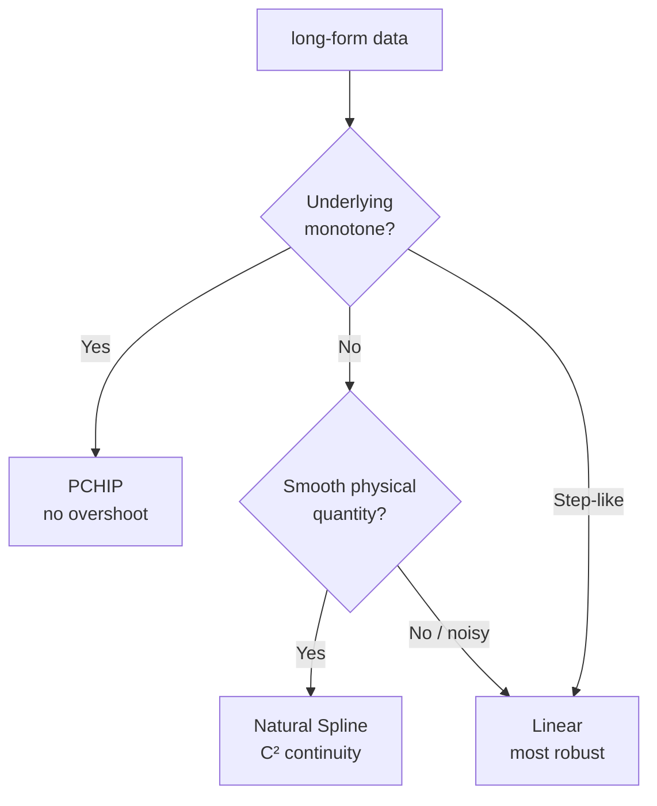

# Regridding jagged long-form data (`hanalyze regrid`)

> 🌐 **English** | [日本語](03-regrid.ja.md)

> Related: [01-dirty-data.md](01-dirty-data.md) (dirty-data defense),
> [DataIO.Preprocess.meltLonger](../../src/DataIO/Preprocess.hs) (wide → long)

For long-form data where the **z axis is slightly misaligned across ids and
partially missing** (typical of "V-Z profiles per process condition" in
semiconductor data), this module / CLI **resamples each id onto a common z
grid**. The resulting tidy data feeds directly into multi-output regression
(RFF / GP) or comparison plots.

---

## Choosing an interpolation method



| Method | API | Characteristic | Best for |
|---|---|---|---|
| `Linear`         | `Stat.Interpolate.Linear`        | piecewise linear | noisy data / sanity check |
| `NaturalSpline`  | `Stat.Interpolate.NaturalSpline` | natural cubic spline (y''=0 at ends) | smooth physical quantities |
| `PCHIP`          | `Stat.Interpolate.PCHIP`         | Fritsch-Carlson monotone-preserving | thresholds, cumulative curves, I-V |

---

## CLI one-shot

```bash
hanalyze regrid data/io/potential_long_jagged.csv \
    --id name --z z --y y \
    --n 30 \
    --interp pchip --grid adaptive --zrange intersect \
    --output regridded.csv \
    --report regrid.html --report-extra
```

| Flag | Default | Meaning |
|---|---|---|
| `--id COL`     | `id`        | id column name |
| `--z  COL`     | `z`         | z column name |
| `--y  COL`     | `y`         | y column name |
| `--n N`        | `30`        | number of grid points |
| `--interp`     | `pchip`     | `linear` / `spline` / `pchip` |
| `--grid`       | `adaptive`  | `uniform` / `adaptive` (concentrated at peak \|dy/dz\|) |
| `--zrange`     | `intersect` | `intersect` (no extrapolation) / `union` |
| `--output FILE`| (none)      | write resampled long-form as CSV |
| `--report FILE`| (none)      | HTML report (R1-R7) |
| `--report-extra` | off       | also emit R8-R10 |

`--no-header` / `--skip` / `--comment` / `--delim` and the other `LoadOpts`
are honored just like in other subcommands.

---

## Report contents

| ID | Required/Opt | Contents |
|---|---|---|
| **R1** | required | Parameters: interp / grid / N / zrange / effective zmin/zmax |
| **R2** | required | Interpolation overlay: per-id facet, raw points + interp curve |
| **R3** | required (adaptive) | Adaptive density profile: peak \|dy/dz\| + grid rules |
| **R4** | required | Per-id summary: n_obs / z range / extrap distance / interp residual |
| **R5** | required | (merged into R4) max interp residual |
| **R6** | required | Extrapolation warning: ids needing extrapolation, in red |
| **R7** | required | Z alignment: id × z dot plot (visually verify aligned z range) |
| **R8** | optional | Observation count per id: bar chart |
| **R9** | optional | Monotonicity warning: detect non-monotone interp on monotone data |
| **R10**| optional | Y range comparison: original vs grid (ymin, ymax) table |

---

## Library API

```haskell
import qualified DataIO.Preprocess as Pp
import qualified Stat.Interpolate  as Interp
import qualified Stat.AdaptiveGrid as AG

let opts = Pp.defaultRegridOpts
             { Pp.roInterp      = Interp.PCHIP
             , Pp.roGridKind    = AG.Adaptive
             , Pp.roN           = 30
             , Pp.roZBoundsMode = Pp.ZIntersection
             }
    rr   = Pp.regridLong "id" "z" "y" opts df0
    df1  = Pp.rrDataFrame rr     -- aligned long-form
    grid = Pp.rrZGrid rr         -- N grid points
    stats = Pp.rrPerIdStats rr   -- per-id stats (for the report)
```

`RegridResult` returns the DataFrame plus per-id n_obs / z range / extrap
distance / interp residual / density (adaptive only) for downstream use.

---

## How adaptive grid works

To concentrate grid points where the function changes rapidly **across all
ids**:


ε avoids division by zero and keeps a minimum density on flat regions. When
N < 10 the adaptive request automatically falls back to `uniform`.

---

## Benchmark

`cabal run regrid-bench-demo` compares true-value-recovery RMSE for 6
combinations (3 interpolations × 2 grids) on a jagged dataset and writes
`trash/regrid_bench.html`.

Sample result on the V(z; D) potential dummy:

| Interp | Grid | RMSE |
|---|---|---|
| Linear        | Uniform  | 0.094 |
| Linear        | Adaptive | 0.097 |
| **PCHIP**     | **Uniform** | **0.104** |
| PCHIP         | Adaptive | 0.122 |
| NaturalSpline | Uniform  | 0.513  ← overshoot |
| NaturalSpline | Adaptive | 0.748  ← overshoot |

→ For monotone potential wells, Linear / PCHIP are stable; spline is unsuitable.

---

## See also

- Library: `Stat.Interpolate` / `Stat.AdaptiveGrid` / `DataIO.Preprocess.regridLong`
- Report: `Viz.ReportBuilder.secInterpolation` (`InterpReport`)
- Demo: `regrid-bench-demo` / `potential-gen --jagged`
- Fixture: `data/io/potential_long_jagged.csv` (21 doses × ~80 z points = 1709 rows)
