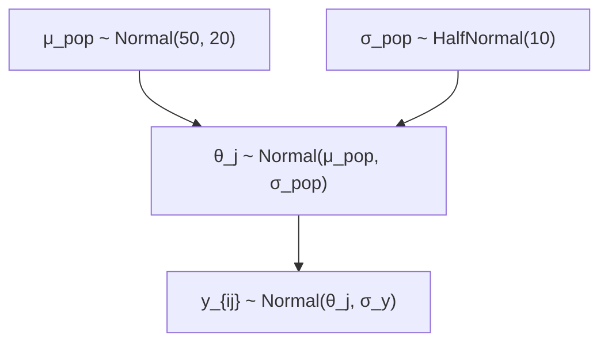
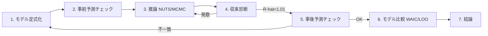

# 学習資料 2 — ベイズ統計の基礎

> ベイズ推論の根本原理から、hanalyze の `Model.HBM` で扱う階層モデル
> までを段階的に解説。

## 1. ベイズの定理

確率論の基本恒等式:

$$ P(A \cap B) = P(A \mid B) P(B) = P(B \mid A) P(A) $$

これを書き換えると **ベイズの定理**:

$$ \boxed{P(A \mid B) = \frac{P(B \mid A) P(A)}{P(B)}} $$

### パラメタ推定の文脈

確率変数を「パラメタ $\theta$」と「観測 $y$」に置き換える:

$$ p(\theta \mid y) = \frac{p(y \mid \theta) \, p(\theta)}{p(y)} $$

| 名前 | 記号 | 意味 |
|---|---|---|
| **事前** (prior) | $p(\theta)$ | データを見る前の信念 |
| **尤度** (likelihood) | $p(y \mid \theta)$ | パラメタ $\theta$ のもとで観測 $y$ が出る確率 |
| **事後** (posterior) | $p(\theta \mid y)$ | データを見たあとの信念 |
| **周辺尤度** / 証拠 (evidence) | $p(y) = \int p(y\mid\theta) p(\theta) d\theta$ | $y$ の周辺分布 |

ベイズ推論の中心思想:

> **事前の信念 × データの尤度 → 事後の信念**

事後 $\propto$ 事前 × 尤度 (定数 $p(y)$ は正規化のため)。

### 例: コインの偏りを推定

- 事前: $\theta \sim \text{Beta}(2, 2)$ (やや 0.5 寄り)
- 尤度: $y_i \sim \text{Bernoulli}(\theta)$ (10 投げて 7 表)
- 事後: $\theta \mid y \sim \text{Beta}(2 + 7, 2 + 3) = \text{Beta}(9, 5)$

事前のパラメタ $(2, 2)$ に「観測の成功カウント 7、失敗カウント 3」を
加えるだけで事後が得られる。これが **共役** の威力。

### hanalyze での書き方

```haskell
coinModel :: ModelP ()
coinModel = do
  theta <- sample "theta" (Beta 2 2)              -- 事前
  observe "y" (Bernoulli theta) coinFlips         -- 尤度 (観測)
  -- 事後は NUTS / Gibbs などで近似サンプリング
```

---

## 2. 尤度の意味

尤度 $p(y \mid \theta)$ は、

- **データを定数とみなして**
- **パラメタの関数として**
- **「このパラメタなら、このデータが出る確率はどのくらいか」を表す**

確率分布**ではない** (パラメタ空間で積分しても 1 にならない)。

### 対数尤度

実装上、密度を積で計算すると桁あふれする。**対数で計算する**:

$$ \log p(y_1, \ldots, y_n \mid \theta) = \sum_{i=1}^n \log p(y_i \mid \theta) $$

hanalyze の `logJoint` は対数事後 ∝ 対数事前 + 対数尤度 を計算する。

```haskell
logJoint :: (Floating a, Ord a) => Model a r -> Map Text a -> a
-- 内部で sample → logDensity を加算、observe → logDensityObs を加算
```

---

## 3. 事前分布の選び方

### 3.1 共役事前 (Conjugate Prior)

**事前と事後が同じ分布族**になる組み合わせ。閉形式で計算できる。

| 尤度 | 共役事前 | 事後 (パラメタ更新) |
|---|---|---|
| Bernoulli/Binomial$(n, p)$ | Beta$(\alpha, \beta)$ | Beta$(\alpha + k, \beta + n - k)$ |
| Poisson$(\lambda)$ | Gamma$(\alpha, \beta)$ | Gamma$(\alpha + \sum y, \beta + n)$ |
| Multinomial$(n, \boldsymbol\pi)$ | Dirichlet$(\boldsymbol\alpha)$ | Dirichlet$(\alpha_k + \text{count}_k)$ |
| Normal$(\mu, \sigma)$, $\sigma$ 既知 | Normal$(\mu_0, \sigma_0)$ | 重み付き平均で更新 |
| Normal$(\mu, \sigma)$, $\mu$ 既知 | InverseGamma$(\alpha, \beta)$ | 二乗和で更新 |

`MCMC.Gibbs.gibbsMH` は、モデル定義から共役構造を自動検出して
個別パラメタを直接 sample する (高速)。

### 3.2 弱情報事前 (Weakly Informative)

「無情報」と言いつつも、暴走を防ぐ程度の情報を入れる:

- 平均: `Normal 0 (大きいスケール)` (e.g. データの sd の 10 倍)
- 標準偏差: `HalfNormal` または `HalfCauchy` (Gelman 2006 推奨)
- 確率: `Beta 1 1` または `Beta 2 2`
- 相関行列: `LKJ(1)`

### 3.3 情報事前 (Informative)

ドメイン知識から「専門家の事前分布」を入れる。
過去の研究結果やドメイン制約を反映。

### 3.4 無情報事前 (Improper / Flat)

**避けるべき**。事前が積分発散すると事後が定義できないことがある。
代わりに弱情報事前を使う。

---

## 4. 階層ベイズモデル (HBM)

### 4.1 動機

パラメタ自体がさらに別のパラメタ (= **ハイパーパラメタ**) に依存。
複数グループのデータを「全体の傾向」と「各グループの偏り」に分解できる。

### 4.2 例: 学校別の試験成績

- 学校 $j$ の平均スコア $\theta_j$ が知りたい
- でも各学校でサンプル数が少ない
- **全学校共通の母集団分布**から $\theta_j$ が引かれている、と仮定



このモデルは:
- 各 $\theta_j$ が母集団から「**部分的に共有**」される
- 少数サンプル校は $\mu_{\text{pop}}$ に**縮約** (shrinkage)
- 多数サンプル校は自身の平均に近づく

### 4.3 hanalyze での書き方

```haskell
schoolModel :: ModelP ()
schoolModel = do
  muPop  <- sample "mu_pop"  (Normal 50 20)
  sigPop <- sample "sig_pop" (HalfNormal 10)
  -- J 校の効果
  thetas <- mapM (\j -> sample ("theta_" <> tShow j)
                                (Normal muPop sigPop))
                 [1 .. nSchools]
  -- 各校の観測
  forM_ (zip thetas dataByschool) $ \(theta, ys) ->
    observe ("y_" <> ...) (Normal theta sigY) ys
```

または `nonCenteredNormal` で **非中心化**:

```haskell
schoolModelNC :: ModelP ()
schoolModelNC = do
  muPop  <- sample "mu_pop"  (Normal 50 20)
  sigPop <- sample "sig_pop" (HalfNormal 10)
  thetas <- mapM (\j -> nonCenteredNormal ("theta_" <> tShow j)
                                          muPop sigPop)
                 [1 .. nSchools]
  ...
```

非中心化は `θ_raw ~ Normal(0,1)` を sample して `θ = μ + σ × raw`
を派生量として記録する。データが少ないとき HMC の発散を防ぐ。

### 4.4 Funnel 問題

階層モデルで `σ_pop` が小さいとき、$\theta_j$ の分布が funnel
(漏斗) 形になり HMC が苦しむ。`energy-demo` / `noncentered-demo`
で実演 (BFMI 0.65 → 1.02、ESS 7.6 倍改善)。

---

## 5. 周辺尤度 (証拠) と モデル選択

事後計算では正規化定数 $p(y) = \int p(y \mid \theta) p(\theta) d\theta$
は通常無視される。しかしモデル比較では重要:

### ベイズファクター

2 モデルの比較:

$$ \text{BF}_{12} = \frac{p(y \mid M_1)}{p(y \mid M_2)} $$

- BF > 10: M1 の強い支持
- BF < 1/10: M2 の強い支持

`p(y | M)` の計算は重く (高次元積分)、hanalyze では未実装。代わりに **WAIC** / **LOO-CV** を使う ([07-model-selection.ja.md] M5 で解説)。

---

## 6. 事後予測分布

新しい観測 $\tilde{y}$ の予測:

$$ p(\tilde{y} \mid y) = \int p(\tilde{y} \mid \theta) p(\theta \mid y) d\theta $$

「事後の各 $\theta$ から $\tilde{y}$ を引いて、それらを混合する」。
hanalyze では `Stat.PosteriorPredictive.posteriorPredictive` で実装。

### 事前予測

データを見る前の予測:

$$ p(\tilde{y}) = \int p(\tilde{y} \mid \theta) p(\theta) d\theta $$

事前の妥当性チェックに使う (= 「この事前で、こんな極端な観測が出るのは
おかしい?」)。`priorPredictive` 関数。

---

## 7. ベイズ推論の典型的なワークフロー



### 各ステップで使う hanalyze 機能

| Step | 機能 |
|---|---|
| 1. モデル定式化 | `Model.HBM` (DSL) |
| 2. 事前予測 | `Stat.PosteriorPredictive.priorPredictive` |
| 3. 推論 | `MCMC.NUTS.nuts`, `MCMC.HMC.hmc`, `MCMC.MH.metropolis`, `MCMC.Gibbs`, `MCMC.Slice` |
| 4. 収束診断 | `Stat.MCMC.rhat`, `ess`, `bfmi`; `Viz.MCMC.{trace,rank,energy}Plot`; `chainDivergences` |
| 5. 事後予測 | `Stat.PosteriorPredictive.posteriorPredictive` + `Viz.MCMC.ppcPlot` |
| 6. モデル比較 | `Stat.ModelSelect.{waic, loo, compareModels}` |
| 7. 結論 | `Viz.MCMC.posteriorSummary*`, `forestPlot`, `Viz.Report.renderReport` |

---

## 次のステップ

- 推論アルゴリズムを学ぶ → [03-mcmc-foundations.ja.md](03-mcmc-foundations.ja.md) (M3)
- 共役性を活かした Gibbs サンプリング → [04-gibbs.ja.md](../04-gibbs.ja.md)
- 階層モデルの demo → `cabal run integrated-demo`, `noncentered-demo`,
  `mvnormal-latent-demo`
