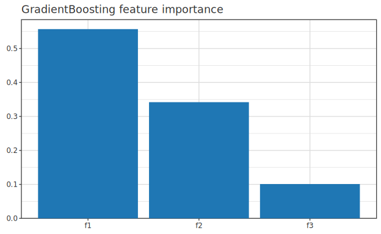
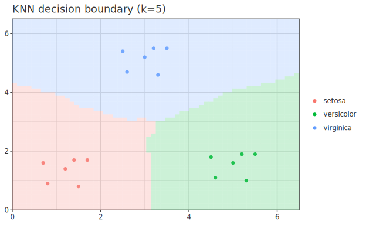
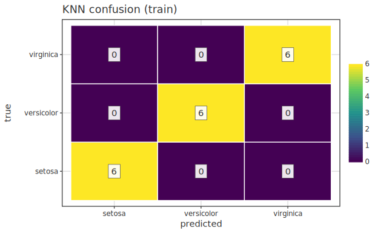

# ML 拡張群 (Phase 34: GBM / SVM / MDS / k-NN / Naive Bayes)

> 2026-05-29 Phase 34 で機械学習系の代表的アルゴリズムを 5 モジュール集約追加。
> 由来 gap 元 17 件 + ml-extensions 追加。 型シグネチャ・最小例・`df |->`/`toPlot`
> 経路は [api-guide 05-ml](../api-guide/05-ml.ja.md) を一次根拠に、 ここは
> **各アルゴリズムの定式化・実装方針・scope 判断** を扱う。 集約言及のみ:
> Random Forest 分類 (`RandomForestClassifier`) と MLP NN (`NeuralNetwork`) は既存。

---

## 0. 全体マップ

| 機能 | 種類 |
|---|---|
| Gradient Boosting | 回帰 + 二値分類 |
| 線形 SVM | 二値 + 多クラス (OvR) |
| MDS | 古典 + Sammon |
| k-NN | 回帰 + 分類 |
| Naive Bayes | Gaussian + Multinomial |

---

## 1. Gradient Boosting (34-A1)

弱学習器は `RandomForest.buildTreeV` (bootstrap 無 + mtry=d で full-data 木) を
流用。 損失: 回帰 = 二乗誤差残差、 分類 = log-loss (gradient = y - sigmoid(F))。
各特徴の分割ゲイン寄与を全ラウンドにわたり累積すると、 特徴重要度のランキングが
得られる:

---

## 2. 線形 SVM (34-A2)

L2-SVM (squared hinge) primal を解析勾配付きで `Hanalyze.Optim.LBFGS` に
渡す。 内部は y ∈ {-1, +1} に変換。 多クラスは one-vs-rest。 カーネル SVM (RBF 等)
は scope 外。

---

## 3. MDS (34-A3)

* `mdsClassical`: Torgerson。 中心化行列 H で `B = -1/2 H D² H` を作り `eigSH` で
  固有分解、 上位 k 固有ベクトルを座標にする。
* `mdsSammon`: 古典 MDS を初期値に、 Sammon stress (元距離の小さいペアを重視した
  重み付き残差) を勾配降下で最小化する。

---

## 4. k-NN (34-A4)

Brute force ユークリッド距離 (O(n_test · n_train · d))。 KD-tree は scope 外。
最近傍 `k` 点の多数決により、 特徴平面上に区分的な決定境界が描かれる:

ホールドアウトデータでの混同行列はクラス別の分類精度を要約する:

---

## 5. Naive Bayes (34-A5)

* Gaussian: クラスごとに各特徴 `N(μ_j, σ²_j)`、 sklearn 互換の var smoothing。
* Multinomial: ラプラス平滑化 α (典型 1.0)、 `log p(feature_j | c)` を蓄積。
* 予測の事後 log 確率は log-sum-exp で正規化済 (exp 和 = 1)。

---

## 6. 集約言及のみ (既存)

| 機能 | 既存 API | 備考 |
|---|---|---|
| Random Forest 分類 | `Hanalyze.Model.RandomForestClassifier` | Phase 13.5 既存 |
| MLP NN | `Hanalyze.Model.NeuralNetwork` | Phase 16 で fitMLPRegressor / fitMLPClassifier 既存 |

---

## 7. scope 外 / 将来拡張

* GBM 多クラス (softmax + K 木 / 反復) — 必要時に追加。
* カーネル SVM (RBF / poly) — QP solver 自前は ROI 薄、 sklearn 連携で代替。
* k-NN の KD-tree / Ball tree — 高次元 / 大規模で brute force が辛い場合に追加。
* Bernoulli Naive Bayes — 二値特徴用、 現状 Multinomial で代用可。

---

## 8. 関連

- 型・最小例・`df |->`/`toPlot` 経路: [api-guide 05-ml](../api-guide/05-ml.ja.md)
- 計画書: `specification/phases/phase-34-ml-extensions.md`
</content>
