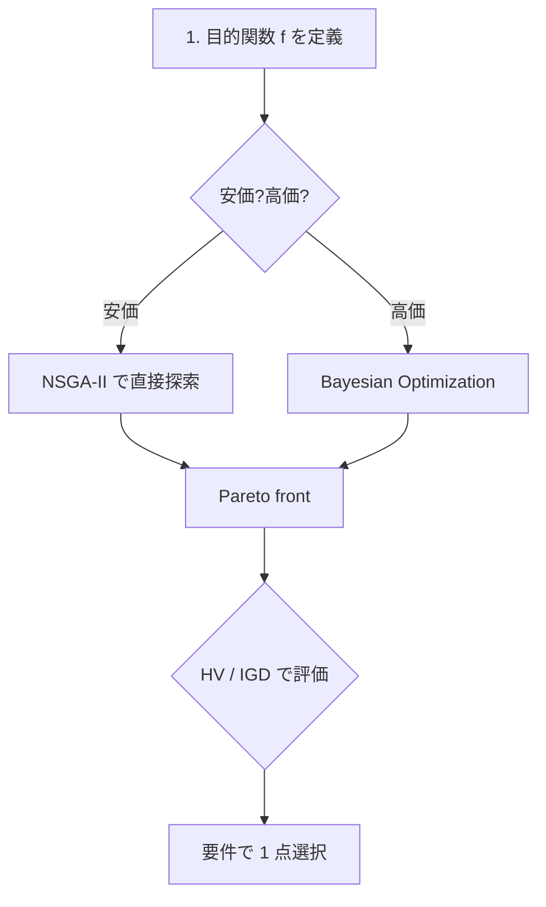

# 多目的最適化 (MOO) の使い方

> 🌐 [English](02-multi-objective.md) | **日本語**

> NSGA-II / Pareto utilities / Bayesian Multi-Objective Optimization。
> 理論は [docs/optim/theory-pareto-moo.ja.md](theory-pareto-moo.ja.md) と
> [docs/optim/theory-bayesopt.ja.md](theory-bayesopt.ja.md)。

## モジュール早見表

| モジュール | 用途 |
|---|---|
| `Hanalyze.Optim.NSGA`         | NSGA-II + 非優越ソート + 遺伝的演算子 |
| `Hanalyze.Optim.Pareto`       | Pareto front utilities (HV / IGD / GD) |
| `Hanalyze.Optim.Acquisition`  | EI / UCB / PI / ParEGO / EHVI |
| `Hanalyze.Optim.BayesOpt`     | Bayesian Optimization ループ (単目的・多目的) |
| `Hanalyze.Optim.Desirability` | Derringer-Suich 望ましさ関数 |
| `Hanalyze.Viz.Pareto`         | Pareto front 可視化 (5 種) |

---

## 1. NSGA-II

```haskell
import Optim.NSGA

-- 例: 2 目的を同時最小化
let f xs = [x_1^2, (x_1 - 2)^2]
        where x_1 = head xs

let cfg = defaultNSGAConfig { nsgaPopSize = 100, nsgaGenerations = 200 }
front <- nsga2 cfg f [(0, 2)] gen
-- front :: [Solution] = Pareto 近似
```

制約付き:
```haskell
let constr xs = max 0 (sum xs - 1)   -- Σ x ≤ 1
front <- nsga2WithConstraints cfg f constr bounds gen
```

---

## 2. Pareto utilities

```haskell
import Optim.Pareto

let pf = paretoFront points       -- 非優越点だけ
let hv = hypervolume refPt points -- HV
let igdV = igd trueFront estFront
```

---

## 3. Bayesian Optimization

```haskell
import Optim.BayesOpt

-- 単一目的 BO (1D)
(history, best) <- bayesOpt cfg f (lo, hi) gen

-- 多目的 BO (NSGA-II 内側)
hist <- bayesOptMOWithNSGA nIter nInit RBF f bounds gen
```

---

## 4. Desirability

```haskell
import Optim.Desirability

let dts = [Maximize 0 1, Minimize 1 0, Target 0.5 0 1]
let d = overallDesirability dts ys   -- ys は応答ベクトル
```

---

## 5. 可視化

```haskell
import Viz.Pareto

paretoCompareFile HTML "out.html" cfg trueFront estFront
parallelCoordinatesFile HTML "out.html" cfg labels front
paretoPairFile HTML "out.html" cfg labels front
```

---

## 6. demo

```bash
cabal run nsga-demo            # ZDT1, Schaffer
cabal run multirsm-demo        # 多目的 RSM + Desirability
cabal run bayesopt-demo        # 単目的・多目的 BO
cabal run materials-moo-demo   # 統合 demo (3 目的、合金組成最適化)
```

---

## 7. 統合ワークフロー


