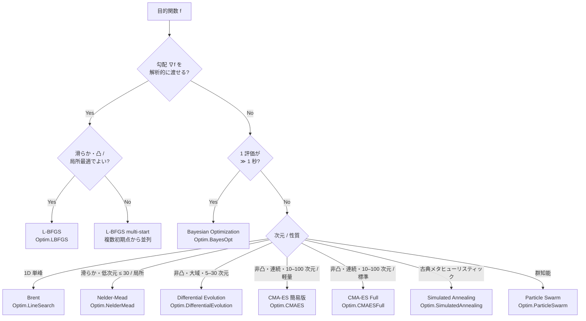

# 最適化アルゴリズムの選び方と box 制約の指定方法

> 🌐 [English](03-algorithm-guide.md) | **日本語**

> 関連: [01-singleobj.ja.md](01-singleobj.ja.md) (単目的)、
> [02-multi-objective.ja.md](02-multi-objective.ja.md) (多目的)、
> [theory-singleobj.ja.md](theory-singleobj.ja.md)、
> [theory-bayesopt.ja.md](theory-bayesopt.ja.md)

`Hanalyze.Optim.*` の全アルゴリズムは **`Hanalyze.Optim.Common.Bounds`** 型と
**`Maybe Bounds` を各 Config に持つ統一インターフェース**でリファクタ済み。
本ドキュメントは「どのアルゴリズムを選ぶか」「制約をどう書くか」を 1 ページに集約する。

---

## 1. アルゴリズム選択フローチャート



### 一覧表 (再掲)

| 状況 | 推奨 | モジュール |
|---|---|---|
| 1D 単峰 | **Brent** | `Hanalyze.Optim.LineSearch` |
| 滑らか・勾配あり | **L-BFGS** | `Hanalyze.Optim.LBFGS` |
| 微分不能・低次元 (≤20) | **Nelder-Mead** | `Hanalyze.Optim.NelderMead` |
| 非凸・大域・微分不要 (≤30 次元) | **Differential Evolution** | `Hanalyze.Optim.DifferentialEvolution` |
| 非凸・連続・高次元 (10–100) | **CMA-ES** | `Hanalyze.Optim.CMAES` / `Hanalyze.Optim.CMAESFull` |
| 古典的メタヒューリスティック | **Simulated Annealing** | `Hanalyze.Optim.SimulatedAnnealing` |
| 群知能 | **Particle Swarm** | `Hanalyze.Optim.ParticleSwarm` |
| 評価コスト極大 | **Bayesian Optimization** | `Hanalyze.Optim.BayesOpt` |
| 多目的 (Pareto front) | **NSGA-II** | `Hanalyze.Optim.NSGA` |
| 等式・不等式制約 | **Augmented Lagrangian** | `Hanalyze.Optim.Constrained` |

---

## 2. 制約条件の指定 — 5 段階

`hanalyze` の `Hanalyze.Optim.*` は制約の種類ごとに 5 段階の API を提供する。

### Level 0 — 無制約

```haskell
import qualified Optim.LBFGS as LBFGS
r <- LBFGS.runLBFGS f gradF x0
```

### Level 1 — box 制約 (各次元 lo ≤ x_i ≤ hi)

すべての `Hanalyze.Optim.*` モジュールで **`<prefix>Bounds :: Maybe Bounds`** フィールドが
config に追加されている (R5 リファクタ)。`Just bs` を渡すと自動で制約処理が走る。

| モジュール | フィールド | 内部処理 |
|---|---|---|
| `Hanalyze.Optim.NelderMead`         | `nmBounds`  | soft penalty (`boundsPenalty`, k=1e6) を目的関数に加算 |
| `Hanalyze.Optim.LBFGS`              | `lbBounds`  | soft penalty + その勾配を ∇f に加算 |
| `Hanalyze.Optim.CMAES`              | `cmBounds`  | サンプル後に **反射** (`clipToBounds`) |
| `Hanalyze.Optim.CMAESFull`          | `cmfBounds` | サンプル後に **反射** (y は元のまま保持し共分散更新を歪めない) |
| `Hanalyze.Optim.DifferentialEvolution` | `deBounds`  | 必須 (初期化と境界補正で使用)。反射方式 |
| `Hanalyze.Optim.SimulatedAnnealing` | `saBounds`  | 提案後に反射 |
| `Hanalyze.Optim.ParticleSwarm`      | `psoBounds` | 位置更新後に反射 |
| `Hanalyze.Optim.NSGA`               | `bounds` (引数) | 必須。反射方式 |
| `Hanalyze.Optim.BayesOpt`           | `boBounds`  | 必須。獲得関数最大化の探索範囲 |

```haskell
import Optim.Common (Bounds)
import qualified Optim.LBFGS as LBFGS

let bs :: Bounds
    bs = [(0, 10), (-1, 1), (-100, 100)]
    cfg = LBFGS.defaultLBFGSConfig { LBFGS.lbBounds = Just bs }
r <- LBFGS.runLBFGSNumeric cfg f x0
```

DE / NSGA / BayesOpt のように **集団ベース** のアルゴリズムでは bounds が
初期化に必須なため引数で受け取る:

```haskell
import qualified Optim.DifferentialEvolution as DE
let cfg = DE.defaultDEConfig (replicate 5 (-5.12, 5.12))
r <- DE.runDEWith cfg rastrigin gen
```

### Level 2 — 等式制約 g(x) = 0

```haskell
import qualified Optim.Constrained as Con
let cs = Con.ConstraintSet
           { Con.csEq   = [\xs -> head xs + xs !! 1 - 1]   -- x1+x2 = 1
           , Con.csIneq = []
           }
(r, viol) <- Con.runAugmentedLagrangian Con.defaultConstrainedConfig f cs x0
```

### Level 3 — 一般不等式制約 h(x) ≤ 0

```haskell
let cs = Con.ConstraintSet
           { Con.csEq   = []
           , Con.csIneq = [\xs -> head xs ^ 2 + (xs!!1)^2 - 1]  -- 単位円内
           }
```

### Level 4 — box + 一般不等式の混合

`boxToIneq` で box を不等式 2 本/次元に展開して結合する:

```haskell
let bs   = [(0, 10), (-1, 1)]
    cs = Con.ConstraintSet
           { Con.csEq   = []
           , Con.csIneq = Con.boxToIneq bs ++
                          [\xs -> head xs * (xs !! 1) - 0.5]
           }
```

または **box は各 algorithm の `<prefix>Bounds` で吸収し、複雑な制約だけ
`ConstraintSet` に書く** 方式が実用上多い。

---

## 3. 内部処理の使い分け方針

`Hanalyze.Optim.Common` は box 制約を扱うヘルパとして次の 3 種を提供する:

| ヘルパ | 用途 | 使うアルゴリズム |
|---|---|---|
| `clipToBounds`   | 反射 (鏡像) で範囲内に折り返す | DE / SA / PSO / CMA-ES (サンプル系) |
| `projectToBounds`| 単純切り捨て | (現状未使用、将来の Active set 法で予定) |
| `boundsPenalty`  | 範囲外で 0 でない二次罰則 | NM / L-BFGS (微分系) |

### なぜ手法ごとに違うのか?

- **微分系** (NM/LBFGS) は f を直接評価するので **罰則加算** が自然。
  L-BFGS は内部で勾配も使うため、罰則項の勾配も合わせて足す。
- **サンプル系** (DE/CMA/SA/PSO) はサンプルを毎ステップ生成するので、
  範囲外サンプルを **反射** で内側に戻すのが安価かつ収束も保たれる。
  CMA-ES では x のみを反射し、共分散更新に使う y は元の値を保持することで
  分布形状を歪めない。

---

## 4. 制約の強度別の選択

| 制約の種類 | 推奨 |
|---|---|
| 「ある程度の越境は容認」だが平均的に内側にいてほしい | `<prefix>Bounds` (penalty/反射) |
| 厳密に範囲を守らないと評価が破綻する (e.g. log の引数) | `Augmented Lagrangian` + 不等式 |
| 等式制約を厳密に守りたい | `Augmented Lagrangian` (etaTolViol で打ち切り) |
| 連続最適化の探索空間制限 | DE/PSO/CMA の bounds (反射) |

---

## 5. 多目的最適化での制約

`Hanalyze.Optim.NSGA` は **constraint dominance** で制約付き多目的最適化を扱う:

```haskell
import qualified Optim.NSGA as NSGA
let cfg = NSGA.defaultNSGAConfig
            { NSGA.nsgaBounds      = [(0, 10), (0, 10)]
            , NSGA.nsgaConstraints = [\xs -> head xs + xs !! 1 - 5]
              -- max(0, c) を violation として加算
            }
result <- NSGA.nsga2 cfg fObj gen
```

詳細は [02-multi-objective.ja.md](02-multi-objective.ja.md) を参照。

---

## 6. クイックリファレンス

```haskell
-- box 制約の宣言
import Optim.Common (Bounds, clipToBounds, boundsPenalty)

let bs :: Bounds = [(0, 1), (-1, 1)]

-- L-BFGS で box 制約付き最適化
LBFGS.runLBFGSNumeric (LBFGS.defaultLBFGSConfig { LBFGS.lbBounds = Just bs }) f x0

-- DE で box 制約付き
DE.runDEWith (DE.defaultDEConfig bs) f gen

-- 一般不等式制約 (Augmented Lagrangian)
let cs = Con.ConstraintSet { csEq = [g_eq], csIneq = [h_ineq] }
Con.runAugmentedLagrangian Con.defaultConstrainedConfig f cs x0

-- box を不等式に展開
let cs' = Con.ConstraintSet { csEq = [], csIneq = Con.boxToIneq bs ++ [h_ineq] }
```
