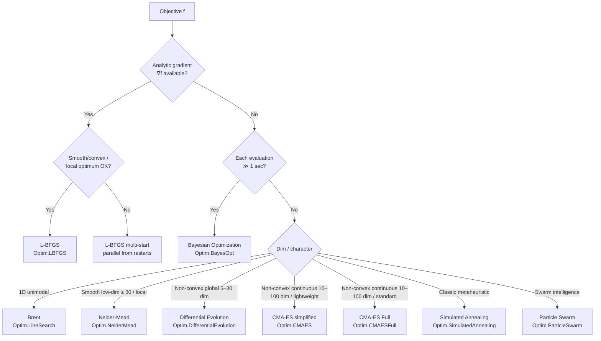

# Choosing an optimisation algorithm and specifying box constraints

> 🌐 **English** | [日本語](03-algorithm-guide.ja.md)

> Related: [01-singleobj.md](01-singleobj.md) (single-objective),
> [02-multi-objective.md](02-multi-objective.md) (multi-objective),
> [theory-singleobj.md](theory-singleobj.md), [theory-bayesopt.md](theory-bayesopt.md)

All algorithms in `Hanalyze.Optim.*` have been refactored around the unified
**`Hanalyze.Optim.Common.Bounds`** type and a **`Maybe Bounds` field on every config**.
This page consolidates "which algorithm to choose" and "how to specify constraints"
into one reference.

---

## 1. Algorithm selection flowchart



### Summary table

| Situation | Recommendation | Module |
|---|---|---|
| 1D unimodal | **Brent** | `Hanalyze.Optim.LineSearch` |
| Smooth + gradient | **L-BFGS** | `Hanalyze.Optim.LBFGS` |
| Non-differentiable, low-dim (≤20) | **Nelder-Mead** | `Hanalyze.Optim.NelderMead` |
| Non-convex, global, gradient-free (≤30 dim) | **Differential Evolution** | `Hanalyze.Optim.DifferentialEvolution` |
| Non-convex continuous, high-dim (10–100) | **CMA-ES** | `Hanalyze.Optim.CMAES` / `Hanalyze.Optim.CMAESFull` |
| Classic metaheuristic | **Simulated Annealing** | `Hanalyze.Optim.SimulatedAnnealing` |
| Swarm intelligence | **Particle Swarm** | `Hanalyze.Optim.ParticleSwarm` |
| Very expensive evaluations | **Bayesian Optimization** | `Hanalyze.Optim.BayesOpt` |
| Multi-objective (Pareto front) | **NSGA-II** | `Hanalyze.Optim.NSGA` |
| Equality / inequality constraints | **Augmented Lagrangian** | `Hanalyze.Optim.Constrained` |

---

## 2. Specifying constraints — five tiers

`hanalyze`'s `Hanalyze.Optim.*` exposes a 5-level API graded by constraint type.

### Level 0 — Unconstrained

```haskell
import qualified Hanalyze.Optim.LBFGS as LBFGS
r <- LBFGS.runLBFGS f gradF x0
```

### Level 1 — Box constraints (lo_i ≤ x_i ≤ hi_i per dimension)

Every `Hanalyze.Optim.*` module has a **`<prefix>Bounds :: Maybe Bounds`** field on its
config (R5 refactor). Passing `Just bs` enables automatic constraint handling.

| Module | Field | Internal handling |
|---|---|---|
| `Hanalyze.Optim.NelderMead`         | `nmBounds`  | soft penalty (`boundsPenalty`, k=1e6) added to f |
| `Hanalyze.Optim.LBFGS`              | `lbBounds`  | soft penalty + its gradient added to ∇f |
| `Hanalyze.Optim.CMAES`              | `cmBounds`  | post-sample **reflection** (`clipToBounds`) |
| `Hanalyze.Optim.CMAESFull`          | `cmfBounds` | post-sample reflection (y unchanged so covariance update is undistorted) |
| `Hanalyze.Optim.DifferentialEvolution` | `deBounds`  | required (init + bound-correction). Reflection |
| `Hanalyze.Optim.SimulatedAnnealing` | `saBounds`  | reflection after proposal |
| `Hanalyze.Optim.ParticleSwarm`      | `psoBounds` | reflection after position update |
| `Hanalyze.Optim.NSGA`               | `bounds` (arg) | required. Reflection |
| `Hanalyze.Optim.BayesOpt`           | `boBounds`  | required. Search range for acquisition maximisation |

```haskell
import Hanalyze.Optim.Common (Bounds)
import qualified Hanalyze.Optim.LBFGS as LBFGS

let bs :: Bounds
    bs = [(0, 10), (-1, 1), (-100, 100)]
    cfg = LBFGS.defaultLBFGSConfig { LBFGS.lbBounds = Just bs }
r <- LBFGS.runLBFGSNumeric cfg f x0
```

For population-based algorithms (DE / NSGA / BO), bounds are required for
initialisation and so are passed positionally:

```haskell
import qualified Hanalyze.Optim.DifferentialEvolution as DE
let cfg = DE.defaultDEConfig (replicate 5 (-5.12, 5.12))
r <- DE.runDEWith cfg rastrigin gen
```

### Level 2 — Equality constraints g(x) = 0

```haskell
import qualified Hanalyze.Optim.Constrained as Con
let cs = Con.ConstraintSet
           { Con.csEq   = [\xs -> head xs + xs !! 1 - 1]   -- x1+x2 = 1
           , Con.csIneq = []
           }
(r, viol) <- Con.runAugmentedLagrangian Con.defaultConstrainedConfig f cs x0
```

### Level 3 — General inequality constraints h(x) ≤ 0

```haskell
let cs = Con.ConstraintSet
           { Con.csEq   = []
           , Con.csIneq = [\xs -> head xs ^ 2 + (xs!!1)^2 - 1]  -- inside unit disc
           }
```

### Level 4 — box + general inequality mixed

`boxToIneq` expands box constraints into 2 inequalities per dimension:

```haskell
let bs   = [(0, 10), (-1, 1)]
    cs = Con.ConstraintSet
           { Con.csEq   = []
           , Con.csIneq = Con.boxToIneq bs ++
                          [\xs -> head xs * (xs !! 1) - 0.5]
           }
```

In practice it is often simpler to **absorb box constraints in each algorithm's
`<prefix>Bounds` and only put complex constraints into `ConstraintSet`**.

---

## 3. Internal handling: why three helpers?

`Hanalyze.Optim.Common` provides three helpers for box constraints:

| Helper | Role | Used by |
|---|---|---|
| `clipToBounds`    | reflect (mirror) back into range | DE / SA / PSO / CMA-ES (sampling family) |
| `projectToBounds` | simple clip                      | (currently unused, reserved for future Active-set methods) |
| `boundsPenalty`   | quadratic penalty outside range  | NM / L-BFGS (gradient-based family) |

### Why algorithm-dependent?

- **Gradient-based** (NM/LBFGS) evaluates f directly, so **adding a penalty** is natural.
  L-BFGS also uses ∇f internally, so the penalty's gradient is added too.
- **Sampling-based** (DE/CMA/SA/PSO) generates samples each step, so **reflecting**
  out-of-range samples is cheap and preserves convergence.
  In CMA-ES we reflect only x and keep the original y for covariance updates,
  to avoid distorting the distribution shape.

---

## 4. Choice by constraint strictness

| Constraint type | Recommendation |
|---|---|
| "Some excursion is OK" but want average inside the box | `<prefix>Bounds` (penalty / reflection) |
| Strict adherence required (e.g. `log` argument must be > 0) | `Augmented Lagrangian` + inequality |
| Strict equality | `Augmented Lagrangian` (terminate via `etaTolViol`) |
| Search-space restriction for continuous optimisers | DE/PSO/CMA bounds (reflection) |

---

## 5. Constraints in multi-objective optimisation

`Hanalyze.Optim.NSGA` handles constrained multi-objective problems via **constraint dominance**:

```haskell
import qualified Hanalyze.Optim.NSGA as NSGA
let cfg = NSGA.defaultNSGAConfig
            { NSGA.nsgaBounds      = [(0, 10), (0, 10)]
            , NSGA.nsgaConstraints = [\xs -> head xs + xs !! 1 - 5]
              -- max(0, c) is added as violation
            }
result <- NSGA.nsga2 cfg fObj gen
```

See [02-multi-objective.md](02-multi-objective.md) for details.

---

## 6. Quick reference

```haskell
-- declare box constraints
import Hanalyze.Optim.Common (Bounds, clipToBounds, boundsPenalty)

let bs :: Bounds = [(0, 1), (-1, 1)]

-- L-BFGS with box constraints
LBFGS.runLBFGSNumeric (LBFGS.defaultLBFGSConfig { LBFGS.lbBounds = Just bs }) f x0

-- DE with box constraints
DE.runDEWith (DE.defaultDEConfig bs) f gen

-- general inequality (Augmented Lagrangian)
let cs = Con.ConstraintSet { csEq = [g_eq], csIneq = [h_ineq] }
Con.runAugmentedLagrangian Con.defaultConstrainedConfig f cs x0

-- expand box to inequalities
let cs' = Con.ConstraintSet { csEq = [], csIneq = Con.boxToIneq bs ++ [h_ineq] }
```
