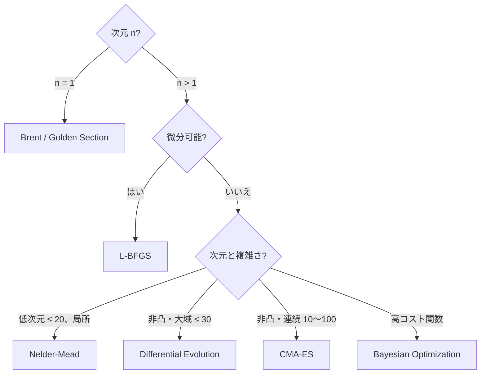

# 学習資料 — 単目的最適化の理論

> 🌐 [English](theory-singleobj.md) | **日本語**

> 各アルゴリズムの数学的背景と直観。
> 使い方は [01-singleobj.ja.md](01-singleobj.ja.md)。

## 1. 最適化の分類

| 軸 | 種類 |
|---|---|
| 微分情報 | 勾配あり / 勾配なし (derivative-free) |
| 探索範囲 | 局所 (local) / 大域 (global) |
| 連続性 | 連続変数 / 離散変数 |
| 制約 | 無制約 / 制約付き (等式/不等式) |
| 確定性 | 決定的 / 確率的 |

`Hanalyze.Optim.*` のカバー範囲は **連続・無制約・決定的または確率的** の単目的最適化。
制約付きは現状では box-constraint (DE/CMA-ES の境界反射) のみ。

---

## 2. Nelder-Mead 単体法

### アルゴリズム

n+1 個の頂点 (= n 次元の単体) を維持し、各反復で最悪点 $x_{n+1}$ を以下のいずれかで更新:

| 操作 | 計算 | 採用条件 |
|---|---|---|
| **反射** | $x_r = x_c + \rho (x_c - x_{n+1})$ | $f_1 \le f_r < f_n$ |
| **拡張** | $x_e = x_c + \chi (x_r - x_c)$ | $f_r < f_1$ かつ $f_e < f_r$ |
| **外縮小** | $x_{oc} = x_c + \gamma (x_r - x_c)$ | $f_r < f_{n+1}$ かつ $f_{oc} \le f_r$ |
| **内縮小** | $x_{ic} = x_c - \gamma (x_c - x_{n+1})$ | $f_r \ge f_{n+1}$ かつ $f_{ic} < f_{n+1}$ |
| **全縮小** | 全頂点を best 中心に σ 倍 | 上記すべて失敗 |

ここで $x_c$ は worst を除く重心、標準パラメタは $(\rho, \chi, \gamma, \sigma) = (1, 2, 0.5, 0.5)$。

### 性質

- **微分不要**
- **収束証明はない** (Lagarias et al. 1998 が低次元での「下降列」性質を示すのみ)
- **次元 n > 10 で性能劣化** (R の `optim` ヘルプも警告)

### hanalyze 実装

`Hanalyze.Optim.NelderMead.runNelderMead`。`nmInitStep` で初期 simplex 幅を調整。

---

## 3. L-BFGS — 準ニュートン法

### Newton 法の問題と BFGS

Newton 法 $x_{k+1} = x_k - H^{-1} \nabla f$ は理論上 2 次収束だが Hessian $H$ の保存と逆行列に
$O(n^2)$〜$O(n^3)$ コスト。**BFGS** は近似 Hessian $B_k$ を rank-2 更新で陽に持つ:

$$ B_{k+1} = B_k + \frac{y_k y_k^\top}{y_k^\top s_k} - \frac{B_k s_k s_k^\top B_k}{s_k^\top B_k s_k} $$

ここで $s_k = x_{k+1} - x_k, y_k = \nabla f_{k+1} - \nabla f_k$。

### L-BFGS の節約

BFGS でも $B_k$ は密行列 (O(n²) メモリ)。**L-BFGS** は $B_k$ を陽に持たず、
直近 $m$ 個の $(s_i, y_i)$ ペアから **two-loop recursion** で $-H_k^{-1} \nabla f_k$ を $O(mn)$ で計算:

```
q ← ∇f_k
for i = k-1, k-2, ..., k-m:
  α_i ← ρ_i s_i^⊤ q
  q   ← q - α_i y_i
r ← γ_k I · q                         (γ_k = s_{k-1}^⊤ y_{k-1} / y_{k-1}^⊤ y_{k-1})
for i = k-m, ..., k-1:
  β_i ← ρ_i y_i^⊤ r
  r   ← r + (α_i - β_i) s_i
return d = -r                          (探索方向)
```

ここで $\rho_i = 1 / (y_i^\top s_i)$。

### 線形探索

各反復で $\alpha$ を選ぶ:

- **Wolfe 条件** (完全版、Strong/Weak): 関数値減少 + 曲率条件
- **Armijo 条件** (簡易版、本実装): $f(x + \alpha d) \le f(x) + c_1 \alpha \nabla f^\top d$、
  backtracking で $\alpha$ を縮小

### 性質

- **超線形収束** (BFGS と同様)
- **メモリ O(mn)** で大規模 (n = 数千) でも実用
- **滑らかさを仮定** (非凸でも局所最小に到達)

### hanalyze 実装

`Hanalyze.Optim.LBFGS.runLBFGS` (解析勾配) / `runLBFGSNumeric` (中央差分)。

---

## 4. Brent 法 (1D 最適化)

### 動機

1D 単峰区間 $[a, b]$ の最小を高精度に求めたい。

### アルゴリズム概要

各反復で 3 点 $(v, w, x)$ (過去 3 つの最良点) を保持し、

1. 放物線補間 $p$ で次の試行点を計算
2. 補間が「内部」「十分小さい」なら採用、さもなくば黄金分割

```
parabolic step:
  r = (x-w)(fx-fv), q = (x-v)(fx-fw)
  d = (r(x-v) - q(x-w)) / (2(r - q))   if r ≠ q
  Accept if |d| < (1/2)|prev step| and a + d ∈ (a, b)
  Otherwise: golden section step
```

### 性質

- **超線形収束** (放物線補間が当たれば 2 次)
- **必ず収束** (黄金分割への自動切替で堅牢)
- **scipy.optimize.brent / R::optimize の標準**

### hanalyze 実装

`Hanalyze.Optim.LineSearch.brent`、`goldenSection` (純粋黄金分割版もあり)。

---

## 5. Differential Evolution (DE)

### アルゴリズム (DE/rand/1/bin)

集団 $\{x_1, ..., x_N\}$ を維持。各個体 $i$ に対して:

1. 集団からランダム 3 個体 $a, b, c$ ($\ne i$)
2. mutation: $v = x_a + F (x_b - x_c)$  ($F$: 微分係数 0.5–0.8)
3. crossover (binomial): $u_j = v_j$ with prob $CR$、else $x_{i,j}$  (少なくとも 1 次元は $v$ から)
4. selection: $f(u) \le f(x_i)$ なら $x_i \leftarrow u$

### 性質

- **微分不要、大域、シンプル**
- **集団サイズ N = 5D 〜 10D** が経験則
- 凸でない多峰関数で堅牢、Rastrigin / Schwefel などの古典ベンチに強い
- 並列化容易 (各個体の評価は独立)

### hanalyze 実装

`Hanalyze.Optim.DifferentialEvolution.runDE`。境界外は反射 (`clipBound`)。

---

## 6. CMA-ES (簡易対角版)

### 動機

DE は微分不要だが共分散構造を活用しない。**CMA-ES** は集団分布を多変量正規 $\mathcal{N}(m, \sigma^2 C)$
としてモデル化し、各世代で $m, \sigma, C$ を適応的に更新。

### アルゴリズム (各世代)

1. **サンプル**: $z_k \sim \mathcal{N}(0, I)$、$x_k = m + \sigma B z_k$  (B は C の Cholesky)
2. **平均更新**: 上位 $\mu$ 個の重み付き平均で $m$ を更新
3. **σ 更新**: パスの長さで現実分布のスケールを補正
4. **C 更新** (rank-μ + rank-1): $C \leftarrow (1 - c_1 - c_\mu) C + c_1 p_c p_c^\top + c_\mu \sum w_i z_i z_i^\top$

完全版 (Hansen 2016) は path cumulation + rank-1 更新を含むが、本実装は
**対角 C のみ** (rank-μ 更新を簡略化、σ も 1/5 ルール風) の **簡易版**。

### 性質 (フルランク版)

- **不変性**: rotation/scale 不変 (ベンチマークで強い)
- **自動チューニング**: σ や C をデータ駆動で更新するためユーザー設定が少ない
- **非凸連続最適化の事実上のベスト** (Hansen 2016)

### hanalyze 実装

`Hanalyze.Optim.CMAES.runCMAES`。簡易版で sphere 5D / Rastrigin 5D 程度は通る。
フルランク CMA-ES は別実装が必要。

---

## 7. アルゴリズム選択フローチャート



---

## 8. 参考文献

- Nelder, J. A., Mead, R. (1965). "A simplex method for function minimization". *Computer Journal*.
- Lagarias, J. C., Reeds, J. A., Wright, M. H., Wright, P. E. (1998). "Convergence properties of the Nelder-Mead simplex method in low dimensions". *SIAM J. Optim.*
- Liu, D. C., Nocedal, J. (1989). "On the limited memory BFGS method for large scale optimization". *Math. Programming*.
- Brent, R. P. (1973). *Algorithms for Minimization without Derivatives*. Prentice-Hall.
- Storn, R., Price, K. (1997). "Differential Evolution - A simple and efficient heuristic". *J. Global Optim.*
- Hansen, N. (2016). "The CMA Evolution Strategy: A Tutorial". arXiv:1604.00772.
- Nocedal, J., Wright, S. J. (2006). *Numerical Optimization* (2nd ed.). Springer.

### 関連 hanalyze ドキュメント

- [01-singleobj.ja.md](01-singleobj.ja.md) — 使用法
- [02-multi-objective.ja.md](02-multi-objective.ja.md) — 多目的
- [theory-bayesopt.ja.md](theory-bayesopt.ja.md) — Bayesian Optimization
- [theory-pareto-moo.ja.md](theory-pareto-moo.ja.md) — Pareto / NSGA-II
