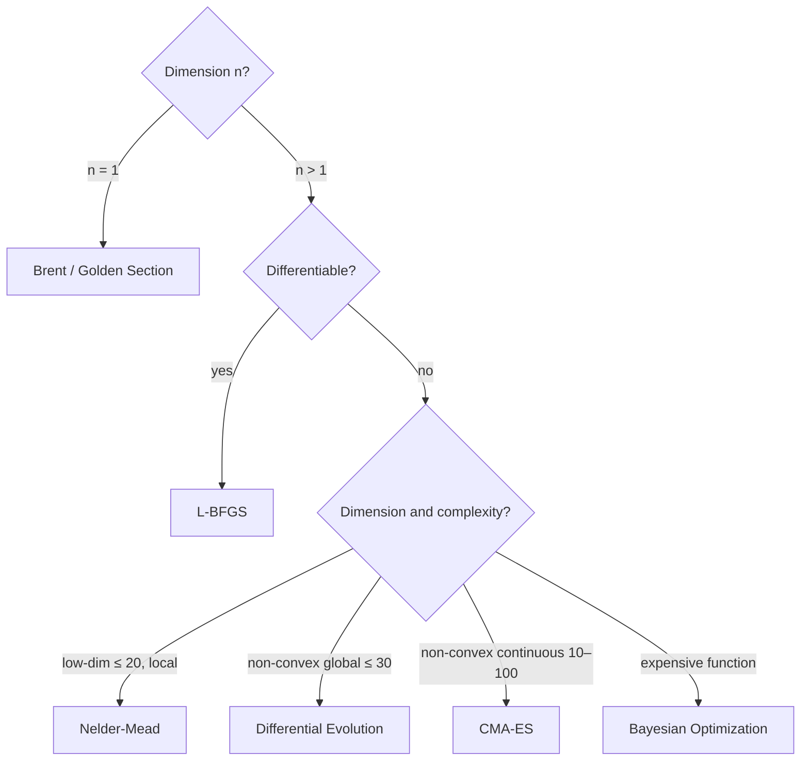

# Study Material — Theory of single-objective optimization

> 🌐 **English** | [日本語](theory-singleobj.ja.md)

> Mathematical background and intuition for each algorithm.
> Practical usage: [01-singleobj.md](01-singleobj.md).

## 1. Optimization taxonomy

| Axis | Variants |
|---|---|
| Derivative info | gradient-based / derivative-free |
| Search scope | local / global |
| Continuity | continuous / discrete |
| Constraints | unconstrained / constrained (eq./ineq.) |
| Determinism | deterministic / stochastic |

`Hanalyze.Optim.*` covers **continuous, unconstrained, deterministic-or-stochastic** single-objective
optimisation. Constraints are limited to box constraints (DE/CMA-ES boundary reflection).

---

## 2. Nelder-Mead simplex

### Algorithm

Maintains n+1 vertices (n-D simplex). Each iteration, the worst vertex $x_{n+1}$ is updated by:

| Operation | Computation | Acceptance |
|---|---|---|
| **Reflection** | $x_r = x_c + \rho (x_c - x_{n+1})$ | $f_1 \le f_r < f_n$ |
| **Expansion** | $x_e = x_c + \chi (x_r - x_c)$ | $f_r < f_1$ and $f_e < f_r$ |
| **Outer contraction** | $x_{oc} = x_c + \gamma (x_r - x_c)$ | $f_r < f_{n+1}$ and $f_{oc} \le f_r$ |
| **Inner contraction** | $x_{ic} = x_c - \gamma (x_c - x_{n+1})$ | $f_r \ge f_{n+1}$ and $f_{ic} < f_{n+1}$ |
| **Shrink** | All vertices σ-contracted toward best | If all above fail |

with $x_c$ the centroid of all but worst, and standard parameters
$(\rho, \chi, \gamma, \sigma) = (1, 2, 0.5, 0.5)$.

### Properties

- **Derivative-free.**
- **No convergence proof** (Lagarias et al. 1998 only show a "descent sequence" property in low dimensions).
- **Performance degrades for n > 10** (R's `optim` help warns of this).

### hanalyze implementation

`Hanalyze.Optim.NelderMead.runNelderMead`. `nmInitStep` controls initial simplex size.

---

## 3. L-BFGS — quasi-Newton

### Newton's problem and BFGS

Newton's method $x_{k+1} = x_k - H^{-1} \nabla f$ converges quadratically in theory, but
storing/inverting the Hessian costs $O(n^2)$–$O(n^3)$. **BFGS** maintains an approximation $B_k$
explicitly via a rank-2 update:

$$ B_{k+1} = B_k + \frac{y_k y_k^\top}{y_k^\top s_k} - \frac{B_k s_k s_k^\top B_k}{s_k^\top B_k s_k} $$

with $s_k = x_{k+1} - x_k, y_k = \nabla f_{k+1} - \nabla f_k$.

### L-BFGS savings

Even BFGS keeps a dense $B_k$ (O(n²) memory). **L-BFGS** does not store $B_k$; instead it
uses the most recent $m$ pairs $(s_i, y_i)$ and a **two-loop recursion** to compute
$-H_k^{-1} \nabla f_k$ in $O(mn)$:

```
q ← ∇f_k
for i = k-1, k-2, ..., k-m:
  α_i ← ρ_i s_i^⊤ q
  q   ← q - α_i y_i
r ← γ_k I · q                         (γ_k = s_{k-1}^⊤ y_{k-1} / y_{k-1}^⊤ y_{k-1})
for i = k-m, ..., k-1:
  β_i ← ρ_i y_i^⊤ r
  r   ← r + (α_i - β_i) s_i
return d = -r                          (search direction)
```

with $\rho_i = 1 / (y_i^\top s_i)$.

### Line search

Pick $\alpha$ each iteration:

- **Wolfe conditions** (full version, Strong/Weak): function-value decrease + curvature condition.
- **Armijo condition** (simplified, used here):
  $f(x + \alpha d) \le f(x) + c_1 \alpha \nabla f^\top d$, with backtracking shrinkage of $\alpha$.

### Properties

- **Super-linear convergence** (same as BFGS).
- **O(mn) memory** so practical even at large n (thousands).
- **Assumes smoothness** (reaches local minima even if non-convex).

### hanalyze implementation

`Hanalyze.Optim.LBFGS.runLBFGS` (analytic gradient) / `runLBFGSNumeric` (central difference).

---

## 4. Brent's method (1D)

### Motivation

High-precision minimum on a 1D unimodal interval $[a, b]$.

### Algorithm sketch

Each iteration keeps three points $(v, w, x)$ (the three best so far) and:

1. Computes a parabolic interpolation $p$.
2. Accepts if "internal" and step size is small enough; otherwise falls back to golden section.

```
parabolic step:
  r = (x-w)(fx-fv), q = (x-v)(fx-fw)
  d = (r(x-v) - q(x-w)) / (2(r - q))   if r ≠ q
  Accept if |d| < (1/2)|prev step| and a + d ∈ (a, b)
  Otherwise: golden section step
```

### Properties

- **Super-linear convergence** (quadratic when parabolic fits).
- **Always converges** (auto-fallback to golden section provides robustness).
- **Standard for `scipy.optimize.brent` / `R::optimize`.**

### hanalyze implementation

`Hanalyze.Optim.LineSearch.brent`; `goldenSection` is also provided as a pure golden-section variant.

---

## 5. Differential Evolution (DE)

### Algorithm (DE/rand/1/bin)

Maintain a population $\{x_1, ..., x_N\}$. For each individual $i$:

1. Pick three random others $a, b, c$ ($\ne i$).
2. mutation: $v = x_a + F (x_b - x_c)$ (with mutation factor $F$ in 0.5–0.8).
3. crossover (binomial): $u_j = v_j$ with prob $CR$, else $x_{i,j}$ (force at least one dim from $v$).
4. selection: $f(u) \le f(x_i)$ → accept.

### Properties

- **Gradient-free, global, simple.**
- **Population size $N$ = 5D – 10D** as a heuristic.
- Robust on multi-modal non-convex functions; strong on Rastrigin / Schwefel benchmarks.
- Easy to parallelise (each individual evaluates independently).

### hanalyze implementation

`Hanalyze.Optim.DifferentialEvolution.runDE`. Out-of-bounds candidates are reflected (`clipBound`).

---

## 6. CMA-ES (simplified diagonal version)

### Motivation

DE is gradient-free but does not exploit covariance structure. **CMA-ES** models the
population distribution as a multivariate normal $\mathcal{N}(m, \sigma^2 C)$ and adapts
$m, \sigma, C$ each generation.

### Algorithm (per generation)

1. **Sample**: $z_k \sim \mathcal{N}(0, I)$, $x_k = m + \sigma B z_k$ (B is the Cholesky of C).
2. **Mean update**: weighted average of the top $\mu$ samples.
3. **σ update**: adjust scale via the length of the evolution path.
4. **C update** (rank-μ + rank-1):
   $C \leftarrow (1 - c_1 - c_\mu) C + c_1 p_c p_c^\top + c_\mu \sum w_i z_i z_i^\top$.

The full version (Hansen 2016) includes path cumulation + rank-1; this implementation is
**diagonal C only** (with simplified rank-μ; σ uses a 1/5-rule-like multiplier) — a
**simplified version**.

### Properties (full version)

- **Invariance**: rotation/scale invariant (strong on benchmarks).
- **Auto-tuning**: σ and C are data-driven, so users have few knobs.
- **De-facto best for non-convex continuous optimisation** (Hansen 2016).

### hanalyze implementation

`Hanalyze.Optim.CMAES.runCMAES`. The simplified version handles sphere 5D / Rastrigin 5D etc.;
a full-rank CMA-ES would be a separate implementation.

---

## 7. Algorithm-selection flowchart



---

## 8. References

- Nelder, J. A., Mead, R. (1965). "A simplex method for function minimization". *Computer Journal*.
- Lagarias, J. C., Reeds, J. A., Wright, M. H., Wright, P. E. (1998). "Convergence properties of the Nelder-Mead simplex method in low dimensions". *SIAM J. Optim.*
- Liu, D. C., Nocedal, J. (1989). "On the limited memory BFGS method for large scale optimization". *Math. Programming*.
- Brent, R. P. (1973). *Algorithms for Minimization without Derivatives*. Prentice-Hall.
- Storn, R., Price, K. (1997). "Differential Evolution - A simple and efficient heuristic". *J. Global Optim.*
- Hansen, N. (2016). "The CMA Evolution Strategy: A Tutorial". arXiv:1604.00772.
- Nocedal, J., Wright, S. J. (2006). *Numerical Optimization* (2nd ed.). Springer.

### Related hanalyze docs

- [01-singleobj.md](01-singleobj.md) — usage
- [02-multi-objective.md](02-multi-objective.md) — multi-objective
- [theory-bayesopt.md](theory-bayesopt.md) — Bayesian Optimization
- [theory-pareto-moo.md](theory-pareto-moo.md) — Pareto / NSGA-II
