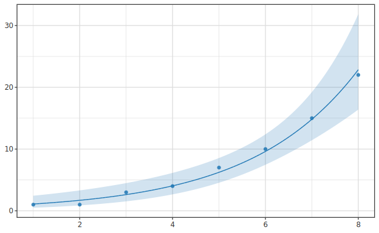

# GLM (Generalized Linear Models) — full family coverage

> 🌐 **English** | [日本語](02-glm.ja.md)

> `Hanalyze.Model.GLM` is the natural extension of LM that covers response variables outside
> the normal distribution (binomial, Poisson, negative binomial, …).
> Related: [01-lm.md](01-lm.md) / [03-glmm.md](03-glmm.md)
> **Multi-output**: `fitGLMMulti` (per-column IRLS) — see [05-multivariate.md](05-multivariate.md).

## Contents

1. [The three GLM components](#1-the-three-glm-components)
2. [Exponential family](#2-exponential-family)
3. [Link functions](#3-link-functions)
4. [Estimation by IRLS](#4-estimation-by-irls)
5. [Implementation in hanalyze](#5-implementation-in-hanalyze)
6. [Per-family discussion](#6-per-family-discussion)
7. [Deviance and pseudo R²](#7-deviance-and-pseudo-r²)
8. [Diagnostics](#8-diagnostics)
9. [Connection to GLMM](#9-connection-to-glmm)
10. [Common pitfalls](#10-common-pitfalls)
11. [References](#11-references)

---

## 1. The three GLM components

A GLM (Nelder & Wedderburn 1972) is defined by three components:

1. **Response distribution** (random component): $y_i$ follows a member of the exponential family.
   $$ y_i \mid \mu_i \sim \text{ExponentialFamily}(\mu_i, \phi) $$
2. **Linear predictor** (systematic component):
   $$ \eta_i = X_i \boldsymbol\beta $$
3. **Link function** (linking $\mu_i$ and $\eta_i$):
   $$ g(\mu_i) = \eta_i, \quad \text{i.e. } \mu_i = g^{-1}(\eta_i) $$

LM is the special case (response = Normal, link = Identity).

---

## 2. Exponential family

Standard form:

$$ p(y; \theta, \phi) = \exp\!\left( \frac{y\theta - b(\theta)}{\phi} + c(y, \phi) \right) $$

- $\theta$: natural parameter
- $\phi$: dispersion parameter (e.g. $\sigma^2$ for Gaussian)
- $b(\theta)$: cumulant function ($E[Y] = b'(\theta)$, $\text{Var}(Y) = \phi b''(\theta)$)

| Distribution | $\theta$ | $\phi$ | $b(\theta)$ | mean | variance |
|---|---|---|---|---|---|
| Normal $(\mu, \sigma^2)$ | $\mu$ | $\sigma^2$ | $\theta^2 / 2$ | $\theta$ | $\sigma^2$ |
| Bernoulli/Binomial | $\log\frac{p}{1-p}$ | 1 | $n\log(1+e^\theta)$ | $np$ | $np(1-p)$ |
| Poisson $(\lambda)$ | $\log \lambda$ | 1 | $e^\theta$ | $\lambda$ | $\lambda$ |
| Gamma $(\mu, \nu)$ | $-1/\mu$ | $1/\nu$ | $-\log(-\theta)$ | $\mu$ | $\mu^2 / \nu$ |
| Inverse Gaussian | $-1/(2\mu^2)$ | $1/\lambda$ | $-\sqrt{-2\theta}$ | $\mu$ | $\mu^3/\lambda$ |
| NegBinomial $(\mu, \alpha)$ | $\log\frac{\mu}{\mu+\alpha}$ | 1 (fixed α) | $-\alpha \log(1-e^\theta)$ | $\mu$ | $\mu + \mu^2/\alpha$ |

The **variance function** $V(\mu) = b''(\theta(\mu))$, which differs across distributions, is the essence of the GLM framework.

---

## 3. Link functions

Every distribution has a **canonical link** that maps $\theta$ itself to $\eta$:

| Distribution | Canonical link | $g(\mu)$ | $g^{-1}(\eta)$ |
|---|---|---|---|
| Normal | Identity | $\mu$ | $\eta$ |
| Binomial | Logit | $\log(\mu/(1-\mu))$ | $1/(1+e^{-\eta})$ |
| Poisson | Log | $\log \mu$ | $e^\eta$ |
| Gamma | Inverse | $1/\mu$ | $1/\eta$ |
| Inverse Gaussian | Inverse² | $1/\mu^2$ | $1/\sqrt\eta$ |

Canonical links have nice properties (sufficient statistics, Fisher = observed information), but **other links can be used**:

- **Probit** (Binomial, $\Phi^{-1}(\mu)$ — Φ is the standard normal CDF)
- **Cloglog** (Binomial, $\log(-\log(1-\mu))$ — survival-analysis flavour)
- **Sqrt** (Poisson, $\sqrt\mu$ — variance-stabilising)

hanalyze supports `Identity / Log / Logit / Sqrt`.

---

## 4. Estimation by IRLS

### 4.1 Why MLE is hard

LM has a closed form ($\hat\beta = (X^T X)^{-1} X^T y$); GLM requires iteration because the link makes it **non-linear**.

### 4.2 IRLS (Iteratively Reweighted Least Squares)

Each iteration solves a **weighted OLS**:

```text
1. initial β₀
2. iterate:
   η = X β
   μ = g⁻¹(η)
   z = η + (y - μ) / g'(μ)        # working response
   W = diag(1 / (g'(μ)² V(μ)))   # weights
   β_new = (Xᵀ W X)⁻¹ Xᵀ W z
3. stop when ||β_new - β|| < tol
```

### 4.3 Intuition

- $z$ is a Taylor expansion of $y$ around the linear predictor.
- $W$ down-weights high-variance points.
- The whole thing is a **reweighted average updated iteratively**.

### 4.4 hanalyze implementation

```haskell
-- excerpt from src/Model/GLM.hs
runIRLS :: Family -> LinkFn -> LA.Matrix Double -> LA.Vector Double
        -> (FitResult, LA.Matrix Double)
runIRLS family linkFn x y = ...
  where
    step = irlsStep link (varOf family) safeMu family x y
    converge n beta
      | norm < tol = beta
      | otherwise  = converge (n - 1) (step beta)
```

Returns the **inverse Fisher information** alongside the fit (used for confidence intervals and Bayesian Laplace approximations).

---

## 5. Implementation in hanalyze

### 5.1 Main API

```haskell
import Hanalyze.Model.GLM
import Hanalyze.Model.Core (FitResult)

-- Family
data Family = Gaussian | Binomial | Poisson
  deriving (Show, Eq)

-- Link function
data LinkFn = Identity | Log | Logit | Sqrt
  deriving (Show, Eq)

-- Basic fit (canonical link)
fitGLM :: Family -> LA.Matrix Double -> LA.Vector Double -> FitResult

-- Variant returning Fisher information
fitGLMFull :: Family -> LinkFn -> LA.Matrix Double -> LA.Vector Double
           -> (FitResult, LA.Matrix Double)

-- DataFrame variant with smooth bands
fitGLMWithSmooth :: Family -> LinkFn -> [(Text, Int)] -> Band -> Int
                 -> DataFrame -> Text
                 -> Maybe (FitResult, Maybe SmoothFit)
```

### 5.2 Minimal example: logistic regression

**High-level (`df |-> glm`)** — fit from a data source and overlay the fitted
curve + band on a scatter (the universal verb, see [../io/04-fit-api.md](../io/04-fit-api.md)):

```haskell
import Hanalyze.Plot     (glm, (|->), toPlot)
import Hgg.Plot.Spec        (layer, scatter)
import Hgg.Plot.Frame       ((|>>))
import Hgg.Plot.Backend.SVG (saveSVGBound)
import Hanalyze.Model.GLM (Family (..), LinkFn (..))

let fit = df |-> glm Binomial Logit "x" "y"   -- GLMModel (canonical link = Logit)
saveSVGBound "logit.svg" (df |>> (layer (scatter "x" "y") <> toPlot fit))
```

**Lower-level (matrix API)**:

```haskell
import Hanalyze.Model.GLM
import Hanalyze.Model.Core (coefficientsV)

let xs   = ...                                -- design matrix (column 0 = intercept)
    ys   = LA.fromList [0, 1, 1, 0, 1, ...]   -- 0/1 response
    fit  = fitGLM Binomial xs ys             -- canonical link = Logit
    beta = coefficientsV fit                  -- coefficients in logit space
    -- probabilities: p = 1 / (1 + exp(-Xβ))
```

### 5.3 Poisson regression (counts)

**High-level**: `df |-> glm Poisson Log "x" "y"` (same overlay pipeline as above).

**Lower-level (matrix API)**:

```haskell
let cnt  = LA.fromList [3, 5, 0, 2, 7, ...]   -- non-negative integers
    fit  = fitGLM Poisson xs cnt             -- canonical = Log
    beta = coefficientsV fit
    -- expected counts: λ = exp(Xβ)
```

### 5.4 From the CLI

```bash
# Logistic regression
hanalyze data.csv x y GLM -d binomial -l logit --report

# Poisson regression
hanalyze data.csv x y GLM -d poisson -l log --report

# Probit (Binomial + Probit) is not yet exposed via CLI; call from Haskell.
```

---

## 6. Per-family discussion

### 6.1 Gaussian (= LM)

Continuous real response with Gaussian noise:

$$ y_i \sim \text{Normal}(\mu_i, \sigma^2), \quad \mu_i = X_i \boldsymbol\beta $$

Equivalent to LM. Prefer `Hanalyze.Model.LM.fitLM` (no IRLS, closed form).
`fitGLM Gaussian xs ys` produces the same result.

### 6.2 Binomial (logistic / probit)

Binary response or "successes out of n trials".

#### 6.2.1 Equations

$$ y_i \sim \text{Binomial}(n_i, p_i), \quad g(p_i) = X_i \boldsymbol\beta $$

Link choices:

| Link | $g(p)$ | $g^{-1}(\eta)$ | Use |
|---|---|---|---|
| **Logit** (canonical) | $\log\frac{p}{1-p}$ | $\sigma(\eta) = \frac{1}{1+e^{-\eta}}$ | standard logistic regression |
| **Probit** | $\Phi^{-1}(p)$ | $\Phi(\eta)$ | probit model |
| **Cloglog** | $\log(-\log(1-p))$ | $1 - \exp(-e^\eta)$ | "first hit time" analysis |

In practice **logit and probit yield essentially identical fits**. Logit coefficients are
log-odds ratios, which is convenient for interpretation.

#### 6.2.2 hanalyze

```haskell
fitGLM Binomial xs ys              -- canonical = Logit
fitGLMFull Binomial Logit xs ys    -- explicit
-- Probit is currently unsupported (Logit yields essentially equivalent results).
```

#### 6.2.3 Interpretation

If $\beta_j = 0.5$ in a logistic fit:

- A unit increase in $x_j$ increases **log-odds by +0.5**.
- Equivalently the **odds multiply by $e^{0.5} \approx 1.65$** (a 65 % increase).

#### 6.2.4 Example: clinical trial

```haskell
-- Predict success/failure (0/1) from age and treatment arm
let xs = LA.fromColumns
           [ LA.konst 1 n             -- intercept
           , LA.fromList ages         -- age
           , LA.fromList treatments   -- 0 = control / 1 = treatment
           ]
    fit = fitGLM Binomial xs (LA.fromList outcomes)
```

### 6.3 Poisson (counts)

Non-negative integer response (occurrences, frequencies):

$$ y_i \sim \text{Poisson}(\lambda_i), \quad \log \lambda_i = X_i \boldsymbol\beta $$

Distinctive feature: **mean = variance** ($E[Y] = \text{Var}(Y) = \lambda$).

#### 6.3.1 hanalyze

```haskell
fitGLM Poisson xs counts   -- canonical = Log
```

#### 6.3.2 Interpretation

If $\beta_j = 0.3$:

- A unit increase in $x_j$ increases the **log expected count by +0.3**.
- Equivalently the **expected count multiplies by $e^{0.3} \approx 1.35$** (a 35 % increase).

Visualising a Poisson fit with `toPlot` shows the raw counts, the fitted
expected-count curve $\lambda = e^{X\beta}$, and the surrounding interval:



#### 6.3.3 Offsets (exposure)

When counts are observed over different durations, fix log(time) as an **offset**:

$$ \log \lambda_i = X_i \boldsymbol\beta + \log T_i $$

→ $\lambda_i = T_i \cdot \exp(X_i \boldsymbol\beta)$, equivalent to regressing rates (counts/time).
hanalyze does not yet expose an offset argument; add the offset column to the design matrix and constrain its coefficient to 1 manually.

### 6.4 NegativeBinomial (overdispersion)

#### 6.4.1 Motivation

Poisson assumes **mean = variance**, but real count data often have **mean < variance** (overdispersion). NegativeBinomial accommodates this.

$$ y_i \sim \text{NegativeBinomial}(\mu_i, \alpha) $$

Mean $\mu_i$, variance $\mu_i + \mu_i^2/\alpha$ (Poisson is recovered as $\alpha \to \infty$).

#### 6.4.2 As a GLM

- Link: Log ($\log \mu = X\beta$)
- $\alpha$ is a **nuisance parameter** (estimated separately).

NegativeBinomial is not strictly a regular exponential family (it is when $\alpha$ is fixed,
not when free). hanalyze's `fitGLM` does not currently include it as a family, but the
Bayesian framework (`Hanalyze.Model.HBM` `NegativeBinomial`) does:

```haskell
-- Bayesian NB regression (Model.HBM)
nbModel :: ModelP ()
nbModel = do
  beta  <- mapM (\j -> sample ("b" <> tShow j) (Normal 0 5)) [0..p-1]
  alpha <- sample "alpha" (HalfNormal 5)
  let mus = [exp (sum (zipWith (*) (xRow i) beta)) | i <- [0..n-1]]
  observe "y" (NegativeBinomial (mus !! ...) alpha) ys
```

#### 6.4.3 NB derivation (Gamma-Poisson mixture)

Detailed in [03-glmm.md](03-glmm.md), summary:

> Marginalising $\lambda \sim \text{Gamma}(\alpha, \beta)$, $y \mid \lambda \sim \text{Poisson}(\lambda)$
> yields $y \sim \text{NegativeBinomial}$.

i.e. **the Poisson rate fluctuates according to a Gamma**. That is the source of overdispersion.
See `negbinom-demo`.

### 6.5 Gamma (positive continuous)

Positive continuous response (durations, costs, weather, …):

$$ y_i \sim \text{Gamma}(\nu, \nu/\mu_i), \quad g(\mu_i) = X_i \boldsymbol\beta $$

- Fixed shape $\nu$, scale $= \nu/\mu$ → mean $\mu$, variance $\mu^2/\nu$.
- Link: Inverse (canonical) / Log / Identity.

#### Use

- Waiting times (insurance claim sizes, repair times).
- Heteroscedasticity (alternative to log-transforming the response).

#### hanalyze

`Hanalyze.Model.GLM` does not yet implement the Gamma family. Workarounds:
- log-transform the response and use LM.
- Bayesian fit via `Hanalyze.Model.HBM.Gamma`.

### 6.6 InverseGaussian

Positive continuous response with **variance proportional to the cube of the mean** (Wald distribution):

$$ \text{Var}(Y) = \mu^3 / \lambda $$

- Use: engineering durability tests.
- Not implemented in hanalyze.

---

## 7. Deviance and pseudo R²

### 7.1 Deviance

The GLM analogue of the LM RSS:

$$ D(\mathbf{y}, \hat{\boldsymbol\mu}) = 2 \left[ \log L(\mathbf{y}; \mathbf{y}) - \log L(\hat{\boldsymbol\mu}; \mathbf{y}) \right] $$

= log-likelihood ratio of the saturated model (one parameter per observation) versus the fitted model. Lower $D$ ⇒ better fit.

### 7.2 Per-family deviance

- **Gaussian**: $D = \sum (y_i - \hat\mu_i)^2 / \sigma^2$ (= RSS)
- **Binomial**: $D = 2 \sum [y_i \log(y_i / \hat\mu_i) + (n_i - y_i) \log((n_i - y_i)/(n_i - \hat\mu_i))]$
- **Poisson**: $D = 2 \sum [y_i \log(y_i / \hat\mu_i) - (y_i - \hat\mu_i)]$

### 7.3 Pseudo R²

R²-like indices for GLMs; multiple flavours exist:

| Name | Definition |
|---|---|
| **McFadden** | $1 - \log L(\hat) / \log L(\text{null})$ |
| **Cox-Snell** | $1 - (L_{\text{null}}/L_{\hat})^{2/n}$ |
| **Nagelkerke** | normalised Cox-Snell |
| **Deviance** | $1 - D(\hat) / D(\text{null})$ |

hanalyze's `pseudoR2` (`Hanalyze.Model.GLM`) uses the **deviance-based** definition.
Do not compare these directly to LM R² — the scales differ.

---

## 8. Diagnostics

### 8.1 Residual types

| Name | Definition |
|---|---|
| **Pearson** | $r_i^P = (y_i - \hat\mu_i) / \sqrt{V(\hat\mu_i)}$ |
| **Deviance** | $r_i^D = \text{sign}(y_i - \hat\mu_i) \sqrt{d_i}$, $d_i$ = single-point deviance |
| **Working** | IRLS working response $z - \eta$ |

**Deviance residuals** are typically the recommended choice (approximately N(0,1)).

### 8.2 Overdispersion

For Poisson / Binomial:

$$ \hat\phi = \frac{\sum (r_i^P)^2}{n - p - 1} $$

- $\hat\phi \approx 1$: OK
- $\hat\phi > 1.5$: possible overdispersion

Remedies:
1. **Quasi-likelihood**: replace variance by $\phi V(\mu)$ (estimates unchanged, SEs widen).
2. **NegativeBinomial** (alternative to Poisson).
3. **Beta-Binomial** (alternative to Binomial; available in hanalyze as a `BetaBinomial` observation).
4. **Mixed effects (GLMM)** to absorb residual correlation ([03-glmm.md](03-glmm.md)).

### 8.3 Influential points

As in LM, detected by leverage and Cook's distance, with GLM-specific variants.

---

## 9. Connection to GLMM

GLM limitations:
- Assumes **independent observations**.
- Real data are often grouped (patients within hospitals, students within schools) → correlated.

→ **GLMM** addresses this by adding **random effects** to model between-group variability:

$$ g(\mu_{ij}) = X_{ij} \boldsymbol\beta + Z_{ij} \mathbf{u}_j, \quad \mathbf{u}_j \sim \text{Normal}(0, G) $$

See [03-glmm.md](03-glmm.md) for details.

### Example: overdispersed Poisson as a GLMM

"Overdispersed Poisson" can be interpreted as marginalising a per-observation random effect:

$$ y_i \mid u_i \sim \text{Poisson}(\mu_i e^{u_i}), \quad u_i \sim \text{Normal}(0, \sigma_u^2) $$

Integrating out $u_i$ yields a **Poisson-LogNormal**.
A Gamma random effect yields a **NegativeBinomial** (see [03-glmm.md](03-glmm.md)).

---

## 10. Common pitfalls

### 10.1 Complete separation

In logistic regression, when classes are **perfectly separable** (e.g. all males = 1, all females = 0) the coefficients **diverge to infinity** and IRLS fails to converge.

Remedies:
- Inspect the data (often a sign of insufficient sample).
- **Firth correction** (penalised MLE; not yet in hanalyze).
- **Bayesian fit** with a weakly informative prior.

### 10.2 Wrong link choice

Probit and Logit are nearly indistinguishable, but **Cloglog vs Logit** differ in shape.
Pick based on the data-generating process.

### 10.3 Poisson overdispersion

**Rule of thumb**: empirical count data are typically overdispersed.
Suspect NegativeBinomial or random effects.

### 10.4 Treating offsets as intercepts

An offset (= a known $\log T$) needs its coefficient pinned at 1. Including it as a normal
predictor changes the meaning.

### 10.5 Misinterpreting coefficients

"Logistic-regression coefficient = probability difference" is wrong (it is a log-odds difference).
- $\beta_j = 0.5$ multiplies the odds by $e^{0.5}$, not the probability by 0.5.
- For the probability change, compute predictions explicitly.

---

## 11. References

- **McCullagh, P., Nelder, J. A.** (1989). *Generalized Linear Models* (2nd ed.). Chapman & Hall.
  → The bible. Systematic theoretical treatment.
- **Agresti, A.** (2015). *Foundations of Linear and Generalized Linear Models*. Wiley.
  → Friendly textbook with many examples.
- **Dobson, A. J., Barnett, A. G.** (2018). *An Introduction to Generalized Linear Models* (4th ed.). CRC.
  → Practical introduction.
- **Hilbe, J. M.** (2011). *Negative Binomial Regression* (2nd ed.). Cambridge.
  → Specialist text on overdispersed counts.
- **Long, J. S.** (1997). *Regression Models for Categorical and Limited Dependent Variables*. Sage.
  → Comprehensive: binary / ordinal / multinomial / truncated.

### Related hanalyze docs

- [01-lm.md](01-lm.md) — linear regression (special case of GLM)
- [03-glmm.md](03-glmm.md) — mixed-effects models (group structure)
- [theory-regression-extensions.md](theory-regression-extensions.md) — theory
- [../bayesian/02-probabilistic-model.md](../bayesian/02-probabilistic-model.md) — Bayesian GLM via HBM
