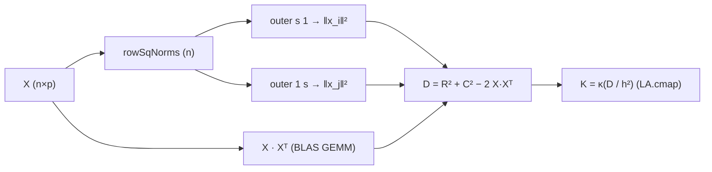

# カーネル回帰 (Nadaraya-Watson / Kernel Ridge)

> 🌐 [English](04-kernel.md) | **日本語**

> パラメトリックモデルを避けた **局所的非線形** 回帰。
> `Hanalyze.Model.Kernel` モジュール。
>
> 関連: [04-spline.ja.md](04-spline.ja.md) (スプライン) / [04-gp.ja.md](04-gp.ja.md) (GP) /
> 理論: [theory-regression-extensions.ja.md](theory-regression-extensions.ja.md)

> 💡 **高レベルの入口**: Kernel Ridge (KRR) は GP・RFF と統合された 1 つの spec
> `gp` / `gpMulti` の **`Krr` 象限** (点予測) として
> `df |-> gp (GPConfig RBF Krr AutoMarginalLik) "x" "y"` で使える (KRR ≡ GP 事後平均)。
> 4 象限の一覧と df 連携は
> [04-gp.ja.md §0 統合 API](04-gp.ja.md#0-統合-api--gp--gpmulti-推奨の入口) を参照。
> 本ページは局所加重平均 (Nadaraya-Watson) を含む低レベルリファレンス。

## 1. 用途
- パラメトリックモデルを避けたい
- 局所的な非線形性
- 軽量な平滑化 (GP より高速)

## 2. API

```haskell
import Hanalyze.Model.Kernel

data Kernel = Gaussian | Epanechnikov | Triangular | Uniform | TriCube

-- Nadaraya-Watson: ŷ(x*) = Σ K_h(x*-xᵢ) yᵢ / Σ K_h(x*-xᵢ)
nwRegression :: Kernel -> Double  -- bandwidth h
             -> Vector Double -> Vector Double  -- xs, ys
             -> Vector Double                   -- predict points
             -> Vector Double                   -- predictions

-- Kernel Ridge: α = (K + λI)⁻¹ y, ŷ(x*) = k(x*)ᵀ α
kernelRidge        :: Kernel -> Double -> Double  -- h, λ
                   -> Vector Double -> Vector Double
                   -> KernelRidgeFit
predictKernelRidge :: KernelRidgeFit -> Vector Double -> Vector Double

-- bandwidth 自動選定 (LOO-CV)
gridSearchBandwidth :: Kernel -> Vector Double -> Vector Double
                    -> [Double] -> (Double, Double)
                    --              best h, best LOO RMSE
```

## 3. ミニマル例

```haskell
-- bandwidth を LOO で選定
let candidates = [0.02, 0.05, 0.10, 0.20]
    (bestH, _) = gridSearchBandwidth Gaussian xs ys candidates

-- Nadaraya-Watson 予測
let yPred = nwRegression Gaussian bestH xs ys xNew

-- Kernel Ridge (より滑らか、λ が増えるほど平滑)
let krFit = kernelRidge Gaussian bestH 0.1 xs ys
    yPredKR = predictKernelRidge krFit xNew
```

## 4. カーネルの選び方

| カーネル | サポート | 使い所 |
|---|---|---|
| `Gaussian` | 無限 | デフォルト、最も滑らか |
| `Epanechnikov` | [-1, 1] | 平均自乗誤差最小理論的 |
| `TriCube` | [-1, 1] | LOWESS で標準 |
| `Triangular` | [-1, 1] | シンプル |
| `Uniform` | [-1, 1] | 移動平均と同じ |

## 5. NW vs Kernel Ridge

- **NW**: 単純な重み付き平均。サンプルが少ない領域で 0/0 リスク
- **Kernel Ridge**: 全サンプルの線形結合。λ で滑らかさ調整、安定性高

## 6. 多次元入力 (`gramMatrixMV` / `kernelRidgeMV` / `nwRegressionMV`)

`Hanalyze.Model.Kernel` は **`X :: LA.Matrix Double` (`n × p`)** を直接受け取る MV (Multi-Variate) API を持つ。「多次元 = 主、1 次元 = 特殊化」という方針。

### 距離行列を BLAS で組む

`Hanalyze.Stat.KernelDist.pairwiseSqDist :: Matrix → Matrix` は

\[ D_{ij} = \|x_i\|^2 + \|x_j\|^2 - 2 x_i^\top x_j \]

を hmatrix の `outer` (ベクトル × ベクトル) と `<>` (= GEMM) だけで構成する。



### MV API

| 関数 | シグネチャ | 役割 |
|---|---|---|
| `gramMatrixMV` | `Kernel → h → X(n×p) → K(n×n)` | radial カーネルの Gram 行列 |
| `gramMatrixMVXY` | `Kernel → h → X*(m×p) → X(n×p) → K*(m×n)` | 予測時の cross Gram |
| `kernelRidgeMV` | `Kernel → h → λ → X(n×p) → Y(n×q) → KernelRidgeFitMV` | 多入力多出力 KR |
| `predictKernelRidgeMV` | `KernelRidgeFitMV → X*(m×p) → Ŷ(m×q)` | 予測 |
| `nwRegressionMV` | `Kernel → h → X(n×p) → Y(n×q) → X*(m×p) → Ŷ(m×q)` | 多入力多出力 NW |

カーネルは半径対称 (Gaussian / Epanechnikov / Triangular / Uniform / TriCube) で、`kernelFromSqDist k s` (= `s = ‖Δ‖² / h²`) を `LA.cmap` で要素ごとに適用する。

### CLI

```bash
# 多次元 KR
hanalyze kernel data.csv "x1 x2 x3" y --method kr --bandwidth 0.5 --lambda 1e-4

# 多次元 NW
hanalyze kernel data.csv "x1 x2 x3" y --method nw --bandwidth 0.5
```

`kr` / `nw` の多次元版は現状 `R²` と `RMSE` を stdout に出すだけで、可視化は出力しない (高次元なので)。可視化が必要なら `--method rff` を使う ([04-rff.ja.md](04-rff.ja.md))。

### 1D 等価性

`kernelRidge` (1D, リスト入力) と `kernelRidgeMV` (`X = n × 1` 行列) は **1e-6 以内** で一致するよう hspec テストで担保。既存 1D ユースケースは破壊されない。

## 関連リンク

- スプライン回帰: [04-spline.ja.md](04-spline.ja.md)
- 正則化回帰: [04-regularized.ja.md](04-regularized.ja.md)
- ガウス過程: [04-gp.ja.md](04-gp.ja.md)
- Random Fourier Features: [04-rff.ja.md](04-rff.ja.md)
- 理論背景: [theory-regression-extensions.ja.md](theory-regression-extensions.ja.md)
