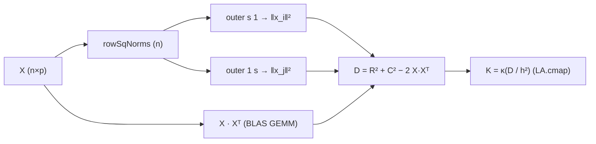

# Kernel Regression (Nadaraya-Watson / Kernel Ridge)

> 🌐 **English** | [日本語](04-kernel.ja.md)

> Local nonlinear regression without parametric models.
> `Hanalyze.Model.Kernel` module.
>
> Related: [04-spline.md](04-spline.md) (Spline) / [04-gp.ja.md](04-gp.ja.md) (GP) /
> Theory: [theory-regression-extensions.ja.md](theory-regression-extensions.ja.md)

> 💡 **High-level entry**: Kernel Ridge (KRR) is integrated with GP and RFF as one spec
> `gp` / `gpMulti` in the **`Krr` quadrant** (point prediction) via
> `df |-> gp (GPConfig RBF Krr AutoMarginalLik) "x" "y"` (KRR ≡ GP posterior mean).
> For the 4-quadrant overview and DataFrame integration, see
> [04-gp.ja.md §0 Integrated API](04-gp.ja.md#0-統合-api--gp--gpmulti-推奨の入口).
> This page is a low-level reference including locally weighted mean (Nadaraya-Watson).

## 1. Use Cases
- Avoid parametric models
- Local nonlinearity
- Lightweight smoothing (faster than GP)

## 2. API

```haskell
import Hanalyze.Model.Kernel

data Kernel = Gaussian | Epanechnikov | Triangular | Uniform | TriCube

-- Nadaraya-Watson: ŷ(x*) = Σ K_h(x*-xᵢ) yᵢ / Σ K_h(x*-xᵢ)
nwRegression :: Kernel -> Double  -- bandwidth h
             -> Vector Double -> Vector Double  -- xs, ys
             -> Vector Double                   -- predict points
             -> Vector Double                   -- predictions

-- Kernel Ridge: α = (K + λI)⁻¹ y, ŷ(x*) = k(x*)ᵀ α
kernelRidge        :: Kernel -> Double -> Double  -- h, λ
                   -> Vector Double -> Vector Double
                   -> KernelRidgeFit
predictKernelRidge :: KernelRidgeFit -> Vector Double -> Vector Double

-- Automatic bandwidth selection (LOO-CV)
gridSearchBandwidth :: Kernel -> Vector Double -> Vector Double
                    -> [Double] -> (Double, Double)
                    --              best h, best LOO RMSE
```

## 3. Minimal Example

```haskell
-- Select bandwidth by LOO
let candidates = [0.02, 0.05, 0.10, 0.20]
    (bestH, _) = gridSearchBandwidth Gaussian xs ys candidates

-- Nadaraya-Watson prediction
let yPred = nwRegression Gaussian bestH xs ys xNew

-- Kernel Ridge (smoother; increases smoothing with λ)
let krFit = kernelRidge Gaussian bestH 0.1 xs ys
    yPredKR = predictKernelRidge krFit xNew
```

## 4. Kernel Selection

| Kernel | Support | Use Case |
|---|---|---|
| `Gaussian` | Infinite | Default, smoothest |
| `Epanechnikov` | [-1, 1] | Theoretically optimal MSE |
| `TriCube` | [-1, 1] | Standard in LOWESS |
| `Triangular` | [-1, 1] | Simple |
| `Uniform` | [-1, 1] | Same as moving average |

## 5. NW vs Kernel Ridge

- **NW**: Simple weighted average. Risk of 0/0 in sparse regions
- **Kernel Ridge**: Linear combination of all samples. Adjust smoothness with λ, high stability

## 6. Multivariate Input (`gramMatrixMV` / `kernelRidgeMV` / `nwRegressionMV`)

`Hanalyze.Model.Kernel` provides an MV (Multi-Variate) API that directly accepts **`X :: LA.Matrix Double` (`n × p`)**. Philosophy: multivariate is primary, univariate is specialization.

### Building Distance Matrix with BLAS

`Hanalyze.Stat.KernelDist.pairwiseSqDist :: Matrix → Matrix` constructs

\[ D_{ij} = \|x_i\|^2 + \|x_j\|^2 - 2 x_i^\top x_j \]

using only hmatrix `outer` (vector × vector) and `<>` (= GEMM).



### MV API

| Function | Signature | Role |
|---|---|---|
| `gramMatrixMV` | `Kernel → h → X(n×p) → K(n×n)` | Gram matrix for radial kernel |
| `gramMatrixMVXY` | `Kernel → h → X*(m×p) → X(n×p) → K*(m×n)` | Cross Gram at prediction |
| `kernelRidgeMV` | `Kernel → h → λ → X(n×p) → Y(n×q) → KernelRidgeFitMV` | Multivariate KR |
| `predictKernelRidgeMV` | `KernelRidgeFitMV → X*(m×p) → Ŷ(m×q)` | Prediction |
| `nwRegressionMV` | `Kernel → h → X(n×p) → Y(n×q) → X*(m×p) → Ŷ(m×q)` | Multivariate NW |

Kernels are radially symmetric (Gaussian / Epanechnikov / Triangular / Uniform / TriCube), applying `kernelFromSqDist k s` (where `s = ‖Δ‖² / h²`) element-wise via `LA.cmap`.

### CLI

```bash
# Multivariate KR
hanalyze kernel data.csv "x1 x2 x3" y --method kr --bandwidth 0.5 --lambda 1e-4

# Multivariate NW
hanalyze kernel data.csv "x1 x2 x3" y --method nw --bandwidth 0.5
```

`kr` / `nw` multivariate versions currently only output `R²` and `RMSE` to stdout without visualization (due to high dimensionality). For visualization, use `--method rff` ([04-rff.md](04-rff.md)).

### 1D Equivalence

`kernelRidge` (1D, list input) and `kernelRidgeMV` (`X = n × 1` matrix) are guaranteed to agree within **1e-6** by hspec tests. Existing 1D use cases are not broken.

## Related Links

- Spline regression: [04-spline.md](04-spline.md)
- Regularized regression: [04-regularized.md](04-regularized.md)
- Gaussian Process: [04-gp.ja.md](04-gp.ja.md)
- Random Fourier Features: [04-rff.md](04-rff.md)
- Theory: [theory-regression-extensions.ja.md](theory-regression-extensions.ja.md)
