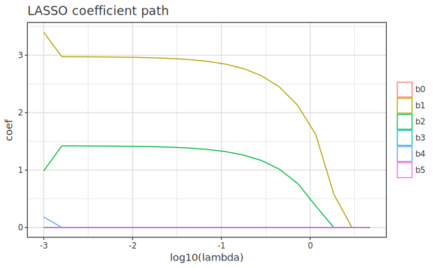
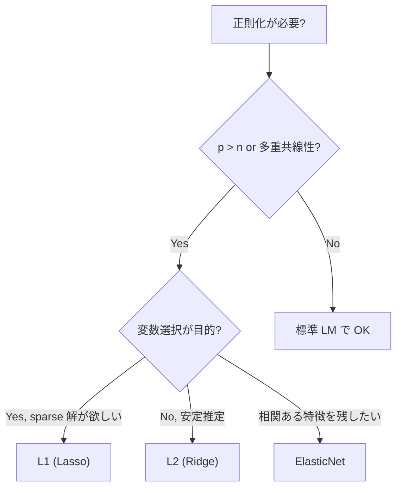

# 正則化回帰 (Ridge / Lasso / ElasticNet)

> 🌐 [English](04-regularized.md) | **日本語**

> p (列数) が n に近い、または p > n のときの安定推定 + 変数選択。
> `Hanalyze.Model.Regularized` モジュール。
>
> 関連: [04-spline.ja.md](04-spline.ja.md) (非線形) / [04-kernel.ja.md](04-kernel.ja.md) (カーネル) /
> 理論: [theory-regression-extensions.ja.md](theory-regression-extensions.ja.md)

> 💡 **高レベルの入口**: 7 種の罰則回帰 (Ridge/Lasso/EN/MCP/SCAD/Adaptive/Group) は
> 統合 spec `df |-> regularized cfg ["x1","x2"] "y"` (+近道 `ridge`/`lasso`/`elasticNet`)
> で当てられる。λ は CV / LOOCV (Ridge) / 1-SE rule で自動選択、X は内部標準化、係数は
> 元スケール。一覧と図は
> [api-guide 02-regression](../api-guide/02-regression.ja.md) の「罰則付き回帰」節を参照。
> 本ページは `fitRegularized` などの低レベル行列 API リファレンス。

## 1. 用途
- p (列数) が n に近い、または p > n
- 多重共線性
- 変数選択 (Lasso)
- 解釈性のある sparse モデル

## 2. API (Haskell 流: 単一関数 + sum-type)

```haskell
import Hanalyze.Model.Regularized

data Penalty = NoPen
             | L2 Double                 -- Ridge: 0.5 λ ||β||²
             | L1 Double                 -- Lasso: λ ||β||₁
             | ElasticNet Double Double  -- λ₁ ||β||₁ + 0.5 λ₂ ||β||²

data RegFit = RegFit { rfBeta :: Vector Double
                     , rfYHat :: Vector Double
                     , rfResid :: Vector Double
                     , rfR2 :: Double
                     , rfPenalty :: Penalty
                     , rfNonZero :: Int    -- |β_j| > 1e-8 の数
                     , rfIters :: Int }    -- CD 反復数

fitRegularized     :: Penalty -> Matrix Double -> Vector Double -> RegFit
predictRegularized :: RegFit -> Matrix Double -> Vector Double

-- 標準化ヘルパ (Lasso/Elastic Net では必須に近い)
standardize       :: Matrix Double -> (Matrix Double, V.Vector Double, V.Vector Double)
                  --                   標準化済 X, 列平均,        列 sd
unstandardizeBeta :: V.Vector Double -> Vector Double -> Vector Double
```

## 3. ミニマル例

```haskell
import Hanalyze.Model.Regularized

let (xStd, _means, sds) = standardize xMat

-- 4 種を一気に試す
let fitOLS    = fitRegularized NoPen                     xStd y
    fitRidge  = fitRegularized (L2 1.0)                  xStd y
    fitLasso  = fitRegularized (L1 0.1)                  xStd y
    fitEN     = fitRegularized (ElasticNet 0.05 0.05)    xStd y

-- 標準化空間の β を元のスケールに戻す
let bOrigLasso = unstandardizeBeta sds (rfBeta fitLasso)
```

λ を変えながら `fitRegularized (L1 λ)` を繰り返すと、正則化パスが得られる。
λ を大きくするほど多くの係数が厳密に 0 へ縮小され、Lasso の変数選択効果が
視覚的に確認できる。



## 4. ペナルティの選び方

| ペナルティ | 特徴 | 推奨用途 |
|---|---|---|
| **L2 (Ridge)** | すべての β を縮小、ゼロにはしない | 多重共線性、安定推定 |
| **L1 (Lasso)** | 不要な β を厳密に 0 (sparse) | 変数選択、解釈性 |
| **ElasticNet** | L1 + L2 の混合 | 相関ある特徴量の中で1つ選ぶより全部少しずつ残す |

## 5. λ の選び方
- **CV (k-fold)** で交差検証 RMSE が最小の λ ([Stat.CV](../stat/04-cv.ja.md))
- ヒューリスティック: λ = σ × √(2 log p / n) (Universal threshold, Donoho)
- 実装は demo を参考に手動グリッド (今後 hanalyze に組み込み予定)

## 6. demo

```bash
cabal run regularized-demo
```

出力例:
```
真の β = [3, -2, 0, 0, 1.5, 0, ...]
Lasso λ=0.20: nonzero = 3/10 ✓ 真の sparse 構造を回復
```

## 7. ペナルティ選択フロー



## 関連リンク

- 標準 LM: [01-lm.ja.md](01-lm.ja.md)
- スプライン回帰: [04-spline.ja.md](04-spline.ja.md)
- カーネル回帰: [04-kernel.ja.md](04-kernel.ja.md)
- ガウス過程 (代替): [04-gp.ja.md](04-gp.ja.md)
- Cross-validation で λ を選ぶ: [Stat.CV](../stat/04-cv.ja.md)
- ベイズ版正則化: `Hanalyze.Model.HBM` で `potential` を使うとカスタムペナルティが書ける
