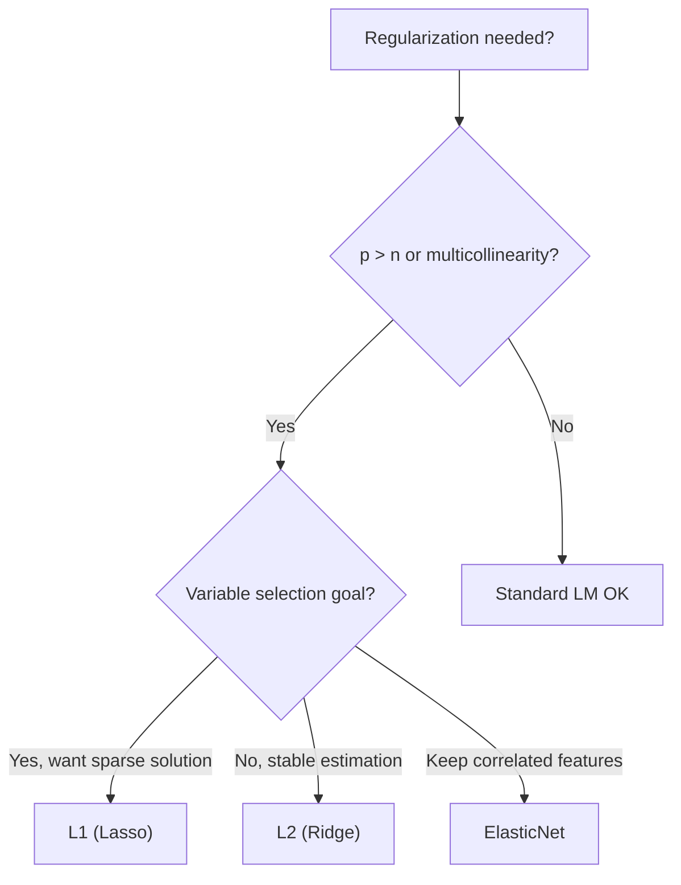

# Regularized Regression (Ridge / Lasso / ElasticNet)

> 🌐 **English** | [日本語](04-regularized.ja.md)

> Stable estimation and variable selection when p (number of columns) is close to n, or p > n.
> `Hanalyze.Model.Regularized` module.
>
> Related: [04-spline.md](04-spline.md) (Nonlinear) / [04-kernel.md](04-kernel.md) (Kernel) /
> Theory: [theory-regression-extensions.ja.md](theory-regression-extensions.ja.md)

> 💡 **High-level entry**: 7 types of penalized regression (Ridge/Lasso/EN/MCP/SCAD/Adaptive/Group) are
> fit with a unified spec `df |-> regularized cfg ["x1","x2"] "y"` (+ shortcuts `ridge`/`lasso`/`elasticNet`).
> λ is automatically selected via CV / LOOCV (Ridge) / 1-SE rule. X is standardized internally, and coefficients
> are back-transformed to original scale. See
> [api-guide 02-regression](../api-guide/02-regression.md) section "Penalized Regression" for overview and plots.
> This page is a low-level matrix API reference for `fitRegularized` and related functions.

## 1. Use Cases
- p (number of columns) is close to n, or p > n
- Multicollinearity
- Variable selection (Lasso)
- Interpretable sparse models

## 2. API (Haskell style: single function + sum-type)

```haskell
import Hanalyze.Model.Regularized

data Penalty = NoPen
             | L2 Double                 -- Ridge: 0.5 λ ||β||²
             | L1 Double                 -- Lasso: λ ||β||₁
             | ElasticNet Double Double  -- λ₁ ||β||₁ + 0.5 λ₂ ||β||²

data RegFit = RegFit { rfBeta :: Vector Double
                     , rfYHat :: Vector Double
                     , rfResid :: Vector Double
                     , rfR2 :: Double
                     , rfPenalty :: Penalty
                     , rfNonZero :: Int    -- Count of |β_j| > 1e-8
                     , rfIters :: Int }    -- Coordinate descent iterations

fitRegularized     :: Penalty -> Matrix Double -> Vector Double -> RegFit
predictRegularized :: RegFit -> Matrix Double -> Vector Double

-- Standardization helper (nearly required for Lasso/Elastic Net)
standardize       :: Matrix Double -> (Matrix Double, V.Vector Double, V.Vector Double)
                  --                   standardized X, column means,  column sds
unstandardizeBeta :: V.Vector Double -> Vector Double -> Vector Double
```

## 3. Minimal Example

```haskell
import Hanalyze.Model.Regularized

let (xStd, _means, sds) = standardize xMat

-- Try 4 types at once
let fitOLS    = fitRegularized NoPen                     xStd y
    fitRidge  = fitRegularized (L2 1.0)                  xStd y
    fitLasso  = fitRegularized (L1 0.1)                  xStd y
    fitEN     = fitRegularized (ElasticNet 0.05 0.05)    xStd y

-- Back-transform β from standardized space to original scale
let bOrigLasso = unstandardizeBeta sds (rfBeta fitLasso)
```

Varying λ and repeatedly calling `fitRegularized (L1 λ)` yields the regularization path.
As λ increases, more coefficients shrink exactly to 0, and Lasso's variable selection effect
becomes visually apparent.


## 4. Choosing a Penalty

| Penalty | Characteristic | Recommended for |
|---|---|---|
| **L2 (Ridge)** | Shrinks all β, never exactly zero | Multicollinearity, stable estimation |
| **L1 (Lasso)** | Shrinks unnecessary β exactly to 0 (sparse) | Variable selection, interpretability |
| **ElasticNet** | Mix of L1 + L2 | Keep all correlated features with small coefficients rather than selecting one |

## 5. Choosing λ
- **CV (k-fold)** cross-validation RMSE minimization ([Stat.CV](../stat/04-cv.md))
- Heuristic: λ = σ × √(2 log p / n) (Universal threshold, Donoho)
- Implementation: manual grid (future integration into hanalyze planned)

## 6. Demo

```bash
cabal run regularized-demo
```

Example output:
```
True β = [3, -2, 0, 0, 1.5, 0, ...]
Lasso λ=0.20: nonzero = 3/10 ✓ Recovers true sparse structure
```

## 7. Penalty Selection Flow



## Related Links

- Standard LM: [01-lm.md](01-lm.md)
- Spline regression: [04-spline.md](04-spline.md)
- Kernel regression: [04-kernel.md](04-kernel.md)
- Gaussian Process (alternative): [04-gp.ja.md](04-gp.ja.md)
- Selecting λ with Cross-validation: [Stat.CV](../stat/04-cv.md)
- Bayesian regularization: Custom penalties can be defined using `potential` in `Hanalyze.Model.HBM`
