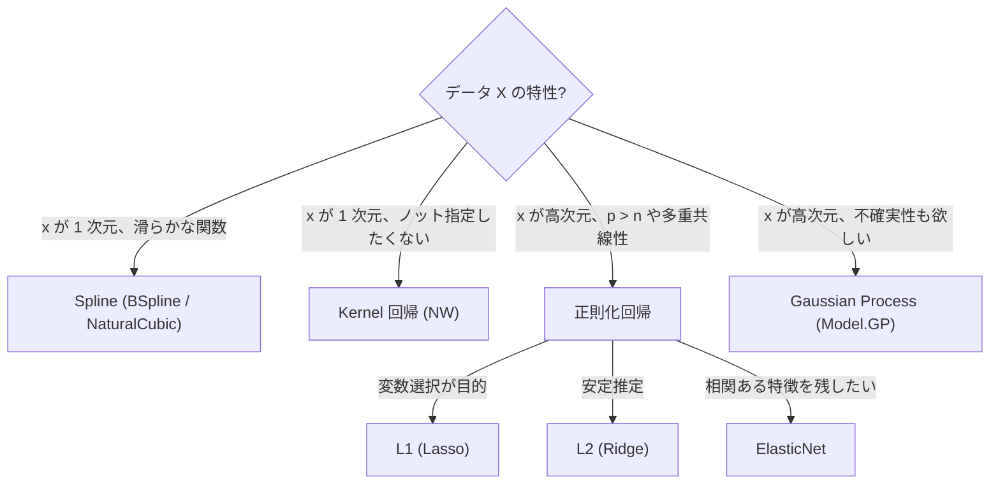

# 回帰拡張 (Spline / Kernel / Regularized) の使い方

> 🌐 [English](04-spline-kernel-regularized.md) | **日本語**

> LM/GLM の上に重ねる **非線形** ・ **非パラメトリック** ・ **正則化** モデル群。
> 理論は [docs/regression/theory-regression-extensions.ja.md](theory-regression-extensions.ja.md) を参照。
> **多出力対応** (Phase M1-M8) は [05-multivariate.ja.md](05-multivariate.ja.md) を参照。

## モジュール早見表

| モジュール | 主な関数 | 用途 |
|---|---|---|
| `Model.Spline` | `fitSpline`, `predictSpline` | 非線形・滑らかな関数 fit |
| `Model.Kernel` | `nwRegression`, `kernelRidge` | 非パラメトリック回帰 |
| `Model.Regularized` | `fitRegularized` | Ridge / Lasso / Elastic Net |

---

## 1. Spline 回帰 (`Model.Spline`)

### 1.1 用途
- 関数形を仮定せず滑らかな曲線を当てたい
- 外挿は控えめ (Natural は端で線形外挿、B-spline は端で 0)

### 1.2 API

```haskell
import Model.Spline

data SplineKind = BSpline Int | NaturalCubic
data SplineFit = SplineFit { sfKind :: SplineKind
                           , sfKnots :: [Double]
                           , sfBeta :: Vector Double
                           , sfResult :: FitResult }

fitSpline     :: SplineKind -> [Double] -> Vector Double -> Vector Double -> SplineFit
predictSpline :: SplineFit -> Vector Double -> Vector Double

equalSpacedKnots :: Int -> Double -> Double -> [Double]
quantileKnots    :: Int -> Vector Double -> [Double]
```

### 1.3 ミニマル例

```haskell
import qualified Data.Vector as V
import Model.Spline

let xs = V.fromList [0, 0.1, 0.2, ..., 1.0]
    ys = V.fromList [...]
    knots = equalSpacedKnots 8 0 1   -- 8 個の等間隔ノット

let fit = fitSpline (BSpline 3) knots xs ys   -- cubic B-spline
let xNew = V.fromList [0, 0.05, 0.10, ..., 1.0]
    yNew = predictSpline fit xNew
```

### 1.4 ノットの選び方

| 状況 | 推奨 |
|---|---|
| データが均等に分布 | `equalSpacedKnots` |
| データに偏りあり | `quantileKnots` (各ビンに同程度のサンプル) |
| ノット数 | n/4 〜 n/8 程度から始める。多すぎると過学習 |

### 1.5 BSpline vs NaturalCubic

| | BSpline | NaturalCubic |
|---|---|---|
| 端の挙動 | 抑え込まれる (0 に近づく) | 線形外挿 |
| 係数次元 | knots + k - 1 | knots 数 |
| 滑らかさ | k 次微分まで連続 | 2 次微分まで連続 |
| 境界での過剰振動 | 少ない | やや出る |

### 1.6 demo

```bash
cabal run spline-demo
# → spline.html (真値=灰破線、B-spline=青、Natural=オレンジ、観測=黒)
```

---

## 2. カーネル回帰 (`Model.Kernel`)

### 2.1 用途
- パラメトリックモデルを避けたい
- 局所的な非線形性
- 軽量な平滑化 (GP より高速)

### 2.2 API

```haskell
import Model.Kernel

data Kernel = Gaussian | Epanechnikov | Triangular | Uniform | TriCube

-- Nadaraya-Watson: ŷ(x*) = Σ K_h(x*-xᵢ) yᵢ / Σ K_h(x*-xᵢ)
nwRegression :: Kernel -> Double  -- bandwidth h
             -> Vector Double -> Vector Double  -- xs, ys
             -> Vector Double                   -- predict points
             -> Vector Double                   -- predictions

-- Kernel Ridge: α = (K + λI)⁻¹ y, ŷ(x*) = k(x*)ᵀ α
kernelRidge        :: Kernel -> Double -> Double  -- h, λ
                   -> Vector Double -> Vector Double
                   -> KernelRidgeFit
predictKernelRidge :: KernelRidgeFit -> Vector Double -> Vector Double

-- bandwidth 自動選定 (LOO-CV)
gridSearchBandwidth :: Kernel -> Vector Double -> Vector Double
                    -> [Double] -> (Double, Double)
                    --              best h, best LOO RMSE
```

### 2.3 ミニマル例

```haskell
-- bandwidth を LOO で選定
let candidates = [0.02, 0.05, 0.10, 0.20]
    (bestH, _) = gridSearchBandwidth Gaussian xs ys candidates

-- Nadaraya-Watson 予測
let yPred = nwRegression Gaussian bestH xs ys xNew

-- Kernel Ridge (より滑らか、λ が増えるほど平滑)
let krFit = kernelRidge Gaussian bestH 0.1 xs ys
    yPredKR = predictKernelRidge krFit xNew
```

### 2.4 カーネルの選び方

| カーネル | サポート | 使い所 |
|---|---|---|
| `Gaussian` | 無限 | デフォルト、最も滑らか |
| `Epanechnikov` | [-1, 1] | 平均自乗誤差最小理論的 |
| `TriCube` | [-1, 1] | LOWESS で標準 |
| `Triangular` | [-1, 1] | シンプル |
| `Uniform` | [-1, 1] | 移動平均と同じ |

### 2.5 NW vs Kernel Ridge

- **NW**: 単純な重み付き平均。サンプルが少ない領域で 0/0 リスク
- **Kernel Ridge**: 全サンプルの線形結合。λ で滑らかさ調整、安定性高

---

## 3. 正則化回帰 (`Model.Regularized`)

### 3.1 用途
- p (列数) が n に近い、または p > n
- 多重共線性
- 変数選択 (Lasso)
- 解釈性のある sparse モデル

### 3.2 API (Haskell 流: 単一関数 + sum-type)

```haskell
import Model.Regularized

data Penalty = NoPen
             | L2 Double                 -- Ridge: 0.5 λ ||β||²
             | L1 Double                 -- Lasso: λ ||β||₁
             | ElasticNet Double Double  -- λ₁ ||β||₁ + 0.5 λ₂ ||β||²

data RegFit = RegFit { rfBeta :: Vector Double
                     , rfYHat :: Vector Double
                     , rfResid :: Vector Double
                     , rfR2 :: Double
                     , rfPenalty :: Penalty
                     , rfNonZero :: Int    -- |β_j| > 1e-8 の数
                     , rfIters :: Int }    -- CD 反復数

fitRegularized     :: Penalty -> Matrix Double -> Vector Double -> RegFit
predictRegularized :: RegFit -> Matrix Double -> Vector Double

-- 標準化ヘルパ (Lasso/Elastic Net では必須に近い)
standardize       :: Matrix Double -> (Matrix Double, V.Vector Double, V.Vector Double)
                  --                   標準化済 X, 列平均,        列 sd
unstandardizeBeta :: V.Vector Double -> Vector Double -> Vector Double
```

### 3.3 ミニマル例

```haskell
import Model.Regularized

let (xStd, _means, sds) = standardize xMat

-- 4 種を一気に試す
let fitOLS    = fitRegularized NoPen                     xStd y
    fitRidge  = fitRegularized (L2 1.0)                  xStd y
    fitLasso  = fitRegularized (L1 0.1)                  xStd y
    fitEN     = fitRegularized (ElasticNet 0.05 0.05)    xStd y

-- 標準化空間の β を元のスケールに戻す
let bOrigLasso = unstandardizeBeta sds (rfBeta fitLasso)
```

### 3.4 ペナルティの選び方

| ペナルティ | 特徴 | 推奨用途 |
|---|---|---|
| **L2 (Ridge)** | すべての β を縮小、ゼロにはしない | 多重共線性、安定推定 |
| **L1 (Lasso)** | 不要な β を厳密に 0 (sparse) | 変数選択、解釈性 |
| **ElasticNet** | L1 + L2 の混合 | 相関ある特徴量の中で1つ選ぶより全部少しずつ残す |

### 3.5 λ の選び方
- **CV (k-fold)** で交差検証 RMSE が最小の λ
- ヒューリスティック: λ = σ × √(2 log p / n) (Universal threshold, Donoho)
- 実装は demo を参考に手動グリッド (今後 hanalyze に組み込み予定)

### 3.6 demo

```bash
cabal run regularized-demo
```

出力例:
```
真の β = [3, -2, 0, 0, 1.5, 0, ...]
Lasso λ=0.20: nonzero = 3/10 ✓ 真の sparse 構造を回復
```

---

## 4. 統合: どれを選ぶか



---

## 関連リンク

- 理論: [docs/regression/theory-regression-extensions.ja.md](theory-regression-extensions.ja.md)
- 既存の LM/GLM: [docs/01-quickstart.ja.md](01-quickstart.ja.md), `Model.LM` / `Model.GLM`
- Bayesian 版の正則化: `Model.HBM` で `potential` (Phase A) を使うとカスタムペナルティが書ける
