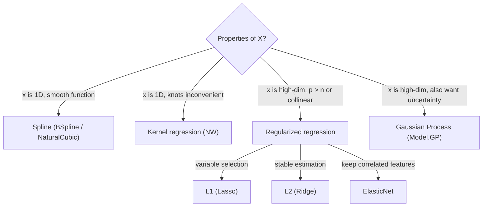

# Regression extensions (Spline / Kernel / Regularized) — usage

> 🌐 **English** | [日本語](04-spline-kernel-regularized.ja.md)

> **Nonlinear**, **non-parametric**, and **regularized** models layered on top of LM/GLM.
> Theory: [docs/regression/theory-regression-extensions.md](theory-regression-extensions.md).
> **Multi-output variants** (Phase M1-M8) are documented in [05-multivariate.md](05-multivariate.md).

## Module quick reference

| Module | Main functions | Purpose |
|---|---|---|
| `Model.Spline` | `fitSpline`, `predictSpline` | Nonlinear, smooth-function fits |
| `Model.Kernel` | `nwRegression`, `kernelRidge` | Non-parametric regression |
| `Model.Regularized` | `fitRegularized` | Ridge / Lasso / Elastic Net |

---

## 1. Spline regression (`Model.Spline`)

### 1.1 When to use
- You want a smooth fit without committing to a functional form.
- Conservative extrapolation (Natural is linear at the boundary; B-spline tends to zero).

### 1.2 API

```haskell
import Model.Spline

data SplineKind = BSpline Int | NaturalCubic
data SplineFit = SplineFit { sfKind :: SplineKind
                           , sfKnots :: [Double]
                           , sfBeta :: Vector Double
                           , sfResult :: FitResult }

fitSpline     :: SplineKind -> [Double] -> Vector Double -> Vector Double -> SplineFit
predictSpline :: SplineFit -> Vector Double -> Vector Double

equalSpacedKnots :: Int -> Double -> Double -> [Double]
quantileKnots    :: Int -> Vector Double -> [Double]
```

### 1.3 Minimal example

```haskell
import qualified Data.Vector as V
import Model.Spline

let xs = V.fromList [0, 0.1, 0.2, ..., 1.0]
    ys = V.fromList [...]
    knots = equalSpacedKnots 8 0 1   -- 8 equispaced knots

let fit = fitSpline (BSpline 3) knots xs ys   -- cubic B-spline
let xNew = V.fromList [0, 0.05, 0.10, ..., 1.0]
    yNew = predictSpline fit xNew
```

### 1.4 Knot placement

| Situation | Suggestion |
|---|---|
| Data uniformly distributed | `equalSpacedKnots` |
| Data is skewed | `quantileKnots` (equal sample size per bin) |
| Number of knots | Start at n/4 to n/8. Too many → overfitting. |

### 1.5 BSpline vs NaturalCubic

| | BSpline | NaturalCubic |
|---|---|---|
| Boundary behaviour | Suppressed (approaches 0) | Linear extrapolation |
| Coefficient dimension | knots + k - 1 | number of knots |
| Smoothness | up to k-th derivative continuous | up to 2nd derivative continuous |
| Boundary oscillation | Less | Slight |

### 1.6 Demo

```bash
cabal run spline-demo
# → spline.html (truth = grey dashed, B-spline = blue, Natural = orange, observations = black)
```

---

## 2. Kernel regression (`Model.Kernel`)

### 2.1 When to use
- You want to avoid parametric models.
- Local nonlinearities.
- Lightweight smoothing (faster than GP).

### 2.2 API

```haskell
import Model.Kernel

data Kernel = Gaussian | Epanechnikov | Triangular | Uniform | TriCube

-- Nadaraya-Watson: ŷ(x*) = Σ K_h(x*-xᵢ) yᵢ / Σ K_h(x*-xᵢ)
nwRegression :: Kernel -> Double  -- bandwidth h
             -> Vector Double -> Vector Double  -- xs, ys
             -> Vector Double                   -- prediction points
             -> Vector Double                   -- predictions

-- Kernel Ridge: α = (K + λI)⁻¹ y, ŷ(x*) = k(x*)ᵀ α
kernelRidge        :: Kernel -> Double -> Double  -- h, λ
                   -> Vector Double -> Vector Double
                   -> KernelRidgeFit
predictKernelRidge :: KernelRidgeFit -> Vector Double -> Vector Double

-- Auto-tuning of bandwidth (LOO-CV)
gridSearchBandwidth :: Kernel -> Vector Double -> Vector Double
                    -> [Double] -> (Double, Double)
                    --              best h, best LOO RMSE
```

### 2.3 Minimal example

```haskell
-- Pick bandwidth via LOO
let candidates = [0.02, 0.05, 0.10, 0.20]
    (bestH, _) = gridSearchBandwidth Gaussian xs ys candidates

-- Nadaraya-Watson prediction
let yPred = nwRegression Gaussian bestH xs ys xNew

-- Kernel Ridge (smoother; larger λ → more smoothing)
let krFit = kernelRidge Gaussian bestH 0.1 xs ys
    yPredKR = predictKernelRidge krFit xNew
```

### 2.4 Choosing a kernel

| Kernel | Support | Use case |
|---|---|---|
| `Gaussian` | infinite | default, smoothest |
| `Epanechnikov` | [-1, 1] | theoretically optimal MISE |
| `TriCube` | [-1, 1] | LOWESS standard |
| `Triangular` | [-1, 1] | simple |
| `Uniform` | [-1, 1] | moving average |

### 2.5 NW vs Kernel Ridge

- **NW**: simple weighted average. Risk of 0/0 in sparsely populated regions.
- **Kernel Ridge**: linear combination of all samples. λ controls smoothness; very stable.

---

## 3. Regularized regression (`Model.Regularized`)

### 3.1 When to use
- p (number of columns) close to or exceeding n.
- Multicollinearity.
- Variable selection (Lasso).
- Interpretable sparse models.

### 3.2 API (Haskell flavour: single function + sum-type)

```haskell
import Model.Regularized

data Penalty = NoPen
             | L2 Double                 -- Ridge: 0.5 λ ||β||²
             | L1 Double                 -- Lasso: λ ||β||₁
             | ElasticNet Double Double  -- λ₁ ||β||₁ + 0.5 λ₂ ||β||²

data RegFit = RegFit { rfBeta :: Vector Double
                     , rfYHat :: Vector Double
                     , rfResid :: Vector Double
                     , rfR2 :: Double
                     , rfPenalty :: Penalty
                     , rfNonZero :: Int    -- count of |β_j| > 1e-8
                     , rfIters :: Int }    -- CD iterations

fitRegularized     :: Penalty -> Matrix Double -> Vector Double -> RegFit
predictRegularized :: RegFit -> Matrix Double -> Vector Double

-- Standardisation helpers (effectively required for Lasso/Elastic Net)
standardize       :: Matrix Double -> (Matrix Double, V.Vector Double, V.Vector Double)
                  --                   standardised X, column means, column SDs
unstandardizeBeta :: V.Vector Double -> Vector Double -> Vector Double
```

### 3.3 Minimal example

```haskell
import Model.Regularized

let (xStd, _means, sds) = standardize xMat

-- Try all four at once
let fitOLS    = fitRegularized NoPen                     xStd y
    fitRidge  = fitRegularized (L2 1.0)                  xStd y
    fitLasso  = fitRegularized (L1 0.1)                  xStd y
    fitEN     = fitRegularized (ElasticNet 0.05 0.05)    xStd y

-- Restore standardised β to the original scale
let bOrigLasso = unstandardizeBeta sds (rfBeta fitLasso)
```

### 3.4 Choosing a penalty

| Penalty | Property | Recommended use |
|---|---|---|
| **L2 (Ridge)** | shrinks every β; never sets to zero | multicollinearity, stable estimation |
| **L1 (Lasso)** | drives unnecessary β to exactly 0 (sparse) | variable selection, interpretability |
| **ElasticNet** | mix of L1 + L2 | keep correlated features as a group rather than picking one |

### 3.5 Choosing λ
- **CV (k-fold)**: λ that minimises CV RMSE.
- Heuristic: λ = σ × √(2 log p / n) (Universal threshold, Donoho).
- See the demo for a manual grid search (built-in helper planned).

### 3.6 Demo

```bash
cabal run regularized-demo
```

Sample output:
```
True β = [3, -2, 0, 0, 1.5, 0, ...]
Lasso λ=0.20: nonzero = 3/10 ✓ recovers the true sparse structure
```

---

## 4. Putting it together: which to pick



---

## Related links

- Theory: [docs/regression/theory-regression-extensions.md](theory-regression-extensions.md)
- LM/GLM basics: [docs/01-quickstart.md](../01-quickstart.md), `Model.LM` / `Model.GLM`
- Bayesian regularization: write custom penalties via `Model.HBM`'s `potential` primitive.
